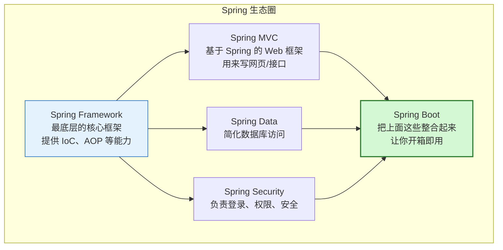
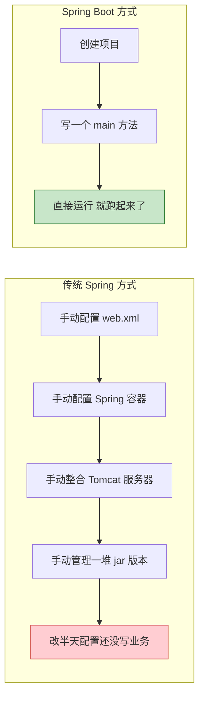
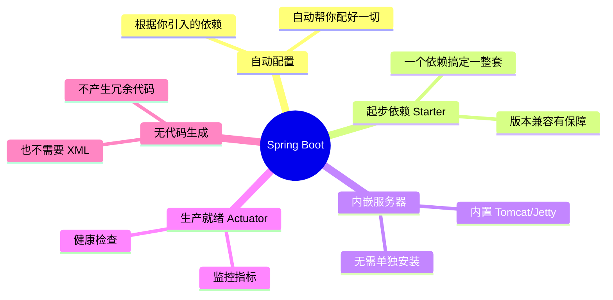
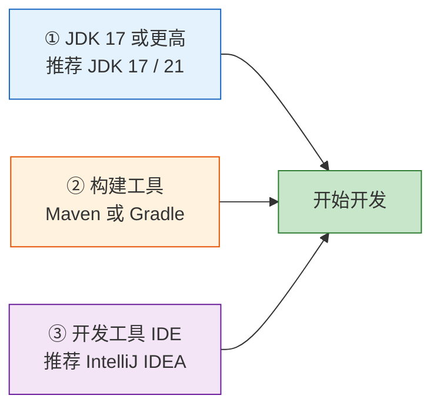
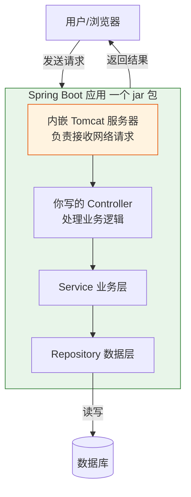
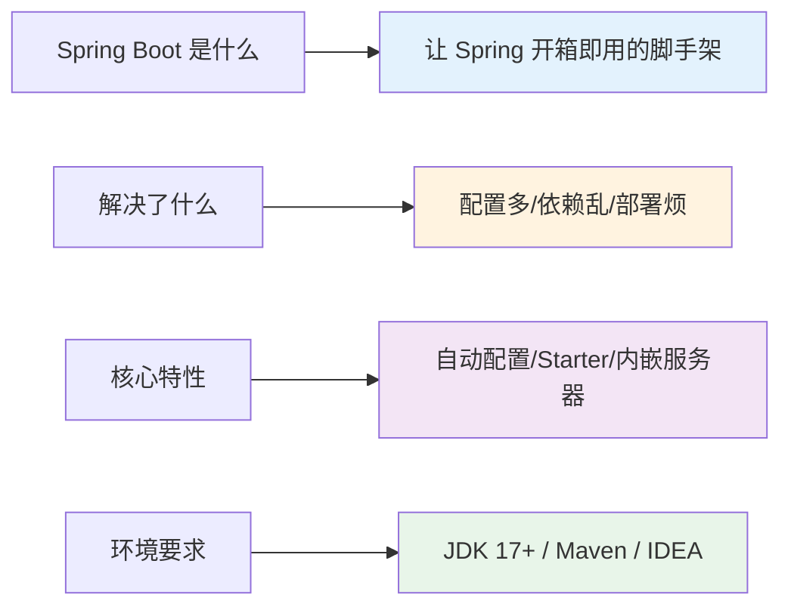

# 第 01 章：Spring Boot 简介与环境搭建

> 本章目标：搞清楚 **Spring Boot 到底是什么、为什么大家都在用**，并**把开发环境装好**，为后面写代码做准备。

---

## 1.1 先认识一下 Spring 家族

在学 Spring Boot 之前，我们要先知道它在整个 Spring 生态里的位置。很多初学者会把 Spring、Spring MVC、Spring Boot 搞混，我们用一张图理清关系：



一句话总结：

- **Spring Framework** 是地基，功能强大但配置繁琐。
- **Spring Boot** 是站在 Spring Framework 肩膀上的"脚手架"，帮你把繁琐的配置都做好了，你只管写业务代码。

> 📌 **Spring Boot 不是要取代 Spring，而是让 Spring 更好用。**

---

## 1.2 没有 Spring Boot 的日子有多苦？

我们来对比一下。假设要做一个能在浏览器访问的 Web 项目：



**Spring Boot 帮你解决了三大痛点：**

| 痛点 | 传统 Spring | Spring Boot |
| --- | --- | --- |
| 配置太多 | 大量 XML / Java 配置 | **自动配置**，几乎零配置 |
| 依赖版本乱 | 自己一个个查版本、怕冲突 | **起步依赖（Starter）**，版本自动搭配好 |
| 部署麻烦 | 要装外部 Tomcat | **内嵌服务器**，打成 jar 直接 `java -jar` 运行 |

---

## 1.3 Spring Boot 的核心特性



---

## 1.4 环境准备清单

学习 Spring Boot 3.5，你需要准备三样东西：



> ⚠️ **重点：Spring Boot 3.x 要求 JDK 17 起步！** 如果你还在用 JDK 8 或 11，必须升级，否则项目无法运行。

### ① 安装并检查 JDK

安装后，打开命令行（Windows 是 CMD/PowerShell，Mac/Linux 是终端），输入：

```bash
java -version
```

如果看到类似下面的输出（版本号 ≥ 17），说明 JDK 装好了：

```text
openjdk version "17.0.10" 2024-01-16
OpenJDK Runtime Environment (build 17.0.10+7)
OpenJDK 64-Bit Server VM (build 17.0.10+7, mixed mode, sharing)
```

> 💡 JDK 下载推荐：[Eclipse Temurin (Adoptium)](https://adoptium.net/) 或 [Oracle JDK](https://www.oracle.com/java/technologies/downloads/)。

### ② 关于 Maven / Gradle

它们是**构建工具**，负责帮你下载依赖、编译、打包。二选一即可，本教程主要用 **Maven**（初学者更常见、更直观）。

- 好消息：如果你用 IntelliJ IDEA，它**自带 Maven**，通常不用单独安装。
- 检查命令（如果单独装了）：`mvn -version`

### ③ 安装 IDE

强烈推荐 **IntelliJ IDEA**（社区版免费就够用了），对 Spring Boot 支持最好。也可以用 VS Code + Java 插件、或 Eclipse。

---

## 1.5 Spring Boot 应用是怎么跑起来的？（整体预览）

在正式写代码前，先建立一个宏观印象。一个 Spring Boot 应用运行时大概是这样的：



看不懂细节没关系，这只是让你有个整体印象。**注意最关键的一点**：Tomcat 服务器是**内嵌**在 jar 包里的，这就是为什么 Spring Boot 应用可以直接 `java -jar` 运行，不需要你另外安装服务器。

---

## 1.6 本章小结



- Spring Boot 是简化 Spring 开发的框架，核心是**自动配置**、**起步依赖**和**内嵌服务器**。
- 开发环境需要 **JDK 17+**、**Maven（或 Gradle）** 和一个 **IDE**。
- 应用打包成 jar，内嵌服务器，可直接运行。

---

➡️ 环境准备好了，下一章我们就来 **[创建第一个 Spring Boot 应用](./02-第一个SpringBoot应用.md)**，让程序真正跑起来！
