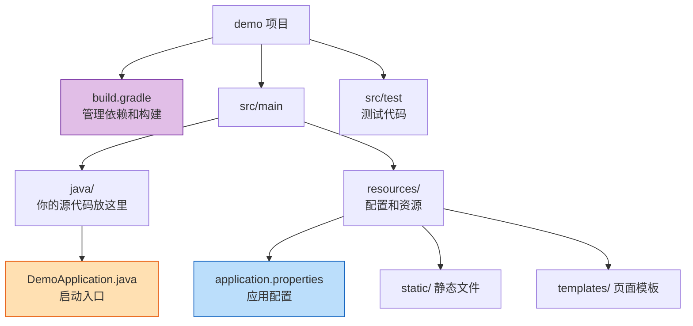
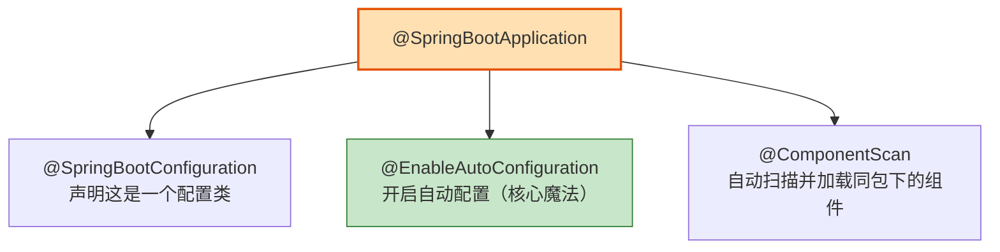
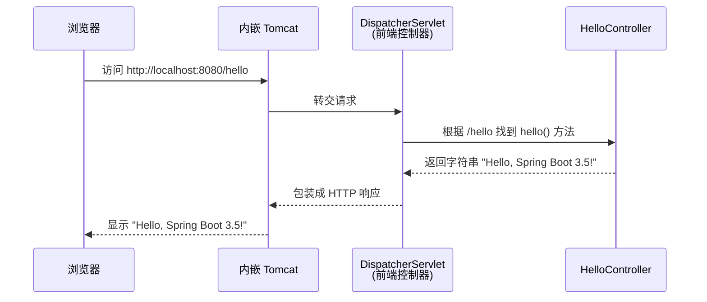
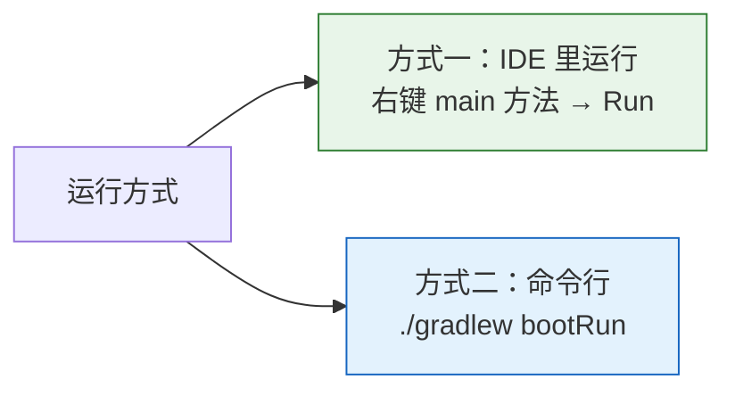
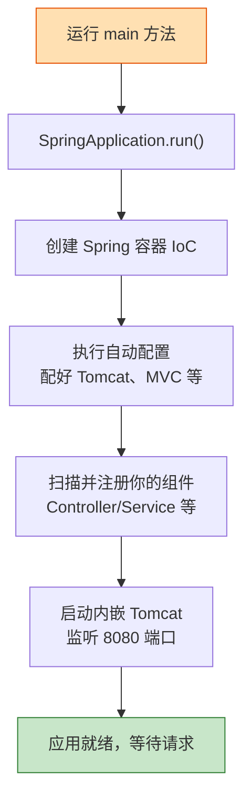

# 第 02 章：第一个 Spring Boot 应用

> 本章目标：**亲手创建并运行**你的第一个 Spring Boot 项目，理解项目结构，并写出一个能在浏览器访问的 "Hello World"。

---

## 2.1 用 Spring Initializr 创建项目

Spring 官方提供了一个在线工具 **[Spring Initializr](https://start.spring.io)**，帮你快速生成项目骨架。它就像点外卖：你选好"配料"，它把项目"打包"给你。


### 创建时的参数选择

在 [start.spring.io](https://start.spring.io) 页面按下表填写：

| 选项 | 推荐值 | 说明 |
| --- | --- | --- |
| Project | **Gradle - Groovy** | 构建工具，本教程用 Gradle |
| Language | **Java** | 编程语言 |
| Spring Boot | **3.5.x** | 选最新的 3.5 稳定版 |
| Group | `com.example` | 公司/组织的域名倒写 |
| Artifact | `demo` | 项目名 |
| Packaging | **Jar** | 打包方式 |
| Java | **21** | JDK 版本 |
| Dependencies | **Spring Web** | 先加这一个，用来写 Web 接口 |

> 💡 **IntelliJ IDEA 也内置了 Spring Initializr**：`File → New → Project → Spring Boot`，参数一模一样，更方便。

---

## 2.2 看懂项目结构

项目生成后，打开来长这样：

```text
demo/
├── src/
│   ├── main/
│   │   ├── java/
│   │   │   └── com/example/demo/
│   │   │       └── DemoApplication.java   ← 程序入口（有 main 方法）
│   │   └── resources/
│   │       ├── static/          ← 存放静态资源（图片/css/js）
│   │       ├── templates/       ← 存放页面模板
│   │       └── application.properties  ← 配置文件（重要！）
│   └── test/
│       └── java/...             ← 测试代码
├── build.gradle                 ← Gradle 构建脚本（管理依赖，核心！）
├── settings.gradle              ← Gradle 项目设置（项目名等）
├── gradlew / gradlew.bat        ← Gradle Wrapper 脚本（免安装 Gradle）
└── ...
```

用图表示各部分的职责：



---

## 2.3 解读启动类 DemoApplication

打开 `DemoApplication.java`，内容很简单：

```java
package com.example.demo;

import org.springframework.boot.SpringApplication;
import org.springframework.boot.autoconfigure.SpringBootApplication;

@SpringBootApplication  // ← 核心注解，一个顶三个
public class DemoApplication {

    public static void main(String[] args) {
        // 这一行就启动了整个应用（包括内嵌的 Tomcat）
        SpringApplication.run(DemoApplication.class, args);
    }
}
```

### `@SpringBootApplication` 是什么？

这个注解是 Spring Boot 的"总开关"，它其实是三个注解的组合：



- **@EnableAutoConfiguration**：开启"自动配置"，这是让 Spring Boot 开箱即用的关键（第 04 章细讲）。
- **@ComponentScan**：自动扫描当前包及子包，把你写的 Controller、Service 等自动装进容器（第 03 章细讲）。

> ⚠️ **注意**：因为 `@ComponentScan` 默认只扫描"启动类所在包及其子包"，所以**你写的所有代码都要放在 `com.example.demo` 包或它的子包下**，否则不会被扫描到。

---

## 2.4 编写第一个接口：Hello World

现在我们来写一个能在浏览器访问的接口。在 `com.example.demo` 包下新建一个类 `HelloController`：

```java
package com.example.demo;

import org.springframework.web.bind.annotation.GetMapping;
import org.springframework.web.bind.annotation.RestController;

@RestController  // 表示这是一个处理 Web 请求的控制器，返回的数据直接作为响应内容
public class HelloController {

    @GetMapping("/hello")  // 表示当浏览器访问 /hello 这个地址时，执行下面的方法
    public String hello() {
        return "Hello, Spring Boot 3.5!";
    }
}
```

代码很短，但背后发生了什么？看时序图：



---

## 2.5 运行项目

有两种常见方式运行：



运行成功后，你会在控制台看到经典的 Spring Boot 启动 Banner 和日志：

```text
  .   ____          _            __ _ _
 /\\ / ___'_ __ _ _(_)_ __  __ _ \ \ \ \
( ( )\___ | '_ | '_| | '_ \/ _` | \ \ \ \
 \\/  ___)| |_)| | | | | || (_| |  ) ) ) )
  '  |____| .__|_| |_|_| |_\__, | / / / /
 =========|_|==============|___/=/_/_/_/

 :: Spring Boot ::                (v3.5.0)

... Tomcat started on port 8080 (http)
... Started DemoApplication in 1.234 seconds
```

看到 `Tomcat started on port 8080` 和 `Started DemoApplication`，就说明**启动成功**了！

现在打开浏览器，访问：**http://localhost:8080/hello**

你会看到页面显示：

```text
Hello, Spring Boot 3.5!
```

🎉 恭喜！你的第一个 Spring Boot 应用跑起来了！

---

## 2.6 启动全流程回顾



---

## 2.7 本章小结

- 用 **Spring Initializr** 快速创建项目，先加 **Spring Web** 依赖。
- 启动类上的 **`@SpringBootApplication`** 是三合一注解，其中 `@EnableAutoConfiguration` 和 `@ComponentScan` 最关键。
- 你写的代码要放在**启动类所在包或子包**下。
- 用 **`@RestController` + `@GetMapping`** 就能写出一个 Web 接口。
- 默认端口是 **8080**。

---

➡️ 你可能好奇：为什么写个 `@RestController` 就能被识别？容器是怎么"找到"并管理这些类的？下一章我们揭开 Spring 的灵魂——**[IoC 与依赖注入](./03-核心概念-IoC与依赖注入.md)**。
