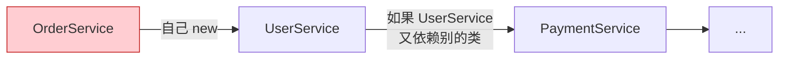
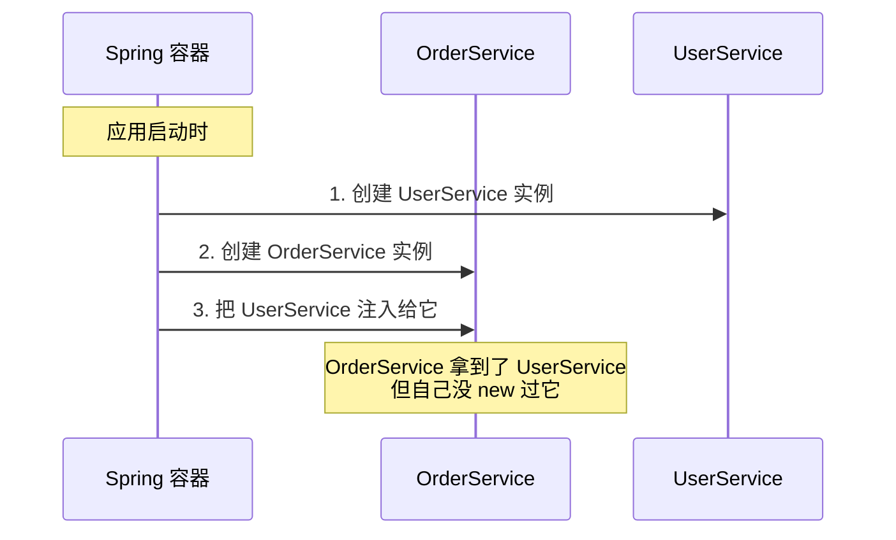
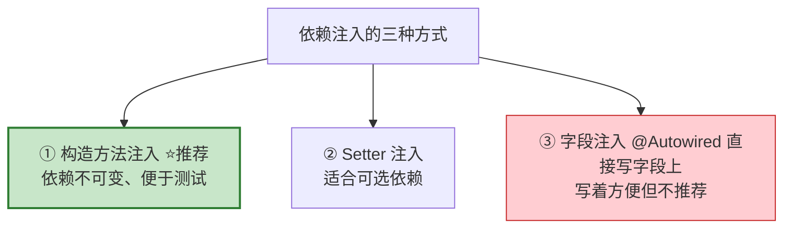
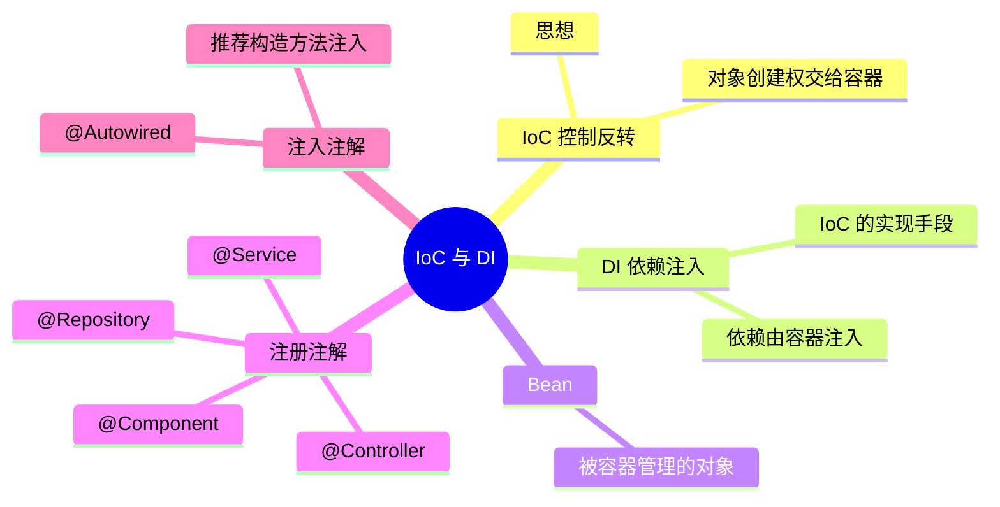

# 第 03 章：核心概念 —— IoC 与依赖注入

> 本章目标：理解 Spring 的**灵魂概念**——控制反转（IoC）和依赖注入（DI）。这是整个 Spring 的地基，弄懂它，后面一通百通。

---

## 3.1 一个生活化的比喻

先别看代码，我们讲个故事。假设你要喝咖啡：

```mermaid
flowchart LR
    subgraph 传统方式：自己动手
        A1[自己买豆子] --> A2[自己磨豆] --> A3[自己烧水] --> A4[自己冲泡]
    end

    subgraph IoC 方式：交给咖啡店
        B1[你只说：来杯咖啡] --> B2[咖啡店帮你做好] --> B3[直接端给你]
    end

    style A4 fill:#ffcdd2,stroke:#c62828
    style B3 fill:#c8e6c9,stroke:#2e7d32
```

- **传统方式**：所有东西你自己造（在代码里就是 `new` 对象）。
- **IoC 方式**：你不自己造对象了，而是交给一个"管家"（Spring 容器）来创建和管理，你需要时它直接给你。

**这个"把创建对象的控制权交出去"的思想，就叫控制反转（IoC，Inversion of Control）。**

---

## 3.2 传统写法的问题

看一段传统代码。假设 `OrderService`（订单服务）需要用到 `UserService`（用户服务）：

```java
public class OrderService {
    // 自己 new，把两个类死死绑在一起
    private UserService userService = new UserService();

    public void createOrder() {
        userService.checkUser();
        // ... 下单逻辑
    }
}
```

问题在哪？看依赖关系图：



- **耦合太紧**：`OrderService` 和 `UserService` 焊死了，想换一个实现就得改代码。
- **难以测试**：测试 `OrderService` 时没法用"假的" `UserService` 替换。
- **对象管理混乱**：每个类都自己 new，对象满天飞，没人统一管理。

---

## 3.3 IoC 容器：统一的"对象管家"

Spring 提供了一个 **IoC 容器**（也叫 Spring 容器）。它做两件事：

```mermaid
flowchart TD
    subgraph IoC 容器
        direction TB
        B1[UserService 实例]
        B2[OrderService 实例]
        B3[PaymentService 实例]
    end

    A[① 创建对象<br/>把对象都造好放进容器] --> IoC 容器
    IoC 容器 --> C[② 组装对象<br/>谁需要谁，自动注入进去]

    style A fill:#e3f2fd,stroke:#1565c0
    style C fill:#e8f5e9,stroke:#2e7d32
```

- 容器里的这些被管理的对象，有个专门的名字，叫 **Bean**。
- 你把类"注册"给容器（用注解），容器就负责创建它们、并在需要时自动组装。

---

## 3.4 依赖注入（DI）：IoC 的具体实现方式

**控制反转（IoC）是思想，依赖注入（DI，Dependency Injection）是实现这个思想的具体手段。**

意思是：一个对象需要的其它对象（依赖），不用自己造，而是由容器"注入"进来。



---

## 3.5 三个关键注解：注册 Bean

怎么把类交给容器管理？在类上加注解即可。常见的有：

```mermaid
flowchart TD
    A["@Component<br/>通用组件（最基础）"] --> B["@Service<br/>用于业务逻辑层"]
    A --> C["@Repository<br/>用于数据访问层"]
    A --> D["@Controller / @RestController<br/>用于 Web 控制层"]

    Note[本质上后三个都是<br/>@Component 的特化<br/>语义更清晰]

    style A fill:#ffe0b2,stroke:#e65100
    style B fill:#e8f5e9,stroke:#2e7d32
    style C fill:#e3f2fd,stroke:#1565c0
    style D fill:#f3e5f5,stroke:#6a1b9a
```

它们的功能都是"把这个类注册成一个 Bean"，区别只是**语义**（表明这个类是干嘛的），方便阅读和分层。

```java
@Service   // 声明这是一个业务层的 Bean，容器会自动创建它
public class UserService {
    public void checkUser() {
        System.out.println("检查用户...");
    }
}
```

---

## 3.6 用 @Autowired 完成注入

注册好 Bean 后，用 **`@Autowired`** 告诉容器"请把这个依赖注入给我"。推荐用**构造方法注入**（现代 Spring 的最佳实践）：

```java
@Service
public class OrderService {

    private final UserService userService;

    // 构造方法注入：容器创建 OrderService 时，会自动把 UserService 传进来
    // 注意：只有一个构造方法时，@Autowired 可以省略
    public OrderService(UserService userService) {
        this.userService = userService;
    }

    public void createOrder() {
        userService.checkUser();  // 直接用，不用自己 new
        System.out.println("创建订单成功！");
    }
}
```

### 三种注入方式对比



| 方式 | 写法 | 评价 |
| --- | --- | --- |
| 构造方法注入 | 在构造函数参数里 | ⭐ **官方推荐**，依赖明确、可用 `final`、易测试 |
| Setter 注入 | 在 set 方法上加 `@Autowired` | 适合"可有可无"的依赖 |
| 字段注入 | 直接在字段上加 `@Autowired` | 最省事，但难测试、不推荐 |

---

## 3.7 完整流程串起来

我们把整个过程用一张图串起来：

```mermaid
flowchart TD
    A[应用启动] --> B[组件扫描<br/>@ComponentScan 找到所有带注解的类]
    B --> C[创建 Bean<br/>把 UserService、OrderService 都造出来]
    C --> D[依赖注入<br/>把 UserService 注入到 OrderService]
    D --> E[放入容器管理<br/>随用随取]
    E --> F[需要时从容器获取使用]

    style A fill:#ffe0b2,stroke:#e65100
    style F fill:#c8e6c9,stroke:#2e7d32
```

**回到第 02 章的疑问**：为什么写个 `@RestController` 就能被识别？现在你懂了——`@ComponentScan` 扫描到它，把它注册成 Bean，交给容器管理，请求来了容器就用它来处理。

---

## 3.8 常见问题

> **Q：@Component 和 @Service 到底有什么区别？**
> A：功能上几乎没区别，都是注册 Bean。区别是**语义**：`@Service` 一看就知道是业务层，`@Repository` 是数据层。分层清晰，代码好读。此外 `@Repository` 还会把数据库异常转换成 Spring 统一的异常。

> **Q：一个接口有多个实现类，注入哪个？**
> A：会报错（不知道选哪个）。可以用 `@Primary` 指定默认，或用 `@Qualifier("bean名字")` 精确指定。

---

## 3.9 本章小结



- **IoC（控制反转）** 是思想：对象的创建和管理交给 Spring 容器。
- **DI（依赖注入）** 是手段：依赖由容器自动注入，而非自己 `new`。
- 被容器管理的对象叫 **Bean**，用 `@Component`/`@Service` 等注解注册。
- 用 `@Autowired` 注入依赖，**推荐构造方法注入**。

---

➡️ 理解了容器和 Bean，下一章我们来揭开 Spring Boot 最神奇的部分——**[自动配置与起步依赖](./04-自动配置与起步依赖.md)**，看看它是怎么做到"开箱即用"的。
