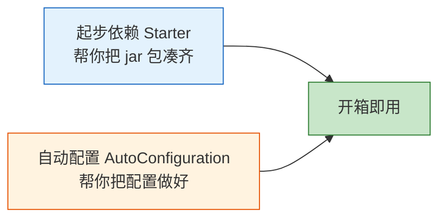
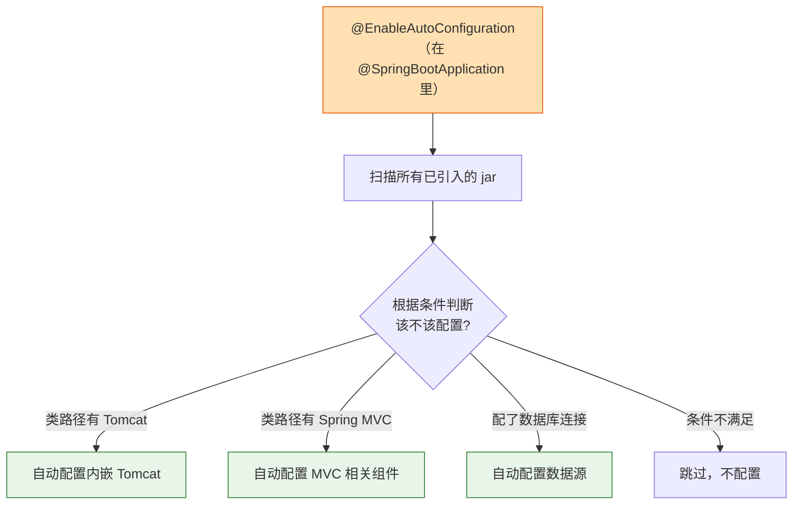
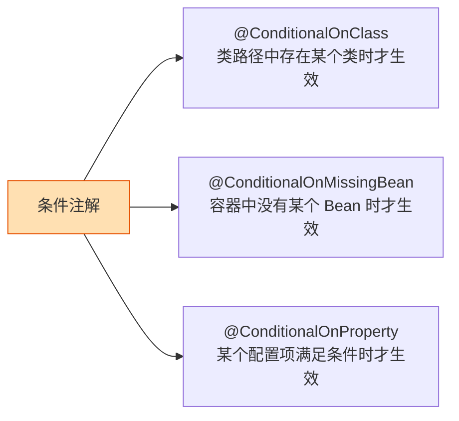
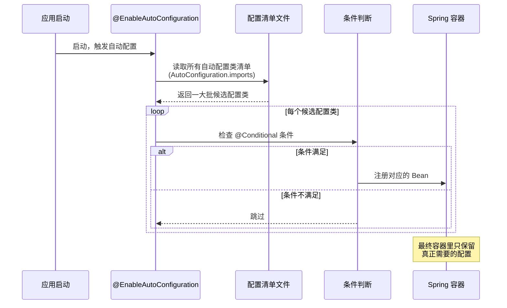
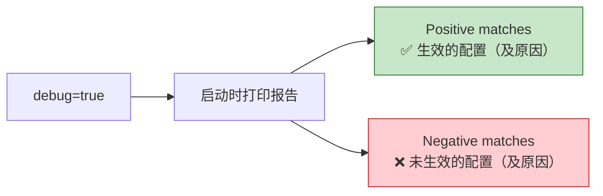
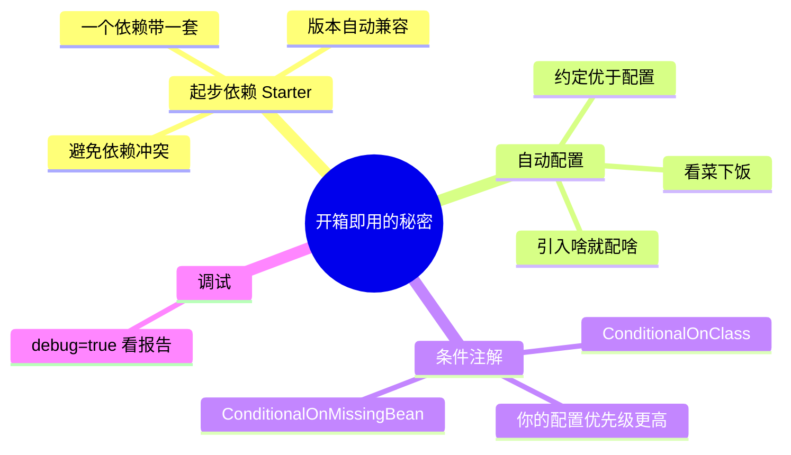

# 第 04 章：自动配置与起步依赖

> 本章目标：搞懂 Spring Boot "开箱即用"魔法背后的两大功臣——**起步依赖（Starter）** 和 **自动配置（Auto-Configuration）**。

---

## 4.1 魔法从哪来？

回想第 02 章：我们只加了一个 `spring-boot-starter-web` 依赖、写了几行代码，一个内嵌 Tomcat 的 Web 应用就跑起来了。中间那些 Tomcat 配置、JSON 转换器、MVC 组件……谁配的？

答案是这两位：



---

## 4.2 起步依赖（Starter）：一站式依赖套餐

以前用 Spring 开发 Web，你得手动引入一堆 jar，还要小心版本兼容：

```mermaid
flowchart TD
    subgraph 传统方式：自己配一桌菜
        A1[spring-web]
        A2[spring-webmvc]
        A3[jackson JSON 库]
        A4[tomcat]
        A5[validation]
        A6[...版本还可能冲突]
    end

    subgraph Starter 方式：点一个套餐
        B[spring-boot-starter-web]
        B --> B1[自动包含上面所有依赖<br/>版本还都搭配好了]
    end

    style A6 fill:#ffcdd2,stroke:#c62828
    style B1 fill:#c8e6c9,stroke:#2e7d32
```

在 `pom.xml` 里，你只需要写一行：

```xml
<dependency>
    <groupId>org.springframework.boot</groupId>
    <artifactId>spring-boot-starter-web</artifactId>
</dependency>
```

它就会自动把 Spring MVC、内嵌 Tomcat、JSON 处理（Jackson）等一整套 Web 开发需要的东西都带进来，**而且版本都是经过官方测试、互相兼容的**。

### 常见 Starter 一览

| Starter | 用途 |
| --- | --- |
| `spring-boot-starter-web` | 开发 Web / REST 接口（含 Tomcat + MVC） |
| `spring-boot-starter-data-jpa` | 用 JPA 访问数据库 |
| `spring-boot-starter-security` | 安全与认证 |
| `spring-boot-starter-test` | 测试（JUnit、Mockito 等，默认自带） |
| `spring-boot-starter-validation` | 参数校验 |
| `spring-boot-starter-actuator` | 应用监控与健康检查 |

> 💡 你注意到了吗？上面的依赖**没写版本号**。因为版本由父项目 `spring-boot-starter-parent` 统一管理，这就是 Spring Boot 的"版本仲裁"机制，帮你避免版本冲突。

---

## 4.3 自动配置（Auto-Configuration）：智能地帮你配好

光有 jar 包还不够，还得配置它们（比如告诉 Spring "用 Tomcat 监听 8080 端口"）。这就是**自动配置**的工作。

它的核心思想是"**约定优于配置**"：



**一句话：Spring Boot 会"看菜下饭"——你引入了什么依赖，它就自动配置对应的功能。**

---

## 4.4 自动配置的核心：条件注解

自动配置怎么知道"该不该配"？靠的是一系列 **@Conditional（条件）注解**。它们像一个个"如果……就……"的判断：



举个简化的例子，Spring Boot 内部大概是这么判断的：

```java
@Configuration
@ConditionalOnClass(Tomcat.class)  // 只有类路径里有 Tomcat，这段配置才生效
public class TomcatAutoConfiguration {

    @Bean
    @ConditionalOnMissingBean  // 只有当你自己没定义这个 Bean 时，才用默认的
    public TomcatServletWebServerFactory tomcatFactory() {
        return new TomcatServletWebServerFactory();
    }
}
```

这里的 **`@ConditionalOnMissingBean`** 非常重要，它体现了一个关键原则：

> 🌟 **你自己配置的，优先级永远高于自动配置。**
> 如果你手动定义了某个 Bean，Spring Boot 就不会用它的默认配置，而是"让位"给你。这就是"约定优于配置，但允许你随时覆盖约定"。

---

## 4.5 自动配置的完整工作流程



> 📁 **小知识**：在 Spring Boot 2.7 之前，自动配置清单写在 `spring.factories` 文件里；从 2.7 开始改用了新文件 `META-INF/spring/org.springframework.boot.autoconfigure.AutoConfiguration.imports`。Spring Boot 3.5 沿用后者。你一般不用管这些文件，了解即可。

---

## 4.6 如何查看和调试自动配置？

想知道到底哪些自动配置生效了、哪些没生效？在 `application.properties` 里加一行：

```properties
debug=true
```

重启后，控制台会打印一份 **自动配置报告（CONDITIONS EVALUATION REPORT）**：



这在排查"为什么某个功能没生效"时非常有用。

---

## 4.7 本章小结



- **起步依赖（Starter）**：一个依赖打包一整套相关 jar，版本自动兼容。
- **自动配置**：根据类路径里有什么依赖，智能地帮你配好，核心是 `@Conditional` 条件注解。
- **你自己的配置永远优先于自动配置**（`@ConditionalOnMissingBean` 机制）。
- 用 `debug=true` 可以查看自动配置报告。

---

➡️ 既然可以覆盖默认配置，那具体怎么改？比如把端口从 8080 改成别的？下一章我们学习 **[配置文件详解](./05-配置文件详解.md)**。
