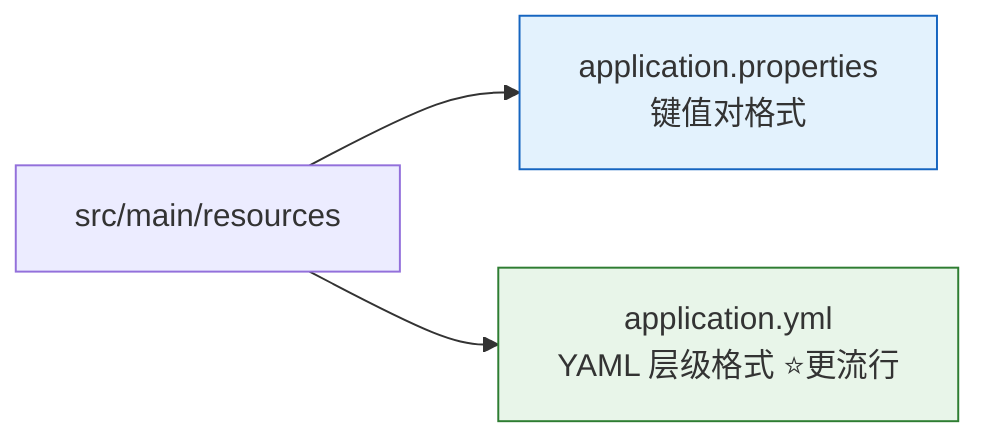
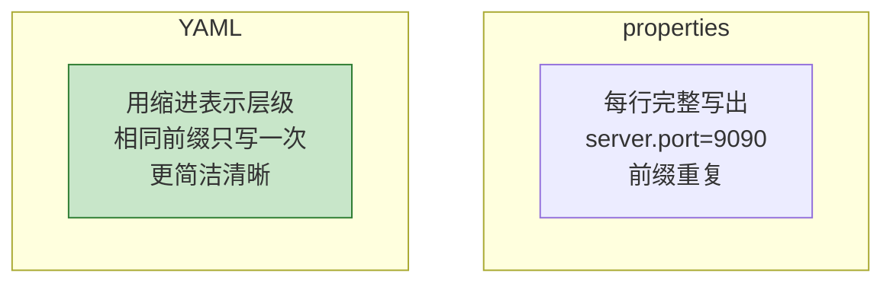
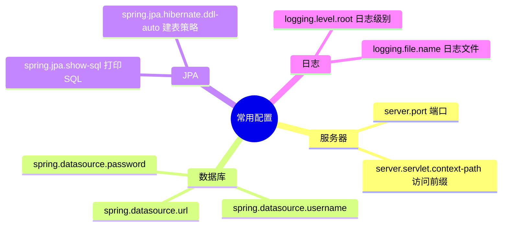
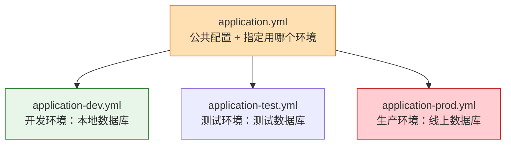
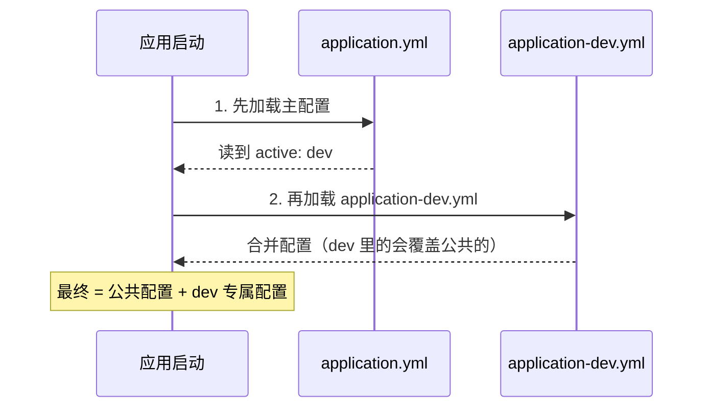
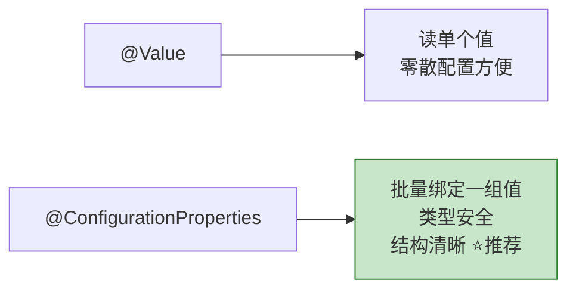

# 第 05 章：配置文件详解

> 本章目标：学会用配置文件修改应用行为（比如改端口），掌握 **properties / YAML** 两种格式、**多环境配置（Profiles）**，以及如何把配置**读进代码**里。

---

## 5.1 配置文件放在哪？

Spring Boot 项目默认在 `src/main/resources` 目录下有一个配置文件，二选一：



两种格式**功能完全一样**，只是写法不同。现在业界更流行 **YAML（.yml）**，因为它层级清晰、不啰嗦。

---

## 5.2 两种格式对比

同样是"把端口改成 9090、设置应用名"，两种写法：

**application.properties（键值对，每行一个）：**

```properties
server.port=9090
spring.application.name=demo
spring.datasource.url=jdbc:mysql://localhost:3306/mydb
spring.datasource.username=root
```

**application.yml（层级缩进，共享前缀）：**

```yaml
server:
  port: 9090

spring:
  application:
    name: demo
  datasource:
    url: jdbc:mysql://localhost:3306/mydb
    username: root
```

对比一下就能感受到区别：



> ⚠️ **YAML 的两个坑**：
> 1. **必须用空格缩进，不能用 Tab！**（这是初学者最常见的错误）
> 2. **冒号后面要有一个空格**，写 `port: 9090`，不能写 `port:9090`。

---

## 5.3 常用配置项速查



| 配置项 | 作用 | 示例 |
| --- | --- | --- |
| `server.port` | 修改端口 | `8081` |
| `server.servlet.context-path` | 访问路径前缀 | `/api` |
| `spring.application.name` | 应用名称 | `demo` |
| `logging.level.root` | 全局日志级别 | `INFO` |
| `spring.datasource.url` | 数据库连接地址 | `jdbc:mysql://...` |

---

## 5.4 多环境配置（Profiles）

真实项目通常有多个环境：**开发（dev）**、**测试（test）**、**生产（prod）**。每个环境配置不同（比如数据库地址不一样）。Profiles 就是用来解决这个问题的。



### 做法

**① 主配置文件 `application.yml`** 指定激活哪个环境：

```yaml
spring:
  profiles:
    active: dev   # 当前激活开发环境
```

**② 为每个环境建一个文件**，命名规则是 `application-{环境名}.yml`：

`application-dev.yml`（开发环境）：

```yaml
server:
  port: 8080
spring:
  datasource:
    url: jdbc:mysql://localhost:3306/dev_db
```

`application-prod.yml`（生产环境）：

```yaml
server:
  port: 80
spring:
  datasource:
    url: jdbc:mysql://prod-server:3306/prod_db
```

### 加载逻辑



> 💡 **启动时临时切换环境**：不用改文件，运行时加参数即可：
> `java -jar demo.jar --spring.profiles.active=prod`

---

## 5.5 把配置读进代码里

配置写好了，代码怎么用？有两种主要方式。

### 方式一：@Value（读单个值，简单直接）

```java
@Component
public class MyConfig {

    @Value("${server.port}")     // 读取配置项 server.port
    private int port;

    @Value("${my.custom.name:默认值}")  // 冒号后是默认值（配置不存在时用它）
    private String name;
}
```

### 方式二：@ConfigurationProperties（读一组值，⭐推荐）

当有一组相关配置时，用这种"类型安全"的方式更优雅。假设配置：

```yaml
app:
  name: 我的应用
  version: 1.0.0
  author: 张三
```

定义一个类来接收：

```java
@Component
@ConfigurationProperties(prefix = "app")  // 绑定所有 app.* 开头的配置
public class AppProperties {
    private String name;
    private String version;
    private String author;

    // 必须提供 getter / setter（Spring 靠它们注入值）
    // ... getter/setter 省略
}
```

两种方式对比：



| 特性 | @Value | @ConfigurationProperties |
| --- | --- | --- |
| 适合场景 | 读单个、零散的值 | 读一整组相关配置 |
| 类型安全 | 一般 | ✅ 好 |
| 支持复杂结构（List/Map/嵌套） | ❌ 弱 | ✅ 强 |

---

## 5.6 配置的优先级

同一个配置项可能在多个地方设置。Spring Boot 有一套优先级规则，**优先级高的会覆盖低的**：

```mermaid
flowchart TD
    A[命令行参数<br/>--server.port=9090<br/>优先级最高] --> B[操作系统环境变量]
    B --> C[application-{profile}.yml<br/>环境专属配置]
    C --> D[application.yml<br/>主配置文件]
    D --> E[代码里的默认值<br/>优先级最低]

    style A fill:#c8e6c9,stroke:#2e7d32,stroke-width:2px
    style E fill:#eeeeee,stroke:#9e9e9e
```

**记忆口诀：越靠近运行时、越"外部"的配置，优先级越高。** 这样你就能在不改代码的情况下，通过命令行或环境变量灵活覆盖配置（这对部署非常重要）。

---

## 5.7 本章小结

- 配置文件在 `src/main/resources`，用 **`application.yml`（推荐）** 或 `application.properties`。
- YAML 用**空格缩进**、**冒号后加空格**，注意别用 Tab。
- **多环境**用 `application-{env}.yml` + `spring.profiles.active` 切换。
- 读配置用 **`@Value`（单个）** 或 **`@ConfigurationProperties`（一组，推荐）**。
- 配置有**优先级**：命令行 > 环境变量 > profile 配置 > 主配置。

---

➡️ 基础打得差不多了！接下来进入实战重头戏——**[Web 开发：Controller 与 RESTful API](./06-Web开发-Controller与RESTful.md)**，学习怎么写出各种接口。
