# 第 06 章：Web 开发 —— Controller 与 RESTful API

> 本章目标：掌握 Web 开发的核心——**写接口**。你将学会：请求是怎么被处理的、如何用各种方式接收前端传来的参数、如何返回数据和控制状态码、什么是 RESTful 风格、以及真实项目里的统一返回、分层、异常处理等最佳实践。
>
> 本章是全书**最重要、最实用**的一章，内容较多，请务必**边看边敲代码**。

---

## 6.0 本章导览

我们会围绕一个"用户管理"的例子，从原理到实战一步步展开：

```mermaid
flowchart LR
    A[6.1 请求处理原理] --> B[6.2 控制器注解]
    B --> C[6.3 请求映射]
    C --> D[6.4 接收参数 ⭐重点]
    D --> E[6.5 参数校验]
    E --> F[6.6 返回响应]
    F --> G[6.7 RESTful 设计]
    G --> H[6.8 统一返回格式]
    H --> I[6.9 分层与DTO]
    I --> J[6.11 完整实战]

    style D fill:#ffe0b2,stroke:#e65100,stroke-width:2px
    style J fill:#c8e6c9,stroke:#2e7d32
```

准备工作：本章代码只需 `spring-boot-starter-web` 依赖（第 04 章加过）。参数校验部分需要 `spring-boot-starter-validation`，用到时会提醒。

---

## 6.1 一个请求在 Spring Boot 里的完整旅程

在写代码前，先彻底搞懂"一个请求进来后到底经历了什么"。这套机制叫 **Spring MVC**。

### 6.1.1 宏观流程

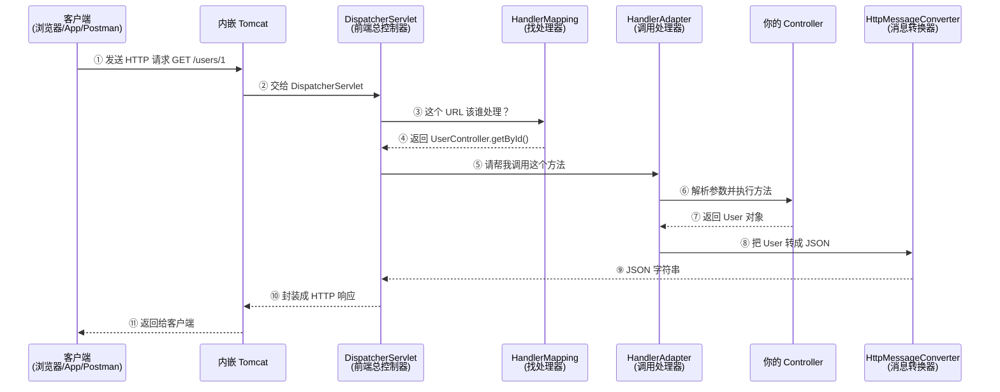

### 6.1.2 几个关键角色

| 角色 | 职责 | 通俗比喻 |
| --- | --- | --- |
| **DispatcherServlet** | 前端控制器，所有请求的总入口和调度中心 | 公司**前台**，所有访客先找它 |
| **HandlerMapping** | 根据 URL 找到对应的处理方法 | 前台的**通讯录**，查"这事找谁" |
| **HandlerAdapter** | 真正调用你的 Controller 方法，并帮你解析参数 | 前台**带路的助理** |
| **HttpMessageConverter** | 在"Java 对象"和"JSON/XML"之间互相转换 | **翻译官** |
| **你的 Controller** | 写业务处理逻辑 | 具体**办事的员工** |

> 💡 **核心记忆点**：`DispatcherServlet` 是整个 Spring MVC 的"大脑"，所有请求都先经过它统一调度。你平时**不用管它**，Spring Boot 已经自动帮你配好了——这正是第 04 章说的"自动配置"的功劳。

### 6.1.3 HttpMessageConverter：JSON 自动转换的幕后功臣

你可能好奇：为什么方法返回一个 `User` 对象，前端却收到 JSON？为什么前端发来 JSON，方法参数却能自动变成 `User` 对象？

这就是 **消息转换器（HttpMessageConverter）** 的作用。Spring Boot 默认集成了 **Jackson** 这个 JSON 库来完成转换：

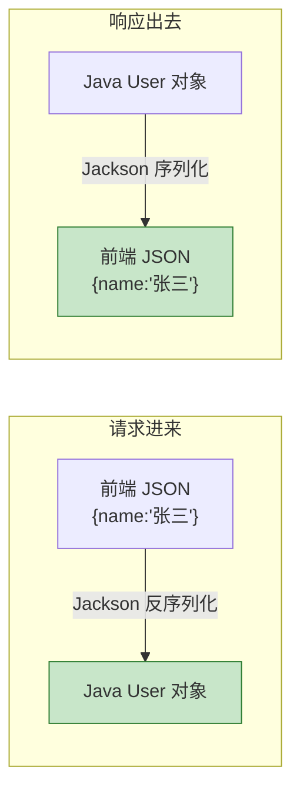

- **序列化**：Java 对象 → JSON（返回给前端时）
- **反序列化**：JSON → Java 对象（接收前端数据时）

这一切都是自动的，你只需专注写业务。

---

## 6.2 @Controller vs @RestController

写接口的类叫**控制器（Controller）**。有两个核心注解，初学者一定要分清：

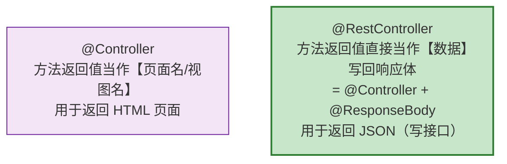

### 6.2.1 对比示例

**用 `@Controller`（返回页面，传统 Web）：**

```java
@Controller
public class PageController {

    @GetMapping("/home")
    public String home() {
        return "home";   // 返回的是【视图名】，会去找 home.html 页面渲染
    }
}
```

**用 `@RestController`（返回数据，前后端分离）：**

```java
@RestController
public class ApiController {

    @GetMapping("/api/hello")
    public String hello() {
        return "hello";   // 返回的是【数据本身】，前端直接收到字符串 "hello"
    }
}
```

### 6.2.2 @ResponseBody 的作用

`@RestController` = `@Controller` + `@ResponseBody`。这里的 **`@ResponseBody`** 就是那个"开关"，它告诉 Spring：**"方法返回值不是视图名，而是直接写进响应体（body）的数据。"**

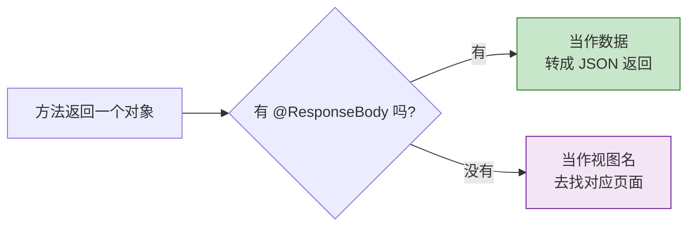

> ✅ **结论**：现在绝大多数项目是前后端分离，后端只提供 JSON 接口，所以**我们统一用 `@RestController`**。本章后面所有例子都用它。

---

## 6.3 请求映射：@RequestMapping 家族

用注解把"URL 地址 + HTTP 方法"和"处理方法"绑定起来。

### 6.3.1 按 HTTP 方法分类的快捷注解

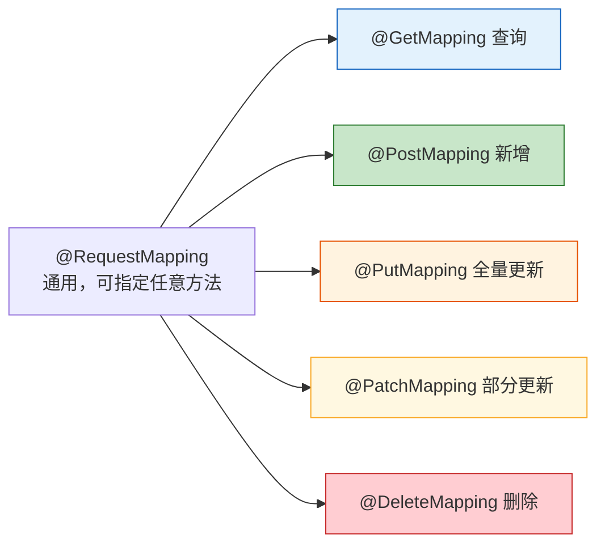

`@GetMapping("/xxx")` 其实就是 `@RequestMapping(value="/xxx", method=RequestMethod.GET)` 的简写，更直观，推荐用简写。

### 6.3.2 类级别 + 方法级别的路径组合

```java
@RestController
@RequestMapping("/users")   // 类级别：所有方法都以 /users 开头
public class UserController {

    @GetMapping             // 最终路径：GET /users
    public List<User> list() { ... }

    @GetMapping("/{id}")    // 最终路径：GET /users/{id}
    public User getById(@PathVariable Long id) { ... }

    @PostMapping            // 最终路径：POST /users
    public User create(@RequestBody User user) { ... }

    @PutMapping("/{id}")    // 最终路径：PUT /users/{id}
    public User update(@PathVariable Long id, @RequestBody User user) { ... }

    @DeleteMapping("/{id}") // 最终路径：DELETE /users/{id}
    public void delete(@PathVariable Long id) { ... }
}
```

> 💡 类上写公共前缀 `/users`，方法上只写差异部分，避免每个方法都重复写 `/users`。

### 6.3.3 @RequestMapping 的高级属性

`@RequestMapping` 不只能指定路径和方法，还有一些进阶属性：

| 属性 | 作用 | 示例 |
| --- | --- | --- |
| `value` / `path` | 请求路径 | `"/users"` |
| `method` | 限定 HTTP 方法 | `RequestMethod.GET` |
| `params` | 限定必须带某个参数 | `"type=vip"` |
| `headers` | 限定必须带某个请求头 | `"X-Version=1"` |
| `consumes` | 限定请求的 Content-Type | `"application/json"` |
| `produces` | 限定响应的 Content-Type | `"application/json"` |

```java
// 只处理 Content-Type 是 application/json、且带有 type=vip 参数的请求
@PostMapping(value = "/orders",
             consumes = "application/json",
             params = "type=vip")
public Order createVipOrder(@RequestBody Order order) { ... }
```

### 6.3.4 一个路径映射多个 URL

```java
// 访问 /users 或 /members 都能进入这个方法
@GetMapping({"/users", "/members"})
public List<User> list() { ... }
```

---

## 6.4 接收请求参数（本章重点）⭐

前端传参有很多种形式，Spring 提供了对应的注解来接收。这是日常开发用得最多的部分，请重点掌握。

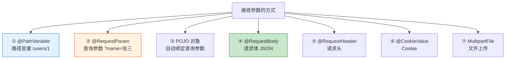

### 6.4.1 @PathVariable：取路径变量

用于取 URL 路径中的一部分，常用于 RESTful 风格取 id。

```java
// 访问 /users/100  →  id = 100
@GetMapping("/users/{id}")
public String getUser(@PathVariable Long id) {
    return "查询用户 " + id;
}
```

**取多个路径变量：**

```java
// 访问 /users/1/orders/99  →  userId=1, orderId=99
@GetMapping("/users/{userId}/orders/{orderId}")
public String getOrder(@PathVariable Long userId,
                       @PathVariable Long orderId) {
    return "用户" + userId + "的订单" + orderId;
}
```

**变量名和参数名不一致时，用 `value` 指定：**

```java
// 路径里叫 {id}，但方法参数想叫 userId
@GetMapping("/users/{id}")
public String getUser(@PathVariable("id") Long userId) {
    return "用户 " + userId;
}
```

### 6.4.2 @RequestParam：取查询参数

用于取 URL 中 `?` 后面的参数（查询字符串），常用于搜索、分页、筛选。

```java
// 访问 /search?keyword=手机&page=2
@GetMapping("/search")
public String search(@RequestParam String keyword,
                     @RequestParam int page) {
    return "搜索：" + keyword + "，第 " + page + " 页";
}
```

**常用属性：**

| 属性 | 作用 |
| --- | --- |
| `required` | 是否必传（默认 `true`，不传会报错） |
| `defaultValue` | 默认值（设了默认值就相当于非必传） |
| `value` | 指定参数名（参数名和变量名不同时用） |

```java
@GetMapping("/search")
public String search(
        @RequestParam(required = false) String keyword,       // 可不传
        @RequestParam(defaultValue = "1") int page,           // 不传默认第1页
        @RequestParam(defaultValue = "10") int size) {        // 不传默认每页10条
    return String.format("关键词=%s，第%d页，每页%d条", keyword, page, size);
}
```

**接收多个同名参数（数组/集合）：**

```java
// 访问 /users?ids=1&ids=2&ids=3  →  ids = [1, 2, 3]
@GetMapping("/users")
public String batchGet(@RequestParam List<Long> ids) {
    return "批量查询：" + ids;
}
```

> ⚠️ **`@PathVariable` 和 `@RequestParam` 的区别**：
> - `@PathVariable` 取的是**路径本身的一部分**：`/users/1`
> - `@RequestParam` 取的是 **? 后面的键值对**：`/users?id=1`

### 6.4.3 用 POJO 对象自动绑定查询参数

当查询参数很多时（比如复杂的搜索条件），一个个写 `@RequestParam` 太啰嗦。可以定义一个类，Spring 会**自动把同名参数塞进对象的字段**（无需任何注解）。

```java
// 定义一个查询条件类
public class UserQuery {
    private String keyword;
    private Integer minAge;
    private Integer maxAge;
    private int page = 1;
    private int size = 10;
    // 必须有 getter / setter，Spring 靠它们赋值
    // ... getter/setter 省略
}

// 访问 /users?keyword=张&minAge=18&maxAge=30&page=2
@GetMapping("/users")
public String search(UserQuery query) {   // 不用加注解，自动绑定
    return "查询条件：" + query.getKeyword() + "，年龄 "
            + query.getMinAge() + "~" + query.getMaxAge();
}
```

> 💡 这也是接收**表单提交（`application/x-www-form-urlencoded`）**数据的方式。前端 form 表单提交时，字段会自动绑定到这个对象。

### 6.4.4 @RequestBody：接收 JSON 请求体（最常用于新增/修改）

前后端分离项目里，前端提交数据通常是一段 JSON，放在**请求体（body）**里。用 `@RequestBody` 把它自动转成 Java 对象。

前端 POST 提交这样的 JSON：

```json
{
  "name": "张三",
  "age": 25,
  "email": "zhangsan@example.com"
}
```

后端定义对应的类来接收：

```java
public class User {
    private String name;
    private Integer age;
    private String email;
    // getter / setter 省略
}

@PostMapping("/users")
public User create(@RequestBody User user) {
    // Spring（Jackson）自动把 JSON 转成 User 对象
    System.out.println("收到用户：" + user.getName());
    return user;   // 返回时又自动转回 JSON
}
```

**接收 JSON 数组：**

```java
// 前端提交 [{...}, {...}]
@PostMapping("/users/batch")
public String batchCreate(@RequestBody List<User> users) {
    return "批量新增 " + users.size() + " 个用户";
}
```

> ⚠️ **一个方法里最多只能有一个 `@RequestBody`**，因为请求体只有一个，不能读两次。

### 6.4.5 @RequestHeader：取请求头

常用于获取 Token、User-Agent、语言等信息。

```java
@GetMapping("/info")
public String info(
        @RequestHeader("User-Agent") String userAgent,
        @RequestHeader(value = "token", required = false) String token) {
    return "浏览器：" + userAgent + "，令牌：" + token;
}
```

### 6.4.6 @CookieValue：取 Cookie

```java
@GetMapping("/cookie")
public String readCookie(@CookieValue(value = "sessionId", required = false) String sessionId) {
    return "会话ID：" + sessionId;
}
```

### 6.4.7 文件上传：MultipartFile

前端用 `multipart/form-data` 上传文件，后端用 `MultipartFile` 接收。

```java
@PostMapping("/upload")
public String upload(@RequestParam("file") MultipartFile file) throws IOException {
    if (file.isEmpty()) {
        return "文件为空";
    }
    // 获取文件信息
    String filename = file.getOriginalFilename();   // 原始文件名
    long size = file.getSize();                      // 文件大小（字节）

    // 保存到服务器（示例路径，实际要做安全处理）
    file.transferTo(new File("/data/upload/" + filename));

    return "上传成功：" + filename + "，大小 " + size + " 字节";
}
```

**同时上传多个文件 + 普通字段：**

```java
@PostMapping("/upload-multi")
public String uploadMulti(
        @RequestParam("files") MultipartFile[] files,   // 多个文件
        @RequestParam("desc") String desc) {             // 普通文本字段
    return "上传了 " + files.length + " 个文件，描述：" + desc;
}
```

### 6.4.8 日期时间参数的处理

日期参数容易踩坑，需要告诉 Spring 前端传的日期是什么格式。

```java
// 查询参数里的日期，如 /stats?date=2026-07-06
@GetMapping("/stats")
public String stats(
        @RequestParam
        @DateTimeFormat(pattern = "yyyy-MM-dd") LocalDate date) {
    return "统计日期：" + date;
}
```

对于 `@RequestBody` JSON 里的日期字段，则在字段上用 Jackson 的注解：

```java
public class Event {
    private String title;

    @JsonFormat(pattern = "yyyy-MM-dd HH:mm:ss", timezone = "GMT+8")
    private LocalDateTime startTime;
    // getter / setter
}
```

### 6.4.9 参数接收方式总结表

| 注解/方式 | 参数来源 | Content-Type | 典型场景 |
| --- | --- | --- | --- |
| `@PathVariable` | URL 路径 `/users/{id}` | 任意 | RESTful 取 id |
| `@RequestParam` | URL 查询串 `?key=value` | 任意 | 搜索、分页、筛选 |
| POJO 对象（无注解） | 查询串 / 表单 | `x-www-form-urlencoded` | 多条件查询、表单 |
| `@RequestBody` | 请求体 | `application/json` | 新增、修改（提交对象） |
| `@RequestHeader` | 请求头 | 任意 | Token、语言等 |
| `@CookieValue` | Cookie | 任意 | 会话标识 |
| `MultipartFile` | 请求体 | `multipart/form-data` | 文件上传 |

```mermaid
flowchart TD
    Q{参数在哪里?} -->|在URL路径里| A[@PathVariable]
    Q -->|在?后面| B[@RequestParam 或 POJO]
    Q -->|在请求体 JSON里| C[@RequestBody]
    Q -->|在请求头里| D[@RequestHeader]
    Q -->|是上传的文件| E[MultipartFile]

    style C fill:#c8e6c9,stroke:#2e7d32
```

---

## 6.5 参数校验入门（@Valid）

前端传来的数据**不可信**，必须校验。手写一堆 `if` 很啰嗦，用 **Bean Validation** 注解优雅得多。

**第一步**：加依赖 `spring-boot-starter-validation`。

**第二步**：在接收对象的字段上加校验注解。

```java
public class UserDTO {

    @NotBlank(message = "用户名不能为空")
    private String name;

    @NotNull(message = "年龄不能为空")
    @Min(value = 0, message = "年龄不能小于0")
    @Max(value = 150, message = "年龄不能大于150")
    private Integer age;

    @Email(message = "邮箱格式不正确")
    private String email;
    // getter / setter
}
```

**第三步**：在 Controller 参数前加 `@Valid` 触发校验。

```java
@PostMapping("/users")
public User create(@Valid @RequestBody UserDTO dto) {
    // 校验不通过时，根本不会进入这里，会直接抛出异常
    return userService.create(dto);
}
```

```mermaid
flowchart LR
    A[请求进来] --> B{@Valid 校验字段}
    B -->|全部通过| C[执行方法体]
    B -->|有不通过| D[抛出 MethodArgumentNotValidException]
    D --> E[由全局异常处理返回友好提示]

    style C fill:#c8e6c9,stroke:#2e7d32
    style D fill:#ffcdd2,stroke:#c62828
```

常用校验注解：`@NotNull`、`@NotBlank`、`@NotEmpty`、`@Size`、`@Min`、`@Max`、`@Email`、`@Pattern` 等（完整列表见第 12 章）。

> 💡 校验失败会抛出异常，具体如何统一捕获并返回友好提示，见 **第 08 章：全局异常处理**。

---

## 6.6 返回响应

### 6.6.1 直接返回对象（最常用）

用 `@RestController` 时，方法直接返回对象/集合，Spring 自动转 JSON，状态码默认 200。

```java
@GetMapping("/users/{id}")
public User getById(@PathVariable Long id) {
    return userService.findById(id);   // 自动转 JSON，状态码 200
}
```

### 6.6.2 ResponseEntity：精确控制状态码和响应头

有时需要自己控制 HTTP 状态码、响应头，这时用 `ResponseEntity<T>`。

```java
@GetMapping("/users/{id}")
public ResponseEntity<User> getById(@PathVariable Long id) {
    User user = userService.findById(id);
    if (user == null) {
        // 返回 404 状态码，无响应体
        return ResponseEntity.notFound().build();
    }
    // 返回 200 状态码 + user 数据 + 自定义响应头
    return ResponseEntity.ok()
            .header("X-Custom-Header", "value")
            .body(user);
}

@PostMapping("/users")
public ResponseEntity<User> create(@RequestBody User user) {
    User saved = userService.create(user);
    // 新增成功，返回 201 Created
    return ResponseEntity.status(HttpStatus.CREATED).body(saved);
}
```

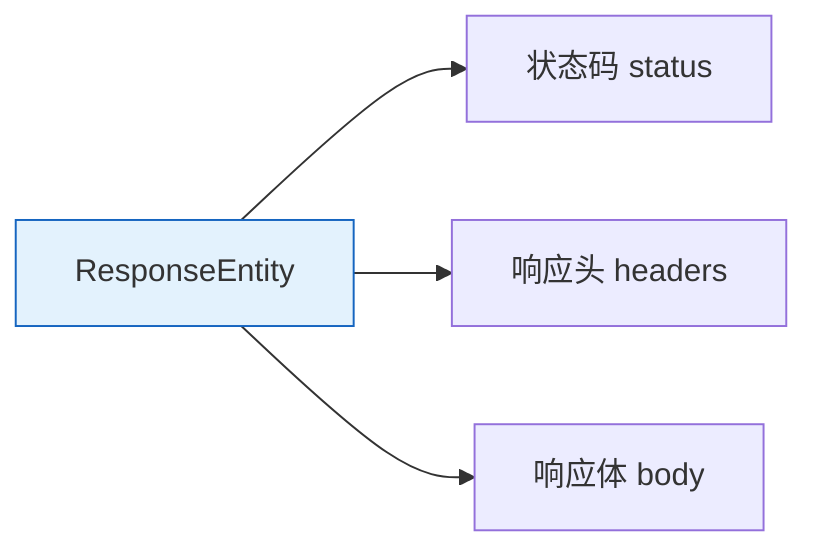

### 6.6.3 @ResponseStatus：声明式指定状态码

如果只是想改状态码，也可以用注解，更简洁：

```java
@PostMapping("/users")
@ResponseStatus(HttpStatus.CREATED)   // 成功时返回 201
public User create(@RequestBody User user) {
    return userService.create(user);
}
```

---

## 6.7 RESTful 设计详解

REST 是一种**设计接口的风格约定**。它不是强制标准，但遵循它能让 API 清晰、规范、易理解。

### 6.7.1 核心思想：URL 表示资源，HTTP 方法表示操作

```mermaid
flowchart LR
    subgraph 不推荐 ❌ 传统风格
        A1["GET /getUserById?id=1"]
        A2["GET /deleteUser?id=1"]
        A3["POST /addUser"]
        A4["POST /updateUser"]
    end

    subgraph 推荐 ✅ RESTful 风格
        B1["GET /users/1"]
        B2["DELETE /users/1"]
        B3["POST /users"]
        B4["PUT /users/1"]
    end

    style A2 fill:#ffcdd2,stroke:#c62828
    style B2 fill:#c8e6c9,stroke:#2e7d32
```

**关键原则**：URL 里用**名词（资源）**，不要用动词。"做什么操作"交给 HTTP 方法表达。

### 6.7.2 HTTP 方法的语义

| HTTP 方法 | 语义 | 幂等性 | 示例 |
| --- | --- | --- | --- |
| `GET` | 查询资源 | 幂等 | `GET /users/1` |
| `POST` | 新增资源 | 不幂等 | `POST /users` |
| `PUT` | 全量更新资源 | 幂等 | `PUT /users/1` |
| `PATCH` | 部分更新资源 | 不幂等 | `PATCH /users/1` |
| `DELETE` | 删除资源 | 幂等 | `DELETE /users/1` |

> 📖 **幂等**：同一个请求执行一次和执行多次，效果相同。比如 `DELETE /users/1` 删一次和删多次，最终结果都是"用户1不存在"，所以幂等；而 `POST /users` 每调一次就多创建一个用户，所以不幂等。

### 6.7.3 常见 HTTP 状态码

返回合适的状态码是 RESTful 的重要部分：

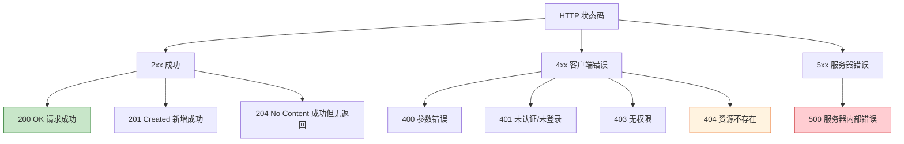

| 状态码 | 含义 | 什么时候用 |
| --- | --- | --- |
| 200 OK | 成功 | 查询、更新成功 |
| 201 Created | 已创建 | 新增成功 |
| 204 No Content | 成功无内容 | 删除成功 |
| 400 Bad Request | 请求参数有误 | 参数校验失败 |
| 401 Unauthorized | 未认证 | 未登录 |
| 403 Forbidden | 禁止访问 | 已登录但没权限 |
| 404 Not Found | 资源不存在 | 查询的数据不存在 |
| 500 Internal Server Error | 服务器错误 | 代码抛异常 |

### 6.7.4 URL 命名规范

| 规范 | 推荐 ✅ | 不推荐 ❌ |
| --- | --- | --- |
| 用名词复数表示资源集合 | `/users` | `/user`、`/getUsers` |
| 用小写字母，多单词用连字符 | `/user-profiles` | `/userProfiles`、`/user_profiles` |
| 不在 URL 里放动词 | `POST /users` | `/createUser` |
| 层级表示从属关系 | `/users/1/orders` | `/getOrdersByUserId?id=1` |

### 6.7.5 嵌套资源（表达从属关系）

```java
@RestController
@RequestMapping("/users/{userId}/orders")   // 订单从属于用户
public class UserOrderController {

    // GET /users/1/orders      查询用户1的所有订单
    @GetMapping
    public List<Order> listOrders(@PathVariable Long userId) { ... }

    // GET /users/1/orders/99   查询用户1的订单99
    @GetMapping("/{orderId}")
    public Order getOrder(@PathVariable Long userId,
                          @PathVariable Long orderId) { ... }
}
```

### 6.7.6 API 版本管理

接口升级时为了不影响老客户端，常做版本区分：

```java
// 方式一：路径版本（最常见、最直观）
@RequestMapping("/api/v1/users")   // v1 版本
@RequestMapping("/api/v2/users")   // v2 版本

// 方式二：请求头版本
@GetMapping(value = "/users", headers = "X-API-Version=1")
```

---

## 6.8 统一返回格式（实战必备）

真实项目中，接口通常返回**统一的结构**，方便前端统一处理（判断成功、取数据、显示错误提示）。

### 6.8.1 定义统一返回类

```java
public class Result<T> {
    private int code;        // 业务状态码，如 200 成功、500 失败
    private String message;  // 提示信息
    private T data;          // 真正的数据（泛型，可以是任意类型）

    // 私有构造，强制走静态工厂方法
    private Result(int code, String message, T data) {
        this.code = code;
        this.message = message;
        this.data = data;
    }

    // 成功（带数据）
    public static <T> Result<T> success(T data) {
        return new Result<>(200, "成功", data);
    }

    // 成功（无数据，如删除操作）
    public static <T> Result<T> success() {
        return new Result<>(200, "成功", null);
    }

    // 失败
    public static <T> Result<T> fail(int code, String message) {
        return new Result<>(code, message, null);
    }

    // getter / setter 省略
}
```

### 6.8.2 在接口中使用

```java
@RestController
@RequestMapping("/users")
public class UserController {

    @GetMapping("/{id}")
    public Result<User> getById(@PathVariable Long id) {
        User user = userService.findById(id);
        return Result.success(user);
    }

    @DeleteMapping("/{id}")
    public Result<Void> delete(@PathVariable Long id) {
        userService.delete(id);
        return Result.success();   // 无数据
    }
}
```

### 6.8.3 前端收到的统一结构

```json
{
  "code": 200,
  "message": "成功",
  "data": { "id": 1, "name": "张三" }
}
```

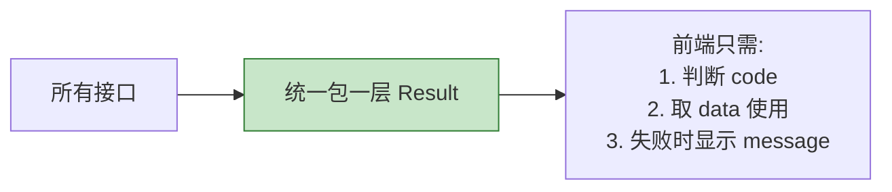

> 💡 实际项目中，`code`、`message` 常用一个**枚举类**统一管理（如 `ResultCode.SUCCESS`），避免到处写魔法数字。

---

## 6.9 三种对象：Entity / DTO / VO

初学者常把所有数据都塞进一个类，实际项目会区分不同用途的对象：

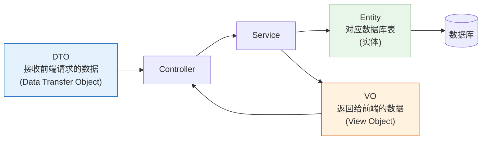

| 对象 | 全称 | 用途 | 例子 |
| --- | --- | --- | --- |
| **Entity** | 实体 | 对应数据库表，用于持久化 | `User`（含所有字段，包括密码） |
| **DTO** | 数据传输对象 | 接收前端请求参数 | `UserCreateDTO`（只含新增需要的字段） |
| **VO** | 视图对象 | 返回给前端展示 | `UserVO`（隐藏密码等敏感字段） |

**为什么要分开？** 举个例子：

```java
// Entity：数据库里有密码字段
public class User {
    private Long id;
    private String name;
    private String password;   // 敏感！不能返回给前端
}

// VO：返回给前端时，不包含 password
public class UserVO {
    private Long id;
    private String name;
    // 没有 password 字段，保护隐私
}
```

> 💡 初学练习时可以先用一个类简化；但正式项目**强烈建议区分**，尤其能避免把密码等敏感字段泄露给前端。

---

## 6.10 全局异常处理（简介）

Controller 里不要写一堆 `try-catch`。用 `@RestControllerAdvice` 集中处理所有异常，返回统一格式：

```java
@RestControllerAdvice
public class GlobalExceptionHandler {

    // 处理参数校验失败
    @ExceptionHandler(MethodArgumentNotValidException.class)
    public Result<Void> handleValidation(MethodArgumentNotValidException e) {
        String msg = e.getBindingResult().getFieldError().getDefaultMessage();
        return Result.fail(400, msg);
    }

    // 兜底处理所有异常
    @ExceptionHandler(Exception.class)
    public Result<Void> handleException(Exception e) {
        return Result.fail(500, "系统繁忙，请稍后再试");
    }
}
```

> 📖 全局异常处理的完整讲解见 **第 08 章**。

---

## 6.11 完整实战：图书管理 API

把本章知识串起来，做一个完整的"图书管理"RESTful 接口。

### 6.11.1 分层结构

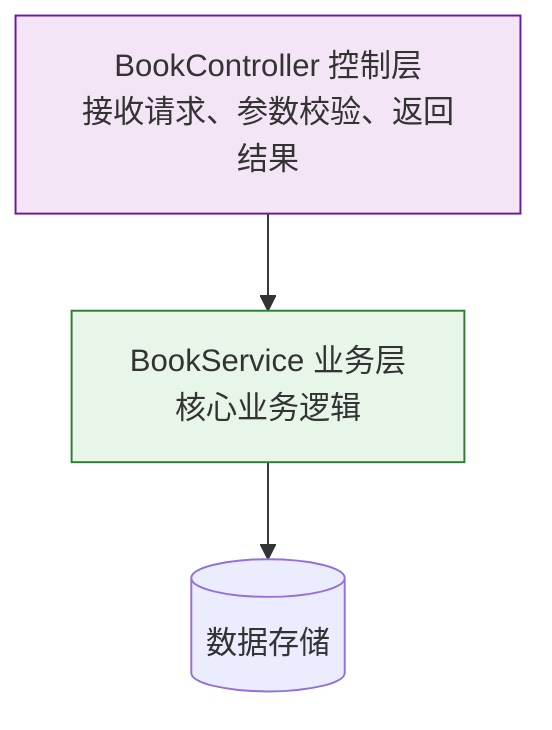

### 6.11.2 DTO 与 VO

```java
// 接收新增/修改请求的 DTO（带校验）
public class BookDTO {
    @NotBlank(message = "书名不能为空")
    private String title;

    @NotBlank(message = "作者不能为空")
    private String author;

    @Min(value = 0, message = "价格不能为负")
    private Double price;
    // getter / setter
}

// 返回给前端的 VO
public class BookVO {
    private Long id;
    private String title;
    private String author;
    private Double price;
    // getter / setter
}
```

### 6.11.3 Service 层（业务逻辑）

```java
@Service
public class BookService {

    // 用 Map 模拟数据库存储（实际用第07章的数据库）
    private final Map<Long, BookVO> store = new ConcurrentHashMap<>();
    private final AtomicLong idGenerator = new AtomicLong(1);

    public BookVO create(BookDTO dto) {
        BookVO vo = new BookVO();
        vo.setId(idGenerator.getAndIncrement());
        vo.setTitle(dto.getTitle());
        vo.setAuthor(dto.getAuthor());
        vo.setPrice(dto.getPrice());
        store.put(vo.getId(), vo);
        return vo;
    }

    public BookVO getById(Long id) {
        BookVO vo = store.get(id);
        if (vo == null) {
            throw new RuntimeException("图书不存在，id=" + id);
        }
        return vo;
    }

    public List<BookVO> list() {
        return new ArrayList<>(store.values());
    }

    public BookVO update(Long id, BookDTO dto) {
        BookVO vo = getById(id);   // 不存在会抛异常
        vo.setTitle(dto.getTitle());
        vo.setAuthor(dto.getAuthor());
        vo.setPrice(dto.getPrice());
        return vo;
    }

    public void delete(Long id) {
        store.remove(id);
    }
}
```

### 6.11.4 Controller 层（完整 CRUD）

```java
@RestController
@RequestMapping("/api/v1/books")
public class BookController {

    private final BookService bookService;

    // 构造方法注入（第03章）
    public BookController(BookService bookService) {
        this.bookService = bookService;
    }

    // 查询列表：GET /api/v1/books
    @GetMapping
    public Result<List<BookVO>> list() {
        return Result.success(bookService.list());
    }

    // 查询单个：GET /api/v1/books/1
    @GetMapping("/{id}")
    public Result<BookVO> getById(@PathVariable Long id) {
        return Result.success(bookService.getById(id));
    }

    // 新增：POST /api/v1/books
    @PostMapping
    @ResponseStatus(HttpStatus.CREATED)
    public Result<BookVO> create(@Valid @RequestBody BookDTO dto) {
        return Result.success(bookService.create(dto));
    }

    // 更新：PUT /api/v1/books/1
    @PutMapping("/{id}")
    public Result<BookVO> update(@PathVariable Long id,
                                 @Valid @RequestBody BookDTO dto) {
        return Result.success(bookService.update(id, dto));
    }

    // 删除：DELETE /api/v1/books/1
    @DeleteMapping("/{id}")
    public Result<Void> delete(@PathVariable Long id) {
        bookService.delete(id);
        return Result.success();
    }
}
```

### 6.11.5 用 curl / Postman 测试

```bash
# 新增一本书
curl -X POST http://localhost:8080/api/v1/books \
  -H "Content-Type: application/json" \
  -d '{"title":"Spring实战","author":"张三","price":89.0}'

# 查询列表
curl http://localhost:8080/api/v1/books

# 查询单本
curl http://localhost:8080/api/v1/books/1

# 更新
curl -X PUT http://localhost:8080/api/v1/books/1 \
  -H "Content-Type: application/json" \
  -d '{"title":"Spring实战(第2版)","author":"张三","price":99.0}'

# 删除
curl -X DELETE http://localhost:8080/api/v1/books/1
```

至此，一个规范的 RESTful CRUD 接口就完成了！它用到了本章几乎所有知识点：请求映射、路径/请求体参数、校验、统一返回、分层、DTO/VO、状态码。

---

## 6.12 跨域 CORS（简介）

前后端分离时，前端（如 `localhost:5173`）和后端（`localhost:8080`）端口不同，浏览器会因**同源策略**拦截请求。可以用 `@CrossOrigin` 注解快速解决：

```java
@CrossOrigin(origins = "http://localhost:5173")   // 允许该来源跨域
@RestController
@RequestMapping("/api/books")
public class BookController { ... }
```

> 📖 全局统一的跨域配置见 **第 08 章**。

---

## 6.13 常见坑与最佳实践

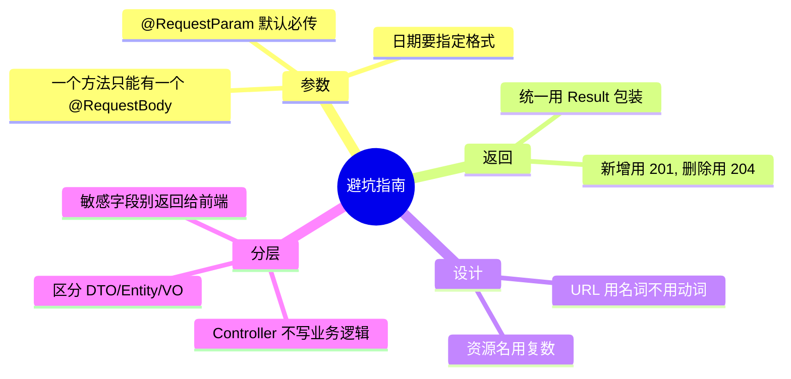

**要点回顾：**

1. ❌ 一个方法写两个 `@RequestBody` → 报错。请求体只能读一次。
2. ❌ `@RequestParam` 忘了 `required=false` 又没传 → 400 错误。
3. ❌ URL 用动词（`/getUser`）→ 不符合 RESTful，改用 `GET /users/1`。
4. ❌ Controller 里写大量业务逻辑和 `try-catch` → 应交给 Service 和全局异常处理。
5. ❌ 直接把 Entity（含密码）返回前端 → 用 VO 隔离敏感字段。
6. ✅ 所有接口统一返回 `Result` 结构，前端处理更省心。

---

## 6.14 本章小结

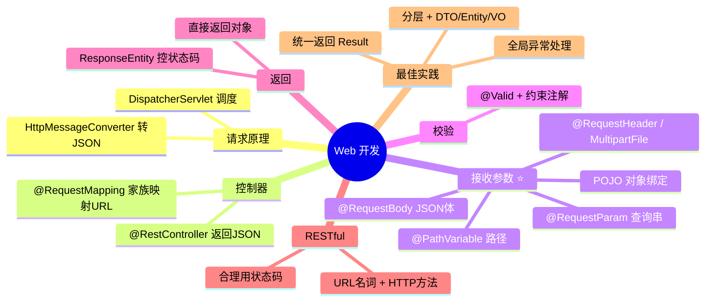

- **请求处理**：核心是 `DispatcherServlet` 调度 + `HttpMessageConverter` 自动转 JSON。
- **控制器**：写接口用 `@RestController`，用 `@GetMapping`/`@PostMapping` 等映射。
- **接收参数**（重点）：`@PathVariable`（路径）、`@RequestParam`（查询串）、`@RequestBody`（JSON）、POJO 绑定、文件上传。
- **校验**：`@Valid` + 约束注解，拒绝非法数据。
- **返回**：直接返回对象自动转 JSON；需控制状态码用 `ResponseEntity`。
- **RESTful**：URL 表示资源（名词），HTTP 方法表示操作，合理使用状态码。
- **最佳实践**：统一返回 `Result`、分层架构、区分 DTO/Entity/VO、全局异常处理。

---

➡️ 接口有了，但数据从哪来？下一章我们连接真正的数据库，学习 **[数据访问：MyBatis-Flex](./07-数据访问-MyBatisFlex.md)**。
