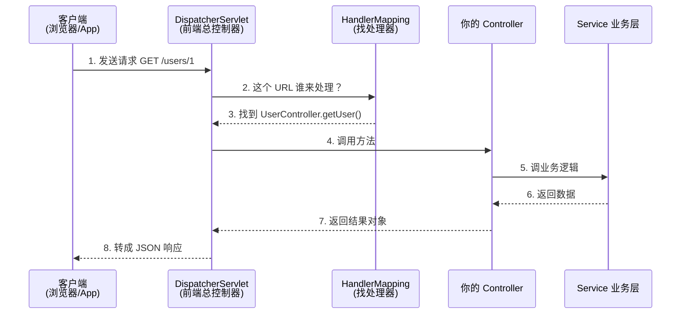
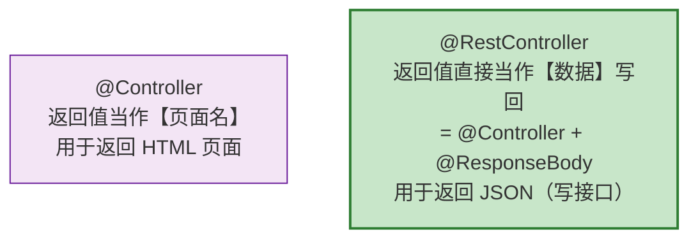
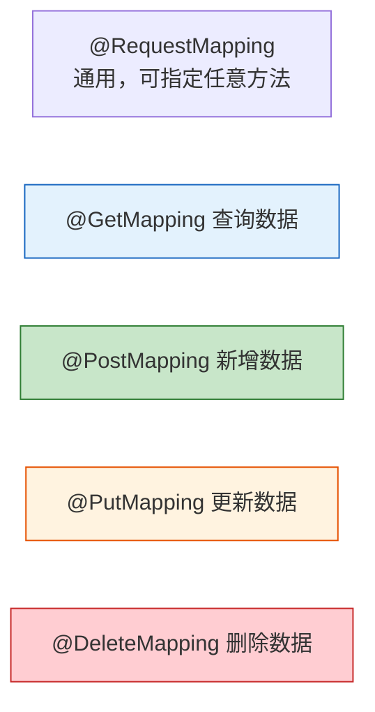
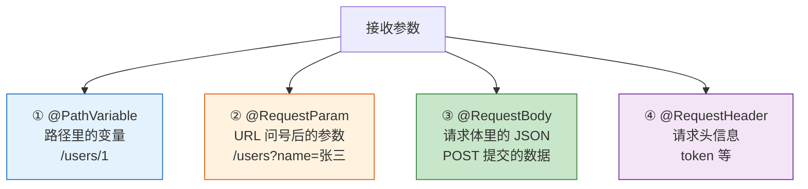
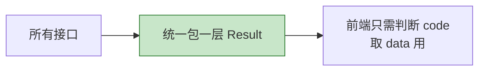
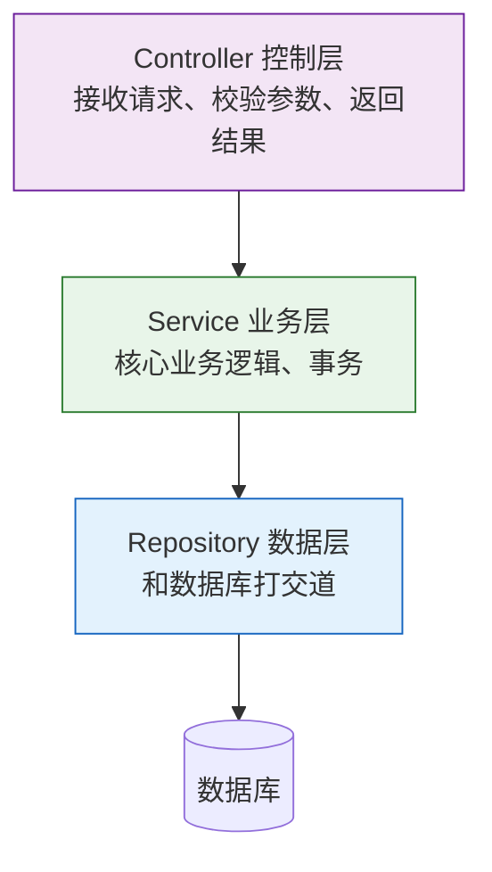
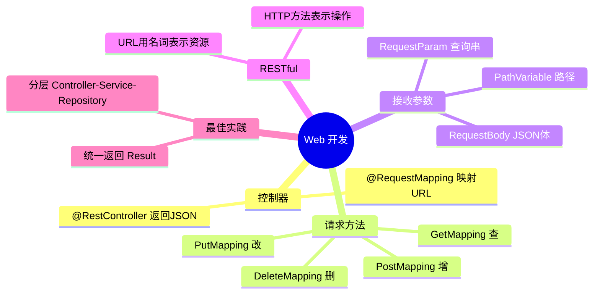

# 第 06 章：Web 开发 —— Controller 与 RESTful API

> 本章目标：掌握 Web 开发的核心——写接口。学会处理各种请求、接收各种参数、返回 JSON 数据，并理解 RESTful 风格。

---

## 6.1 一个请求在 Spring Boot 里的旅程

先建立全局认识。当浏览器/App 发来一个请求，Spring Boot 内部是这样处理的：



其中 **DispatcherServlet（前端控制器）** 是核心枢纽，所有请求都先经过它，再由它分发给对应的 Controller。这一整套就是 **Spring MVC**。

---

## 6.2 @Controller vs @RestController



- 现在前后端分离是主流，我们写的大多是**返回 JSON 数据的接口**，所以用 **`@RestController`**。
- `@RestController` = `@Controller` + `@ResponseBody`，意思是方法返回的对象会自动转成 JSON 返回给前端。

---

## 6.3 请求映射注解

用注解把"URL 地址"和"处理方法"绑定起来。按 HTTP 方法分：



```java
@RestController
@RequestMapping("/users")  // 类上统一前缀：所有方法都以 /users 开头
public class UserController {

    @GetMapping          // GET /users        查询列表
    public List<User> list() { ... }

    @GetMapping("/{id}") // GET /users/1       查询单个
    public User getById(@PathVariable Long id) { ... }

    @PostMapping         // POST /users        新增
    public User create(@RequestBody User user) { ... }

    @PutMapping("/{id}") // PUT /users/1       更新
    public User update(@PathVariable Long id, @RequestBody User user) { ... }

    @DeleteMapping("/{id}") // DELETE /users/1 删除
    public void delete(@PathVariable Long id) { ... }
}
```

---

## 6.4 接收参数的四种主要方式

这是重点！前端传参有多种形式，对应不同的注解：



### ① @PathVariable：取路径变量

```java
// 访问 /users/100  →  id = 100
@GetMapping("/users/{id}")
public String getUser(@PathVariable Long id) {
    return "查询用户 " + id;
}
```

### ② @RequestParam：取查询参数

```java
// 访问 /search?keyword=手机&page=2
@GetMapping("/search")
public String search(@RequestParam String keyword,
                     @RequestParam(defaultValue = "1") int page) {
    return "搜索：" + keyword + "，第 " + page + " 页";
}
```

### ③ @RequestBody：取 JSON 请求体（最常用于新增/修改）

前端 POST 提交这样的 JSON：

```json
{ "name": "张三", "age": 25 }
```

后端用一个类自动接收：

```java
@PostMapping("/users")
public User create(@RequestBody User user) {
    // Spring 自动把 JSON 转成 User 对象
    return user;
}
```

### 参数注解速查表

| 注解 | 参数来源 | 典型场景 |
| --- | --- | --- |
| `@PathVariable` | URL 路径中 `/users/{id}` | RESTful 风格取 id |
| `@RequestParam` | URL 问号后 `?key=value` | 搜索、分页、筛选 |
| `@RequestBody` | 请求体（JSON） | 新增、修改（提交对象） |
| `@RequestHeader` | 请求头 | 取 Token、User-Agent 等 |

---

## 6.5 什么是 RESTful？

REST 是一种**设计接口的风格约定**。核心思想：**用 URL 表示"资源"，用 HTTP 方法表示"操作"**。

```mermaid
flowchart LR
    subgraph 不推荐的传统风格
        A1["GET /getUser?id=1"]
        A2["GET /deleteUser?id=1"]
        A3["POST /addUser"]
    end

    subgraph RESTful 风格 ✅
        B1["GET /users/1  →  查询"]
        B2["DELETE /users/1  →  删除"]
        B3["POST /users  →  新增"]
    end

    style A2 fill:#ffcdd2,stroke:#c62828
    style B2 fill:#c8e6c9,stroke:#2e7d32
```

RESTful 的对应关系：

| 操作 | HTTP 方法 | URL 示例 | 含义 |
| --- | --- | --- | --- |
| 查询列表 | GET | `/users` | 获取所有用户 |
| 查询单个 | GET | `/users/1` | 获取 id=1 的用户 |
| 新增 | POST | `/users` | 创建用户 |
| 更新 | PUT | `/users/1` | 更新 id=1 的用户 |
| 删除 | DELETE | `/users/1` | 删除 id=1 的用户 |

> 💡 关键点：URL 里用**名词（资源）**，不要用动词。"做什么操作"交给 HTTP 方法表达。

---

## 6.6 统一返回格式（实战最佳实践）

真实项目中，接口通常返回统一结构，方便前端处理。定义一个通用返回类：

```java
public class Result<T> {
    private int code;       // 状态码，如 200 成功、500 失败
    private String message; // 提示信息
    private T data;         // 真正的数据

    // 静态方法方便快速构造
    public static <T> Result<T> success(T data) {
        Result<T> r = new Result<>();
        r.code = 200;
        r.message = "成功";
        r.data = data;
        return r;
    }
    // ... getter/setter
}
```

使用：

```java
@GetMapping("/users/{id}")
public Result<User> getUser(@PathVariable Long id) {
    User user = userService.findById(id);
    return Result.success(user);
}
```

前端收到的 JSON 就统一是这个结构：

```json
{
  "code": 200,
  "message": "成功",
  "data": { "id": 1, "name": "张三" }
}
```



---

## 6.7 分层架构：Controller 不要写业务逻辑

一个好习惯是**分层**：Controller 只负责收请求、返响应，具体业务交给 Service。



这样职责清晰、易维护、易测试。（第 07 章会用到 Repository 层。）

---

## 6.8 本章小结



- 写接口用 **`@RestController`** + **`@GetMapping`/`@PostMapping`** 等。
- 接收参数三大主力：**`@PathVariable`**、**`@RequestParam`**、**`@RequestBody`**。
- **RESTful**：URL 表示资源（名词），HTTP 方法表示操作。
- 实战中用**统一返回格式**和**分层架构**。

---

➡️ 接口有了，但数据从哪来？下一章我们连接数据库，学习 **[数据访问：Spring Data JPA](./07-数据访问-SpringDataJPA.md)**。
