# 第 07 章：数据访问 —— MyBatis-Flex

> 本章目标：学会用 **MyBatis-Flex** 连接数据库，完成增删改查（CRUD）、条件查询、分页、关联查询。你会看到：借助它的 `BaseMapper` 和 `QueryWrapper`，**既能少写 SQL，又能在需要时完全掌控 SQL**。
>
> 本章是全书**代码量最大、最贴近真实项目**的一章。内容较多、示例很多，请务必**跟着一步步敲**。

---

## 7.0 本章导览

我们会以一个"用户管理"模块为主线，从零搭好数据访问层，然后逐个功能深入：


> 📌 **本章基于 MyBatis-Flex `1.11.8`**（Spring Boot 3.x），JDK 21。数据库以 MySQL 为例。

---

## 7.1 认识数据访问框架

### 7.1.1 从最底层说起

Java 操作数据库，技术是一层层叠上来的：

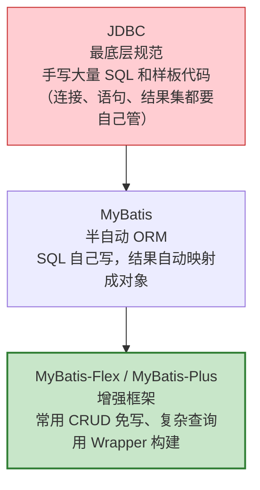

- **JDBC**：最原始，什么都要手写，代码啰嗦。
- **MyBatis**：把"写 SQL"和"映射结果"分离，SQL 你可控，但简单 CRUD 也要一条条写。
- **MyBatis-Flex**：在 MyBatis 之上做增强——**常用的增删改查一行不用写**，复杂查询用类型安全的 `QueryWrapper` 构建，需要时也能写原生 SQL。

### 7.1.2 MyBatis-Flex 的特点

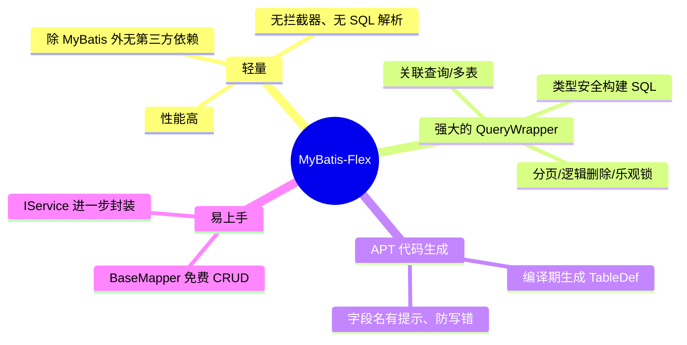

> 💡 **和 JPA、MyBatis-Plus 的关系**：
> - **JPA / Hibernate** 是"全自动"，用对象操作、几乎不碰 SQL，但复杂查询和性能调优时不够灵活。
> - **MyBatis-Plus** 也是 MyBatis 增强框架，很流行。
> - **MyBatis-Flex** 是较新的增强框架，主打**更轻量、更高性能、QueryWrapper 更灵活**，并用 APT 生成类型安全的字段引用。本章我们用它。

---

## 7.2 准备工作：依赖 + 配置 + 建表

### 第 1 步：创建数据库和表

先在 MySQL 里建库建表。打开数据库客户端执行：

```sql
CREATE DATABASE IF NOT EXISTS mydb DEFAULT CHARSET utf8mb4;

USE mydb;

CREATE TABLE IF NOT EXISTS `tb_user` (
    `id`         BIGINT       PRIMARY KEY AUTO_INCREMENT COMMENT '主键',
    `user_name`  VARCHAR(50)  NOT NULL                   COMMENT '用户名',
    `age`        INT                                     COMMENT '年龄',
    `email`      VARCHAR(100)                            COMMENT '邮箱',
    `status`     TINYINT      DEFAULT 1                  COMMENT '状态:1正常 0禁用',
    `created_at` DATETIME     DEFAULT CURRENT_TIMESTAMP  COMMENT '创建时间'
);

-- 插入几条测试数据
INSERT INTO tb_user(user_name, age, email, status) VALUES
('张三', 25, 'zhangsan@example.com', 1),
('李四', 30, 'lisi@example.com', 1),
('王五', 28, 'wangwu@example.com', 0);
```

> 💡 表名用 `tb_` 前缀、字段用**下划线命名**（`user_name`）是常见规范。稍后你会看到 MyBatis-Flex 如何自动把 `user_name` 列映射到 Java 的 `userName` 字段。

### 第 2 步：在 build.gradle 添加依赖

```groovy
dependencies {
    // MyBatis-Flex 的 Spring Boot 3 启动器（注意是 boot3！）
    implementation 'com.mybatis-flex:mybatis-flex-spring-boot3-starter:1.11.8'

    // ⭐ APT 处理器：Gradle 下【必须】显式声明，否则不会生成 TableDef（如 USER）！
    annotationProcessor 'com.mybatis-flex:mybatis-flex-processor:1.11.8'

    // MySQL 驱动（版本由 Spring Boot 管理，无需写）
    runtimeOnly 'com.mysql:mysql-connector-j'

    // Lombok：自动生成 getter/setter，简化实体类（可选但强烈推荐）
    compileOnly 'org.projectlombok:lombok'
    annotationProcessor 'org.projectlombok:lombok'
}
```

> ⚠️ **Gradle 用户特别注意**：MyBatis-Flex 的 APT 处理器（`mybatis-flex-processor`）在 Gradle 下**必须手动加 `annotationProcessor`**，否则编译时不会生成 `TableDef`（如 `USER`），查询代码会报错。Maven 的 starter 会自动带上它，Gradle 则需要你自己写这一行——这是从 Maven 转 Gradle 最容易漏的一步。

> ⚠️ **版本对应关系**（务必选对）：
> - Spring Boot **3.x** → `mybatis-flex-spring-boot3-starter`
> - Spring Boot **2.x** → `mybatis-flex-spring-boot-starter`
> - Spring Boot **4.x** → `mybatis-flex-spring-boot4-starter`
>
> 我们用的是 Spring Boot 3.5，所以选 **boot3**。选错了会启动报错。

### 第 3 步：配置 application.yml

```yaml
spring:
  datasource:
    url: jdbc:mysql://localhost:3306/mydb?serverTimezone=Asia/Shanghai&characterEncoding=utf8
    username: root
    password: 你的密码
    driver-class-name: com.mysql.cj.jdbc.Driver

# MyBatis-Flex 配置
mybatis-flex:
  configuration:
    # 把执行的 SQL 打印到控制台，学习和调试时非常有用！
    log-impl: org.apache.ibatis.logging.stdout.StdOutImpl
```

> 💡 `log-impl` 打开后，控制台会实时打印每条执行的 SQL 和参数。**强烈建议学习期间一直开着**，这样你能清楚看到 `QueryWrapper` 到底生成了什么 SQL。

### 第 4 步：启动类加 @MapperScan

告诉 MyBatis-Flex 去哪里扫描你的 Mapper 接口：

```java
import org.mybatis.spring.annotation.MapperScan;

@SpringBootApplication
@MapperScan("com.example.demo.mapper")   // 扫描这个包下的所有 Mapper 接口
public class DemoApplication {
    public static void main(String[] args) {
        SpringApplication.run(DemoApplication.class, args);
    }
}
```

> 💡 也可以不用 `@MapperScan`，改为在每个 Mapper 接口上单独加 `@Mapper` 注解。但用 `@MapperScan` 统一扫描更省事，推荐。

至此，准备工作完成。下面开始写代码。

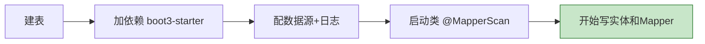

---

## 7.3 定义实体类（Entity）

实体类就是数据库表在 Java 里的"镜像"——一个类对应一张表，一个字段对应一列。

```java
package com.example.demo.entity;

import com.mybatisflex.annotation.Column;
import com.mybatisflex.annotation.Id;
import com.mybatisflex.annotation.KeyType;
import com.mybatisflex.annotation.Table;
import lombok.Data;
import java.time.LocalDateTime;

@Data                          // Lombok：自动生成 getter/setter/toString 等
@Table("tb_user")              // 指定这个类对应数据库的 tb_user 表
public class User {

    @Id(keyType = KeyType.Auto)   // 主键，且是数据库自增
    private Long id;

    private String userName;      // 自动映射到 user_name 列（驼峰↔下划线）

    private Integer age;

    private String email;

    private Integer status;

    @Column("created_at")         // 字段名和列名差异较大时，显式指定
    private LocalDateTime createdAt;
}
```

### 关键注解说明

```mermaid
flowchart TD
    A["@Table(\"tb_user\")<br/>类 ↔ 表"] 
    B["@Id(keyType=KeyType.Auto)<br/>主键 + 自增策略"]
    C["@Column(\"列名\")<br/>字段 ↔ 列（可选）"]

    style A fill:#e8f5e9,stroke:#2e7d32
    style B fill:#fff3e0,stroke:#e65100
    style C fill:#e3f2fd,stroke:#1565c0
```

| 注解 | 作用 | 说明 |
| --- | --- | --- |
| `@Table("tb_user")` | 声明类对应的表名 | 必填 |
| `@Id` | 标记主键 | `keyType` 指定生成策略 |
| `@Column` | 字段与列的映射 | **默认按"驼峰↔下划线"自动映射，一般不用写**；只有名称对不上时才用 |

**`@Id` 的主键策略（keyType）：**

| 策略 | 含义 | 适用 |
| --- | --- | --- |
| `KeyType.Auto` | 数据库自增 | MySQL 自增主键（最常用） |
| `KeyType.None` | 不自动处理 | 自己赋值主键 |
| `KeyType.Generator` | 用生成器（如雪花算法） | 分布式 ID |

> 💡 **驼峰↔下划线自动映射**：Java 里写 `userName`，数据库列是 `user_name`，MyBatis-Flex 默认自动转换，无需 `@Column`。这是默认开启的规则。

映射关系一图看懂：

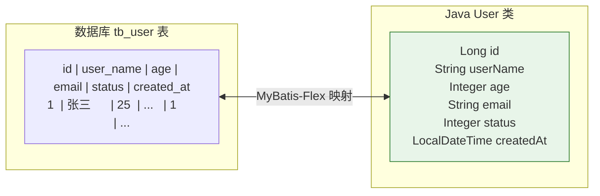

---

## 7.4 定义 Mapper：继承 BaseMapper 免费获得 CRUD

Mapper 是操作数据库的接口。你只需**定义一个接口继承 `BaseMapper<实体>`**，什么实现都不用写：

```java
package com.example.demo.mapper;

import com.mybatisflex.core.BaseMapper;
import com.example.demo.entity.User;

// 泛型填 User，表示这个 Mapper 操作 User 实体
public interface UserMapper extends BaseMapper<User> {
    // 空的！但已经拥有一大堆现成方法了
}
```

继承 `BaseMapper` 后，你**免费获得**这些常用方法：

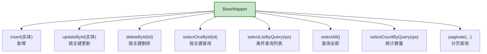

这些方法可以直接注入使用，一行 SQL 都不用写。接下来我们逐个演示。

---

## 7.5 APT 与 TableDef：类型安全查询的秘密（MyBatis-Flex 特色）

在写查询前，先理解一个 MyBatis-Flex 的特色机制——**APT 自动生成 TableDef**。

### 问题：查询条件里的"字段"怎么写才不容易错？

传统 MyBatis-Plus 写条件常用字符串 `"user_name"`，写错了编译不报错、运行才出问题。MyBatis-Flex 用 **APT（编译期注解处理）** 帮你生成一个"字段常量类"，让你用**类型安全**的方式引用字段。


### 怎么触发生成？

APT 在**项目编译时**自动运行。你只需：

- 在 IDEA 里 `Build → Build Project`，或
- 命令行执行 `./gradlew build`（或 `./gradlew compileJava`）

之后会在 `build/generated/sources/annotationProcessor/java/main` 下生成 `com.example.demo.entity.table.UserTableDef` 类，里面有一个静态常量 `USER`。

### 如何使用？静态导入即可

```java
import static com.example.demo.entity.table.UserTableDef.USER;
```

然后就能写 `USER.USER_NAME`、`USER.AGE` 这样的字段引用了（下一节大量用到）。

> ⚠️ **常见坑**：如果代码里 `USER` 报红/找不到，说明 APT 还没生成。解决办法：
> 1. 确认 `build.gradle` 里已加 `annotationProcessor 'com.mybatis-flex:mybatis-flex-processor:1.11.8'`（**Gradle 下这一步最容易漏！**）；
> 2. 先执行一次 `./gradlew build` 或 IDEA 的 Build Project；
> 3. 确认 IDEA 已开启注解处理（Settings → Build → Compiler → Annotation Processors → Enable）。
> 生成后 `USER` 就能正常导入了。这和 Lombok 的原理是一样的。

---

## 7.6 增删改（写操作）详解

下面用一个测试类逐个演示，注入 `UserMapper` 即可。每个操作都给出**代码 + 生成的 SQL**。

### 7.6.1 新增：insert

```java
@Autowired
private UserMapper userMapper;

public void demoInsert() {
    User user = new User();
    user.setUserName("赵六");
    user.setAge(22);
    user.setEmail("zhaoliu@example.com");
    user.setStatus(1);

    userMapper.insert(user);   // 执行新增

    // 新增后，自增主键会自动回填到 user 对象里！
    System.out.println("新增成功，生成的 id = " + user.getId());
}
```

生成的 SQL：

```sql
INSERT INTO `tb_user`(`user_name`, `age`, `email`, `status`) VALUES (?, ?, ?, ?)
```

> 💡 **主键回填**：新增后 `user.getId()` 能直接拿到数据库生成的自增 id，不用再查一次。

**`insert` vs `insertSelective`：**

| 方法 | 行为 |
| --- | --- |
| `insert(user)` | 所有字段都插入（null 字段也会写成 NULL） |
| `insertSelective(user)` | **只插入非 null 字段**，其余用数据库默认值 |

```java
// 只设了用户名，其它字段走数据库默认值（如 status 默认 1）
User u = new User();
u.setUserName("孙七");
userMapper.insertSelective(u);   // 只插入 user_name
```

### 7.6.2 更新：updateById

```java
public void demoUpdate() {
    User user = new User();
    user.setId(1L);              // 必须设置主键
    user.setAge(26);             // 要改的字段
    user.setEmail("new@example.com");

    userMapper.update(user);     // 按主键更新，null 字段默认不更新
}
```

生成的 SQL（注意：没设的字段不会被更新）：

```sql
UPDATE `tb_user` SET `age` = ?, `email` = ? WHERE `id` = ?
```

> 💡 MyBatis-Flex 的 `update(entity)` 默认**忽略 null 字段**，只更新你赋了值的字段。这正是我们想要的"局部更新"。

**按条件批量更新**（用 `UpdateWrapper` 或 `update(entity, queryWrapper)`）：

```java
import static com.example.demo.entity.table.UserTableDef.USER;

// 把所有 status=0（禁用）的用户年龄统一改为 0
User update = new User();
update.setAge(0);
QueryWrapper qw = QueryWrapper.create().where(USER.STATUS.eq(0));
userMapper.updateByQuery(update, qw);
```

生成的 SQL：

```sql
UPDATE `tb_user` SET `age` = ? WHERE `status` = ?
```

### 7.6.3 删除：deleteById / deleteByQuery

```java
// ① 按主键删除
userMapper.deleteById(3L);
// SQL: DELETE FROM `tb_user` WHERE `id` = ?

// ② 按主键批量删除
userMapper.deleteBatchByIds(Arrays.asList(4L, 5L, 6L));
// SQL: DELETE FROM `tb_user` WHERE `id` IN (?, ?, ?)

// ③ 按条件删除（删除所有禁用用户）
QueryWrapper qw = QueryWrapper.create().where(USER.STATUS.eq(0));
userMapper.deleteByQuery(qw);
// SQL: DELETE FROM `tb_user` WHERE `status` = ?
```

### 写操作方法小结

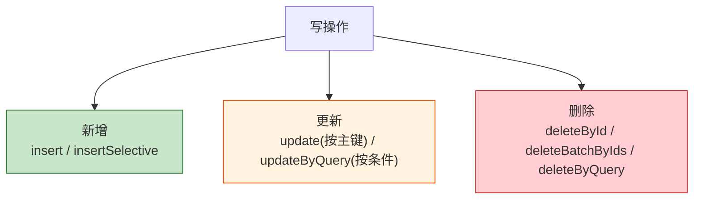

---

## 7.7 查询（重点）：QueryWrapper 详解 ⭐

`QueryWrapper` 是 MyBatis-Flex 的核心与灵魂——用**链式方法**优雅地拼出各种查询条件，且类型安全。

### 7.7.1 最简单的查询

```java
import static com.example.demo.entity.table.UserTableDef.USER;
import com.mybatisflex.core.query.QueryWrapper;

// 按主键查一个
User user = userMapper.selectOneById(1L);

// 查询全部
List<User> all = userMapper.selectAll();
```

### 7.7.2 条件查询：where

```java
// 查询年龄大于等于 18 的用户
QueryWrapper qw = QueryWrapper.create()
        .where(USER.AGE.ge(18));

List<User> users = userMapper.selectListByQuery(qw);
```

生成的 SQL：

```sql
SELECT * FROM `tb_user` WHERE `age` >= ?
```

### 7.7.3 条件方法大全

`USER.字段` 后面可以接各种条件方法：

| 方法 | 含义 | SQL |
| --- | --- | --- |
| `.eq(值)` | 等于 | `= ?` |
| `.ne(值)` | 不等于 | `!= ?` |
| `.gt(值)` | 大于 | `> ?` |
| `.ge(值)` | 大于等于 | `>= ?` |
| `.lt(值)` | 小于 | `< ?` |
| `.le(值)` | 小于等于 | `<= ?` |
| `.like(值)` | 模糊匹配 | `LIKE '%?%'` |
| `.likeLeft(值)` | 左模糊 | `LIKE '?%'` |
| `.in(值...)` | 在集合内 | `IN (?, ?)` |
| `.notIn(值...)` | 不在集合内 | `NOT IN (...)` |
| `.between(a, b)` | 区间 | `BETWEEN ? AND ?` |
| `.isNull()` | 为空 | `IS NULL` |
| `.isNotNull()` | 不为空 | `IS NOT NULL` |

**示例集合：**

```java
// 用户名包含"张"
QueryWrapper q1 = QueryWrapper.create().where(USER.USER_NAME.like("张"));
// SQL: WHERE user_name LIKE '%张%'

// 年龄在 18~30 之间
QueryWrapper q2 = QueryWrapper.create().where(USER.AGE.between(18, 30));
// SQL: WHERE age BETWEEN ? AND ?

// id 是 1、2、3 之一
QueryWrapper q3 = QueryWrapper.create().where(USER.ID.in(1, 2, 3));
// SQL: WHERE id IN (?, ?, ?)

// 邮箱不为空
QueryWrapper q4 = QueryWrapper.create().where(USER.EMAIL.isNotNull());
// SQL: WHERE email IS NOT NULL
```

### 7.7.4 多条件组合：and / or

```java
// 年龄 >= 18 且 用户名包含"张"
QueryWrapper qw = QueryWrapper.create()
        .where(USER.AGE.ge(18))
        .and(USER.USER_NAME.like("张"));
// SQL: WHERE age >= ? AND user_name LIKE ?

// 状态正常，且（年龄<20 或 年龄>60）
QueryWrapper qw2 = QueryWrapper.create()
        .where(USER.STATUS.eq(1))
        .and(USER.AGE.lt(20).or(USER.AGE.gt(60)));
// SQL: WHERE status = ? AND (age < ? OR age > ?)
```

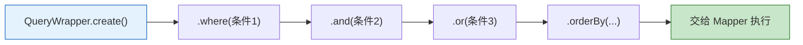

### 7.7.5 动态条件：null 自动忽略（MyBatis-Flex 亮点）✨

这是 MyBatis-Flex 非常实用的特性：**条件里的值如果是 `null`，该条件会被自动忽略**，不用写一堆 `if` 判断。

```java
// 模拟前端传来的搜索条件，某些可能没填（为 null）
String keyword = null;      // 用户没填关键词
Integer minAge = 18;        // 填了最小年龄

QueryWrapper qw = QueryWrapper.create()
        .where(USER.USER_NAME.like(keyword))   // keyword 是 null，这条被自动忽略！
        .and(USER.AGE.ge(minAge));             // 这条生效

List<User> users = userMapper.selectListByQuery(qw);
```

最终生成的 SQL（`user_name` 条件被自动跳过）：

```sql
SELECT * FROM `tb_user` WHERE `age` >= ?
```

> 💡 **这意味着**：写多条件搜索接口时，直接把所有条件都串上去即可，前端没填的（null）会自动不参与查询。**这是它比手写 SQL 舒服的地方**。

### 7.7.6 指定查询列 select

```java
// 只查 id 和 user_name 两列
QueryWrapper qw = QueryWrapper.create()
        .select(USER.ID, USER.USER_NAME)
        .from(USER)
        .where(USER.STATUS.eq(1));
// SQL: SELECT id, user_name FROM tb_user WHERE status = ?
```

### 7.7.7 排序 orderBy

```java
// 按年龄升序，再按 id 降序
QueryWrapper qw = QueryWrapper.create()
        .where(USER.STATUS.eq(1))
        .orderBy(USER.AGE.asc(), USER.ID.desc());
// SQL: ... ORDER BY age ASC, id DESC
```

### 7.7.8 统计数量 count

```java
QueryWrapper qw = QueryWrapper.create().where(USER.STATUS.eq(1));
long count = userMapper.selectCountByQuery(qw);
// SQL: SELECT COUNT(*) FROM tb_user WHERE status = ?
System.out.println("正常用户数：" + count);
```

---

## 7.8 分页查询

真实项目列表几乎都要分页。MyBatis-Flex 用 `paginate` 方法，返回一个 `Page<T>` 对象。

```java
import com.mybatisflex.core.paginate.Page;

public Page<User> pageUsers(int pageNumber, int pageSize) {
    QueryWrapper qw = QueryWrapper.create()
            .where(USER.STATUS.eq(1))
            .orderBy(USER.ID.desc());

    // 参数：第几页(从1开始)、每页条数、查询条件
    Page<User> page = userMapper.paginate(pageNumber, pageSize, qw);
    return page;
}
```

`Page<T>` 里包含了前端分页需要的全部信息：

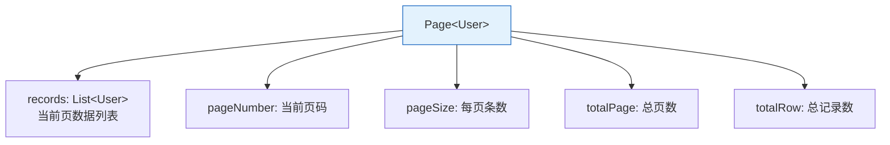

使用：

```java
Page<User> page = pageUsers(1, 10);
System.out.println("总记录数：" + page.getTotalRow());
System.out.println("总页数：" + page.getTotalPage());
System.out.println("本页数据：" + page.getRecords());
```

生成的 SQL（MySQL 下）大致为两条——查总数 + 查当页数据：

```sql
SELECT COUNT(*) FROM `tb_user` WHERE `status` = ?;
SELECT * FROM `tb_user` WHERE `status` = ? ORDER BY `id` DESC LIMIT 0, 10;
```

> 💡 **性能小技巧**：翻到第 2 页以后，其实不用再查总数（第 1 页已经拿到了）。可以用 `paginate(pageNumber, pageSize, totalRow, qw)` 把已知的 `totalRow` 传进去，省掉一次 count 查询。

---

## 7.9 关联查询（多表 join）

实际业务常需要连表。假设再有一张文章表 `tb_article`（含 `account_id` 关联用户）。用 `QueryWrapper` 的 `leftJoin`，并用 `selectListByQueryAs` 把结果映射成一个 DTO。

**① 定义接收结果的 DTO：**

```java
@Data
public class UserArticleDTO {
    private Long articleId;
    private String title;
    private String userName;    // 来自 user 表
    private Integer age;        // 来自 user 表
}
```

**② 构建 join 查询：**

```java
import static com.example.demo.entity.table.UserTableDef.USER;
import static com.example.demo.entity.table.ArticleTableDef.ARTICLE;

QueryWrapper qw = QueryWrapper.create()
        .select(
            ARTICLE.ID.as("articleId"),
            ARTICLE.TITLE,
            USER.USER_NAME,
            USER.AGE
        )
        .from(ARTICLE)
        .leftJoin(USER).on(ARTICLE.ACCOUNT_ID.eq(USER.ID))
        .where(USER.STATUS.eq(1));

// 用 As 方法把结果映射成 DTO
List<UserArticleDTO> list = articleMapper.selectListByQueryAs(qw, UserArticleDTO.class);
```

生成的 SQL：

```sql
SELECT a.id AS articleId, a.title, b.user_name, b.age
FROM tb_article AS a
LEFT JOIN tb_user AS b ON a.account_id = b.id
WHERE b.status = ?
```

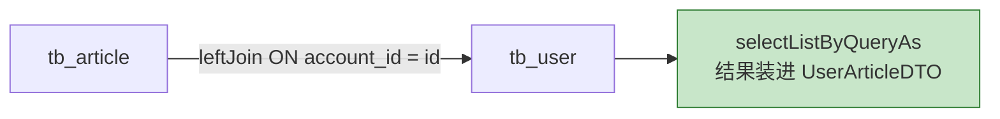

> 💡 `...As(DTO.class)` 系列方法专门用于关联查询：SQL 结果字段多于单个实体时，用一个 DTO/VO 类来接收。

---

## 7.10 完整实战：用户管理模块

现在把所有知识串起来，做一个规范分层的用户管理接口（结合第 06 章学的 `Result` 统一返回、分页）。

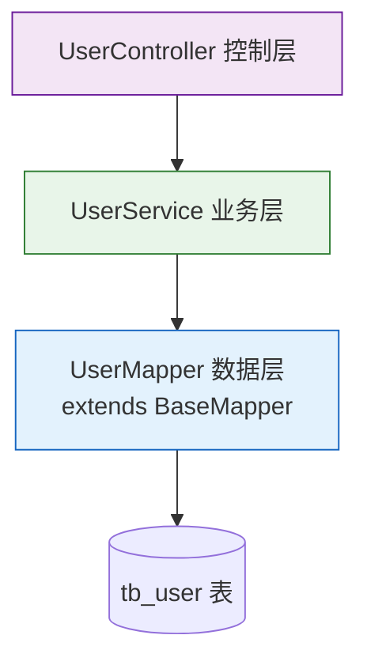

### 7.10.1 Service 层

```java
package com.example.demo.service;

import com.mybatisflex.core.paginate.Page;
import com.mybatisflex.core.query.QueryWrapper;
import com.example.demo.entity.User;
import com.example.demo.mapper.UserMapper;
import org.springframework.stereotype.Service;
import java.util.List;

import static com.example.demo.entity.table.UserTableDef.USER;

@Service
public class UserService {

    private final UserMapper userMapper;

    // 构造方法注入（第03章学过）
    public UserService(UserMapper userMapper) {
        this.userMapper = userMapper;
    }

    // 新增
    public User create(User user) {
        userMapper.insert(user);
        return user;                    // 主键已回填
    }

    // 按 id 查询
    public User getById(Long id) {
        User user = userMapper.selectOneById(id);
        if (user == null) {
            throw new RuntimeException("用户不存在，id=" + id);
        }
        return user;
    }

    // 更新
    public User update(Long id, User user) {
        user.setId(id);
        userMapper.update(user);        // 只更新非 null 字段
        return getById(id);
    }

    // 删除
    public void delete(Long id) {
        userMapper.deleteById(id);
    }

    // 条件 + 分页查询（关键词、年龄区间都可选）
    public Page<User> search(String keyword, Integer minAge, Integer maxAge,
                             int pageNumber, int pageSize) {
        QueryWrapper qw = QueryWrapper.create()
                .where(USER.USER_NAME.like(keyword))   // null 自动忽略
                .and(USER.AGE.ge(minAge))              // null 自动忽略
                .and(USER.AGE.le(maxAge))              // null 自动忽略
                .orderBy(USER.ID.desc());
        return userMapper.paginate(pageNumber, pageSize, qw);
    }
}
```

> ✨ 注意 `search` 方法：三个查询条件直接串上，**前端没传的（null）会自动被忽略**，一个 `if` 都不用写。这就是 MyBatis-Flex 的优雅之处。

### 7.10.2 Controller 层

```java
package com.example.demo.controller;

import com.mybatisflex.core.paginate.Page;
import com.example.demo.common.Result;   // 第06章定义的统一返回类
import com.example.demo.entity.User;
import com.example.demo.service.UserService;
import org.springframework.web.bind.annotation.*;

@RestController
@RequestMapping("/api/v1/users")
public class UserController {

    private final UserService userService;

    public UserController(UserService userService) {
        this.userService = userService;
    }

    // 新增：POST /api/v1/users
    @PostMapping
    public Result<User> create(@RequestBody User user) {
        return Result.success(userService.create(user));
    }

    // 查询单个：GET /api/v1/users/1
    @GetMapping("/{id}")
    public Result<User> getById(@PathVariable Long id) {
        return Result.success(userService.getById(id));
    }

    // 更新：PUT /api/v1/users/1
    @PutMapping("/{id}")
    public Result<User> update(@PathVariable Long id, @RequestBody User user) {
        return Result.success(userService.update(id, user));
    }

    // 删除：DELETE /api/v1/users/1
    @DeleteMapping("/{id}")
    public Result<Void> delete(@PathVariable Long id) {
        userService.delete(id);
        return Result.success();
    }

    // 分页搜索：GET /api/v1/users?keyword=张&minAge=18&page=1&size=10
    @GetMapping
    public Result<Page<User>> search(
            @RequestParam(required = false) String keyword,
            @RequestParam(required = false) Integer minAge,
            @RequestParam(required = false) Integer maxAge,
            @RequestParam(defaultValue = "1") int page,
            @RequestParam(defaultValue = "10") int size) {
        return Result.success(userService.search(keyword, minAge, maxAge, page, size));
    }
}
```

### 7.10.3 用 curl 测试

```bash
# 新增
curl -X POST http://localhost:8080/api/v1/users \
  -H "Content-Type: application/json" \
  -d '{"userName":"钱七","age":24,"email":"qianqi@example.com","status":1}'

# 查询单个
curl http://localhost:8080/api/v1/users/1

# 分页搜索（年龄 >= 18）
curl "http://localhost:8080/api/v1/users?minAge=18&page=1&size=10"

# 更新
curl -X PUT http://localhost:8080/api/v1/users/1 \
  -H "Content-Type: application/json" \
  -d '{"age":27}'

# 删除
curl -X DELETE http://localhost:8080/api/v1/users/1
```

一个完整、规范、带分页和动态查询的用户管理接口就完成了！

---

## 7.11 进阶：用 IService 进一步封装 Service 层

上面的 `UserService` 里，`create`/`getById` 等方法其实都是"调一下 Mapper"。MyBatis-Flex 提供了 `IService` 接口 + `ServiceImpl` 实现类，把这些常用方法也**免费送给你**。

**① 定义 Service 接口：**

```java
import com.mybatisflex.core.service.IService;
import com.example.demo.entity.User;

public interface IUserService extends IService<User> {
    // 这里只写你的自定义业务方法
}
```

**② 实现类继承 ServiceImpl：**

```java
import com.mybatisflex.spring.service.impl.ServiceImpl;
import com.example.demo.entity.User;
import com.example.demo.mapper.UserMapper;
import org.springframework.stereotype.Service;

@Service
public class UserServiceImpl extends ServiceImpl<UserMapper, User>
        implements IUserService {
    // 继承后自动拥有 save/getById/list/page/updateById/removeById 等方法
}
```

继承 `ServiceImpl` 后免费获得的常用方法：

| 方法 | 作用 |
| --- | --- |
| `save(entity)` | 新增（忽略 null 字段） |
| `saveBatch(list)` | 批量新增 |
| `updateById(entity)` | 按主键更新 |
| `removeById(id)` | 按主键删除 |
| `getById(id)` | 按主键查询 |
| `list()` / `list(qw)` | 查询列表 |
| `page(page, qw)` | 分页查询 |
| `count(qw)` | 统计数量 |

使用示例：

```java
@Service
public class OrderBizService {

    private final IUserService userService;

    public OrderBizService(IUserService userService) {
        this.userService = userService;
    }

    public void demo() {
        userService.save(new User());            // 新增
        User u = userService.getById(1L);        // 查询
        List<User> all = userService.list();     // 全部
    }
}
```

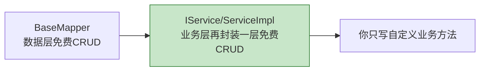

> 💡 **两种写法怎么选？**
> - **新手/想看清每一步**：用 7.10 的方式（自己注入 `Mapper` 写 Service），更直观。
> - **追求少写代码**：用 `IService` + `ServiceImpl`，标准 CRUD 全免。
> 二者可以混用，都很常见。

---

## 7.12 事务管理

涉及多步数据库操作、要么全成功要么全失败时，用 Spring 的 **`@Transactional`** 注解（第 08 章还会讲）：

```java
@Service
public class TransferService {

    private final UserMapper userMapper;
    public TransferService(UserMapper userMapper) { this.userMapper = userMapper; }

    @Transactional   // 方法内所有数据库操作在同一个事务里
    public void doSomething() {
        userMapper.insert(new User());
        // ... 其它操作
        // 如果中途抛异常，前面的操作会自动回滚
    }
}
```

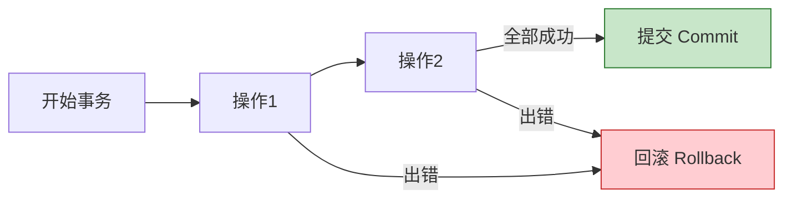

> 💡 `@Transactional` 是 **Spring** 提供的，和用不用 MyBatis-Flex 无关，通用。

---

## 7.13 常用注解与高级特性补充

MyBatis-Flex 还内置了很多实用特性，都通过实体类注解开启：

| 特性 | 注解/写法 | 说明 |
| --- | --- | --- |
| 逻辑删除 | `@Column(isLogicDelete = true)` | 标记删除字段，`delete` 变成"改标记"而非物理删除 |
| 乐观锁 | `@Column(version = true)` | 更新时自动带版本号校验，防并发覆盖 |
| 自动填充 | `@Column(onInsertValue = "now()")` | 插入/更新时自动填充值（如创建时间） |
| 字段忽略 | `@Column(ignore = true)` | 该字段不参与数据库映射 |
| 类型处理器 | `@Column(typeHandler = XxxHandler.class)` | 自定义字段与列的转换（如 JSON、加密） |

**逻辑删除示例：**

```java
@Data
@Table("tb_user")
public class User {
    @Id(keyType = KeyType.Auto)
    private Long id;

    private String userName;

    @Column(isLogicDelete = true)   // 逻辑删除字段
    private Boolean deleted;
}
```

配置后，`userMapper.deleteById(1L)` 实际执行的是：

```sql
UPDATE `tb_user` SET `deleted` = 1 WHERE `id` = ?   -- 不是真删除，只改标记
```

而所有查询都会自动带上 `WHERE deleted = 0`，被"删除"的数据不会被查出来。

---

## 7.14 MyBatis-Flex vs JPA vs MyBatis-Plus

| 维度 | Spring Data JPA | MyBatis-Plus | MyBatis-Flex |
| --- | --- | --- | --- |
| 定位 | 全自动 ORM | MyBatis 增强 | MyBatis 增强（较新） |
| SQL 掌控力 | 弱（隐藏 SQL） | 强 | 强 |
| 简单 CRUD | 免写 | 免写 | 免写 |
| 复杂查询 | 需 JPQL/原生 SQL | Wrapper（字符串字段） | QueryWrapper（**类型安全字段**） |
| 字段引用 | 属性名 | 多为字符串 | **APT 生成 TableDef，编译期检查** |
| 依赖/性能 | 依赖 Hibernate 较重 | 中等 | **轻量、无拦截器、性能高** |
| null 条件处理 | 手动 | 手动/条件方法 | **自动忽略 null** |

> 📌 没有绝对的"最好"，选型看团队习惯。本教程选 MyBatis-Flex，是因为它**轻量、类型安全、动态条件方便**，很适合现代项目。

---

## 7.15 常见坑与最佳实践

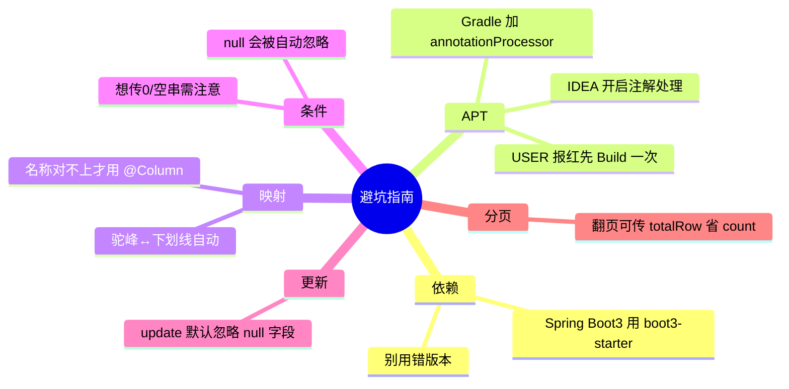

**要点回顾：**

1. ❌ Spring Boot 3 用了 `mybatis-flex-spring-boot-starter`（2.x 的）→ 启动报错。要用 **boot3**。
2. ❌ `USER` 找不到 → APT 没生成：确认 `build.gradle` 加了 `annotationProcessor ...mybatis-flex-processor`，执行 `./gradlew build`，并在 IDEA 开启注解处理。
3. ⚠️ 查询条件的值为 `null` 会被**自动忽略**——这通常是优点，但如果你确实想查 `xxx IS NULL`，要用 `.isNull()` 而不是 `.eq(null)`。
4. ⚠️ `update(entity)` 默认**不更新 null 字段**（局部更新）。若想把某字段更新成 null，需用相应的 API 或 `UpdateWrapper`。
5. ✅ 学习期打开 `log-impl` 打印 SQL，随时核对 `QueryWrapper` 生成的 SQL 是否符合预期。
6. ✅ 分层清晰：Controller 不写 SQL；Service 组织业务；Mapper 只管数据。

---

## 7.16 本章小结

```mermaid
mindmap
  root((MyBatis-Flex))
    准备
      boot3-starter 依赖
      数据源 + 打印SQL
      @MapperScan
    实体
      @Table @Id(Auto) @Column
      驼峰↔下划线
    Mapper
      继承 BaseMapper
      免费 CRUD
    APT
      编译生成 TableDef
      USER.字段 类型安全
    查询 QueryWrapper
      where/and/or
      eq/like/in/between
      null 自动忽略
      orderBy/count
    分页
      paginate 返回 Page
    关联
      leftJoin + selectListByQueryAs
    Service封装
      IService + ServiceImpl
    高级
      逻辑删除/乐观锁/自动填充
```

- **准备**：加 `mybatis-flex-spring-boot3-starter`，配数据源、打印 SQL，启动类加 `@MapperScan`。
- **实体**：`@Table` + `@Id(keyType=Auto)`，字段驼峰自动映射下划线列。
- **Mapper**：继承 `BaseMapper<User>`，免费获得全套 CRUD。
- **APT**：编译期生成 `TableDef`（如 `USER`），让查询字段**类型安全**。
- **查询**：`QueryWrapper` 链式构建，条件丰富，**null 值自动忽略**是一大亮点。
- **分页**：`paginate` 返回 `Page<T>`，含 records、totalRow、totalPage。
- **关联**：`leftJoin` + `selectListByQueryAs(DTO)`。
- **进阶**：`IService`/`ServiceImpl` 进一步免写 Service；还支持逻辑删除、乐观锁等。

---

➡️ 现在能做完整功能了。但项目要更健壮、更专业，还需要处理异常、记录日志。下一章：**[异常处理、日志、拦截器等常用功能](./08-常用功能-异常处理与日志.md)**。
