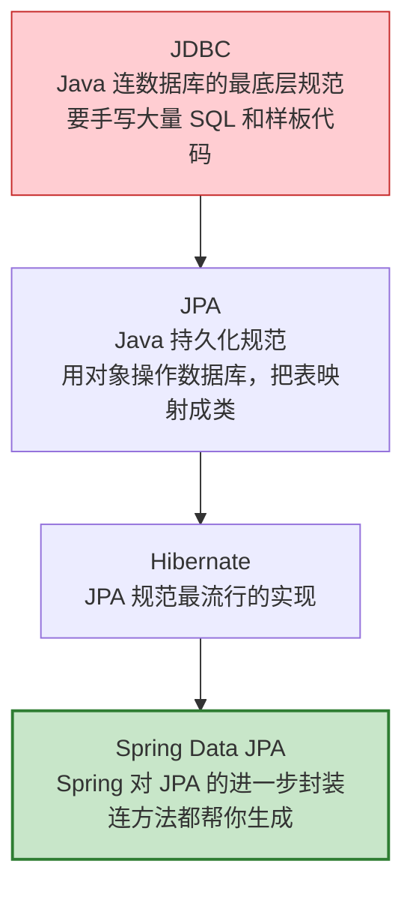
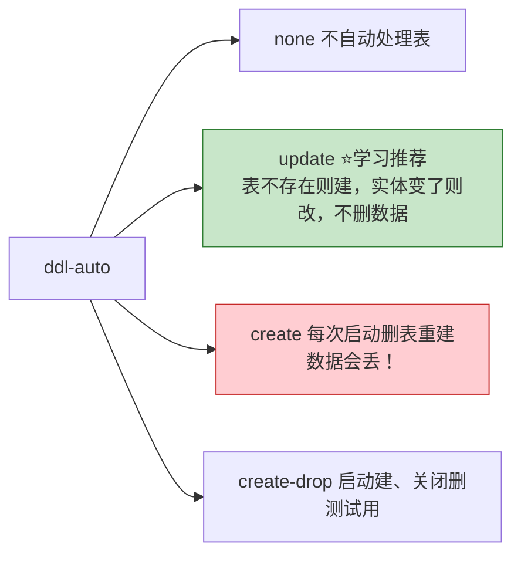
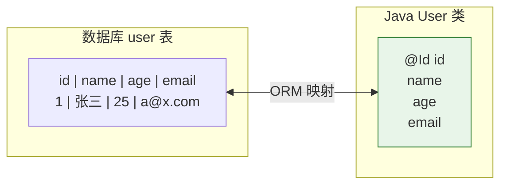
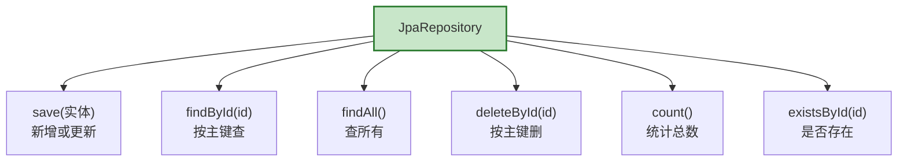
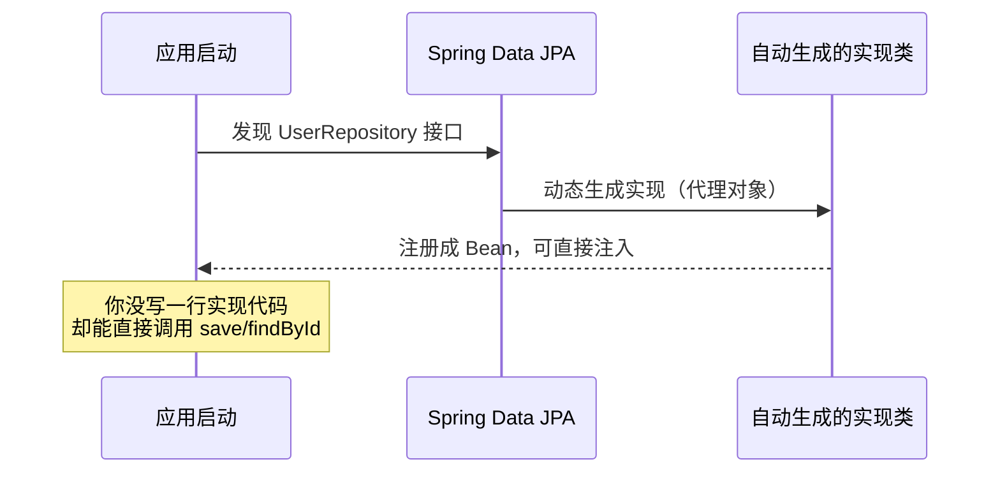
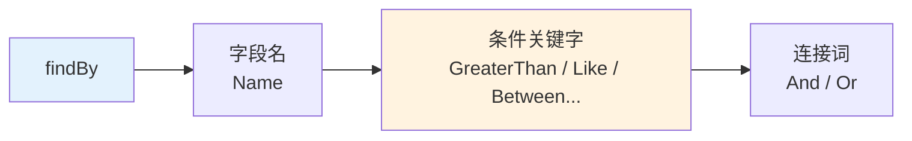
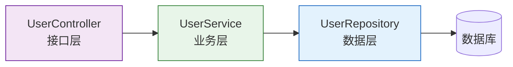
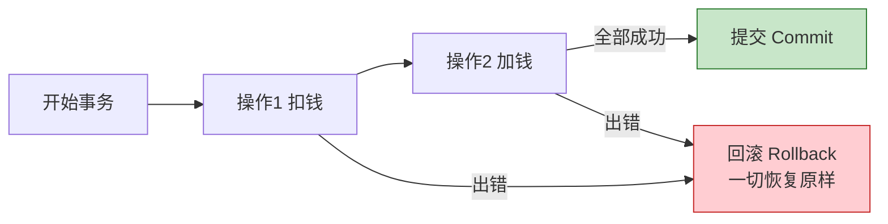
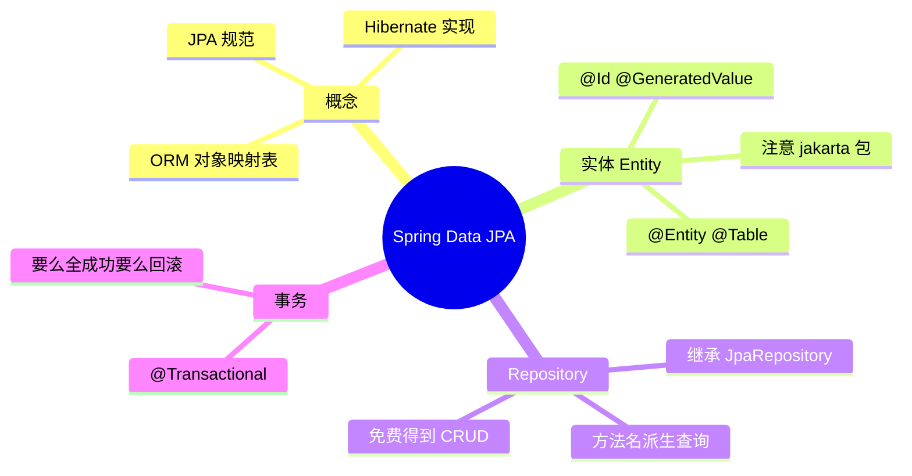

# 第 07 章：数据访问 —— Spring Data JPA

> 本章目标：学会连接数据库，用 **Spring Data JPA** 实现增删改查（CRUD）。你会惊讶地发现：很多情况下**一行 SQL 都不用写**！

---

## 7.1 先理清几个名词

初学者常被这几个词绕晕，先用图理清：



一句话理解层层递进：

- **JPA** 是"规范"（一套接口标准，规定"该怎么用对象操作数据库"）。
- **Hibernate** 是这套规范的具体"实现"（真正干活的）。
- **Spring Data JPA** 是 Spring 在上面再封装的一层，让你**连实现类都不用写**，定义个接口就行。

> 💡 **ORM** 的概念：把数据库的"表"和 Java 的"类"对应起来，把"行"和"对象"对应起来，让你用面向对象的方式操作数据库，不用直接写 SQL。这就是 **对象关系映射（Object-Relational Mapping）**。

---

## 7.2 准备工作：加依赖 + 配数据库

### ① 在 pom.xml 加两个依赖

```xml
<!-- Spring Data JPA -->
<dependency>
    <groupId>org.springframework.boot</groupId>
    <artifactId>spring-boot-starter-data-jpa</artifactId>
</dependency>

<!-- 数据库驱动（这里用 MySQL；学习也可用 H2 内存数据库） -->
<dependency>
    <groupId>com.mysql</groupId>
    <artifactId>mysql-connector-j</artifactId>
    <scope>runtime</scope>
</dependency>
```

### ② 在 application.yml 配置数据库连接

```yaml
spring:
  datasource:
    url: jdbc:mysql://localhost:3306/mydb?serverTimezone=Asia/Shanghai
    username: root
    password: 你的密码
    driver-class-name: com.mysql.cj.jdbc.Driver
  jpa:
    hibernate:
      ddl-auto: update    # 自动根据实体类维护表结构（见下方说明）
    show-sql: true        # 在控制台打印执行的 SQL，方便学习和调试
```

**`ddl-auto` 的取值**（初学者重点）：



> ⚠️ **生产环境千万别用 `create`**，会清空数据！生产一般用 `none` 或 `validate`，由专门的数据库迁移工具管理表结构。

---

## 7.3 定义实体类（Entity）：把表映射成类

假设有一张 `user` 表。我们建一个类和它对应：

```java
import jakarta.persistence.*;   // 注意：Spring Boot 3.x 是 jakarta 不是 javax！

@Entity                          // 声明这是一个实体，对应数据库的一张表
@Table(name = "user")            // 指定表名（不写默认用类名）
public class User {

    @Id                                              // 主键
    @GeneratedValue(strategy = GenerationType.IDENTITY)  // 主键自增
    private Long id;

    @Column(name = "name", nullable = false, length = 50)  // 映射到 name 列
    private String name;

    @Column(name = "age")
    private Integer age;

    private String email;   // 不加 @Column 也行，默认映射到同名列

    // 必须有无参构造 + getter/setter（此处省略）
}
```

> ⚠️ **Spring Boot 3.x 重要变化**：包名从 `javax.persistence.*` 改成了 **`jakarta.persistence.*`**！这是升级到 3.x 最常见的坑，很多老教程还是 `javax`，照抄会报错。

映射关系图：



---

## 7.4 定义 Repository：CRUD 免费送

这是 Spring Data JPA 最神奇的地方。你**只需定义一个接口**，继承 `JpaRepository`，什么都不用实现：

```java
import org.springframework.data.jpa.repository.JpaRepository;

// <User, Long> 表示：操作 User 实体，主键类型是 Long
public interface UserRepository extends JpaRepository<User, Long> {
    // 空的！但已经拥有一堆现成方法了
}
```

继承 `JpaRepository` 后，你**免费获得**这些方法：



Spring 在运行时会**自动生成这个接口的实现类**，你直接注入使用即可：



---

## 7.5 方法名派生查询：连 SQL 都省了

需要"按名字查用户"？不用写 SQL，**按规则起个方法名**，Spring 自动帮你翻译成查询：

```java
public interface UserRepository extends JpaRepository<User, Long> {

    // 自动翻译成：WHERE name = ?
    User findByName(String name);

    // 自动翻译成：WHERE age > ?
    List<User> findByAgeGreaterThan(Integer age);

    // 自动翻译成：WHERE name = ? AND age = ?
    List<User> findByNameAndAge(String name, Integer age);

    // 自动翻译成：WHERE name LIKE ?
    List<User> findByNameContaining(String keyword);
}
```

方法名的"翻译规则"：



| 关键字 | 作用 | 示例方法名 |
| --- | --- | --- |
| `And` / `Or` | 且 / 或 | `findByNameAndAge` |
| `GreaterThan` / `LessThan` | 大于 / 小于 | `findByAgeGreaterThan` |
| `Like` / `Containing` | 模糊匹配 | `findByNameContaining` |
| `OrderBy...Desc` | 排序 | `findByAgeOrderByIdDesc` |
| `Between` | 区间 | `findByAgeBetween` |

> 💡 如果查询太复杂，方法名会长得离谱。这时可以用 `@Query` 注解直接写 SQL 或 JPQL，更清晰。

---

## 7.6 完整实战：用户管理 CRUD

把前面的知识串起来，做一个完整的用户管理，看清分层调用：



**Service 层：**

```java
@Service
public class UserService {

    private final UserRepository userRepository;

    // 构造方法注入（第03章学过）
    public UserService(UserRepository userRepository) {
        this.userRepository = userRepository;
    }

    public User create(User user) {
        return userRepository.save(user);           // 新增
    }

    public User getById(Long id) {
        return userRepository.findById(id)          // 按 id 查
                .orElseThrow(() -> new RuntimeException("用户不存在"));
    }

    public List<User> listAll() {
        return userRepository.findAll();            // 查全部
    }

    public void delete(Long id) {
        userRepository.deleteById(id);              // 删除
    }
}
```

**Controller 层：**

```java
@RestController
@RequestMapping("/users")
public class UserController {

    private final UserService userService;

    public UserController(UserService userService) {
        this.userService = userService;
    }

    @PostMapping
    public User create(@RequestBody User user) {
        return userService.create(user);
    }

    @GetMapping("/{id}")
    public User getById(@PathVariable Long id) {
        return userService.getById(id);
    }

    @GetMapping
    public List<User> list() {
        return userService.listAll();
    }

    @DeleteMapping("/{id}")
    public void delete(@PathVariable Long id) {
        userService.delete(id);
    }
}
```

就这样，一个完整的用户增删改查接口就做好了，**核心数据操作没写一句 SQL**。

---

## 7.7 事务管理

涉及多步数据库操作、要么全成功要么全失败时，用 **`@Transactional`** 注解开启事务：

```java
@Service
public class TransferService {

    @Transactional  // 这个方法里的所有数据库操作在同一个事务中
    public void transfer(Long fromId, Long toId, int money) {
        // 扣钱
        // 加钱
        // 如果中途抛异常，前面的操作会自动回滚，不会出现钱扣了没到账
    }
}
```



---

## 7.8 本章小结



- 层次关系：**JPA（规范）→ Hibernate（实现）→ Spring Data JPA（再封装）**。
- 用 **`@Entity`** 把类映射成表，**Spring Boot 3.x 用 `jakarta` 包**（不是 javax）。
- 定义接口继承 **`JpaRepository`**，即可免费获得 CRUD 方法。
- 复杂查询用**方法名派生查询**或 `@Query`。
- 多步操作用 **`@Transactional`** 保证一致性。

---

➡️ 现在能做完整功能了。但项目要更健壮、更专业，还需要处理异常、记录日志。下一章：**[异常处理、日志、拦截器等常用功能](./08-常用功能-异常处理与日志.md)**。
