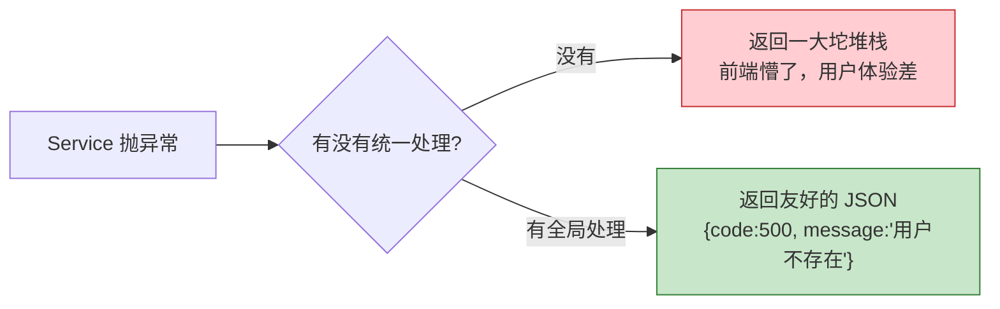
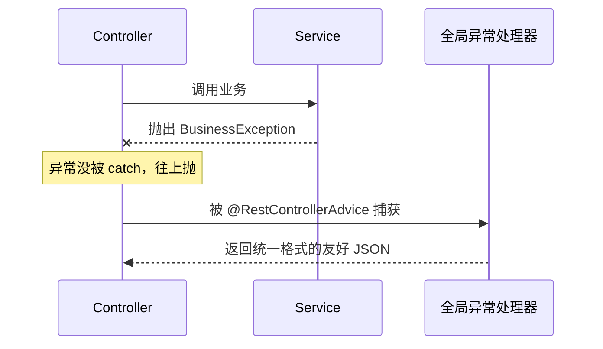
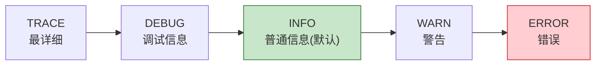
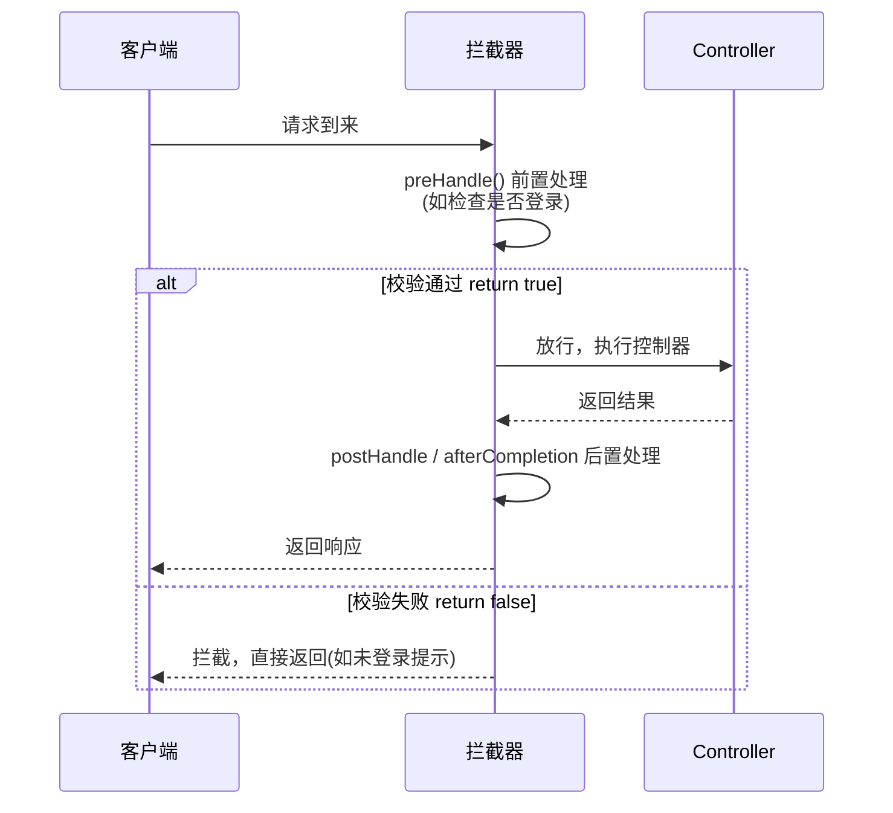
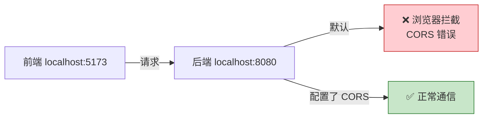

# 第 08 章：异常处理、日志、拦截器等常用功能

> 本章目标：学习让项目更健壮、更专业的几个常用功能——**全局异常处理**、**日志**、**拦截器**、**参数校验** 和 **跨域**。

---

## 8.1 全局异常处理

### 问题：不处理异常会怎样？

如果代码抛了异常又没处理，Spring Boot 会返回一堆丑陋的错误信息给前端（还可能暴露敏感的堆栈信息）：



### 解决方案：@RestControllerAdvice

用 **`@RestControllerAdvice`** + **`@ExceptionHandler`** 集中处理所有 Controller 抛出的异常：

```java
@RestControllerAdvice  // 全局异常处理器，拦截所有 Controller 的异常
public class GlobalExceptionHandler {

    // 处理自定义业务异常
    @ExceptionHandler(BusinessException.class)
    public Result<Void> handleBusiness(BusinessException e) {
        return Result.fail(e.getCode(), e.getMessage());
    }

    // 处理其它所有未预料的异常（兜底）
    @ExceptionHandler(Exception.class)
    public Result<Void> handleException(Exception e) {
        // 实际项目要在这里记录日志
        return Result.fail(500, "系统繁忙，请稍后再试");
    }
}
```

处理流程：



这样，所有异常都被统一"接住"，返回给前端整齐的结构。

---

## 8.2 日志（Logging）

日志是排查线上问题的"眼睛"。Spring Boot 默认已经集成好日志框架（SLF4J + Logback），开箱即用。

### 日志级别



级别从左到右越来越高。设置某个级别后，**只会输出该级别及更高级别**的日志。默认是 `INFO`，所以 DEBUG/TRACE 默认看不到。

### 怎么用

推荐用 SLF4J 的 `Logger`：

```java
import org.slf4j.Logger;
import org.slf4j.LoggerFactory;

@Service
public class UserService {

    private static final Logger log = LoggerFactory.getLogger(UserService.class);

    public User getById(Long id) {
        log.info("开始查询用户，id={}", id);   // {} 是占位符，比字符串拼接高效
        try {
            // ...
        } catch (Exception e) {
            log.error("查询用户失败，id={}", id, e);  // 最后传异常对象，会打印堆栈
        }
        return null;
    }
}
```

> 💡 **不要用 `System.out.println` 打日志！** 用 `Logger` 才能控制级别、格式、输出位置，且性能更好。
> 如果用 **Lombok**，可以在类上加 `@Slf4j` 注解，直接用 `log` 变量，省去手动创建。

### 在配置文件里调整日志

```yaml
logging:
  level:
    root: INFO                        # 全局默认级别
    com.example.demo: DEBUG           # 指定包用 DEBUG（调试自己代码常用）
  file:
    name: logs/app.log                # 把日志写到文件
```

---

## 8.3 参数校验（Validation）

前端传来的数据不可信，必须校验。用 **Bean Validation** 可以用注解优雅地校验，不用写一堆 if。

先加依赖 `spring-boot-starter-validation`，然后在实体字段上加注解：

```java
public class UserDTO {

    @NotBlank(message = "用户名不能为空")
    private String name;

    @Min(value = 0, message = "年龄不能小于0")
    @Max(value = 150, message = "年龄不能大于150")
    private Integer age;

    @Email(message = "邮箱格式不正确")
    private String email;
}
```

在 Controller 参数前加 **`@Valid`** 触发校验：

```java
@PostMapping("/users")
public Result<User> create(@Valid @RequestBody UserDTO dto) {
    // 如果校验不通过，根本不会进入这里，会直接抛出校验异常
    // ...
}
```

```mermaid
flowchart LR
    A[请求进来] --> B{@Valid 校验}
    B -->|通过| C[执行业务逻辑]
    B -->|不通过| D[抛 MethodArgumentNotValidException<br/>可在全局异常处理里统一返回错误提示]

    style C fill:#c8e6c9,stroke:#2e7d32
    style D fill:#ffcdd2,stroke:#c62828
```

常用校验注解：`@NotNull`、`@NotBlank`、`@NotEmpty`、`@Min`、`@Max`、`@Size`、`@Email`、`@Pattern`（正则）等。

---

## 8.4 拦截器（Interceptor）

拦截器可以在请求**到达 Controller 之前/之后**做统一处理，常用于登录校验、日志记录、权限检查。



### 两步实现

**① 写拦截器：**

```java
@Component
public class LoginInterceptor implements HandlerInterceptor {

    @Override
    public boolean preHandle(HttpServletRequest request,
                             HttpServletResponse response,
                             Object handler) {
        String token = request.getHeader("token");
        if (token == null) {
            response.setStatus(401);
            return false;   // 返回 false = 拦截，不再往下走
        }
        return true;        // 返回 true = 放行
    }
}
```

**② 注册拦截器：**

```java
@Configuration
public class WebConfig implements WebMvcConfigurer {

    private final LoginInterceptor loginInterceptor;

    public WebConfig(LoginInterceptor loginInterceptor) {
        this.loginInterceptor = loginInterceptor;
    }

    @Override
    public void addInterceptors(InterceptorRegistry registry) {
        registry.addInterceptor(loginInterceptor)
                .addPathPatterns("/**")              // 拦截所有请求
                .excludePathPatterns("/login");      // 但放过登录接口
    }
}
```

---

## 8.5 跨域（CORS）

前后端分离时，前端（如 `localhost:5173`）和后端（`localhost:8080`）端口不同，浏览器会因**同源策略**拦截请求，报跨域错误。



全局解决（推荐）：

```java
@Configuration
public class CorsConfig implements WebMvcConfigurer {
    @Override
    public void addCorsMappings(CorsRegistry registry) {
        registry.addMapping("/**")                    // 所有接口
                .allowedOriginPatterns("*")           // 允许的来源
                .allowedMethods("GET", "POST", "PUT", "DELETE")
                .allowedHeaders("*");
    }
}
```

---

## 8.6 本章小结

```mermaid
mindmap
  root((常用功能))
    全局异常处理
      @RestControllerAdvice
      @ExceptionHandler
      返回友好JSON
    日志
      用 Logger 不用 println
      级别 INFO/DEBUG/ERROR
      占位符 {}
    参数校验
      @Valid + @NotBlank 等
    拦截器
      preHandle 前置校验
      登录/权限
    跨域 CORS
      前后端分离必备
```

- **全局异常处理**：`@RestControllerAdvice` + `@ExceptionHandler`，统一返回友好错误。
- **日志**：用 `Logger`（或 `@Slf4j`），别用 `println`；级别默认 INFO。
- **参数校验**：`@Valid` + `@NotBlank`/`@Min` 等注解。
- **拦截器**：实现 `HandlerInterceptor`，常用于登录校验。
- **跨域**：前后端分离时配置 CORS。

---

➡️ 功能都齐了，怎么保证代码质量？下一章学习 **[测试](./09-测试.md)**。
