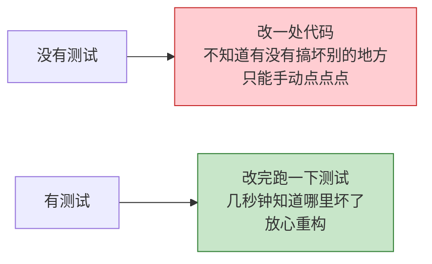
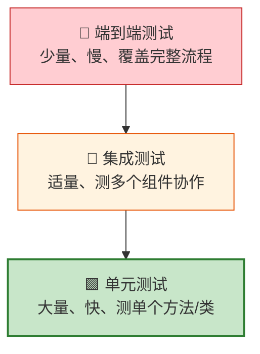
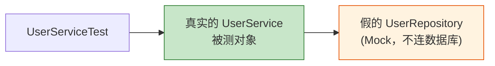
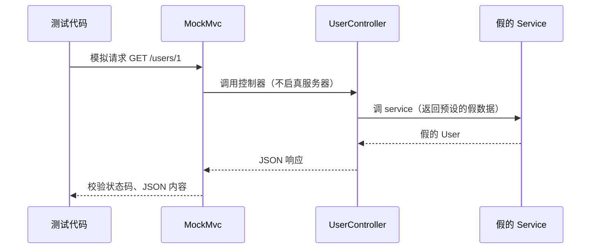
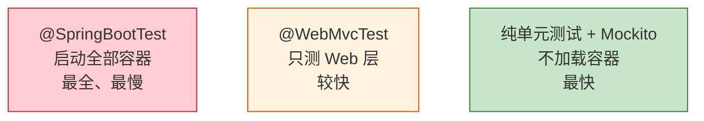

# 第 09 章：测试

> 本章目标：学会给 Spring Boot 应用写测试，包括**单元测试**、**Web 层测试** 和 **集成测试**，让代码改动更有底气。

---

## 9.1 为什么要写测试？



测试就像给代码上的"保险"。项目越大，测试的价值越高。

---

## 9.2 测试金字塔

不同层级的测试，数量和成本不同。理想的比例像一个金字塔：



**原则：多写快而稳的单元测试，少写慢而重的端到端测试。**

---

## 9.3 测试的"标配"：starter-test

用 Spring Initializr 创建项目时，**默认就自带了** `spring-boot-starter-test`，它打包了一整套测试工具：

```mermaid
mindmap
  root((starter-test))
    JUnit 5
      测试框架的基础
      @Test 注解等
    Mockito
      制造"假对象"
      隔离被测代码
    AssertJ
      流式断言
      assertThat(x).isEqualTo(y)
    Spring Test
      加载 Spring 容器测试
      MockMvc 测 Web 层
```

---

## 9.4 单元测试：测单个类的逻辑

单元测试关注"一个类的一个方法逻辑对不对"，并且**不依赖数据库、网络等外部资源**（用 Mock 假对象替代依赖）。

假设要测 `UserService`，它依赖 `UserRepository`。我们用 Mockito 造一个假的 Repository：

```java
import org.junit.jupiter.api.Test;
import org.junit.jupiter.api.extension.ExtendWith;
import org.mockito.InjectMocks;
import org.mockito.Mock;
import org.mockito.junit.jupiter.MockitoExtension;

import static org.assertj.core.api.Assertions.assertThat;
import static org.mockito.Mockito.when;

@ExtendWith(MockitoExtension.class)  // 启用 Mockito
class UserServiceTest {

    @Mock                       // 造一个假的 Repository（不连真数据库）
    private UserRepository userRepository;

    @InjectMocks                // 把上面的假 Repository 注入进 UserService
    private UserService userService;

    @Test
    void 根据ID查询用户_应返回正确用户() {
        // 1. 准备（Arrange）：规定假对象的行为
        User mockUser = new User();
        mockUser.setId(1L);
        mockUser.setName("张三");
        when(userRepository.findById(1L)).thenReturn(Optional.of(mockUser));

        // 2. 执行（Act）：调用被测方法
        User result = userService.getById(1L);

        // 3. 断言（Assert）：验证结果
        assertThat(result.getName()).isEqualTo("张三");
    }
}
```

单元测试的思路（Mock 掉外部依赖）：



**测试的黄金结构：AAA 模式** —— Arrange（准备）、Act（执行）、Assert（断言）。

---

## 9.5 Web 层测试：@WebMvcTest + MockMvc

想测 Controller 的接口（不用真的启动服务器、不用打开浏览器），用 `@WebMvcTest` 只加载 Web 层，用 `MockMvc` 模拟发请求：

```java
@WebMvcTest(UserController.class)   // 只加载这个 Controller 相关的 Web 组件
class UserControllerTest {

    @Autowired
    private MockMvc mockMvc;          // 用来模拟发起 HTTP 请求

    @MockitoBean                      // 造假的 Service（Spring Boot 3.4+ 的新注解）
    private UserService userService;

    @Test
    void 查询用户接口_应返回200和用户名() throws Exception {
        User mockUser = new User();
        mockUser.setName("李四");
        when(userService.getById(1L)).thenReturn(mockUser);

        mockMvc.perform(get("/users/1"))          // 模拟 GET /users/1
               .andExpect(status().isOk())        // 期望状态码 200
               .andExpect(jsonPath("$.name").value("李四"));  // 期望返回的 JSON 中 name=李四
    }
}
```



> 💡 **注意版本变化**：以前用 `@MockBean` 注入假 Bean，它在 Spring Boot 3.4 已被标记废弃，**推荐改用 `@MockitoBean`**（来自 Spring Framework 6.2）。

---

## 9.6 集成测试：@SpringBootTest

集成测试会**启动完整的 Spring 容器**，测试多个组件真实协作（更接近真实运行，但更慢）：

```java
@SpringBootTest   // 加载完整应用上下文
class DemoApplicationTests {

    @Autowired
    private UserService userService;   // 注入真实的 Bean

    @Test
    void 容器能正常启动且注入成功() {
        assertThat(userService).isNotNull();
    }
}
```

三种测试对比：



| 注解/方式 | 加载范围 | 速度 | 适用 |
| --- | --- | --- | --- |
| 纯单元测试（Mockito） | 不加载容器 | 最快 | 测单个类逻辑 |
| `@WebMvcTest` | 仅 Web 层 | 较快 | 测 Controller 接口 |
| `@DataJpaTest` | 仅数据层 | 较快 | 测 Repository |
| `@SpringBootTest` | 整个应用 | 慢 | 测完整流程 |

---

## 9.7 运行测试

- **IDE 中**：类或方法旁边有绿色三角，点它即可运行。
- **命令行**：`./gradlew test` 会运行所有测试。

测试结果一目了然：✅ 绿色通过，❌ 红色失败（并告诉你哪个断言没过）。

---

## 9.8 本章小结

- 测试是代码的"保险"，遵循**测试金字塔**：多单元、少端到端。
- `spring-boot-starter-test` 自带 **JUnit 5 + Mockito + AssertJ**。
- **单元测试**：用 `@Mock`/`@InjectMocks` 隔离依赖，遵循 **AAA** 结构。
- **Web 层测试**：`@WebMvcTest` + `MockMvc`，假 Bean 用 **`@MockitoBean`**（新）。
- **集成测试**：`@SpringBootTest` 启动完整容器。

---

➡️ 代码写好、测试通过，最后一步是让它跑到服务器上。下一章：**[打包与部署](./10-打包与部署.md)**。
