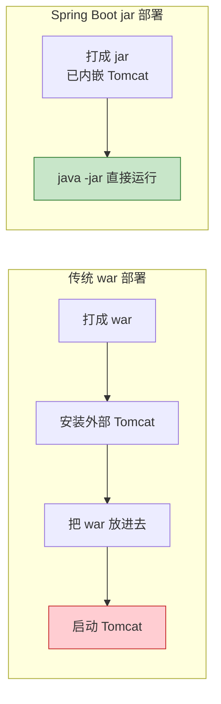
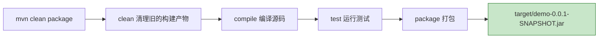
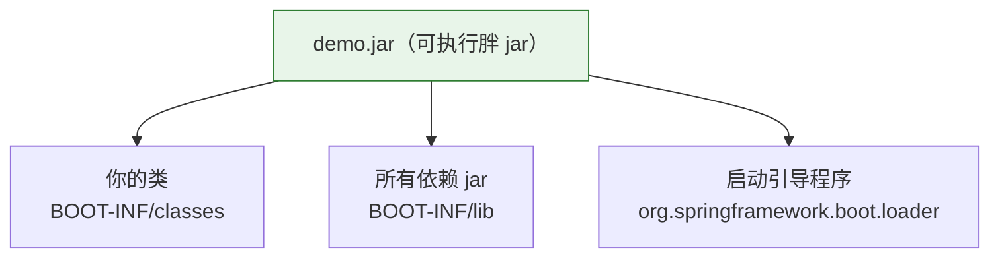
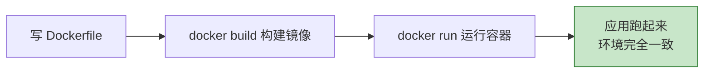
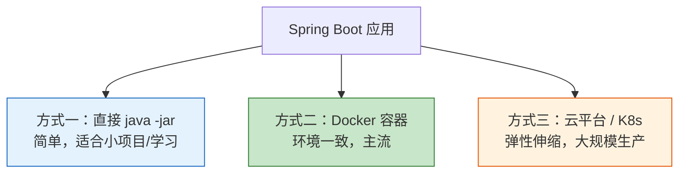

# 第 10 章：打包与部署

> 本章目标：学会把 Spring Boot 项目打包成可运行的 jar，并了解用 **Docker** 部署到服务器的方法。

---

## 10.1 Spring Boot 的部署优势

传统 Java Web 应用要打成 war 包，再丢进外部 Tomcat 才能跑。Spring Boot 不一样——它把服务器**内嵌**进了 jar 包：



这种"内嵌服务器 + 可执行 jar"的方式，让部署变得极其简单，也是微服务和云原生的标准做法。

---

## 10.2 打包成可执行 jar

Spring Boot 项目默认就配好了打包插件 `spring-boot-maven-plugin`。在项目根目录执行：

```bash
mvn clean package
```



打包成功后，在 `target/` 目录下会生成一个 jar 文件，例如 `demo-0.0.1-SNAPSHOT.jar`。

> 💡 想跳过测试打包，可以加 `-DskipTests`：`mvn clean package -DskipTests`（不推荐在正式发布时跳过）。

---

## 10.3 运行 jar

拿到 jar 后，任何装了 JDK 21 的机器都能直接运行：

```bash
java -jar demo-0.0.1-SNAPSHOT.jar
```

运行时还能灵活传参（回顾第 05 章的配置优先级）：

```bash
# 指定生产环境配置
java -jar demo.jar --spring.profiles.active=prod

# 临时改端口
java -jar demo.jar --server.port=9000

# 调整 JVM 内存
java -Xmx512m -jar demo.jar
```

### 这个 jar 里面有什么？（了解即可）

Spring Boot 打的是一种特殊的"可执行 jar"（也叫 fat jar / uber jar），把你的代码、所有依赖、内嵌 Tomcat 全打在一起：



所以一个 jar 就自包含了运行所需的一切，拷到哪都能跑。

---

## 10.4 用 Docker 部署（现代主流）

Docker 能把应用连同运行环境打包成"镜像"，实现"一次构建，到处运行"，彻底告别"在我电脑上是好的"问题。



### 编写 Dockerfile

在项目根目录建一个名为 `Dockerfile` 的文件：

```dockerfile
# 1. 基础镜像：一个精简的 JDK 21 运行环境
FROM eclipse-temurin:21-jre

# 2. 设置工作目录
WORKDIR /app

# 3. 把打好的 jar 复制进镜像，重命名为 app.jar
COPY target/demo-0.0.1-SNAPSHOT.jar app.jar

# 4. 声明容器对外暴露的端口
EXPOSE 8080

# 5. 容器启动时执行的命令
ENTRYPOINT ["java", "-jar", "app.jar"]
```

### 构建并运行

```bash
# 先打好 jar
mvn clean package -DskipTests

# 构建镜像，命名为 demo-app
docker build -t demo-app .

# 运行容器，把宿主机 8080 映射到容器 8080
docker run -d -p 8080:8080 --name my-demo demo-app
```

端口映射的含义：


> 💡 **进阶优化**：上面的 Dockerfile 简单直观。生产中常用**多阶段构建**（在镜像里编译）或 Spring Boot 自带的 **分层 jar（layered jar）** 来减小镜像体积、加快构建，等入门后可以进一步了解。

---

## 10.5 部署方式总览



作为初学者，掌握前两种（`java -jar` 和 Docker）就足够应对绝大多数场景了。

---

## 10.6 本章小结

- Spring Boot 内嵌服务器，打成**可执行 jar**，用 `java -jar` 直接运行。
- 打包命令：**`mvn clean package`**，产物在 `target/` 目录。
- 运行时可用 `--参数` 覆盖配置（如切换环境、改端口）。
- **Docker 部署**：写 `Dockerfile` → `docker build` → `docker run`，实现环境一致。

---

➡️ 恭喜你走完了核心流程！最后一章，我们来看看 **[Spring Boot 3.5 的新特性](./11-SpringBoot3.5新特性.md)**，了解这个版本带来了哪些变化。
