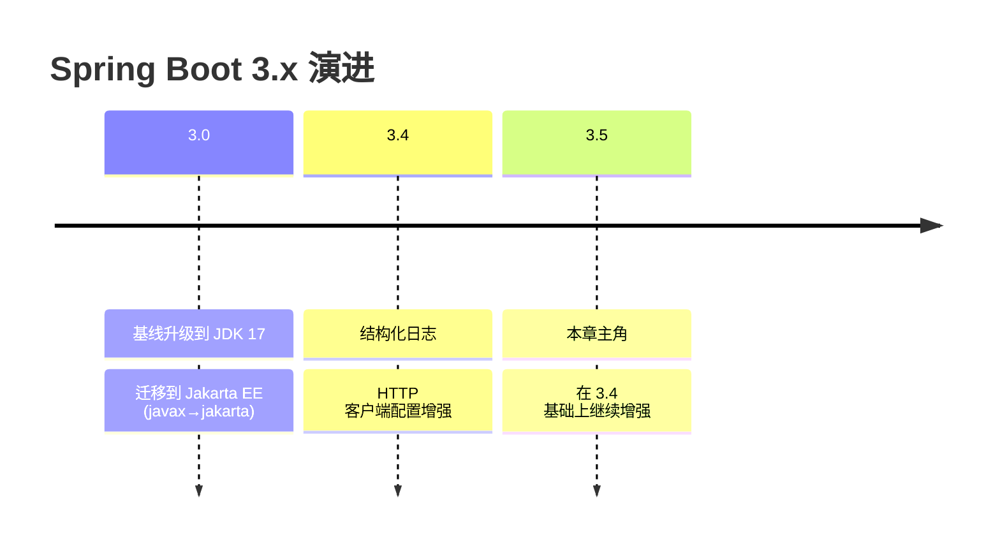
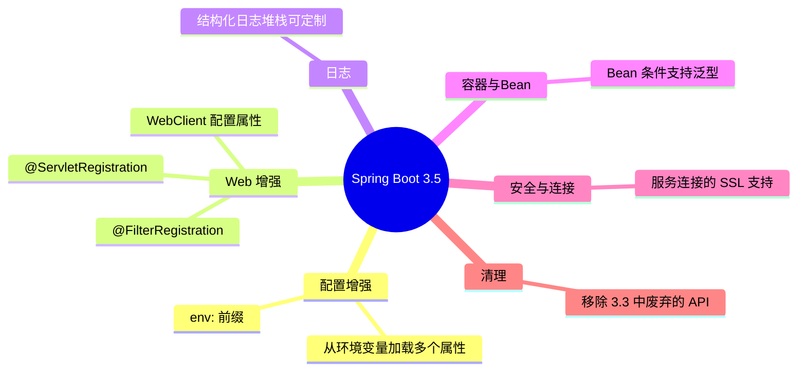
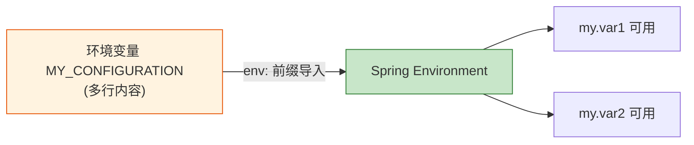
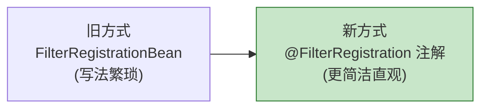
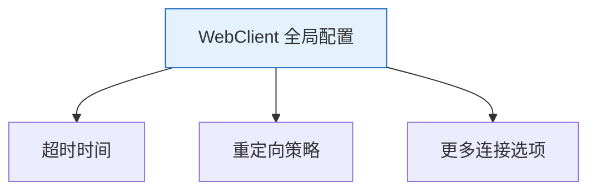
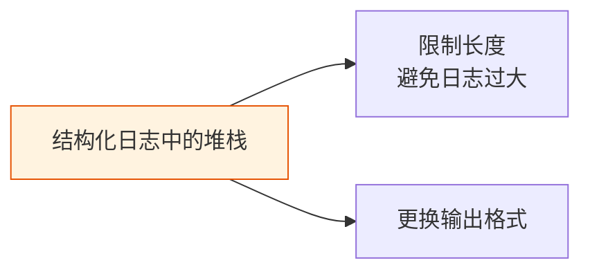
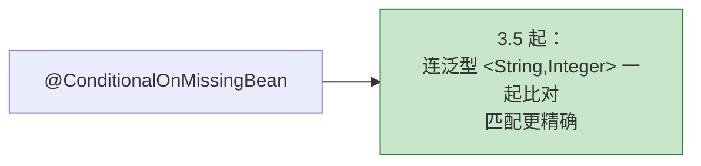
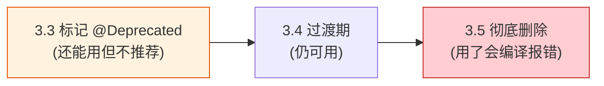
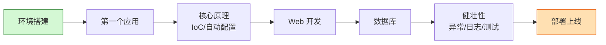
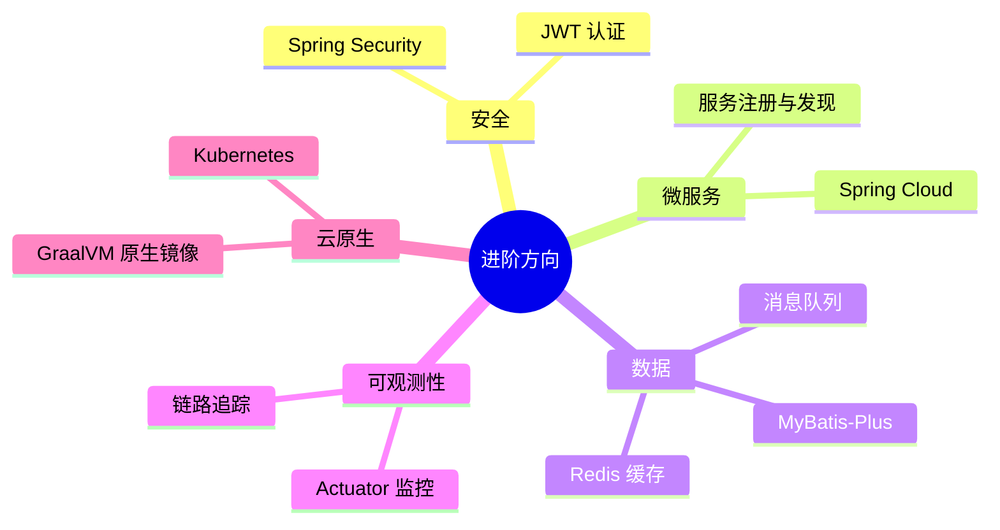

# 第 11 章：Spring Boot 3.5 新特性

> 本章目标：了解 Spring Boot **3.5** 相较之前版本带来的主要变化。内容基于 [官方 3.5 Release Notes](https://github.com/spring-projects/spring-boot/wiki/Spring-Boot-3.5-Release-Notes) 整理。
>
> 💡 初学者可以先浏览了解，不必强记；等你实际用到时再回来查。

---

## 11.1 版本背景



- Spring Boot **3.x 全系要求 JDK 17+**（推荐 17 或 21 LTS）。
- 3.5 的**最低环境要求相比 3.4 没有变化**，升级门槛低。
- 3.5 更多是"稳步增强"，没有 3.0 那种颠覆性变化，升级相对平滑。

---

## 11.2 新特性概览



下面挑几个对初学者相对好理解的展开讲。

---

## 11.3 从单个环境变量加载多个属性

**这是 3.5 一个很实用的小改进。**

以前，一个环境变量只能对应一个配置项。现在，可以用 `env:` 前缀，从**一个**多行环境变量里导入**多个**属性。

比如有一个多行内容的环境变量 `MY_CONFIGURATION`：

```text
my.var1=value1
my.var2=value2
```

在配置里这样导入：

```properties
spring.config.import=env:MY_CONFIGURATION
```

导入后，`my.var1` 和 `my.var2` 就都能在应用里读到了。



> 这在**容器化部署（Docker/K8s）**时很方便——可以把一批配置塞进一个环境变量统一注入。该特性支持 properties 和 YAML 两种格式。
> *（内容依据官方 Release Notes 整理，已改写以符合引用规范）*

---

## 11.4 注解式注册 Servlet 和 Filter

以前注册自定义的 `Servlet` 或 `Filter`，要用 `ServletRegistrationBean` / `FilterRegistrationBean`，写起来略繁琐。3.5 新增了两个注解作为替代：

- **`@ServletRegistration`**：注册 Servlet。
- **`@FilterRegistration`**：注册 Filter。

```java
@Configuration(proxyBeanMethods = false)
class MyConfiguration {

    @Bean
    @FilterRegistration(name = "my-filter", urlPatterns = "/test/*", order = 0)
    MyFilter myFilter() {
        return new MyFilter();
    }
}
```



---

## 11.5 WebClient 配置属性增强

3.4 曾为**阻塞式** HTTP 客户端加了配置属性支持。3.5 把这份能力对齐到了**响应式**的 `WebClient`：现在可以用配置属性统一设置**超时、重定向**等行为，还提供了 `ClientHttpConnectorBuilder` 做更复杂的定制。



> ⚠️ **一个默认行为的变化**：为了和阻塞式客户端对齐，**跟随重定向（follow redirects）现在默认开启**。如果你的应用依赖"默认不跟随重定向"的旧行为，升级时要注意。

---

## 11.6 结构化日志：堆栈信息可定制

结构化日志（把日志输出成 JSON 等机器可读格式，便于日志系统采集分析）是 3.4 引入的能力。3.5 进一步允许**定制异常堆栈**的输出——可以限制堆栈长度或换一种格式打印。

通过 `logging.structured.json.stacktrace.*` 这组属性来配置。



> 这对接入 ELK、Loki 等**日志平台**的团队很有用，能有效控制日志体积。

---

## 11.7 Bean 条件支持泛型返回类型

这条偏底层，了解即可。回顾第 04 章的条件注解 `@ConditionalOnMissingBean`。在 3.5 里，Bean 条件判断现在会**考虑泛型**。

```java
@Bean
@ConditionalOnMissingBean   // 现在会精确匹配 Converter<String, Integer>
public Converter<String, Integer> converter() {
    // ...
}
```

上面的条件只在"容器里没有 `Converter<String, Integer>` 这种**具体泛型**的 Bean"时才成立；如果想忽略泛型、匹配任意 `Converter`，就显式写 `@ConditionalOnMissingBean(Converter.class)`。



---

## 11.8 升级注意：移除了 3.3 中废弃的 API

Spring Boot 有个惯例：一个 API 被标记 `@Deprecated`（废弃）后，会保留几个版本，再彻底删除。

**3.5 删除了那些在 3.3 中被标记废弃、并计划在 3.5 移除的类、方法和属性。**



> 📌 **升级建议**：从旧版本升到 3.5 前，先在旧版本下把代码里的**废弃警告**都处理掉，再升级就会顺很多。

---

## 11.9 本章小结

| 新特性 | 一句话说明 | 对谁有用 |
| --- | --- | --- |
| `env:` 导入多属性 | 一个环境变量塞多个配置 | 容器化部署 |
| `@ServletRegistration` / `@FilterRegistration` | 注解式注册，更简洁 | 需要自定义 Servlet/Filter |
| WebClient 配置属性 | 超时/重定向可配置化 | 用响应式 HTTP 客户端 |
| 结构化日志堆栈定制 | 控制堆栈长度/格式 | 接入日志平台 |
| Bean 条件支持泛型 | 条件匹配更精确 | 框架/底层开发 |
| 移除 3.3 废弃 API | 清理历史包袱 | 版本升级时注意 |

- Spring Boot 3.5 是在 3.4 基础上的**稳健增强**，**最低要求不变（JDK 17+）**，升级平滑。
- 记住几个升级要点：**WebClient 默认跟随重定向**、**3.3 的废弃 API 被移除**。

---

## 🎓 结课寄语

恭喜你完成了整个 Spring Boot 3.5 学习之旅！我们一起走过了：



**接下来可以继续探索的方向：**



学习编程最好的方式是**做项目**。建议你现在就动手做一个小项目（比如一个待办清单、博客系统），把学到的知识用起来。遇到问题就查[官方文档](https://docs.spring.io/spring-boot/index.html)，它永远是最权威的老师。

祝你在 Spring Boot 的世界里越走越远！🚀

---

⬅️ 返回 [目录首页](./README.md)
