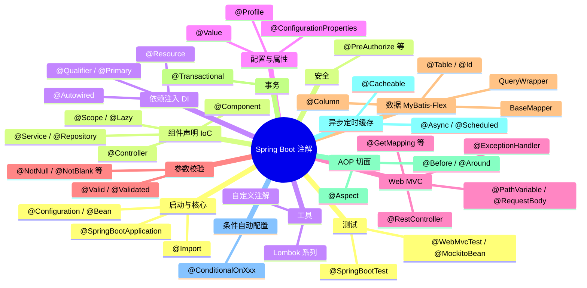
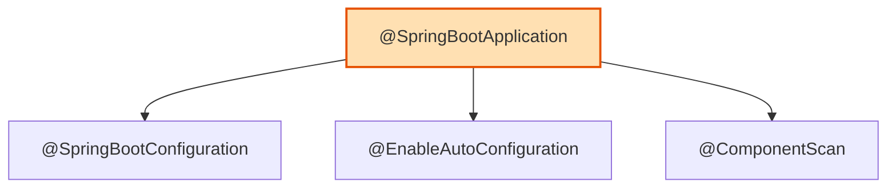
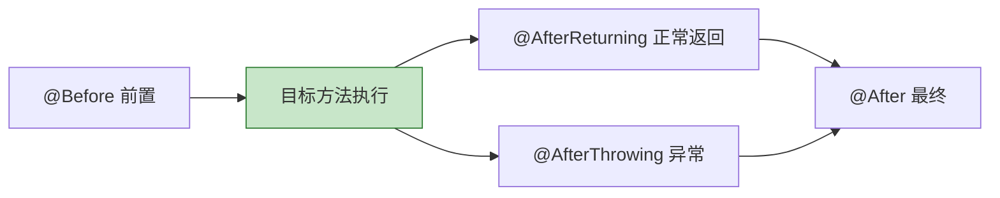
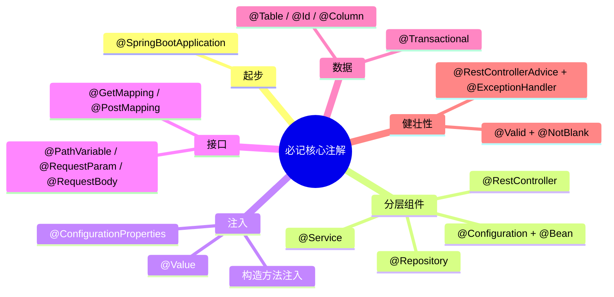

# 第 12 章：Spring Boot 注解大全（分类速查手册）

> 本章是一份**速查手册 / 附录**，把 Spring Boot 开发中会遇到的注解按用途分类整理，每类都配**速查表**和**示例代码**。
>
> 💡 **怎么用这一章**：不用从头背！先通读一遍建立印象，之后当成"字典"，需要时按分类查。记住一个核心思想——**注解就是贴给 Spring 看的"标签"，它本身不干活，是框架读到标签后替你干活。**

---

## 12.1 注解全景图

先用一张图看清 Spring Boot 注解的"版图"：



下面逐类展开。

---

## 12.2 启动与核心注解

| 注解 | 作用 |
| --- | --- |
| `@SpringBootApplication` | **启动类总注解**，三合一（见下） |
| `@SpringBootConfiguration` | 声明这是 Spring Boot 的配置类 |
| `@EnableAutoConfiguration` | 开启自动配置 |
| `@ComponentScan` | 扫描并注册组件 |
| `@Configuration` | 声明一个配置类（里面可定义 `@Bean`） |
| `@Bean` | 在配置类里手动声明一个 Bean |
| `@Import` | 导入其它配置类或组件 |
| `@PropertySource` | 加载额外的 properties 配置文件 |

**`@SpringBootApplication` = 三个注解的组合：**



**`@Configuration` + `@Bean` 示例**（当第三方类不能加 `@Component` 时，用这种方式手动注册）：

```java
@Configuration                       // 我是一个配置类
public class AppConfig {

    @Bean                            // 把返回值注册成一个 Bean，交给容器管理
    public RestTemplate restTemplate() {
        return new RestTemplate();
    }
}
```

---

## 12.3 组件声明注解（IoC 容器）

把类交给 Spring 容器管理（成为 Bean）：

| 注解 | 作用 | 用在哪一层 |
| --- | --- | --- |
| `@Component` | 通用组件 | 任意 |
| `@Service` | 业务逻辑组件 | Service 层 |
| `@Repository` | 数据访问组件（并转换数据库异常） | DAO/Repository 层 |
| `@Controller` | Web 控制器（返回视图） | Web 层 |
| `@RestController` | REST 控制器（返回 JSON） | Web 层 |
| `@Configuration` | 配置类 | 配置 |

**控制 Bean 行为的辅助注解：**

| 注解 | 作用 |
| --- | --- |
| `@Scope` | Bean 作用域：`singleton`（默认单例）/`prototype`（多例）等 |
| `@Lazy` | 懒加载，第一次用到时才创建 |
| `@Primary` | 有多个候选 Bean 时，标记为首选 |
| `@Order` | 指定多个 Bean 的顺序 |
| `@DependsOn` | 声明依赖关系，控制创建顺序 |
| `@PostConstruct` | Bean 创建后执行的初始化方法 |
| `@PreDestroy` | Bean 销毁前执行的方法 |

```java
@Service
@Scope("singleton")          // 单例（默认就是单例，这里只是演示）
public class UserService {

    @PostConstruct           // 容器创建好这个 Bean 后自动调用
    public void init() {
        System.out.println("UserService 初始化完成");
    }
}
```

---

## 12.4 依赖注入注解

| 注解 | 作用 | 备注 |
| --- | --- | --- |
| `@Autowired` | 按类型自动注入 | Spring 提供，最常用 |
| `@Qualifier` | 配合 `@Autowired`，按名称精确指定 | 解决"多个候选"歧义 |
| `@Primary` | 多个候选时的默认首选 | 加在 Bean 定义上 |
| `@Resource` | 按名称注入（默认） | JDK/Jakarta 提供 |
| `@Value` | 注入配置值或字面量 | 见 12.5 |

**推荐构造方法注入**（依赖不可变、便于测试）：

```java
@Service
public class OrderService {

    private final UserService userService;

    // 只有一个构造方法时，@Autowired 可省略
    public OrderService(UserService userService) {
        this.userService = userService;
    }
}
```

**多个实现类时用 `@Qualifier` 指定：**

```java
@Autowired
@Qualifier("aliPayService")   // 指定注入名为 aliPayService 的那个实现
private PayService payService;
```

---

## 12.5 配置与属性注解

| 注解 | 作用 |
| --- | --- |
| `@Value` | 注入单个配置项或默认值 |
| `@ConfigurationProperties` | 批量绑定一组配置到对象（类型安全，推荐） |
| `@EnableConfigurationProperties` | 启用某个 `@ConfigurationProperties` 类 |
| `@ConfigurationPropertiesScan` | 扫描 `@ConfigurationProperties` 类 |
| `@Profile` | 指定 Bean 在哪个环境（dev/prod）下生效 |
| `@PropertySource` | 引入额外的 `.properties` 文件 |

```java
// 方式一：@Value 读单个值
@Value("${server.port:8080}")   // 冒号后是默认值
private int port;

// 方式二：@ConfigurationProperties 批量绑定（推荐）
@Component
@ConfigurationProperties(prefix = "app")   // 绑定所有 app.* 配置
public class AppProperties {
    private String name;
    private String version;
    // getter / setter ...
}
```

**`@Profile` 按环境激活：**

```java
@Bean
@Profile("dev")     // 只有激活 dev 环境时才创建这个 Bean
public DataSource devDataSource() { ... }
```

---

## 12.6 Web / MVC 注解

### 控制器与请求映射

| 注解 | 作用 |
| --- | --- |
| `@RestController` | REST 控制器（返回 JSON） |
| `@Controller` | 控制器（返回页面视图） |
| `@RequestMapping` | 通用请求映射（可指定路径和方法） |
| `@GetMapping` | 映射 GET 请求（查询） |
| `@PostMapping` | 映射 POST 请求（新增） |
| `@PutMapping` | 映射 PUT 请求（更新） |
| `@DeleteMapping` | 映射 DELETE 请求（删除） |
| `@PatchMapping` | 映射 PATCH 请求（部分更新） |

### 参数绑定

| 注解 | 从哪里取参数 |
| --- | --- |
| `@PathVariable` | URL 路径变量 `/users/{id}` |
| `@RequestParam` | URL 查询参数 `?name=x` |
| `@RequestBody` | 请求体（JSON） |
| `@RequestHeader` | 请求头 |
| `@CookieValue` | Cookie |
| `@RequestPart` | 文件上传（multipart） |
| `@ModelAttribute` | 表单对象绑定 |

### 响应与全局处理

| 注解 | 作用 |
| --- | --- |
| `@ResponseBody` | 方法返回值直接作为响应体（`@RestController` 已内置） |
| `@ResponseStatus` | 指定响应状态码 |
| `@RestControllerAdvice` | 全局异常处理（返回 JSON） |
| `@ControllerAdvice` | 全局异常处理（返回视图） |
| `@ExceptionHandler` | 处理指定类型的异常 |
| `@CrossOrigin` | 跨域配置（可用在类或方法上） |

```java
@RestController
@RequestMapping("/users")
public class UserController {

    @GetMapping("/{id}")                               // GET /users/1
    public User get(@PathVariable Long id) { ... }

    @GetMapping("/search")                             // GET /users/search?kw=张
    public List<User> search(@RequestParam String kw) { ... }

    @PostMapping                                       // POST /users  提交JSON
    @ResponseStatus(HttpStatus.CREATED)                // 返回 201
    public User create(@RequestBody User user) { ... }
}
```

```java
@RestControllerAdvice   // 全局异常处理
public class GlobalExceptionHandler {

    @ExceptionHandler(Exception.class)   // 捕获所有异常
    public Result<Void> handle(Exception e) {
        return Result.fail(500, e.getMessage());
    }
}
```


---

## 12.7 参数校验注解

需先引入 `spring-boot-starter-validation`。校验注解加在字段上，配合 `@Valid` / `@Validated` 触发。

| 触发注解 | 作用 |
| --- | --- |
| `@Valid` | 触发校验（JSR 标准，支持嵌套校验） |
| `@Validated` | 触发校验（Spring 提供，支持**分组校验**） |

| 约束注解 | 校验规则 |
| --- | --- |
| `@NotNull` | 不能为 null |
| `@NotBlank` | 字符串不能为 null 且去空格后长度 > 0 |
| `@NotEmpty` | 集合/字符串不能为空 |
| `@Size(min=, max=)` | 长度/大小在区间内 |
| `@Min` / `@Max` | 数值最小/最大值 |
| `@Positive` / `@Negative` | 正数 / 负数 |
| `@Email` | 邮箱格式 |
| `@Pattern(regexp=)` | 匹配正则表达式 |
| `@Past` / `@Future` | 日期必须是过去 / 将来 |
| `@DecimalMin` / `@DecimalMax` | 带小数的最小/最大值 |

```java
public class UserDTO {
    @NotBlank(message = "用户名不能为空")
    private String name;

    @Min(value = 0, message = "年龄不能为负")
    @Max(value = 150, message = "年龄超出范围")
    private Integer age;

    @Email(message = "邮箱格式不正确")
    private String email;
}

// Controller 里用 @Valid 触发
@PostMapping("/users")
public Result<Void> create(@Valid @RequestBody UserDTO dto) { ... }
```

---

## 12.8 数据访问注解（MyBatis-Flex）

> 本教程数据访问层使用 **MyBatis-Flex**（详见第 07 章）。以下注解均在 `com.mybatisflex.annotation` 包下。

### 实体映射

| 注解 | 作用 |
| --- | --- |
| `@Table("表名")` | 声明实体类对应的数据库表 |
| `@Id` | 标记主键 |
| `@Id(keyType = KeyType.Auto)` | 主键 + 生成策略（`Auto` 自增 / `None` / `Generator`） |
| `@Column("列名")` | 字段与列映射（**默认驼峰↔下划线自动映射，一般不用写**） |
| `@Column(ignore = true)` | 该字段不参与数据库映射 |
| `@Column(isLogicDelete = true)` | 逻辑删除字段（删除变为改标记，非物理删除） |
| `@Column(version = true)` | 乐观锁版本字段 |
| `@Column(typeHandler = Xxx.class)` | 自定义类型处理器（如 JSON、加密） |
| `@ColumnMask("规则")` | 数据脱敏（如手机号、邮箱打码） |

> ⚠️ MyBatis-Flex 的注解在 `com.mybatisflex.annotation.*` 包下，**不是** JPA 的 `jakarta.persistence.*`。

### 关系映射（多表关联查询）

| 注解 | 关系 |
| --- | --- |
| `@RelationOneToOne` | 一对一 |
| `@RelationOneToMany` | 一对多 |
| `@RelationManyToOne` | 多对一 |
| `@RelationManyToMany` | 多对多 |

### 数据操作相关（接口 / 扫描，非注解也一并列出）

| 名称 | 作用 |
| --- | --- |
| `BaseMapper<T>` | Mapper 接口继承它，即免费获得全套 CRUD |
| `@MapperScan("包名")` | 启动类上，扫描 Mapper 接口所在包 |
| `@Mapper` | 标注单个 Mapper 接口（与 `@MapperScan` 二选一） |

```java
import com.mybatisflex.annotation.*;
import com.mybatisflex.core.BaseMapper;
import lombok.Data;

@Data
@Table("tb_user")                 // 类 ↔ 表
public class User {

    @Id(keyType = KeyType.Auto)    // 主键，数据库自增
    private Long id;

    private String userName;       // 自动映射到 user_name 列（驼峰↔下划线）

    @Column("email_addr")          // 列名与字段名不一致时显式指定
    private String email;

    @Column(isLogicDelete = true)  // 逻辑删除标记
    private Boolean deleted;

    @Column(version = true)        // 乐观锁版本号
    private Integer version;
}

// Mapper 接口继承 BaseMapper，即可免费获得增删改查
public interface UserMapper extends BaseMapper<User> {
}
```

> 💡 查询条件用 `QueryWrapper` 构建（配合 APT 生成的 `TableDef`，如 `USER.USER_NAME`），完整用法见 **第 07 章**。

---

## 12.9 事务注解

| 注解 | 作用 |
| --- | --- |
| `@Transactional` | 开启事务（方法或类级别） |
| `@EnableTransactionManagement` | 启用事务管理（Spring Boot 已自动开启） |

**`@Transactional` 常用属性：**

| 属性 | 说明 |
| --- | --- |
| `propagation` | 传播行为（如 `REQUIRED`、`REQUIRES_NEW`） |
| `isolation` | 隔离级别 |
| `rollbackFor` | 指定哪些异常触发回滚 |
| `readOnly` | 只读事务（查询优化） |
| `timeout` | 超时时间（秒） |

```java
@Service
public class TransferService {

    @Transactional(rollbackFor = Exception.class)  // 出任何异常都回滚
    public void transfer(Long from, Long to, int money) {
        // 扣钱、加钱……中途出错则整体回滚
    }
}
```

> ⚠️ **注意**：`@Transactional` 默认只对 `RuntimeException` 回滚。若要对受检异常也回滚，需写 `rollbackFor = Exception.class`。且它基于代理实现，**同类内部方法直接调用不生效**。

---

## 12.10 AOP 切面注解

AOP（面向切面编程）用于把日志、权限、事务等**横切逻辑**从业务代码中抽离。需引入 `spring-boot-starter-aop`。

| 注解 | 作用 |
| --- | --- |
| `@Aspect` | 声明一个切面类 |
| `@Pointcut` | 定义切入点（匹配哪些方法） |
| `@Before` | 目标方法**执行前** |
| `@After` | 目标方法**执行后**（无论成败） |
| `@AfterReturning` | 目标方法**正常返回后** |
| `@AfterThrowing` | 目标方法**抛异常后** |
| `@Around` | **环绕**（前后都能控制，最强大） |
| `@EnableAspectJAutoProxy` | 启用 AOP（Spring Boot 已自动开启） |



```java
@Aspect
@Component
public class LogAspect {

    // 匹配 service 包下所有方法
    @Pointcut("execution(* com.example.demo.service..*(..))")
    public void serviceMethods() {}

    @Around("serviceMethods()")   // 环绕通知：统计方法耗时
    public Object logTime(ProceedingJoinPoint pjp) throws Throwable {
        long start = System.currentTimeMillis();
        Object result = pjp.proceed();          // 执行目标方法
        long cost = System.currentTimeMillis() - start;
        System.out.println(pjp.getSignature() + " 耗时 " + cost + "ms");
        return result;
    }
}
```

---

## 12.11 异步与定时任务注解

| 注解 | 作用 |
| --- | --- |
| `@EnableAsync` | 启用异步（加在配置类/启动类上） |
| `@Async` | 标记方法异步执行（另起线程） |
| `@EnableScheduling` | 启用定时任务 |
| `@Scheduled` | 标记定时执行的方法 |

```java
@Service
public class NotifyService {

    @Async                              // 异步执行，不阻塞调用方
    public void sendEmail(String to) { ... }

    @Scheduled(cron = "0 0 2 * * ?")    // 每天凌晨2点执行
    public void dailyJob() { ... }

    @Scheduled(fixedRate = 5000)        // 每 5 秒执行一次
    public void heartbeat() { ... }
}
```

> 别忘了在启动类或配置类上加 `@EnableAsync` / `@EnableScheduling`，否则不生效。

---

## 12.12 缓存注解

需引入缓存实现（如 Redis 或 Caffeine），并在配置类加 `@EnableCaching`。

| 注解 | 作用 |
| --- | --- |
| `@EnableCaching` | 启用缓存 |
| `@Cacheable` | 查询前先查缓存，有则直接返回，无则执行并缓存 |
| `@CachePut` | 总是执行方法，并把结果更新到缓存 |
| `@CacheEvict` | 删除缓存 |
| `@Caching` | 组合多个缓存操作 |
| `@CacheConfig` | 类级别的公共缓存配置 |

```java
@Service
public class UserService {

    @Cacheable(value = "user", key = "#id")   // 缓存查询结果，key 为 id
    public User getById(Long id) { ... }

    @CacheEvict(value = "user", key = "#id")  // 更新后清除对应缓存
    public void update(Long id, User user) { ... }
}
```

---

## 12.13 条件与自动配置注解

这些注解是 Spring Boot **自动配置**的核心，判断"该不该创建某个 Bean"。日常开发写自定义 Starter 时用得多。

| 注解 | 生效条件 |
| --- | --- |
| `@Conditional` | 满足自定义条件时 |
| `@ConditionalOnClass` | 类路径存在指定类时 |
| `@ConditionalOnMissingClass` | 类路径不存在指定类时 |
| `@ConditionalOnBean` | 容器已存在指定 Bean 时 |
| `@ConditionalOnMissingBean` | 容器不存在指定 Bean 时（用户没自定义才用默认） |
| `@ConditionalOnProperty` | 指定配置项满足条件时 |
| `@ConditionalOnWebApplication` | 是 Web 应用时 |
| `@ConditionalOnExpression` | SpEL 表达式为真时 |
| `@AutoConfiguration` | 声明一个自动配置类 |

```java
@Configuration
@ConditionalOnClass(RedisTemplate.class)   // 只有引入了 Redis 才配置
public class MyRedisConfig {

    @Bean
    @ConditionalOnMissingBean               // 用户没自定义时才用这个默认的
    public RedisService redisService() { ... }
}
```

---

## 12.14 测试注解

| 注解 | 作用 |
| --- | --- |
| `@SpringBootTest` | 加载完整容器做集成测试 |
| `@WebMvcTest` | 只加载 Web 层测试 Controller |
| `@DataJpaTest` | 只加载 JPA 数据层做测试（JPA 专用；本教程用 MyBatis-Flex，测 Mapper 用 `@SpringBootTest`） |
| `@Test` | JUnit 5 测试方法 |
| `@BeforeEach` / `@AfterEach` | 每个测试前/后执行 |
| `@BeforeAll` / `@AfterAll` | 所有测试前/后执行一次 |
| `@Mock` | Mockito 创建假对象 |
| `@InjectMocks` | 把假对象注入被测对象 |
| `@MockitoBean` | 在 Spring 容器中替换成假 Bean（Boot 3.4+，取代旧 `@MockBean`） |
| `@MockitoSpyBean` | 部分模拟（取代旧 `@SpyBean`） |
| `@ExtendWith` | 启用扩展（如 `MockitoExtension`） |
| `@ActiveProfiles` | 指定测试用的环境 |
| `@Sql` | 测试前执行 SQL 脚本 |

```java
@WebMvcTest(UserController.class)
class UserControllerTest {

    @Autowired
    private MockMvc mockMvc;

    @MockitoBean               // 造假的 Service（新注解）
    private UserService userService;

    @Test
    void 查询用户() throws Exception {
        when(userService.getById(1L)).thenReturn(new User());
        mockMvc.perform(get("/users/1")).andExpect(status().isOk());
    }
}
```

---

## 12.15 Spring Security 常用注解（简介）

需引入 `spring-boot-starter-security`。这里只列常用的，深入需专门学习。

| 注解 | 作用 |
| --- | --- |
| `@EnableWebSecurity` | 启用 Web 安全配置 |
| `@EnableMethodSecurity` | 启用方法级权限控制（Boot 3.x 推荐，取代旧 `@EnableGlobalMethodSecurity`） |
| `@PreAuthorize` | 方法执行**前**鉴权（支持 SpEL） |
| `@PostAuthorize` | 方法执行**后**鉴权 |
| `@Secured` | 简单的角色检查 |
| `@RolesAllowed` | 允许的角色（JSR 标准） |
| `@AuthenticationPrincipal` | 注入当前登录用户 |

```java
@RestController
public class AdminController {

    @PreAuthorize("hasRole('ADMIN')")   // 只有 ADMIN 角色能访问
    @DeleteMapping("/users/{id}")
    public void delete(@PathVariable Long id) { ... }
}
```

---

## 12.16 Lombok 常用注解（配合使用）

Lombok 不属于 Spring，但在 Spring 项目里**极其常用**——它用注解自动生成 getter/setter、构造方法等，减少样板代码。需引入 `lombok` 依赖。

| 注解 | 作用 |
| --- | --- |
| `@Data` | 一键生成 getter/setter/toString/equals/hashCode |
| `@Getter` / `@Setter` | 只生成 getter / setter |
| `@NoArgsConstructor` | 生成无参构造 |
| `@AllArgsConstructor` | 生成全参构造 |
| `@RequiredArgsConstructor` | 生成 final 字段的构造（常用于构造注入） |
| `@Builder` | 生成建造者模式 |
| `@Slf4j` | 自动生成 `log` 日志对象 |
| `@ToString` / `@EqualsAndHashCode` | 单独生成对应方法 |

```java
@Data                          // 自动生成 getter/setter 等
@AllArgsConstructor
@NoArgsConstructor
public class User {
    private Long id;
    private String name;
}

@Service
@RequiredArgsConstructor       // 为 final 字段自动生成构造方法（实现构造注入）
@Slf4j                         // 直接使用 log 变量
public class UserService {
    private final UserMapper userMapper;   // 自动注入

    public void demo() {
        log.info("使用 Lombok 生成的 log");
    }
}
```

---

## 12.17 自定义注解（元注解）

当内置注解不够用时，可以**自己造注解**。用来"造注解"的注解叫**元注解**：

| 元注解 | 作用 |
| --- | --- |
| `@Target` | 注解能用在哪里（类/方法/字段…） |
| `@Retention` | 注解保留到什么时候（源码/编译/运行时） |
| `@Documented` | 生成文档时包含该注解 |
| `@Inherited` | 允许子类继承该注解 |

**实战：自定义一个 `@LogExecutionTime` 注解，配合 AOP 统计方法耗时：**

```java
// 1. 定义注解
@Target(ElementType.METHOD)              // 只能用在方法上
@Retention(RetentionPolicy.RUNTIME)      // 运行时可读（AOP 才能读到）
public @interface LogExecutionTime {
}

// 2. 用 AOP 处理这个注解
@Aspect
@Component
public class LogAspect {
    @Around("@annotation(LogExecutionTime)")   // 匹配带该注解的方法
    public Object around(ProceedingJoinPoint pjp) throws Throwable {
        long start = System.currentTimeMillis();
        Object r = pjp.proceed();
        System.out.println("耗时：" + (System.currentTimeMillis() - start) + "ms");
        return r;
    }
}

// 3. 使用
@Service
public class ReportService {
    @LogExecutionTime                    // 贴上自定义标签，自动统计耗时
    public void generate() { ... }
}
```

---

## 12.18 高频注解速记表（最后冲刺）

如果时间有限，**先记住下面这些最高频的**，覆盖 80% 的日常开发：



| 场景 | 一定要会的注解 |
| --- | --- |
| 启动 | `@SpringBootApplication` |
| 写接口 | `@RestController`、`@GetMapping`/`@PostMapping`、`@RequestBody`、`@PathVariable`、`@RequestParam` |
| 分层 | `@Service`、`@Repository` |
| 注入 | 构造方法注入（`@Autowired` 可省）、`@Value`、`@ConfigurationProperties` |
| 手动 Bean | `@Configuration`、`@Bean` |
| 数据库（MyBatis-Flex） | `@Table`、`@Id`、`@Column`、`@Transactional` |
| 异常/校验 | `@RestControllerAdvice`、`@ExceptionHandler`、`@Valid`、`@NotBlank` |

---

## 12.19 本章小结

- 注解本质是**贴给 Spring 看的"标签"**，框架读到后替你完成配置和装配。
- 注解虽多，但**按场景分类记忆**最有效：启动、组件、注入、Web、数据、事务、AOP、异步/缓存、测试、安全。
- **不必一次背完**：先掌握 [12.18 高频速记表] 里的核心注解，其余当字典按需查。
- 内置注解不够用时，可用**元注解自定义注解**，配合 AOP 实现强大功能。

---

⬅️ 返回 [目录首页](./README.md) ｜ 上一章：[Spring Boot 3.5 新特性](./11-SpringBoot3.5新特性.md)

🎉 至此，整个教程（12 章）就全部学完了。祝你在 Spring Boot 的世界里越走越顺！
