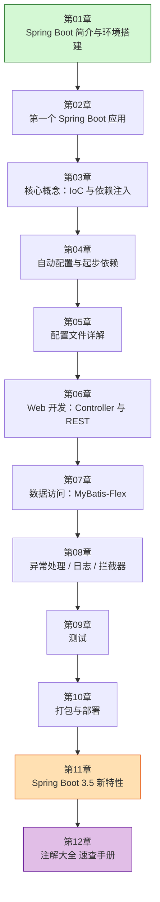
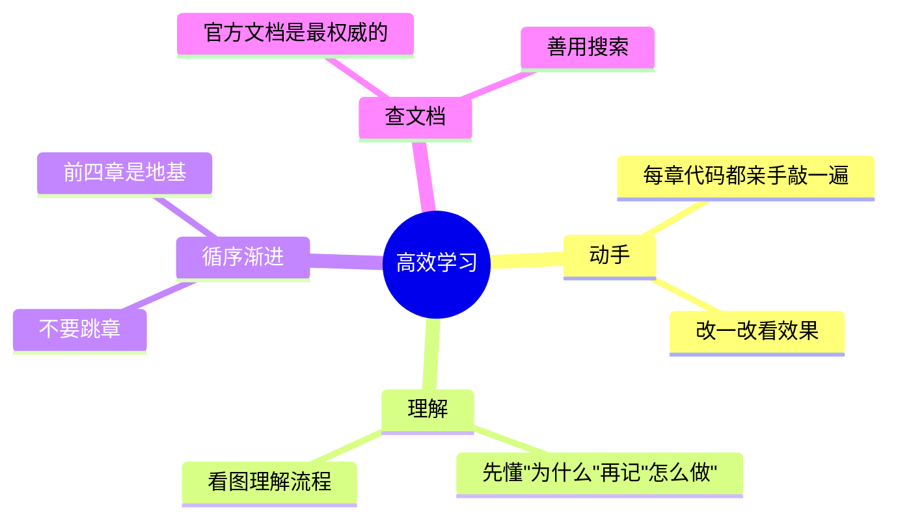

# Spring Boot 3.5 中文学习资料（从零基础到实战）

> 这是一份专为中文初学者准备的 **Spring Boot 3.5** 学习教程，从最基础的概念讲起，配有大量 **Mermaid 图表**（架构图、流程图、时序图等），帮助你直观理解。

## 📖 关于本教程

- **适合人群**：有一点 Java 基础（懂类、方法、变量即可），想入门 Spring Boot 的同学。
- **版本**：Spring Boot **3.5.x**，**本教程统一使用 JDK 21 LTS**（框架最低要求 JDK 17）。
- **配图说明**：本教程中的所有图表都用 [Mermaid](https://mermaid.js.org/) 绘制。在 **GitHub**、**VS Code（装 Mermaid 插件）**、**Typora**、**语雀** 等工具中打开 `.md` 文件时，图表会自动渲染成真正的图形；如果你用纯文本编辑器打开，看到的会是图表的源码。

## 🗺️ 学习路线图

## 📚 章节目录

| 章节 | 标题 | 你将学到 |
| --- | --- | --- |
| [第 01 章](./01-SpringBoot简介与环境搭建.md) | Spring Boot 简介与环境搭建 | 什么是 Spring Boot、为什么用它、装好开发环境 |
| [第 02 章](./02-第一个SpringBoot应用.md) | 第一个 Spring Boot 应用 | 创建项目、项目结构、写出 Hello World |
| [第 03 章](./03-核心概念-IoC与依赖注入.md) | 核心概念：IoC 与依赖注入 | 理解 Spring 的灵魂：控制反转与 DI |
| [第 04 章](./04-自动配置与起步依赖.md) | 自动配置与起步依赖 | 搞懂 Spring Boot "开箱即用"的魔法 |
| [第 05 章](./05-配置文件详解.md) | 配置文件详解 | application.yml、多环境、类型安全配置 |
| [第 06 章](./06-Web开发-Controller与RESTful.md) | Web 开发：Controller 与 REST | 写接口、收参数、返回 JSON |
| [第 07 章](./07-数据访问-MyBatisFlex.md) | 数据访问：MyBatis-Flex | 连数据库、BaseMapper、QueryWrapper、分页 |
| [第 08 章](./08-常用功能-异常处理与日志.md) | 异常处理 / 日志 / 拦截器 | 让项目更健壮、更专业 |
| [第 09 章](./09-测试.md) | 测试 | 单元测试、Web 层测试、集成测试 |
| [第 10 章](./10-打包与部署.md) | 打包与部署 | 打成 jar、用 Docker 部署 |
| [第 11 章](./11-SpringBoot3.5新特性.md) | Spring Boot 3.5 新特性 | 官方 3.5 版本的新变化 |
| [第 12 章](./12-注解大全.md) | 注解大全（速查手册） | 全部常用注解分类速查表 + 示例 |

## 💡 学习建议

1. **一定要动手敲代码**，光看不练是学不会编程的。
2. 遇到报错先别慌，仔细读错误信息，它通常会告诉你哪里出了问题。
3. 前 4 章是基础中的基础，务必弄懂，后面会轻松很多。

## 🔗 官方资源

- Spring Boot 官网：https://spring.io/projects/spring-boot
- Spring Initializr（在线创建项目）：https://start.spring.io
- 官方文档：https://docs.spring.io/spring-boot/index.html

---

准备好了吗？从 [第 01 章](./01-SpringBoot简介与环境搭建.md) 开始你的 Spring Boot 之旅吧！🚀
