# Spring Boot 3.5 中文完整学习教程（从零基础到实战）

> 这是一份专为中文初学者准备的 **Spring Boot 3.5** 学习教程（单文件版），从最基础的概念讲起，配有大量 **Mermaid 图表**（架构图、流程图、时序图等），帮助你直观理解。

## 📖 关于本教程

- **适合人群**：有一点 Java 基础（懂类、方法、变量即可），想入门 Spring Boot 的同学。
- **版本**：Spring Boot **3.5.x**，**本教程统一使用 JDK 21 LTS**（框架最低要求 JDK 17）。
- **配图说明**：本教程中的所有图表都用 [Mermaid](https://mermaid.js.org/) 绘制。在 **GitHub**、**VS Code（装 Mermaid 插件）**、**Typora**、**语雀** 等工具中打开本 `.md` 文件时，图表会自动渲染成真正的图形；如果用纯文本编辑器打开，看到的会是图表的源码。

## 🗺️ 学习路线图

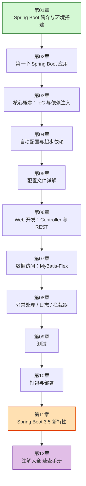

## 📚 目录

- [第 01 章：Spring Boot 简介与环境搭建](#ch01)
- [第 02 章：第一个 Spring Boot 应用](#ch02)
- [第 03 章：核心概念 —— IoC 与依赖注入](#ch03)
- [第 04 章：自动配置与起步依赖](#ch04)
- [第 05 章：配置文件详解](#ch05)
- [第 06 章：Web 开发 —— Controller 与 RESTful API](#ch06)
- [第 07 章：数据访问 —— MyBatis-Flex](#ch07)
- [第 08 章：异常处理、日志、拦截器等常用功能](#ch08)
- [第 09 章：测试](#ch09)
- [第 10 章：打包与部署](#ch10)
- [第 11 章：Spring Boot 3.5 新特性](#ch11)
- [第 12 章：Spring Boot 注解大全（分类速查手册）](#ch12)

## 💡 学习建议

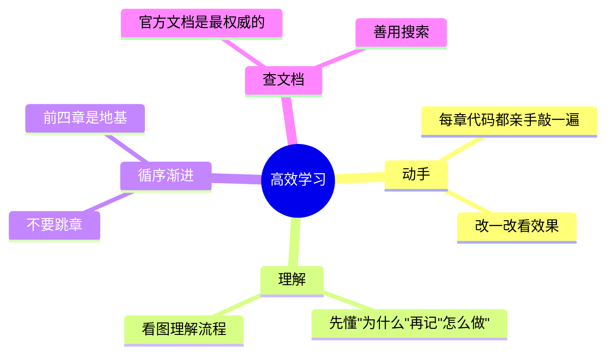

1. **一定要动手敲代码**，光看不练是学不会编程的。
2. 遇到报错先别慌，仔细读错误信息，它通常会告诉你哪里出了问题。
3. 前 4 章是基础中的基础，务必弄懂，后面会轻松很多。

## 🔗 官方资源

- Spring Boot 官网：https://spring.io/projects/spring-boot
- Spring Initializr（在线创建项目）：https://start.spring.io
- 官方文档：https://docs.spring.io/spring-boot/index.html

---


<a id="ch01"></a>

# 第 01 章：Spring Boot 简介与环境搭建

> 本章目标：搞清楚 **Spring Boot 到底是什么、为什么大家都在用**，并**把开发环境装好**，为后面写代码做准备。

---

## 1.1 先认识一下 Spring 家族

在学 Spring Boot 之前，我们要先知道它在整个 Spring 生态里的位置。很多初学者会把 Spring、Spring MVC、Spring Boot 搞混，我们用一张图理清关系：

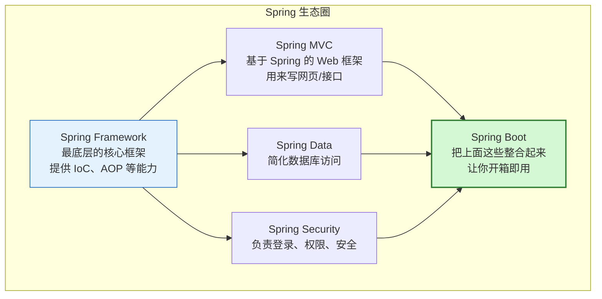

一句话总结：

- **Spring Framework** 是地基，功能强大但配置繁琐。
- **Spring Boot** 是站在 Spring Framework 肩膀上的"脚手架"，帮你把繁琐的配置都做好了，你只管写业务代码。

> 📌 **Spring Boot 不是要取代 Spring，而是让 Spring 更好用。**

---

## 1.2 没有 Spring Boot 的日子有多苦？

我们来对比一下。假设要做一个能在浏览器访问的 Web 项目：

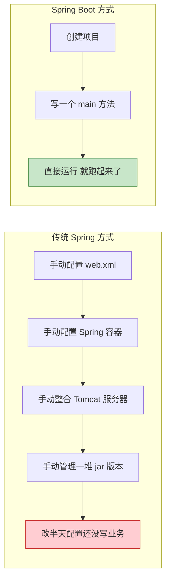

**Spring Boot 帮你解决了三大痛点：**

| 痛点 | 传统 Spring | Spring Boot |
| --- | --- | --- |
| 配置太多 | 大量 XML / Java 配置 | **自动配置**，几乎零配置 |
| 依赖版本乱 | 自己一个个查版本、怕冲突 | **起步依赖（Starter）**，版本自动搭配好 |
| 部署麻烦 | 要装外部 Tomcat | **内嵌服务器**，打成 jar 直接 `java -jar` 运行 |

---

## 1.3 Spring Boot 的核心特性

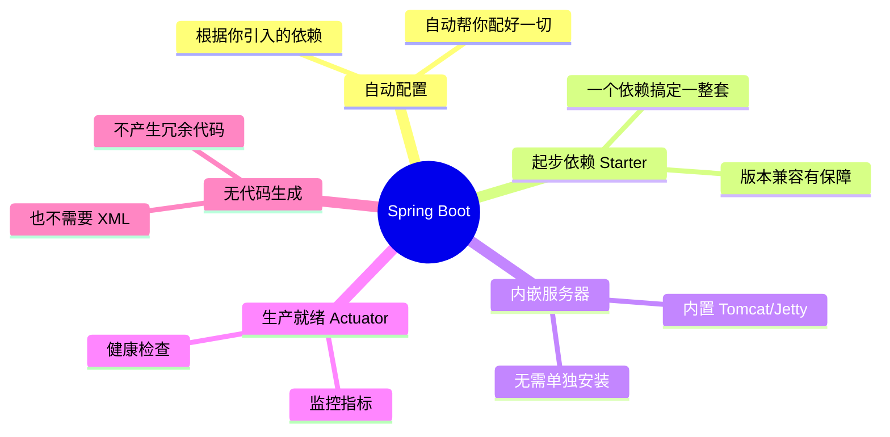

---

## 1.4 环境准备清单

学习 Spring Boot 3.5，你需要准备三样东西：

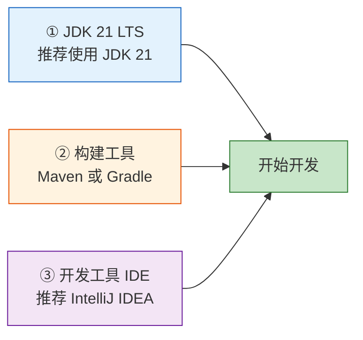

> ⚠️ **重点：本教程统一使用 JDK 21 LTS！**（Spring Boot 3.x 最低要求 JDK 17，我们直接选用更新、更稳的 21）如果你还在用 JDK 8 或 11，必须升级，否则项目无法运行。

### ① 安装并检查 JDK

安装后，打开命令行（Windows 是 CMD/PowerShell，Mac/Linux 是终端），输入：

```bash
java -version
```

如果看到类似下面的输出（版本号 ≥ 21），说明 JDK 装好了：

```text
openjdk version "21.0.5" 2024-10-15
OpenJDK Runtime Environment (build 21.0.5+11)
OpenJDK 64-Bit Server VM (build 21.0.5+11, mixed mode, sharing)
```

> 💡 JDK 下载推荐：[Eclipse Temurin (Adoptium)](https://adoptium.net/) 或 [Oracle JDK](https://www.oracle.com/java/technologies/downloads/)。

### ② 关于 Maven / Gradle

它们是**构建工具**，负责帮你下载依赖、编译、打包。二选一即可，本教程主要用 **Maven**（初学者更常见、更直观）。

- 好消息：如果你用 IntelliJ IDEA，它**自带 Maven**，通常不用单独安装。
- 检查命令（如果单独装了）：`mvn -version`

### ③ 安装 IDE

强烈推荐 **IntelliJ IDEA**（社区版免费就够用了），对 Spring Boot 支持最好。也可以用 VS Code + Java 插件、或 Eclipse。

---

## 1.5 Spring Boot 应用是怎么跑起来的？（整体预览）

在正式写代码前，先建立一个宏观印象。一个 Spring Boot 应用运行时大概是这样的：

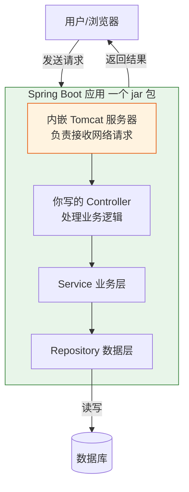

看不懂细节没关系，这只是让你有个整体印象。**注意最关键的一点**：Tomcat 服务器是**内嵌**在 jar 包里的，这就是为什么 Spring Boot 应用可以直接 `java -jar` 运行，不需要你另外安装服务器。

---

## 1.6 本章小结

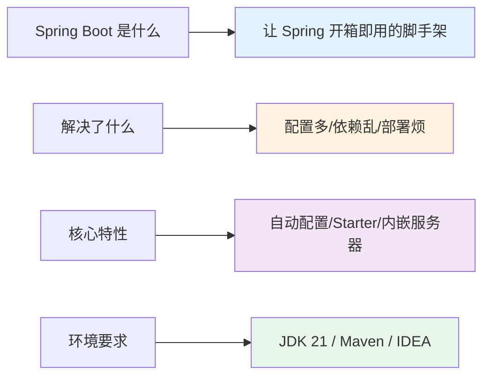

- Spring Boot 是简化 Spring 开发的框架，核心是**自动配置**、**起步依赖**和**内嵌服务器**。
- 开发环境需要 **JDK 21**、**Maven（或 Gradle）** 和一个 **IDE**。
- 应用打包成 jar，内嵌服务器，可直接运行。

---

➡️ 环境准备好了，下一章我们就来 **[创建第一个 Spring Boot 应用](#ch02)**，让程序真正跑起来！

---

<a id="ch02"></a>

# 第 02 章：第一个 Spring Boot 应用

> 本章目标：**亲手创建并运行**你的第一个 Spring Boot 项目，理解项目结构，并写出一个能在浏览器访问的 "Hello World"。

---

## 2.1 用 Spring Initializr 创建项目

Spring 官方提供了一个在线工具 **[Spring Initializr](https://start.spring.io)**，帮你快速生成项目骨架。它就像点外卖：你选好"配料"，它把项目"打包"给你。


### 创建时的参数选择

在 [start.spring.io](https://start.spring.io) 页面按下表填写：

| 选项 | 推荐值 | 说明 |
| --- | --- | --- |
| Project | **Maven** | 构建工具，初学选 Maven |
| Language | **Java** | 编程语言 |
| Spring Boot | **3.5.x** | 选最新的 3.5 稳定版 |
| Group | `com.example` | 公司/组织的域名倒写 |
| Artifact | `demo` | 项目名 |
| Packaging | **Jar** | 打包方式 |
| Java | **21** | JDK 版本 |
| Dependencies | **Spring Web** | 先加这一个，用来写 Web 接口 |

> 💡 **IntelliJ IDEA 也内置了 Spring Initializr**：`File → New → Project → Spring Boot`，参数一模一样，更方便。

---

## 2.2 看懂项目结构

项目生成后，打开来长这样：

```text
demo/
├── src/
│   ├── main/
│   │   ├── java/
│   │   │   └── com/example/demo/
│   │   │       └── DemoApplication.java   ← 程序入口（有 main 方法）
│   │   └── resources/
│   │       ├── static/          ← 存放静态资源（图片/css/js）
│   │       ├── templates/       ← 存放页面模板
│   │       └── application.properties  ← 配置文件（重要！）
│   └── test/
│       └── java/...             ← 测试代码
├── pom.xml                      ← Maven 配置文件（管理依赖）
└── ...
```

用图表示各部分的职责：

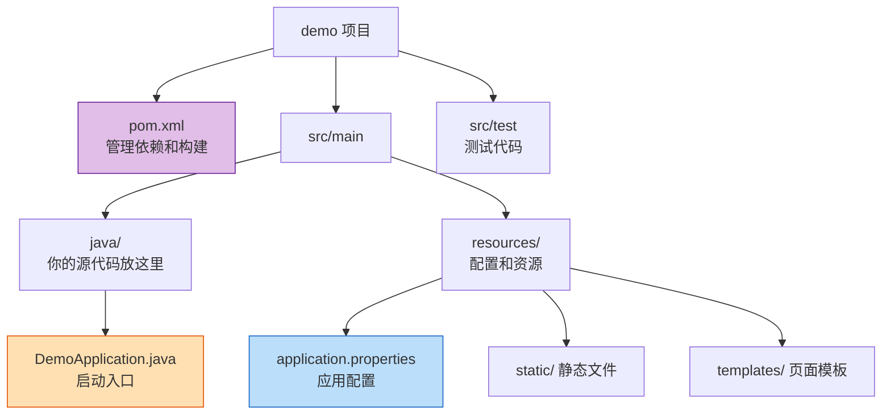

---

## 2.3 解读启动类 DemoApplication

打开 `DemoApplication.java`，内容很简单：

```java
package com.example.demo;

import org.springframework.boot.SpringApplication;
import org.springframework.boot.autoconfigure.SpringBootApplication;

@SpringBootApplication  // ← 核心注解，一个顶三个
public class DemoApplication {

    public static void main(String[] args) {
        // 这一行就启动了整个应用（包括内嵌的 Tomcat）
        SpringApplication.run(DemoApplication.class, args);
    }
}
```

### `@SpringBootApplication` 是什么？

这个注解是 Spring Boot 的"总开关"，它其实是三个注解的组合：

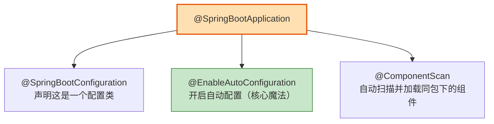

- **@EnableAutoConfiguration**：开启"自动配置"，这是让 Spring Boot 开箱即用的关键（第 04 章细讲）。
- **@ComponentScan**：自动扫描当前包及子包，把你写的 Controller、Service 等自动装进容器（第 03 章细讲）。

> ⚠️ **注意**：因为 `@ComponentScan` 默认只扫描"启动类所在包及其子包"，所以**你写的所有代码都要放在 `com.example.demo` 包或它的子包下**，否则不会被扫描到。

---

## 2.4 编写第一个接口：Hello World

现在我们来写一个能在浏览器访问的接口。在 `com.example.demo` 包下新建一个类 `HelloController`：

```java
package com.example.demo;

import org.springframework.web.bind.annotation.GetMapping;
import org.springframework.web.bind.annotation.RestController;

@RestController  // 表示这是一个处理 Web 请求的控制器，返回的数据直接作为响应内容
public class HelloController {

    @GetMapping("/hello")  // 表示当浏览器访问 /hello 这个地址时，执行下面的方法
    public String hello() {
        return "Hello, Spring Boot 3.5!";
    }
}
```

代码很短，但背后发生了什么？看时序图：

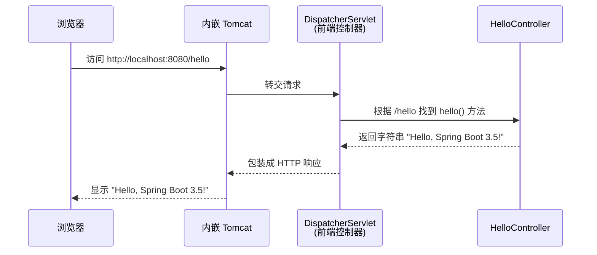

---

## 2.5 运行项目

有两种常见方式运行：

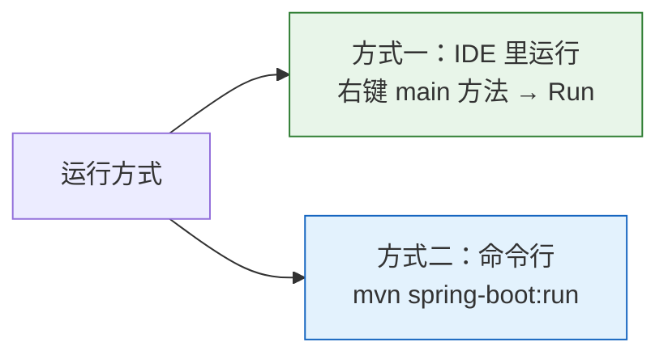

运行成功后，你会在控制台看到经典的 Spring Boot 启动 Banner 和日志：

```text
  .   ____          _            __ _ _
 /\\ / ___'_ __ _ _(_)_ __  __ _ \ \ \ \
( ( )\___ | '_ | '_| | '_ \/ _` | \ \ \ \
 \\/  ___)| |_)| | | | | || (_| |  ) ) ) )
  '  |____| .__|_| |_|_| |_\__, | / / / /
 =========|_|==============|___/=/_/_/_/

 :: Spring Boot ::                (v3.5.0)

... Tomcat started on port 8080 (http)
... Started DemoApplication in 1.234 seconds
```

看到 `Tomcat started on port 8080` 和 `Started DemoApplication`，就说明**启动成功**了！

现在打开浏览器，访问：**http://localhost:8080/hello**

你会看到页面显示：

```text
Hello, Spring Boot 3.5!
```

🎉 恭喜！你的第一个 Spring Boot 应用跑起来了！

---

## 2.6 启动全流程回顾

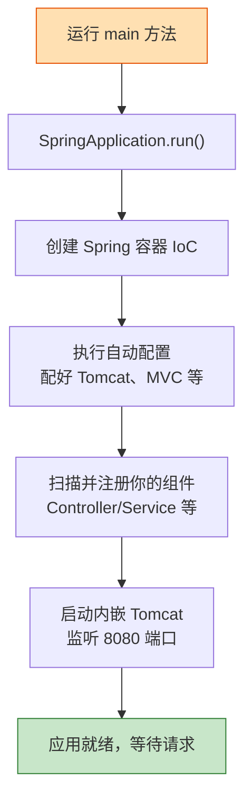

---

## 2.7 本章小结

- 用 **Spring Initializr** 快速创建项目，先加 **Spring Web** 依赖。
- 启动类上的 **`@SpringBootApplication`** 是三合一注解，其中 `@EnableAutoConfiguration` 和 `@ComponentScan` 最关键。
- 你写的代码要放在**启动类所在包或子包**下。
- 用 **`@RestController` + `@GetMapping`** 就能写出一个 Web 接口。
- 默认端口是 **8080**。

---

➡️ 你可能好奇：为什么写个 `@RestController` 就能被识别？容器是怎么"找到"并管理这些类的？下一章我们揭开 Spring 的灵魂——**[IoC 与依赖注入](#ch03)**。

---


<a id="ch03"></a>

# 第 03 章：核心概念 —— IoC 与依赖注入

> 本章目标：理解 Spring 的**灵魂概念**——控制反转（IoC）和依赖注入（DI）。这是整个 Spring 的地基，弄懂它，后面一通百通。

---

## 3.1 一个生活化的比喻

先别看代码，我们讲个故事。假设你要喝咖啡：

```mermaid
flowchart LR
    subgraph 传统方式：自己动手
        A1[自己买豆子] --> A2[自己磨豆] --> A3[自己烧水] --> A4[自己冲泡]
    end

    subgraph IoC 方式：交给咖啡店
        B1[你只说：来杯咖啡] --> B2[咖啡店帮你做好] --> B3[直接端给你]
    end

    style A4 fill:#ffcdd2,stroke:#c62828
    style B3 fill:#c8e6c9,stroke:#2e7d32
```

- **传统方式**：所有东西你自己造（在代码里就是 `new` 对象）。
- **IoC 方式**：你不自己造对象了，而是交给一个"管家"（Spring 容器）来创建和管理，你需要时它直接给你。

**这个"把创建对象的控制权交出去"的思想，就叫控制反转（IoC，Inversion of Control）。**

---

## 3.2 传统写法的问题

看一段传统代码。假设 `OrderService`（订单服务）需要用到 `UserService`（用户服务）：

```java
public class OrderService {
    // 自己 new，把两个类死死绑在一起
    private UserService userService = new UserService();

    public void createOrder() {
        userService.checkUser();
        // ... 下单逻辑
    }
}
```

问题在哪？看依赖关系图：

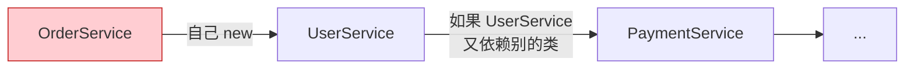

- **耦合太紧**：`OrderService` 和 `UserService` 焊死了，想换一个实现就得改代码。
- **难以测试**：测试 `OrderService` 时没法用"假的" `UserService` 替换。
- **对象管理混乱**：每个类都自己 new，对象满天飞，没人统一管理。

---

## 3.3 IoC 容器：统一的"对象管家"

Spring 提供了一个 **IoC 容器**（也叫 Spring 容器）。它做两件事：

```mermaid
flowchart TD
    subgraph IoC 容器
        direction TB
        B1[UserService 实例]
        B2[OrderService 实例]
        B3[PaymentService 实例]
    end

    A[① 创建对象<br/>把对象都造好放进容器] --> IoC 容器
    IoC 容器 --> C[② 组装对象<br/>谁需要谁，自动注入进去]

    style A fill:#e3f2fd,stroke:#1565c0
    style C fill:#e8f5e9,stroke:#2e7d32
```

- 容器里的这些被管理的对象，有个专门的名字，叫 **Bean**。
- 你把类"注册"给容器（用注解），容器就负责创建它们、并在需要时自动组装。

---

## 3.4 依赖注入（DI）：IoC 的具体实现方式

**控制反转（IoC）是思想，依赖注入（DI，Dependency Injection）是实现这个思想的具体手段。**

意思是：一个对象需要的其它对象（依赖），不用自己造，而是由容器"注入"进来。

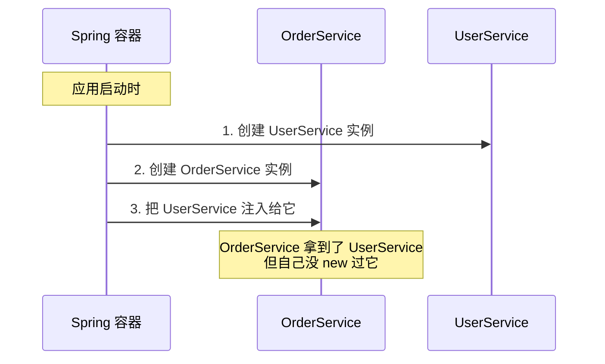

---

## 3.5 三个关键注解：注册 Bean

怎么把类交给容器管理？在类上加注解即可。常见的有：

```mermaid
flowchart TD
    A["@Component<br/>通用组件（最基础）"] --> B["@Service<br/>用于业务逻辑层"]
    A --> C["@Repository<br/>用于数据访问层"]
    A --> D["@Controller / @RestController<br/>用于 Web 控制层"]

    Note[本质上后三个都是<br/>@Component 的特化<br/>语义更清晰]

    style A fill:#ffe0b2,stroke:#e65100
    style B fill:#e8f5e9,stroke:#2e7d32
    style C fill:#e3f2fd,stroke:#1565c0
    style D fill:#f3e5f5,stroke:#6a1b9a
```

它们的功能都是"把这个类注册成一个 Bean"，区别只是**语义**（表明这个类是干嘛的），方便阅读和分层。

```java
@Service   // 声明这是一个业务层的 Bean，容器会自动创建它
public class UserService {
    public void checkUser() {
        System.out.println("检查用户...");
    }
}
```

---

## 3.6 用 @Autowired 完成注入

注册好 Bean 后，用 **`@Autowired`** 告诉容器"请把这个依赖注入给我"。推荐用**构造方法注入**（现代 Spring 的最佳实践）：

```java
@Service
public class OrderService {

    private final UserService userService;

    // 构造方法注入：容器创建 OrderService 时，会自动把 UserService 传进来
    // 注意：只有一个构造方法时，@Autowired 可以省略
    public OrderService(UserService userService) {
        this.userService = userService;
    }

    public void createOrder() {
        userService.checkUser();  // 直接用，不用自己 new
        System.out.println("创建订单成功！");
    }
}
```

### 三种注入方式对比

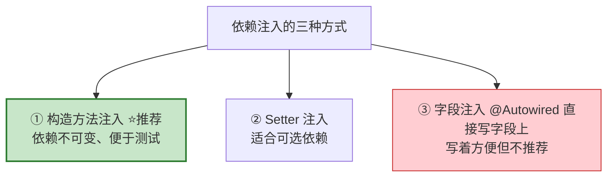

| 方式 | 写法 | 评价 |
| --- | --- | --- |
| 构造方法注入 | 在构造函数参数里 | ⭐ **官方推荐**，依赖明确、可用 `final`、易测试 |
| Setter 注入 | 在 set 方法上加 `@Autowired` | 适合"可有可无"的依赖 |
| 字段注入 | 直接在字段上加 `@Autowired` | 最省事，但难测试、不推荐 |

---

## 3.7 完整流程串起来

我们把整个过程用一张图串起来：

```mermaid
flowchart TD
    A[应用启动] --> B[组件扫描<br/>@ComponentScan 找到所有带注解的类]
    B --> C[创建 Bean<br/>把 UserService、OrderService 都造出来]
    C --> D[依赖注入<br/>把 UserService 注入到 OrderService]
    D --> E[放入容器管理<br/>随用随取]
    E --> F[需要时从容器获取使用]

    style A fill:#ffe0b2,stroke:#e65100
    style F fill:#c8e6c9,stroke:#2e7d32
```

**回到第 02 章的疑问**：为什么写个 `@RestController` 就能被识别？现在你懂了——`@ComponentScan` 扫描到它，把它注册成 Bean，交给容器管理，请求来了容器就用它来处理。

---

## 3.8 常见问题

> **Q：@Component 和 @Service 到底有什么区别？**
> A：功能上几乎没区别，都是注册 Bean。区别是**语义**：`@Service` 一看就知道是业务层，`@Repository` 是数据层。分层清晰，代码好读。此外 `@Repository` 还会把数据库异常转换成 Spring 统一的异常。

> **Q：一个接口有多个实现类，注入哪个？**
> A：会报错（不知道选哪个）。可以用 `@Primary` 指定默认，或用 `@Qualifier("bean名字")` 精确指定。

---

## 3.9 本章小结

```mermaid
mindmap
  root((IoC 与 DI))
    IoC 控制反转
      思想
      对象创建权交给容器
    DI 依赖注入
      IoC 的实现手段
      依赖由容器注入
    Bean
      被容器管理的对象
    注册注解
      @Component
      @Service
      @Repository
      @Controller
    注入注解
      @Autowired
      推荐构造方法注入
```

- **IoC（控制反转）** 是思想：对象的创建和管理交给 Spring 容器。
- **DI（依赖注入）** 是手段：依赖由容器自动注入，而非自己 `new`。
- 被容器管理的对象叫 **Bean**，用 `@Component`/`@Service` 等注解注册。
- 用 `@Autowired` 注入依赖，**推荐构造方法注入**。

---

➡️ 理解了容器和 Bean，下一章我们来揭开 Spring Boot 最神奇的部分——**[自动配置与起步依赖](#ch04)**，看看它是怎么做到"开箱即用"的。

---

<a id="ch04"></a>

# 第 04 章：自动配置与起步依赖

> 本章目标：搞懂 Spring Boot "开箱即用"魔法背后的两大功臣——**起步依赖（Starter）** 和 **自动配置（Auto-Configuration）**。

---

## 4.1 魔法从哪来？

回想第 02 章：我们只加了一个 `spring-boot-starter-web` 依赖、写了几行代码，一个内嵌 Tomcat 的 Web 应用就跑起来了。中间那些 Tomcat 配置、JSON 转换器、MVC 组件……谁配的？

答案是这两位：

```mermaid
flowchart LR
    A[起步依赖 Starter<br/>帮你把 jar 包凑齐] --> C[开箱即用]
    B[自动配置 AutoConfiguration<br/>帮你把配置做好] --> C

    style A fill:#e3f2fd,stroke:#1565c0
    style B fill:#fff3e0,stroke:#e65100
    style C fill:#c8e6c9,stroke:#2e7d32
```

---

## 4.2 起步依赖（Starter）：一站式依赖套餐

以前用 Spring 开发 Web，你得手动引入一堆 jar，还要小心版本兼容：

```mermaid
flowchart TD
    subgraph 传统方式：自己配一桌菜
        A1[spring-web]
        A2[spring-webmvc]
        A3[jackson JSON 库]
        A4[tomcat]
        A5[validation]
        A6[...版本还可能冲突]
    end

    subgraph Starter 方式：点一个套餐
        B[spring-boot-starter-web]
        B --> B1[自动包含上面所有依赖<br/>版本还都搭配好了]
    end

    style A6 fill:#ffcdd2,stroke:#c62828
    style B1 fill:#c8e6c9,stroke:#2e7d32
```

在 `pom.xml` 里，你只需要写一行：

```xml
<dependency>
    <groupId>org.springframework.boot</groupId>
    <artifactId>spring-boot-starter-web</artifactId>
</dependency>
```

它就会自动把 Spring MVC、内嵌 Tomcat、JSON 处理（Jackson）等一整套 Web 开发需要的东西都带进来，**而且版本都是经过官方测试、互相兼容的**。

### 常见 Starter 一览

| Starter | 用途 |
| --- | --- |
| `spring-boot-starter-web` | 开发 Web / REST 接口（含 Tomcat + MVC） |
| `spring-boot-starter-data-jpa` | 用 JPA 访问数据库 |
| `spring-boot-starter-security` | 安全与认证 |
| `spring-boot-starter-test` | 测试（JUnit、Mockito 等，默认自带） |
| `spring-boot-starter-validation` | 参数校验 |
| `spring-boot-starter-actuator` | 应用监控与健康检查 |

> 💡 你注意到了吗？上面的依赖**没写版本号**。因为版本由父项目 `spring-boot-starter-parent` 统一管理，这就是 Spring Boot 的"版本仲裁"机制，帮你避免版本冲突。

---

## 4.3 自动配置（Auto-Configuration）：智能地帮你配好

光有 jar 包还不够，还得配置它们（比如告诉 Spring "用 Tomcat 监听 8080 端口"）。这就是**自动配置**的工作。

它的核心思想是"**约定优于配置**"：

```mermaid
flowchart TD
    A["@EnableAutoConfiguration<br/>（在 @SpringBootApplication 里）"] --> B[扫描所有已引入的 jar]
    B --> C{根据条件判断<br/>该不该配置?}
    C -->|类路径有 Tomcat| D[自动配置内嵌 Tomcat]
    C -->|类路径有 Spring MVC| E[自动配置 MVC 相关组件]
    C -->|配了数据库连接| F[自动配置数据源]
    C -->|条件不满足| G[跳过，不配置]

    style A fill:#ffe0b2,stroke:#e65100
    style D fill:#e8f5e9,stroke:#2e7d32
    style E fill:#e8f5e9,stroke:#2e7d32
    style F fill:#e8f5e9,stroke:#2e7d32
```

**一句话：Spring Boot 会"看菜下饭"——你引入了什么依赖，它就自动配置对应的功能。**

---

## 4.4 自动配置的核心：条件注解

自动配置怎么知道"该不该配"？靠的是一系列 **@Conditional（条件）注解**。它们像一个个"如果……就……"的判断：

```mermaid
flowchart LR
    A[条件注解] --> B["@ConditionalOnClass<br/>类路径中存在某个类时才生效"]
    A --> C["@ConditionalOnMissingBean<br/>容器中没有某个 Bean 时才生效"]
    A --> D["@ConditionalOnProperty<br/>某个配置项满足条件时才生效"]

    style A fill:#ffe0b2,stroke:#e65100
```

举个简化的例子，Spring Boot 内部大概是这么判断的：

```java
@Configuration
@ConditionalOnClass(Tomcat.class)  // 只有类路径里有 Tomcat，这段配置才生效
public class TomcatAutoConfiguration {

    @Bean
    @ConditionalOnMissingBean  // 只有当你自己没定义这个 Bean 时，才用默认的
    public TomcatServletWebServerFactory tomcatFactory() {
        return new TomcatServletWebServerFactory();
    }
}
```

这里的 **`@ConditionalOnMissingBean`** 非常重要，它体现了一个关键原则：

> 🌟 **你自己配置的，优先级永远高于自动配置。**
> 如果你手动定义了某个 Bean，Spring Boot 就不会用它的默认配置，而是"让位"给你。这就是"约定优于配置，但允许你随时覆盖约定"。

---

## 4.5 自动配置的完整工作流程

```mermaid
sequenceDiagram
    participant App as 应用启动
    participant EAC as @EnableAutoConfiguration
    participant Meta as 配置清单文件
    participant Cond as 条件判断
    participant Ctx as Spring 容器

    App->>EAC: 启动，触发自动配置
    EAC->>Meta: 读取所有自动配置类清单<br/>(AutoConfiguration.imports)
    Meta-->>EAC: 返回一大批候选配置类
    loop 每个候选配置类
        EAC->>Cond: 检查 @Conditional 条件
        alt 条件满足
            Cond->>Ctx: 注册对应的 Bean
        else 条件不满足
            Cond-->>EAC: 跳过
        end
    end
    Note over Ctx: 最终容器里只保留<br/>真正需要的配置
```

> 📁 **小知识**：在 Spring Boot 2.7 之前，自动配置清单写在 `spring.factories` 文件里；从 2.7 开始改用了新文件 `META-INF/spring/org.springframework.boot.autoconfigure.AutoConfiguration.imports`。Spring Boot 3.5 沿用后者。你一般不用管这些文件，了解即可。

---

## 4.6 如何查看和调试自动配置？

想知道到底哪些自动配置生效了、哪些没生效？在 `application.properties` 里加一行：

```properties
debug=true
```

重启后，控制台会打印一份 **自动配置报告（CONDITIONS EVALUATION REPORT）**：

```mermaid
flowchart LR
    A[debug=true] --> B[启动时打印报告]
    B --> C["Positive matches<br/>✅ 生效的配置（及原因）"]
    B --> D["Negative matches<br/>❌ 未生效的配置（及原因）"]

    style C fill:#c8e6c9,stroke:#2e7d32
    style D fill:#ffcdd2,stroke:#c62828
```

这在排查"为什么某个功能没生效"时非常有用。

---

## 4.7 本章小结

```mermaid
mindmap
  root((开箱即用的秘密))
    起步依赖 Starter
      一个依赖带一套
      版本自动兼容
      避免依赖冲突
    自动配置
      约定优于配置
      看菜下饭
      引入啥就配啥
    条件注解
      ConditionalOnClass
      ConditionalOnMissingBean
      你的配置优先级更高
    调试
      debug=true 看报告
```

- **起步依赖（Starter）**：一个依赖打包一整套相关 jar，版本自动兼容。
- **自动配置**：根据类路径里有什么依赖，智能地帮你配好，核心是 `@Conditional` 条件注解。
- **你自己的配置永远优先于自动配置**（`@ConditionalOnMissingBean` 机制）。
- 用 `debug=true` 可以查看自动配置报告。

---

➡️ 既然可以覆盖默认配置，那具体怎么改？比如把端口从 8080 改成别的？下一章我们学习 **[配置文件详解](#ch05)**。

---


<a id="ch05"></a>

# 第 05 章：配置文件详解

> 本章目标：学会用配置文件修改应用行为（比如改端口），掌握 **properties / YAML** 两种格式、**多环境配置（Profiles）**，以及如何把配置**读进代码**里。

---

## 5.1 配置文件放在哪？

Spring Boot 项目默认在 `src/main/resources` 目录下有一个配置文件，二选一：

```mermaid
flowchart LR
    A[src/main/resources] --> B[application.properties<br/>键值对格式]
    A --> C[application.yml<br/>YAML 层级格式 ⭐更流行]

    style B fill:#e3f2fd,stroke:#1565c0
    style C fill:#e8f5e9,stroke:#2e7d32
```

两种格式**功能完全一样**，只是写法不同。现在业界更流行 **YAML（.yml）**，因为它层级清晰、不啰嗦。

---

## 5.2 两种格式对比

同样是"把端口改成 9090、设置应用名"，两种写法：

**application.properties（键值对，每行一个）：**

```properties
server.port=9090
spring.application.name=demo
spring.datasource.url=jdbc:mysql://localhost:3306/mydb
spring.datasource.username=root
```

**application.yml（层级缩进，共享前缀）：**

```yaml
server:
  port: 9090

spring:
  application:
    name: demo
  datasource:
    url: jdbc:mysql://localhost:3306/mydb
    username: root
```

对比一下就能感受到区别：

```mermaid
flowchart TB
    subgraph properties
        P["每行完整写出<br/>server.port=9090<br/>前缀重复"]
    end
    subgraph YAML
        Y["用缩进表示层级<br/>相同前缀只写一次<br/>更简洁清晰"]
    end

    style Y fill:#c8e6c9,stroke:#2e7d32
```

> ⚠️ **YAML 的两个坑**：
> 1. **必须用空格缩进，不能用 Tab！**（这是初学者最常见的错误）
> 2. **冒号后面要有一个空格**，写 `port: 9090`，不能写 `port:9090`。

---

## 5.3 常用配置项速查

```mermaid
mindmap
  root((常用配置))
    服务器
      server.port 端口
      server.servlet.context-path 访问前缀
    数据库
      spring.datasource.url
      spring.datasource.username
      spring.datasource.password
    JPA
      spring.jpa.show-sql 打印SQL
      spring.jpa.hibernate.ddl-auto 建表策略
    日志
      logging.level.root 日志级别
      logging.file.name 日志文件
```

| 配置项 | 作用 | 示例 |
| --- | --- | --- |
| `server.port` | 修改端口 | `8081` |
| `server.servlet.context-path` | 访问路径前缀 | `/api` |
| `spring.application.name` | 应用名称 | `demo` |
| `logging.level.root` | 全局日志级别 | `INFO` |
| `spring.datasource.url` | 数据库连接地址 | `jdbc:mysql://...` |

---

## 5.4 多环境配置（Profiles）

真实项目通常有多个环境：**开发（dev）**、**测试（test）**、**生产（prod）**。每个环境配置不同（比如数据库地址不一样）。Profiles 就是用来解决这个问题的。

```mermaid
flowchart TD
    Main[application.yml<br/>公共配置 + 指定用哪个环境]

    Main --> Dev[application-dev.yml<br/>开发环境：本地数据库]
    Main --> Test[application-test.yml<br/>测试环境：测试数据库]
    Main --> Prod[application-prod.yml<br/>生产环境：线上数据库]

    style Main fill:#ffe0b2,stroke:#e65100
    style Dev fill:#e8f5e9,stroke:#2e7d32
    style Prod fill:#ffcdd2,stroke:#c62828
```

### 做法

**① 主配置文件 `application.yml`** 指定激活哪个环境：

```yaml
spring:
  profiles:
    active: dev   # 当前激活开发环境
```

**② 为每个环境建一个文件**，命名规则是 `application-{环境名}.yml`：

`application-dev.yml`（开发环境）：

```yaml
server:
  port: 8080
spring:
  datasource:
    url: jdbc:mysql://localhost:3306/dev_db
```

`application-prod.yml`（生产环境）：

```yaml
server:
  port: 80
spring:
  datasource:
    url: jdbc:mysql://prod-server:3306/prod_db
```

### 加载逻辑

```mermaid
sequenceDiagram
    participant App as 应用启动
    participant Main as application.yml
    participant Env as application-dev.yml

    App->>Main: 1. 先加载主配置
    Main-->>App: 读到 active: dev
    App->>Env: 2. 再加载 application-dev.yml
    Env-->>App: 合并配置（dev 里的会覆盖公共的）
    Note over App: 最终 = 公共配置 + dev 专属配置
```

> 💡 **启动时临时切换环境**：不用改文件，运行时加参数即可：
> `java -jar demo.jar --spring.profiles.active=prod`

---

## 5.5 把配置读进代码里

配置写好了，代码怎么用？有两种主要方式。

### 方式一：@Value（读单个值，简单直接）

```java
@Component
public class MyConfig {

    @Value("${server.port}")     // 读取配置项 server.port
    private int port;

    @Value("${my.custom.name:默认值}")  // 冒号后是默认值（配置不存在时用它）
    private String name;
}
```

### 方式二：@ConfigurationProperties（读一组值，⭐推荐）

当有一组相关配置时，用这种"类型安全"的方式更优雅。假设配置：

```yaml
app:
  name: 我的应用
  version: 1.0.0
  author: 张三
```

定义一个类来接收：

```java
@Component
@ConfigurationProperties(prefix = "app")  // 绑定所有 app.* 开头的配置
public class AppProperties {
    private String name;
    private String version;
    private String author;

    // 必须提供 getter / setter（Spring 靠它们注入值）
    // ... getter/setter 省略
}
```

两种方式对比：

```mermaid
flowchart LR
    A["@Value"] --> A1[读单个值<br/>零散配置方便]
    B["@ConfigurationProperties"] --> B1[批量绑定一组值<br/>类型安全<br/>结构清晰 ⭐推荐]

    style B1 fill:#c8e6c9,stroke:#2e7d32
```

| 特性 | @Value | @ConfigurationProperties |
| --- | --- | --- |
| 适合场景 | 读单个、零散的值 | 读一整组相关配置 |
| 类型安全 | 一般 | ✅ 好 |
| 支持复杂结构（List/Map/嵌套） | ❌ 弱 | ✅ 强 |

---

## 5.6 配置的优先级

同一个配置项可能在多个地方设置。Spring Boot 有一套优先级规则，**优先级高的会覆盖低的**：

```mermaid
flowchart TD
    A[命令行参数<br/>--server.port=9090<br/>优先级最高] --> B[操作系统环境变量]
    B --> C[application-{profile}.yml<br/>环境专属配置]
    C --> D[application.yml<br/>主配置文件]
    D --> E[代码里的默认值<br/>优先级最低]

    style A fill:#c8e6c9,stroke:#2e7d32,stroke-width:2px
    style E fill:#eeeeee,stroke:#9e9e9e
```

**记忆口诀：越靠近运行时、越"外部"的配置，优先级越高。** 这样你就能在不改代码的情况下，通过命令行或环境变量灵活覆盖配置（这对部署非常重要）。

---

## 5.7 本章小结

- 配置文件在 `src/main/resources`，用 **`application.yml`（推荐）** 或 `application.properties`。
- YAML 用**空格缩进**、**冒号后加空格**，注意别用 Tab。
- **多环境**用 `application-{env}.yml` + `spring.profiles.active` 切换。
- 读配置用 **`@Value`（单个）** 或 **`@ConfigurationProperties`（一组，推荐）**。
- 配置有**优先级**：命令行 > 环境变量 > profile 配置 > 主配置。

---

➡️ 基础打得差不多了！接下来进入实战重头戏——**[Web 开发：Controller 与 RESTful API](#ch06)**，学习怎么写出各种接口。

---

<a id="ch06"></a>

# 第 06 章：Web 开发 —— Controller 与 RESTful API

> 本章目标：掌握 Web 开发的核心——**写接口**。你将学会：请求是怎么被处理的、如何用各种方式接收前端传来的参数、如何返回数据和控制状态码、什么是 RESTful 风格、以及真实项目里的统一返回、分层、异常处理等最佳实践。
>
> 本章是全书**最重要、最实用**的一章，内容较多，请务必**边看边敲代码**。

---

## 6.0 本章导览

我们会围绕一个"用户管理"的例子，从原理到实战一步步展开：

```mermaid
flowchart LR
    A[6.1 请求处理原理] --> B[6.2 控制器注解]
    B --> C[6.3 请求映射]
    C --> D[6.4 接收参数 ⭐重点]
    D --> E[6.5 参数校验]
    E --> F[6.6 返回响应]
    F --> G[6.7 RESTful 设计]
    G --> H[6.8 统一返回格式]
    H --> I[6.9 分层与DTO]
    I --> J[6.11 完整实战]

    style D fill:#ffe0b2,stroke:#e65100,stroke-width:2px
    style J fill:#c8e6c9,stroke:#2e7d32
```

准备工作：本章代码只需 `spring-boot-starter-web` 依赖（第 04 章加过）。参数校验部分需要 `spring-boot-starter-validation`，用到时会提醒。

---

## 6.1 一个请求在 Spring Boot 里的完整旅程

在写代码前，先彻底搞懂"一个请求进来后到底经历了什么"。这套机制叫 **Spring MVC**。

### 6.1.1 宏观流程

```mermaid
sequenceDiagram
    participant Client as 客户端<br/>(浏览器/App/Postman)
    participant Tomcat as 内嵌 Tomcat
    participant DS as DispatcherServlet<br/>(前端总控制器)
    participant HM as HandlerMapping<br/>(找处理器)
    participant HA as HandlerAdapter<br/>(调用处理器)
    participant C as 你的 Controller
    participant MC as HttpMessageConverter<br/>(消息转换器)

    Client->>Tomcat: ① 发送 HTTP 请求 GET /users/1
    Tomcat->>DS: ② 交给 DispatcherServlet
    DS->>HM: ③ 这个 URL 该谁处理？
    HM-->>DS: ④ 返回 UserController.getById()
    DS->>HA: ⑤ 请帮我调用这个方法
    HA->>C: ⑥ 解析参数并执行方法
    C-->>HA: ⑦ 返回 User 对象
    HA->>MC: ⑧ 把 User 转成 JSON
    MC-->>DS: ⑨ JSON 字符串
    DS-->>Tomcat: ⑩ 封装成 HTTP 响应
    Tomcat-->>Client: ⑪ 返回给客户端
```

### 6.1.2 几个关键角色

| 角色 | 职责 | 通俗比喻 |
| --- | --- | --- |
| **DispatcherServlet** | 前端控制器，所有请求的总入口和调度中心 | 公司**前台**，所有访客先找它 |
| **HandlerMapping** | 根据 URL 找到对应的处理方法 | 前台的**通讯录**，查"这事找谁" |
| **HandlerAdapter** | 真正调用你的 Controller 方法，并帮你解析参数 | 前台**带路的助理** |
| **HttpMessageConverter** | 在"Java 对象"和"JSON/XML"之间互相转换 | **翻译官** |
| **你的 Controller** | 写业务处理逻辑 | 具体**办事的员工** |

> 💡 **核心记忆点**：`DispatcherServlet` 是整个 Spring MVC 的"大脑"，所有请求都先经过它统一调度。你平时**不用管它**，Spring Boot 已经自动帮你配好了——这正是第 04 章说的"自动配置"的功劳。

### 6.1.3 HttpMessageConverter：JSON 自动转换的幕后功臣

你可能好奇：为什么方法返回一个 `User` 对象，前端却收到 JSON？为什么前端发来 JSON，方法参数却能自动变成 `User` 对象？

这就是 **消息转换器（HttpMessageConverter）** 的作用。Spring Boot 默认集成了 **Jackson** 这个 JSON 库来完成转换：

```mermaid
flowchart LR
    subgraph 请求进来
        A["前端 JSON<br/>{name:'张三'}"] -->|Jackson 反序列化| B["Java User 对象"]
    end
    subgraph 响应出去
        C["Java User 对象"] -->|Jackson 序列化| D["前端 JSON<br/>{name:'张三'}"]
    end

    style B fill:#c8e6c9,stroke:#2e7d32
    style D fill:#c8e6c9,stroke:#2e7d32
```

- **序列化**：Java 对象 → JSON（返回给前端时）
- **反序列化**：JSON → Java 对象（接收前端数据时）

这一切都是自动的，你只需专注写业务。

---

## 6.2 @Controller vs @RestController

写接口的类叫**控制器（Controller）**。有两个核心注解，初学者一定要分清：

```mermaid
flowchart TD
    A["@Controller<br/>方法返回值当作【页面名/视图名】<br/>用于返回 HTML 页面"]
    B["@RestController<br/>方法返回值直接当作【数据】写回响应体<br/>= @Controller + @ResponseBody<br/>用于返回 JSON（写接口）"]

    style A fill:#f3e5f5,stroke:#6a1b9a
    style B fill:#c8e6c9,stroke:#2e7d32,stroke-width:2px
```

### 6.2.1 对比示例

**用 `@Controller`（返回页面，传统 Web）：**

```java
@Controller
public class PageController {

    @GetMapping("/home")
    public String home() {
        return "home";   // 返回的是【视图名】，会去找 home.html 页面渲染
    }
}
```

**用 `@RestController`（返回数据，前后端分离）：**

```java
@RestController
public class ApiController {

    @GetMapping("/api/hello")
    public String hello() {
        return "hello";   // 返回的是【数据本身】，前端直接收到字符串 "hello"
    }
}
```

### 6.2.2 @ResponseBody 的作用

`@RestController` = `@Controller` + `@ResponseBody`。这里的 **`@ResponseBody`** 就是那个"开关"，它告诉 Spring：**"方法返回值不是视图名，而是直接写进响应体（body）的数据。"**

```mermaid
flowchart LR
    A["方法返回一个对象"] --> B{有 @ResponseBody 吗?}
    B -->|有| C["当作数据<br/>转成 JSON 返回"]
    B -->|没有| D["当作视图名<br/>去找对应页面"]

    style C fill:#c8e6c9,stroke:#2e7d32
    style D fill:#f3e5f5,stroke:#6a1b9a
```

> ✅ **结论**：现在绝大多数项目是前后端分离，后端只提供 JSON 接口，所以**我们统一用 `@RestController`**。本章后面所有例子都用它。

---

## 6.3 请求映射：@RequestMapping 家族

用注解把"URL 地址 + HTTP 方法"和"处理方法"绑定起来。

### 6.3.1 按 HTTP 方法分类的快捷注解

```mermaid
flowchart LR
    A["@RequestMapping<br/>通用，可指定任意方法"]
    A --> B["@GetMapping 查询"]
    A --> C["@PostMapping 新增"]
    A --> D["@PutMapping 全量更新"]
    A --> E["@PatchMapping 部分更新"]
    A --> F["@DeleteMapping 删除"]

    style B fill:#e3f2fd,stroke:#1565c0
    style C fill:#c8e6c9,stroke:#2e7d32
    style D fill:#fff3e0,stroke:#e65100
    style E fill:#fff8e1,stroke:#f9a825
    style F fill:#ffcdd2,stroke:#c62828
```

`@GetMapping("/xxx")` 其实就是 `@RequestMapping(value="/xxx", method=RequestMethod.GET)` 的简写，更直观，推荐用简写。

### 6.3.2 类级别 + 方法级别的路径组合

```java
@RestController
@RequestMapping("/users")   // 类级别：所有方法都以 /users 开头
public class UserController {

    @GetMapping             // 最终路径：GET /users
    public List<User> list() { ... }

    @GetMapping("/{id}")    // 最终路径：GET /users/{id}
    public User getById(@PathVariable Long id) { ... }

    @PostMapping            // 最终路径：POST /users
    public User create(@RequestBody User user) { ... }

    @PutMapping("/{id}")    // 最终路径：PUT /users/{id}
    public User update(@PathVariable Long id, @RequestBody User user) { ... }

    @DeleteMapping("/{id}") // 最终路径：DELETE /users/{id}
    public void delete(@PathVariable Long id) { ... }
}
```

> 💡 类上写公共前缀 `/users`，方法上只写差异部分，避免每个方法都重复写 `/users`。

### 6.3.3 @RequestMapping 的高级属性

`@RequestMapping` 不只能指定路径和方法，还有一些进阶属性：

| 属性 | 作用 | 示例 |
| --- | --- | --- |
| `value` / `path` | 请求路径 | `"/users"` |
| `method` | 限定 HTTP 方法 | `RequestMethod.GET` |
| `params` | 限定必须带某个参数 | `"type=vip"` |
| `headers` | 限定必须带某个请求头 | `"X-Version=1"` |
| `consumes` | 限定请求的 Content-Type | `"application/json"` |
| `produces` | 限定响应的 Content-Type | `"application/json"` |

```java
// 只处理 Content-Type 是 application/json、且带有 type=vip 参数的请求
@PostMapping(value = "/orders",
             consumes = "application/json",
             params = "type=vip")
public Order createVipOrder(@RequestBody Order order) { ... }
```

### 6.3.4 一个路径映射多个 URL

```java
// 访问 /users 或 /members 都能进入这个方法
@GetMapping({"/users", "/members"})
public List<User> list() { ... }
```

---

## 6.4 接收请求参数（本章重点）⭐

前端传参有很多种形式，Spring 提供了对应的注解来接收。这是日常开发用得最多的部分，请重点掌握。

```mermaid
flowchart TD
    A[接收参数的方式] --> B["① @PathVariable<br/>路径变量 /users/1"]
    A --> C["② @RequestParam<br/>查询参数 ?name=张三"]
    A --> D["③ POJO 对象<br/>自动绑定查询参数"]
    A --> E["④ @RequestBody<br/>请求体 JSON"]
    A --> F["⑤ @RequestHeader<br/>请求头"]
    A --> G["⑥ @CookieValue<br/>Cookie"]
    A --> H["⑦ MultipartFile<br/>文件上传"]

    style B fill:#e3f2fd,stroke:#1565c0
    style C fill:#fff3e0,stroke:#e65100
    style E fill:#c8e6c9,stroke:#2e7d32
```

### 6.4.1 @PathVariable：取路径变量

用于取 URL 路径中的一部分，常用于 RESTful 风格取 id。

```java
// 访问 /users/100  →  id = 100
@GetMapping("/users/{id}")
public String getUser(@PathVariable Long id) {
    return "查询用户 " + id;
}
```

**取多个路径变量：**

```java
// 访问 /users/1/orders/99  →  userId=1, orderId=99
@GetMapping("/users/{userId}/orders/{orderId}")
public String getOrder(@PathVariable Long userId,
                       @PathVariable Long orderId) {
    return "用户" + userId + "的订单" + orderId;
}
```

**变量名和参数名不一致时，用 `value` 指定：**

```java
// 路径里叫 {id}，但方法参数想叫 userId
@GetMapping("/users/{id}")
public String getUser(@PathVariable("id") Long userId) {
    return "用户 " + userId;
}
```

### 6.4.2 @RequestParam：取查询参数

用于取 URL 中 `?` 后面的参数（查询字符串），常用于搜索、分页、筛选。

```java
// 访问 /search?keyword=手机&page=2
@GetMapping("/search")
public String search(@RequestParam String keyword,
                     @RequestParam int page) {
    return "搜索：" + keyword + "，第 " + page + " 页";
}
```

**常用属性：**

| 属性 | 作用 |
| --- | --- |
| `required` | 是否必传（默认 `true`，不传会报错） |
| `defaultValue` | 默认值（设了默认值就相当于非必传） |
| `value` | 指定参数名（参数名和变量名不同时用） |

```java
@GetMapping("/search")
public String search(
        @RequestParam(required = false) String keyword,       // 可不传
        @RequestParam(defaultValue = "1") int page,           // 不传默认第1页
        @RequestParam(defaultValue = "10") int size) {        // 不传默认每页10条
    return String.format("关键词=%s，第%d页，每页%d条", keyword, page, size);
}
```

**接收多个同名参数（数组/集合）：**

```java
// 访问 /users?ids=1&ids=2&ids=3  →  ids = [1, 2, 3]
@GetMapping("/users")
public String batchGet(@RequestParam List<Long> ids) {
    return "批量查询：" + ids;
}
```

> ⚠️ **`@PathVariable` 和 `@RequestParam` 的区别**：
> - `@PathVariable` 取的是**路径本身的一部分**：`/users/1`
> - `@RequestParam` 取的是 **? 后面的键值对**：`/users?id=1`

### 6.4.3 用 POJO 对象自动绑定查询参数

当查询参数很多时（比如复杂的搜索条件），一个个写 `@RequestParam` 太啰嗦。可以定义一个类，Spring 会**自动把同名参数塞进对象的字段**（无需任何注解）。

```java
// 定义一个查询条件类
public class UserQuery {
    private String keyword;
    private Integer minAge;
    private Integer maxAge;
    private int page = 1;
    private int size = 10;
    // 必须有 getter / setter，Spring 靠它们赋值
    // ... getter/setter 省略
}

// 访问 /users?keyword=张&minAge=18&maxAge=30&page=2
@GetMapping("/users")
public String search(UserQuery query) {   // 不用加注解，自动绑定
    return "查询条件：" + query.getKeyword() + "，年龄 "
            + query.getMinAge() + "~" + query.getMaxAge();
}
```

> 💡 这也是接收**表单提交（`application/x-www-form-urlencoded`）**数据的方式。前端 form 表单提交时，字段会自动绑定到这个对象。

### 6.4.4 @RequestBody：接收 JSON 请求体（最常用于新增/修改）

前后端分离项目里，前端提交数据通常是一段 JSON，放在**请求体（body）**里。用 `@RequestBody` 把它自动转成 Java 对象。

前端 POST 提交这样的 JSON：

```json
{
  "name": "张三",
  "age": 25,
  "email": "zhangsan@example.com"
}
```

后端定义对应的类来接收：

```java
public class User {
    private String name;
    private Integer age;
    private String email;
    // getter / setter 省略
}

@PostMapping("/users")
public User create(@RequestBody User user) {
    // Spring（Jackson）自动把 JSON 转成 User 对象
    System.out.println("收到用户：" + user.getName());
    return user;   // 返回时又自动转回 JSON
}
```

**接收 JSON 数组：**

```java
// 前端提交 [{...}, {...}]
@PostMapping("/users/batch")
public String batchCreate(@RequestBody List<User> users) {
    return "批量新增 " + users.size() + " 个用户";
}
```

> ⚠️ **一个方法里最多只能有一个 `@RequestBody`**，因为请求体只有一个，不能读两次。

### 6.4.5 @RequestHeader：取请求头

常用于获取 Token、User-Agent、语言等信息。

```java
@GetMapping("/info")
public String info(
        @RequestHeader("User-Agent") String userAgent,
        @RequestHeader(value = "token", required = false) String token) {
    return "浏览器：" + userAgent + "，令牌：" + token;
}
```

### 6.4.6 @CookieValue：取 Cookie

```java
@GetMapping("/cookie")
public String readCookie(@CookieValue(value = "sessionId", required = false) String sessionId) {
    return "会话ID：" + sessionId;
}
```

### 6.4.7 文件上传：MultipartFile

前端用 `multipart/form-data` 上传文件，后端用 `MultipartFile` 接收。

```java
@PostMapping("/upload")
public String upload(@RequestParam("file") MultipartFile file) throws IOException {
    if (file.isEmpty()) {
        return "文件为空";
    }
    // 获取文件信息
    String filename = file.getOriginalFilename();   // 原始文件名
    long size = file.getSize();                      // 文件大小（字节）

    // 保存到服务器（示例路径，实际要做安全处理）
    file.transferTo(new File("/data/upload/" + filename));

    return "上传成功：" + filename + "，大小 " + size + " 字节";
}
```

**同时上传多个文件 + 普通字段：**

```java
@PostMapping("/upload-multi")
public String uploadMulti(
        @RequestParam("files") MultipartFile[] files,   // 多个文件
        @RequestParam("desc") String desc) {             // 普通文本字段
    return "上传了 " + files.length + " 个文件，描述：" + desc;
}
```

### 6.4.8 日期时间参数的处理

日期参数容易踩坑，需要告诉 Spring 前端传的日期是什么格式。

```java
// 查询参数里的日期，如 /stats?date=2026-07-06
@GetMapping("/stats")
public String stats(
        @RequestParam
        @DateTimeFormat(pattern = "yyyy-MM-dd") LocalDate date) {
    return "统计日期：" + date;
}
```

对于 `@RequestBody` JSON 里的日期字段，则在字段上用 Jackson 的注解：

```java
public class Event {
    private String title;

    @JsonFormat(pattern = "yyyy-MM-dd HH:mm:ss", timezone = "GMT+8")
    private LocalDateTime startTime;
    // getter / setter
}
```

### 6.4.9 参数接收方式总结表

| 注解/方式 | 参数来源 | Content-Type | 典型场景 |
| --- | --- | --- | --- |
| `@PathVariable` | URL 路径 `/users/{id}` | 任意 | RESTful 取 id |
| `@RequestParam` | URL 查询串 `?key=value` | 任意 | 搜索、分页、筛选 |
| POJO 对象（无注解） | 查询串 / 表单 | `x-www-form-urlencoded` | 多条件查询、表单 |
| `@RequestBody` | 请求体 | `application/json` | 新增、修改（提交对象） |
| `@RequestHeader` | 请求头 | 任意 | Token、语言等 |
| `@CookieValue` | Cookie | 任意 | 会话标识 |
| `MultipartFile` | 请求体 | `multipart/form-data` | 文件上传 |

```mermaid
flowchart TD
    Q{参数在哪里?} -->|在URL路径里| A[@PathVariable]
    Q -->|在?后面| B[@RequestParam 或 POJO]
    Q -->|在请求体 JSON里| C[@RequestBody]
    Q -->|在请求头里| D[@RequestHeader]
    Q -->|是上传的文件| E[MultipartFile]

    style C fill:#c8e6c9,stroke:#2e7d32
```

---

## 6.5 参数校验入门（@Valid）

前端传来的数据**不可信**，必须校验。手写一堆 `if` 很啰嗦，用 **Bean Validation** 注解优雅得多。

**第一步**：加依赖 `spring-boot-starter-validation`。

**第二步**：在接收对象的字段上加校验注解。

```java
public class UserDTO {

    @NotBlank(message = "用户名不能为空")
    private String name;

    @NotNull(message = "年龄不能为空")
    @Min(value = 0, message = "年龄不能小于0")
    @Max(value = 150, message = "年龄不能大于150")
    private Integer age;

    @Email(message = "邮箱格式不正确")
    private String email;
    // getter / setter
}
```

**第三步**：在 Controller 参数前加 `@Valid` 触发校验。

```java
@PostMapping("/users")
public User create(@Valid @RequestBody UserDTO dto) {
    // 校验不通过时，根本不会进入这里，会直接抛出异常
    return userService.create(dto);
}
```

```mermaid
flowchart LR
    A[请求进来] --> B{@Valid 校验字段}
    B -->|全部通过| C[执行方法体]
    B -->|有不通过| D[抛出 MethodArgumentNotValidException]
    D --> E[由全局异常处理返回友好提示]

    style C fill:#c8e6c9,stroke:#2e7d32
    style D fill:#ffcdd2,stroke:#c62828
```

常用校验注解：`@NotNull`、`@NotBlank`、`@NotEmpty`、`@Size`、`@Min`、`@Max`、`@Email`、`@Pattern` 等（完整列表见第 12 章）。

> 💡 校验失败会抛出异常，具体如何统一捕获并返回友好提示，见 **第 08 章：全局异常处理**。

---

## 6.6 返回响应

### 6.6.1 直接返回对象（最常用）

用 `@RestController` 时，方法直接返回对象/集合，Spring 自动转 JSON，状态码默认 200。

```java
@GetMapping("/users/{id}")
public User getById(@PathVariable Long id) {
    return userService.findById(id);   // 自动转 JSON，状态码 200
}
```

### 6.6.2 ResponseEntity：精确控制状态码和响应头

有时需要自己控制 HTTP 状态码、响应头，这时用 `ResponseEntity<T>`。

```java
@GetMapping("/users/{id}")
public ResponseEntity<User> getById(@PathVariable Long id) {
    User user = userService.findById(id);
    if (user == null) {
        // 返回 404 状态码，无响应体
        return ResponseEntity.notFound().build();
    }
    // 返回 200 状态码 + user 数据 + 自定义响应头
    return ResponseEntity.ok()
            .header("X-Custom-Header", "value")
            .body(user);
}

@PostMapping("/users")
public ResponseEntity<User> create(@RequestBody User user) {
    User saved = userService.create(user);
    // 新增成功，返回 201 Created
    return ResponseEntity.status(HttpStatus.CREATED).body(saved);
}
```

```mermaid
flowchart LR
    A[ResponseEntity] --> B[状态码 status]
    A --> C[响应头 headers]
    A --> D[响应体 body]

    style A fill:#e3f2fd,stroke:#1565c0
```

### 6.6.3 @ResponseStatus：声明式指定状态码

如果只是想改状态码，也可以用注解，更简洁：

```java
@PostMapping("/users")
@ResponseStatus(HttpStatus.CREATED)   // 成功时返回 201
public User create(@RequestBody User user) {
    return userService.create(user);
}
```

---

## 6.7 RESTful 设计详解

REST 是一种**设计接口的风格约定**。它不是强制标准，但遵循它能让 API 清晰、规范、易理解。

### 6.7.1 核心思想：URL 表示资源，HTTP 方法表示操作

```mermaid
flowchart LR
    subgraph 不推荐 ❌ 传统风格
        A1["GET /getUserById?id=1"]
        A2["GET /deleteUser?id=1"]
        A3["POST /addUser"]
        A4["POST /updateUser"]
    end

    subgraph 推荐 ✅ RESTful 风格
        B1["GET /users/1"]
        B2["DELETE /users/1"]
        B3["POST /users"]
        B4["PUT /users/1"]
    end

    style A2 fill:#ffcdd2,stroke:#c62828
    style B2 fill:#c8e6c9,stroke:#2e7d32
```

**关键原则**：URL 里用**名词（资源）**，不要用动词。"做什么操作"交给 HTTP 方法表达。

### 6.7.2 HTTP 方法的语义

| HTTP 方法 | 语义 | 幂等性 | 示例 |
| --- | --- | --- | --- |
| `GET` | 查询资源 | 幂等 | `GET /users/1` |
| `POST` | 新增资源 | 不幂等 | `POST /users` |
| `PUT` | 全量更新资源 | 幂等 | `PUT /users/1` |
| `PATCH` | 部分更新资源 | 不幂等 | `PATCH /users/1` |
| `DELETE` | 删除资源 | 幂等 | `DELETE /users/1` |

> 📖 **幂等**：同一个请求执行一次和执行多次，效果相同。比如 `DELETE /users/1` 删一次和删多次，最终结果都是"用户1不存在"，所以幂等；而 `POST /users` 每调一次就多创建一个用户，所以不幂等。

### 6.7.3 常见 HTTP 状态码

返回合适的状态码是 RESTful 的重要部分：

```mermaid
flowchart TD
    A[HTTP 状态码] --> B["2xx 成功"]
    A --> C["4xx 客户端错误"]
    A --> D["5xx 服务器错误"]

    B --> B1["200 OK 请求成功"]
    B --> B2["201 Created 新增成功"]
    B --> B3["204 No Content 成功但无返回"]

    C --> C1["400 参数错误"]
    C --> C2["401 未认证/未登录"]
    C --> C3["403 无权限"]
    C --> C4["404 资源不存在"]

    D --> D1["500 服务器内部错误"]

    style B1 fill:#c8e6c9,stroke:#2e7d32
    style C4 fill:#fff3e0,stroke:#e65100
    style D1 fill:#ffcdd2,stroke:#c62828
```

| 状态码 | 含义 | 什么时候用 |
| --- | --- | --- |
| 200 OK | 成功 | 查询、更新成功 |
| 201 Created | 已创建 | 新增成功 |
| 204 No Content | 成功无内容 | 删除成功 |
| 400 Bad Request | 请求参数有误 | 参数校验失败 |
| 401 Unauthorized | 未认证 | 未登录 |
| 403 Forbidden | 禁止访问 | 已登录但没权限 |
| 404 Not Found | 资源不存在 | 查询的数据不存在 |
| 500 Internal Server Error | 服务器错误 | 代码抛异常 |

### 6.7.4 URL 命名规范

| 规范 | 推荐 ✅ | 不推荐 ❌ |
| --- | --- | --- |
| 用名词复数表示资源集合 | `/users` | `/user`、`/getUsers` |
| 用小写字母，多单词用连字符 | `/user-profiles` | `/userProfiles`、`/user_profiles` |
| 不在 URL 里放动词 | `POST /users` | `/createUser` |
| 层级表示从属关系 | `/users/1/orders` | `/getOrdersByUserId?id=1` |

### 6.7.5 嵌套资源（表达从属关系）

```java
@RestController
@RequestMapping("/users/{userId}/orders")   // 订单从属于用户
public class UserOrderController {

    // GET /users/1/orders      查询用户1的所有订单
    @GetMapping
    public List<Order> listOrders(@PathVariable Long userId) { ... }

    // GET /users/1/orders/99   查询用户1的订单99
    @GetMapping("/{orderId}")
    public Order getOrder(@PathVariable Long userId,
                          @PathVariable Long orderId) { ... }
}
```

### 6.7.6 API 版本管理

接口升级时为了不影响老客户端，常做版本区分：

```java
// 方式一：路径版本（最常见、最直观）
@RequestMapping("/api/v1/users")   // v1 版本
@RequestMapping("/api/v2/users")   // v2 版本

// 方式二：请求头版本
@GetMapping(value = "/users", headers = "X-API-Version=1")
```

---

## 6.8 统一返回格式（实战必备）

真实项目中，接口通常返回**统一的结构**，方便前端统一处理（判断成功、取数据、显示错误提示）。

### 6.8.1 定义统一返回类

```java
public class Result<T> {
    private int code;        // 业务状态码，如 200 成功、500 失败
    private String message;  // 提示信息
    private T data;          // 真正的数据（泛型，可以是任意类型）

    // 私有构造，强制走静态工厂方法
    private Result(int code, String message, T data) {
        this.code = code;
        this.message = message;
        this.data = data;
    }

    // 成功（带数据）
    public static <T> Result<T> success(T data) {
        return new Result<>(200, "成功", data);
    }

    // 成功（无数据，如删除操作）
    public static <T> Result<T> success() {
        return new Result<>(200, "成功", null);
    }

    // 失败
    public static <T> Result<T> fail(int code, String message) {
        return new Result<>(code, message, null);
    }

    // getter / setter 省略
}
```

### 6.8.2 在接口中使用

```java
@RestController
@RequestMapping("/users")
public class UserController {

    @GetMapping("/{id}")
    public Result<User> getById(@PathVariable Long id) {
        User user = userService.findById(id);
        return Result.success(user);
    }

    @DeleteMapping("/{id}")
    public Result<Void> delete(@PathVariable Long id) {
        userService.delete(id);
        return Result.success();   // 无数据
    }
}
```

### 6.8.3 前端收到的统一结构

```json
{
  "code": 200,
  "message": "成功",
  "data": { "id": 1, "name": "张三" }
}
```

```mermaid
flowchart LR
    A[所有接口] --> B[统一包一层 Result]
    B --> C["前端只需:<br/>1. 判断 code<br/>2. 取 data 使用<br/>3. 失败时显示 message"]

    style B fill:#c8e6c9,stroke:#2e7d32
```

> 💡 实际项目中，`code`、`message` 常用一个**枚举类**统一管理（如 `ResultCode.SUCCESS`），避免到处写魔法数字。

---

## 6.9 三种对象：Entity / DTO / VO

初学者常把所有数据都塞进一个类，实际项目会区分不同用途的对象：

```mermaid
flowchart LR
    A["DTO<br/>接收前端请求的数据<br/>(Data Transfer Object)"] --> B[Controller]
    B --> C[Service]
    C --> D["Entity<br/>对应数据库表<br/>(实体)"]
    D --> E[(数据库)]
    C --> F["VO<br/>返回给前端的数据<br/>(View Object)"]
    F --> B

    style A fill:#e3f2fd,stroke:#1565c0
    style D fill:#e8f5e9,stroke:#2e7d32
    style F fill:#fff3e0,stroke:#e65100
```

| 对象 | 全称 | 用途 | 例子 |
| --- | --- | --- | --- |
| **Entity** | 实体 | 对应数据库表，用于持久化 | `User`（含所有字段，包括密码） |
| **DTO** | 数据传输对象 | 接收前端请求参数 | `UserCreateDTO`（只含新增需要的字段） |
| **VO** | 视图对象 | 返回给前端展示 | `UserVO`（隐藏密码等敏感字段） |

**为什么要分开？** 举个例子：

```java
// Entity：数据库里有密码字段
public class User {
    private Long id;
    private String name;
    private String password;   // 敏感！不能返回给前端
}

// VO：返回给前端时，不包含 password
public class UserVO {
    private Long id;
    private String name;
    // 没有 password 字段，保护隐私
}
```

> 💡 初学练习时可以先用一个类简化；但正式项目**强烈建议区分**，尤其能避免把密码等敏感字段泄露给前端。

---

## 6.10 全局异常处理（简介）

Controller 里不要写一堆 `try-catch`。用 `@RestControllerAdvice` 集中处理所有异常，返回统一格式：

```java
@RestControllerAdvice
public class GlobalExceptionHandler {

    // 处理参数校验失败
    @ExceptionHandler(MethodArgumentNotValidException.class)
    public Result<Void> handleValidation(MethodArgumentNotValidException e) {
        String msg = e.getBindingResult().getFieldError().getDefaultMessage();
        return Result.fail(400, msg);
    }

    // 兜底处理所有异常
    @ExceptionHandler(Exception.class)
    public Result<Void> handleException(Exception e) {
        return Result.fail(500, "系统繁忙，请稍后再试");
    }
}
```

> 📖 全局异常处理的完整讲解见 **第 08 章**。

---

## 6.11 完整实战：图书管理 API

把本章知识串起来，做一个完整的"图书管理"RESTful 接口。

### 6.11.1 分层结构

```mermaid
flowchart TD
    A[BookController 控制层<br/>接收请求、参数校验、返回结果] --> B[BookService 业务层<br/>核心业务逻辑]
    B --> C[(数据存储)]

    style A fill:#f3e5f5,stroke:#6a1b9a
    style B fill:#e8f5e9,stroke:#2e7d32
```

### 6.11.2 DTO 与 VO

```java
// 接收新增/修改请求的 DTO（带校验）
public class BookDTO {
    @NotBlank(message = "书名不能为空")
    private String title;

    @NotBlank(message = "作者不能为空")
    private String author;

    @Min(value = 0, message = "价格不能为负")
    private Double price;
    // getter / setter
}

// 返回给前端的 VO
public class BookVO {
    private Long id;
    private String title;
    private String author;
    private Double price;
    // getter / setter
}
```

### 6.11.3 Service 层（业务逻辑）

```java
@Service
public class BookService {

    // 用 Map 模拟数据库存储（实际用第07章的数据库）
    private final Map<Long, BookVO> store = new ConcurrentHashMap<>();
    private final AtomicLong idGenerator = new AtomicLong(1);

    public BookVO create(BookDTO dto) {
        BookVO vo = new BookVO();
        vo.setId(idGenerator.getAndIncrement());
        vo.setTitle(dto.getTitle());
        vo.setAuthor(dto.getAuthor());
        vo.setPrice(dto.getPrice());
        store.put(vo.getId(), vo);
        return vo;
    }

    public BookVO getById(Long id) {
        BookVO vo = store.get(id);
        if (vo == null) {
            throw new RuntimeException("图书不存在，id=" + id);
        }
        return vo;
    }

    public List<BookVO> list() {
        return new ArrayList<>(store.values());
    }

    public BookVO update(Long id, BookDTO dto) {
        BookVO vo = getById(id);   // 不存在会抛异常
        vo.setTitle(dto.getTitle());
        vo.setAuthor(dto.getAuthor());
        vo.setPrice(dto.getPrice());
        return vo;
    }

    public void delete(Long id) {
        store.remove(id);
    }
}
```

### 6.11.4 Controller 层（完整 CRUD）

```java
@RestController
@RequestMapping("/api/v1/books")
public class BookController {

    private final BookService bookService;

    // 构造方法注入（第03章）
    public BookController(BookService bookService) {
        this.bookService = bookService;
    }

    // 查询列表：GET /api/v1/books
    @GetMapping
    public Result<List<BookVO>> list() {
        return Result.success(bookService.list());
    }

    // 查询单个：GET /api/v1/books/1
    @GetMapping("/{id}")
    public Result<BookVO> getById(@PathVariable Long id) {
        return Result.success(bookService.getById(id));
    }

    // 新增：POST /api/v1/books
    @PostMapping
    @ResponseStatus(HttpStatus.CREATED)
    public Result<BookVO> create(@Valid @RequestBody BookDTO dto) {
        return Result.success(bookService.create(dto));
    }

    // 更新：PUT /api/v1/books/1
    @PutMapping("/{id}")
    public Result<BookVO> update(@PathVariable Long id,
                                 @Valid @RequestBody BookDTO dto) {
        return Result.success(bookService.update(id, dto));
    }

    // 删除：DELETE /api/v1/books/1
    @DeleteMapping("/{id}")
    public Result<Void> delete(@PathVariable Long id) {
        bookService.delete(id);
        return Result.success();
    }
}
```

### 6.11.5 用 curl / Postman 测试

```bash
# 新增一本书
curl -X POST http://localhost:8080/api/v1/books \
  -H "Content-Type: application/json" \
  -d '{"title":"Spring实战","author":"张三","price":89.0}'

# 查询列表
curl http://localhost:8080/api/v1/books

# 查询单本
curl http://localhost:8080/api/v1/books/1

# 更新
curl -X PUT http://localhost:8080/api/v1/books/1 \
  -H "Content-Type: application/json" \
  -d '{"title":"Spring实战(第2版)","author":"张三","price":99.0}'

# 删除
curl -X DELETE http://localhost:8080/api/v1/books/1
```

至此，一个规范的 RESTful CRUD 接口就完成了！它用到了本章几乎所有知识点：请求映射、路径/请求体参数、校验、统一返回、分层、DTO/VO、状态码。

---

## 6.12 跨域 CORS（简介）

前后端分离时，前端（如 `localhost:5173`）和后端（`localhost:8080`）端口不同，浏览器会因**同源策略**拦截请求。可以用 `@CrossOrigin` 注解快速解决：

```java
@CrossOrigin(origins = "http://localhost:5173")   // 允许该来源跨域
@RestController
@RequestMapping("/api/books")
public class BookController { ... }
```

> 📖 全局统一的跨域配置见 **第 08 章**。

---

## 6.13 常见坑与最佳实践

```mermaid
mindmap
  root((避坑指南))
    参数
      一个方法只能有一个 @RequestBody
      @RequestParam 默认必传
      日期要指定格式
    返回
      统一用 Result 包装
      新增用 201, 删除用 204
    设计
      URL 用名词不用动词
      资源名用复数
    分层
      Controller 不写业务逻辑
      区分 DTO/Entity/VO
      敏感字段别返回给前端
```

**要点回顾：**

1. ❌ 一个方法写两个 `@RequestBody` → 报错。请求体只能读一次。
2. ❌ `@RequestParam` 忘了 `required=false` 又没传 → 400 错误。
3. ❌ URL 用动词（`/getUser`）→ 不符合 RESTful，改用 `GET /users/1`。
4. ❌ Controller 里写大量业务逻辑和 `try-catch` → 应交给 Service 和全局异常处理。
5. ❌ 直接把 Entity（含密码）返回前端 → 用 VO 隔离敏感字段。
6. ✅ 所有接口统一返回 `Result` 结构，前端处理更省心。

---

## 6.14 本章小结

```mermaid
mindmap
  root((Web 开发))
    请求原理
      DispatcherServlet 调度
      HttpMessageConverter 转JSON
    控制器
      @RestController 返回JSON
      @RequestMapping 家族映射URL
    接收参数 ⭐
      @PathVariable 路径
      @RequestParam 查询串
      POJO 对象绑定
      @RequestBody JSON体
      @RequestHeader / MultipartFile
    校验
      @Valid + 约束注解
    返回
      直接返回对象
      ResponseEntity 控状态码
    RESTful
      URL名词 + HTTP方法
      合理用状态码
    最佳实践
      统一返回 Result
      分层 + DTO/Entity/VO
      全局异常处理
```

- **请求处理**：核心是 `DispatcherServlet` 调度 + `HttpMessageConverter` 自动转 JSON。
- **控制器**：写接口用 `@RestController`，用 `@GetMapping`/`@PostMapping` 等映射。
- **接收参数**（重点）：`@PathVariable`（路径）、`@RequestParam`（查询串）、`@RequestBody`（JSON）、POJO 绑定、文件上传。
- **校验**：`@Valid` + 约束注解，拒绝非法数据。
- **返回**：直接返回对象自动转 JSON；需控制状态码用 `ResponseEntity`。
- **RESTful**：URL 表示资源（名词），HTTP 方法表示操作，合理使用状态码。
- **最佳实践**：统一返回 `Result`、分层架构、区分 DTO/Entity/VO、全局异常处理。

---

➡️ 接口有了，但数据从哪来？下一章我们连接真正的数据库，学习 **[数据访问：MyBatis-Flex](#ch07)**。

---


<a id="ch07"></a>

# 第 07 章：数据访问 —— MyBatis-Flex

> 本章目标：学会用 **MyBatis-Flex** 连接数据库，完成增删改查（CRUD）、条件查询、分页、关联查询。你会看到：借助它的 `BaseMapper` 和 `QueryWrapper`，**既能少写 SQL，又能在需要时完全掌控 SQL**。
>
> 本章是全书**代码量最大、最贴近真实项目**的一章。内容较多、示例很多，请务必**跟着一步步敲**。

---

## 7.0 本章导览

我们会以一个"用户管理"模块为主线，从零搭好数据访问层，然后逐个功能深入：

```mermaid
flowchart LR
    A[7.1 认识框架] --> B[7.2 准备:依赖+配置+建表]
    B --> C[7.3 实体类 Entity]
    C --> D[7.4 Mapper 继承 BaseMapper]
    D --> E[7.5 APT 与 TableDef]
    E --> F[7.6 增删改]
    F --> G[7.7 QueryWrapper 查询 ⭐]
    G --> H[7.8 分页]
    H --> I[7.9 关联查询]
    I --> J[7.10 完整实战]
    J --> K[7.11 Service 封装]

    style G fill:#ffe0b2,stroke:#e65100,stroke-width:2px
    style J fill:#c8e6c9,stroke:#2e7d32
```

> 📌 **本章基于 MyBatis-Flex `1.11.8`**（Spring Boot 3.x），JDK 21。数据库以 MySQL 为例。

---

## 7.1 认识数据访问框架

### 7.1.1 从最底层说起

Java 操作数据库，技术是一层层叠上来的：

```mermaid
flowchart TD
    A["JDBC<br/>最底层规范<br/>手写大量 SQL 和样板代码<br/>（连接、语句、结果集都要自己管）"] --> B["MyBatis<br/>半自动 ORM<br/>SQL 自己写，结果自动映射成对象"]
    B --> C["MyBatis-Flex / MyBatis-Plus<br/>增强框架<br/>常用 CRUD 免写、复杂查询用 Wrapper 构建"]

    style A fill:#ffcdd2,stroke:#c62828
    style C fill:#c8e6c9,stroke:#2e7d32,stroke-width:2px
```

- **JDBC**：最原始，什么都要手写，代码啰嗦。
- **MyBatis**：把"写 SQL"和"映射结果"分离，SQL 你可控，但简单 CRUD 也要一条条写。
- **MyBatis-Flex**：在 MyBatis 之上做增强——**常用的增删改查一行不用写**，复杂查询用类型安全的 `QueryWrapper` 构建，需要时也能写原生 SQL。

### 7.1.2 MyBatis-Flex 的特点

```mermaid
mindmap
  root((MyBatis-Flex))
    轻量
      除 MyBatis 外无第三方依赖
      无拦截器、无 SQL 解析
      性能高
    强大的 QueryWrapper
      类型安全构建 SQL
      关联查询/多表
      分页/逻辑删除/乐观锁
    APT 代码生成
      编译期生成 TableDef
      字段名有提示、防写错
    易上手
      BaseMapper 免费 CRUD
      IService 进一步封装
```

> 💡 **和 JPA、MyBatis-Plus 的关系**：
> - **JPA / Hibernate** 是"全自动"，用对象操作、几乎不碰 SQL，但复杂查询和性能调优时不够灵活。
> - **MyBatis-Plus** 也是 MyBatis 增强框架，很流行。
> - **MyBatis-Flex** 是较新的增强框架，主打**更轻量、更高性能、QueryWrapper 更灵活**，并用 APT 生成类型安全的字段引用。本章我们用它。

---

## 7.2 准备工作：依赖 + 配置 + 建表

### 第 1 步：创建数据库和表

先在 MySQL 里建库建表。打开数据库客户端执行：

```sql
CREATE DATABASE IF NOT EXISTS mydb DEFAULT CHARSET utf8mb4;

USE mydb;

CREATE TABLE IF NOT EXISTS `tb_user` (
    `id`         BIGINT       PRIMARY KEY AUTO_INCREMENT COMMENT '主键',
    `user_name`  VARCHAR(50)  NOT NULL                   COMMENT '用户名',
    `age`        INT                                     COMMENT '年龄',
    `email`      VARCHAR(100)                            COMMENT '邮箱',
    `status`     TINYINT      DEFAULT 1                  COMMENT '状态:1正常 0禁用',
    `created_at` DATETIME     DEFAULT CURRENT_TIMESTAMP  COMMENT '创建时间'
);

-- 插入几条测试数据
INSERT INTO tb_user(user_name, age, email, status) VALUES
('张三', 25, 'zhangsan@example.com', 1),
('李四', 30, 'lisi@example.com', 1),
('王五', 28, 'wangwu@example.com', 0);
```

> 💡 表名用 `tb_` 前缀、字段用**下划线命名**（`user_name`）是常见规范。稍后你会看到 MyBatis-Flex 如何自动把 `user_name` 列映射到 Java 的 `userName` 字段。

### 第 2 步：在 pom.xml 添加依赖

```xml
<!-- MyBatis-Flex 的 Spring Boot 3 启动器（注意是 boot3！） -->
<dependency>
    <groupId>com.mybatis-flex</groupId>
    <artifactId>mybatis-flex-spring-boot3-starter</artifactId>
    <version>1.11.8</version>
</dependency>

<!-- MySQL 驱动 -->
<dependency>
    <groupId>com.mysql</groupId>
    <artifactId>mysql-connector-j</artifactId>
    <scope>runtime</scope>
</dependency>

<!-- Lombok：自动生成 getter/setter，简化实体类（可选但强烈推荐） -->
<dependency>
    <groupId>org.projectlombok</groupId>
    <artifactId>lombok</artifactId>
    <optional>true</optional>
</dependency>
```

> ⚠️ **版本对应关系**（务必选对）：
> - Spring Boot **3.x** → `mybatis-flex-spring-boot3-starter`
> - Spring Boot **2.x** → `mybatis-flex-spring-boot-starter`
> - Spring Boot **4.x** → `mybatis-flex-spring-boot4-starter`
>
> 我们用的是 Spring Boot 3.5，所以选 **boot3**。选错了会启动报错。

### 第 3 步：配置 application.yml

```yaml
spring:
  datasource:
    url: jdbc:mysql://localhost:3306/mydb?serverTimezone=Asia/Shanghai&characterEncoding=utf8
    username: root
    password: 你的密码
    driver-class-name: com.mysql.cj.jdbc.Driver

# MyBatis-Flex 配置
mybatis-flex:
  configuration:
    # 把执行的 SQL 打印到控制台，学习和调试时非常有用！
    log-impl: org.apache.ibatis.logging.stdout.StdOutImpl
```

> 💡 `log-impl` 打开后，控制台会实时打印每条执行的 SQL 和参数。**强烈建议学习期间一直开着**，这样你能清楚看到 `QueryWrapper` 到底生成了什么 SQL。

### 第 4 步：启动类加 @MapperScan

告诉 MyBatis-Flex 去哪里扫描你的 Mapper 接口：

```java
import org.mybatis.spring.annotation.MapperScan;

@SpringBootApplication
@MapperScan("com.example.demo.mapper")   // 扫描这个包下的所有 Mapper 接口
public class DemoApplication {
    public static void main(String[] args) {
        SpringApplication.run(DemoApplication.class, args);
    }
}
```

> 💡 也可以不用 `@MapperScan`，改为在每个 Mapper 接口上单独加 `@Mapper` 注解。但用 `@MapperScan` 统一扫描更省事，推荐。

至此，准备工作完成。下面开始写代码。

```mermaid
flowchart LR
    A[建表] --> B[加依赖 boot3-starter] --> C[配数据源+日志] --> D[启动类 @MapperScan] --> E[开始写实体和Mapper]
    style E fill:#c8e6c9,stroke:#2e7d32
```

---

## 7.3 定义实体类（Entity）

实体类就是数据库表在 Java 里的"镜像"——一个类对应一张表，一个字段对应一列。

```java
package com.example.demo.entity;

import com.mybatisflex.annotation.Column;
import com.mybatisflex.annotation.Id;
import com.mybatisflex.annotation.KeyType;
import com.mybatisflex.annotation.Table;
import lombok.Data;
import java.time.LocalDateTime;

@Data                          // Lombok：自动生成 getter/setter/toString 等
@Table("tb_user")              // 指定这个类对应数据库的 tb_user 表
public class User {

    @Id(keyType = KeyType.Auto)   // 主键，且是数据库自增
    private Long id;

    private String userName;      // 自动映射到 user_name 列（驼峰↔下划线）

    private Integer age;

    private String email;

    private Integer status;

    @Column("created_at")         // 字段名和列名差异较大时，显式指定
    private LocalDateTime createdAt;
}
```

### 关键注解说明

```mermaid
flowchart TD
    A["@Table(\"tb_user\")<br/>类 ↔ 表"] 
    B["@Id(keyType=KeyType.Auto)<br/>主键 + 自增策略"]
    C["@Column(\"列名\")<br/>字段 ↔ 列（可选）"]

    style A fill:#e8f5e9,stroke:#2e7d32
    style B fill:#fff3e0,stroke:#e65100
    style C fill:#e3f2fd,stroke:#1565c0
```

| 注解 | 作用 | 说明 |
| --- | --- | --- |
| `@Table("tb_user")` | 声明类对应的表名 | 必填 |
| `@Id` | 标记主键 | `keyType` 指定生成策略 |
| `@Column` | 字段与列的映射 | **默认按"驼峰↔下划线"自动映射，一般不用写**；只有名称对不上时才用 |

**`@Id` 的主键策略（keyType）：**

| 策略 | 含义 | 适用 |
| --- | --- | --- |
| `KeyType.Auto` | 数据库自增 | MySQL 自增主键（最常用） |
| `KeyType.None` | 不自动处理 | 自己赋值主键 |
| `KeyType.Generator` | 用生成器（如雪花算法） | 分布式 ID |

> 💡 **驼峰↔下划线自动映射**：Java 里写 `userName`，数据库列是 `user_name`，MyBatis-Flex 默认自动转换，无需 `@Column`。这是默认开启的规则。

映射关系一图看懂：

```mermaid
flowchart LR
    subgraph 数据库 tb_user 表
        T["id | user_name | age | email | status | created_at<br/>1  | 张三      | 25  | ...   | 1      | ..."]
    end
    subgraph Java User 类
        C["Long id<br/>String userName<br/>Integer age<br/>String email<br/>Integer status<br/>LocalDateTime createdAt"]
    end
    T <-->|MyBatis-Flex 映射| C

    style C fill:#e8f5e9,stroke:#2e7d32
```

---

## 7.4 定义 Mapper：继承 BaseMapper 免费获得 CRUD

Mapper 是操作数据库的接口。你只需**定义一个接口继承 `BaseMapper<实体>`**，什么实现都不用写：

```java
package com.example.demo.mapper;

import com.mybatisflex.core.BaseMapper;
import com.example.demo.entity.User;

// 泛型填 User，表示这个 Mapper 操作 User 实体
public interface UserMapper extends BaseMapper<User> {
    // 空的！但已经拥有一大堆现成方法了
}
```

继承 `BaseMapper` 后，你**免费获得**这些常用方法：

```mermaid
flowchart TD
    A[BaseMapper] --> B["insert(实体)<br/>新增"]
    A --> C["updateById(实体)<br/>按主键更新"]
    A --> D["deleteById(id)<br/>按主键删除"]
    A --> E["selectOneById(id)<br/>按主键查询"]
    A --> F["selectListByQuery(qw)<br/>条件查询列表"]
    A --> G["selectAll()<br/>查询全部"]
    A --> H["selectCountByQuery(qw)<br/>统计数量"]
    A --> I["paginate(...)<br/>分页查询"]

    style A fill:#c8e6c9,stroke:#2e7d32,stroke-width:2px
```

这些方法可以直接注入使用，一行 SQL 都不用写。接下来我们逐个演示。

---

## 7.5 APT 与 TableDef：类型安全查询的秘密（MyBatis-Flex 特色）

在写查询前，先理解一个 MyBatis-Flex 的特色机制——**APT 自动生成 TableDef**。

### 问题：查询条件里的"字段"怎么写才不容易错？

传统 MyBatis-Plus 写条件常用字符串 `"user_name"`，写错了编译不报错、运行才出问题。MyBatis-Flex 用 **APT（编译期注解处理）** 帮你生成一个"字段常量类"，让你用**类型安全**的方式引用字段。

```mermaid
flowchart LR
    A["你的 User 实体<br/>（编译时）"] -->|APT 自动生成| B["UserTableDef 类<br/>含常量 USER"]
    B --> C["USER.USER_NAME<br/>USER.AGE<br/>USER.ID ..."]
    C --> D["写查询时用它<br/>有代码提示、拼写错误编译期就报错"]

    style B fill:#fff3e0,stroke:#e65100
    style D fill:#c8e6c9,stroke:#2e7d32
```

### 怎么触发生成？

APT 在**项目编译时**自动运行。你只需：

- 在 IDEA 里 `Build → Build Project`，或
- 命令行执行 `mvn clean compile`（或 `mvn clean package`）

之后会在 `target/generated-sources` 下生成 `com.example.demo.entity.table.UserTableDef` 类，里面有一个静态常量 `USER`。

### 如何使用？静态导入即可

```java
import static com.example.demo.entity.table.UserTableDef.USER;
```

然后就能写 `USER.USER_NAME`、`USER.AGE` 这样的字段引用了（下一节大量用到）。

> ⚠️ **常见坑**：如果代码里 `USER` 报红/找不到，说明 APT 还没生成。解决办法：
> 1. 先执行一次 `mvn clean compile` 或 IDEA 的 Build Project；
> 2. 确认 IDEA 已开启注解处理（Settings → Build → Compiler → Annotation Processors → Enable）。
> 生成后 `USER` 就能正常导入了。这和 Lombok 的原理是一样的。

---

## 7.6 增删改（写操作）详解

下面用一个测试类逐个演示，注入 `UserMapper` 即可。每个操作都给出**代码 + 生成的 SQL**。

### 7.6.1 新增：insert

```java
@Autowired
private UserMapper userMapper;

public void demoInsert() {
    User user = new User();
    user.setUserName("赵六");
    user.setAge(22);
    user.setEmail("zhaoliu@example.com");
    user.setStatus(1);

    userMapper.insert(user);   // 执行新增

    // 新增后，自增主键会自动回填到 user 对象里！
    System.out.println("新增成功，生成的 id = " + user.getId());
}
```

生成的 SQL：

```sql
INSERT INTO `tb_user`(`user_name`, `age`, `email`, `status`) VALUES (?, ?, ?, ?)
```

> 💡 **主键回填**：新增后 `user.getId()` 能直接拿到数据库生成的自增 id，不用再查一次。

**`insert` vs `insertSelective`：**

| 方法 | 行为 |
| --- | --- |
| `insert(user)` | 所有字段都插入（null 字段也会写成 NULL） |
| `insertSelective(user)` | **只插入非 null 字段**，其余用数据库默认值 |

```java
// 只设了用户名，其它字段走数据库默认值（如 status 默认 1）
User u = new User();
u.setUserName("孙七");
userMapper.insertSelective(u);   // 只插入 user_name
```

### 7.6.2 更新：updateById

```java
public void demoUpdate() {
    User user = new User();
    user.setId(1L);              // 必须设置主键
    user.setAge(26);             // 要改的字段
    user.setEmail("new@example.com");

    userMapper.update(user);     // 按主键更新，null 字段默认不更新
}
```

生成的 SQL（注意：没设的字段不会被更新）：

```sql
UPDATE `tb_user` SET `age` = ?, `email` = ? WHERE `id` = ?
```

> 💡 MyBatis-Flex 的 `update(entity)` 默认**忽略 null 字段**，只更新你赋了值的字段。这正是我们想要的"局部更新"。

**按条件批量更新**（用 `UpdateWrapper` 或 `update(entity, queryWrapper)`）：

```java
import static com.example.demo.entity.table.UserTableDef.USER;

// 把所有 status=0（禁用）的用户年龄统一改为 0
User update = new User();
update.setAge(0);
QueryWrapper qw = QueryWrapper.create().where(USER.STATUS.eq(0));
userMapper.updateByQuery(update, qw);
```

生成的 SQL：

```sql
UPDATE `tb_user` SET `age` = ? WHERE `status` = ?
```

### 7.6.3 删除：deleteById / deleteByQuery

```java
// ① 按主键删除
userMapper.deleteById(3L);
// SQL: DELETE FROM `tb_user` WHERE `id` = ?

// ② 按主键批量删除
userMapper.deleteBatchByIds(Arrays.asList(4L, 5L, 6L));
// SQL: DELETE FROM `tb_user` WHERE `id` IN (?, ?, ?)

// ③ 按条件删除（删除所有禁用用户）
QueryWrapper qw = QueryWrapper.create().where(USER.STATUS.eq(0));
userMapper.deleteByQuery(qw);
// SQL: DELETE FROM `tb_user` WHERE `status` = ?
```

### 写操作方法小结

```mermaid
flowchart TD
    A[写操作] --> B["新增<br/>insert / insertSelective"]
    A --> C["更新<br/>update(按主键) / updateByQuery(按条件)"]
    A --> D["删除<br/>deleteById / deleteBatchByIds / deleteByQuery"]

    style B fill:#c8e6c9,stroke:#2e7d32
    style C fill:#fff3e0,stroke:#e65100
    style D fill:#ffcdd2,stroke:#c62828
```

---

## 7.7 查询（重点）：QueryWrapper 详解 ⭐

`QueryWrapper` 是 MyBatis-Flex 的核心与灵魂——用**链式方法**优雅地拼出各种查询条件，且类型安全。

### 7.7.1 最简单的查询

```java
import static com.example.demo.entity.table.UserTableDef.USER;
import com.mybatisflex.core.query.QueryWrapper;

// 按主键查一个
User user = userMapper.selectOneById(1L);

// 查询全部
List<User> all = userMapper.selectAll();
```

### 7.7.2 条件查询：where

```java
// 查询年龄大于等于 18 的用户
QueryWrapper qw = QueryWrapper.create()
        .where(USER.AGE.ge(18));

List<User> users = userMapper.selectListByQuery(qw);
```

生成的 SQL：

```sql
SELECT * FROM `tb_user` WHERE `age` >= ?
```

### 7.7.3 条件方法大全

`USER.字段` 后面可以接各种条件方法：

| 方法 | 含义 | SQL |
| --- | --- | --- |
| `.eq(值)` | 等于 | `= ?` |
| `.ne(值)` | 不等于 | `!= ?` |
| `.gt(值)` | 大于 | `> ?` |
| `.ge(值)` | 大于等于 | `>= ?` |
| `.lt(值)` | 小于 | `< ?` |
| `.le(值)` | 小于等于 | `<= ?` |
| `.like(值)` | 模糊匹配 | `LIKE '%?%'` |
| `.likeLeft(值)` | 左模糊 | `LIKE '?%'` |
| `.in(值...)` | 在集合内 | `IN (?, ?)` |
| `.notIn(值...)` | 不在集合内 | `NOT IN (...)` |
| `.between(a, b)` | 区间 | `BETWEEN ? AND ?` |
| `.isNull()` | 为空 | `IS NULL` |
| `.isNotNull()` | 不为空 | `IS NOT NULL` |

**示例集合：**

```java
// 用户名包含"张"
QueryWrapper q1 = QueryWrapper.create().where(USER.USER_NAME.like("张"));
// SQL: WHERE user_name LIKE '%张%'

// 年龄在 18~30 之间
QueryWrapper q2 = QueryWrapper.create().where(USER.AGE.between(18, 30));
// SQL: WHERE age BETWEEN ? AND ?

// id 是 1、2、3 之一
QueryWrapper q3 = QueryWrapper.create().where(USER.ID.in(1, 2, 3));
// SQL: WHERE id IN (?, ?, ?)

// 邮箱不为空
QueryWrapper q4 = QueryWrapper.create().where(USER.EMAIL.isNotNull());
// SQL: WHERE email IS NOT NULL
```

### 7.7.4 多条件组合：and / or

```java
// 年龄 >= 18 且 用户名包含"张"
QueryWrapper qw = QueryWrapper.create()
        .where(USER.AGE.ge(18))
        .and(USER.USER_NAME.like("张"));
// SQL: WHERE age >= ? AND user_name LIKE ?

// 状态正常，且（年龄<20 或 年龄>60）
QueryWrapper qw2 = QueryWrapper.create()
        .where(USER.STATUS.eq(1))
        .and(USER.AGE.lt(20).or(USER.AGE.gt(60)));
// SQL: WHERE status = ? AND (age < ? OR age > ?)
```

```mermaid
flowchart LR
    A["QueryWrapper.create()"] --> B[".where(条件1)"]
    B --> C[".and(条件2)"]
    C --> D[".or(条件3)"]
    D --> E[".orderBy(...)"]
    E --> F["交给 Mapper 执行"]

    style A fill:#e3f2fd,stroke:#1565c0
    style F fill:#c8e6c9,stroke:#2e7d32
```

### 7.7.5 动态条件：null 自动忽略（MyBatis-Flex 亮点）✨

这是 MyBatis-Flex 非常实用的特性：**条件里的值如果是 `null`，该条件会被自动忽略**，不用写一堆 `if` 判断。

```java
// 模拟前端传来的搜索条件，某些可能没填（为 null）
String keyword = null;      // 用户没填关键词
Integer minAge = 18;        // 填了最小年龄

QueryWrapper qw = QueryWrapper.create()
        .where(USER.USER_NAME.like(keyword))   // keyword 是 null，这条被自动忽略！
        .and(USER.AGE.ge(minAge));             // 这条生效

List<User> users = userMapper.selectListByQuery(qw);
```

最终生成的 SQL（`user_name` 条件被自动跳过）：

```sql
SELECT * FROM `tb_user` WHERE `age` >= ?
```

> 💡 **这意味着**：写多条件搜索接口时，直接把所有条件都串上去即可，前端没填的（null）会自动不参与查询。**这是它比手写 SQL 舒服的地方**。

### 7.7.6 指定查询列 select

```java
// 只查 id 和 user_name 两列
QueryWrapper qw = QueryWrapper.create()
        .select(USER.ID, USER.USER_NAME)
        .from(USER)
        .where(USER.STATUS.eq(1));
// SQL: SELECT id, user_name FROM tb_user WHERE status = ?
```

### 7.7.7 排序 orderBy

```java
// 按年龄升序，再按 id 降序
QueryWrapper qw = QueryWrapper.create()
        .where(USER.STATUS.eq(1))
        .orderBy(USER.AGE.asc(), USER.ID.desc());
// SQL: ... ORDER BY age ASC, id DESC
```

### 7.7.8 统计数量 count

```java
QueryWrapper qw = QueryWrapper.create().where(USER.STATUS.eq(1));
long count = userMapper.selectCountByQuery(qw);
// SQL: SELECT COUNT(*) FROM tb_user WHERE status = ?
System.out.println("正常用户数：" + count);
```

---

## 7.8 分页查询

真实项目列表几乎都要分页。MyBatis-Flex 用 `paginate` 方法，返回一个 `Page<T>` 对象。

```java
import com.mybatisflex.core.paginate.Page;

public Page<User> pageUsers(int pageNumber, int pageSize) {
    QueryWrapper qw = QueryWrapper.create()
            .where(USER.STATUS.eq(1))
            .orderBy(USER.ID.desc());

    // 参数：第几页(从1开始)、每页条数、查询条件
    Page<User> page = userMapper.paginate(pageNumber, pageSize, qw);
    return page;
}
```

`Page<T>` 里包含了前端分页需要的全部信息：

```mermaid
flowchart TD
    A["Page&lt;User&gt;"] --> B["records: List&lt;User&gt;<br/>当前页数据列表"]
    A --> C["pageNumber: 当前页码"]
    A --> D["pageSize: 每页条数"]
    A --> E["totalPage: 总页数"]
    A --> F["totalRow: 总记录数"]

    style A fill:#e3f2fd,stroke:#1565c0
```

使用：

```java
Page<User> page = pageUsers(1, 10);
System.out.println("总记录数：" + page.getTotalRow());
System.out.println("总页数：" + page.getTotalPage());
System.out.println("本页数据：" + page.getRecords());
```

生成的 SQL（MySQL 下）大致为两条——查总数 + 查当页数据：

```sql
SELECT COUNT(*) FROM `tb_user` WHERE `status` = ?;
SELECT * FROM `tb_user` WHERE `status` = ? ORDER BY `id` DESC LIMIT 0, 10;
```

> 💡 **性能小技巧**：翻到第 2 页以后，其实不用再查总数（第 1 页已经拿到了）。可以用 `paginate(pageNumber, pageSize, totalRow, qw)` 把已知的 `totalRow` 传进去，省掉一次 count 查询。

---

## 7.9 关联查询（多表 join）

实际业务常需要连表。假设再有一张文章表 `tb_article`（含 `account_id` 关联用户）。用 `QueryWrapper` 的 `leftJoin`，并用 `selectListByQueryAs` 把结果映射成一个 DTO。

**① 定义接收结果的 DTO：**

```java
@Data
public class UserArticleDTO {
    private Long articleId;
    private String title;
    private String userName;    // 来自 user 表
    private Integer age;        // 来自 user 表
}
```

**② 构建 join 查询：**

```java
import static com.example.demo.entity.table.UserTableDef.USER;
import static com.example.demo.entity.table.ArticleTableDef.ARTICLE;

QueryWrapper qw = QueryWrapper.create()
        .select(
            ARTICLE.ID.as("articleId"),
            ARTICLE.TITLE,
            USER.USER_NAME,
            USER.AGE
        )
        .from(ARTICLE)
        .leftJoin(USER).on(ARTICLE.ACCOUNT_ID.eq(USER.ID))
        .where(USER.STATUS.eq(1));

// 用 As 方法把结果映射成 DTO
List<UserArticleDTO> list = articleMapper.selectListByQueryAs(qw, UserArticleDTO.class);
```

生成的 SQL：

```sql
SELECT a.id AS articleId, a.title, b.user_name, b.age
FROM tb_article AS a
LEFT JOIN tb_user AS b ON a.account_id = b.id
WHERE b.status = ?
```

```mermaid
flowchart LR
    A[tb_article] -->|leftJoin ON account_id = id| B[tb_user]
    B --> C["selectListByQueryAs<br/>结果装进 UserArticleDTO"]

    style C fill:#c8e6c9,stroke:#2e7d32
```

> 💡 `...As(DTO.class)` 系列方法专门用于关联查询：SQL 结果字段多于单个实体时，用一个 DTO/VO 类来接收。

---

## 7.10 完整实战：用户管理模块

现在把所有知识串起来，做一个规范分层的用户管理接口（结合第 06 章学的 `Result` 统一返回、分页）。

```mermaid
flowchart TD
    A[UserController 控制层] --> B[UserService 业务层]
    B --> C[UserMapper 数据层<br/>extends BaseMapper]
    C --> D[(tb_user 表)]

    style A fill:#f3e5f5,stroke:#6a1b9a
    style B fill:#e8f5e9,stroke:#2e7d32
    style C fill:#e3f2fd,stroke:#1565c0
```

### 7.10.1 Service 层

```java
package com.example.demo.service;

import com.mybatisflex.core.paginate.Page;
import com.mybatisflex.core.query.QueryWrapper;
import com.example.demo.entity.User;
import com.example.demo.mapper.UserMapper;
import org.springframework.stereotype.Service;
import java.util.List;

import static com.example.demo.entity.table.UserTableDef.USER;

@Service
public class UserService {

    private final UserMapper userMapper;

    // 构造方法注入（第03章学过）
    public UserService(UserMapper userMapper) {
        this.userMapper = userMapper;
    }

    // 新增
    public User create(User user) {
        userMapper.insert(user);
        return user;                    // 主键已回填
    }

    // 按 id 查询
    public User getById(Long id) {
        User user = userMapper.selectOneById(id);
        if (user == null) {
            throw new RuntimeException("用户不存在，id=" + id);
        }
        return user;
    }

    // 更新
    public User update(Long id, User user) {
        user.setId(id);
        userMapper.update(user);        // 只更新非 null 字段
        return getById(id);
    }

    // 删除
    public void delete(Long id) {
        userMapper.deleteById(id);
    }

    // 条件 + 分页查询（关键词、年龄区间都可选）
    public Page<User> search(String keyword, Integer minAge, Integer maxAge,
                             int pageNumber, int pageSize) {
        QueryWrapper qw = QueryWrapper.create()
                .where(USER.USER_NAME.like(keyword))   // null 自动忽略
                .and(USER.AGE.ge(minAge))              // null 自动忽略
                .and(USER.AGE.le(maxAge))              // null 自动忽略
                .orderBy(USER.ID.desc());
        return userMapper.paginate(pageNumber, pageSize, qw);
    }
}
```

> ✨ 注意 `search` 方法：三个查询条件直接串上，**前端没传的（null）会自动被忽略**，一个 `if` 都不用写。这就是 MyBatis-Flex 的优雅之处。

### 7.10.2 Controller 层

```java
package com.example.demo.controller;

import com.mybatisflex.core.paginate.Page;
import com.example.demo.common.Result;   // 第06章定义的统一返回类
import com.example.demo.entity.User;
import com.example.demo.service.UserService;
import org.springframework.web.bind.annotation.*;

@RestController
@RequestMapping("/api/v1/users")
public class UserController {

    private final UserService userService;

    public UserController(UserService userService) {
        this.userService = userService;
    }

    // 新增：POST /api/v1/users
    @PostMapping
    public Result<User> create(@RequestBody User user) {
        return Result.success(userService.create(user));
    }

    // 查询单个：GET /api/v1/users/1
    @GetMapping("/{id}")
    public Result<User> getById(@PathVariable Long id) {
        return Result.success(userService.getById(id));
    }

    // 更新：PUT /api/v1/users/1
    @PutMapping("/{id}")
    public Result<User> update(@PathVariable Long id, @RequestBody User user) {
        return Result.success(userService.update(id, user));
    }

    // 删除：DELETE /api/v1/users/1
    @DeleteMapping("/{id}")
    public Result<Void> delete(@PathVariable Long id) {
        userService.delete(id);
        return Result.success();
    }

    // 分页搜索：GET /api/v1/users?keyword=张&minAge=18&page=1&size=10
    @GetMapping
    public Result<Page<User>> search(
            @RequestParam(required = false) String keyword,
            @RequestParam(required = false) Integer minAge,
            @RequestParam(required = false) Integer maxAge,
            @RequestParam(defaultValue = "1") int page,
            @RequestParam(defaultValue = "10") int size) {
        return Result.success(userService.search(keyword, minAge, maxAge, page, size));
    }
}
```

### 7.10.3 用 curl 测试

```bash
# 新增
curl -X POST http://localhost:8080/api/v1/users \
  -H "Content-Type: application/json" \
  -d '{"userName":"钱七","age":24,"email":"qianqi@example.com","status":1}'

# 查询单个
curl http://localhost:8080/api/v1/users/1

# 分页搜索（年龄 >= 18）
curl "http://localhost:8080/api/v1/users?minAge=18&page=1&size=10"

# 更新
curl -X PUT http://localhost:8080/api/v1/users/1 \
  -H "Content-Type: application/json" \
  -d '{"age":27}'

# 删除
curl -X DELETE http://localhost:8080/api/v1/users/1
```

一个完整、规范、带分页和动态查询的用户管理接口就完成了！

---

## 7.11 进阶：用 IService 进一步封装 Service 层

上面的 `UserService` 里，`create`/`getById` 等方法其实都是"调一下 Mapper"。MyBatis-Flex 提供了 `IService` 接口 + `ServiceImpl` 实现类，把这些常用方法也**免费送给你**。

**① 定义 Service 接口：**

```java
import com.mybatisflex.core.service.IService;
import com.example.demo.entity.User;

public interface IUserService extends IService<User> {
    // 这里只写你的自定义业务方法
}
```

**② 实现类继承 ServiceImpl：**

```java
import com.mybatisflex.spring.service.impl.ServiceImpl;
import com.example.demo.entity.User;
import com.example.demo.mapper.UserMapper;
import org.springframework.stereotype.Service;

@Service
public class UserServiceImpl extends ServiceImpl<UserMapper, User>
        implements IUserService {
    // 继承后自动拥有 save/getById/list/page/updateById/removeById 等方法
}
```

继承 `ServiceImpl` 后免费获得的常用方法：

| 方法 | 作用 |
| --- | --- |
| `save(entity)` | 新增（忽略 null 字段） |
| `saveBatch(list)` | 批量新增 |
| `updateById(entity)` | 按主键更新 |
| `removeById(id)` | 按主键删除 |
| `getById(id)` | 按主键查询 |
| `list()` / `list(qw)` | 查询列表 |
| `page(page, qw)` | 分页查询 |
| `count(qw)` | 统计数量 |

使用示例：

```java
@Service
public class OrderBizService {

    private final IUserService userService;

    public OrderBizService(IUserService userService) {
        this.userService = userService;
    }

    public void demo() {
        userService.save(new User());            // 新增
        User u = userService.getById(1L);        // 查询
        List<User> all = userService.list();     // 全部
    }
}
```

```mermaid
flowchart LR
    A["BaseMapper<br/>数据层免费CRUD"] --> B["IService/ServiceImpl<br/>业务层再封装一层免费CRUD"]
    B --> C["你只写自定义业务方法"]

    style B fill:#c8e6c9,stroke:#2e7d32
```

> 💡 **两种写法怎么选？**
> - **新手/想看清每一步**：用 7.10 的方式（自己注入 `Mapper` 写 Service），更直观。
> - **追求少写代码**：用 `IService` + `ServiceImpl`，标准 CRUD 全免。
> 二者可以混用，都很常见。

---

## 7.12 事务管理

涉及多步数据库操作、要么全成功要么全失败时，用 Spring 的 **`@Transactional`** 注解（第 08 章还会讲）：

```java
@Service
public class TransferService {

    private final UserMapper userMapper;
    public TransferService(UserMapper userMapper) { this.userMapper = userMapper; }

    @Transactional   // 方法内所有数据库操作在同一个事务里
    public void doSomething() {
        userMapper.insert(new User());
        // ... 其它操作
        // 如果中途抛异常，前面的操作会自动回滚
    }
}
```

```mermaid
flowchart LR
    A[开始事务] --> B[操作1] --> C[操作2]
    C -->|全部成功| D[提交 Commit]
    B -->|出错| E[回滚 Rollback]
    C -->|出错| E

    style D fill:#c8e6c9,stroke:#2e7d32
    style E fill:#ffcdd2,stroke:#c62828
```

> 💡 `@Transactional` 是 **Spring** 提供的，和用不用 MyBatis-Flex 无关，通用。

---

## 7.13 常用注解与高级特性补充

MyBatis-Flex 还内置了很多实用特性，都通过实体类注解开启：

| 特性 | 注解/写法 | 说明 |
| --- | --- | --- |
| 逻辑删除 | `@Column(isLogicDelete = true)` | 标记删除字段，`delete` 变成"改标记"而非物理删除 |
| 乐观锁 | `@Column(version = true)` | 更新时自动带版本号校验，防并发覆盖 |
| 自动填充 | `@Column(onInsertValue = "now()")` | 插入/更新时自动填充值（如创建时间） |
| 字段忽略 | `@Column(ignore = true)` | 该字段不参与数据库映射 |
| 类型处理器 | `@Column(typeHandler = XxxHandler.class)` | 自定义字段与列的转换（如 JSON、加密） |

**逻辑删除示例：**

```java
@Data
@Table("tb_user")
public class User {
    @Id(keyType = KeyType.Auto)
    private Long id;

    private String userName;

    @Column(isLogicDelete = true)   // 逻辑删除字段
    private Boolean deleted;
}
```

配置后，`userMapper.deleteById(1L)` 实际执行的是：

```sql
UPDATE `tb_user` SET `deleted` = 1 WHERE `id` = ?   -- 不是真删除，只改标记
```

而所有查询都会自动带上 `WHERE deleted = 0`，被"删除"的数据不会被查出来。

---

## 7.14 MyBatis-Flex vs JPA vs MyBatis-Plus

| 维度 | Spring Data JPA | MyBatis-Plus | MyBatis-Flex |
| --- | --- | --- | --- |
| 定位 | 全自动 ORM | MyBatis 增强 | MyBatis 增强（较新） |
| SQL 掌控力 | 弱（隐藏 SQL） | 强 | 强 |
| 简单 CRUD | 免写 | 免写 | 免写 |
| 复杂查询 | 需 JPQL/原生 SQL | Wrapper（字符串字段） | QueryWrapper（**类型安全字段**） |
| 字段引用 | 属性名 | 多为字符串 | **APT 生成 TableDef，编译期检查** |
| 依赖/性能 | 依赖 Hibernate 较重 | 中等 | **轻量、无拦截器、性能高** |
| null 条件处理 | 手动 | 手动/条件方法 | **自动忽略 null** |

> 📌 没有绝对的"最好"，选型看团队习惯。本教程选 MyBatis-Flex，是因为它**轻量、类型安全、动态条件方便**，很适合现代项目。

---

## 7.15 常见坑与最佳实践

```mermaid
mindmap
  root((避坑指南))
    依赖
      Spring Boot3 用 boot3-starter
      别用错版本
    APT
      USER 报红先 Build 一次
      IDEA 开启注解处理
    映射
      驼峰↔下划线自动
      名称对不上才用 @Column
    条件
      null 会被自动忽略
      想传0/空串需注意
    更新
      update 默认忽略 null 字段
    分页
      翻页可传 totalRow 省 count
```

**要点回顾：**

1. ❌ Spring Boot 3 用了 `mybatis-flex-spring-boot-starter`（2.x 的）→ 启动报错。要用 **boot3**。
2. ❌ `USER` 找不到 → APT 没生成，先 `mvn clean compile` 并在 IDEA 开启注解处理。
3. ⚠️ 查询条件的值为 `null` 会被**自动忽略**——这通常是优点，但如果你确实想查 `xxx IS NULL`，要用 `.isNull()` 而不是 `.eq(null)`。
4. ⚠️ `update(entity)` 默认**不更新 null 字段**（局部更新）。若想把某字段更新成 null，需用相应的 API 或 `UpdateWrapper`。
5. ✅ 学习期打开 `log-impl` 打印 SQL，随时核对 `QueryWrapper` 生成的 SQL 是否符合预期。
6. ✅ 分层清晰：Controller 不写 SQL；Service 组织业务；Mapper 只管数据。

---

## 7.16 本章小结

```mermaid
mindmap
  root((MyBatis-Flex))
    准备
      boot3-starter 依赖
      数据源 + 打印SQL
      @MapperScan
    实体
      @Table @Id(Auto) @Column
      驼峰↔下划线
    Mapper
      继承 BaseMapper
      免费 CRUD
    APT
      编译生成 TableDef
      USER.字段 类型安全
    查询 QueryWrapper
      where/and/or
      eq/like/in/between
      null 自动忽略
      orderBy/count
    分页
      paginate 返回 Page
    关联
      leftJoin + selectListByQueryAs
    Service封装
      IService + ServiceImpl
    高级
      逻辑删除/乐观锁/自动填充
```

- **准备**：加 `mybatis-flex-spring-boot3-starter`，配数据源、打印 SQL，启动类加 `@MapperScan`。
- **实体**：`@Table` + `@Id(keyType=Auto)`，字段驼峰自动映射下划线列。
- **Mapper**：继承 `BaseMapper<User>`，免费获得全套 CRUD。
- **APT**：编译期生成 `TableDef`（如 `USER`），让查询字段**类型安全**。
- **查询**：`QueryWrapper` 链式构建，条件丰富，**null 值自动忽略**是一大亮点。
- **分页**：`paginate` 返回 `Page<T>`，含 records、totalRow、totalPage。
- **关联**：`leftJoin` + `selectListByQueryAs(DTO)`。
- **进阶**：`IService`/`ServiceImpl` 进一步免写 Service；还支持逻辑删除、乐观锁等。

---

➡️ 现在能做完整功能了。但项目要更健壮、更专业，还需要处理异常、记录日志。下一章：**[异常处理、日志、拦截器等常用功能](#ch08)**。

---


<a id="ch08"></a>

# 第 08 章：异常处理、日志、拦截器等常用功能

> 本章目标：学习让项目更健壮、更专业的几个常用功能——**全局异常处理**、**日志**、**拦截器**、**参数校验** 和 **跨域**。

---

## 8.1 全局异常处理

### 问题：不处理异常会怎样？

如果代码抛了异常又没处理，Spring Boot 会返回一堆丑陋的错误信息给前端（还可能暴露敏感的堆栈信息）：

```mermaid
flowchart LR
    A[Service 抛异常] --> B{有没有统一处理?}
    B -->|没有| C["返回一大坨堆栈<br/>前端懵了，用户体验差"]
    B -->|有全局处理| D["返回友好的 JSON<br/>{code:500, message:'用户不存在'}"]

    style C fill:#ffcdd2,stroke:#c62828
    style D fill:#c8e6c9,stroke:#2e7d32
```

### 解决方案：@RestControllerAdvice

用 **`@RestControllerAdvice`** + **`@ExceptionHandler`** 集中处理所有 Controller 抛出的异常：

```java
@RestControllerAdvice  // 全局异常处理器，拦截所有 Controller 的异常
public class GlobalExceptionHandler {

    // 处理自定义业务异常
    @ExceptionHandler(BusinessException.class)
    public Result<Void> handleBusiness(BusinessException e) {
        return Result.fail(e.getCode(), e.getMessage());
    }

    // 处理其它所有未预料的异常（兜底）
    @ExceptionHandler(Exception.class)
    public Result<Void> handleException(Exception e) {
        // 实际项目要在这里记录日志
        return Result.fail(500, "系统繁忙，请稍后再试");
    }
}
```

处理流程：

```mermaid
sequenceDiagram
    participant C as Controller
    participant S as Service
    participant H as 全局异常处理器

    C->>S: 调用业务
    S--xC: 抛出 BusinessException
    Note over C: 异常没被 catch，往上抛
    C->>H: 被 @RestControllerAdvice 捕获
    H-->>C: 返回统一格式的友好 JSON
```

这样，所有异常都被统一"接住"，返回给前端整齐的结构。

---

## 8.2 日志（Logging）

日志是排查线上问题的"眼睛"。Spring Boot 默认已经集成好日志框架（SLF4J + Logback），开箱即用。

### 日志级别

```mermaid
flowchart LR
    A["TRACE<br/>最详细"] --> B["DEBUG<br/>调试信息"]
    B --> C["INFO<br/>普通信息(默认)"]
    C --> D["WARN<br/>警告"]
    D --> E["ERROR<br/>错误"]

    style C fill:#c8e6c9,stroke:#2e7d32
    style E fill:#ffcdd2,stroke:#c62828
```

级别从左到右越来越高。设置某个级别后，**只会输出该级别及更高级别**的日志。默认是 `INFO`，所以 DEBUG/TRACE 默认看不到。

### 怎么用

推荐用 SLF4J 的 `Logger`：

```java
import org.slf4j.Logger;
import org.slf4j.LoggerFactory;

@Service
public class UserService {

    private static final Logger log = LoggerFactory.getLogger(UserService.class);

    public User getById(Long id) {
        log.info("开始查询用户，id={}", id);   // {} 是占位符，比字符串拼接高效
        try {
            // ...
        } catch (Exception e) {
            log.error("查询用户失败，id={}", id, e);  // 最后传异常对象，会打印堆栈
        }
        return null;
    }
}
```

> 💡 **不要用 `System.out.println` 打日志！** 用 `Logger` 才能控制级别、格式、输出位置，且性能更好。
> 如果用 **Lombok**，可以在类上加 `@Slf4j` 注解，直接用 `log` 变量，省去手动创建。

### 在配置文件里调整日志

```yaml
logging:
  level:
    root: INFO                        # 全局默认级别
    com.example.demo: DEBUG           # 指定包用 DEBUG（调试自己代码常用）
  file:
    name: logs/app.log                # 把日志写到文件
```

---

## 8.3 参数校验（Validation）

前端传来的数据不可信，必须校验。用 **Bean Validation** 可以用注解优雅地校验，不用写一堆 if。

先加依赖 `spring-boot-starter-validation`，然后在实体字段上加注解：

```java
public class UserDTO {

    @NotBlank(message = "用户名不能为空")
    private String name;

    @Min(value = 0, message = "年龄不能小于0")
    @Max(value = 150, message = "年龄不能大于150")
    private Integer age;

    @Email(message = "邮箱格式不正确")
    private String email;
}
```

在 Controller 参数前加 **`@Valid`** 触发校验：

```java
@PostMapping("/users")
public Result<User> create(@Valid @RequestBody UserDTO dto) {
    // 如果校验不通过，根本不会进入这里，会直接抛出校验异常
    // ...
}
```

```mermaid
flowchart LR
    A[请求进来] --> B{@Valid 校验}
    B -->|通过| C[执行业务逻辑]
    B -->|不通过| D[抛 MethodArgumentNotValidException<br/>可在全局异常处理里统一返回错误提示]

    style C fill:#c8e6c9,stroke:#2e7d32
    style D fill:#ffcdd2,stroke:#c62828
```

常用校验注解：`@NotNull`、`@NotBlank`、`@NotEmpty`、`@Min`、`@Max`、`@Size`、`@Email`、`@Pattern`（正则）等。

---

## 8.4 拦截器（Interceptor）

拦截器可以在请求**到达 Controller 之前/之后**做统一处理，常用于登录校验、日志记录、权限检查。

```mermaid
sequenceDiagram
    participant C as 客户端
    participant I as 拦截器
    participant Ctrl as Controller

    C->>I: 请求到来
    I->>I: preHandle() 前置处理<br/>(如检查是否登录)
    alt 校验通过 return true
        I->>Ctrl: 放行，执行控制器
        Ctrl-->>I: 返回结果
        I->>I: postHandle / afterCompletion 后置处理
        I-->>C: 返回响应
    else 校验失败 return false
        I-->>C: 拦截，直接返回(如未登录提示)
    end
```

### 两步实现

**① 写拦截器：**

```java
@Component
public class LoginInterceptor implements HandlerInterceptor {

    @Override
    public boolean preHandle(HttpServletRequest request,
                             HttpServletResponse response,
                             Object handler) {
        String token = request.getHeader("token");
        if (token == null) {
            response.setStatus(401);
            return false;   // 返回 false = 拦截，不再往下走
        }
        return true;        // 返回 true = 放行
    }
}
```

**② 注册拦截器：**

```java
@Configuration
public class WebConfig implements WebMvcConfigurer {

    private final LoginInterceptor loginInterceptor;

    public WebConfig(LoginInterceptor loginInterceptor) {
        this.loginInterceptor = loginInterceptor;
    }

    @Override
    public void addInterceptors(InterceptorRegistry registry) {
        registry.addInterceptor(loginInterceptor)
                .addPathPatterns("/**")              // 拦截所有请求
                .excludePathPatterns("/login");      // 但放过登录接口
    }
}
```

---

## 8.5 跨域（CORS）

前后端分离时，前端（如 `localhost:5173`）和后端（`localhost:8080`）端口不同，浏览器会因**同源策略**拦截请求，报跨域错误。

```mermaid
flowchart LR
    A["前端 localhost:5173"] -->|请求| B["后端 localhost:8080"]
    B -->|默认| C["❌ 浏览器拦截<br/>CORS 错误"]
    B -->|配置了 CORS| D["✅ 正常通信"]

    style C fill:#ffcdd2,stroke:#c62828
    style D fill:#c8e6c9,stroke:#2e7d32
```

全局解决（推荐）：

```java
@Configuration
public class CorsConfig implements WebMvcConfigurer {
    @Override
    public void addCorsMappings(CorsRegistry registry) {
        registry.addMapping("/**")                    // 所有接口
                .allowedOriginPatterns("*")           // 允许的来源
                .allowedMethods("GET", "POST", "PUT", "DELETE")
                .allowedHeaders("*");
    }
}
```

---

## 8.6 本章小结

```mermaid
mindmap
  root((常用功能))
    全局异常处理
      @RestControllerAdvice
      @ExceptionHandler
      返回友好JSON
    日志
      用 Logger 不用 println
      级别 INFO/DEBUG/ERROR
      占位符 {}
    参数校验
      @Valid + @NotBlank 等
    拦截器
      preHandle 前置校验
      登录/权限
    跨域 CORS
      前后端分离必备
```

- **全局异常处理**：`@RestControllerAdvice` + `@ExceptionHandler`，统一返回友好错误。
- **日志**：用 `Logger`（或 `@Slf4j`），别用 `println`；级别默认 INFO。
- **参数校验**：`@Valid` + `@NotBlank`/`@Min` 等注解。
- **拦截器**：实现 `HandlerInterceptor`，常用于登录校验。
- **跨域**：前后端分离时配置 CORS。

---

➡️ 功能都齐了，怎么保证代码质量？下一章学习 **[测试](#ch09)**。

---


<a id="ch09"></a>

# 第 09 章：测试

> 本章目标：学会给 Spring Boot 应用写测试，包括**单元测试**、**Web 层测试** 和 **集成测试**，让代码改动更有底气。

---

## 9.1 为什么要写测试？

```mermaid
flowchart LR
    A[没有测试] --> A1[改一处代码<br/>不知道有没有搞坏别的地方<br/>只能手动点点点]
    B[有测试] --> B1[改完跑一下测试<br/>几秒钟知道哪里坏了<br/>放心重构]

    style A1 fill:#ffcdd2,stroke:#c62828
    style B1 fill:#c8e6c9,stroke:#2e7d32
```

测试就像给代码上的"保险"。项目越大，测试的价值越高。

---

## 9.2 测试金字塔

不同层级的测试，数量和成本不同。理想的比例像一个金字塔：

```mermaid
flowchart TD
    A["🔺 端到端测试<br/>少量、慢、覆盖完整流程"] 
    B["🔷 集成测试<br/>适量、测多个组件协作"]
    C["🟩 单元测试<br/>大量、快、测单个方法/类"]

    A --> B --> C

    style C fill:#c8e6c9,stroke:#2e7d32,stroke-width:2px
    style B fill:#fff3e0,stroke:#e65100
    style A fill:#ffcdd2,stroke:#c62828
```

**原则：多写快而稳的单元测试，少写慢而重的端到端测试。**

---

## 9.3 测试的"标配"：starter-test

用 Spring Initializr 创建项目时，**默认就自带了** `spring-boot-starter-test`，它打包了一整套测试工具：

```mermaid
mindmap
  root((starter-test))
    JUnit 5
      测试框架的基础
      @Test 注解等
    Mockito
      制造"假对象"
      隔离被测代码
    AssertJ
      流式断言
      assertThat(x).isEqualTo(y)
    Spring Test
      加载 Spring 容器测试
      MockMvc 测 Web 层
```

---

## 9.4 单元测试：测单个类的逻辑

单元测试关注"一个类的一个方法逻辑对不对"，并且**不依赖数据库、网络等外部资源**（用 Mock 假对象替代依赖）。

假设要测 `UserService`，它依赖 `UserRepository`。我们用 Mockito 造一个假的 Repository：

```java
import org.junit.jupiter.api.Test;
import org.junit.jupiter.api.extension.ExtendWith;
import org.mockito.InjectMocks;
import org.mockito.Mock;
import org.mockito.junit.jupiter.MockitoExtension;

import static org.assertj.core.api.Assertions.assertThat;
import static org.mockito.Mockito.when;

@ExtendWith(MockitoExtension.class)  // 启用 Mockito
class UserServiceTest {

    @Mock                       // 造一个假的 Repository（不连真数据库）
    private UserRepository userRepository;

    @InjectMocks                // 把上面的假 Repository 注入进 UserService
    private UserService userService;

    @Test
    void 根据ID查询用户_应返回正确用户() {
        // 1. 准备（Arrange）：规定假对象的行为
        User mockUser = new User();
        mockUser.setId(1L);
        mockUser.setName("张三");
        when(userRepository.findById(1L)).thenReturn(Optional.of(mockUser));

        // 2. 执行（Act）：调用被测方法
        User result = userService.getById(1L);

        // 3. 断言（Assert）：验证结果
        assertThat(result.getName()).isEqualTo("张三");
    }
}
```

单元测试的思路（Mock 掉外部依赖）：

```mermaid
flowchart LR
    A[UserServiceTest] --> B[真实的 UserService<br/>被测对象]
    B --> C["假的 UserRepository<br/>(Mock，不连数据库)"]

    style B fill:#c8e6c9,stroke:#2e7d32
    style C fill:#fff3e0,stroke:#e65100
```

**测试的黄金结构：AAA 模式** —— Arrange（准备）、Act（执行）、Assert（断言）。

---

## 9.5 Web 层测试：@WebMvcTest + MockMvc

想测 Controller 的接口（不用真的启动服务器、不用打开浏览器），用 `@WebMvcTest` 只加载 Web 层，用 `MockMvc` 模拟发请求：

```java
@WebMvcTest(UserController.class)   // 只加载这个 Controller 相关的 Web 组件
class UserControllerTest {

    @Autowired
    private MockMvc mockMvc;          // 用来模拟发起 HTTP 请求

    @MockitoBean                      // 造假的 Service（Spring Boot 3.4+ 的新注解）
    private UserService userService;

    @Test
    void 查询用户接口_应返回200和用户名() throws Exception {
        User mockUser = new User();
        mockUser.setName("李四");
        when(userService.getById(1L)).thenReturn(mockUser);

        mockMvc.perform(get("/users/1"))          // 模拟 GET /users/1
               .andExpect(status().isOk())        // 期望状态码 200
               .andExpect(jsonPath("$.name").value("李四"));  // 期望返回的 JSON 中 name=李四
    }
}
```

```mermaid
sequenceDiagram
    participant T as 测试代码
    participant M as MockMvc
    participant C as UserController
    participant S as 假的 Service

    T->>M: 模拟请求 GET /users/1
    M->>C: 调用控制器（不启真服务器）
    C->>S: 调 service（返回预设的假数据）
    S-->>C: 假的 User
    C-->>M: JSON 响应
    M-->>T: 校验状态码、JSON 内容
```

> 💡 **注意版本变化**：以前用 `@MockBean` 注入假 Bean，它在 Spring Boot 3.4 已被标记废弃，**推荐改用 `@MockitoBean`**（来自 Spring Framework 6.2）。

---

## 9.6 集成测试：@SpringBootTest

集成测试会**启动完整的 Spring 容器**，测试多个组件真实协作（更接近真实运行，但更慢）：

```java
@SpringBootTest   // 加载完整应用上下文
class DemoApplicationTests {

    @Autowired
    private UserService userService;   // 注入真实的 Bean

    @Test
    void 容器能正常启动且注入成功() {
        assertThat(userService).isNotNull();
    }
}
```

三种测试对比：

```mermaid
flowchart TD
    A["@SpringBootTest<br/>启动全部容器<br/>最全、最慢"] 
    B["@WebMvcTest<br/>只测 Web 层<br/>较快"]
    C["纯单元测试 + Mockito<br/>不加载容器<br/>最快"]

    style A fill:#ffcdd2,stroke:#c62828
    style B fill:#fff3e0,stroke:#e65100
    style C fill:#c8e6c9,stroke:#2e7d32
```

| 注解/方式 | 加载范围 | 速度 | 适用 |
| --- | --- | --- | --- |
| 纯单元测试（Mockito） | 不加载容器 | 最快 | 测单个类逻辑 |
| `@WebMvcTest` | 仅 Web 层 | 较快 | 测 Controller 接口 |
| `@DataJpaTest` | 仅数据层 | 较快 | 测 Repository |
| `@SpringBootTest` | 整个应用 | 慢 | 测完整流程 |

---

## 9.7 运行测试

- **IDE 中**：类或方法旁边有绿色三角，点它即可运行。
- **命令行**：`mvn test` 会运行所有测试。

测试结果一目了然：✅ 绿色通过，❌ 红色失败（并告诉你哪个断言没过）。

---

## 9.8 本章小结

- 测试是代码的"保险"，遵循**测试金字塔**：多单元、少端到端。
- `spring-boot-starter-test` 自带 **JUnit 5 + Mockito + AssertJ**。
- **单元测试**：用 `@Mock`/`@InjectMocks` 隔离依赖，遵循 **AAA** 结构。
- **Web 层测试**：`@WebMvcTest` + `MockMvc`，假 Bean 用 **`@MockitoBean`**（新）。
- **集成测试**：`@SpringBootTest` 启动完整容器。

---

➡️ 代码写好、测试通过，最后一步是让它跑到服务器上。下一章：**[打包与部署](#ch10)**。

---

<a id="ch10"></a>

# 第 10 章：打包与部署

> 本章目标：学会把 Spring Boot 项目打包成可运行的 jar，并了解用 **Docker** 部署到服务器的方法。

---

## 10.1 Spring Boot 的部署优势

传统 Java Web 应用要打成 war 包，再丢进外部 Tomcat 才能跑。Spring Boot 不一样——它把服务器**内嵌**进了 jar 包：

```mermaid
flowchart LR
    subgraph 传统 war 部署
        A1[打成 war] --> A2[安装外部 Tomcat] --> A3[把 war 放进去] --> A4[启动 Tomcat]
    end

    subgraph Spring Boot jar 部署
        B1[打成 jar<br/>已内嵌 Tomcat] --> B2["java -jar 直接运行"]
    end

    style A4 fill:#ffcdd2,stroke:#c62828
    style B2 fill:#c8e6c9,stroke:#2e7d32
```

这种"内嵌服务器 + 可执行 jar"的方式，让部署变得极其简单，也是微服务和云原生的标准做法。

---

## 10.2 打包成可执行 jar

Spring Boot 项目默认就配好了打包插件 `spring-boot-maven-plugin`。在项目根目录执行：

```bash
mvn clean package
```

```mermaid
flowchart LR
    A["mvn clean package"] --> B[clean 清理旧的构建产物]
    B --> C[compile 编译源码]
    C --> D[test 运行测试]
    D --> E[package 打包]
    E --> F["target/demo-0.0.1-SNAPSHOT.jar"]

    style F fill:#c8e6c9,stroke:#2e7d32
```

打包成功后，在 `target/` 目录下会生成一个 jar 文件，例如 `demo-0.0.1-SNAPSHOT.jar`。

> 💡 想跳过测试打包，可以加 `-DskipTests`：`mvn clean package -DskipTests`（不推荐在正式发布时跳过）。

---

## 10.3 运行 jar

拿到 jar 后，任何装了 JDK 21 的机器都能直接运行：

```bash
java -jar demo-0.0.1-SNAPSHOT.jar
```

运行时还能灵活传参（回顾第 05 章的配置优先级）：

```bash
# 指定生产环境配置
java -jar demo.jar --spring.profiles.active=prod

# 临时改端口
java -jar demo.jar --server.port=9000

# 调整 JVM 内存
java -Xmx512m -jar demo.jar
```

### 这个 jar 里面有什么？（了解即可）

Spring Boot 打的是一种特殊的"可执行 jar"（也叫 fat jar / uber jar），把你的代码、所有依赖、内嵌 Tomcat 全打在一起：

```mermaid
flowchart TD
    JAR["demo.jar（可执行胖 jar）"] --> A["你的类<br/>BOOT-INF/classes"]
    JAR --> B["所有依赖 jar<br/>BOOT-INF/lib"]
    JAR --> C["启动引导程序<br/>org.springframework.boot.loader"]

    style JAR fill:#e8f5e9,stroke:#2e7d32
```

所以一个 jar 就自包含了运行所需的一切，拷到哪都能跑。

---

## 10.4 用 Docker 部署（现代主流）

Docker 能把应用连同运行环境打包成"镜像"，实现"一次构建，到处运行"，彻底告别"在我电脑上是好的"问题。

```mermaid
flowchart LR
    A[写 Dockerfile] --> B[docker build 构建镜像]
    B --> C[docker run 运行容器]
    C --> D[应用跑起来<br/>环境完全一致]

    style D fill:#c8e6c9,stroke:#2e7d32
```

### 编写 Dockerfile

在项目根目录建一个名为 `Dockerfile` 的文件：

```dockerfile
# 1. 基础镜像：一个精简的 JDK 21 运行环境
FROM eclipse-temurin:21-jre

# 2. 设置工作目录
WORKDIR /app

# 3. 把打好的 jar 复制进镜像，重命名为 app.jar
COPY target/demo-0.0.1-SNAPSHOT.jar app.jar

# 4. 声明容器对外暴露的端口
EXPOSE 8080

# 5. 容器启动时执行的命令
ENTRYPOINT ["java", "-jar", "app.jar"]
```

### 构建并运行

```bash
# 先打好 jar
mvn clean package -DskipTests

# 构建镜像，命名为 demo-app
docker build -t demo-app .

# 运行容器，把宿主机 8080 映射到容器 8080
docker run -d -p 8080:8080 --name my-demo demo-app
```

端口映射的含义：

```mermaid
flowchart LR
    U[外部访问<br/>宿主机:8080] -->|-p 8080:8080| C["容器内<br/>应用:8080"]

    style U fill:#e3f2fd,stroke:#1565c0
    style C fill:#e8f5e9,stroke:#2e7d32
```

> 💡 **进阶优化**：上面的 Dockerfile 简单直观。生产中常用**多阶段构建**（在镜像里编译）或 Spring Boot 自带的 **分层 jar（layered jar）** 来减小镜像体积、加快构建，等入门后可以进一步了解。

---

## 10.5 部署方式总览

```mermaid
flowchart TD
    A[Spring Boot 应用] --> B["方式一：直接 java -jar<br/>简单，适合小项目/学习"]
    A --> C["方式二：Docker 容器<br/>环境一致，主流"]
    A --> D["方式三：云平台 / K8s<br/>弹性伸缩，大规模生产"]

    style B fill:#e3f2fd,stroke:#1565c0
    style C fill:#c8e6c9,stroke:#2e7d32
    style D fill:#fff3e0,stroke:#e65100
```

作为初学者，掌握前两种（`java -jar` 和 Docker）就足够应对绝大多数场景了。

---

## 10.6 本章小结

- Spring Boot 内嵌服务器，打成**可执行 jar**，用 `java -jar` 直接运行。
- 打包命令：**`mvn clean package`**，产物在 `target/` 目录。
- 运行时可用 `--参数` 覆盖配置（如切换环境、改端口）。
- **Docker 部署**：写 `Dockerfile` → `docker build` → `docker run`，实现环境一致。

---

➡️ 恭喜你走完了核心流程！最后一章，我们来看看 **[Spring Boot 3.5 的新特性](#ch11)**，了解这个版本带来了哪些变化。

---

<a id="ch11"></a>

# 第 11 章：Spring Boot 3.5 新特性

> 本章目标：了解 Spring Boot **3.5** 相较之前版本带来的主要变化。内容基于 [官方 3.5 Release Notes](https://github.com/spring-projects/spring-boot/wiki/Spring-Boot-3.5-Release-Notes) 整理。
>
> 💡 初学者可以先浏览了解，不必强记；等你实际用到时再回来查。

---

## 11.1 版本背景

```mermaid
timeline
    title Spring Boot 3.x 演进
    3.0 : 基线升级到 JDK 17 : 迁移到 Jakarta EE (javax→jakarta)
    3.4 : 结构化日志 : HTTP 客户端配置增强
    3.5 : 本章主角 : 在 3.4 基础上继续增强
```

- Spring Boot **3.x 全系要求 JDK 17+**（**本教程统一使用 JDK 21 LTS**）。
- 3.5 的**最低环境要求相比 3.4 没有变化**，升级门槛低。
- 3.5 更多是"稳步增强"，没有 3.0 那种颠覆性变化，升级相对平滑。

---

## 11.2 新特性概览

```mermaid
mindmap
  root((Spring Boot 3.5))
    配置增强
      从环境变量加载多个属性
      env: 前缀
    Web 增强
      @ServletRegistration
      @FilterRegistration
      WebClient 配置属性
    日志
      结构化日志堆栈可定制
    容器与Bean
      Bean 条件支持泛型
    安全与连接
      服务连接的 SSL 支持
    清理
      移除 3.3 中废弃的 API
```

下面挑几个对初学者相对好理解的展开讲。

---

## 11.3 从单个环境变量加载多个属性

**这是 3.5 一个很实用的小改进。**

以前，一个环境变量只能对应一个配置项。现在，可以用 `env:` 前缀，从**一个**多行环境变量里导入**多个**属性。

比如有一个多行内容的环境变量 `MY_CONFIGURATION`：

```text
my.var1=value1
my.var2=value2
```

在配置里这样导入：

```properties
spring.config.import=env:MY_CONFIGURATION
```

导入后，`my.var1` 和 `my.var2` 就都能在应用里读到了。

```mermaid
flowchart LR
    A["环境变量 MY_CONFIGURATION<br/>(多行内容)"] -->|env: 前缀导入| B[Spring Environment]
    B --> C["my.var1 可用"]
    B --> D["my.var2 可用"]

    style A fill:#fff3e0,stroke:#e65100
    style B fill:#c8e6c9,stroke:#2e7d32
```

> 这在**容器化部署（Docker/K8s）**时很方便——可以把一批配置塞进一个环境变量统一注入。该特性支持 properties 和 YAML 两种格式。
> *（内容依据官方 Release Notes 整理，已改写以符合引用规范）*

---

## 11.4 注解式注册 Servlet 和 Filter

以前注册自定义的 `Servlet` 或 `Filter`，要用 `ServletRegistrationBean` / `FilterRegistrationBean`，写起来略繁琐。3.5 新增了两个注解作为替代：

- **`@ServletRegistration`**：注册 Servlet。
- **`@FilterRegistration`**：注册 Filter。

```java
@Configuration(proxyBeanMethods = false)
class MyConfiguration {

    @Bean
    @FilterRegistration(name = "my-filter", urlPatterns = "/test/*", order = 0)
    MyFilter myFilter() {
        return new MyFilter();
    }
}
```

```mermaid
flowchart LR
    A["旧方式<br/>FilterRegistrationBean<br/>(写法繁琐)"] --> B["新方式<br/>@FilterRegistration 注解<br/>(更简洁直观)"]

    style B fill:#c8e6c9,stroke:#2e7d32
```

---

## 11.5 WebClient 配置属性增强

3.4 曾为**阻塞式** HTTP 客户端加了配置属性支持。3.5 把这份能力对齐到了**响应式**的 `WebClient`：现在可以用配置属性统一设置**超时、重定向**等行为，还提供了 `ClientHttpConnectorBuilder` 做更复杂的定制。

```mermaid
flowchart TD
    A[WebClient 全局配置] --> B[超时时间]
    A --> C[重定向策略]
    A --> D[更多连接选项]

    style A fill:#e3f2fd,stroke:#1565c0
```

> ⚠️ **一个默认行为的变化**：为了和阻塞式客户端对齐，**跟随重定向（follow redirects）现在默认开启**。如果你的应用依赖"默认不跟随重定向"的旧行为，升级时要注意。

---

## 11.6 结构化日志：堆栈信息可定制

结构化日志（把日志输出成 JSON 等机器可读格式，便于日志系统采集分析）是 3.4 引入的能力。3.5 进一步允许**定制异常堆栈**的输出——可以限制堆栈长度或换一种格式打印。

通过 `logging.structured.json.stacktrace.*` 这组属性来配置。

```mermaid
flowchart LR
    A[结构化日志中的堆栈] --> B[限制长度<br/>避免日志过大]
    A --> C[更换输出格式]

    style A fill:#fff3e0,stroke:#e65100
```

> 这对接入 ELK、Loki 等**日志平台**的团队很有用，能有效控制日志体积。

---

## 11.7 Bean 条件支持泛型返回类型

这条偏底层，了解即可。回顾第 04 章的条件注解 `@ConditionalOnMissingBean`。在 3.5 里，Bean 条件判断现在会**考虑泛型**。

```java
@Bean
@ConditionalOnMissingBean   // 现在会精确匹配 Converter<String, Integer>
public Converter<String, Integer> converter() {
    // ...
}
```

上面的条件只在"容器里没有 `Converter<String, Integer>` 这种**具体泛型**的 Bean"时才成立；如果想忽略泛型、匹配任意 `Converter`，就显式写 `@ConditionalOnMissingBean(Converter.class)`。

```mermaid
flowchart LR
    A["@ConditionalOnMissingBean"] --> B["3.5 起：<br/>连泛型 &lt;String,Integer&gt; 一起比对<br/>匹配更精确"]

    style B fill:#c8e6c9,stroke:#2e7d32
```

---

## 11.8 升级注意：移除了 3.3 中废弃的 API

Spring Boot 有个惯例：一个 API 被标记 `@Deprecated`（废弃）后，会保留几个版本，再彻底删除。

**3.5 删除了那些在 3.3 中被标记废弃、并计划在 3.5 移除的类、方法和属性。**

```mermaid
flowchart LR
    A["3.3 标记 @Deprecated<br/>(还能用但不推荐)"] --> B["3.4 过渡期<br/>(仍可用)"] --> C["3.5 彻底删除<br/>(用了会编译报错)"]

    style A fill:#fff3e0,stroke:#e65100
    style C fill:#ffcdd2,stroke:#c62828
```

> 📌 **升级建议**：从旧版本升到 3.5 前，先在旧版本下把代码里的**废弃警告**都处理掉，再升级就会顺很多。

---

## 11.9 本章小结

| 新特性 | 一句话说明 | 对谁有用 |
| --- | --- | --- |
| `env:` 导入多属性 | 一个环境变量塞多个配置 | 容器化部署 |
| `@ServletRegistration` / `@FilterRegistration` | 注解式注册，更简洁 | 需要自定义 Servlet/Filter |
| WebClient 配置属性 | 超时/重定向可配置化 | 用响应式 HTTP 客户端 |
| 结构化日志堆栈定制 | 控制堆栈长度/格式 | 接入日志平台 |
| Bean 条件支持泛型 | 条件匹配更精确 | 框架/底层开发 |
| 移除 3.3 废弃 API | 清理历史包袱 | 版本升级时注意 |

- Spring Boot 3.5 是在 3.4 基础上的**稳健增强**，**最低要求不变（JDK 17+）**，升级平滑。
- 记住几个升级要点：**WebClient 默认跟随重定向**、**3.3 的废弃 API 被移除**。

---

## 🎓 结课寄语

恭喜你完成了整个 Spring Boot 3.5 学习之旅！我们一起走过了：

```mermaid
flowchart LR
    A[环境搭建] --> B[第一个应用] --> C[核心原理<br/>IoC/自动配置] --> D[Web 开发] --> E[数据库] --> F[健壮性<br/>异常/日志/测试] --> G[部署上线]

    style A fill:#d4f8d4,stroke:#2e7d32
    style G fill:#ffe0b2,stroke:#e65100
```

**接下来可以继续探索的方向：**

```mermaid
mindmap
  root((进阶方向))
    安全
      Spring Security
      JWT 认证
    微服务
      Spring Cloud
      服务注册与发现
    数据
      Redis 缓存
      MyBatis-Plus
      消息队列
    可观测性
      Actuator 监控
      链路追踪
    云原生
      Kubernetes
      GraalVM 原生镜像
```

学习编程最好的方式是**做项目**。建议你现在就动手做一个小项目（比如一个待办清单、博客系统），把学到的知识用起来。遇到问题就查[官方文档](https://docs.spring.io/spring-boot/index.html)，它永远是最权威的老师。

祝你在 Spring Boot 的世界里越走越远！🚀

---

⬆️ 返回 [目录](#-目录)


---

<a id="ch12"></a>

# 第 12 章：Spring Boot 注解大全（分类速查手册）

> 本章是一份**速查手册 / 附录**，把 Spring Boot 开发中会遇到的注解按用途分类整理，每类都配**速查表**和**示例代码**。
>
> 💡 **怎么用这一章**：不用从头背！先通读一遍建立印象，之后当成"字典"，需要时按分类查。记住一个核心思想——**注解就是贴给 Spring 看的"标签"，它本身不干活，是框架读到标签后替你干活。**

---

## 12.1 注解全景图

先用一张图看清 Spring Boot 注解的"版图"：

```mermaid
mindmap
  root((Spring Boot 注解))
    启动与核心
      @SpringBootApplication
      @Configuration / @Bean
      @Import
    组件声明 IoC
      @Component
      @Service / @Repository
      @Controller
      @Scope / @Lazy
    依赖注入 DI
      @Autowired
      @Qualifier / @Primary
      @Resource
    配置与属性
      @Value
      @ConfigurationProperties
      @Profile
    Web MVC
      @RestController
      @GetMapping 等
      @PathVariable / @RequestBody
      @ExceptionHandler
    参数校验
      @Valid / @Validated
      @NotNull / @NotBlank 等
    数据 MyBatis-Flex
      @Table / @Id
      @Column
      BaseMapper
      QueryWrapper
    事务
      @Transactional
    AOP 切面
      @Aspect
      @Before / @Around
    异步定时缓存
      @Async / @Scheduled
      @Cacheable
    条件自动配置
      @ConditionalOnXxx
    测试
      @SpringBootTest
      @WebMvcTest / @MockitoBean
    安全
      @PreAuthorize 等
    工具
      Lombok 系列
      自定义注解
```

下面逐类展开。

---

## 12.2 启动与核心注解

| 注解 | 作用 |
| --- | --- |
| `@SpringBootApplication` | **启动类总注解**，三合一（见下） |
| `@SpringBootConfiguration` | 声明这是 Spring Boot 的配置类 |
| `@EnableAutoConfiguration` | 开启自动配置 |
| `@ComponentScan` | 扫描并注册组件 |
| `@Configuration` | 声明一个配置类（里面可定义 `@Bean`） |
| `@Bean` | 在配置类里手动声明一个 Bean |
| `@Import` | 导入其它配置类或组件 |
| `@PropertySource` | 加载额外的 properties 配置文件 |

**`@SpringBootApplication` = 三个注解的组合：**

```mermaid
flowchart TD
    A["@SpringBootApplication"] --> B["@SpringBootConfiguration"]
    A --> C["@EnableAutoConfiguration"]
    A --> D["@ComponentScan"]
    style A fill:#ffe0b2,stroke:#e65100,stroke-width:2px
```

**`@Configuration` + `@Bean` 示例**（当第三方类不能加 `@Component` 时，用这种方式手动注册）：

```java
@Configuration                       // 我是一个配置类
public class AppConfig {

    @Bean                            // 把返回值注册成一个 Bean，交给容器管理
    public RestTemplate restTemplate() {
        return new RestTemplate();
    }
}
```

---

## 12.3 组件声明注解（IoC 容器）

把类交给 Spring 容器管理（成为 Bean）：

| 注解 | 作用 | 用在哪一层 |
| --- | --- | --- |
| `@Component` | 通用组件 | 任意 |
| `@Service` | 业务逻辑组件 | Service 层 |
| `@Repository` | 数据访问组件（并转换数据库异常） | DAO/Repository 层 |
| `@Controller` | Web 控制器（返回视图） | Web 层 |
| `@RestController` | REST 控制器（返回 JSON） | Web 层 |
| `@Configuration` | 配置类 | 配置 |

**控制 Bean 行为的辅助注解：**

| 注解 | 作用 |
| --- | --- |
| `@Scope` | Bean 作用域：`singleton`（默认单例）/`prototype`（多例）等 |
| `@Lazy` | 懒加载，第一次用到时才创建 |
| `@Primary` | 有多个候选 Bean 时，标记为首选 |
| `@Order` | 指定多个 Bean 的顺序 |
| `@DependsOn` | 声明依赖关系，控制创建顺序 |
| `@PostConstruct` | Bean 创建后执行的初始化方法 |
| `@PreDestroy` | Bean 销毁前执行的方法 |

```java
@Service
@Scope("singleton")          // 单例（默认就是单例，这里只是演示）
public class UserService {

    @PostConstruct           // 容器创建好这个 Bean 后自动调用
    public void init() {
        System.out.println("UserService 初始化完成");
    }
}
```

---

## 12.4 依赖注入注解

| 注解 | 作用 | 备注 |
| --- | --- | --- |
| `@Autowired` | 按类型自动注入 | Spring 提供，最常用 |
| `@Qualifier` | 配合 `@Autowired`，按名称精确指定 | 解决"多个候选"歧义 |
| `@Primary` | 多个候选时的默认首选 | 加在 Bean 定义上 |
| `@Resource` | 按名称注入（默认） | JDK/Jakarta 提供 |
| `@Value` | 注入配置值或字面量 | 见 12.5 |

**推荐构造方法注入**（依赖不可变、便于测试）：

```java
@Service
public class OrderService {

    private final UserService userService;

    // 只有一个构造方法时，@Autowired 可省略
    public OrderService(UserService userService) {
        this.userService = userService;
    }
}
```

**多个实现类时用 `@Qualifier` 指定：**

```java
@Autowired
@Qualifier("aliPayService")   // 指定注入名为 aliPayService 的那个实现
private PayService payService;
```

---

## 12.5 配置与属性注解

| 注解 | 作用 |
| --- | --- |
| `@Value` | 注入单个配置项或默认值 |
| `@ConfigurationProperties` | 批量绑定一组配置到对象（类型安全，推荐） |
| `@EnableConfigurationProperties` | 启用某个 `@ConfigurationProperties` 类 |
| `@ConfigurationPropertiesScan` | 扫描 `@ConfigurationProperties` 类 |
| `@Profile` | 指定 Bean 在哪个环境（dev/prod）下生效 |
| `@PropertySource` | 引入额外的 `.properties` 文件 |

```java
// 方式一：@Value 读单个值
@Value("${server.port:8080}")   // 冒号后是默认值
private int port;

// 方式二：@ConfigurationProperties 批量绑定（推荐）
@Component
@ConfigurationProperties(prefix = "app")   // 绑定所有 app.* 配置
public class AppProperties {
    private String name;
    private String version;
    // getter / setter ...
}
```

**`@Profile` 按环境激活：**

```java
@Bean
@Profile("dev")     // 只有激活 dev 环境时才创建这个 Bean
public DataSource devDataSource() { ... }
```

---

## 12.6 Web / MVC 注解

### 控制器与请求映射

| 注解 | 作用 |
| --- | --- |
| `@RestController` | REST 控制器（返回 JSON） |
| `@Controller` | 控制器（返回页面视图） |
| `@RequestMapping` | 通用请求映射（可指定路径和方法） |
| `@GetMapping` | 映射 GET 请求（查询） |
| `@PostMapping` | 映射 POST 请求（新增） |
| `@PutMapping` | 映射 PUT 请求（更新） |
| `@DeleteMapping` | 映射 DELETE 请求（删除） |
| `@PatchMapping` | 映射 PATCH 请求（部分更新） |

### 参数绑定

| 注解 | 从哪里取参数 |
| --- | --- |
| `@PathVariable` | URL 路径变量 `/users/{id}` |
| `@RequestParam` | URL 查询参数 `?name=x` |
| `@RequestBody` | 请求体（JSON） |
| `@RequestHeader` | 请求头 |
| `@CookieValue` | Cookie |
| `@RequestPart` | 文件上传（multipart） |
| `@ModelAttribute` | 表单对象绑定 |

### 响应与全局处理

| 注解 | 作用 |
| --- | --- |
| `@ResponseBody` | 方法返回值直接作为响应体（`@RestController` 已内置） |
| `@ResponseStatus` | 指定响应状态码 |
| `@RestControllerAdvice` | 全局异常处理（返回 JSON） |
| `@ControllerAdvice` | 全局异常处理（返回视图） |
| `@ExceptionHandler` | 处理指定类型的异常 |
| `@CrossOrigin` | 跨域配置（可用在类或方法上） |

```java
@RestController
@RequestMapping("/users")
public class UserController {

    @GetMapping("/{id}")                               // GET /users/1
    public User get(@PathVariable Long id) { ... }

    @GetMapping("/search")                             // GET /users/search?kw=张
    public List<User> search(@RequestParam String kw) { ... }

    @PostMapping                                       // POST /users  提交JSON
    @ResponseStatus(HttpStatus.CREATED)                // 返回 201
    public User create(@RequestBody User user) { ... }
}
```

```java
@RestControllerAdvice   // 全局异常处理
public class GlobalExceptionHandler {

    @ExceptionHandler(Exception.class)   // 捕获所有异常
    public Result<Void> handle(Exception e) {
        return Result.fail(500, e.getMessage());
    }
}
```

---

## 12.7 参数校验注解

需先引入 `spring-boot-starter-validation`。校验注解加在字段上，配合 `@Valid` / `@Validated` 触发。

| 触发注解 | 作用 |
| --- | --- |
| `@Valid` | 触发校验（JSR 标准，支持嵌套校验） |
| `@Validated` | 触发校验（Spring 提供，支持**分组校验**） |

| 约束注解 | 校验规则 |
| --- | --- |
| `@NotNull` | 不能为 null |
| `@NotBlank` | 字符串不能为 null 且去空格后长度 > 0 |
| `@NotEmpty` | 集合/字符串不能为空 |
| `@Size(min=, max=)` | 长度/大小在区间内 |
| `@Min` / `@Max` | 数值最小/最大值 |
| `@Positive` / `@Negative` | 正数 / 负数 |
| `@Email` | 邮箱格式 |
| `@Pattern(regexp=)` | 匹配正则表达式 |
| `@Past` / `@Future` | 日期必须是过去 / 将来 |
| `@DecimalMin` / `@DecimalMax` | 带小数的最小/最大值 |

```java
public class UserDTO {
    @NotBlank(message = "用户名不能为空")
    private String name;

    @Min(value = 0, message = "年龄不能为负")
    @Max(value = 150, message = "年龄超出范围")
    private Integer age;

    @Email(message = "邮箱格式不正确")
    private String email;
}

// Controller 里用 @Valid 触发
@PostMapping("/users")
public Result<Void> create(@Valid @RequestBody UserDTO dto) { ... }
```

---

## 12.8 数据访问注解（MyBatis-Flex）

> 本教程数据访问层使用 **MyBatis-Flex**（详见第 07 章）。以下注解均在 `com.mybatisflex.annotation` 包下。

### 实体映射

| 注解 | 作用 |
| --- | --- |
| `@Table("表名")` | 声明实体类对应的数据库表 |
| `@Id` | 标记主键 |
| `@Id(keyType = KeyType.Auto)` | 主键 + 生成策略（`Auto` 自增 / `None` / `Generator`） |
| `@Column("列名")` | 字段与列映射（**默认驼峰↔下划线自动映射，一般不用写**） |
| `@Column(ignore = true)` | 该字段不参与数据库映射 |
| `@Column(isLogicDelete = true)` | 逻辑删除字段（删除变为改标记，非物理删除） |
| `@Column(version = true)` | 乐观锁版本字段 |
| `@Column(typeHandler = Xxx.class)` | 自定义类型处理器（如 JSON、加密） |
| `@ColumnMask("规则")` | 数据脱敏（如手机号、邮箱打码） |

> ⚠️ MyBatis-Flex 的注解在 `com.mybatisflex.annotation.*` 包下，**不是** JPA 的 `jakarta.persistence.*`。

### 关系映射（多表关联查询）

| 注解 | 关系 |
| --- | --- |
| `@RelationOneToOne` | 一对一 |
| `@RelationOneToMany` | 一对多 |
| `@RelationManyToOne` | 多对一 |
| `@RelationManyToMany` | 多对多 |

### 数据操作相关（接口 / 扫描，非注解也一并列出）

| 名称 | 作用 |
| --- | --- |
| `BaseMapper<T>` | Mapper 接口继承它，即免费获得全套 CRUD |
| `@MapperScan("包名")` | 启动类上，扫描 Mapper 接口所在包 |
| `@Mapper` | 标注单个 Mapper 接口（与 `@MapperScan` 二选一） |

```java
import com.mybatisflex.annotation.*;
import com.mybatisflex.core.BaseMapper;
import lombok.Data;

@Data
@Table("tb_user")                 // 类 ↔ 表
public class User {

    @Id(keyType = KeyType.Auto)    // 主键，数据库自增
    private Long id;

    private String userName;       // 自动映射到 user_name 列（驼峰↔下划线）

    @Column("email_addr")          // 列名与字段名不一致时显式指定
    private String email;

    @Column(isLogicDelete = true)  // 逻辑删除标记
    private Boolean deleted;

    @Column(version = true)        // 乐观锁版本号
    private Integer version;
}

// Mapper 接口继承 BaseMapper，即可免费获得增删改查
public interface UserMapper extends BaseMapper<User> {
}
```

> 💡 查询条件用 `QueryWrapper` 构建（配合 APT 生成的 `TableDef`，如 `USER.USER_NAME`），完整用法见 **第 07 章**。

---

## 12.9 事务注解

| 注解 | 作用 |
| --- | --- |
| `@Transactional` | 开启事务（方法或类级别） |
| `@EnableTransactionManagement` | 启用事务管理（Spring Boot 已自动开启） |

**`@Transactional` 常用属性：**

| 属性 | 说明 |
| --- | --- |
| `propagation` | 传播行为（如 `REQUIRED`、`REQUIRES_NEW`） |
| `isolation` | 隔离级别 |
| `rollbackFor` | 指定哪些异常触发回滚 |
| `readOnly` | 只读事务（查询优化） |
| `timeout` | 超时时间（秒） |

```java
@Service
public class TransferService {

    @Transactional(rollbackFor = Exception.class)  // 出任何异常都回滚
    public void transfer(Long from, Long to, int money) {
        // 扣钱、加钱……中途出错则整体回滚
    }
}
```

> ⚠️ **注意**：`@Transactional` 默认只对 `RuntimeException` 回滚。若要对受检异常也回滚，需写 `rollbackFor = Exception.class`。且它基于代理实现，**同类内部方法直接调用不生效**。

---

## 12.10 AOP 切面注解

AOP（面向切面编程）用于把日志、权限、事务等**横切逻辑**从业务代码中抽离。需引入 `spring-boot-starter-aop`。

| 注解 | 作用 |
| --- | --- |
| `@Aspect` | 声明一个切面类 |
| `@Pointcut` | 定义切入点（匹配哪些方法） |
| `@Before` | 目标方法**执行前** |
| `@After` | 目标方法**执行后**（无论成败） |
| `@AfterReturning` | 目标方法**正常返回后** |
| `@AfterThrowing` | 目标方法**抛异常后** |
| `@Around` | **环绕**（前后都能控制，最强大） |
| `@EnableAspectJAutoProxy` | 启用 AOP（Spring Boot 已自动开启） |

```mermaid
flowchart LR
    A["@Before 前置"] --> B[目标方法执行]
    B --> C["@AfterReturning 正常返回"]
    B --> D["@AfterThrowing 异常"]
    C --> E["@After 最终"]
    D --> E
    style B fill:#c8e6c9,stroke:#2e7d32
```

```java
@Aspect
@Component
public class LogAspect {

    // 匹配 service 包下所有方法
    @Pointcut("execution(* com.example.demo.service..*(..))")
    public void serviceMethods() {}

    @Around("serviceMethods()")   // 环绕通知：统计方法耗时
    public Object logTime(ProceedingJoinPoint pjp) throws Throwable {
        long start = System.currentTimeMillis();
        Object result = pjp.proceed();          // 执行目标方法
        long cost = System.currentTimeMillis() - start;
        System.out.println(pjp.getSignature() + " 耗时 " + cost + "ms");
        return result;
    }
}
```

---

## 12.11 异步与定时任务注解

| 注解 | 作用 |
| --- | --- |
| `@EnableAsync` | 启用异步（加在配置类/启动类上） |
| `@Async` | 标记方法异步执行（另起线程） |
| `@EnableScheduling` | 启用定时任务 |
| `@Scheduled` | 标记定时执行的方法 |

```java
@Service
public class NotifyService {

    @Async                              // 异步执行，不阻塞调用方
    public void sendEmail(String to) { ... }

    @Scheduled(cron = "0 0 2 * * ?")    // 每天凌晨2点执行
    public void dailyJob() { ... }

    @Scheduled(fixedRate = 5000)        // 每 5 秒执行一次
    public void heartbeat() { ... }
}
```

> 别忘了在启动类或配置类上加 `@EnableAsync` / `@EnableScheduling`，否则不生效。

---

## 12.12 缓存注解

需引入缓存实现（如 Redis 或 Caffeine），并在配置类加 `@EnableCaching`。

| 注解 | 作用 |
| --- | --- |
| `@EnableCaching` | 启用缓存 |
| `@Cacheable` | 查询前先查缓存，有则直接返回，无则执行并缓存 |
| `@CachePut` | 总是执行方法，并把结果更新到缓存 |
| `@CacheEvict` | 删除缓存 |
| `@Caching` | 组合多个缓存操作 |
| `@CacheConfig` | 类级别的公共缓存配置 |

```java
@Service
public class UserService {

    @Cacheable(value = "user", key = "#id")   // 缓存查询结果，key 为 id
    public User getById(Long id) { ... }

    @CacheEvict(value = "user", key = "#id")  // 更新后清除对应缓存
    public void update(Long id, User user) { ... }
}
```

---

## 12.13 条件与自动配置注解

这些注解是 Spring Boot **自动配置**的核心，判断"该不该创建某个 Bean"。日常开发写自定义 Starter 时用得多。

| 注解 | 生效条件 |
| --- | --- |
| `@Conditional` | 满足自定义条件时 |
| `@ConditionalOnClass` | 类路径存在指定类时 |
| `@ConditionalOnMissingClass` | 类路径不存在指定类时 |
| `@ConditionalOnBean` | 容器已存在指定 Bean 时 |
| `@ConditionalOnMissingBean` | 容器不存在指定 Bean 时（用户没自定义才用默认） |
| `@ConditionalOnProperty` | 指定配置项满足条件时 |
| `@ConditionalOnWebApplication` | 是 Web 应用时 |
| `@ConditionalOnExpression` | SpEL 表达式为真时 |
| `@AutoConfiguration` | 声明一个自动配置类 |

```java
@Configuration
@ConditionalOnClass(RedisTemplate.class)   // 只有引入了 Redis 才配置
public class MyRedisConfig {

    @Bean
    @ConditionalOnMissingBean               // 用户没自定义时才用这个默认的
    public RedisService redisService() { ... }
}
```

---

## 12.14 测试注解

| 注解 | 作用 |
| --- | --- |
| `@SpringBootTest` | 加载完整容器做集成测试 |
| `@WebMvcTest` | 只加载 Web 层测试 Controller |
| `@DataJpaTest` | 只加载数据层测试 Repository |
| `@Test` | JUnit 5 测试方法 |
| `@BeforeEach` / `@AfterEach` | 每个测试前/后执行 |
| `@BeforeAll` / `@AfterAll` | 所有测试前/后执行一次 |
| `@Mock` | Mockito 创建假对象 |
| `@InjectMocks` | 把假对象注入被测对象 |
| `@MockitoBean` | 在 Spring 容器中替换成假 Bean（Boot 3.4+，取代旧 `@MockBean`） |
| `@MockitoSpyBean` | 部分模拟（取代旧 `@SpyBean`） |
| `@ExtendWith` | 启用扩展（如 `MockitoExtension`） |
| `@ActiveProfiles` | 指定测试用的环境 |
| `@Sql` | 测试前执行 SQL 脚本 |

```java
@WebMvcTest(UserController.class)
class UserControllerTest {

    @Autowired
    private MockMvc mockMvc;

    @MockitoBean               // 造假的 Service（新注解）
    private UserService userService;

    @Test
    void 查询用户() throws Exception {
        when(userService.getById(1L)).thenReturn(new User());
        mockMvc.perform(get("/users/1")).andExpect(status().isOk());
    }
}
```

---

## 12.15 Spring Security 常用注解（简介）

需引入 `spring-boot-starter-security`。这里只列常用的，深入需专门学习。

| 注解 | 作用 |
| --- | --- |
| `@EnableWebSecurity` | 启用 Web 安全配置 |
| `@EnableMethodSecurity` | 启用方法级权限控制（Boot 3.x 推荐，取代旧 `@EnableGlobalMethodSecurity`） |
| `@PreAuthorize` | 方法执行**前**鉴权（支持 SpEL） |
| `@PostAuthorize` | 方法执行**后**鉴权 |
| `@Secured` | 简单的角色检查 |
| `@RolesAllowed` | 允许的角色（JSR 标准） |
| `@AuthenticationPrincipal` | 注入当前登录用户 |

```java
@RestController
public class AdminController {

    @PreAuthorize("hasRole('ADMIN')")   // 只有 ADMIN 角色能访问
    @DeleteMapping("/users/{id}")
    public void delete(@PathVariable Long id) { ... }
}
```

---

## 12.16 Lombok 常用注解（配合使用）

Lombok 不属于 Spring，但在 Spring 项目里**极其常用**——它用注解自动生成 getter/setter、构造方法等，减少样板代码。需引入 `lombok` 依赖。

| 注解 | 作用 |
| --- | --- |
| `@Data` | 一键生成 getter/setter/toString/equals/hashCode |
| `@Getter` / `@Setter` | 只生成 getter / setter |
| `@NoArgsConstructor` | 生成无参构造 |
| `@AllArgsConstructor` | 生成全参构造 |
| `@RequiredArgsConstructor` | 生成 final 字段的构造（常用于构造注入） |
| `@Builder` | 生成建造者模式 |
| `@Slf4j` | 自动生成 `log` 日志对象 |
| `@ToString` / `@EqualsAndHashCode` | 单独生成对应方法 |

```java
@Data                          // 自动生成 getter/setter 等
@AllArgsConstructor
@NoArgsConstructor
public class User {
    private Long id;
    private String name;
}

@Service
@RequiredArgsConstructor       // 为 final 字段自动生成构造方法（实现构造注入）
@Slf4j                         // 直接使用 log 变量
public class UserService {
    private final UserRepository userRepository;   // 自动注入

    public void demo() {
        log.info("使用 Lombok 生成的 log");
    }
}
```

---

## 12.17 自定义注解（元注解）

当内置注解不够用时，可以**自己造注解**。用来"造注解"的注解叫**元注解**：

| 元注解 | 作用 |
| --- | --- |
| `@Target` | 注解能用在哪里（类/方法/字段…） |
| `@Retention` | 注解保留到什么时候（源码/编译/运行时） |
| `@Documented` | 生成文档时包含该注解 |
| `@Inherited` | 允许子类继承该注解 |

**实战：自定义一个 `@LogExecutionTime` 注解，配合 AOP 统计方法耗时：**

```java
// 1. 定义注解
@Target(ElementType.METHOD)              // 只能用在方法上
@Retention(RetentionPolicy.RUNTIME)      // 运行时可读（AOP 才能读到）
public @interface LogExecutionTime {
}

// 2. 用 AOP 处理这个注解
@Aspect
@Component
public class LogAspect {
    @Around("@annotation(LogExecutionTime)")   // 匹配带该注解的方法
    public Object around(ProceedingJoinPoint pjp) throws Throwable {
        long start = System.currentTimeMillis();
        Object r = pjp.proceed();
        System.out.println("耗时：" + (System.currentTimeMillis() - start) + "ms");
        return r;
    }
}

// 3. 使用
@Service
public class ReportService {
    @LogExecutionTime                    // 贴上自定义标签，自动统计耗时
    public void generate() { ... }
}
```

---

## 12.18 高频注解速记表（最后冲刺）

如果时间有限，**先记住下面这些最高频的**，覆盖 80% 的日常开发：

```mermaid
mindmap
  root((必记核心注解))
    起步
      @SpringBootApplication
    分层组件
      @RestController
      @Service
      @Repository
      @Configuration + @Bean
    注入
      构造方法注入
      @Value
      @ConfigurationProperties
    接口
      @GetMapping / @PostMapping
      @PathVariable / @RequestParam / @RequestBody
    数据
      @Table / @Id / @Column
      @Transactional
    健壮性
      @RestControllerAdvice + @ExceptionHandler
      @Valid + @NotBlank
```

| 场景 | 一定要会的注解 |
| --- | --- |
| 启动 | `@SpringBootApplication` |
| 写接口 | `@RestController`、`@GetMapping`/`@PostMapping`、`@RequestBody`、`@PathVariable`、`@RequestParam` |
| 分层 | `@Service`、`@Repository` |
| 注入 | 构造方法注入（`@Autowired` 可省）、`@Value`、`@ConfigurationProperties` |
| 手动 Bean | `@Configuration`、`@Bean` |
| 数据库（MyBatis-Flex） | `@Table`、`@Id`、`@Column`、`@Transactional` |
| 异常/校验 | `@RestControllerAdvice`、`@ExceptionHandler`、`@Valid`、`@NotBlank` |

---

## 12.19 本章小结

- 注解本质是**贴给 Spring 看的"标签"**，框架读到后替你完成配置和装配。
- 注解虽多，但**按场景分类记忆**最有效：启动、组件、注入、Web、数据、事务、AOP、异步/缓存、测试、安全。
- **不必一次背完**：先掌握 12.18 高频速记表里的核心注解，其余当字典按需查。
- 内置注解不够用时，可用**元注解自定义注解**，配合 AOP 实现强大功能。

---

🎉 至此，整个教程（12 章）就全部学完了。祝你在 Spring Boot 的世界里越走越顺！

⬆️ 返回 [目录](#-目录)
