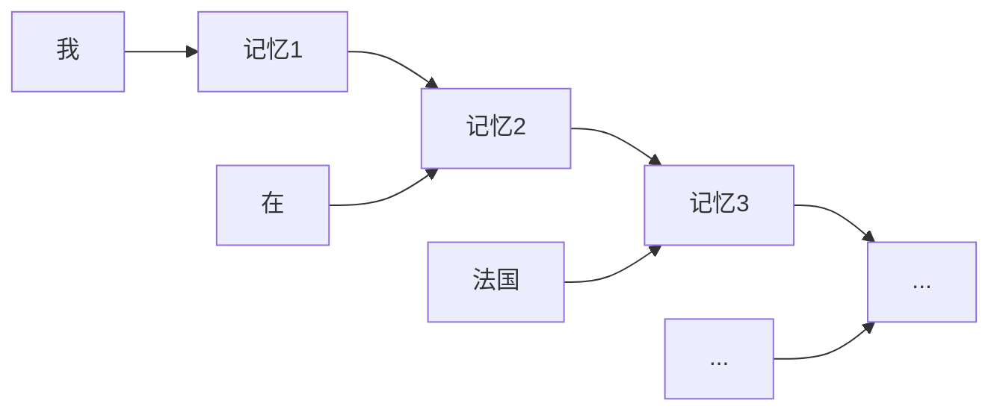
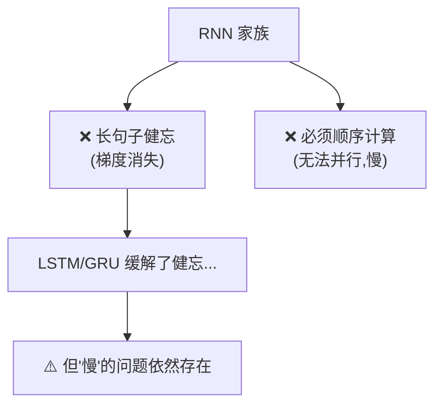
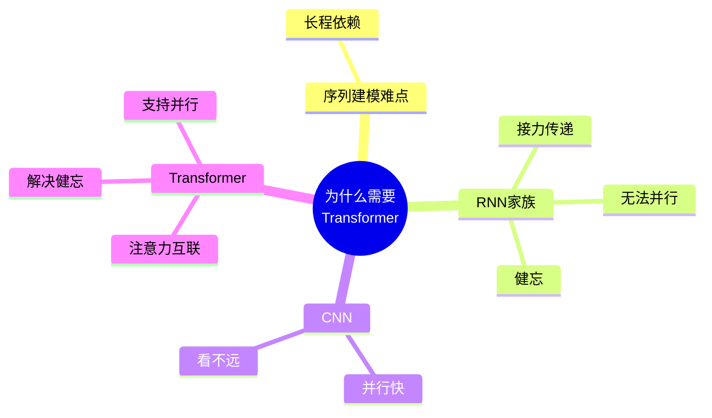

# 第 1 章 为什么需要 Transformer

> 在动手拆解 Transformer 之前,我们先搞清楚一件事:它到底解决了什么老大难问题?了解"前任们"的痛点,你才能真正体会到 Transformer 为什么会成为革命性的设计。

---

## 1.1 序列建模问题概述

### 1.1.1 什么是"序列"

生活里有大量数据是**有顺序的**,前后位置一变,意思可能就完全不同:

- **语言**:"我打你" 和 "你打我" —— 同样三个字,顺序一变,挨打的人就换了。
- **语音**:一段声波按时间先后排列。
- **股价/气温**:按天、按小时排列的时序数据。
- **DNA**:一长串按顺序排列的碱基。

这类"按顺序排成一串"的数据,统称**序列(Sequence)**。而让机器去理解、翻译、预测这种数据,就叫**序列建模(Sequence Modeling)**。

### 1.1.2 序列建模的核心难点:上下文依赖

序列建模最难的地方在于——**一个元素的含义,往往取决于离它很远的其他元素**。

看这个例子:

> "我在法国长大,所以我说一口流利的**法语**。"

要正确预测最后的"法语",模型必须记住句子开头的"法国"。这两个词隔了十几个字,这种关系叫**长程依赖(Long-range Dependency)**。

> 💡 **一句话概括**:序列建模的终极挑战,就是如何又快又准地捕捉"隔得很远的词之间的关系"。

---

## 1.2 RNN / LSTM / GRU 的原理与局限

在 Transformer 出现之前,处理序列的主力是**循环神经网络(RNN, Recurrent Neural Network)**。

### 1.2.1 RNN 的工作方式:像接力赛跑

RNN 处理序列的方式,就像一场**接力赛**:一个词一个词地读,每读一个词,就把"到目前为止的理解"打包成一个"记忆"(隐藏状态 hidden state),传给下一步。

**比喻**:就像传话游戏,第一个人对第二个人耳语,第二个人再传给第三个……信息一棒一棒往下传。

### 1.2.2 局限一:健忘(长程依赖丢失)

传话游戏玩过就知道:**传到后面,最开始的话早就走样甚至丢了**。

RNN 也一样。信息每传一棒都会衰减,句子一长,开头的"法国"传到结尾时几乎消失了——这就是著名的**梯度消失(Gradient Vanishing)**问题。模型"记不住"太久远的信息。

### 1.2.3 局限二:慢(无法并行)

接力赛的致命伤是:**第二棒必须等第一棒跑完才能开始**。

RNN 处理第 5 个词,必须先算完前 4 个词。这种**严格的先后顺序**导致它**没法并行计算**,无法充分利用现代 GPU"同时算一大批"的能力,训练速度很慢。

### 1.2.4 打补丁:LSTM 与 GRU

为了缓解"健忘"问题,研究者给 RNN 加了精巧的"闸门"结构:

- **LSTM(长短期记忆网络)**:引入"遗忘门、输入门、输出门"三个闸门,像一个带阀门的记忆水管,决定哪些信息该记住、哪些该丢掉。
- **GRU(门控循环单元)**:LSTM 的简化版,只有两个门,更轻量。

它们确实让"记性"变好了不少,但**两个根本缺陷没解决**:

1. 再好的记性,超长序列依然会衰减。
2. **本质仍是"一步接一步",还是没法并行,慢的问题依旧。**

---

## 1.3 CNN 处理序列的尝试与不足

既然 RNN 慢在"必须顺序算",有人想:**用擅长并行的卷积神经网络(CNN)行不行?**

### 1.3.1 CNN 的思路:用"滑动窗口"看局部

CNN 用一个小窗口(卷积核)在序列上滑动,一次看几个相邻的词。因为各个窗口可以**同时计算**,所以并行性很好,速度快。

**比喻**:像用放大镜一段一段地扫过句子,每次只聚焦几个相邻的字。

### 1.3.2 不足:看不远

问题也正出在"窗口小"上:一个窗口只能看到相邻几个词。要让相隔很远的两个词"产生联系",就得**层层堆叠**很多卷积层,信息才能慢慢传递过去。

结果是:**捕捉长程依赖依然费劲、不直接**。放大镜再快,也很难一眼看清句子头和句子尾的关系。

---

## 1.4 Transformer 的诞生:《Attention Is All You Need》

2017 年,Google 团队发表论文《Attention Is All You Need》(注意力就是你所需要的一切),提出了 **Transformer**,一举解决了上面所有痛点。

### 1.4.1 核心思想:抛弃循环,全靠"注意力"

Transformer 的想法非常大胆:**干脆不要 RNN 的循环结构了,让每个词直接和句子里所有词"打个照面",一步到位算出它们之间的关系。** 这个"直接打照面算关系"的机制,就是**注意力(Attention)**(第 3 章的主角)。

### 1.4.2 它一次性解决了两大痛点

| 痛点 | RNN 的问题 | Transformer 的解法 |
|------|-----------|-------------------|
| **长程依赖** | 信息一棒棒传,越远越弱 | 任意两个词**直接相连**,距离不再是障碍 |
| **无法并行** | 必须一步步顺序算 | 所有词**同时计算**,充分利用 GPU |

> 💡 **形象对比**:RNN 是"排队打电话,一个传一个";Transformer 是"拉了个群聊,所有人一次性互相看见"。既解决了"传到后面就忘",又实现了"大家同时说话"。

### 1.4.3 它带来了什么

Transformer 的出现直接引爆了后续的 AI 浪潮:

- **BERT、GPT** 系列都以它为基础;
- 我们今天用的 **ChatGPT、Claude** 等大语言模型,骨架都是 Transformer;
- 它还从 NLP "出圈"到了**图像(ViT)、语音、生物**等几乎所有领域。

可以说,理解了 Transformer,就拿到了理解现代 AI 的**总钥匙**。

---

## 1.5 本章小结

- **序列建模**的核心挑战是捕捉**长程依赖**——隔得很远的元素之间的关系。
- **RNN/LSTM/GRU** 靠"接力传递"处理序列,但有两大硬伤:**长句子健忘**、**无法并行(慢)**。
- **CNN** 并行快,但窗口小,**看不远**,捕捉长程依赖依然吃力。
- **Transformer** 用**注意力机制**让所有词直接互联,一举解决了"记不住"和"算得慢"两大难题,成为现代 AI 的基石。

### 承上启下

现在你已经知道 Transformer 为什么这么重要了。但要真正读懂它的公式,还需要一点数学"弹药"——向量、矩阵、Softmax 这些基础工具。下一章我们就用最通俗的方式把它们准备好。

---

📖 **上一章**:无 ｜ **下一章**:第 2 章 必备数学与基础知识
