# 第 1 章 为什么需要 Transformer

> 在动手拆解 Transformer 之前,我们先搞清楚一件事:它到底解决了什么老大难问题?了解"前任们"的痛点,你才能真正体会到 Transformer 为什么会成为革命性的设计。
>
> 📌 这一章不涉及任何公式,纯讲"故事和动机"。读完你会明白:Transformer 不是凭空冒出来的天才设计,而是一步步被"逼"出来的必然产物。

---

## 1.0 本章导览

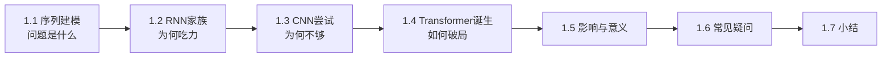

一句话预告本章的结论:

> **在 Transformer 之前,处理语言的模型要么"记不住"(RNN 健忘),要么"看不远"(CNN 窗口小),还都"跑得慢"。Transformer 用注意力机制让所有词一步到位互相连接,同时解决了这三个问题。**

---

## 1.1 序列建模问题概述

### 1.1.1 什么是"序列"

生活里有大量数据是**有顺序的**,前后位置一变,意思可能就完全不同:

- **语言**:"我打你" 和 "你打我" —— 同样三个字,顺序一变,挨打的人就换了。
- **语音**:一段声波按时间先后排列,先后颠倒就听不懂了。
- **股价/气温**:按天、按小时排列的时序数据,顺序就是时间本身。
- **DNA**:一长串按顺序排列的碱基(A/T/C/G),顺序决定了基因功能。
- **音乐**:音符按时间排列,打乱顺序旋律就没了。

这类"按顺序排成一串"的数据,统称**序列(Sequence)**。而让机器去理解、翻译、预测这种数据,就叫**序列建模(Sequence Modeling)**。

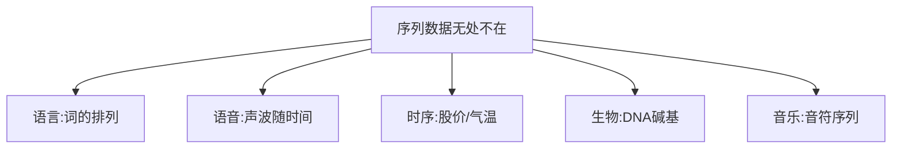

### 1.1.2 序列建模的核心难点:上下文依赖

序列建模最难的地方在于——**一个元素的含义,往往取决于离它很远的其他元素**。

看这个例子:

> "我在法国长大,所以我说一口流利的**法语**。"

要正确预测最后的"法语",模型必须记住句子开头的"法国"。这两个词隔了十几个字,这种关系叫**长程依赖(Long-range Dependency)**。

### 1.1.3 长程依赖到底有多难

我们再看几个"距离拉得更远"的例子,感受一下难度:

- **短距离**:"天空是___" → "蓝色的"(只需看前一个词)。
- **中距离**:"我今天没吃早饭,现在肚子很___" → "饿"(需要跨过半句话)。
- **超长距离**:"这本我十年前在巴黎的一家旧书店买的、封面已经泛黄的___" → "书"(中心词"书"被一大堆修饰语推到了很后面)。

距离越远,模型越需要"稳稳地记住"前面的关键信息,不能中途忘掉。这正是所有序列模型的试金石。

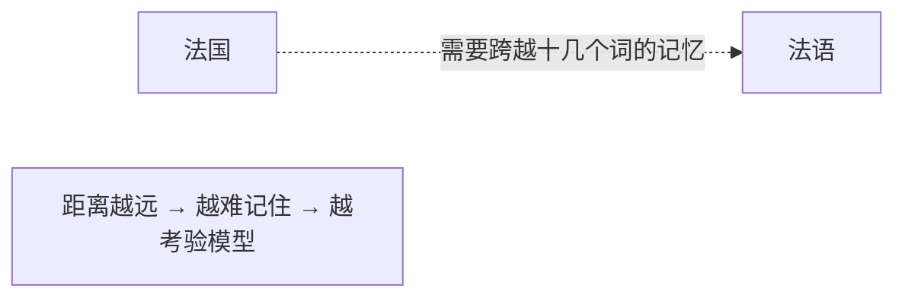

> 💡 **一句话概括**:序列建模的终极挑战,就是如何**又快又准**地捕捉"隔得很远的词之间的关系"。记住"又快"和"又准"这两个词,后面你会看到,RNN 牺牲了"快",CNN 牺牲了"准",而 Transformer 两个都要。

---

## 1.2 RNN / LSTM / GRU 的原理与局限

在 Transformer 出现之前,处理序列的主力是**循环神经网络(RNN, Recurrent Neural Network)**。

### 1.2.1 RNN 的工作方式:像接力赛跑

RNN 处理序列的方式,就像一场**接力赛**:一个词一个词地读,每读一个词,就把"到目前为止的理解"打包成一个"记忆"(隐藏状态 hidden state),传给下一步。

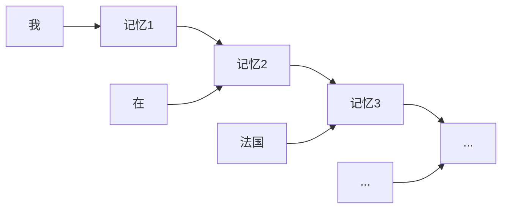

**比喻**:就像传话游戏,第一个人对第二个人耳语,第二个人再传给第三个……信息一棒一棒往下传。每一棒,当前的人都会把"听到的"和"自己的理解"混合后再传下去。

用一个稍微形式化一点的说法:RNN 在每个时间步 $t$,都根据"当前输入 $x_t$"和"上一步的记忆 $h_{t-1}$",算出"新记忆 $h_t$":

$$
h_t = f(x_t, h_{t-1})
$$

这个 $h_{t-1}$ 就是"接力棒",它是理解整个 RNN 的关键——**所有历史信息,都被压缩进了这一根棒子里**。

### 1.2.2 局限一:健忘(长程依赖丢失)

传话游戏玩过就知道:**传到后面,最开始的话早就走样甚至丢了**。

RNN 也一样。问题出在那根"接力棒"上:它的容量是固定的,却要装下越来越多的历史信息。信息每传一棒都会衰减一点,句子一长,开头的"法国"传到结尾时几乎消失了。

从数学上看,这叫**梯度消失(Gradient Vanishing)**:反向传播时,梯度要沿着长长的链条一路传回开头,每传一步都乘以一个小于 1 的数,乘着乘着就趋近于 0 了。梯度没了,模型也就学不到"法国→法语"这种远距离关系了。

**比喻**:一根接力棒被越来越多的人握过,最初写在上面的字被手汗一点点抹掉,传到终点时已经模糊不清。

### 1.2.3 局限二:慢(无法并行)

接力赛的致命伤是:**第二棒必须等第一棒跑完才能开始**。

RNN 处理第 5 个词,必须先算完前 4 个词。这种**严格的先后顺序**导致它**没法并行计算**。

这在今天是个大问题。现代 GPU 最擅长的就是"同时算一大批数据"(并行),但 RNN 的结构逼着它"排队一个一个来",GPU 的强大算力用不上,训练速度被死死拖住。

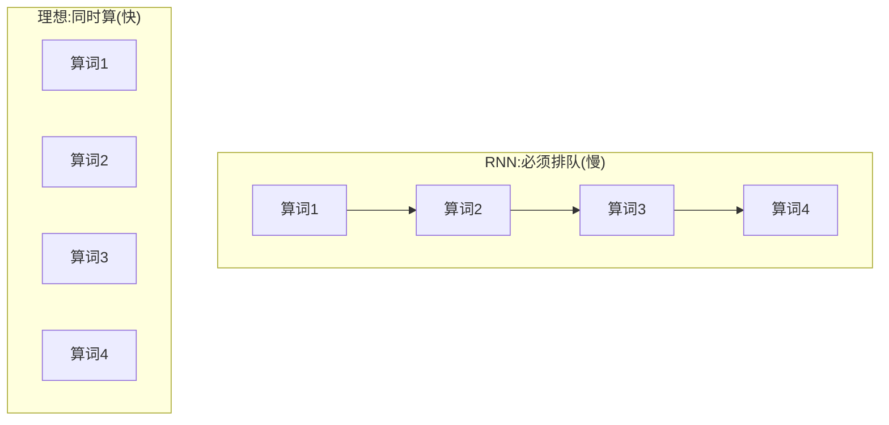

> ⚠️ **划重点**:"慢"这个缺陷,即使把 RNN 换成后面的 LSTM、GRU 也治不好,因为它是"顺序结构"本身带来的。这也是 Transformer 最终胜出的关键——它彻底抛弃了顺序结构。

### 1.2.4 打补丁:LSTM 与 GRU

为了缓解"健忘"问题,研究者给 RNN 加了精巧的"闸门"结构:

- **LSTM(长短期记忆网络)**:引入"遗忘门、输入门、输出门"三个闸门,像一个带阀门的记忆水管,决定哪些信息该记住、哪些该丢掉。它额外维护了一条"细胞状态"通道,专门用来长期保存重要信息。
- **GRU(门控循环单元)**:LSTM 的简化版,只有两个门(更新门、重置门),参数更少、更轻量,效果often相近。

**比喻**:普通 RNN 的记忆像一张不断被覆写的便签,写满了就丢老的;LSTM 像一个带分类抽屉的文件柜,有专门的机制决定"这份重要文件长期保存,那张废纸扔掉"。

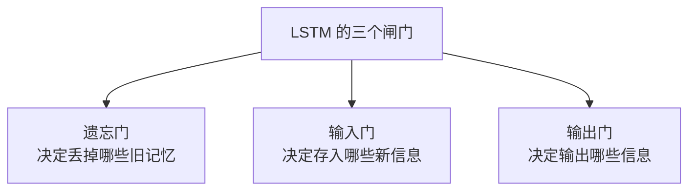

它们确实让"记性"变好了不少(能记住更长的依赖),但**两个根本缺陷没解决**:

1. 再好的记性,超长序列(几百上千词)依然会衰减,只是衰减得慢一点。
2. **本质仍是"一步接一步",还是没法并行,慢的问题一点没变。**

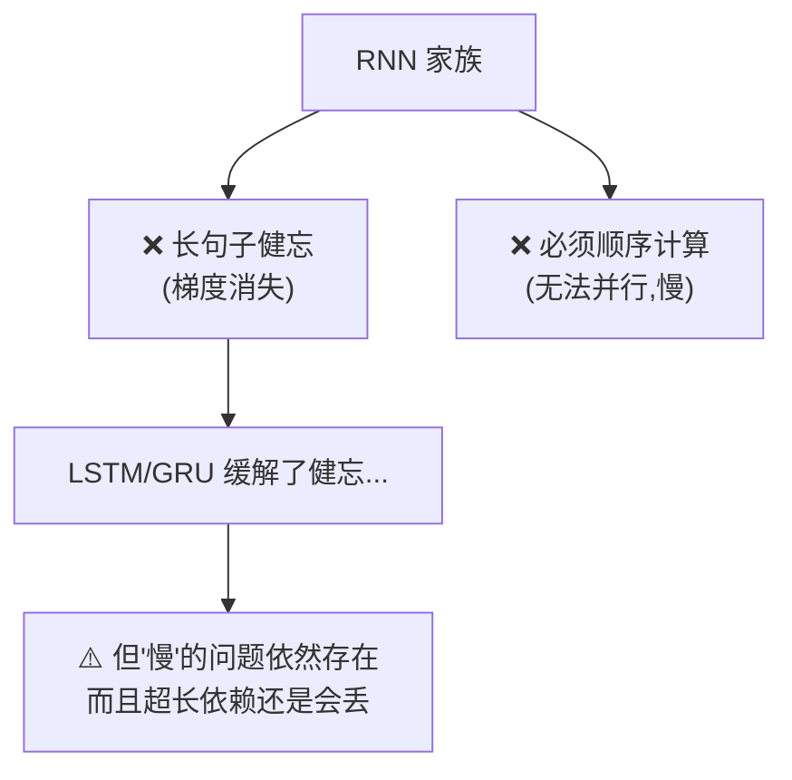

---

## 1.3 CNN 处理序列的尝试与不足

既然 RNN 慢在"必须顺序算",有人想:**用擅长并行的卷积神经网络(CNN)行不行?**

### 1.3.1 CNN 的思路:用"滑动窗口"看局部

CNN 本来是图像领域的王者。用它处理序列的思路是:用一个小窗口(卷积核)在序列上滑动,一次看几个相邻的词,提取局部特征。因为各个窗口的计算互不依赖,可以**同时进行**,所以并行性很好,速度快。

**比喻**:像用放大镜一段一段地扫过句子,每次只聚焦相邻的几个字,快速记下这一小段的特征。多个放大镜可以同时扫不同段落,互不干扰。

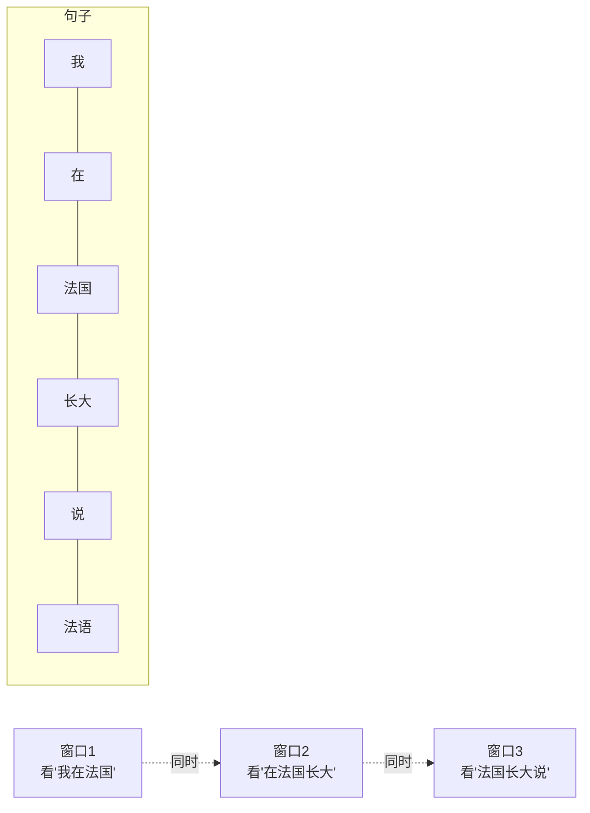

### 1.3.2 不足:看不远

问题也正出在"窗口小"上:一个窗口只能看到相邻几个词。要让相隔很远的两个词("法国"和"法语")"产生联系",就必须**层层堆叠**很多卷积层,让信息一层层往上"接力",才能慢慢传递过去。

举例:如果窗口大小是 3,那么:

- 第 1 层:每个位置能"看到"相邻 3 个词。
- 第 2 层:能间接看到 5 个词。
- 要覆盖相距 100 个词的两端,得堆几十层——又慢又难训。

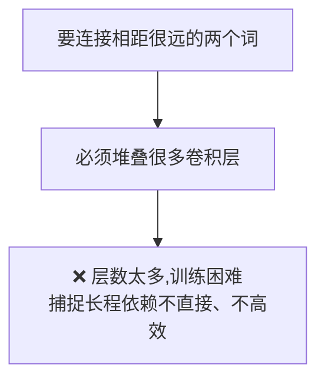

> 💡 **CNN 的总结**:它解决了 RNN 的"慢"(能并行),但没解决"看得远"这个核心诉求。放大镜再快,也很难一眼看清句子头和句子尾的关系。

### 1.3.3 一张表看清三种"前任"的困境

| 方案 | 能并行(快)? | 能看远(准)? | 一句话点评 |
|------|:---:|:---:|------|
| **RNN/LSTM/GRU** | ❌ 否 | ⚠️ 勉强 | 记性有限,还慢 |
| **CNN** | ✅ 是 | ❌ 否 | 快,但看不远 |
| **理想方案** | ✅ 是 | ✅ 是 | 又快又能看远 —— 谁能做到? |

这张表里最后一行的"理想方案",答案就是 Transformer。

---

## 1.4 Transformer 的诞生:《Attention Is All You Need》

2017 年,Google 团队发表论文《Attention Is All You Need》(注意力就是你所需要的一切),提出了 **Transformer**,一举解决了上面所有痛点。

### 1.4.1 核心思想:抛弃循环,全靠"注意力"

Transformer 的想法非常大胆:**干脆不要 RNN 的循环结构了,让每个词直接和句子里所有词"打个照面",一步到位算出它们之间的关系。**

这个"直接打照面算关系"的机制,就是**注意力(Attention)**(第 3 章的主角)。

关键在于:任意两个词之间的"距离"都变成了 **1 步**——不管"法国"和"法语"隔了多远,它们都能直接连上,信息不用再一棒棒地传、一点点地衰减。

### 1.4.2 它一次性解决了两大痛点

| 痛点 | RNN 的问题 | Transformer 的解法 |
|------|-----------|-------------------|
| **长程依赖(看得远)** | 信息一棒棒传,越远越弱 | 任意两个词**直接相连**,距离永远是 1 步 |
| **无法并行(跑得快)** | 必须一步步顺序算 | 所有词**同时计算**,充分利用 GPU |

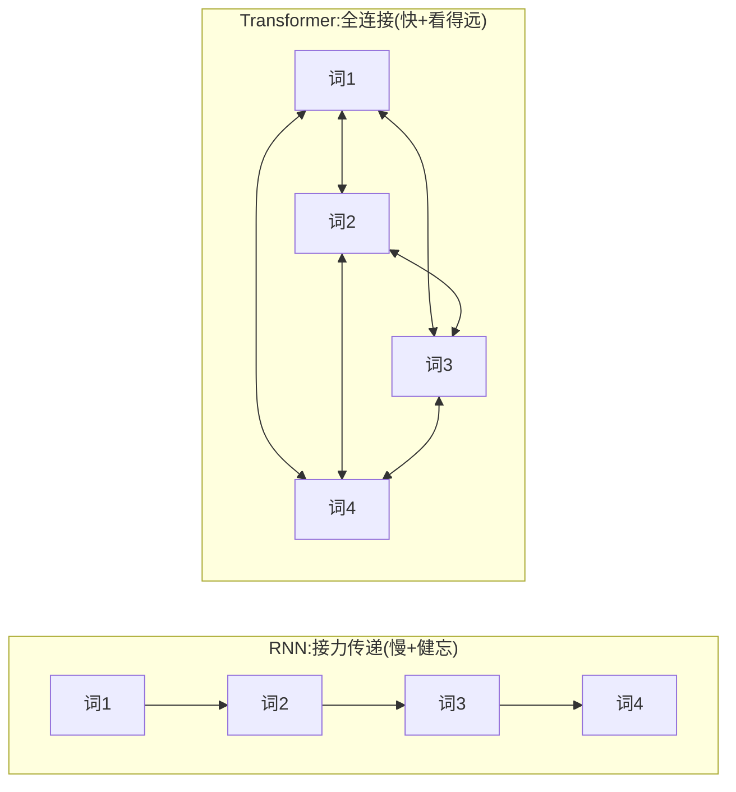

> 💡 **形象对比**:RNN 是"排队打电话,一个传一个,传到后面就串味了";Transformer 是"拉了个群聊,所有人一次性互相看见,谁跟谁都能直接对话"。既解决了"传到后面就忘",又实现了"大家同时说话"。

### 1.4.3 但天下没有免费的午餐

Transformer 也有代价,提前告诉你,免得后面产生误解:

- **丢了顺序信息**:既然所有词"一起看",就不知道谁先谁后了。这个问题靠**位置编码**(第 5 章)来补。
- **计算量随长度平方增长**:每个词都要和所有词打照面,$n$ 个词就有 $n^2$ 对关系。句子很长时开销巨大(第 12 章会讲优化)。

但在当年,这些代价换来的"又快又能看远"实在太香了,Transformer 因此迅速统治了整个领域。

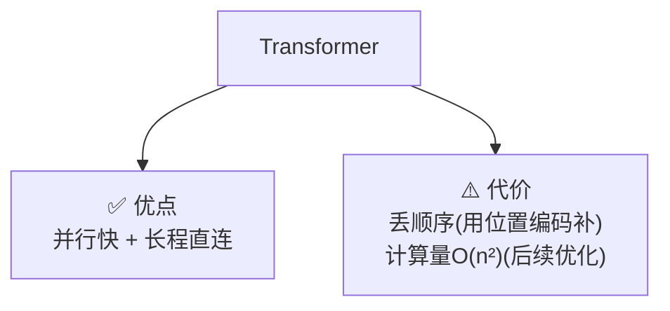

---

## 1.5 它带来了什么:一场 AI 革命

Transformer 的出现直接引爆了后续的 AI 浪潮。我们用一条时间线感受它的影响力:

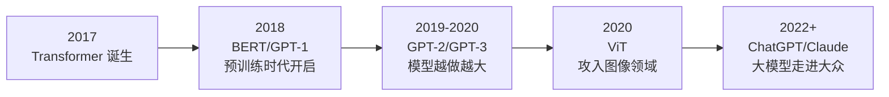

- **BERT、GPT** 系列都以它为基础(第 10 章详解);
- 我们今天用的 **ChatGPT、Claude、Gemini** 等大语言模型,骨架都是 Transformer;
- 它还从 NLP "出圈"到了**图像(ViT)、语音(Whisper)、生物(AlphaFold)** 等几乎所有领域(第 11 章详解)。

可以说,理解了 Transformer,就拿到了理解现代 AI 的**总钥匙**。这也是你花时间读这份资料的意义所在。

---

## 1.6 常见疑问 FAQ

**Q1:Transformer 是完全取代 RNN 了吗?**
在主流的 NLP 和大模型领域,基本是的。但在一些资源受限、序列极长或对实时性要求高的特定场景,RNN/LSTM 仍有用武之地。近年也出现了 Mamba 等新型序列模型,试图结合两者优点——但那是后话。

**Q2:"Attention"这个词是 Transformer 首创的吗?**
不是。注意力机制在 2014-2015 年就被用在 RNN 翻译模型里作为"辅助"了。Transformer 的革命性在于——它**彻底抛弃了 RNN,把注意力变成了唯一的主角**(所以论文才叫"Attention Is All You Need")。

**Q3:为什么并行这么重要?**
因为它直接决定了"能不能把模型做大"。能并行,才能用成千上万块 GPU 一起训练海量数据,才有了今天几千亿参数的大模型。如果还用 RNN 那种串行结构,大模型根本训不出来。

**Q4:Transformer 计算量是 O(n²),不是比 RNN 还费吗?**
单看理论计算量,长序列时确实更费。但因为它能**高度并行**,实际"墙上时间(wall-clock time)"反而快得多。而且 O(n²) 说的是"计算总量大但可以同时算",RNN 是"计算总量小但必须排队"——在 GPU 时代,前者赢麻了。

---

## 1.7 本章小结

- **序列建模**的核心挑战是捕捉**长程依赖**——隔得很远的元素之间的关系,而且要**又快又准**。
- **RNN/LSTM/GRU** 靠"接力传递"处理序列,像传话游戏,有两大硬伤:**长句子健忘**(梯度消失)、**无法并行(慢)**。LSTM/GRU 用"闸门"缓解了健忘,但没解决慢。
- **CNN** 用滑动窗口,并行快,但窗口小,**看不远**,捕捉长程依赖要堆很多层,吃力。
- **Transformer** 用**注意力机制**让所有词**直接互联**(距离永远 1 步)、**同时计算**(充分并行),一举解决了"记不住"和"算得慢"两大难题。
- 代价是丢了顺序(用位置编码补)和 O(n²) 计算量(后续优化),但收益远大于代价,它成为了现代 AI 的基石。

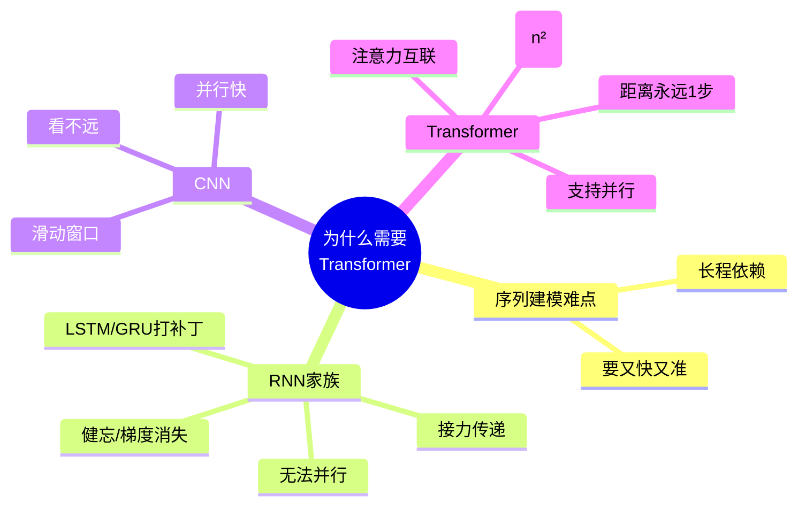

### 承上启下

现在你已经知道 Transformer 为什么这么重要了。但要真正读懂它的公式,还需要一点数学"弹药"——向量、矩阵、Softmax 这些基础工具。下一章我们就用最通俗的方式把它们准备好。

---

📖 **上一章**:无 ｜ **下一章**:第 2 章 必备数学与基础知识
