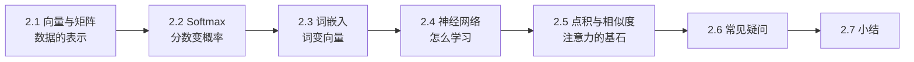
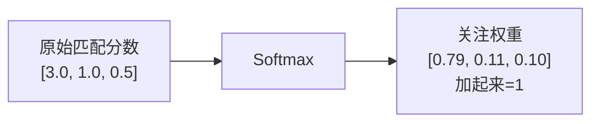
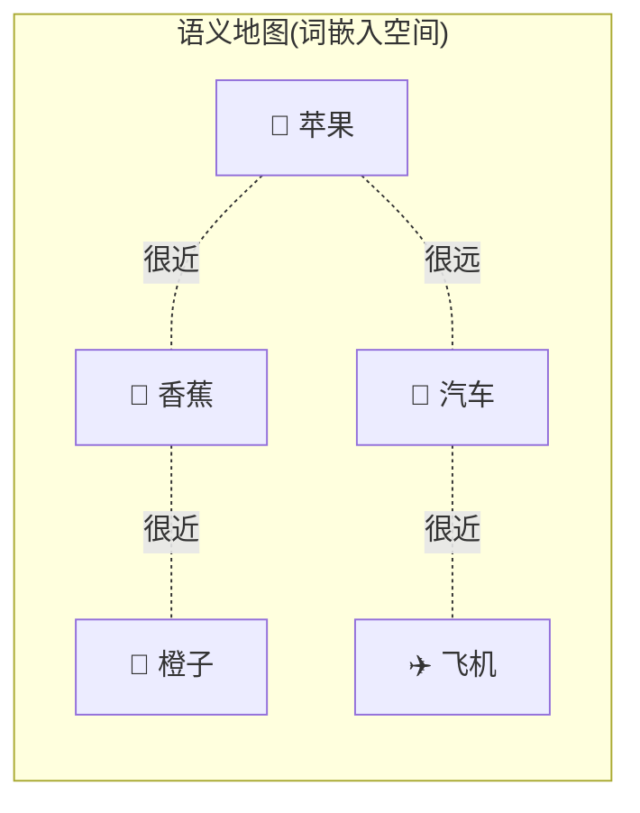
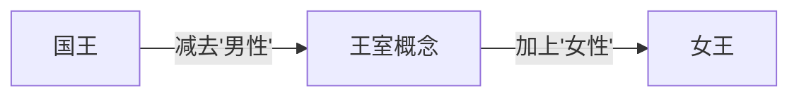
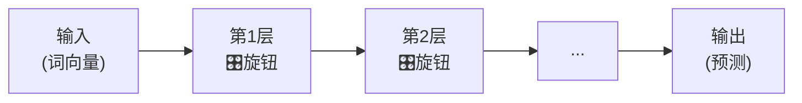
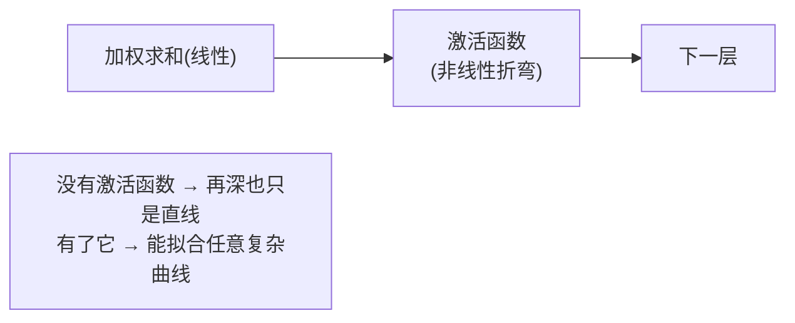
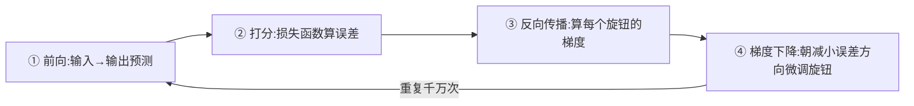
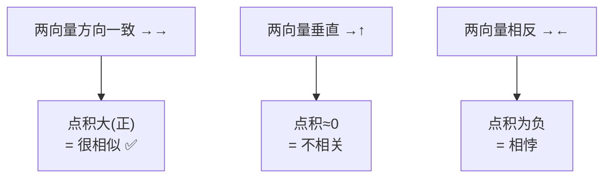
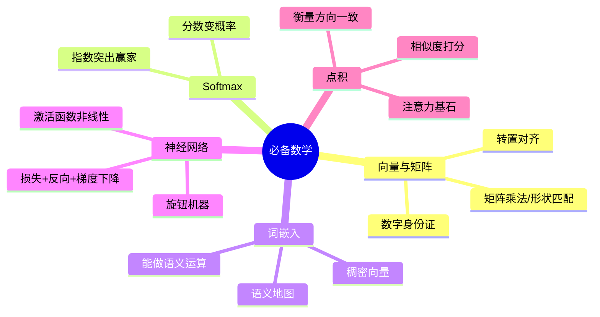

# 第 2 章 必备数学与基础知识

> 别一看到"数学"就紧张。这一章只准备后面真正会用到的几件"工具",而且全部用大白话 + 图解 + 数值例子讲清楚。目标是:让你看到 Transformer 的公式时,不再有陌生的符号。
>
> 📌 如果你已经熟悉线性代数和神经网络基础,可以快速略读本章,只在遇到不熟的符号时回来查阅。

---

## 2.0 本章导览



这一章的四件"工具"分别对应 Transformer 的哪个部分:

| 工具 | 用在哪 |
|------|--------|
| 向量/矩阵/矩阵乘法 | 贯穿全程,是所有计算的载体 |
| Softmax | 注意力权重归一化(第3章) |
| 词嵌入 | 模型的输入起点(第7章) |
| 点积 | 衡量词与词相似度(第3章) |
| 神经网络/反向传播 | 模型如何训练(第8章) |

---

## 2.1 向量、矩阵与矩阵乘法回顾

### 2.1.1 向量:一串有序的数字

**向量(Vector)** 就是一串排好队的数字,比如 `[0.2, -1.3, 0.8]`。这个向量的**维度**是 3(有 3 个数)。

在 Transformer 里,**每个词都会被表示成一个向量**。你可以把向量理解成这个词的"数字身份证"——一组数字从多个角度描述这个词的特征。

**比喻**:描述一个人可以用一串数字 `[身高, 体重, 年龄]`;描述一个词,也可以用一串数字 `[有多正面, 有多抽象, 有多正式, ...]`。维度越高,能描述的特征越细致。Transformer 里常用 512、768、1024 甚至更高的维度。

### 2.1.2 向量的两个基本运算

后面会反复用到两个简单运算,先热个身:

**① 向量相加**:对应位置的数相加。

$$
[1, 2, 3] + [10, 20, 30] = [11, 22, 33]
$$

这在第 5 章"词嵌入 + 位置编码"时会用到。

**② 数乘向量**:每个数都乘以同一个标量。

$$
0.5 \times [4, 8, 2] = [2, 4, 1]
$$

这在注意力"加权求和"时会用到(权重乘以 Value)。

### 2.1.3 矩阵:一叠向量

**矩阵(Matrix)** 就是把多个向量堆在一起形成的"数字表格"。

一个句子有很多词,每个词是一个向量,把它们叠起来就是一个矩阵:

```
       特征1  特征2  特征3  特征4
词"我"  0.2   -1.3   0.8   0.1
词"爱"  0.5    0.9  -0.2   0.7
词"你"  0.3   -0.4   0.6   0.2
```

这就是一个 3×4 的矩阵(3 个词,每个词 4 维)。Transformer 处理的其实就是这样一张张数字表格。

> 💡 **形状(Shape)是关键**:在代码里,你会无数次和"形状"打交道。一句 10 个词、每词 512 维的话,就是一个 `(10, 512)` 的矩阵。批量处理 32 句话,就再加一维变成 `(32, 10, 512)`。读代码时盯住形状,就不会晕。

### 2.1.4 矩阵乘法:注意力计算的"发动机"

矩阵乘法是 Transformer 里最频繁的运算。规则一句话:**前一个矩阵的"行",去和后一个矩阵的"列",对应相乘再相加。**

**一个具体的手算例子**(2×3 乘 3×2):

$$
\begin{bmatrix} 1 & 2 & 3 \\ 4 & 5 & 6 \end{bmatrix}
\begin{bmatrix} 1 & 0 \\ 0 & 1 \\ 1 & 1 \end{bmatrix}
$$

结果矩阵第 1 行第 1 列 = 第一个矩阵的第 1 行 `[1,2,3]` 点乘第二个矩阵的第 1 列 `[1,0,1]`:

$$
1\times1 + 2\times0 + 3\times1 = 4
$$

依此类推,完整结果:

$$
\begin{bmatrix} 4 & 5 \\ 10 & 11 \end{bmatrix}
$$

关键要记住**形状匹配规则**:

$$
(m \times n) \times (n \times p) = (m \times p)
$$

**人话翻译**:第一个矩阵的**列数**,必须等于第二个矩阵的**行数**,它们才能相乘;结果的形状是"第一个的行数 × 第二个的列数"。中间那个 $n$ "抵消"掉了。


### 2.1.5 转置:把矩阵"翻个身"

**转置(Transpose)** 就是把矩阵的行和列互换,记作 $A^T$。比如:

$$
A = \begin{bmatrix} 1 & 2 & 3 \\ 4 & 5 & 6 \end{bmatrix}, \quad
A^T = \begin{bmatrix} 1 & 4 \\ 2 & 5 \\ 3 & 6 \end{bmatrix}
$$

一个 2×3 的矩阵,转置后变成 3×2。

**为什么要讲这个?** 因为第 3 章注意力的核心公式 $QK^T$ 里就有转置。K 本来是 `(n, dₖ)`,转置成 $K^T$ 是 `(dₖ, n)`,这样才能和 Q `(n, dₖ)` 相乘,得到 `(n, n)` 的匹配度矩阵。转置在这里就是为了"让形状对得上、能相乘"。

> 💡 **为什么矩阵乘法重要**:第 3 章的 $QK^T$ 就是矩阵乘法,它一次性算出"每个词和每个词的匹配度"。而且矩阵乘法能在 GPU 上**高效并行**,这正是 Transformer 快的原因之一。

---

## 2.2 Softmax 函数

### 2.2.1 它做什么:把一堆分数变成概率

**Softmax** 的作用是:把任意一组数字,变成一组**加起来正好等于 1、且都在 0~1 之间**的数——也就是变成一组"概率"或"占比"。

**比喻**:班里投票选班长,把每个候选人的得票数,换算成"得票百分比"。10 票、6 票、4 票 → 50%、30%、20%,加起来 100%。Softmax 干的就是这种"归一化成百分比"的活。

### 2.2.2 公式与直觉

$$
\text{softmax}(z_i) = \frac{e^{z_i}}{\sum_j e^{z_j}}
$$

别被公式吓到,拆成两步就懂:

1. **先取指数 $e^{z_i}$**:让每个数都变成正数(指数永远 > 0),而且**大的更大**(拉开差距,突出"赢家")。
2. **再除以总和**:归一化,让所有数加起来等于 1。

一个完整的例子(分数 `[2, 1, 0]`):

| 原始分数 | 取指数 e^z(约) | 除以总和 → 概率 |
|---------|----------------|----------------|
| 2.0     | 7.39           | 7.39/11.11 = 0.665 |
| 1.0     | 2.72           | 2.72/11.11 = 0.245 |
| 0.0     | 1.00           | 1.00/11.11 = 0.090 |
| **合计** | 11.11          | **1.000**      |

注意:原始分数最大的(2.0)最终概率也最大(0.665),而且经过指数放大后,差距被拉得更开了(2 和 0 只差 2,但概率 0.665 和 0.090 差了 7 倍多)。

### 2.2.3 为什么用指数,而不是直接除?

你可能想:直接把 `[2, 1, 0]` 除以总和 3,得到 `[0.67, 0.33, 0]` 不也行吗?

用指数有两个好处:

1. **处理负数**:分数可能是负的(比如 `[-1, 2]`)。直接除会出问题(负概率没意义),而 $e^{负数}$ 仍是正数,天然解决。
2. **突出赢家**:指数会放大差距,让模型的"关注"更聚焦。这在注意力里很有用——我们希望相关的词权重明显更高。

### 2.2.4 为什么 Transformer 离不开它

注意力机制要给每个词分配"关注度",这些关注度必须满足"加起来是 100%"——正好就是 Softmax 的输出。它是第 3 章"把匹配度变成关注权重"那一步的关键。



> ⚠️ **小提醒**:Softmax 对输入的数值大小很敏感,数值差距过大时输出会"两极分化"(接近 0 和 1)。这正是第 3 章要"除以 √dₖ"缩放的原因,到时候你会理解得更深。

---

## 2.3 词嵌入(Word Embedding)的概念

### 2.3.1 问题:计算机不认识文字

计算机只会算数,不认识"苹果""香蕉"这些字。所以第一步必须把词**变成数字向量**。

最笨的办法叫 **One-Hot 编码**:有多少个词就用多长的向量,只有对应位置是 1,其余全是 0。

```
苹果 = [1, 0, 0, 0, ...]
香蕉 = [0, 1, 0, 0, ...]
汽车 = [0, 0, 1, 0, ...]
```

它有两个大毛病:

1. **太长太稀疏**:词表有几万个词,向量就有几万维,几乎全是 0,极其浪费内存和算力。
2. **丢失了含义关系**:在这种表示里,"苹果"和"香蕉"的距离,跟"苹果"和"汽车"的距离一模一样(任意两个 One-Hot 向量的距离都相等)——完全看不出苹果和香蕉都是水果。

### 2.3.2 词嵌入:用"稠密向量"表达含义

**词嵌入(Word Embedding)** 的思路是:用一个**较短的、充满小数的稠密向量**来表示每个词,而且让**意思相近的词,向量也相近**。

```
苹果 = [0.8, 0.2, 0.9, ...]
香蕉 = [0.7, 0.3, 0.85, ...]   ← 和苹果很接近(都是水果)
汽车 = [-0.5, 0.9, -0.2, ...]  ← 和苹果差很远
```

**比喻**:把每个词放到一张巨大的"语义地图"上。水果都聚在一个区域,交通工具聚在另一个区域。词与词的**距离**,反映了它们含义的**远近**。



### 2.3.3 词嵌入的神奇性质:能做"语义运算"

词嵌入最令人惊叹的一点是:训练好的词向量,居然能做**类比运算**。最著名的例子:

$$
\text{向量}(国王) - \text{向量}(男人) + \text{向量}(女人) \approx \text{向量}(女王)
$$

**人话翻译**:"国王"减去"男人"这个方向,大致就是"王室身份"这个概念;再加上"女人",就得到了"女王"。这说明词嵌入空间里,**方向也是有含义的**(某个方向代表"性别",某个方向代表"王室")。



这些向量不是人手工设定的,而是模型在**训练中自动学出来的**。在 Transformer 里,输入的第一步就是把每个词**查表**换成它的词嵌入向量(这张表本身也是训练出来的参数)。

> 💡 **一句话**:词嵌入把"离散的、计算机看不懂的词",变成了"连续的、能计算、有语义关系的向量"。这是所有现代 NLP 的起点。

---

## 2.4 神经网络与反向传播速览

Transformer 本质上是一种神经网络,所以我们快速过一遍神经网络"怎么学习"。

### 2.4.1 神经网络:一个可调节的"函数机器"

把神经网络想象成一台有**无数个旋钮**的机器:

- 你从一头**输入**数据(比如一句话的向量);
- 数据经过层层运算(每层都有一堆旋钮,也就是**参数/权重**);
- 从另一头**输出**结果(比如"下一个词是什么")。

一开始旋钮是随机的,输出自然是乱的。训练,就是**不断调整这些旋钮**,让输出越来越接近正确答案。



一个"神经元"做的事其实很简单:把输入加权求和,再过一个非线性函数。成千上万个这样的神经元连在一起,就能拟合极其复杂的模式。GPT-4 这样的模型,旋钮(参数)数量高达上万亿个。

### 2.4.2 激活函数:让网络能学"弯弯绕绕"

如果每一层都只是"加权求和"(线性运算),那么再多层叠起来,本质上还是一个线性运算——只能画直线,学不了复杂的曲线关系。

**激活函数**就是插在层与层之间的"非线性开关",让网络能够表达弯曲、复杂的模式。最常见的是 **ReLU**:$\max(0, x)$——负数变 0,正数不变。就这么简单的一个"折弯",却让网络有了拟合任意复杂函数的能力。



### 2.4.3 损失函数:打分的"考官"

怎么知道输出好不好?用一个**损失函数(Loss Function)** 来打分:它衡量"模型的预测"和"正确答案"差多少。

- **损失大** = 错得离谱。
- **损失小** = 预测得准。

训练的目标,就是想办法把损失降到最低。第 8 章会讲到 Transformer 用的具体损失(交叉熵)。

### 2.4.4 反向传播 + 梯度下降:怎么调旋钮

知道错了多少还不够,还得知道**每个旋钮该往哪个方向拧、拧多少**。这靠两个搭档:

1. **反向传播(Backpropagation)**:从输出端的误差出发,**反着往回**逐层计算——每个旋钮对最终误差"贡献"了多少(这个贡献就叫**梯度/Gradient**)。
2. **梯度下降(Gradient Descent)**:知道了方向后,把每个旋钮朝着"能减小误差"的方向,拧一小步。拧多大一步,由**学习率(Learning Rate)** 控制。

**比喻:蒙眼下山**。你蒙眼站在山坡上想走到山谷最低点。你用脚感受"哪个方向是下坡"(这就是梯度),然后朝那个方向迈一小步(步子大小 = 学习率)。反复很多次,就能走到谷底(损失最低点)。



> ⚠️ **学习率不能太大也不能太小**:步子太大,可能一步跨过谷底、来回震荡;步子太小,下山慢得要命。调学习率是训练里的一门手艺。第 1 章提过 RNN 的"梯度消失",本质就是反向传播时梯度衰减到接近 0,导致底层的旋钮"感受不到该往哪拧"。

> 💡 **一句话总结**:神经网络学习 = "预测 → 对答案打分 → 反向找出每个参数的责任 → 微调参数",如此循环往复,直到预测足够准。第 3、4 章里那些矩阵 $W^Q, W^K, W^V$,就是靠这个过程学出来的"旋钮"。

---

## 2.5 点积与相似度:注意力的基石

这一节单独拎出来讲,因为它是理解第 3 章注意力的**最关键的数学直觉**。

### 2.5.1 点积怎么算

两个向量的**点积(Dot Product)**,就是对应位置相乘再相加,结果是**一个数**:

$$
[1, 2, 3] \cdot [4, 5, 6] = 1\times4 + 2\times5 + 3\times6 = 4 + 10 + 18 = 32
$$

### 2.5.2 点积衡量"方向有多一致"

点积有一个漂亮的几何意义:

$$
\vec{a} \cdot \vec{b} = |\vec{a}||\vec{b}|\cos\theta
$$

其中 $\theta$ 是两个向量的夹角。抛开长度不谈,**点积的正负和大小,主要反映两个向量"方向有多一致"**:

- 方向**相同**(夹角 0°,$\cos = 1$)→ 点积**大且为正** → 很相似。
- 方向**垂直**(夹角 90°,$\cos = 0$)→ 点积**约为 0** → 不相关。
- 方向**相反**(夹角 180°,$\cos = -1$)→ 点积**为负** → 相悖。



### 2.5.3 为什么这对注意力至关重要

第 3 章里,注意力用**点积**来衡量"一个词(Query)和另一个词(Key)有多匹配"。既然词嵌入让"意思相近的词方向相近",那么:

> **两个词的向量点积大 → 它们语义相关 → 注意力就该给高权重。**

这就是整个注意力机制的核心直觉。记住"**点积 = 相似度打分**",你就抓住了第 3 章的灵魂。

> 💡 **串起来看**:词嵌入(2.3)把词变成有方向的向量 → 点积(2.5)衡量方向是否一致(即语义是否相关)→ Softmax(2.2)把这些相关度打分变成加起来为 1 的权重。三件工具环环相扣,直接组装成了注意力。

---

## 2.6 常见疑问 FAQ

**Q1:我线性代数忘光了,能学 Transformer 吗?**
能。你只需要牢牢掌握本章这几点:向量是一串数、矩阵乘法要形状匹配、点积衡量相似度、Softmax 归一化成概率。其余细节遇到再查即可,不必系统重学。

**Q2:词嵌入的维度(比如 512)是怎么定的?**
是一个超参数,由设计者选定。维度越高,表达能力越强,但计算和内存开销也越大。常见取值 256、512、768、1024。它需要在"效果"和"成本"之间权衡。

**Q3:Softmax 和 sigmoid 有什么区别?**
sigmoid 把**单个**数压到 0~1(常用于二分类);Softmax 把**一组**数变成加起来为 1 的概率分布(常用于多选一)。注意力需要"在多个词之间分配权重",所以用 Softmax。

**Q4:反向传播需要我手动算吗?**
不需要!PyTorch、TensorFlow 等框架会**自动求导**(autograd),你只要写好前向计算,框架自动帮你算梯度。理解原理是为了 debug 和调参,实际不用手推。

**Q5:为什么点积能当相似度,不用更复杂的度量?**
点积简单、计算极快、能被 GPU 高效并行,而且配合词嵌入效果就很好。这种"简单又够用"的特性,正是它被选中的原因——Transformer 的很多设计都体现了这种"简单高效"的哲学。

---

## 2.7 本章小结

- **向量**是词的"数字身份证",**矩阵**是一叠向量;**矩阵乘法**要满足形状匹配 $(m×n)(n×p)=(m×p)$;**转置**用于让形状对齐(如 $QK^T$)。
- **Softmax** 把一组分数变成"加起来为 1 的概率",用指数是为了处理负数、突出赢家;是注意力分配权重的关键。
- **词嵌入**用稠密向量表示词,让意思相近的词在"语义地图"上也相近,甚至能做"国王-男人+女人≈女王"的语义运算,取代了又长又蠢的 One-Hot。
- **神经网络**是有无数旋钮的函数机器,靠**损失函数打分 + 反向传播算梯度 + 梯度下降调参**来学习;激活函数提供非线性。
- **点积衡量方向一致性(相似度)**,是注意力的核心直觉:点积大 = 语义相关 = 高权重。



### 承上启下

工具准备齐了!从下一章开始,我们就正式进入 Transformer 的核心。第 3 章会用上本章的**点积**(算相似度)、**Softmax**(归一化)、**矩阵乘法**(并行计算)这三件工具,把"注意力"这个心脏部件彻底讲透。

---

📖 **上一章**:第 1 章 为什么需要 Transformer ｜ **下一章**:第 3 章 注意力机制
