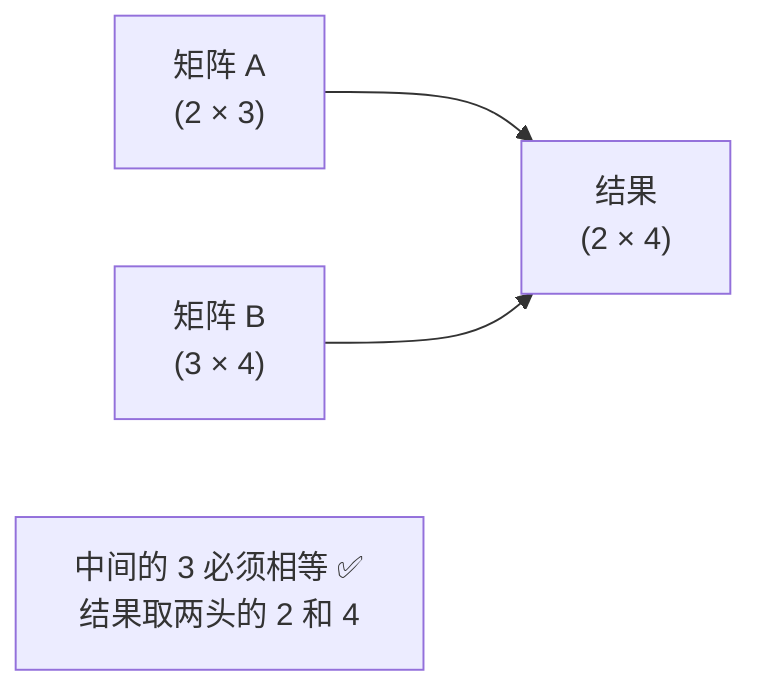
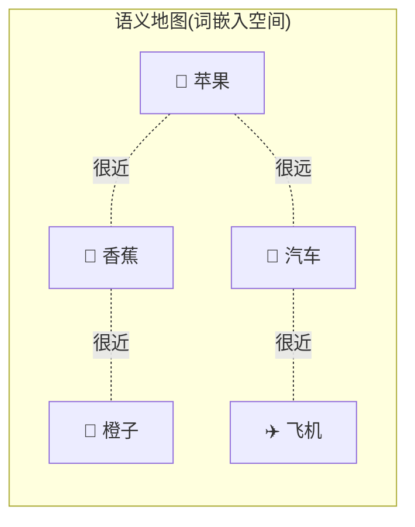
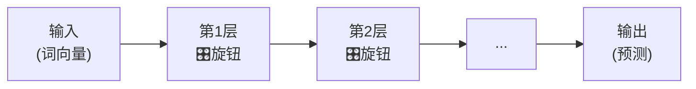
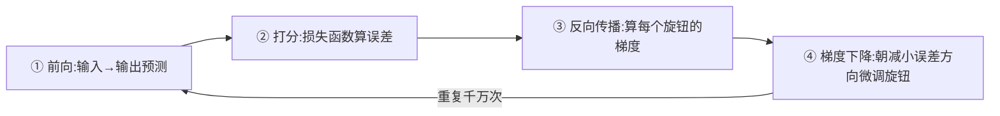

# 第 2 章 必备数学与基础知识

> 别一看到"数学"就紧张。这一章只准备后面真正会用到的几件"工具",而且全部用大白话 + 图解讲清楚。目标是:让你看到 Transformer 的公式时,不再有陌生的符号。

---

## 2.1 向量、矩阵与矩阵乘法回顾

### 2.1.1 向量:一串有序的数字

**向量(Vector)** 就是一串排好队的数字,比如 `[0.2, -1.3, 0.8]`。

在 Transformer 里,**每个词都会被表示成一个向量**。你可以把向量理解成这个词的"数字身份证"——一组数字从多个角度描述这个词的特征。

**比喻**:描述一个人可以用一串数字 `[身高, 体重, 年龄]`;描述一个词,也可以用一串数字 `[有多正面, 有多抽象, 有多正式, ...]`。

### 2.1.2 矩阵:一叠向量

**矩阵(Matrix)** 就是把多个向量堆在一起形成的"数字表格"。

一个句子有很多词,每个词是一个向量,把它们叠起来就是一个矩阵:

```
       特征1  特征2  特征3  特征4
词"我"  0.2   -1.3   0.8   0.1
词"爱"  0.5    0.9  -0.2   0.7
词"你"  0.3   -0.4   0.6   0.2
```

这就是一个 3×4 的矩阵(3 个词,每个词 4 维)。Transformer 处理的其实就是这样一张张数字表格。

### 2.1.3 矩阵乘法:注意力计算的"发动机"

矩阵乘法是 Transformer 里最频繁的运算。规则一句话:**前一个矩阵的"行",去和后一个矩阵的"列",对应相乘再相加。**

关键要记住**形状匹配规则**:

$$
(m \times n) \times (n \times p) = (m \times p)
$$

**人话翻译**:第一个矩阵的**列数**,必须等于第二个矩阵的**行数**,它们才能相乘;结果的形状是"第一个的行数 × 第二个的列数"。



> 💡 **为什么重要**:第 3 章的 $QK^T$ 就是矩阵乘法,它一次性算出"每个词和每个词的匹配度"。矩阵乘法能在 GPU 上高效并行,这正是 Transformer 快的原因之一。

---

## 2.2 Softmax 函数

### 2.2.1 它做什么:把一堆分数变成概率

**Softmax** 的作用是:把任意一组数字,变成一组**加起来正好等于 1、且都在 0~1 之间**的数——也就是变成一组"概率"或"占比"。

**比喻**:班里投票选班长,把每个候选人的得票数,换算成"得票百分比"。10 票、6 票、4 票 → 50%、30%、20%,加起来 100%。Softmax 干的就是这种"归一化成百分比"的活。

### 2.2.2 公式与直觉

$$
\text{softmax}(z_i) = \frac{e^{z_i}}{\sum_j e^{z_j}}
$$

别被公式吓到,拆成两步就懂:

1. **先取指数 $e^{z_i}$**:让每个数都变成正数,而且**大的更大**(拉开差距,突出"赢家")。
2. **再除以总和**:归一化,让所有数加起来等于 1。

一个例子:

| 原始分数 | 取指数 e^z(约) | 除以总和 → 概率 |
|---------|----------------|----------------|
| 2.0     | 7.4            | 0.66           |
| 1.0     | 2.7            | 0.24           |
| 0.0     | 1.0            | 0.10           |
| **合计** | 11.1           | **1.00**       |

### 2.2.3 为什么 Transformer 离不开它

注意力机制要给每个词分配"关注度",这些关注度必须满足"加起来是 100%"——正好就是 Softmax 的输出。它是第 3 章"把匹配度变成关注权重"那一步的关键。

> ⚠️ **小提醒**:Softmax 对输入的数值大小很敏感,数值差距过大时输出会"两极分化"。这正是第 3 章要"除以 √dₖ"缩放的原因,到时候你会理解得更深。

---

## 2.3 词嵌入(Word Embedding)的概念

### 2.3.1 问题:计算机不认识文字

计算机只会算数,不认识"苹果""香蕉"这些字。所以第一步必须把词**变成数字向量**。

最笨的办法叫 **One-Hot 编码**:有多少个词就用多长的向量,只有对应位置是 1,其余全是 0。

```
苹果 = [1, 0, 0, 0, ...]
香蕉 = [0, 1, 0, 0, ...]
汽车 = [0, 0, 1, 0, ...]
```

它有两个大毛病:

1. **太长太稀疏**:词表有几万个词,向量就有几万维,几乎全是 0,极其浪费。
2. **丢失了含义关系**:在这种表示里,"苹果"和"香蕉"的距离,跟"苹果"和"汽车"的距离一模一样——完全看不出苹果和香蕉都是水果。

### 2.3.2 词嵌入:用"稠密向量"表达含义

**词嵌入(Word Embedding)** 的思路是:用一个**较短的、充满小数的稠密向量**来表示每个词,而且让**意思相近的词,向量也相近**。

```
苹果 = [0.8, 0.2, 0.9, ...]
香蕉 = [0.7, 0.3, 0.85, ...]   ← 和苹果很接近(都是水果)
汽车 = [-0.5, 0.9, -0.2, ...]  ← 和苹果差很远
```

**比喻**:把每个词放到一张巨大的"语义地图"上。水果都聚在一个区域,交通工具聚在另一个区域。词与词的**距离**,反映了它们含义的**远近**。



这些向量不是人手工设定的,而是模型在**训练中自动学出来的**。在 Transformer 里,输入的第一步就是把每个词查表换成它的词嵌入向量。

---

## 2.4 神经网络与反向传播速览

Transformer 本质上是一种神经网络,所以我们快速过一遍神经网络"怎么学习"。

### 2.4.1 神经网络:一个可调节的"函数机器"

把神经网络想象成一台有**无数个旋钮**的机器:

- 你从一头**输入**数据(比如一句话的向量);
- 数据经过层层运算(每层都有一堆旋钮,也就是**参数/权重**);
- 从另一头**输出**结果(比如"下一个词是什么")。

一开始旋钮是随机的,输出自然是乱的。训练,就是**不断调整这些旋钮**,让输出越来越接近正确答案。



### 2.4.2 损失函数:打分的"考官"

怎么知道输出好不好?用一个**损失函数(Loss Function)** 来打分:它衡量"模型的预测"和"正确答案"差多少。

- **损失大** = 错得离谱。
- **损失小** = 预测得准。

训练的目标,就是想办法把损失降到最低。

### 2.4.3 反向传播 + 梯度下降:怎么调旋钮

知道错了多少还不够,还得知道**每个旋钮该往哪个方向拧、拧多少**。这靠两个搭档:

1. **反向传播(Backpropagation)**:从输出端的误差出发,**反着往回**逐层计算——每个旋钮对最终误差"贡献"了多少(这个贡献就叫**梯度/Gradient**)。
2. **梯度下降(Gradient Descent)**:知道了方向后,把每个旋钮朝着"能减小误差"的方向,拧一小步。

**比喻**:你蒙眼站在山坡上想走到山谷最低点。你用脚感受"哪个方向是下坡"(这就是梯度),然后朝那个方向迈一小步。反复很多次,就能走到谷底(损失最低点)。



> 💡 **一句话总结**:神经网络学习 = "预测 → 对答案打分 → 反向找出每个参数的责任 → 微调参数",如此循环往复,直到预测足够准。第 3、4 章里那些矩阵 $W^Q, W^K, W^V$,就是靠这个过程学出来的"旋钮"。

---

## 2.5 本章小结

- **向量**是词的"数字身份证",**矩阵**是一叠向量,**矩阵乘法**是注意力计算的发动机(记住形状匹配规则)。
- **Softmax** 把一组分数变成"加起来为 1 的概率",是注意力分配权重的关键。
- **词嵌入**用稠密向量表示词,让意思相近的词在"语义地图"上也相近,取代了又长又蠢的 One-Hot。
- **神经网络**是有无数旋钮的函数机器,靠**损失函数打分 + 反向传播算梯度 + 梯度下降调参**来学习。

### 承上启下

工具准备齐了!从下一章开始,我们就正式进入 Transformer 的核心。第 3 章(你已经读过)讲了单个注意力,接下来的第 4 章会告诉你:为什么要用"多个脑袋"同时去关注句子——也就是**多头注意力**。

---

📖 **上一章**:第 1 章 为什么需要 Transformer ｜ **下一章**:第 3 章 注意力机制
