# 第 3 章 注意力机制(Attention)

> 本章是整个 Transformer 的心脏。只要真正搞懂了"注意力"这一个概念,后面的多头注意力、编码器、解码器都只是它的"排列组合"。所以我们会放慢脚步,用尽量多的比喻、图解和**完整的数值手算**把它讲透。
>
> 📌 本章篇幅较长,建议分两次阅读:3.1~3.3 建立直觉,3.4~3.8 深入细节与代码。

---

## 3.0 本章导览

在正式开始前,先给你一张"地图",让你知道这一章会走过哪些站点:

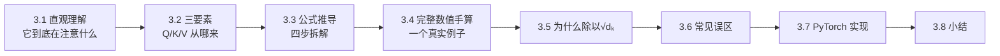

一句话预告本章的核心结论:

> **注意力机制 = 让每个词根据"和其他词的匹配程度",有选择地从其他词那里"提取"信息,重新组合成一个更懂上下文的新表示。**

---

## 3.1 直观理解:注意力到底在"注意"什么

### 3.1.1 从一个句子说起

请你读这句话:

> "小明把水倒进杯子里,直到**它**满了。"

问题来了:这里的"**它**"指的是什么?

你几乎不假思索就知道——是"**杯子**",而不是"小明",也不是"水"。

再看一个几乎一样的句子:

> "小明把水倒进杯子里,直到**它**空了。"

这次"**它**"更可能指的是"**水壶/水**"(倒空了)。仅仅把"满"换成"空",指代对象就变了!

你的大脑在这两句话里都做了同一件事:在理解"它"这个词的时候,**结合整句话的上下文**,把**注意力**重点放在了最相关的那个词上,而对其他词的关注则少一些。

这就是注意力机制想模仿的东西:

> **在处理某一个词时,自动判断"应该更多地参考句子里的哪些词",并给它们分配不同的"关注度"。**

### 3.1.2 为什么"平均"不行,必须"加权"

你可能会想:理解"它"的时候,把句子里所有词的信息**平均一下**不就行了吗?

不行。看下面的对比:

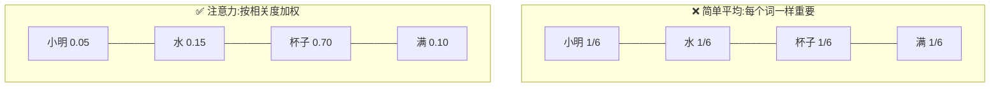

- **简单平均**:所有词一视同仁,"杯子"和"小明"权重一样。结果是一锅"平均糊",丢掉了关键信息。
- **注意力加权**:相关的词(杯子)权重高,不相关的词(小明)权重低。结果精准地聚焦在真正重要的信息上。

> 💡 **一句话点破**:注意力的精髓不在"看所有词",而在"**按不同的重要程度**看所有词"。这个"重要程度"是模型根据上下文**自动算出来**的,不是人手工设定的。

### 3.1.3 一个更生活化的比喻:图书馆查资料

想象你走进一座图书馆,要写一篇关于"杯子"的报告:

- 你心里带着一个**问题(Query)**:"我想找和杯子有关的内容"。
- 图书馆每本书都贴着一个**标签(Key)**:比如"水""小明""杯子""容器"……
- 每本书里有真正的**内容(Value)**。

你的做法是:

1. 拿你的问题,去和每本书的标签比对,看看**哪本书标签最匹配**。
2. 匹配度高的书,你多看几眼(高权重);匹配度低的,你随便瞄一下(低权重)。
3. 最后,你把所有书的内容**按匹配度加权综合**起来,写成报告。

注意力机制干的就是这件事。记住这三个关键词,后面反复会用到:

| 术语 | 英文 | 图书馆比喻 | 一句话解释 |
|------|------|-----------|-----------|
| 查询 | Query (Q) | 你手上的问题 | "我现在想找什么" |
| 键 | Key (K) | 每本书的标签 | "每个词能提供什么线索" |
| 值 | Value (V) | 每本书的内容 | "每个词实际携带的信息" |

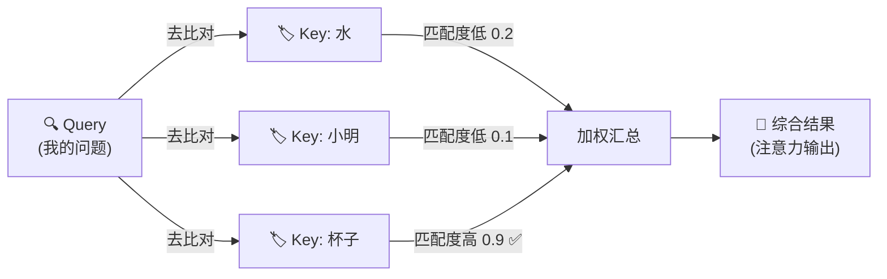

### 3.1.4 为什么 Key 和 Value 要分开?

这是初学者最容易困惑的一点。既然都是"书",为什么要分成"标签(Key)"和"内容(Value)"两个东西?

**因为"用来被检索的特征"和"真正想要的信息"是两回事。**

再用图书馆比喻:一本书的**标签**(书脊上的分类号、关键词)是为了让你**快速找到它**;而书里的**内容**才是你真正要摘抄进报告的东西。标签是"索引",内容是"干货"。

- 如果 Key 和 Value 强行相同,模型就少了一个自由度:它没法学到"用特征 A 去匹配,但提取信息 B"这种更灵活的行为。
- 分开之后,模型可以学到:"当有词问起'代词指代'时(Query),我这个'杯子'会用'我是个容器'这个特征(Key)去匹配,匹配上了就把'我是杯子、能装水'这份内容(Value)交出去。"

> 💡 **记住**:Key 负责"**被找到**",Value 负责"**被取走**"。分开设计让注意力更灵活强大。

---

## 3.2 Query、Key、Value 三要素

### 3.2.1 它们从哪来?

你可能会问:句子里明明只有一堆词,哪来的 Q、K、V?

答案是:**它们都是由词向量"变身"而来的**。

每个词先被转成一个向量(词嵌入,第 2 章讲过)。然后我们用三个不同的"变换矩阵" $W^Q$、$W^K$、$W^V$,分别把同一个词向量变成三个不同的角色:

$$
Q = x \cdot W^Q, \quad K = x \cdot W^K, \quad V = x \cdot W^V
$$

**人话翻译**:同一个词 $x$,戴上三顶不同的"帽子",就分别扮演了"提问者""被检索的标签""实际内容"三种身份。这三个矩阵 $W^Q, W^K, W^V$ 是模型**训练时学出来的**。

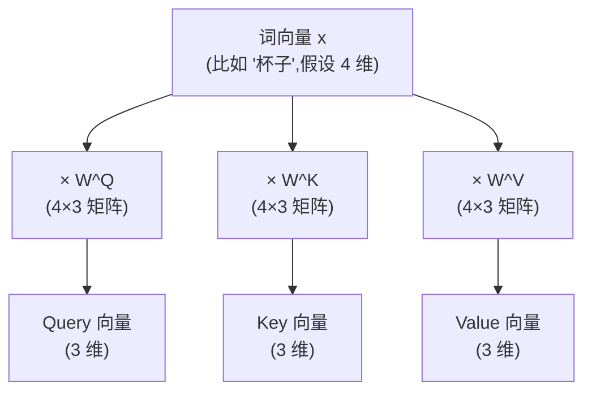

> 💡 **小提示**:为什么要拆成三个而不是直接用原向量?因为"我想找什么(Q)"、"我能被找到的特征(K)"、"我真正提供的信息(V)"本来就是三件不同的事,分开学习模型更灵活。

### 3.2.2 一个词同时扮演三种角色

一个特别重要、但容易被忽略的点:在自注意力里,**句子里的每一个词,都同时生成自己的 Q、K、V**。

也就是说,"杯子"这个词:

- 作为 **Query**,它会主动去问:"我该关注句子里的谁?"
- 作为 **Key**,它会被别的词(比如"它")拿来匹配:"你和我相关吗?"
- 作为 **Value**,一旦被匹配上,它就把自己的信息贡献出去。

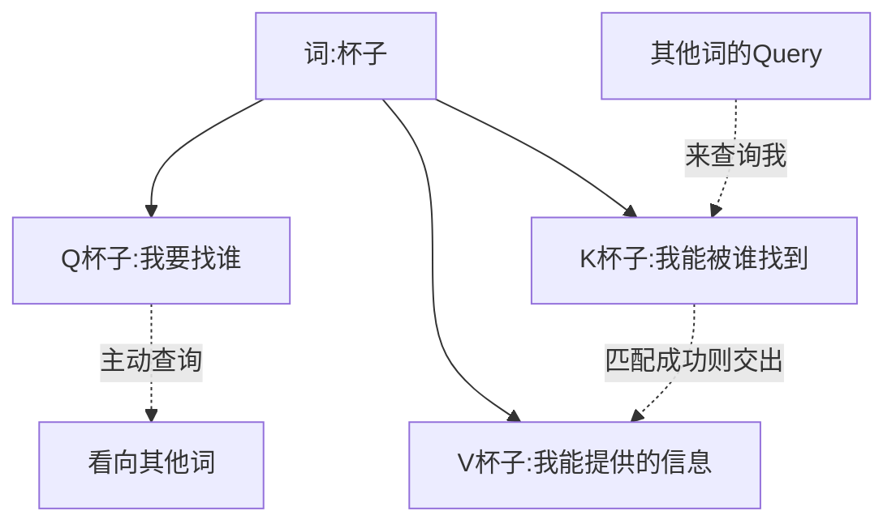

**比喻**:一场大型相亲会上,每个人既是"主动找对象的人(Query)",又是"别人眼中的候选人(Key)",一旦被选中还要"展示真实的自己(Value)"。所有人同时扮演这三种角色。

### 3.2.3 自注意力(Self-Attention)

当 Q、K、V 全都来自**同一个句子**时,这种注意力叫**自注意力(Self-Attention)**——句子在"自己关注自己",从而理解词与词之间的关系(比如前面"它→杯子"的例子)。Transformer 的核心用的就是自注意力。

与之相对的还有"交叉注意力"(Q 来自一个序列,K/V 来自另一个序列),我们放到第 7 章讲解码器时再展开。现在只需记住:**本章讲的都是自注意力**。

---

## 3.3 缩放点积注意力(Scaled Dot-Product Attention)公式推导

这是 Transformer 里注意力的正式名字。别被名字吓到,我们一步步拆。

完整公式长这样:

$$
\text{Attention}(Q, K, V) = \text{softmax}\left(\frac{Q K^T}{\sqrt{d_k}}\right) V
$$

我们把它拆成 **4 个动作**,逐个用大白话讲。

### 步骤 1:算匹配度(Q 和 K 做点积)

$$
\text{scores} = Q K^T
$$

**点积**衡量两个向量有多"像"——方向越一致,点积越大。所以 $QK^T$ 就是在算:**每个 Query 和每个 Key 到底有多匹配**。

为什么点积能衡量相似度?回忆一下点积的几何意义:

$$
\vec{a} \cdot \vec{b} = |\vec{a}||\vec{b}|\cos\theta
$$

其中 $\theta$ 是两向量的夹角。夹角越小(方向越一致),$\cos\theta$ 越大,点积越大。所以:

- 两个词的向量**方向相近** → 点积大 → 匹配度高 → 关注度高。
- 两个词的向量**方向无关(接近垂直)** → 点积接近 0 → 匹配度低。
- 两个词的向量**方向相反** → 点积为负 → 几乎不关注。

结果是一张"匹配度表格"(注意力分数矩阵)。假设句子有 3 个词:

|          | Key:水 | Key:小明 | Key:杯子 |
|----------|--------|---------|---------|
| **Q:它** | 0.2    | 0.1     | 0.9     |

可以看到"它"和"杯子"的分数最高(0.9)。

### 步骤 2:缩放(除以 $\sqrt{d_k}$)

$$
\frac{\text{scores}}{\sqrt{d_k}}
$$

这一步是把上面的分数**整体缩小**。为什么要缩小?3.5 节专门解释,这里先记住"防止数值太大"。

### 步骤 3:归一化(Softmax)

$$
\text{weights} = \text{softmax}\left(\frac{QK^T}{\sqrt{d_k}}\right)
$$

Softmax 把一行分数变成**加起来等于 1 的概率**,也就是真正的"关注度权重":

|          | 水    | 小明  | 杯子  | 合计 |
|----------|-------|-------|-------|------|
| **它**   | 0.20  | 0.15  | 0.65  | 1.0  |

**人话翻译**:处理"它"这个词时,把 65% 的注意力给"杯子",20% 给"水",15% 给"小明"。

### 步骤 4:加权求和(乘以 V)

$$
\text{output} = \text{weights} \cdot V
$$

拿上面这组权重,去对每个词的 **Value** 做加权平均。关注度高的词,它的内容在结果里占比就大。

最终"它"这个位置得到的新向量,就**融合了大量"杯子"的信息**——模型因此"知道"了它指代杯子。

### 全流程图解

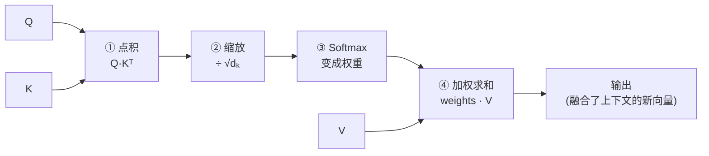

### 用矩阵形状看清整个流程

很多人对公式发怵,其实只要盯住"形状"变化就一目了然。设句子有 $n$ 个词,$d_k$ 是维度:

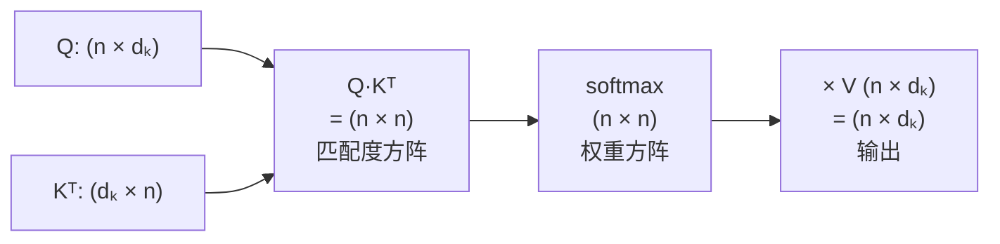

- $Q K^T$ 得到一个 $n \times n$ 的方阵,第 $i$ 行第 $j$ 列表示"第 $i$ 个词对第 $j$ 个词的关注分数"。
- Softmax 对**每一行**做归一化(每行加起来是 1)。
- 再乘 $V$,把权重变回 $n \times d_k$ 的输出,和输入词数一致。

> 💡 **关键直觉**:那个 $n \times n$ 的方阵就是注意力的"灵魂"——它记录了句子里**每个词对每个词的关注程度**,是一张完整的"词间关系图"。

---

## 3.4 完整数值手算:一个能自己验算的例子

光看公式还是抽象。这一节我们用**具体的小数字**,把注意力从头到尾算一遍。你可以拿纸笔跟着算,算完这一遍,你对注意力的理解会脱胎换骨。

### 3.4.1 设定

为了手算方便,我们用一个极简设定:

- 句子只有 **2 个词**:"猫" 和 "累"。
- 向量维度 $d_k = 2$。

假设经过 $W^Q, W^K, W^V$ 变换后,得到:

$$
Q = \begin{bmatrix} 1 & 0 \\ 0 & 1 \end{bmatrix}, \quad
K = \begin{bmatrix} 1 & 0 \\ 0 & 1 \end{bmatrix}, \quad
V = \begin{bmatrix} 10 & 0 \\ 0 & 10 \end{bmatrix}
$$

其中每一行代表一个词。第 1 行是"猫",第 2 行是"累"。

### 3.4.2 步骤 1:算 $QK^T$(匹配度)

$$
QK^T = \begin{bmatrix} 1 & 0 \\ 0 & 1 \end{bmatrix} \begin{bmatrix} 1 & 0 \\ 0 & 1 \end{bmatrix} = \begin{bmatrix} 1 & 0 \\ 0 & 1 \end{bmatrix}
$$

我们逐个元素看这张匹配度表:

|            | 对"猫"(K) | 对"累"(K) |
|------------|-----------|-----------|
| **"猫"(Q)** | 1         | 0         |
| **"累"(Q)** | 0         | 1         |

解读:"猫"和自己("猫")的匹配度是 1,和"累"的匹配度是 0。每个词此刻只跟自己最像(因为我们故意设成了单位矩阵)。

### 3.4.3 步骤 2:缩放

$d_k = 2$,所以除以 $\sqrt{2} \approx 1.414$:

$$
\frac{QK^T}{\sqrt{2}} = \begin{bmatrix} 0.707 & 0 \\ 0 & 0.707 \end{bmatrix}
$$

### 3.4.4 步骤 3:Softmax(对每一行)

以第一行 `[0.707, 0]` 为例,套用第 2 章的 Softmax 公式:

$$
e^{0.707} \approx 2.028, \quad e^{0} = 1
$$

$$
\text{softmax} = \left[\frac{2.028}{2.028+1}, \frac{1}{2.028+1}\right] = [0.67, 0.33]
$$

两行都一样(因为对称),得到权重矩阵:

|            | 关注"猫" | 关注"累" |
|------------|----------|----------|
| **"猫"**   | 0.67     | 0.33     |
| **"累"**   | 0.33     | 0.67     |

解读:处理"猫"时,67% 关注自己,33% 关注"累"。这很合理——它主要看自己,但也吸收了一点"累"的信息。

### 3.4.5 步骤 4:加权求和(乘 V)

拿第一行权重 `[0.67, 0.33]` 去加权 V 的两行 `[10,0]` 和 `[0,10]`:

$$
\text{output}_{猫} = 0.67 \times [10, 0] + 0.33 \times [0, 10] = [6.7, 3.3]
$$

同理:

$$
\text{output}_{累} = 0.33 \times [10, 0] + 0.67 \times [0, 10] = [3.3, 6.7]
$$

最终输出:

$$
\text{Output} = \begin{bmatrix} 6.7 & 3.3 \\ 3.3 & 6.7 \end{bmatrix}
$$

### 3.4.6 从这个例子里能看出什么

对比一下输入的 V `[[10,0],[0,10]]` 和输出 `[[6.7,3.3],[3.3,6.7]]`:

- 原来"猫"的表示是纯粹的 `[10, 0]`,现在变成了 `[6.7, 3.3]`——**它吸收了一部分"累"的信息**(那个 3.3)。
- 这正是注意力的作用:**每个词的新表示,都是"自己 + 相关词"的混合体**。

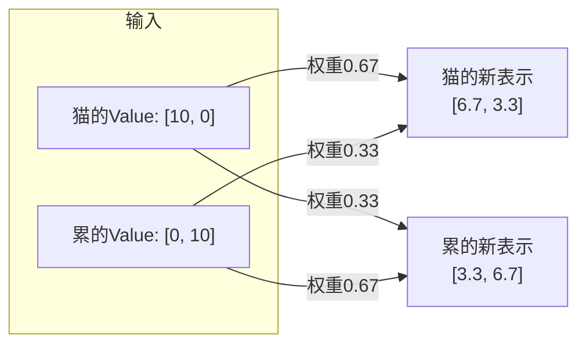

> 🛠️ **动手小练习**:试着把权重改成极端的 `[0.99, 0.01]`,重新算 output。你会发现输出几乎等于"猫"自己的 Value——这说明**权重越集中,输出就越偏向被高度关注的那个词**。

---

## 3.5 为什么要除以 √dₖ(缩放的意义)

这是初学者最容易忽略、但面试常考的一个点。我们把它讲得比原来更透。

### 3.5.1 问题:点积会随维度变大而"爆炸"

Q 和 K 都是向量,维度记作 $d_k$(比如 64、512)。点积是把对应元素相乘再相加:

$$
q \cdot k = q_1 k_1 + q_2 k_2 + \dots + q_{d_k} k_{d_k}
$$

维度 $d_k$ 越大,相加的项就越多,**总和的数值范围也就越大**。

**用统计学的语言说清楚**:假设 $q$ 和 $k$ 的每个分量都是均值 0、方差 1 的独立随机数。那么:

- 每一项 $q_i k_i$ 的方差约为 1。
- 求和后,总的方差 ≈ $d_k$(方差可加)。
- 所以标准差 ≈ $\sqrt{d_k}$。

也就是说,如果 $d_k = 64$,点积的典型波动范围就在 $\pm 8$ 左右;如果 $d_k = 512$,波动范围就到 $\pm 22$ 了。维度越大,分数越"疯"。

### 3.5.2 数值太大会怎样?Softmax 会"死掉"

Softmax 有个脾气:**输入数值差距过大时,它的输出会极度"两极分化"**,几乎变成 0 或 1。

举个例子对比一下(假设两个分数):

- 分数是 `[2, 4]` → softmax ≈ `[0.12, 0.88]`(还算平滑)
- 分数是 `[20, 40]` → softmax ≈ `[0.000000002, 0.999999998]`(几乎变成 0 和 1)

我们用一张图直观感受"分数放大"如何让分布变尖锐:

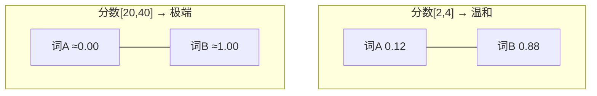

当输出几乎全是 0 和 1 时,会带来两个坏处:

1. **信息丢失**:模型只死盯一个词,完全忽略其他词,退化成"硬性选择",失去了"柔和加权"的优势。
2. **梯度消失**:在 0 和 1 附近,Softmax 的梯度趋近于 0,反向传播时几乎学不动,训练变得极慢甚至停滞。

> ⚠️ **梯度消失的直觉**:Softmax 输出一旦"饱和"到 0 或 1,就像一个开关被推到了尽头,你再怎么推(调整参数),它几乎不动了。模型也就学不到东西了。

### 3.5.3 解决办法:除以 √dₖ 把方差"拉回来"

既然点积的标准差大约是 $\sqrt{d_k}$ 量级,那我们就除以 $\sqrt{d_k}$,把分数的方差重新拉回到 1 附近,让 Softmax 工作在"温和平滑"的区间。

$$
\text{方差}\left(\frac{q \cdot k}{\sqrt{d_k}}\right) = \frac{d_k}{(\sqrt{d_k})^2} = \frac{d_k}{d_k} = 1
$$

漂亮!除以 $\sqrt{d_k}$ 后,方差稳稳地回到了 1,和维度无关了。

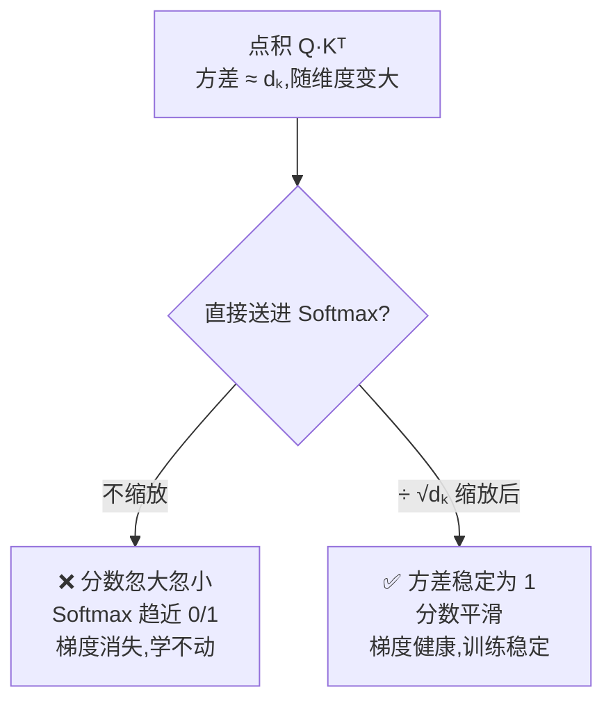

> 💡 **一句话总结**:除以 $\sqrt{d_k}$ 是为了**稳住数值规模**(把方差从 $d_k$ 拉回 1),让 Softmax 不至于走极端,从而保证梯度健康、训练稳定。这就是"缩放(Scaled)"这个名字的由来。

---

## 3.6 三个常见误区

学到这里,我们停下来澄清几个新手常踩的坑。

### 误区一:"注意力就是找最相似的那个词"

**不完全对。** 注意力不是"非黑即白"地选一个词,而是给**所有**词都分配一个权重(加起来为 1)。它是"柔性加权",不是"硬性选择"。哪怕某个词权重只有 5%,它的信息也参与了最终的混合。

### 误区二:"Q、K、V 是三个不同的东西"

**在自注意力里,它们其实来自同一批词。** 只是同一个词向量经过三个不同矩阵变换,扮演了三种角色。别把它们想成三份独立的数据。

### 误区三:"softmax 是对整个矩阵做的"

**不是。** Softmax 是对注意力分数矩阵的**每一行**单独做归一化。因为每一行代表"一个 Query 词对所有 Key 词的关注分配",这一行自己加起来该等于 1。行与行之间互不影响。

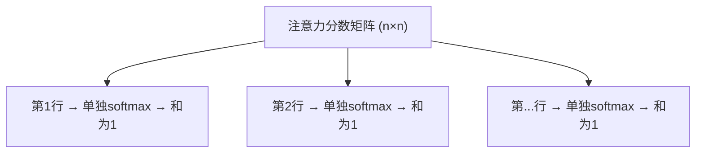

> 💡 **验证技巧**:在代码里 `F.softmax(scores, dim=-1)` 的 `dim=-1` 就是指"对最后一维(每一行)做归一化"。记住这个 `dim=-1`,面试和调试都用得上。

---

## 3.7 动手写代码:用 PyTorch 实现缩放点积注意力

理论讲完了,我们把它变成能跑的代码。你会惊讶于——**核心逻辑其实只有几行**。

```python
import torch
import torch.nn.functional as F
import math


def scaled_dot_product_attention(Q, K, V, mask=None):
    """
    缩放点积注意力

    参数形状说明(batch 版本):
        Q: (batch, seq_len_q, d_k)   查询
        K: (batch, seq_len_k, d_k)   键
        V: (batch, seq_len_k, d_v)   值
        mask: 可选,用来屏蔽某些位置(第 6 章会详细讲)

    返回:
        output:  (batch, seq_len_q, d_v)  注意力输出
        weights: (batch, seq_len_q, seq_len_k)  注意力权重(可用于可视化)
    """
    d_k = Q.size(-1)

    # 步骤 1:算匹配度 —— Q 和 K 做点积
    # K.transpose(-2, -1) 把最后两维转置,才能做矩阵乘法
    scores = torch.matmul(Q, K.transpose(-2, -1))   # (batch, seq_len_q, seq_len_k)

    # 步骤 2:缩放 —— 除以 √dₖ,稳住数值规模
    scores = scores / math.sqrt(d_k)

    # (可选)掩码:把不该关注的位置设成极小的负数,softmax 后趋近于 0
    if mask is not None:
        scores = scores.masked_fill(mask == 0, float('-inf'))

    # 步骤 3:归一化 —— softmax 变成加起来为 1 的权重(dim=-1 表示对每一行)
    weights = F.softmax(scores, dim=-1)             # (batch, seq_len_q, seq_len_k)

    # 步骤 4:加权求和 —— 权重乘以 V
    output = torch.matmul(weights, V)               # (batch, seq_len_q, d_v)

    return output, weights
```

### 示例 1:最小示例,验证四个步骤

```python
# 假设:batch=1,句子有 3 个词,每个 Q/K/V 向量维度为 4
torch.manual_seed(0)
Q = torch.randn(1, 3, 4)
K = torch.randn(1, 3, 4)
V = torch.randn(1, 3, 4)

output, weights = scaled_dot_product_attention(Q, K, V)

print("注意力权重(每一行加起来应为 1):")
print(weights)
print("\n每行之和:", weights.sum(dim=-1))   # 应该都接近 1.0
print("\n输出形状:", output.shape)           # torch.Size([1, 3, 4])
```

运行后你会看到:每一行权重加起来都是 1.0,输出形状和 V 一致。这就完整验证了 3.3 节的四个步骤。

### 示例 2:用代码复现 3.4 节的手算

我们把手算的例子喂进代码,看看是不是对得上:

```python
# 复现 3.4 节:2 个词,d_k=2
Q = torch.tensor([[[1., 0.], [0., 1.]]])
K = torch.tensor([[[1., 0.], [0., 1.]]])
V = torch.tensor([[[10., 0.], [0., 10.]]])

output, weights = scaled_dot_product_attention(Q, K, V)
print("权重矩阵:\n", weights)
# 约等于 [[0.67, 0.33], [0.33, 0.67]] —— 和手算一致!
print("输出:\n", output)
# 约等于 [[6.7, 3.3], [3.3, 6.7]] —— 和手算一致!
```

跑出来的数字应该和我们 3.4 节纸笔算的**几乎完全一致**。亲手验证一次,理论就真正变成了你自己的。

### 示例 3:可视化注意力权重

注意力权重矩阵可以画成热力图,直观看到"谁在关注谁":

```python
import matplotlib.pyplot as plt

tokens = ["小明", "把", "水", "倒进", "杯子", "它", "满了"]
torch.manual_seed(1)
n = len(tokens)
Q = K = V = torch.randn(1, n, 8)
_, weights = scaled_dot_product_attention(Q, K, V)

plt.figure(figsize=(6, 5))
plt.imshow(weights[0].detach(), cmap="Blues")
plt.xticks(range(n), tokens, rotation=45)
plt.yticks(range(n), tokens)
plt.xlabel("被关注的词 (Key)")
plt.ylabel("发出关注的词 (Query)")
plt.colorbar(label="注意力权重")
plt.title("注意力权重热力图")
plt.tight_layout()
plt.show()
```

在真实训练好的模型里,你会看到"它"那一行在"杯子"那一列颜色最深——模型学会了指代关系。

> 🛠️ **动手小练习**:把示例 1 里的 `d_k` 从 4 改成 512,分别打印**缩放前和缩放后**的 `scores`,亲眼观察缩放对数值范围的影响——这能帮你彻底理解 3.5 节。

---

## 3.8 本章小结

用几句话回顾这一章最重要的东西:

- 注意力机制的本质:**处理一个词时,自动决定该更多参考句子里的哪些词**,并做**柔性加权**(不是硬性选一个)。
- 三要素:**Query(我要找什么)、Key(每个词的标签)、Value(每个词的内容)**,它们都由词向量经过不同矩阵变换得到;Key 负责"被找到",Value 负责"被取走"。
- 缩放点积注意力的四步:**① 点积算匹配度 → ② 除以 √dₖ 缩放 → ③ Softmax 变权重 → ④ 加权求和**。
- 那个 $n \times n$ 的分数矩阵是注意力的灵魂,记录了每个词对每个词的关注度。
- 除以 $\sqrt{d_k}$ 是为了把点积方差从 $d_k$ 拉回 1,**防止 Softmax 两极分化、梯度消失**,让训练更稳定。
- 核心代码其实只有几行,记住那四步就能默写出来。

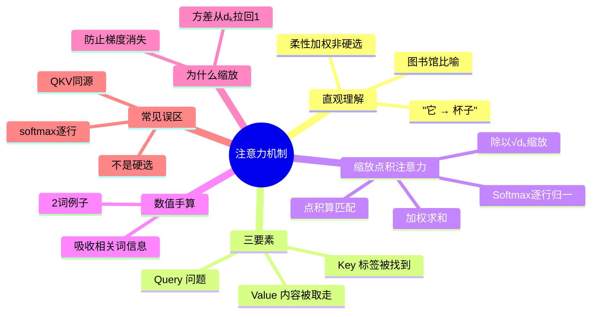

### 承上启下

现在你已经掌握了**单个**注意力是怎么工作的,甚至能自己手算一遍。但你可能会想:一次只从"一个角度"关注句子,会不会太片面?

没错——真实的 Transformer 会同时从**多个不同角度**去关注(比如一个角度看语法关系,一个角度看语义指代)。这就是下一章要讲的 **多头注意力(Multi-Head Attention)**。

---

📖 **上一章**:第 2 章 必备数学与基础知识 ｜ **下一章**:第 4 章 多头注意力(Multi-Head Attention)
