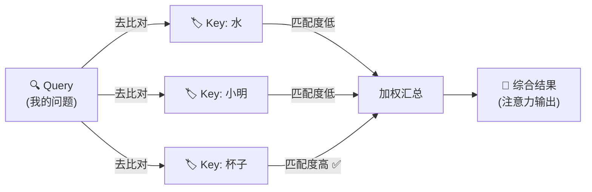
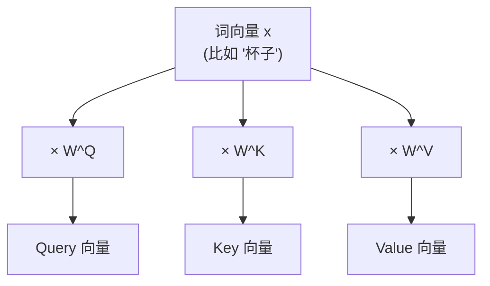
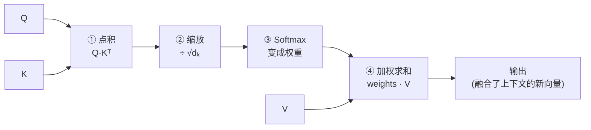
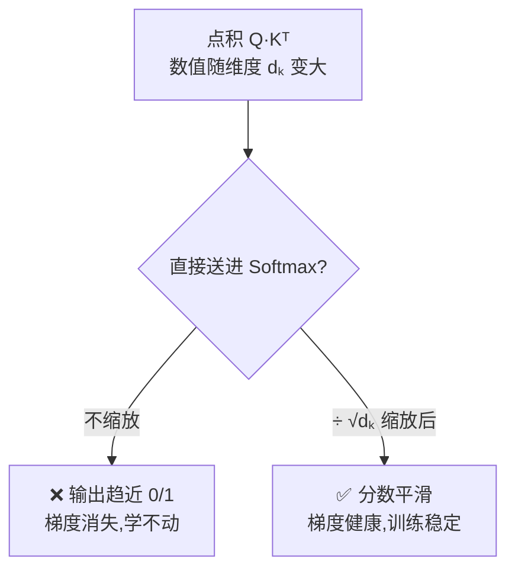
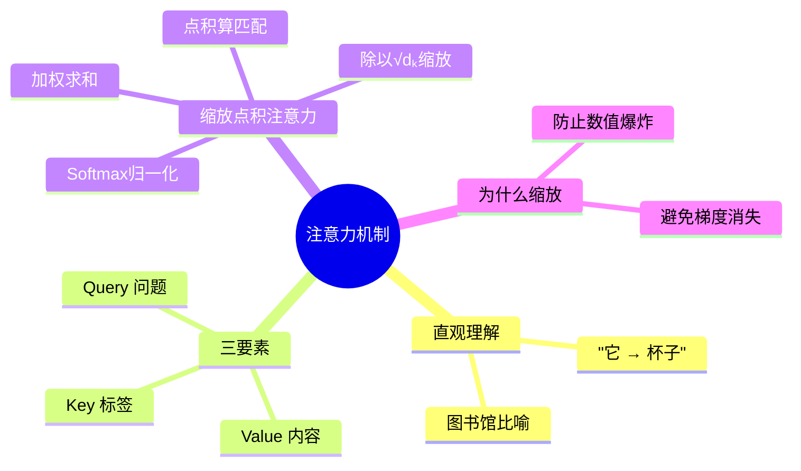

# 第 3 章 注意力机制(Attention)

> 本章是整个 Transformer 的心脏。只要真正搞懂了"注意力"这一个概念,后面的多头注意力、编码器、解码器都只是它的"排列组合"。所以我们会放慢脚步,用尽量多的比喻把它讲透。

---

## 3.1 直观理解:注意力到底在"注意"什么

### 3.1.1 从一个句子说起

请你读这句话:

> "小明把水倒进杯子里,直到**它**满了。"

问题来了:这里的"**它**"指的是什么?

你几乎不假思索就知道——是"**杯子**",而不是"小明",也不是"水"。

你的大脑其实做了一件事:在理解"它"这个词的时候,你把**注意力**重点放在了"杯子"上,而对句子里其他词的关注则少一些。

这就是注意力机制想模仿的东西:

> **在处理某一个词时,自动判断"应该更多地参考句子里的哪些词",并给它们分配不同的"关注度"。**

### 3.1.2 一个更生活化的比喻:图书馆查资料

想象你走进一座图书馆,要写一篇关于"杯子"的报告:

- 你心里带着一个**问题(Query)**:"我想找和杯子有关的内容"。
- 图书馆每本书都贴着一个**标签(Key)**:比如"水""小明""杯子""容器"……
- 每本书里有真正的**内容(Value)**。

你的做法是:

1. 拿你的问题,去和每本书的标签比对,看看**哪本书标签最匹配**。
2. 匹配度高的书,你多看几眼(高权重);匹配度低的,你随便瞄一下(低权重)。
3. 最后,你把所有书的内容**按匹配度加权综合**起来,写成报告。

注意力机制干的就是这件事。记住这三个关键词,后面反复会用到:

| 术语 | 英文 | 图书馆比喻 | 一句话解释 |
|------|------|-----------|-----------|
| 查询 | Query (Q) | 你手上的问题 | "我现在想找什么" |
| 键 | Key (K) | 每本书的标签 | "每个词能提供什么线索" |
| 值 | Value (V) | 每本书的内容 | "每个词实际携带的信息" |



---

## 3.2 Query、Key、Value 三要素

### 3.2.1 它们从哪来?

你可能会问:句子里明明只有一堆词,哪来的 Q、K、V?

答案是:**它们都是由词向量"变身"而来的**。

每个词先被转成一个向量(词嵌入,第 2 章讲过)。然后我们用三个不同的"变换矩阵" $W^Q$、$W^K$、$W^V$,分别把同一个词向量变成三个不同的角色:

$$
Q = x \cdot W^Q, \quad K = x \cdot W^K, \quad V = x \cdot W^V
$$

**人话翻译**:同一个词 $x$,戴上三顶不同的"帽子",就分别扮演了"提问者""被检索的标签""实际内容"三种身份。这三个矩阵 $W^Q, W^K, W^V$ 是模型**训练时学出来的**。



> 💡 **小提示**:为什么要拆成三个而不是直接用原向量?因为"我想找什么(Q)"、"我能被找到的特征(K)"、"我真正提供的信息(V)"本来就是三件不同的事,分开学习模型更灵活。

### 3.2.2 自注意力(Self-Attention)

当 Q、K、V 全都来自**同一个句子**时,这种注意力叫**自注意力(Self-Attention)**——句子在"自己关注自己",从而理解词与词之间的关系(比如前面"它→杯子"的例子)。Transformer 的核心用的就是自注意力。

---

## 3.3 缩放点积注意力(Scaled Dot-Product Attention)公式推导

这是 Transformer 里注意力的正式名字。别被名字吓到,我们一步步拆。

完整公式长这样:

$$
\text{Attention}(Q, K, V) = \text{softmax}\left(\frac{Q K^T}{\sqrt{d_k}}\right) V
$$

我们把它拆成 **4 个动作**,逐个用大白话讲。

### 步骤 1:算匹配度(Q 和 K 做点积)

$$
\text{scores} = Q K^T
$$

**点积**衡量两个向量有多"像"——方向越一致,点积越大。所以 $QK^T$ 就是在算:**每个 Query 和每个 Key 到底有多匹配**。

结果是一张"匹配度表格"(注意力分数矩阵)。假设句子有 3 个词:

|          | Key:水 | Key:小明 | Key:杯子 |
|----------|--------|---------|---------|
| **Q:它** | 0.2    | 0.1     | 0.9     |

可以看到"它"和"杯子"的分数最高(0.9)。

### 步骤 2:缩放(除以 $\sqrt{d_k}$)

$$
\frac{\text{scores}}{\sqrt{d_k}}
$$

这一步是把上面的分数**整体缩小**。为什么要缩小?下一节 3.4 专门解释,这里先记住"防止数值太大"。

### 步骤 3:归一化(Softmax)

$$
\text{weights} = \text{softmax}\left(\frac{QK^T}{\sqrt{d_k}}\right)
$$

Softmax 把一行分数变成**加起来等于 1 的概率**,也就是真正的"关注度权重":

|          | 水    | 小明  | 杯子  | 合计 |
|----------|-------|-------|-------|------|
| **它**   | 0.20  | 0.15  | 0.65  | 1.0  |

**人话翻译**:处理"它"这个词时,把 65% 的注意力给"杯子",20% 给"水",15% 给"小明"。

### 步骤 4:加权求和(乘以 V)

$$
\text{output} = \text{weights} \cdot V
$$

拿上面这组权重,去对每个词的 **Value** 做加权平均。关注度高的词,它的内容在结果里占比就大。

最终"它"这个位置得到的新向量,就**融合了大量"杯子"的信息**——模型因此"知道"了它指代杯子。

### 全流程图解



---

## 3.4 为什么要除以 √dₖ(缩放的意义)

这是初学者最容易忽略、但面试常考的一个点。我们把它讲清楚。

### 3.4.1 问题:点积会随维度变大而"爆炸"

Q 和 K 都是向量,维度记作 $d_k$(比如 64、512)。点积是把对应元素相乘再相加:

$$
q \cdot k = q_1 k_1 + q_2 k_2 + \dots + q_{d_k} k_{d_k}
$$

维度 $d_k$ 越大,相加的项就越多,**总和的数值范围也就越大**。可以粗略地理解为:方差随 $d_k$ 线性增长,标准差就是 $\sqrt{d_k}$ 量级。

### 3.4.2 数值太大会怎样?Softmax 会"死掉"

Softmax 有个脾气:**输入数值差距过大时,它的输出会极度"两极分化"**,几乎变成 0 或 1。

举个例子对比一下(假设两个分数):

- 分数是 `[2, 4]` → softmax ≈ `[0.12, 0.88]`(还算平滑)
- 分数是 `[20, 40]` → softmax ≈ `[0.000000002, 0.999999998]`(几乎变成 0 和 1)

当输出几乎全是 0 和 1 时,会带来两个坏处:

1. **信息丢失**:模型只死盯一个词,完全忽略其他词。
2. **梯度消失**:在 0 和 1 附近,Softmax 的梯度趋近于 0,反向传播时几乎学不动,训练变得极慢甚至停滞。

### 3.4.3 解决办法:除以 √dₖ 把方差"拉回来"

既然点积的标准差大约是 $\sqrt{d_k}$ 量级,那我们就除以 $\sqrt{d_k}$,把分数的方差重新拉回到 1 附近,让 Softmax 工作在"温和平滑"的区间。



> 💡 **一句话总结**:除以 $\sqrt{d_k}$ 是为了**稳住数值规模**,让 Softmax 不至于走极端,从而保证梯度健康、训练稳定。这就是"缩放(Scaled)"这个名字的由来。

---

## 3.5 动手写代码:用 PyTorch 实现缩放点积注意力

理论讲完了,我们把它变成能跑的代码。你会惊讶于——**核心逻辑其实只有几行**。

```python
import torch
import torch.nn.functional as F
import math


def scaled_dot_product_attention(Q, K, V, mask=None):
    """
    缩放点积注意力

    参数形状说明(batch 版本):
        Q: (batch, seq_len_q, d_k)   查询
        K: (batch, seq_len_k, d_k)   键
        V: (batch, seq_len_k, d_v)   值
        mask: 可选,用来屏蔽某些位置(第 6 章会详细讲)

    返回:
        output:  (batch, seq_len_q, d_v)  注意力输出
        weights: (batch, seq_len_q, seq_len_k)  注意力权重(可用于可视化)
    """
    d_k = Q.size(-1)

    # 步骤 1:算匹配度 —— Q 和 K 做点积
    # K.transpose(-2, -1) 把最后两维转置,才能做矩阵乘法
    scores = torch.matmul(Q, K.transpose(-2, -1))   # (batch, seq_len_q, seq_len_k)

    # 步骤 2:缩放 —— 除以 √dₖ,稳住数值规模
    scores = scores / math.sqrt(d_k)

    # (可选)掩码:把不该关注的位置设成极小的负数,softmax 后趋近于 0
    if mask is not None:
        scores = scores.masked_fill(mask == 0, float('-inf'))

    # 步骤 3:归一化 —— softmax 变成加起来为 1 的权重
    weights = F.softmax(scores, dim=-1)             # (batch, seq_len_q, seq_len_k)

    # 步骤 4:加权求和 —— 权重乘以 V
    output = torch.matmul(weights, V)               # (batch, seq_len_q, d_v)

    return output, weights
```

### 跑一个最小示例

```python
# 假设:batch=1,句子有 3 个词,每个 Q/K/V 向量维度为 4
torch.manual_seed(0)
Q = torch.randn(1, 3, 4)
K = torch.randn(1, 3, 4)
V = torch.randn(1, 3, 4)

output, weights = scaled_dot_product_attention(Q, K, V)

print("注意力权重(每一行加起来应为 1):")
print(weights)
print("\n每行之和:", weights.sum(dim=-1))   # 应该都接近 1.0
print("\n输出形状:", output.shape)           # torch.Size([1, 3, 4])
```

运行后你会看到:每一行权重加起来都是 1.0,输出形状和 V 一致。这就完整验证了 3.3 节的四个步骤。

> 🛠️ **动手小练习**:把上面代码里的 `d_k` 从 4 改成 512,分别打印**缩放前和缩放后**的 `scores`,亲眼观察缩放对数值范围的影响——这能帮你彻底理解 3.4 节。

---

## 3.6 本章小结

用几句话回顾这一章最重要的东西:

- 注意力机制的本质:**处理一个词时,自动决定该更多参考句子里的哪些词**。
- 三要素:**Query(我要找什么)、Key(每个词的标签)、Value(每个词的内容)**,它们都由词向量经过不同矩阵变换得到。
- 缩放点积注意力的四步:**① 点积算匹配度 → ② 除以 √dₖ 缩放 → ③ Softmax 变权重 → ④ 加权求和**。
- 除以 $\sqrt{d_k}$ 是为了**防止数值过大导致 Softmax 两极分化、梯度消失**,让训练更稳定。
- 核心代码其实只有几行,记住那四步就能默写出来。



### 承上启下

现在你已经掌握了**单个**注意力是怎么工作的。但你可能会想:一次只从"一个角度"关注句子,会不会太片面?

没错——真实的 Transformer 会同时从**多个不同角度**去关注(比如一个角度看语法关系,一个角度看语义指代)。这就是下一章要讲的 **多头注意力(Multi-Head Attention)**。

---

📖 **上一章**:第 2 章 必备数学与基础知识 ｜ **下一章**:第 4 章 多头注意力(Multi-Head Attention)
