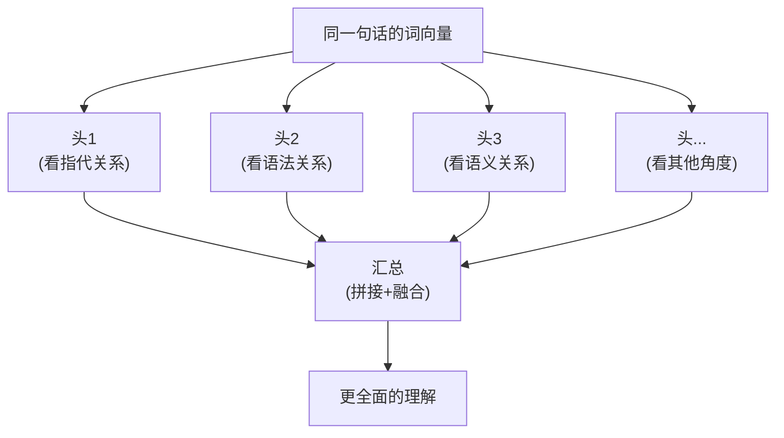
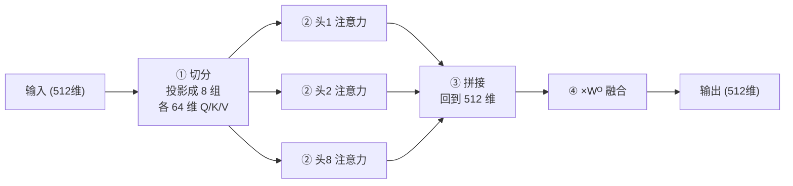
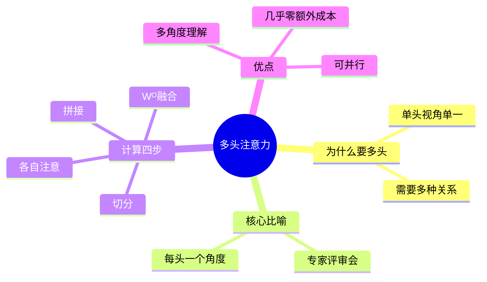

# 第 4 章 多头注意力(Multi-Head Attention)

> 第 3 章我们搞懂了"一个"注意力怎么工作。这一章要解决一个很自然的疑问:只用一次注意力,是不是太"单一视角"了?多头注意力就是答案——让模型同时用**多个脑袋**从不同角度理解句子。

---

## 4.1 单头的局限:一次只能"看一个角度"

回顾第 3 章:一次注意力计算,会为每个词算出一组关注权重,决定它"该参考哪些词"。

但这里有个隐患:**一套 Q、K、V 只能捕捉一种关系**。

看这个句子:

> "那只**猫**因为太累了,所以**它**没有去抓那只**老鼠**。"

理解"它"时,模型可能需要同时关注好几种不同的关系:

- **指代关系**:"它" 指的是 "猫"。
- **语法关系**:"它" 是 "没有去抓" 这个动作的主语。
- **语义关系**:"它" 和 "老鼠" 之间是"抓与被抓"的潜在联系。

如果只用一次注意力,模型就得把这些不同角度的信息**全挤进一套权重里**,难免顾此失彼,像"一心多用却样样没做好"。

> 💡 **一句话点破**:单头注意力的问题,是**信息视角太单一**,难以同时兼顾多种不同类型的关系。

---

## 4.2 多头的设计思想:请多个"专家"分头看

多头注意力的思路特别符合直觉:**既然一个脑袋顾不过来,那就多请几个脑袋,每个脑袋专注一个角度,最后开个会把结论汇总。**

**比喻:公司的专家评审会**

一份合同交给一个人审,容易漏。聪明的公司会分头请几位专家:

- 法务专家只看**法律风险**;
- 财务专家只看**金额条款**;
- 业务专家只看**交付细节**。

每个人从自己的专业角度独立审一遍,最后汇总成一份完整意见。这样既全面又高效。

多头注意力里的每个"头(Head)",就是这样一位专家——它有**自己独立的一套 $W^Q, W^K, W^V$ 矩阵**,因此会从自己独特的角度去关注句子。



---

## 4.3 多头是怎么算的:切分 → 各自注意 → 拼接 → 融合

多头注意力的完整流程分四步。我们用一个具体的数字例子来走一遍。

**设定**:词向量维度 $d_{model} = 512$,头数 $h = 8$。

### 步骤 1:切分成多个低维子空间

不是把完整的 512 维向量复制 8 份给 8 个头(那样太浪费),而是**把 512 维切成 8 份,每份 64 维**,一个头分一份。

$$
d_k = \frac{d_{model}}{h} = \frac{512}{8} = 64
$$

每个头通过自己的 $W^Q_i, W^K_i, W^V_i$ 矩阵,得到属于自己的 64 维 Q、K、V。

**比喻**:把一份 512 页的大报告,拆成 8 个章节,分给 8 位专家,每人负责 64 页。

### 步骤 2:每个头独立做注意力

每个头拿着自己的 64 维 Q、K、V,**各自独立**地做一遍第 3 章的缩放点积注意力:

$$
\text{head}_i = \text{Attention}(Q_i, K_i, V_i) = \text{softmax}\left(\frac{Q_i K_i^T}{\sqrt{d_k}}\right) V_i
$$

8 个头之间互不干扰,可以**完全并行**计算。每个头输出一个 64 维的结果。

### 步骤 3:拼接(Concat)

把 8 个头各自的 64 维输出,**首尾拼接**回一个完整的 512 维向量:

$$
\text{Concat}(\text{head}_1, \text{head}_2, \dots, \text{head}_8) \quad (8 \times 64 = 512)
$$

**比喻**:8 位专家审完各自的章节,把意见按顺序装订回一整本报告。

### 步骤 4:线性变换融合(乘以 $W^O$)

拼接只是把 8 份结果"摆"在一起,它们还没有真正"交流融合"。所以最后再乘一个输出矩阵 $W^O$,把这些视角**混合、提炼**成最终输出:

$$
\text{MultiHead}(Q,K,V) = \text{Concat}(\text{head}_1, \dots, \text{head}_h) \, W^O
$$

**比喻**:主编把 8 份章节意见通读一遍,融会贯通后写出一份统一的终审结论。

### 全流程图解



> 💡 **一个巧妙之处**:切分成 8 个 64 维的头,总计算量和"1 个 512 维的头"其实差不多。也就是说,**多头几乎没有增加成本,却换来了多角度理解的能力**,非常划算。

---

## 4.4 动手写代码:用 PyTorch 实现多头注意力

我们复用第 3 章的 `scaled_dot_product_attention`,在它外面套一层"多头"逻辑。

```python
import torch
import torch.nn as nn
import math


def scaled_dot_product_attention(Q, K, V, mask=None):
    """第 3 章实现的缩放点积注意力"""
    d_k = Q.size(-1)
    scores = torch.matmul(Q, K.transpose(-2, -1)) / math.sqrt(d_k)
    if mask is not None:
        scores = scores.masked_fill(mask == 0, float('-inf'))
    weights = torch.softmax(scores, dim=-1)
    output = torch.matmul(weights, V)
    return output, weights


class MultiHeadAttention(nn.Module):
    def __init__(self, d_model=512, num_heads=8):
        super().__init__()
        assert d_model % num_heads == 0, "d_model 必须能被 num_heads 整除"

        self.d_model = d_model
        self.num_heads = num_heads
        self.d_k = d_model // num_heads   # 每个头的维度,如 512/8 = 64

        # 四个线性变换矩阵:三个用于生成 Q/K/V,一个用于最后融合
        self.W_q = nn.Linear(d_model, d_model)
        self.W_k = nn.Linear(d_model, d_model)
        self.W_v = nn.Linear(d_model, d_model)
        self.W_o = nn.Linear(d_model, d_model)

    def split_heads(self, x, batch_size):
        """把 (batch, seq_len, d_model) 切分成 (batch, num_heads, seq_len, d_k)"""
        x = x.view(batch_size, -1, self.num_heads, self.d_k)
        return x.transpose(1, 2)   # 把 num_heads 维提前,便于并行计算

    def forward(self, query, key, value, mask=None):
        batch_size = query.size(0)

        # 步骤 1:线性投影 + 切分成多个头
        Q = self.split_heads(self.W_q(query), batch_size)
        K = self.split_heads(self.W_k(key), batch_size)
        V = self.split_heads(self.W_v(value), batch_size)

        # 步骤 2:每个头独立做注意力(一次矩阵运算即可覆盖所有头)
        attn_output, attn_weights = scaled_dot_product_attention(Q, K, V, mask)

        # 步骤 3:拼接 —— 把多个头的结果合回 d_model 维
        attn_output = attn_output.transpose(1, 2).contiguous()
        attn_output = attn_output.view(batch_size, -1, self.d_model)

        # 步骤 4:最后一层线性变换,融合各头信息
        output = self.W_o(attn_output)
        return output, attn_weights
```

### 跑一个最小示例

```python
torch.manual_seed(0)
mha = MultiHeadAttention(d_model=512, num_heads=8)

# batch=2,句子长度=10,每个词 512 维
x = torch.randn(2, 10, 512)

# 自注意力:query、key、value 都来自同一个 x
output, weights = mha(x, x, x)

print("输出形状:", output.shape)          # torch.Size([2, 10, 512]),和输入一致
print("注意力权重形状:", weights.shape)   # torch.Size([2, 8, 10, 10]),8 个头各一张关系图
```

运行结果里,`weights` 的形状 `[2, 8, 10, 10]` 特别有意思:中间的 **8** 就是 8 个头,每个头都得到一张 10×10 的"词与词关系图"——这正是"8 位专家各看一遍"的体现。

> 🛠️ **动手小练习**:把 `num_heads` 改成 1(单头),再改成 16,观察 `weights` 形状的变化,体会"头数"这个超参数的含义。

---

## 4.5 本章小结

- **单头注意力**视角单一,难以同时捕捉指代、语法、语义等多种关系。
- **多头注意力**像一场"专家评审会":每个头有独立的 $W^Q, W^K, W^V$,从不同角度关注句子。
- 计算四步:**① 切分成多个低维头 → ② 各头独立做注意力 → ③ 拼接 → ④ 乘 $W^O$ 融合**。
- 切分设计让**多头几乎不增加计算量**,却大幅提升了模型的表达能力,非常划算。



### 承上启下

到这里,注意力这条主线已经完整了。但你可能注意到一个问题:注意力计算里,**词与词之间是"平等相连"的,并不知道谁在前、谁在后**。可"我打你"和"你打我"顺序至关重要!那么 Transformer 是怎么知道词的位置的?这就是下一章 **位置编码** 要解决的问题。

---

📖 **上一章**:第 3 章 注意力机制 ｜ **下一章**:第 5 章 位置编码
