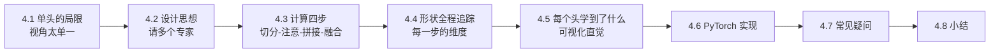
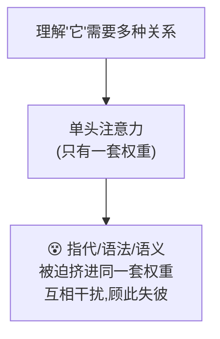
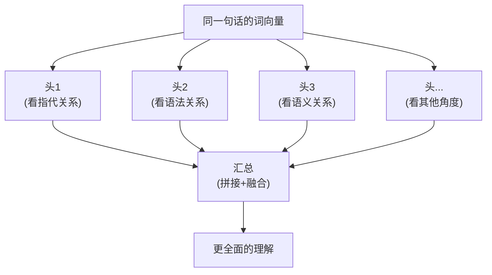
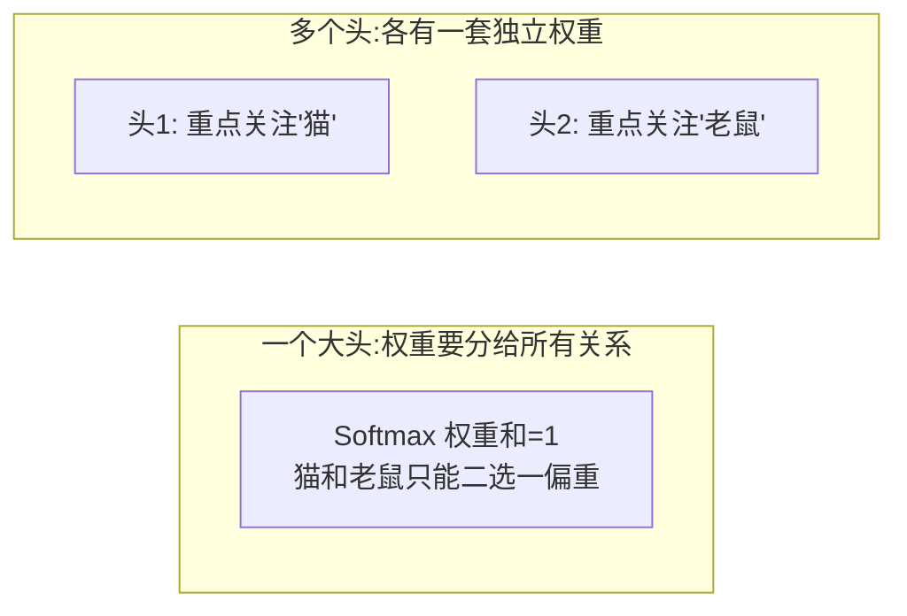
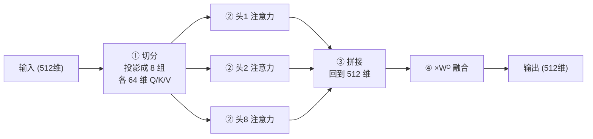
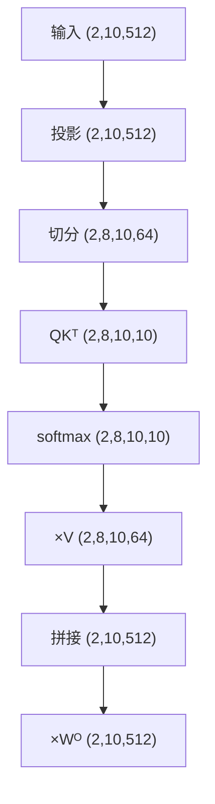
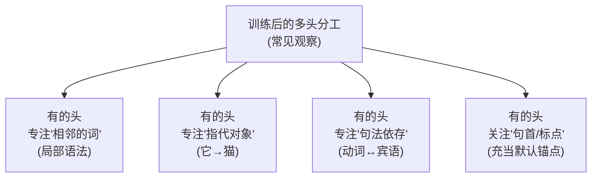
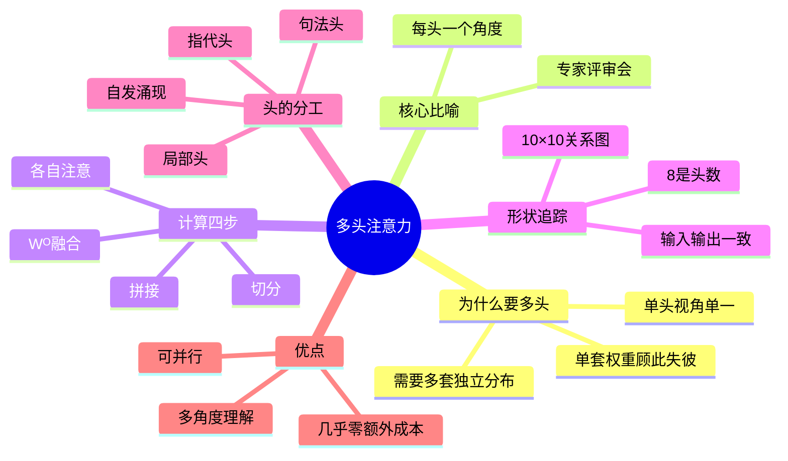

# 第 4 章 多头注意力(Multi-Head Attention)

> 第 3 章我们搞懂了"一个"注意力怎么工作,甚至能手算一遍。这一章要解决一个很自然的疑问:只用一次注意力,是不是太"单一视角"了?多头注意力就是答案——让模型同时用**多个脑袋**从不同角度理解句子。
>
> 📌 本章会用大量图解和形状追踪,带你彻底看清"多头"到底是怎么切、怎么算、怎么合的。

---

## 4.0 本章导览



一句话预告:

> **多头注意力 = 把注意力"复制"成多份,每份在一个更小的子空间里从不同角度看句子,最后把多份结果拼起来融合。**

---

## 4.1 单头的局限:一次只能"看一个角度"

回顾第 3 章:一次注意力计算,会为每个词算出一组关注权重,决定它"该参考哪些词"。

但这里有个隐患:**一套 Q、K、V 只能捕捉一种关系模式**。

看这个句子:

> "那只**猫**因为太累了,所以**它**没有去抓那只**老鼠**。"

理解"它"时,模型可能需要同时关注好几种不同的关系:

- **指代关系**:"它" 指的是 "猫"。
- **语法关系**:"它" 是 "没有去抓" 这个动作的主语。
- **语义关系**:"它" 和 "老鼠" 之间是"抓与被抓"的潜在联系。

如果只用一次注意力,模型就得把这些不同角度的信息**全挤进一套权重里**,难免顾此失彼,像"一心多用却样样没做好"。

### 4.1.1 用一张图看清"单头的挤压"



**一个类比**:让一个人同时兼任翻译、速记、点评三份工作,他必然手忙脚乱、样样打折扣。术业有专攻,不如各请一位。

> 💡 **一句话点破**:单头注意力的问题,是**信息视角太单一**,难以同时兼顾多种不同类型的关系。

---

## 4.2 多头的设计思想:请多个"专家"分头看

多头注意力的思路特别符合直觉:**既然一个脑袋顾不过来,那就多请几个脑袋,每个脑袋专注一个角度,最后开个会把结论汇总。**

### 4.2.1 核心比喻:公司的专家评审会

一份合同交给一个人审,容易漏。聪明的公司会分头请几位专家:

- 法务专家只看**法律风险**;
- 财务专家只看**金额条款**;
- 业务专家只看**交付细节**。

每个人从自己的专业角度独立审一遍,最后汇总成一份完整意见。这样既全面又高效。

多头注意力里的每个"头(Head)",就是这样一位专家——它有**自己独立的一套 $W^Q, W^K, W^V$ 矩阵**,因此会从自己独特的角度去关注句子。



### 4.2.2 为什么"多个头"比"一个大头"好

你可能会问:那我把单头做得更大(维度更高),不也能学更多东西吗?

关键区别在于 **Softmax 的"平均化"效应**。单头注意力最后只产生**一套**权重分布,Softmax 会倾向于把注意力集中到少数几个词上。它很难在"同一套权重"里既高度关注"猫"(指代)又高度关注"老鼠"(语义)——因为权重加起来只有 1,顾此就会失彼。

多头则让每个头**各自拥有一套独立的 Softmax 权重**:头 1 可以把注意力砸在"猫"上,头 2 同时把注意力砸在"老鼠"上,互不抢占。这才是多头真正的威力。



> 💡 **深层原因**:多头的价值不只是"维度大",而是提供了**多套相互独立的注意力分布**,让模型能同时聚焦多个不同的词/关系。

---

## 4.3 多头是怎么算的:切分 → 各自注意 → 拼接 → 融合

多头注意力的完整流程分四步。我们用一个具体的数字例子来走一遍。

**设定**:词向量维度 $d_{model} = 512$,头数 $h = 8$。

### 步骤 1:切分成多个低维子空间

不是把完整的 512 维向量复制 8 份给 8 个头(那样太浪费),而是**把 512 维切成 8 份,每份 64 维**,一个头分一份。

$$
d_k = \frac{d_{model}}{h} = \frac{512}{8} = 64
$$

每个头通过自己的 $W^Q_i, W^K_i, W^V_i$ 矩阵,得到属于自己的 64 维 Q、K、V。

**比喻**:把一份 512 页的大报告,拆成 8 个章节,分给 8 位专家,每人负责 64 页。

> 📌 **实现上的小细节**:代码里通常不真的建 8 组小矩阵,而是用**一个大的** $W^Q$(512×512)一次性投影,再把结果"切"成 8 份。数学上等价,但计算更高效。4.6 节代码会看到这个技巧。

### 步骤 2:每个头独立做注意力

每个头拿着自己的 64 维 Q、K、V,**各自独立**地做一遍第 3 章的缩放点积注意力:

$$
\text{head}_i = \text{Attention}(Q_i, K_i, V_i) = \text{softmax}\left(\frac{Q_i K_i^T}{\sqrt{d_k}}\right) V_i
$$

8 个头之间互不干扰,可以**完全并行**计算。每个头输出一个 64 维的结果。

注意这里缩放用的是 $\sqrt{d_k} = \sqrt{64} = 8$(每个头的小维度),而不是 $\sqrt{512}$。这也是第 3 章缩放原理在多头里的自然延续。

### 步骤 3:拼接(Concat)

把 8 个头各自的 64 维输出,**首尾拼接**回一个完整的 512 维向量:

$$
\text{Concat}(\text{head}_1, \text{head}_2, \dots, \text{head}_8) \quad (8 \times 64 = 512)
$$

**比喻**:8 位专家审完各自的章节,把意见按顺序装订回一整本报告。

### 步骤 4:线性变换融合(乘以 $W^O$)

拼接只是把 8 份结果"摆"在一起,它们还没有真正"交流融合"。所以最后再乘一个输出矩阵 $W^O$,把这些视角**混合、提炼**成最终输出:

$$
\text{MultiHead}(Q,K,V) = \text{Concat}(\text{head}_1, \dots, \text{head}_h) \, W^O
$$

**比喻**:主编把 8 份章节意见通读一遍,融会贯通后写出一份统一的终审结论。

> 💡 **$W^O$ 为什么不可省**:拼接后的向量,前 64 维只含头 1 的信息、接下来 64 维只含头 2 的信息……它们之间是"物理拼接"但"信息隔离"的。$W^O$ 通过线性组合,让每一维输出都能综合所有头的信息,真正实现"融会贯通"。

### 全流程图解



---

## 4.4 形状全程追踪:每一步的维度到底是多少

初学者读多头代码最容易晕的就是"形状"。这一节我们像追踪快递一样,盯着一个批次的数据走完全程。

**设定**:batch = 2(一次处理 2 句话),seq_len = 10(每句 10 个词),$d_{model}$ = 512,$h$ = 8,$d_k$ = 64。

| 阶段 | 张量形状 | 说明 |
|------|----------|------|
| 输入 x | `(2, 10, 512)` | 2 句话,每句 10 词,每词 512 维 |
| 经过 $W^Q$ 投影 | `(2, 10, 512)` | 形状不变,只是做了线性变换 |
| 切分成多头 | `(2, 8, 10, 64)` | 512 拆成 8×64,并把"头"维提前 |
| $Q K^T$(每头) | `(2, 8, 10, 10)` | 每个头得到一张 10×10 的关系图 |
| softmax 后 | `(2, 8, 10, 10)` | 权重,每行和为 1 |
| 乘 V(每头) | `(2, 8, 10, 64)` | 每个头的输出,64 维 |
| 拼接(合并头) | `(2, 10, 512)` | 8×64 拼回 512 |
| 经过 $W^O$ | `(2, 10, 512)` | 最终输出,和输入形状一致 ✅ |



> 💡 **抓住两个不变量**:① 输入和输出形状**完全一致**(都是 `(2,10,512)`),这让多头注意力可以像积木一样层层堆叠。② 那个 `(2,8,10,10)` 里的 **8** 是头数,**10×10** 是词间关系图——记住这两点,再读任何多头代码都不会晕。

---

## 4.5 每个头到底学到了什么?

多头最迷人的地方在于:训练完成后,不同的头会**自发地**分工,各自专注不同类型的关系。研究者通过可视化真实模型的注意力权重,发现了一些有趣的现象。

### 4.5.1 头的"自发分工"(真实模型观察到的现象)



- **局部头**:主要关注自己前后相邻的一两个词,负责捕捉短语级别的搭配。
- **句法头**:把动词和它的主语/宾语连起来。
- **指代头**:把代词和它指代的名词连起来。
- **"偷懒"头**:有些头会习惯性地关注句首词或标点,像一个"默认停靠点"——这也是一种被观察到的真实现象。

### 4.5.2 一个可视化的想象

假设句子是"猫 累 了 它 睡 觉",两个不同的头可能给出完全不同的关注图:

```
头1(局部头):对角线附近深   头2(指代头):"它"→"猫" 那格深
      猫 累 了 它 睡 觉            猫 累 了 它 睡 觉
   猫 ■ ▓ ░ ░ ░ ░           猫 ░ ░ ░ ░ ░ ░
   累 ▓ ■ ▓ ░ ░ ░           累 ░ ░ ░ ░ ░ ░
   了 ░ ▓ ■ ▓ ░ ░           了 ░ ░ ░ ░ ░ ░
   它 ░ ░ ▓ ■ ▓ ░           它 ■ ░ ░ ░ ░ ░  ← 关注"猫"
   睡 ░ ░ ░ ▓ ■ ▓           睡 ░ ░ ░ ░ ░ ░
   觉 ░ ░ ░ ░ ▓ ■           觉 ░ ░ ░ ░ ░ ░
```

（■ 表示高关注,▓ 中等,░ 低）

> 💡 **重要提醒**:这种分工不是人为指定的,而是模型在训练中**自己学出来的**。我们没有告诉任何一个头"你负责指代",是数据和优化过程让它们自然分化。这正是深度学习"涌现"能力的一个缩影。

---

## 4.6 动手写代码:用 PyTorch 实现多头注意力

我们复用第 3 章的 `scaled_dot_product_attention`,在它外面套一层"多头"逻辑。

```python
import torch
import torch.nn as nn
import math


def scaled_dot_product_attention(Q, K, V, mask=None):
    """第 3 章实现的缩放点积注意力"""
    d_k = Q.size(-1)
    scores = torch.matmul(Q, K.transpose(-2, -1)) / math.sqrt(d_k)
    if mask is not None:
        scores = scores.masked_fill(mask == 0, float('-inf'))
    weights = torch.softmax(scores, dim=-1)
    output = torch.matmul(weights, V)
    return output, weights


class MultiHeadAttention(nn.Module):
    def __init__(self, d_model=512, num_heads=8):
        super().__init__()
        assert d_model % num_heads == 0, "d_model 必须能被 num_heads 整除"

        self.d_model = d_model
        self.num_heads = num_heads
        self.d_k = d_model // num_heads   # 每个头的维度,如 512/8 = 64

        # 四个线性变换矩阵:三个用于生成 Q/K/V,一个用于最后融合
        # 注意:这里用一个大矩阵一次性投影,再切分,比建 8 组小矩阵更高效
        self.W_q = nn.Linear(d_model, d_model)
        self.W_k = nn.Linear(d_model, d_model)
        self.W_v = nn.Linear(d_model, d_model)
        self.W_o = nn.Linear(d_model, d_model)

    def split_heads(self, x, batch_size):
        """把 (batch, seq_len, d_model) 切分成 (batch, num_heads, seq_len, d_k)"""
        x = x.view(batch_size, -1, self.num_heads, self.d_k)
        return x.transpose(1, 2)   # 把 num_heads 维提前,便于并行计算

    def forward(self, query, key, value, mask=None):
        batch_size = query.size(0)

        # 步骤 1:线性投影 + 切分成多个头
        Q = self.split_heads(self.W_q(query), batch_size)   # (batch, heads, seq, d_k)
        K = self.split_heads(self.W_k(key), batch_size)
        V = self.split_heads(self.W_v(value), batch_size)

        # 步骤 2:每个头独立做注意力(一次矩阵运算即可覆盖所有头)
        attn_output, attn_weights = scaled_dot_product_attention(Q, K, V, mask)

        # 步骤 3:拼接 —— 把多个头的结果合回 d_model 维
        attn_output = attn_output.transpose(1, 2).contiguous()   # (batch, seq, heads, d_k)
        attn_output = attn_output.view(batch_size, -1, self.d_model)  # (batch, seq, d_model)

        # 步骤 4:最后一层线性变换,融合各头信息
        output = self.W_o(attn_output)
        return output, attn_weights
```

### 代码里的两个关键操作,逐行拆解

**`view` + `transpose`(切分)**:

```python
# 假设 x 形状 (2, 10, 512),num_heads=8, d_k=64
x = x.view(2, 10, 8, 64)      # 把最后的 512 "切"成 8×64
x = x.transpose(1, 2)         # 交换维度 → (2, 8, 10, 64),把"头"提到前面
```

把"头"维提前的目的,是让后续的 `matmul` 能对 8 个头**并行**计算——PyTorch 会把前两维 `(2, 8)` 当作"批",自动同时处理 16 张注意力图。

**`transpose` + `view`(拼接)**:上面的逆操作,把 `(2, 8, 10, 64)` 变回 `(2, 10, 512)`。注意 `transpose` 之后要加 `.contiguous()`,否则 `view` 会报错(因为内存不连续)。

### 跑一个最小示例

```python
torch.manual_seed(0)
mha = MultiHeadAttention(d_model=512, num_heads=8)

# batch=2,句子长度=10,每个词 512 维
x = torch.randn(2, 10, 512)

# 自注意力:query、key、value 都来自同一个 x
output, weights = mha(x, x, x)

print("输出形状:", output.shape)          # torch.Size([2, 10, 512]),和输入一致
print("注意力权重形状:", weights.shape)   # torch.Size([2, 8, 10, 10]),8 个头各一张关系图
```

运行结果里,`weights` 的形状 `[2, 8, 10, 10]` 特别有意思:中间的 **8** 就是 8 个头,每个头都得到一张 10×10 的"词与词关系图"——这正是"8 位专家各看一遍"的体现。

### 可视化不同头的关注差异

```python
import matplotlib.pyplot as plt

fig, axes = plt.subplots(2, 4, figsize=(14, 6))
for h in range(8):
    ax = axes[h // 4][h % 4]
    ax.imshow(weights[0, h].detach(), cmap="viridis")
    ax.set_title(f"头 {h+1}")
    ax.axis("off")
plt.suptitle("8 个头各自的注意力权重(训练后会呈现不同模式)")
plt.tight_layout()
plt.show()
```

> 🛠️ **动手小练习**:① 把 `num_heads` 改成 1(单头),再改成 16,观察 `weights` 形状的变化。② 断言 `d_model=512, num_heads=7` 会报错,想想为什么(512 不能被 7 整除)。

---

## 4.7 常见疑问 FAQ

**Q1:头数 h 是不是越多越好?**
不是。头越多,每个头的维度 $d_k = d_{model}/h$ 就越小,单个头能表达的信息越有限。太多头反而让每个头"太弱"。实践中 8、12、16 是常见选择,需要和 $d_{model}$ 平衡。

**Q2:多头会让计算量翻 h 倍吗?**
几乎不会。因为总维度还是 $d_{model}$,只是被切成了 h 份分别计算。8 个 64 维头的总计算量,和 1 个 512 维头基本相当。这正是多头"划算"的地方。

**Q3:每个头一定会学到不同的东西吗?**
不保证。有研究发现训练后**部分头是冗余的**,剪掉也不太影响效果。但整体而言,多头提供的"多套独立注意力"确实显著提升了表达能力。

**Q4:多头注意力和第 7 章的交叉注意力什么关系?**
完全是同一套机制!区别只在于 Q、K、V 的来源:自注意力里三者同源;交叉注意力里 Q 来自解码器、K/V 来自编码器。多头这个"外壳"两种情况都通用。

---

## 4.8 本章小结

- **单头注意力**视角单一,只有一套 Softmax 权重,难以同时兼顾指代、语法、语义等多种关系。
- **多头注意力**像一场"专家评审会":每个头有独立的 $W^Q, W^K, W^V$ 和**独立的一套注意力权重**,从不同角度关注句子。
- 计算四步:**① 切分成多个低维头 → ② 各头独立做注意力 → ③ 拼接 → ④ 乘 $W^O$ 融合**。
- 形状全程:`(2,10,512)` → 切分 `(2,8,10,64)` → 关系图 `(2,8,10,10)` → 拼回 `(2,10,512)`,**输入输出形状一致**便于堆叠。
- 训练后各头会**自发分工**(局部头、指代头、句法头等),这是模型自己学出来的。
- 切分设计让**多头几乎不增加计算量**,却大幅提升了模型的表达能力,非常划算。



### 承上启下

到这里,注意力这条主线已经完整了。但你可能注意到一个问题:注意力计算里,**词与词之间是"平等相连"的,并不知道谁在前、谁在后**。可"我打你"和"你打我"顺序至关重要!那么 Transformer 是怎么知道词的位置的?这就是下一章 **位置编码** 要解决的问题。

---

📖 **上一章**:第 3 章 注意力机制 ｜ **下一章**:第 5 章 位置编码
