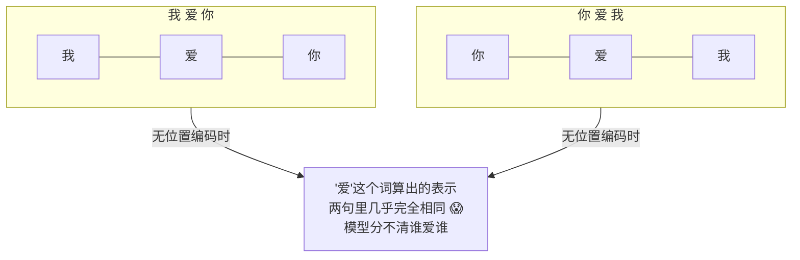
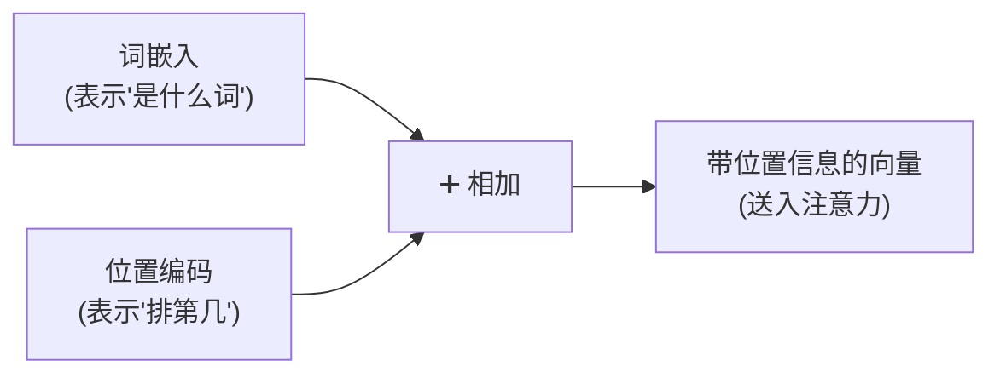
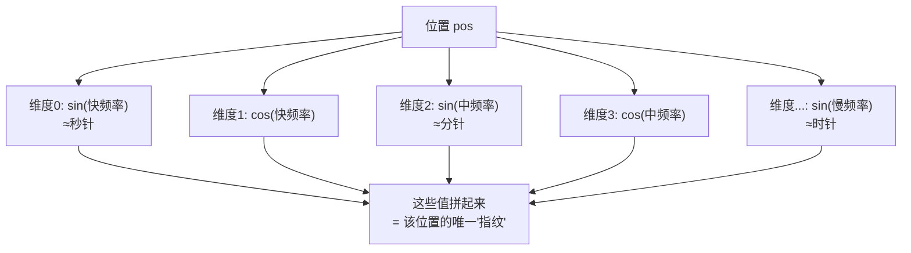
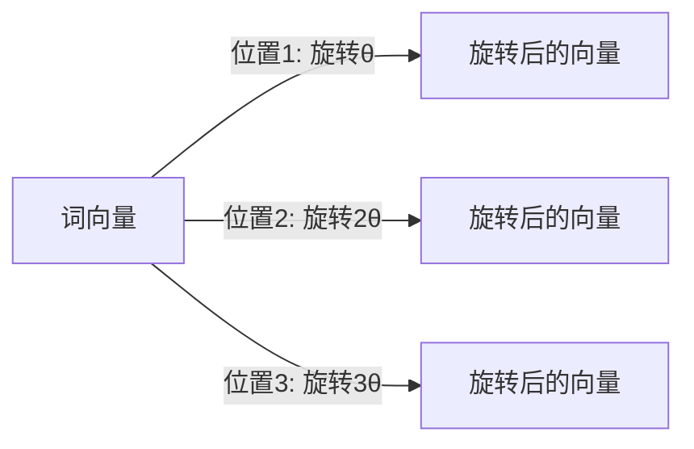
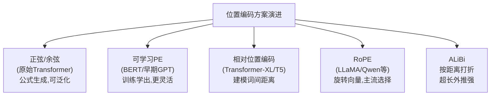
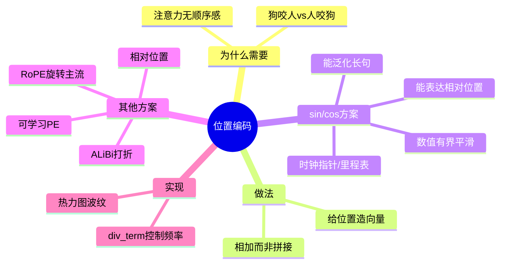

# 第 5 章 位置编码(Positional Encoding)

> 上一章末尾我们埋了个伏笔:注意力机制本身"看不见"词的先后顺序。这一章就来填这个坑——Transformer 用一种巧妙的"位置编码"给每个词打上"座位号"。
>
> 📌 位置编码是 Transformer 里"数学味"最浓的一块。但别担心,我们会用时钟、里程表、二进制这些日常事物,把 sin/cos 公式彻底讲通。

---

## 5.0 本章导览


---

## 5.1 为什么 Transformer 需要位置信息

### 5.1.1 注意力是"没有顺序感"的

回想第 3、4 章的计算:注意力是把每个词和其他所有词做点积、算权重。这个过程有个隐藏特性——**它对词的排列顺序完全无感**。

打个比方:注意力看句子,就像看一**袋**词,而不是一**串**词。你把袋子里的词摇一摇换个顺序,注意力算出来的结果几乎一样。

### 5.1.2 用一个实验说明"无顺序感"

假设我们把"我 爱 你"打乱成"你 爱 我",在**没有位置编码**的情况下,注意力对每个词算出的表示会怎样?



因为注意力只看"词和词的内容匹配",不看它们排在第几位。"爱"无论在哪个位置,它看到的还是同样的一组词。这显然是灾难——语言的顺序太重要了:

> "**狗** 咬 **人**" vs "**人** 咬 **狗**"

同样三个字,顺序一反,意思天差地别。如果模型分不清顺序,就彻底没法理解语言。

### 5.1.3 RNN 靠"逐个读"天然有顺序,Transformer 没有

RNN 是一个词一个词按顺序读的,顺序信息天然就编码在处理过程里。而 Transformer 为了并行,**一次性把所有词同时喂进去**,反而丢掉了顺序。

所以我们必须**额外**告诉模型:每个词在句子里排第几。这个"告知位置"的机制,就是**位置编码(Positional Encoding, PE)**。



> 💡 **核心做法**:给每个位置也造一个向量(位置编码),然后**直接加到**该位置的词嵌入上。这样每个词的向量里就同时含有"我是什么词"和"我在第几位"两种信息。

### 5.1.4 为什么是"相加"而不是"拼接"?

一个常见疑问:把位置信息**拼接**到词向量后面(变成更长的向量)不是更清晰吗?为什么选择**相加**?

- **拼接**会增大向量维度,增加后续所有计算的开销。
- **相加**保持维度不变,而且实践证明效果很好。高维空间"容量"极大,词嵌入和位置编码相加后,模型有能力从这个"混合向量"里同时解读出"词义"和"位置"两种信息,并不会真的"搅浑"。

> 💡 **一个直觉**:可以把它想象成给每个词的向量"叠加了一层位置的水印"。水印和原图叠在一起,但训练好的模型有能力同时看清两者。

---

## 5.2 正弦/余弦位置编码原理

原始 Transformer 论文用了一种很优雅的方案:**用正弦(sin)和余弦(cos)函数**来生成位置编码。

### 5.2.1 公式长什么样

对第 $pos$ 个位置、向量的第 $i$ 个维度:

$$
PE_{(pos, 2i)} = \sin\left(\frac{pos}{10000^{2i/d_{model}}}\right)
$$

$$
PE_{(pos, 2i+1)} = \cos\left(\frac{pos}{10000^{2i/d_{model}}}\right)
$$

**人话翻译**:位置向量里,偶数维用 sin 填,奇数维用 cos 填;而且**每个维度用的"波长(频率)"都不一样**——低维波动快,高维波动慢。

### 5.2.2 用"时钟指针"来理解

这套公式看着吓人,但用一个比喻就通了:**多根不同速度的时钟指针**。

想象一排钟表,有秒针、分针、时针……

- **秒针**转得快(高频,像低维度):适合区分**相邻**的位置。
- **时针**转得慢(低频,像高维度):适合刻画**大跨度**的位置。

任意一个时刻,所有指针的角度组合起来,就能**唯一确定**这是几点几分几秒。同理,某个位置的所有 sin/cos 值组合起来,就**唯一标识**了这个位置。



### 5.2.3 另一个比喻:汽车里程表

如果时钟还不够直观,再想想**汽车里程表**:

```
里程表:  0 0 0 1 2 7
         ↑ ↑ ↑ ↑ ↑ ↑
         慢 ←——————→ 快(个位转得最快)
```

- 个位数字转得最快(每前进 1 公里就跳一格)——像高频维度。
- 十位、百位转得越来越慢——像低频维度。
- 每一个里程数,对应一组唯一的数字组合。

位置编码的 sin/cos 就是这个道理:**用一组"转速不同的转盘",组合出每个位置独一无二的编码**。区别只是里程表用 0-9 的整数,位置编码用 -1 到 1 之间平滑变化的 sin/cos 值。

### 5.2.4 具体数字感受一下

我们取 $d_{model}=4$,算出前几个位置的编码(近似值):

| 位置 pos | 维度0 (sin快) | 维度1 (cos快) | 维度2 (sin慢) | 维度3 (cos慢) |
|---------|--------------|--------------|--------------|--------------|
| 0 | 0.00 | 1.00 | 0.00 | 1.00 |
| 1 | 0.84 | 0.54 | 0.01 | 1.00 |
| 2 | 0.91 | -0.42 | 0.02 | 1.00 |
| 3 | 0.14 | -0.99 | 0.03 | 1.00 |

观察:

- **维度 0、1(高频)**:随位置快速变化(0.84 → 0.91 → 0.14),负责精细区分相邻位置。
- **维度 2、3(低频)**:变化极慢(几乎都是 0.0x 和 1.00),负责刻画大尺度的位置趋势。
- 每一行(每个位置)的四个数字组合都不同 → 每个位置都有唯一"指纹"。

---

## 5.3 深入理解:sin/cos 的两个巧妙性质

为什么原始论文偏偏选 sin/cos,而不是简单地用 `位置÷句长` 这种直接的数字?因为 sin/cos 有两个别的方案给不了的漂亮性质。

### 5.3.1 性质一:能表达"相对位置"(核心优势)

三角函数有个漂亮的性质:$\sin(a+b)$ 和 $\cos(a+b)$ 可以用 $\sin a, \cos a, \sin b, \cos b$ **线性表示**出来(和角公式):

$$
\sin(pos+k) = \sin(pos)\cos(k) + \cos(pos)\sin(k)
$$

这意味着"位置 $pos+k$"的编码,可以由"位置 $pos$"的编码通过一个**只依赖于 k 的固定线性变换**得到。

**通俗地说**:模型很容易学会"往后数 3 个位置"这种**相对关系**——因为"偏移 k"对应一个固定的旋转变换,与你从哪个位置出发无关。这对理解语言里"前一个词、后一个词""相隔几个词"的关系非常有用。

```mermaid
flowchart LR
    P1["位置 pos 的编码"] -->|固定的旋转变换<br/>(只和偏移k有关)| P2["位置 pos+k 的编码"]
    NOTE["→ 模型能轻松学会'相对距离'<br/>而不必死记每个绝对位置"]
```

**类比**:就像钟表上,"过了 15 分钟"永远对应分针转 90 度,不管你是从 3 点还是 8 点开始。这个"旋转量固定"的特性,让模型很容易理解"间隔"。

### 5.3.2 性质二:能泛化到更长的句子

sin/cos 是按公式算出来的,不管句子多长都能算。所以哪怕训练时只见过长度 50 的句子,遇到长度 100 的也能照样生成位置编码——**不会因为句子变长就"没座位号可用"**。

这一点对比"可学习位置编码"(5.4 节)是巨大优势:后者只学了训练时见过的位置,超出范围就抓瞎。

### 5.3.3 性质三:数值有界且平滑

sin/cos 的值永远在 $[-1, 1]$ 之间,不会因为位置变大而"爆炸"。位置 5 和位置 5000 的编码,数值范围一样稳定。这让它和词嵌入相加时不会产生数值失衡。

### 5.3.4 直观感受:一张"条纹图"

如果把每个位置的编码向量画成一行、颜色深浅代表数值,整张位置编码图会呈现出**由密到疏的波纹条纹**:

```
维度→   低维(高频,条纹细密)        高维(低频,条纹宽疏)
位置↓  ▁▂▃▄▅▆▇█▇▆▅▄▃▂▁  ▁▁▂▂▃▃▄▄▅▅▆▆▇▇██
  0    ▓░▓░▓░▓░▓░▓░▓░▓░  ▓▓▓▓░░░░▓▓▓▓░░░░
  1    ░▓░▓░▓░▓░▓░▓░▓░▓  ▓▓▓▓░░░░▓▓▓▓░░░░
  2    ▓░▓░▓░▓░▓░▓░▓░▓░  ▓▓▓▓▓░░░▓▓▓▓░░░░
 ...   (左边变化快)          (右边变化慢)
```

靠前的维度条纹细密(高频),靠后的维度条纹宽疏(低频)。每一行(每个位置)的条纹组合都独一无二。5.5 节的代码会教你亲手画出真正的热力图。

---

## 5.4 可学习位置编码与相对位置编码

sin/cos 是原始方案,但不是唯一选择。后来的模型发展出了其他流派,这里做个更完整的介绍,帮你建立全局认知。

### 5.4.1 可学习位置编码(Learned PE)

**思路**:干脆不用公式了,把每个位置的编码也当成**参数,让模型自己训练学出来**(就像词嵌入那样)。

- **代表**:BERT、GPT 早期版本。
- **优点**:更灵活,让数据自己决定位置怎么表示,在训练长度内往往效果略好。
- **缺点**:只能覆盖训练时见过的最大长度,**没法直接泛化到更长的句子**。比如训练时最长 512,那第 513 个位置就没有对应的编码了。

### 5.4.2 相对位置编码(Relative PE)

**思路**:比起"你在第 5 个位置"这种**绝对**信息,语言里更重要的往往是"你在我**前面第 2 个**"这种**相对**信息。相对位置编码直接建模词与词之间的**距离**,把这个距离信息注入到注意力分数的计算中。

- **优点**:更符合语言直觉,对长文本更友好,泛化性更好。
- **代表**:Transformer-XL、T5(用了一种简化的相对位置偏置)。

### 5.4.3 旋转位置编码(RoPE):当今大模型的主流

**RoPE(Rotary Position Embedding,旋转位置编码)** 是现在几乎所有主流开源大模型(LLaMA、Qwen、DeepSeek 等)都在用的方案,值得多讲一句。

**核心思想**:不再把位置编码"加"到词向量上,而是根据位置,把词向量在高维空间里**旋转一个角度**——位置越靠后,旋转的角度越大。



**为什么妙**:两个词做注意力点积时,点积结果只取决于它们的**旋转角度差**,也就是**相对位置**。这样 RoPE 既有绝对位置编码"直接作用于向量"的简洁,又天然具备"相对位置感知"的能力,还能较好地外推到更长的序列。

**比喻**:每个词是钟面上的一根指针,位置决定它转到几点钟方向。两根指针的"夹角"就编码了它们的相对距离——无论整体怎么转,夹角不变。

### 5.4.4 ALiBi:给远处的词"打折"

**ALiBi** 的思路更简单粗暴:干脆不做专门的位置编码,而是直接在注意力分数上,**按距离远近减去一个惩罚值**——两个词离得越远,注意力分数被扣得越多。

**比喻**:开会时,离你越远的人说话,你听得越模糊、越不在意。ALiBi 就是给"距离"明码标价地打了个折扣。它实现简单、外推到超长序列的能力很强。

### 5.4.5 演进全景



> 💡 **不用纠结细节**:入门阶段,你只要牢牢掌握 **sin/cos 位置编码**的原理和"为什么需要位置编码"就够了。RoPE、ALiBi 属于进阶内容,了解它们"解决更长文本"这个共同目标即可。第 12 章还会再提。

---

## 5.5 动手写代码:用 PyTorch 实现正弦位置编码

```python
import torch
import torch.nn as nn
import math


class PositionalEncoding(nn.Module):
    def __init__(self, d_model=512, max_len=5000):
        super().__init__()

        # 预先算好所有位置的编码,存成一张查找表 (max_len, d_model)
        pe = torch.zeros(max_len, d_model)

        # position: [[0],[1],[2],...],形状 (max_len, 1)
        position = torch.arange(0, max_len).unsqueeze(1).float()

        # div_term 对应公式里的 1 / 10000^(2i/d_model),控制每个维度的频率
        # 用 exp 和 log 是为了数值稳定(等价于直接算幂)
        div_term = torch.exp(
            torch.arange(0, d_model, 2).float() * (-math.log(10000.0) / d_model)
        )

        pe[:, 0::2] = torch.sin(position * div_term)   # 偶数维用 sin
        pe[:, 1::2] = torch.cos(position * div_term)   # 奇数维用 cos

        pe = pe.unsqueeze(0)               # 增加 batch 维 -> (1, max_len, d_model)
        self.register_buffer('pe', pe)     # 注册为 buffer:不参与训练,但会随模型保存

    def forward(self, x):
        # x: (batch, seq_len, d_model)
        # 取前 seq_len 个位置的编码,加到词嵌入上
        seq_len = x.size(1)
        return x + self.pe[:, :seq_len]
```

### 逐行理解 `div_term` 这个"魔法"

初学者最看不懂的就是 `div_term`。我们拆开看:

```python
# 目标:算出每个维度的"频率" 1 / 10000^(2i/d_model)
# 直接算幂容易数值不稳,所以用等价的 exp(log) 形式:
#   10000^(2i/d) = exp( (2i/d) * ln(10000) )
#   所以 1/10000^(2i/d) = exp( -(2i/d) * ln(10000) )
i2 = torch.arange(0, d_model, 2).float()          # [0, 2, 4, ...] 即 2i
div_term = torch.exp(i2 * (-math.log(10000.0) / d_model))
# div_term 从大到小排列:低维频率高(变化快),高维频率低(变化慢)
```

> 💡 **一句话**:`div_term` 就是给每个维度分配"转速"。索引越小的维度转得越快(高频),越大的越慢(低频),对应 5.2 节说的"秒针到时针"。

### 跑一个最小示例

```python
torch.manual_seed(0)
pe = PositionalEncoding(d_model=512, max_len=100)

# batch=1,句子长度=10,词嵌入维度=512
word_embeddings = torch.randn(1, 10, 512)

output = pe(word_embeddings)
print("加入位置编码后的形状:", output.shape)   # torch.Size([1, 10, 512]),形状不变

# 验证:不同位置的编码确实不同
print("位置0 和 位置1 的编码是否相同:", torch.equal(pe.pe[0, 0], pe.pe[0, 1]))  # False
```

注意:位置编码**不改变向量形状**,只是把位置信息"叠加"进去。而且不同位置的编码一定不同(输出 `False`),这保证了每个"座位号"都是独一无二的。

### 可视化:亲眼看到"波纹条纹"

```python
import matplotlib.pyplot as plt

pe = PositionalEncoding(d_model=128, max_len=100)
encoding = pe.pe[0].numpy()   # (100, 128)

plt.figure(figsize=(10, 6))
plt.imshow(encoding, cmap="RdBu", aspect="auto")
plt.xlabel("编码维度 (0→127)")
plt.ylabel("位置 (0→99)")
plt.title("正弦位置编码热力图:左边条纹密(高频),右边条纹疏(低频)")
plt.colorbar(label="编码值 (-1 到 1)")
plt.tight_layout()
plt.show()
```

运行后你会看到一张漂亮的图:左侧(低维、高频)呈现细密的明暗交替条纹,越往右(高维、低频)条纹越宽——这就是 5.2、5.3 节反复说的"多根不同转速的指针"的视觉体现。

### 验证"相对位置"性质

```python
# 验证:相邻位置编码的相似度,只和"间隔"有关,与绝对位置基本无关
import torch.nn.functional as F

pe = PositionalEncoding(d_model=128, max_len=100)
enc = pe.pe[0]   # (100, 128)

# 位置10与位置13的相似度  vs  位置50与位置53的相似度(间隔都是3)
sim_a = F.cosine_similarity(enc[10], enc[13], dim=0)
sim_b = F.cosine_similarity(enc[50], enc[53], dim=0)
print(f"间隔3(位置10↔13)相似度: {sim_a:.4f}")
print(f"间隔3(位置50↔53)相似度: {sim_b:.4f}")
# 两者非常接近 —— 印证"相同间隔 → 相似的关系",这就是相对位置感知
```

> 🛠️ **动手小练习**:改一下 `10000` 这个基数(比如改成 100 或 100000),重新画热力图,观察条纹疏密如何变化。这个基数控制了"最慢的指针有多慢",即模型能区分的最大位置尺度。

---

## 5.6 常见疑问 FAQ

**Q1:位置编码是加在哪一步?**
加在最开始——词嵌入之后、送入第一个编码器/解码器层之前。之后所有层共享这份带位置信息的输入。

**Q2:每一层都要重新加位置编码吗?**
原始 Transformer 只在输入端加一次。得益于残差连接(第 6 章),位置信息能一路传递到深层。(注:RoPE 等方案则是在每层的注意力计算中都注入位置,机制不同。)

**Q3:为什么公式里是 10000 这个数?**
它是个超参数,控制频率范围(最长能区分的位置尺度)。10000 是论文里的经验取值,能覆盖相当长的序列。它不是唯一选择,但被证明工作得很好。

**Q4:sin/cos 位置编码有参数需要训练吗?**
没有!它完全由公式算出,是"死"的常量表(代码里用 `register_buffer` 而非 `nn.Parameter`)。这也是它省参数、能泛化的原因。

**Q5:词嵌入和位置编码相加,会不会把词义"污染"了?**
实践证明不会。高维空间容量极大,模型有足够能力从相加后的向量里分别解读出词义和位置。可以类比"给照片加半透明水印",两者叠加但都能被看清。

---

## 5.7 本章小结

- 注意力机制本身**对顺序无感**(把句子看成一"袋"词),而语言顺序至关重要,所以必须额外注入位置信息。
- **位置编码**为每个位置生成一个向量,**直接加到词嵌入上**(而非拼接,以保持维度),让向量同时携带"是什么词"和"排第几"。
- 原始 Transformer 用 **sin/cos 位置编码**,像"多根不同转速的时钟指针"或"里程表转盘",组合出每个位置的唯一指纹。
- sin/cos 的三大巧妙性质:**① 能表达相对位置(和角公式)② 能泛化到更长句子 ③ 数值有界平滑**。
- 后续演化出**可学习 PE、相对位置编码、RoPE、ALiBi** 等方案,主要为了更好地处理超长文本;其中 **RoPE**(旋转向量)是当今大模型的主流。



### 承上启下

现在,输入端已经完备了:**词嵌入(是什么词)+ 位置编码(排第几)+ 多头注意力(词间关系)**。但要搭出完整的 Transformer,还差几个"配件"——前馈网络、残差连接、层归一化、掩码。下一章我们把这些关键组件一次讲清。

---

📖 **上一章**:第 4 章 多头注意力 ｜ **下一章**:第 6 章 其他关键组件
