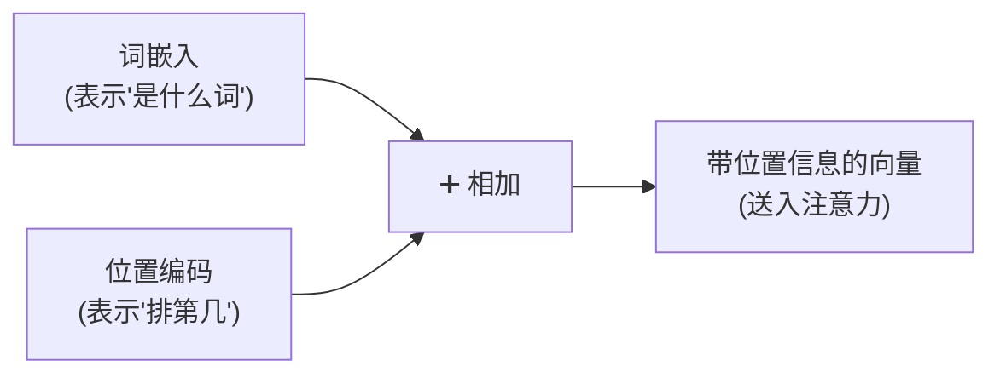
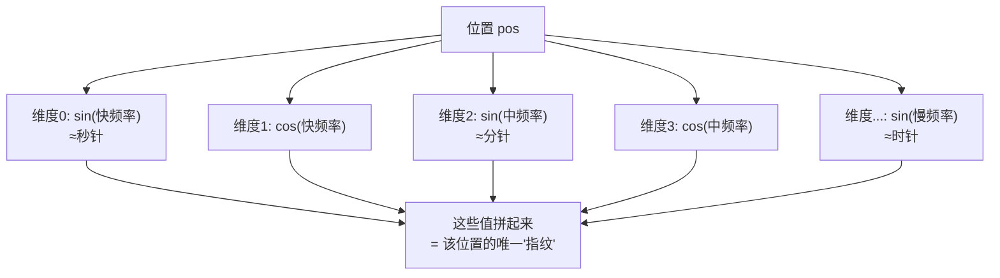
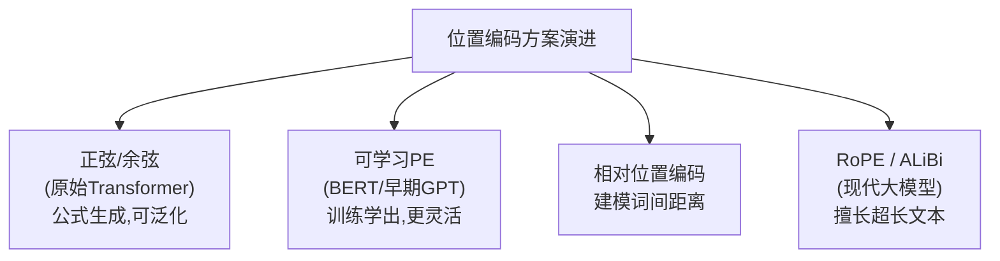
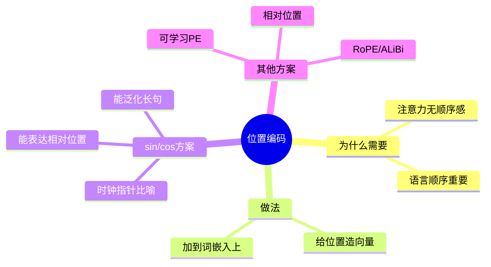

# 第 5 章 位置编码(Positional Encoding)

> 上一章末尾我们埋了个伏笔:注意力机制本身"看不见"词的先后顺序。这一章就来填这个坑——Transformer 用一种巧妙的"位置编码"给每个词打上"座位号"。

---

## 5.1 为什么 Transformer 需要位置信息

### 5.1.1 注意力是"没有顺序感"的

回想第 3、4 章的计算:注意力是把每个词和其他所有词做点积、算权重。这个过程有个隐藏特性——**它对词的排列顺序完全无感**。

打个比方:注意力看句子,就像看一**袋**词,而不是一**串**词。你把袋子里的词摇一摇换个顺序,注意力算出来的结果几乎一样。

但语言的顺序太重要了:

> "**狗** 咬 **人**" vs "**人** 咬 **狗**"

同样三个字,顺序一反,意思天差地别。如果模型分不清顺序,就彻底没法理解语言。

### 5.1.2 RNN 靠"逐个读"天然有顺序,Transformer 没有

RNN 是一个词一个词按顺序读的,顺序信息天然就编码在处理过程里。而 Transformer 为了并行,**一次性把所有词同时喂进去**,反而丢掉了顺序。

所以我们必须**额外**告诉模型:每个词在句子里排第几。这个"告知位置"的机制,就是**位置编码(Positional Encoding, PE)**。



> 💡 **核心做法**:给每个位置也造一个向量(位置编码),然后**直接加到**该位置的词嵌入上。这样每个词的向量里就同时含有"我是什么词"和"我在第几位"两种信息。

---

## 5.2 正弦/余弦位置编码原理

原始 Transformer 论文用了一种很优雅的方案:**用正弦(sin)和余弦(cos)函数**来生成位置编码。

### 5.2.1 公式长什么样

对第 $pos$ 个位置、向量的第 $i$ 个维度:

$$
PE_{(pos, 2i)} = \sin\left(\frac{pos}{10000^{2i/d_{model}}}\right)
$$

$$
PE_{(pos, 2i+1)} = \cos\left(\frac{pos}{10000^{2i/d_{model}}}\right)
$$

**人话翻译**:位置向量里,偶数维用 sin 填,奇数维用 cos 填;而且**每个维度用的"波长(频率)"都不一样**——低维波动快,高维波动慢。

### 5.2.2 用"时钟指针"来理解

这套公式看着吓人,但用一个比喻就通了:**多根不同速度的时钟指针**。

想象一排钟表,有秒针、分针、时针……

- **秒针**转得快(高频,像低维度):适合区分**相邻**的位置。
- **时针**转得慢(低频,像高维度):适合刻画**大跨度**的位置。

任意一个时刻,所有指针的角度组合起来,就能**唯一确定**这是几点几分几秒。同理,某个位置的所有 sin/cos 值组合起来,就**唯一标识**了这个位置。



### 5.2.3 为什么偏偏选 sin/cos?两个好处

**好处一:能表达"相对位置"**

三角函数有个漂亮的性质:$\sin(a+b)$ 可以用 $\sin a, \cos a, \sin b, \cos b$ 线性表示出来。这意味着"位置 $pos+k$"的编码,可以由"位置 $pos$"的编码通过一个固定的线性变换得到。

**通俗地说**:模型很容易学会"往后数 3 个位置"这种**相对关系**,而不用死记每个绝对位置。这对理解语言里"前一个词、后一个词"的关系非常有用。

**好处二:能泛化到更长的句子**

sin/cos 是按公式算出来的,不管句子多长都能算。所以哪怕训练时只见过长度 50 的句子,遇到长度 100 的也能照样生成位置编码——**不会因为句子变长就"没座位号可用"**。

### 5.2.4 直观感受:一张"条纹图"

如果把每个位置的编码向量画成一行、颜色深浅代表数值,整张位置编码图会呈现出**由密到疏的波纹条纹**:靠前的维度条纹细密(高频),靠后的维度条纹宽疏(低频)。每一行(每个位置)的条纹组合都独一无二。

---

## 5.3 可学习位置编码与相对位置编码简介

sin/cos 是原始方案,但不是唯一选择。后来的模型发展出了其他流派,这里做个简介,帮你建立全局认知。

### 5.3.1 可学习位置编码(Learned PE)

**思路**:干脆不用公式了,把每个位置的编码也当成**参数,让模型自己训练学出来**(就像词嵌入那样)。

- **代表**:BERT、GPT 早期版本。
- **优点**:更灵活,让数据自己决定位置怎么表示。
- **缺点**:只能覆盖训练时见过的最大长度,**没法直接泛化到更长的句子**。

### 5.3.2 相对位置编码(Relative PE)

**思路**:比起"你在第 5 个位置"这种**绝对**信息,语言里更重要的往往是"你在我**前面第 2 个**"这种**相对**信息。相对位置编码直接建模词与词之间的**距离**。

- **优点**:更符合语言直觉,对长文本更友好。

### 5.3.3 旋转位置编码(RoPE)与 ALiBi

这是当今**大语言模型**里最流行的两种方案,简单了解即可:

| 方案 | 一句话理解 | 代表模型 |
|------|-----------|---------|
| **RoPE(旋转位置编码)** | 通过"旋转"词向量的角度来注入位置,巧妙融合了绝对与相对位置的优点 | LLaMA、Qwen 等主流大模型 |
| **ALiBi** | 直接在注意力分数上按"距离远近"加一个惩罚,离得越远关注度衰减越多 | 部分长上下文模型 |

它们的共同目标都是:**更好地处理超长文本**,让模型能"读得更长、记得更远"。



> 💡 **不用纠结细节**:入门阶段,你只要牢牢掌握 **sin/cos 位置编码**的原理和"为什么需要位置编码"就够了。RoPE 等属于进阶内容,第 12 章还会再提。

---

## 5.4 动手写代码:用 PyTorch 实现正弦位置编码

```python
import torch
import torch.nn as nn
import math


class PositionalEncoding(nn.Module):
    def __init__(self, d_model=512, max_len=5000):
        super().__init__()

        # 预先算好所有位置的编码,存成一张查找表 (max_len, d_model)
        pe = torch.zeros(max_len, d_model)

        # position: [[0],[1],[2],...],形状 (max_len, 1)
        position = torch.arange(0, max_len).unsqueeze(1).float()

        # div_term 对应公式里的 1 / 10000^(2i/d_model),控制每个维度的频率
        div_term = torch.exp(
            torch.arange(0, d_model, 2).float() * (-math.log(10000.0) / d_model)
        )

        pe[:, 0::2] = torch.sin(position * div_term)   # 偶数维用 sin
        pe[:, 1::2] = torch.cos(position * div_term)   # 奇数维用 cos

        pe = pe.unsqueeze(0)               # 增加 batch 维 -> (1, max_len, d_model)
        self.register_buffer('pe', pe)     # 注册为 buffer:不参与训练,但会随模型保存

    def forward(self, x):
        # x: (batch, seq_len, d_model)
        # 取前 seq_len 个位置的编码,加到词嵌入上
        seq_len = x.size(1)
        return x + self.pe[:, :seq_len]
```

### 跑一个最小示例

```python
torch.manual_seed(0)
pe = PositionalEncoding(d_model=512, max_len=100)

# batch=1,句子长度=10,词嵌入维度=512
word_embeddings = torch.randn(1, 10, 512)

output = pe(word_embeddings)
print("加入位置编码后的形状:", output.shape)   # torch.Size([1, 10, 512]),形状不变

# 验证:不同位置的编码确实不同
print("位置0 和 位置1 的编码是否相同:", torch.equal(pe.pe[0, 0], pe.pe[0, 1]))  # False
```

注意:位置编码**不改变向量形状**,只是把位置信息"叠加"进去。而且不同位置的编码一定不同(输出 `False`),这保证了每个"座位号"都是独一无二的。

> 🛠️ **动手小练习**:把 `pe.pe[0, :20, :64]` 用 matplotlib 画成热力图(`plt.imshow`),你就能亲眼看到 5.2.4 说的那种"由密到疏的波纹条纹"。

---

## 5.5 本章小结

- 注意力机制本身**对顺序无感**(把句子看成一"袋"词),但语言的顺序至关重要,所以必须额外注入位置信息。
- **位置编码**为每个位置生成一个向量,**直接加到词嵌入上**,让向量同时携带"是什么词"和"排第几"。
- 原始 Transformer 用 **sin/cos 位置编码**,像"多根不同速度的时钟指针",组合出每个位置的唯一指纹;好处是能表达**相对位置**、且能**泛化到更长句子**。
- 后续演化出**可学习 PE、相对位置编码、RoPE、ALiBi** 等方案,主要为了更好地处理超长文本。



### 承上启下

现在,输入端已经完备了:**词嵌入(是什么词)+ 位置编码(排第几)+ 多头注意力(词间关系)**。但要搭出完整的 Transformer,还差几个"配件"——前馈网络、残差连接、层归一化、掩码。下一章我们把这些关键组件一次讲清。

---

📖 **上一章**:第 4 章 多头注意力 ｜ **下一章**:第 6 章 其他关键组件
