# 第 6 章 其他关键组件

> 主角(注意力)已经登场,配角也很重要。这一章介绍搭建 Transformer 必不可少的四个"配件":前馈网络、残差连接、层归一化、掩码机制。它们看似不起眼,却决定了模型能不能训得动、训得好。
>
> 📌 本章的四个组件是很多人读代码时"跳过"的部分,但恰恰是它们让 Transformer 能堆到几十上百层还稳定训练。我们逐个讲透,并配上数值示例。

---

## 6.0 本章导览

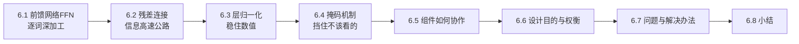

一句话预告:注意力负责"词与词之间交流",而这四个组件负责"让交流后的信息被**深加工、稳定传递、正确训练**"。

---

## 6.1 前馈神经网络(Feed-Forward Network, FFN)

### 6.1.1 注意力之后,为什么还要一个 FFN

注意力做的事,本质是"**在词与词之间搬运、混合信息**"——它让每个词吸收了上下文。但它对每个词向量本身的"深加工"是有限的。

其实,如果你仔细看注意力的公式,会发现它主要是"加权求和"——本质上是一种**线性组合**。光靠线性组合,模型的表达能力是受限的(多个线性层叠起来还是线性)。我们需要**非线性**来让模型学习复杂的模式。

于是每个注意力层之后,都会接一个**前馈网络(FFN)**,对**每个词**的向量单独做一次非线性变换,进一步提炼特征。

**比喻**:注意力像开小组讨论会,大家交换意见(信息在词之间流动);FFN 则是散会后每个人**回到工位独立消化、深入思考**(对每个词单独加工)。

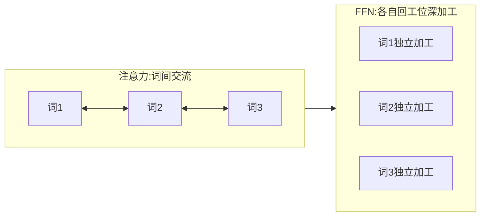

### 6.1.2 结构:先放大,再缩小

FFN 非常简单,就是两层全连接,中间夹一个激活函数:

$$
\text{FFN}(x) = \max(0, \, x W_1 + b_1) \, W_2 + b_2
$$

- 第一层把维度**放大**(比如 512 → 2048);
- 中间用 **ReLU** 激活(即 $\max(0, \cdot)$,把负数变 0,引入非线性);
- 第二层再**缩小**回原维度(2048 → 512)。

**比喻**:像"先把材料摊开铺大,方便充分加工,再收拢打包"。放大到高维空间,模型有更大的"施展空间"去学习复杂特征。


### 6.1.3 为什么要"先放大到 4 倍"

原始论文里 FFN 的中间维度是 2048,正好是 $d_{model}=512$ 的 **4 倍**。这个"4 倍"几乎成了一个惯例(后来很多模型都沿用)。

**直觉**:把数据投影到更高维的空间,不同特征更容易被"线性分开"、被独立处理。就像把揉成一团的毛线先抖开铺在大桌子上,才好一根根梳理,梳理完再收起来。中间维度越大,FFN 的"容量"越大,能记住的模式越多——事实上,大模型的绝大部分参数量都在 FFN 里。

### 6.1.4 关于激活函数:ReLU、GELU、SwiGLU

原始论文用 ReLU,但现代模型常换成更平滑的激活函数:

| 激活函数 | 特点 | 代表 |
|---------|------|------|
| **ReLU** | 简单,负数直接归零 | 原始 Transformer |
| **GELU** | 更平滑的"软性 ReLU",负数区域不是硬切断 | BERT、GPT-2 |
| **SwiGLU** | 带门控机制,效果更好,现代大模型常用 | LLaMA、PaLM |

> 💡 **入门只需记住**:FFN = "放大 → 非线性激活 → 缩小",用来给模型注入非线性、提炼每个词自己的特征。激活函数换成哪种是细节优化。

### 6.1.5 一个数值小例子

假设一个词向量简化为 2 维 `[1, -2]`,FFN 中间放大到 3 维:

```
输入 x = [1, -2]
① 放大(乘 W1)  → [0.5, -1.0, 2.0]   (假设某组权重算出来)
② ReLU          → [0.5,  0.0, 2.0]   (负数 -1.0 被切成 0)
③ 缩小(乘 W2)  → [1.3, -0.4]        (回到 2 维)
```

关键看第 ② 步:ReLU 把负值 `-1.0` 变成了 `0`。这个"选择性归零"就是非线性的来源——它让 FFN 能表达"某些特征只在为正时才起作用"这种复杂逻辑。

> 💡 **关键点**:FFN 对句子里**每个位置独立、且用同一套参数**处理。它不看别的词,只专注加工"自己"。10 个词就是把同一个 FFN 套用 10 次。

---

## 6.2 残差连接(Residual Connection)

### 6.2.1 深层网络的烦恼:越深越难训

Transformer 会把很多层叠在一起(比如 12 层、96 层)。但网络一深,就容易出现两个问题:

1. **梯度消失**:反向传播时,梯度传着传着就衰减没了,底层几乎学不到东西。
2. **退化问题**:直觉上层数越多能力越强,但实践发现,单纯堆深层反而可能让效果**变差**——因为深层网络太难优化了。

### 6.2.2 残差连接:给信息修一条"高速公路"

残差连接的做法极其简单:**把某一层的输入,直接加到它的输出上**。

$$
\text{输出} = \text{子层}(x) + x
$$

**比喻:走楼梯 vs 电梯**。原本信息必须一层层"爬楼梯"(经过每一层的复杂变换),很累且容易掉队。残差连接相当于在旁边修了部**电梯**——信息可以"抄近路"直接往上传,不必每层都折腾一遍。

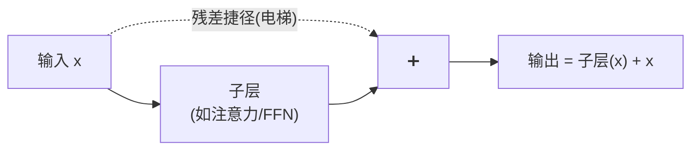

### 6.2.3 换个角度:让子层只学"变化量"

残差连接还有一个更深刻的理解角度。把公式变形:

$$
\text{子层}(x) = \text{输出} - x
$$

也就是说,子层不再需要学习"完整的输出",只需要学习"**在输入基础上要做多少改动**"(即残差/变化量)。

**比喻**:让你从头画一幅名画很难;但给你一幅接近的画,让你"改几笔"让它更好,就容易多了。残差连接就是让每一层只负责"改几笔",而不是"重画一幅"。


### 6.2.4 为什么有用

- **梯度畅通**:反向传播时,梯度可以通过这条"捷径"(那个 `+x`)**直接回流**到底层,不会消失。数学上,`+x` 让梯度里多了一个"1",保证梯度不会衰减到 0。
- **保底不变差**:即使某一层没学到有用东西(子层输出接近 0),靠 $+x$ 也能把原始信息原样传下去,至少"不添乱"。这直接解决了 6.2.1 的退化问题。

> 💡 **一句话**:残差连接是让深层网络能够成功训练的关键"发明"(源自 ResNet),几乎所有现代深度模型都在用。没有它,就没有几十上百层的大模型。

---

## 6.3 层归一化(Layer Normalization)与 Pre-LN / Post-LN

### 6.3.1 什么是归一化

神经网络在训练时,各层数值的大小、分布会剧烈波动,导致训练不稳定(忽大忽小,学得东倒西歪)。**归一化(Normalization)** 就是把数据重新"拉"到一个稳定、规整的范围(均值 0、方差 1 附近)。

**比喻**:考试成绩换算成"标准分"。不同科目分数范围不同(有的满分 100,有的满分 150),换算成统一标准后,才好公平比较、稳定处理。

### 6.3.2 层归一化:对"每个词自己"做归一化

**层归一化(LayerNorm)** 的特点是:对**单个样本(单个词向量)自己的所有特征维度**做归一化,不跨样本、不跨句子。

$$
\text{LayerNorm}(x) = \gamma \cdot \frac{x - \mu}{\sqrt{\sigma^2 + \epsilon}} + \beta
$$

**人话翻译**:算出这个词向量自己的均值 $\mu$ 和方差 $\sigma^2$,把它标准化;再用两个可学习的参数 $\gamma$(缩放)和 $\beta$(平移)做微调,让模型保留调整的自由。$\epsilon$ 是防止除以 0 的极小数。

### 6.3.3 一个数值例子

假设一个词向量是 `[2, 4, 6, 8]`,我们对它做 LayerNorm:

```
① 算均值 μ = (2+4+6+8)/4 = 5
② 算方差 σ² = [(2-5)²+(4-5)²+(6-5)²+(8-5)²]/4 = (9+1+1+9)/4 = 5
   标准差 σ = √5 ≈ 2.236
③ 标准化 (x - μ)/σ:
   (2-5)/2.236 = -1.34
   (4-5)/2.236 = -0.45
   (6-5)/2.236 =  0.45
   (8-5)/2.236 =  1.34
→ 结果 [-1.34, -0.45, 0.45, 1.34],均值≈0,方差≈1 ✅
④ 再乘 γ、加 β(可学习)做微调
```

无论原始数值多大多小(是 `[2,4,6,8]` 还是 `[200,400,600,800]`),经过 LayerNorm 后都会被拉到均值 0、方差 1 附近。这就是它"稳住数值"的作用。

### 6.3.4 LayerNorm vs BatchNorm:为什么 NLP 选前者

图像领域常用 BatchNorm(批归一化),它是**跨样本、对同一个特征维度**做归一化。而 NLP 用 LayerNorm,区别关键:

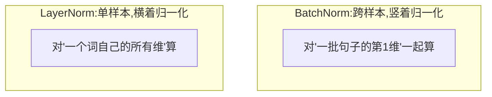

- **BatchNorm 的问题**:NLP 里句子长度不一、一个批次内差异大,而且推理时可能一次只处理一句话,统计量不稳定。
- **LayerNorm 的优势**:只看**单个词自己**,与批次大小、句子长短**完全无关**,天然适合序列数据。

> 📌 **补充**:现代大模型还常用 **RMSNorm**(LayerNorm 的简化版,省去减均值那一步),计算更快、效果相当。属于进阶优化。

### 6.3.5 Post-LN vs Pre-LN:归一化放在哪

层归一化和残差连接经常搭配使用,但"归一化放在残差前还是后"有两种流派:

| 方案 | 结构(简化) | 特点 |
|------|-------------|------|
| **Post-LN**(原始论文) | `LayerNorm(x + 子层(x))` | 归一化在残差**之后**。效果好但训练不太稳,常需要"预热(warmup)"技巧 |
| **Pre-LN**(现代常用) | `x + 子层(LayerNorm(x))` | 归一化在残差**之前**。训练更稳定,是现在大模型的主流选择 |

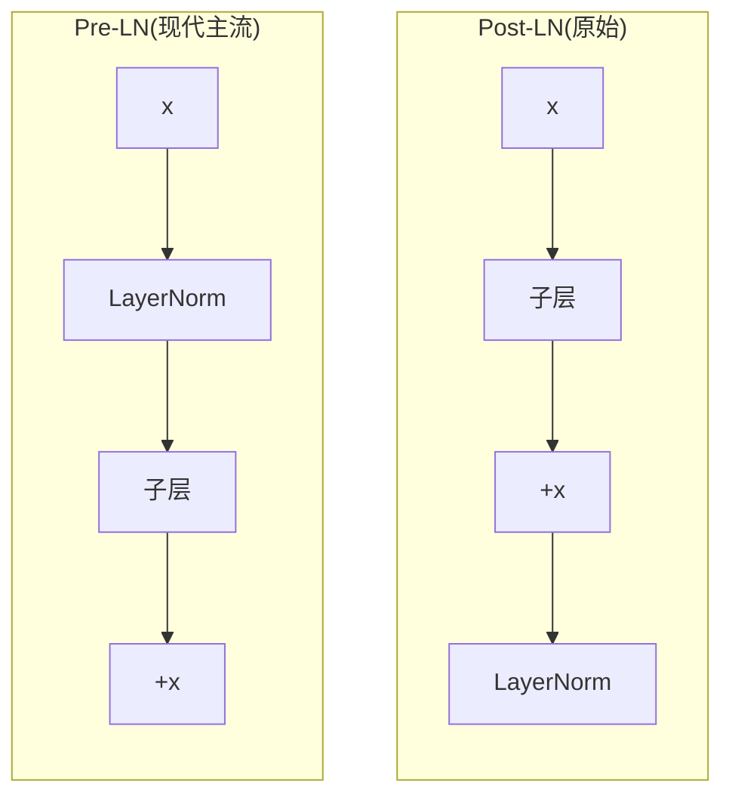

**为什么 Pre-LN 更稳**:在 Pre-LN 里,那条残差"高速公路"是**完全畅通**的(输入 x 不经过任何归一化直接加到输出),梯度回流最顺畅。而 Post-LN 里残差之后还要过一层 LayerNorm,深层时梯度容易失衡。所以训练超深、超大模型时,Pre-LN 几乎是默认选择。

> 💡 **入门记住结论即可**:现代大模型大多用 **Pre-LN**,因为它训练更稳定。

---

## 6.4 掩码机制(Padding Mask 与 Look-ahead Mask)

"掩码(Mask)"就是**挡住某些位置,不让注意力去关注它们**。Transformer 里有两种常用掩码,解决两个不同问题。

### 6.4.1 填充掩码(Padding Mask):挡住"凑数"的空位

计算机要求同一批句子长度一致,但真实句子长短不一。短句子只能用特殊符号 `<pad>` **填充**到一样长:

```
句子A: 我 爱 你 <pad> <pad>
句子B: 今 天 天 气  好
```

这些 `<pad>` 是没意义的"凑数"符号。如果让注意力去关注它们,会引入噪声。**填充掩码**就是告诉模型:"标了 pad 的位置,别理它。"

**做法**:把这些位置的注意力分数设成负无穷 $-\infty$,经过 Softmax 后权重就变成 0(回顾第 3 章代码里的 `masked_fill`)。

**为什么用 $-\infty$ 而不是直接设 0?** 因为掩码是加在 **Softmax 之前**的分数上。$e^{-\infty} = 0$,所以 Softmax 后该位置权重精确为 0。如果直接把权重设 0,那 Softmax 之后各行的和就不是 1 了,破坏了归一化。

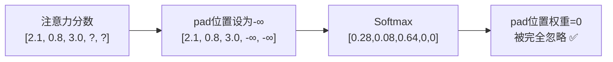

### 6.4.2 前瞻掩码(Look-ahead Mask):不许"偷看答案"

这个掩码只在**解码器(生成文本时)**用,非常关键。

想象模型在**逐字生成**一句话。当它写第 3 个字时,**只应该看到前 2 个字**,绝不能偷看到还没生成的第 4、5 个字——否则就是"抄答案作弊"了,训练出来的模型在真正生成时会失效。

**比喻**:考试时用一张纸盖住下面的题目,你只能看到已经做过的部分,看不到后面。

前瞻掩码就是这张"纸":它把每个位置**后面**的所有位置都挡住。形成一个"下三角"可见的模式:

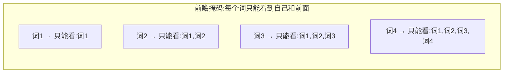

可视化成矩阵(✅可见,❌被挡):

```
        看词1  看词2  看词3  看词4
词1      ✅     ❌     ❌     ❌
词2      ✅     ✅     ❌     ❌
词3      ✅     ✅     ✅     ❌
词4      ✅     ✅     ✅     ✅
```

### 6.4.3 为什么训练时特别需要前瞻掩码

这里有个关键点值得强调:训练时,我们其实**同时**把整句正确答案喂给解码器(第 8 章的 Teacher Forcing)。如果没有前瞻掩码,模型在预测第 3 个词时就能"看到"第 4、5 个正确答案——那它只要"抄"就行了,根本学不到真本事。

前瞻掩码强制模型:**每个位置的预测,只能基于它前面的词**。这样训练出来的模型,才能在推理时(没有答案可抄)真正靠自己生成。

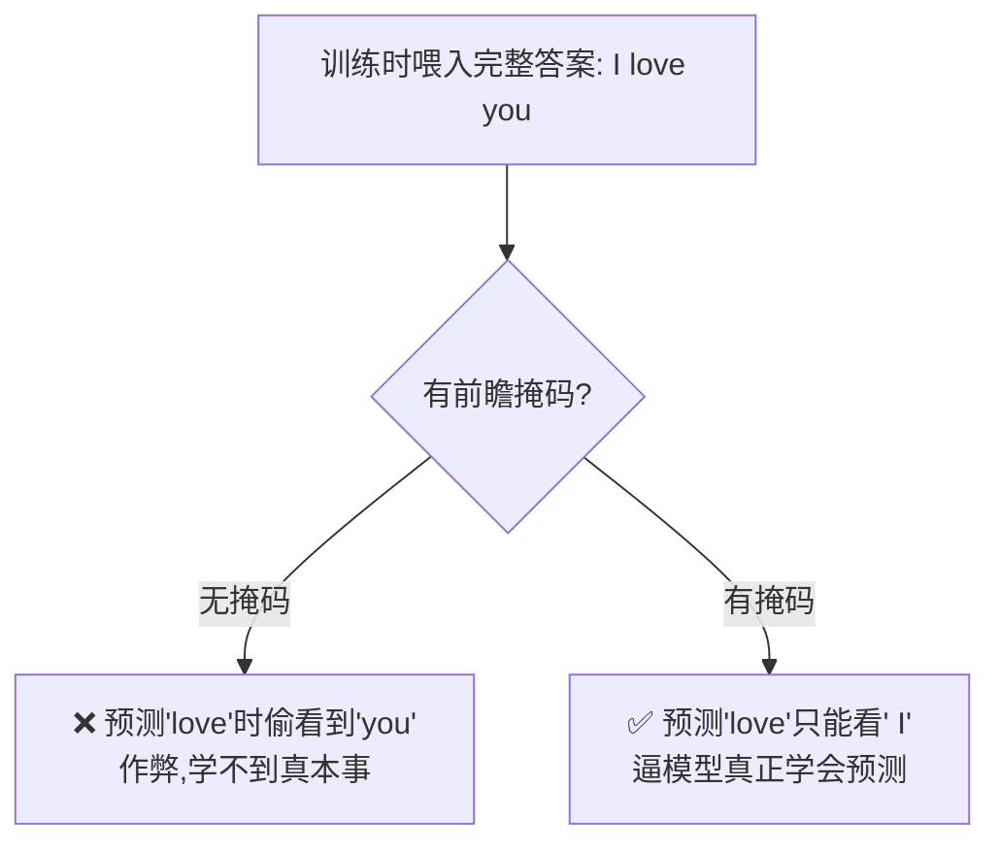

### 6.4.4 PyTorch 生成前瞻掩码

```python
import torch

def create_look_ahead_mask(size):
    """生成前瞻掩码:下三角为1(可见),上三角为0(被挡)"""
    # torch.tril 取下三角矩阵
    mask = torch.tril(torch.ones(size, size))
    return mask   # (size, size)

mask = create_look_ahead_mask(4)
print(mask)
# tensor([[1., 0., 0., 0.],
#         [1., 1., 0., 0.],
#         [1., 1., 1., 0.],
#         [1., 1., 1., 1.]])
```

配合第 3 章的注意力函数,把 `mask == 0` 的位置填成 $-\infty$,Softmax 后这些位置权重为 0,就实现了"不许偷看后面"。

### 6.4.5 两种掩码常常"叠加"使用

实际中,解码器往往**同时**需要两种掩码:既要挡住 `<pad>`(填充掩码),又要挡住未来(前瞻掩码)。做法是把两个掩码**取交集**(都为 1 的位置才可见):

```python
# 前瞻掩码 与 填充掩码 结合(两者都可见才可见)
combined_mask = look_ahead_mask * padding_mask
```

> 💡 **两种掩码对比**:填充掩码挡"无意义的空位"(编码器解码器都用);前瞻掩码挡"未来的答案"(只在解码器用)。第 7、8 章会看到它们的实际用武之地。

---

## 6.5 四个组件如何协作

现在把四个组件放到一起,看它们在一个"子层"里是怎么配合的(以 Post-LN 为例):

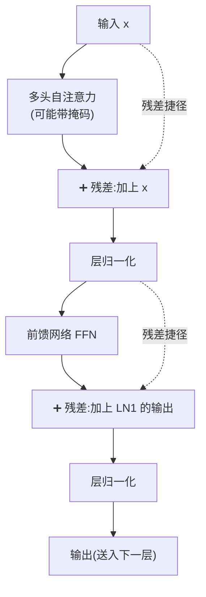

一句话串起来:

> 词向量先做**(带掩码的)注意力**交流,用**残差**保住原始信息,用**层归一化**稳住数值;再做 **FFN** 深加工,同样配上**残差 + 层归一化**。这一整套就是 Transformer 的一个"子层单元"。堆叠 N 个这样的单元,就是编码器/解码器(下一章详解)。

---

## 6.6 设计目的与权衡:这四个"配件"为什么缺一不可

前面讲了四个组件"是什么、怎么用"。这一节回答"**为什么非要它们不可**"——把每个组件"要解决的问题、设计目的、背后的权衡"讲透。你会发现,它们每一个都是在给注意力"补短板"。

### 6.6.1 FFN 的目的:补上注意力缺失的"非线性"和"独立加工"

**注意力有什么短板?** 回顾第 3 章,注意力的核心是"加权求和"——本质是 Value 的**线性组合**。而我们知道,再多的线性变换叠起来,数学上还是一个线性变换,表达能力有天花板。

**FFN 的两个设计目的**:

1. **注入非线性**:靠中间的 ReLU/GELU,让模型能拟合复杂的、弯曲的函数关系。没有它,再深的 Transformer 也只是"变相的线性模型"。
2. **逐词独立深加工**:注意力负责"词之间"交流,FFN 负责"词自己"的特征提炼。两者一横(跨词)一纵(单词),配合互补。


**"放大 4 倍"的权衡**:中间维度放大(512→2048)是在"表达能力"和"计算成本"之间权衡。放得越大,能记的模式越多(能力强),但参数和计算也越多(成本高)。4 倍是被广泛验证的"性价比甜点"。

> 💡 **一句话**:如果说注意力是"让大家开会交流",FFN 就是"散会后各自深度思考"。缺了 FFN,模型只会"传话"不会"思考",而且退化成线性模型。

### 6.6.2 残差连接的目的:让"深"成为可能

**要解决的问题**:深度网络有两大顽疾——梯度消失(底层学不到)和退化(越深越差)。而 Transformer 恰恰要靠"堆很多层"来获得强大能力。这就矛盾了:想深,又深不了。

**残差连接的设计目的**:提供一条"信息/梯度高速公路",让:

- 前向时,原始信息能无损地传到深层(不会被层层变换"冲淡")。
- 反向时,梯度能通过 `+x` 这条捷径直达底层(那个恒等的"1"保证梯度不衰减为 0)。

**深层次的权衡与洞察**:残差把每层的任务从"学习完整映射"降级为"只学习一个微小的改动量"(6.2.3)。这大大降低了每一层的学习难度,让"堆到几十上百层"从不可能变成了可能。

> 💡 **因果链**:想要强大 → 需要深 → 深了会梯度消失/退化 → 残差连接解决 → 于是能真正做深 → 于是强大。残差是这条链上不可或缺的一环,没有它就没有今天的大模型。

### 6.6.3 层归一化的目的:让训练"稳"

**要解决的问题**:深层网络里,数值经过一层层变换,分布会剧烈漂移(时大时小),导致训练震荡、难收敛。

**LayerNorm 的设计目的**:在每一步把数值"拉回"到均值 0、方差 1 附近的稳定区间,让后续计算始终在"舒适区"进行,训练更平稳、更快收敛。

**为什么选 LayerNorm 而非 BatchNorm?——一个关键权衡**:

| 考量 | BatchNorm | LayerNorm |
|------|-----------|-----------|
| 依赖什么统计 | 跨样本(整批一起算) | 单样本自己 |
| 序列长度不一时 | ❌ 统计不稳 | ✅ 不受影响 |
| 推理单条样本时 | ❌ 需存移动平均 | ✅ 照常工作 |
| 适合 NLP? | 不适合 | **适合** |

选 LayerNorm 的根本原因:NLP 的输入(变长序列、变化的批次)让 BatchNorm 的"跨样本统计"很不可靠,而 LayerNorm"只看自己"完全规避了这个问题。

### 6.6.4 掩码的目的:控制"信息可见范围"

**要解决的两个问题**:

1. 批处理时,短句要用 `<pad>` 填充——这些无意义的位置不该被关注(否则引入噪声)。
2. 解码器逐词生成时,不能让模型"偷看"到未来还没生成的词(否则训练时作弊,推理时失效)。

**掩码的设计目的**:精确控制"每个位置能看见哪些位置"。这是一种"信息流的门禁系统"。

**为什么设 $-\infty$ 而非直接置 0?——一个精巧的设计**:因为要保证 Softmax 之后"权重和仍为 1"。在 Softmax **之前**把分数设成 $-\infty$,经过 $e^{-\infty}=0$,该位置权重精确为 0,同时其余位置正常归一化、和仍为 1。若直接把权重置 0,则和不再为 1,破坏了"注意力是一个概率分布"这一性质。

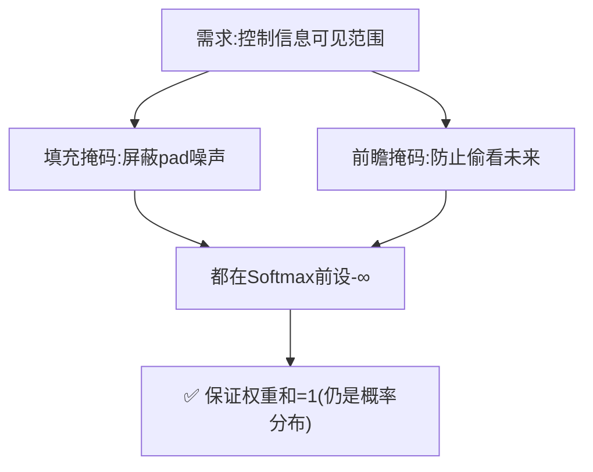

### 6.6.5 四个组件的"分工"总表

| 组件 | 补注意力的什么短板 | 核心目的 | 关键权衡 |
|------|------------------|---------|---------|
| FFN | 缺非线性、缺单词深加工 | 注入非线性 + 逐词提炼 | 中间维度大小=能力vs成本 |
| 残差连接 | 深了会梯度消失/退化 | 让"做深"成为可能 | 几乎无代价,纯收益 |
| 层归一化 | 数值漂移、训练不稳 | 稳住数值分布 | 选 LayerNorm 而非 BatchNorm |
| 掩码 | 会关注无效/未来的位置 | 控制信息可见范围 | 设-∞以保持概率分布性质 |

> 💡 **全局视角**:第 3 章的注意力是"发动机",但发动机不能单独上路。FFN 是"深加工车间",残差是"承重梁",归一化是"稳定器",掩码是"门禁"。四者合力,才让注意力从一个巧妙的想法,变成了能训练、能堆深、能实用的强大结构。

---

## 6.7 各组件的问题与解决办法

这些组件本身也不是完美的,它们又引出了新的问题和对应的改进。梳理这些"问题→解决",能让你理解现代大模型里那些改进的来龙去脉。

### 6.7.1 FFN 的问题:参数量和计算量的大头

**问题**:FFN 因为"放大 4 倍",参数量非常大——大模型里 FFN 通常占了总参数的约 2/3。它是显存和计算的主要消耗者。

**解决办法**:

- **MoE(混合专家)**:把一个大 FFN 换成很多个小 FFN(专家),每次只激活几个(第 12 章)。总容量巨大,但单次计算量可控。
- **更高效的激活(SwiGLU 等)**:用更好的激活函数在相同参数下提升效果。

### 6.7.2 残差 + 归一化的问题:摆放顺序影响训练稳定性

**问题**:残差和 LayerNorm 的先后顺序(Post-LN vs Pre-LN)会显著影响训练稳定性。原始的 **Post-LN** 在训练很深的模型时容易不稳定,需要小心的"学习率预热(warmup)"才能训起来。

**为什么会这样**:Post-LN 里,残差相加之后又过了一层 LayerNorm,使得那条"高速公路"不再完全畅通,深层时梯度容易失衡。

**解决办法**:改用 **Pre-LN**(把 LayerNorm 移到子层之前),让残差通路完全畅通,训练稳定性大幅提升。这也是现代大模型几乎都用 Pre-LN 的原因(6.3.5)。


### 6.7.3 LayerNorm 的问题:计算开销

**问题**:LayerNorm 每次要算均值和方差,有一定计算开销;在超大模型里,这个开销累积起来也不小。

**解决办法**:**RMSNorm**——省去"减均值"这一步,只用均方根(RMS)做缩放。计算更省,效果几乎不降。现代很多大模型(如 LLaMA)已改用 RMSNorm。

### 6.7.4 掩码的问题:实现细节多,易出错

**问题**:掩码是新手最容易写错的地方——维度对不齐、pad 掩码和前瞻掩码没正确叠加、把 0/1 含义搞反……都会导致模型"偷看"或"漏看"。

**解决办法**:

- 用成熟框架(PyTorch 的 `nn.Transformer`、`scaled_dot_product_attention`)内置的掩码支持,少自己造轮子。
- 调试时打印掩码矩阵和注意力权重,肉眼确认"该为 0 的位置确实为 0"(呼应第 9 章的调试技巧)。

### 6.7.5 "问题—解决"全景图

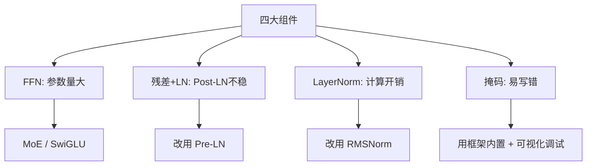

> 💡 **看清脉络**:这四个组件从原始 Transformer 到现代大模型,一路都在被优化——FFN→MoE、Post-LN→Pre-LN、LayerNorm→RMSNorm。理解"每个改进在解决原设计的什么问题",你就能读懂几乎所有现代大模型的架构改动。

---

## 6.8 本章小结

- **前馈网络(FFN)**:注意力后对每个词单独深加工,结构是"放大(常4倍)→ 非线性激活 → 缩小",给模型注入**非线性**;大模型的大部分参数都在这里。
- **残差连接**:把输入直接加到输出上,像给信息修"电梯";让子层只需学"变化量",解决深层网络梯度消失和退化,还能保底不变差。
- **层归一化(LayerNorm)**:对每个词向量自己做标准化(均值0方差1),与批次/句长无关;**Pre-LN**(归一化在前)训练更稳,是现代主流。
- **掩码机制**:填充掩码挡住无意义的 `<pad>`;前瞻掩码防止解码器"偷看未来的答案";都通过设 $-\infty$ 让 Softmax 后权重归零,两者可叠加。

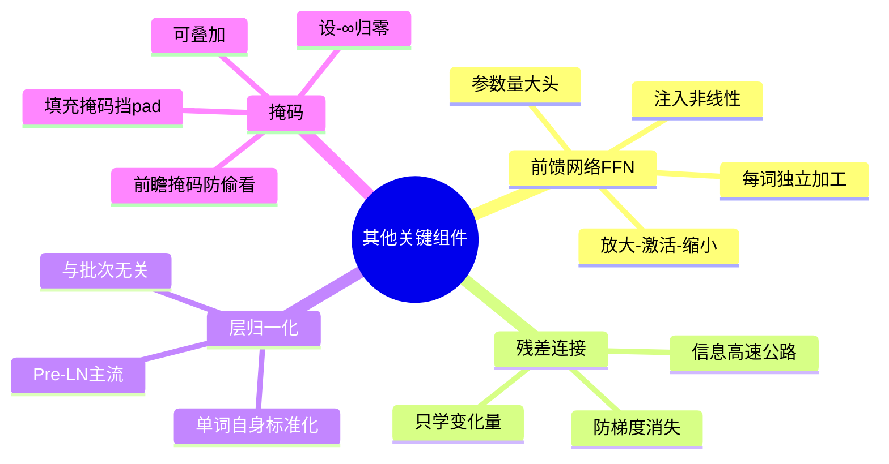

### 承上启下

到这里,Transformer 的**所有零件**都齐了:注意力、多头、位置编码、FFN、残差、归一化、掩码。下一章,我们就把这些零件**组装**成完整的 Encoder-Decoder 架构,看清一句话是如何从输入一路流到输出的。

---

📖 **上一章**:第 5 章 位置编码 ｜ **下一章**:第 7 章 Encoder-Decoder 完整结构
