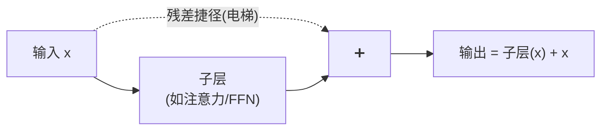
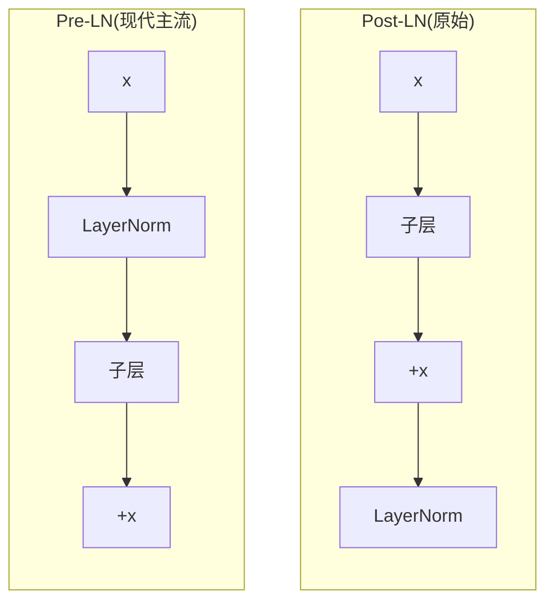
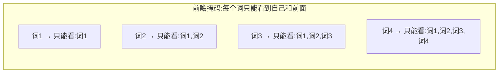
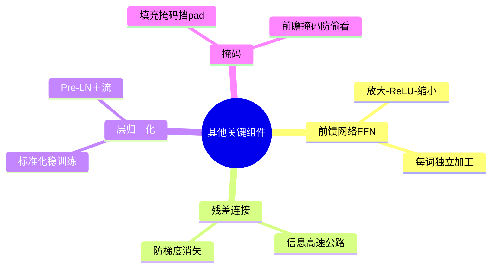

# 第 6 章 其他关键组件

> 主角(注意力)已经登场,配角也很重要。这一章介绍搭建 Transformer 必不可少的四个"配件":前馈网络、残差连接、层归一化、掩码机制。它们看似不起眼,却决定了模型能不能训得动、训得好。

---

## 6.1 前馈神经网络(Feed-Forward Network, FFN)

### 6.1.1 注意力之后,为什么还要一个 FFN

注意力做的事,本质是"**在词与词之间搬运、混合信息**"——它让每个词吸收了上下文。但它对每个词向量本身的"深加工"是有限的。

于是每个注意力层之后,都会接一个**前馈网络(FFN)**,对**每个词**的向量单独做一次非线性变换,进一步提炼特征。

**比喻**:注意力像开小组讨论会,大家交换意见(信息在词之间流动);FFN 则是散会后每个人**回到工位独立消化、深入思考**(对每个词单独加工)。

### 6.1.2 结构:先放大,再缩小

FFN 非常简单,就是两层全连接,中间夹一个激活函数:

$$
\text{FFN}(x) = \max(0, \, x W_1 + b_1) \, W_2 + b_2
$$

- 第一层把维度**放大**(比如 512 → 2048);
- 中间用 **ReLU** 激活(即 $\max(0, \cdot)$,把负数变 0,引入非线性);
- 第二层再**缩小**回原维度(2048 → 512)。

**比喻**:像"先把材料摊开铺大,方便充分加工,再收拢打包"。放大到高维空间,模型有更大的"施展空间"去学习复杂特征。


> 💡 **关键点**:FFN 对句子里**每个位置独立、且用同一套参数**处理。它不看别的词,只专注加工"自己"。

---

## 6.2 残差连接(Residual Connection)

### 6.2.1 深层网络的烦恼:越深越难训

Transformer 会把很多层叠在一起(比如 12 层、96 层)。但网络一深,就容易出现**梯度消失**——反向传播时,梯度传着传着就没了,底层几乎学不到东西。

### 6.2.2 残差连接:给信息修一条"高速公路"

残差连接的做法极其简单:**把某一层的输入,直接加到它的输出上**。

$$
\text{输出} = \text{子层}(x) + x
$$

**比喻:走楼梯 vs 电梯**。原本信息必须一层层"爬楼梯"(经过每一层的复杂变换),很累且容易掉队。残差连接相当于在旁边修了部**电梯**——信息可以"抄近路"直接往上传,不必每层都折腾一遍。



### 6.2.3 为什么有用

- **梯度畅通**:反向传播时,梯度可以通过这条"捷径"直接回流,不会消失,深层网络也能训得动。
- **保底不变差**:即使某一层没学到有用东西(子层输出接近 0),靠 $+x$ 也能把原始信息原样传下去,至少"不添乱"。

> 💡 **一句话**:残差连接是让深层网络能够成功训练的关键"发明",几乎所有现代深度模型都在用。

---

## 6.3 层归一化(Layer Normalization)与 Pre-LN / Post-LN

### 6.3.1 什么是归一化

神经网络在训练时,各层数值的大小、分布会剧烈波动,导致训练不稳定(忽大忽小,学得东倒西歪)。**归一化(Normalization)** 就是把数据重新"拉"到一个稳定、规整的范围(均值 0、方差 1 附近)。

**比喻**:考试成绩换算成"标准分"。不同科目分数范围不同(有的满分 100,有的满分 150),换算成统一标准后,才好公平比较、稳定处理。

### 6.3.2 层归一化:对"每个词自己"做归一化

**层归一化(LayerNorm)** 的特点是:对**单个样本(单个词向量)自己的所有特征维度**做归一化,不跨样本、不跨句子。

$$
\text{LayerNorm}(x) = \gamma \cdot \frac{x - \mu}{\sqrt{\sigma^2 + \epsilon}} + \beta
$$

**人话翻译**:算出这个词向量自己的均值 $\mu$ 和方差 $\sigma^2$,把它标准化;再用两个可学习的参数 $\gamma$(缩放)和 $\beta$(平移)做微调,让模型保留调整的自由。$\epsilon$ 是防止除以 0 的极小数。

> 📌 **补充**:为什么不用图像领域常见的 BatchNorm?因为 NLP 里句子长度不一、批次内差异大,BatchNorm 不稳定;而 LayerNorm 只看单个词自己,与批次大小、句子长短无关,更适合序列数据。

### 6.3.3 Post-LN vs Pre-LN:归一化放在哪

层归一化和残差连接经常搭配使用,但"归一化放在残差前还是后"有两种流派:

| 方案 | 结构(简化) | 特点 |
|------|-------------|------|
| **Post-LN**(原始论文) | `LayerNorm(x + 子层(x))` | 归一化在残差**之后**。效果好但训练不太稳,常需要"预热(warmup)"技巧 |
| **Pre-LN**(现代常用) | `x + 子层(LayerNorm(x))` | 归一化在残差**之前**。训练更稳定,是现在大模型的主流选择 |



> 💡 **入门记住结论即可**:现代大模型大多用 **Pre-LN**,因为它训练更稳定。

---

## 6.4 掩码机制(Padding Mask 与 Look-ahead Mask)

"掩码(Mask)"就是**挡住某些位置,不让注意力去关注它们**。Transformer 里有两种常用掩码,解决两个不同问题。

### 6.4.1 填充掩码(Padding Mask):挡住"凑数"的空位

计算机要求同一批句子长度一致,但真实句子长短不一。短句子只能用特殊符号 `<pad>` **填充**到一样长:

```
句子A: 我 爱 你 <pad> <pad>
句子B: 今 天 天 气  好
```

这些 `<pad>` 是没意义的"凑数"符号。如果让注意力去关注它们,会引入噪声。**填充掩码**就是告诉模型:"标了 pad 的位置,别理它。"

**做法**:把这些位置的注意力分数设成负无穷 $-\infty$,经过 Softmax 后权重就变成 0(回顾第 3 章代码里的 `masked_fill`)。

### 6.4.2 前瞻掩码(Look-ahead Mask):不许"偷看答案"

这个掩码只在**解码器(生成文本时)**用,非常关键。

想象模型在**逐字生成**一句话。当它写第 3 个字时,**只应该看到前 2 个字**,绝不能偷看到还没生成的第 4、5 个字——否则就是"抄答案作弊"了,训练出来的模型在真正生成时会失效。

**比喻**:考试时用一张纸盖住下面的题目,你只能看到已经做过的部分,看不到后面。

前瞻掩码就是这张"纸":它把每个位置**后面**的所有位置都挡住。形成一个"下三角"可见的模式:



可视化成矩阵(✅可见,❌被挡):

```
        看词1  看词2  看词3  看词4
词1      ✅     ❌     ❌     ❌
词2      ✅     ✅     ❌     ❌
词3      ✅     ✅     ✅     ❌
词4      ✅     ✅     ✅     ✅
```

### 6.4.3 PyTorch 生成前瞻掩码

```python
import torch

def create_look_ahead_mask(size):
    """生成前瞻掩码:下三角为1(可见),上三角为0(被挡)"""
    # torch.tril 取下三角矩阵
    mask = torch.tril(torch.ones(size, size))
    return mask   # (size, size)

mask = create_look_ahead_mask(4)
print(mask)
# tensor([[1., 0., 0., 0.],
#         [1., 1., 0., 0.],
#         [1., 1., 1., 0.],
#         [1., 1., 1., 1.]])
```

配合第 3 章的注意力函数,把 `mask == 0` 的位置填成 $-\infty$,Softmax 后这些位置权重为 0,就实现了"不许偷看后面"。

> 💡 **两种掩码对比**:填充掩码挡"无意义的空位"(编码器解码器都用);前瞻掩码挡"未来的答案"(只在解码器用)。第 7、8 章会看到它们的实际用武之地。

---

## 6.5 本章小结

- **前馈网络(FFN)**:注意力后对每个词单独深加工,结构是"放大→ReLU→缩小",像散会后各自回工位消化。
- **残差连接**:把输入直接加到输出上,像给信息修"电梯",解决深层网络梯度消失,还能保底不变差。
- **层归一化(LayerNorm)**:对每个词向量自己做标准化,稳定训练;**Pre-LN**(归一化在前)是现代主流。
- **掩码机制**:填充掩码挡住无意义的 `<pad>`;前瞻掩码防止解码器"偷看未来的答案"。



### 承上启下

到这里,Transformer 的**所有零件**都齐了:注意力、多头、位置编码、FFN、残差、归一化、掩码。下一章,我们就把这些零件**组装**成完整的 Encoder-Decoder 架构,看清一句话是如何从输入一路流到输出的。

---

📖 **上一章**:第 5 章 位置编码 ｜ **下一章**:第 7 章 Encoder-Decoder 完整结构
