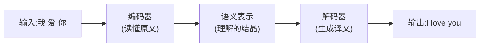
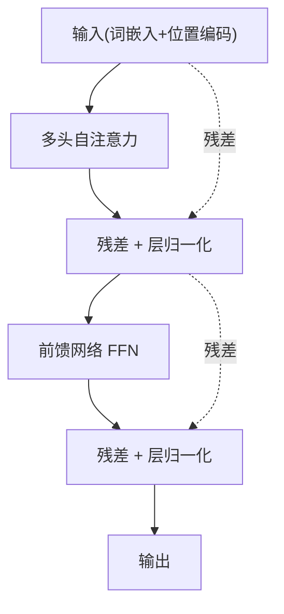
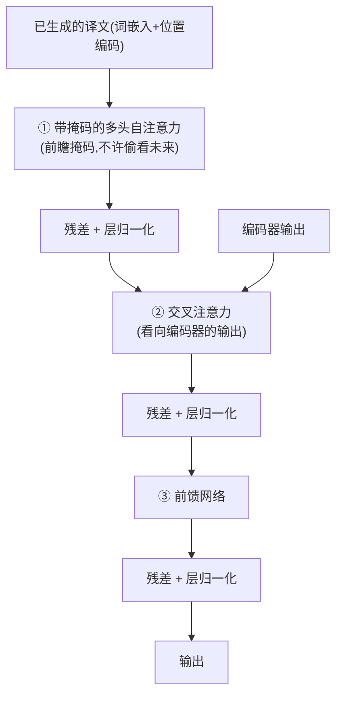
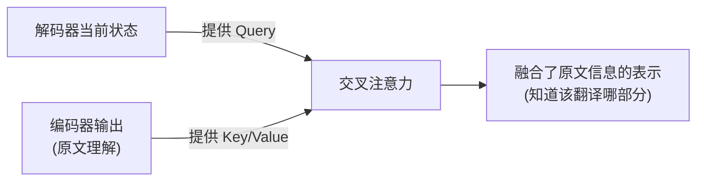
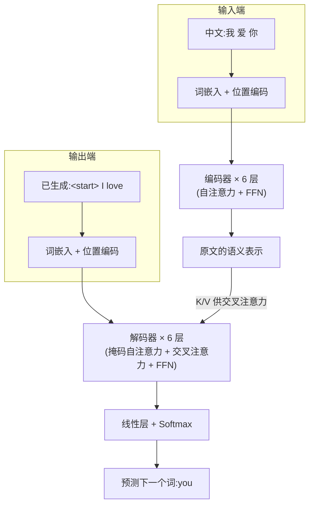
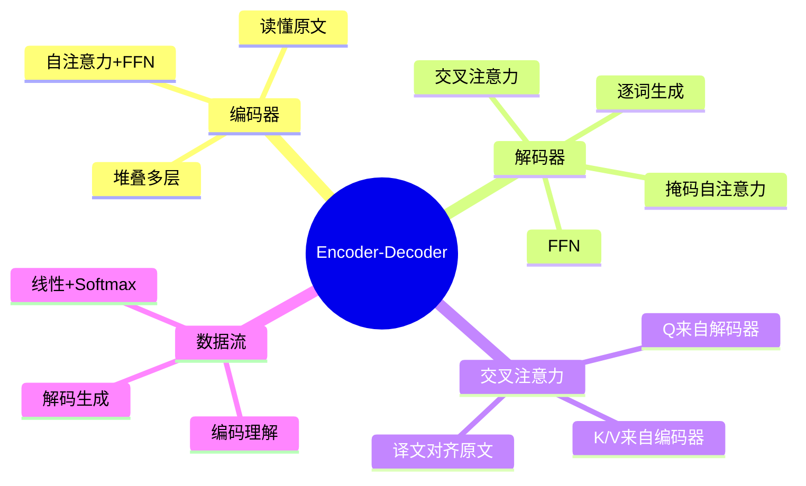

# 第 7 章 Encoder-Decoder 完整结构

> 零件都备齐了,这一章我们来"总装"。你会看到编码器和解码器分别长什么样、它们怎么协作,以及一句话("我爱你" → "I love you")是如何从输入一路流到输出的。这是把前面所有知识串起来的关键一章。

---

## 7.1 先看全景图:两大部件

原始 Transformer 是一个 **编码器-解码器(Encoder-Decoder)** 结构,专为翻译这类"输入一段、输出一段"的任务设计:

- **编码器(Encoder)**:负责**读懂**输入句子(比如中文"我爱你"),把它转成一堆富含语义的向量。
- **解码器(Decoder)**:负责**生成**输出句子(比如英文"I love you"),一个词一个词地写出来。

**比喻:翻译官的工作流程**

- 编码器 = 翻译官**听并理解**原文,在脑子里形成完整的意思。
- 解码器 = 翻译官**根据理解,用目标语言逐字说出**译文。

---

## 7.2 编码器(Encoder)的堆叠结构

### 7.2.1 一个编码器层里有什么

每个编码器层由**两个子层**组成,而且每个子层都配了第 6 章讲的"残差连接 + 层归一化":

1. **多头自注意力**:让每个词关注句子里的其他词,吸收上下文。
2. **前馈网络(FFN)**:对每个词单独深加工。

### 7.2.2 为什么要"堆叠"很多层

原始论文把 **6 个**这样的编码器层**首尾相连**堆起来(现代大模型甚至几十上百层)。

**比喻:流水线上的层层加工**。第一层可能只理解到浅层的词法、语法关系;信息往上传,越高层理解得越抽象、越深入(从"词"到"短语"到"整句语义")。层层堆叠,理解才够深刻。

> 💡 **注意**:编码器里用的是"填充掩码"(挡住 `<pad>`),但**不用前瞻掩码**——因为读原文时,允许每个词看到句子里所有词(包括后面的),这样理解才全面。

---

## 7.3 解码器(Decoder)的堆叠结构

解码器也是多层堆叠,但每层比编码器**多一个子层**,共**三个子层**:

1. **带掩码的多头自注意力**(Masked Self-Attention)
2. **多头交叉注意力**(Cross-Attention)—— 解码器独有,连接编码器
3. **前馈网络(FFN)**

### 7.3.1 第一个子层:带掩码的自注意力

解码器在生成译文时,也要让"已经生成的词"互相关注。但这里必须用第 6 章的**前瞻掩码**——生成第 3 个词时,只能看前 2 个,不能偷看还没生成的后面的词。

### 7.3.2 第三个子层:FFN

和编码器里的一样,对每个词单独深加工。真正特别的是中间那个"交叉注意力",下一节专门讲。

---

## 7.4 交叉注意力(Cross-Attention):编码器与解码器的桥梁

这是整个架构里最精妙的连接点——**解码器如何"参考"编码器读懂的原文**。

### 7.4.1 Q、K、V 来自哪里?

回顾第 3 章:注意力有 Query、Key、Value 三要素。交叉注意力的巧妙之处在于它们的**来源不同**:

| 要素 | 来源 | 含义 |
|------|------|------|
| **Query(Q)** | **解码器**自己(当前要生成的位置) | "我正要写下一个词,我该参考原文的哪部分?" |
| **Key / Value(K/V)** | **编码器**的输出(原文的理解) | "原文各个词提供的线索和内容" |

**比喻:一边看原文一边翻译**。翻译官写译文的每一个词时(Query),都会**回头看一眼原文**(Key/Value),找到当前最该翻译的那部分。比如要写 "love" 时,注意力会重点落在原文的 "爱" 上。

### 7.4.2 三种注意力对比

Transformer 里其实有三处注意力,别搞混:

| 位置 | 名称 | Q 来源 | K/V 来源 | 作用 |
|------|------|--------|----------|------|
| 编码器 | 自注意力 | 编码器 | 编码器 | 读懂原文内部关系 |
| 解码器第1层 | 带掩码自注意力 | 解码器 | 解码器 | 关注已生成的译文(不偷看未来) |
| 解码器第2层 | 交叉注意力 | 解码器 | **编码器** | 让译文对齐原文 |

---

## 7.5 从输入到输出的完整数据流

现在把所有环节串起来,看"我爱你 → I love you"的完整旅程。

### 分步拆解

1. **输入编码**:中文"我爱你"→ 每个字转成词嵌入,加上位置编码。
2. **编码器处理**:6 层编码器把它加工成一组富含语义的向量(原文的"理解结晶")。
3. **解码器起步**:从特殊起始符 `<start>` 开始,逐词生成。
4. **解码器每一步**:
   - 用掩码自注意力关注**已生成**的译文;
   - 用交叉注意力**回看原文**(编码器输出);
   - 经 FFN 加工。
5. **输出预测**:解码器输出经过一个**线性层 + Softmax**,变成词表上每个词的概率,选出概率最高的作为下一个词。
6. **循环**:把新生成的词接到已生成序列后面,重复第 4-5 步,直到生成结束符 `<end>`。

> 💡 **顶层结构补充**:解码器最后接的"线性层 + Softmax",作用是把向量映射到整个词表大小,给出"下一个词是词表里每个词的概率",从中挑出答案。这一步第 8 章讲生成策略时还会细说。

---

## 7.6 本章小结

- Transformer 是 **编码器-解码器** 结构:编码器**读懂**输入,解码器**生成**输出,像翻译官"先理解、再逐字说出译文"。
- **编码器层** = 多头自注意力 + FFN(各带残差和层归一化),堆叠多层逐渐加深理解。
- **解码器层** = 带掩码自注意力 + **交叉注意力** + FFN,比编码器多一个交叉注意力子层。
- **交叉注意力**是核心桥梁:Query 来自解码器,Key/Value 来自编码器,让译文能"回看原文对齐"。
- 完整数据流:输入编码 → 编码器理解 → 解码器逐词生成(掩码自注意力 + 交叉注意力)→ 线性层+Softmax 输出。

### 承上启下

架构图看懂了,但还有一个大问题:这个模型是**怎么训练出来的**?训练时和实际使用时(推理)有什么不同?为什么训练能并行、推理却要一个字一个字来?下一章 **训练与推理** 就来揭晓。

---

📖 **上一章**:第 6 章 其他关键组件 ｜ **下一章**:第 8 章 训练与推理
