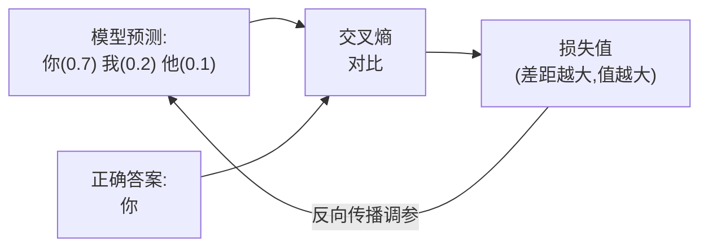
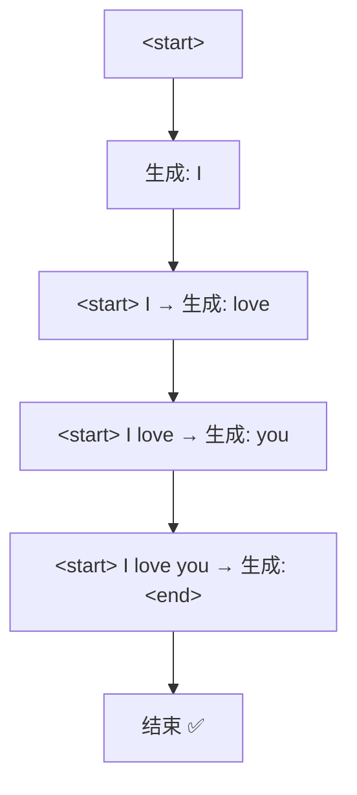
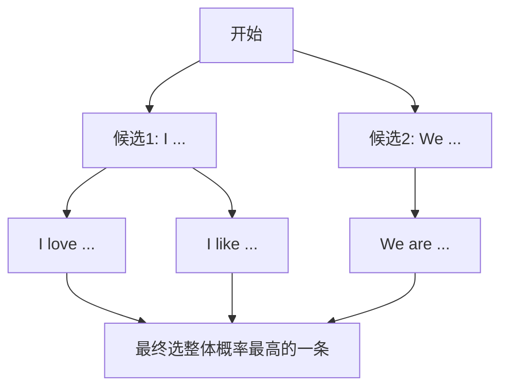
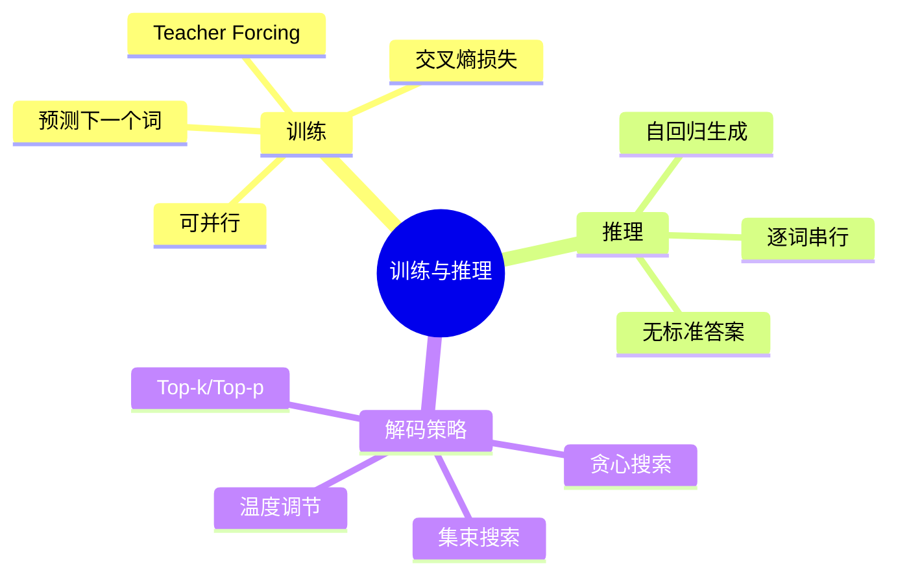

# 第 8 章 训练与推理

> 上一章看懂了架构图,但模型不会凭空变聪明。这一章讲两件事:**训练**(模型怎么从数据里学会翻译/生成)和**推理**(训好的模型实际怎么一个字一个字地输出)。你会发现,这两个阶段的"玩法"其实很不一样。

---

## 8.1 训练目标与损失函数

### 8.1.1 训练任务:预测下一个词

Transformer(尤其是生成类)训练时干的核心任务其实很朴素:**根据前面的词,预测下一个词该是什么**。

比如给定"我爱",让模型预测"你";给定"I love",让模型预测"you"。翻译、写作、对话,本质都是这种"预测下一个词"的接力。

### 8.1.2 损失函数:交叉熵

回顾第 7 章:解码器最后经过"线性层 + Softmax",输出的是**词表里每个词的概率**。训练时,我们希望"正确答案那个词"的概率越高越好。

衡量"预测概率分布"和"正确答案"差距的工具,就是**交叉熵损失(Cross-Entropy Loss)**。

**人话翻译**:如果模型给正确答案"你"打了 0.9 的高概率 → 损失小(做得好);如果只给了 0.1 → 损失大(做得差)。训练就是不断调参,让正确答案的概率尽量高。



---

## 8.2 Teacher Forcing:训练时的"标准答案喂养"

### 8.2.1 一个矛盾:生成第 3 个词要靠第 2 个词,可万一第 2 个错了?

解码器是逐词生成的,理论上第 3 个词依赖第 2 个词的输出。但训练初期模型很菜,如果第 2 个词就预测错了,错误会像滚雪球一样越滚越大,导致训练极慢、极不稳定。

### 8.2.2 解决办法:直接喂正确答案

**Teacher Forcing(教师强制)** 的做法是:训练时,**不管模型自己上一步预测对没对,都直接把"正确答案"喂给它作为下一步的输入。**

**比喻:老师带着学生做题**。学生写作文时,老师不让错误累积——每写一句,老师都按标准范文纠正,确保学生始终在"正确的上文"基础上学习下一句。

```mermaid
flowchart LR
    subgraph 训练(Teacher Forcing)
        direction LR
        GT1["正确答案: I"] --> P1["预测: love?"]
        GT2["正确答案: love"] --> P2["预测: you?"]
        GT3["正确答案: you"] --> P3["预测: &lt;end&gt;?"]
    end
```

注意上图:喂给模型的始终是**正确答案序列**(I, love, you),而不是模型自己的预测。

### 8.2.3 意外收获:训练可以并行!

因为整句的"正确输入"训练前就全知道了,配合第 6 章的**前瞻掩码**(保证每个位置只看它前面的),模型可以**一次性并行**地对所有位置做预测,不用像 RNN 那样一步步来。这正是 Transformer 训练飞快的重要原因。

> ⚠️ **副作用:曝光偏差(Exposure Bias)**。训练时模型总被喂正确答案,可真正使用时它只能依赖**自己**的(可能有错的)输出。这种"训练和使用环境不一致"的问题叫曝光偏差,是已知的一个小缺陷。

---

## 8.3 推理阶段的自回归生成

### 8.3.1 推理时没有标准答案可喂

训练结束、真正使用模型时(推理),**没有正确答案了**——要翻译的新句子,答案正是我们想求的。

所以推理时只能**自回归(Autoregressive)**地生成:把模型**自己**上一步生成的词,当作下一步的输入,一个接一个地往外"吐"。

**比喻:接龙**。写下第一个词,然后基于目前写出的全部内容决定下一个词,再把它接上,继续……直到写出结束符 `<end>`。



### 8.3.2 训练 vs 推理:一张对比表

| 对比项 | 训练阶段 | 推理阶段 |
|--------|----------|----------|
| 下一步的输入 | **正确答案**(Teacher Forcing) | 模型**自己**上一步的输出 |
| 是否并行 | ✅ 可并行(整句一次算) | ❌ 只能逐词(串行) |
| 是否有标准答案 | 有(用来算损失) | 无(答案正是要生成的) |
| 速度 | 快 | 相对慢 |

> 💡 **一句话记住**:训练像"开卷抄范文"(有答案、能并行);推理像"闭卷写作文"(靠自己、逐字来)。

---

## 8.4 解码策略:如何挑选下一个词

推理的每一步,模型都给出了"词表里每个词的概率"。到底选哪个?这就是**解码策略(Decoding Strategy)**,它直接影响生成文本的质量和风格。

### 8.4.1 贪心搜索(Greedy Search):每步都选最优

**做法**:每一步都选概率**最高**的那个词。

- **优点**:简单、快。
- **缺点**:太"短视"。当前最优不代表整句最优,容易生成呆板、重复的句子。

**比喻**:下棋只看眼前一步最赚的走法,可能因小失大。

### 8.4.2 集束搜索(Beam Search):同时保留多条候选路径

**做法**:每步不只留 1 个,而是保留概率最高的 **k 条**候选序列(k 叫 beam size),最后选整体概率最高的一条。

- **优点**:比贪心更全局,翻译等任务质量更好。
- **缺点**:计算量大;而且生成的文本可能过于"保守、套路化"。



### 8.4.3 采样策略:引入随机性,让生成更有创意

贪心和 Beam Search 偏"确定、保守"。写故事、聊天时,我们希望更**多样、有创意**,于是引入**随机采样**:

| 策略 | 做法 | 效果 |
|------|------|------|
| **Top-k 采样** | 只从概率最高的 k 个词里随机挑 | 限定在靠谱的候选内随机,兼顾质量与多样性 |
| **Top-p 采样**(核采样) | 从"累计概率达到 p"的最小词集合里随机挑 | 候选数量动态调整,更灵活 |
| **温度(Temperature)** | 调节概率分布的"陡峭程度" | 温度高→更随机大胆;温度低→更保守稳妥 |

> 💡 **温度的直觉**:温度像"创意旋钮"。调低(如 0.2),模型循规蹈矩、几乎每次答案一样;调高(如 1.2),模型天马行空、更有惊喜但也可能跑偏。你用大模型时的 `temperature` 参数就是这个。

### 8.4.4 怎么选?看任务

- **翻译、摘要**(要求准确):偏向 Beam Search 或低温度。
- **聊天、写作、头脑风暴**(要求多样):偏向 Top-p / Top-k + 适中温度。

---

## 8.5 本章小结

- 训练任务本质是**预测下一个词**,用**交叉熵损失**衡量预测与正确答案的差距,再反向传播调参。
- **Teacher Forcing**:训练时直接喂正确答案作为下一步输入,避免误差累积,还让训练能**并行**(配合前瞻掩码);副作用是**曝光偏差**。
- **推理**时没有答案,只能**自回归**:用模型自己上一步的输出作为下一步输入,逐词生成,无法并行。
- **解码策略**决定怎么挑词:**贪心**(快但短视)、**Beam Search**(全局但保守)、**Top-k/Top-p + 温度**(引入随机性,更有创意)。



### 承上启下

理论部分到此就完整了!是时候把前 8 章的知识变成**能跑的代码**了。下一章(第 9 章)是本资料最硬核也最有成就感的一章——我们用 PyTorch 从零把整个 Transformer 拼出来,并跑一个小小的翻译任务。

---

📖 **上一章**:第 7 章 Encoder-Decoder 完整结构 ｜ **下一章**:第 9 章 用 PyTorch 从零实现 Transformer
