# 第 8 章 训练与推理

> 上一章看懂了架构图,但模型不会凭空变聪明。这一章讲两件事:**训练**(模型怎么从数据里学会翻译/生成)和**推理**(训好的模型实际怎么一个字一个字地输出)。你会发现,这两个阶段的"玩法"其实很不一样。
>
> 📌 "训练和推理不一样"是本章最重要的认知。搞懂这个差异,你就理解了为什么 Transformer 训练飞快、推理却要逐字慢慢来。

---

## 8.0 本章导览

一句话预告:

> **训练时,模型"开卷考试"——正确答案全给它,还能一次并行算完整句;推理时,模型"闭卷答题"——没答案可抄,只能靠自己一个字一个字往外蹦。**

---

## 8.1 训练目标与损失函数

### 8.1.1 训练任务:预测下一个词

Transformer(尤其是生成类)训练时干的核心任务其实很朴素:**根据前面的词,预测下一个词该是什么**。

比如给定"我爱",让模型预测"你";给定"I love",让模型预测"you"。翻译、写作、对话,本质都是这种"预测下一个词"的接力。

这个任务的美妙之处在于:**它不需要人工标注**。任何一段现成的文本,都天然是训练数据——把前面的词当输入,把下一个词当答案就行。这就是为什么大模型能用"整个互联网的文本"来训练。

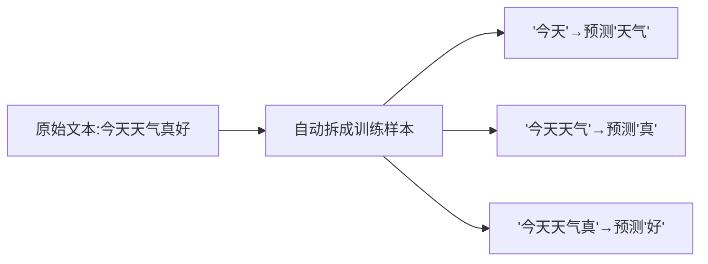

### 8.1.2 损失函数:交叉熵

回顾第 7 章:解码器最后经过"线性层 + Softmax",输出的是**词表里每个词的概率**。训练时,我们希望"正确答案那个词"的概率越高越好。

衡量"预测概率分布"和"正确答案"差距的工具,就是**交叉熵损失(Cross-Entropy Loss)**。

**人话翻译**:如果模型给正确答案"你"打了 0.9 的高概率 → 损失小(做得好);如果只给了 0.1 → 损失大(做得差)。训练就是不断调参,让正确答案的概率尽量高。

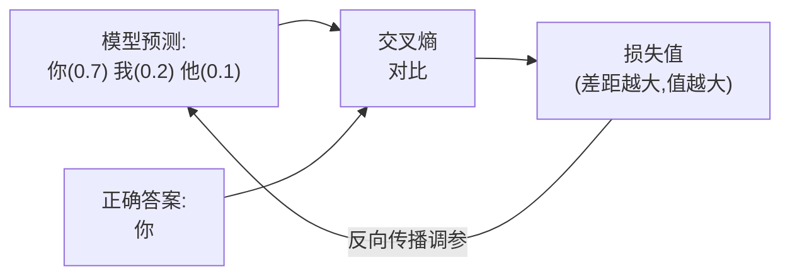

### 8.1.3 交叉熵的直觉:对"正确答案的概率"取负对数

交叉熵损失在这个场景下的公式,简化到只剩一项:

$$
\text{Loss} = -\log(p_{\text{正确词}})
$$

**人话翻译**:损失就是"模型给正确词的概率"取对数再加负号。看几个数值:

| 模型给正确词的概率 | $-\log(p)$ | 解读 |
|:---:|:---:|------|
| 0.99 | 0.01 | 几乎全对,损失极小 ✅ |
| 0.5 | 0.69 | 半信半疑,损失中等 |
| 0.1 | 2.30 | 很不确定,损失大 |
| 0.01 | 4.61 | 基本蒙错,损失巨大 ❌ |

可以看到:模型对正确答案越自信(概率越接近 1),损失越接近 0;越不确定,损失越大。这个"惩罚曲线"会驱使模型不断提高对正确词的信心。

> 💡 **为什么用 log?** 对数在概率接近 0 时会急剧变大(趋向无穷),这相当于对"把正确答案的概率压得很低"这种严重错误施加**极重的惩罚**,逼模型别犯离谱错误。

---

## 8.2 Teacher Forcing:训练时的"标准答案喂养"

### 8.2.1 一个矛盾:生成第 3 个词要靠第 2 个词,可万一第 2 个错了?

解码器是逐词生成的,理论上第 3 个词依赖第 2 个词的输出。但训练初期模型很菜,如果第 2 个词就预测错了,错误会像滚雪球一样越滚越大,导致训练极慢、极不稳定。

**打个比方**:让一个刚学写作的孩子写长篇作文,如果第一句就跑偏了,后面基于这个错误上文继续写,只会越写越离谱,根本没法从中学到正确的写法。

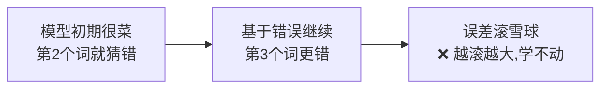

### 8.2.2 解决办法:直接喂正确答案

**Teacher Forcing(教师强制)** 的做法是:训练时,**不管模型自己上一步预测对没对,都直接把"正确答案"喂给它作为下一步的输入。**

**比喻:老师带着学生做题**。学生写作文时,老师不让错误累积——每写一句,老师都按标准范文纠正,确保学生始终在"正确的上文"基础上学习下一句。这样每一步的学习都是"干净"的,不受之前错误的污染。

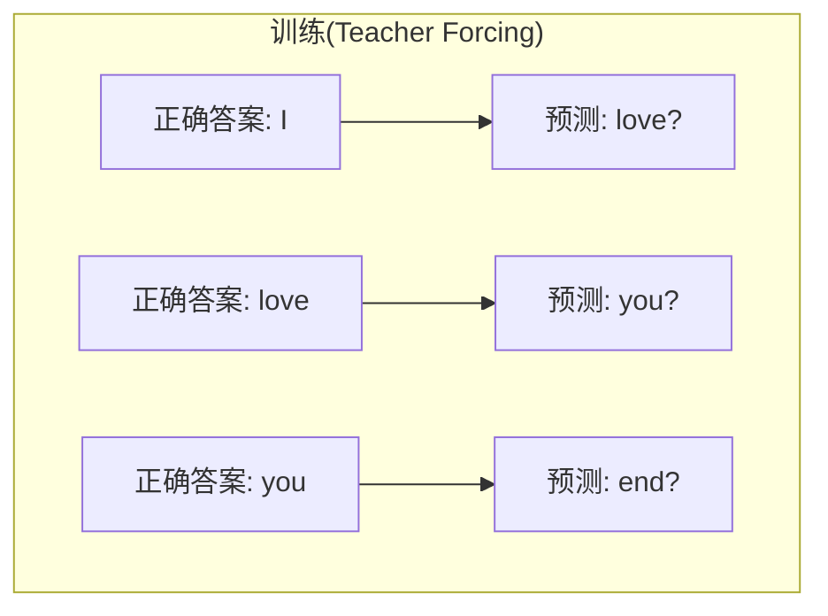

注意上图:喂给模型的始终是**正确答案序列**(I, love, you),而不是模型自己的预测。哪怕模型第一步把 "I" 预测成了 "We",下一步的输入依然是正确的 "I"。

### 8.2.3 意外收获:训练可以并行!

这是 Teacher Forcing 一个巨大的红利。因为整句的"正确输入"训练前就全知道了,配合第 6 章的**前瞻掩码**(保证每个位置只看它前面的),模型可以**一次性并行**地对所有位置做预测,不用像 RNN 那样一步步来。

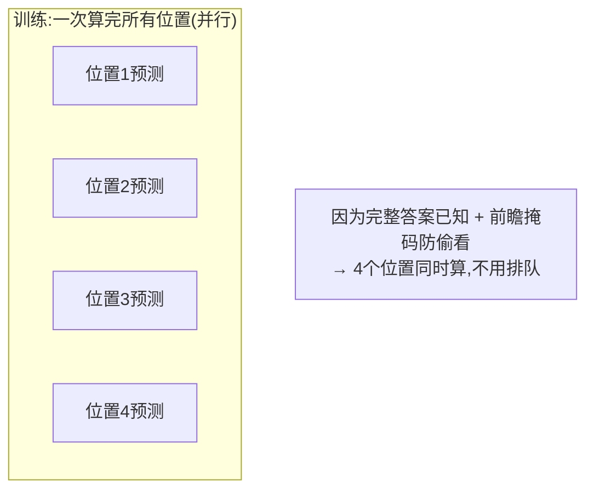

这正是 Transformer 训练飞快的重要原因——回想第 1 章,RNN 因为必须串行而慢,Transformer 靠 Teacher Forcing + 掩码,训练时把这个短板补上了。

> ⚠️ **副作用:曝光偏差(Exposure Bias)**。训练时模型总被喂正确答案,可真正使用时它只能依赖**自己**的(可能有错的)输出。这种"训练顺风顺水、上考场却要独自应对"的环境不一致,叫曝光偏差。它可能导致推理时一旦出错就"带偏"后续生成。这是已知的一个小缺陷,有一些缓解方法(如 Scheduled Sampling),但影响通常可接受。

---

## 8.3 推理阶段的自回归生成

### 8.3.1 推理时没有标准答案可喂

训练结束、真正使用模型时(推理),**没有正确答案了**——要翻译的新句子,答案正是我们想求的。

所以推理时只能**自回归(Autoregressive)**地生成:把模型**自己**上一步生成的词,当作下一步的输入,一个接一个地往外"吐"。

**比喻:接龙**。写下第一个词,然后基于目前写出的全部内容决定下一个词,再把它接上,继续……直到写出结束符 `<end>`。

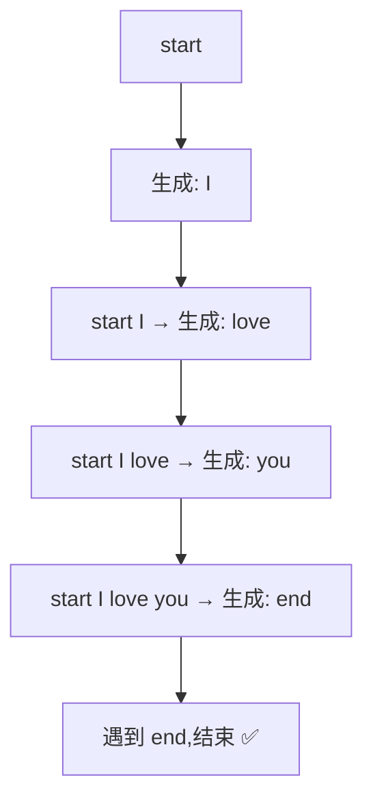

### 8.3.2 为什么推理必须串行(慢的根源)

关键区别:训练时完整答案已知,可以并行;推理时,**第 3 个词依赖第 2 个词的生成结果,第 2 个词还没生成出来,第 3 个就没法开始**。这就逼着推理必须一步一步来。

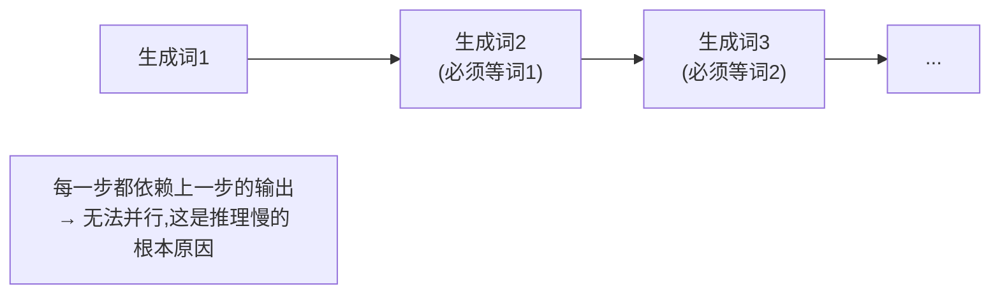

这也解释了为什么你用大模型时,回答是"一个字一个字蹦出来"的——它真的在逐词生成。

### 8.3.3 训练 vs 推理:一张对比表

| 对比项 | 训练阶段 | 推理阶段 |
|--------|----------|----------|
| 下一步的输入 | **正确答案**(Teacher Forcing) | 模型**自己**上一步的输出 |
| 是否并行 | ✅ 可并行(整句一次算) | ❌ 只能逐词(串行) |
| 是否有标准答案 | 有(用来算损失) | 无(答案正是要生成的) |
| 主要目的 | 调整参数(学习) | 产生输出(使用) |
| 速度 | 快 | 相对慢 |

> 💡 **一句话记住**:训练像"开卷抄范文"(有答案、能并行);推理像"闭卷写作文"(靠自己、逐字来)。

### 8.3.4 一个加速技巧:KV Cache(了解即可)

推理慢,有个重要的优化叫 **KV Cache**。既然每生成一个新词,前面那些词的 Key 和 Value 都不会变,那就把它们**缓存**起来,不用每步都重算。这能大幅加速自回归生成,是所有大模型推理引擎的标配。细节留到第 12 章,这里先埋个印象。

---

## 8.4 解码策略:如何挑选下一个词

推理的每一步,模型都给出了"词表里每个词的概率"。到底选哪个?这就是**解码策略(Decoding Strategy)**,它直接影响生成文本的质量和风格。

### 8.4.1 贪心搜索(Greedy Search):每步都选最优

**做法**:每一步都选概率**最高**的那个词。

- **优点**:简单、快。
- **缺点**:太"短视"。当前最优不代表整句最优,容易生成呆板、重复的句子(甚至陷入"我不知道我不知道我不知道…"的死循环)。

**比喻**:下棋只看眼前一步最赚的走法,可能因小失大。

**一个例子**:假设第一步"这"概率最高,但选了"这"之后,整句最好的接续其实不如从"那"开始的句子。贪心只顾眼前,就错过了全局更优解。

### 8.4.2 集束搜索(Beam Search):同时保留多条候选路径

**做法**:每步不只留 1 个,而是保留概率最高的 **k 条**候选序列(k 叫 beam size,束宽),最后选整体概率最高的一条。

- **优点**:比贪心更全局,翻译等任务质量更好。
- **缺点**:计算量大(要同时维护 k 条);而且生成的文本可能过于"保守、套路化"。

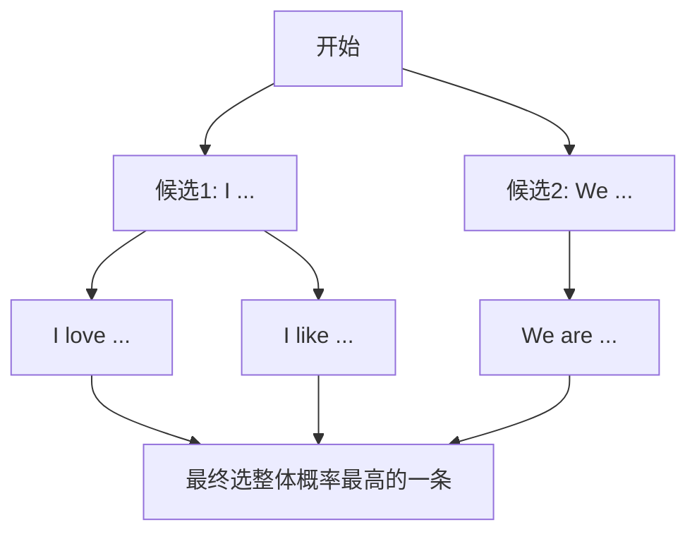

**比喻**:下棋时同时盘算 3 种走法各自的后续,走几步后再决定哪条路整体最好,而不是只看眼前一步。

### 8.4.3 采样策略:引入随机性,让生成更有创意

贪心和 Beam Search 偏"确定、保守"(同样输入几乎总是同样输出)。写故事、聊天时,我们希望更**多样、有创意**,于是引入**随机采样**——按概率"抽签"选词,而不是死选最高的。

| 策略 | 做法 | 效果 |
|------|------|------|
| **纯采样** | 完全按概率分布随机抽 | 最多样,但可能抽到很离谱的词 |
| **Top-k 采样** | 只从概率最高的 k 个词里随机挑 | 限定在靠谱的候选内随机,兼顾质量与多样性 |
| **Top-p 采样**(核采样) | 从"累计概率达到 p"的最小词集合里随机挑 | 候选数量动态调整,更灵活 |

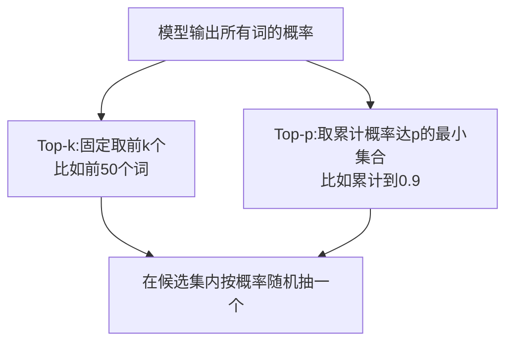

### 8.4.4 温度(Temperature):调节随机性的"创意旋钮"

**温度 $T$** 用来调节概率分布的"陡峭程度",在 Softmax 前把分数除以 $T$:

$$
\text{softmax}(z_i / T)
$$

- **温度低(如 0.2)**:分布变"尖",高概率词更突出 → 输出**保守、确定、可复现**。
- **温度高(如 1.2)**:分布变"平",低概率词也有机会 → 输出**多样、大胆、有惊喜(也可能跑偏)**。
- **温度 = 1**:保持原样。

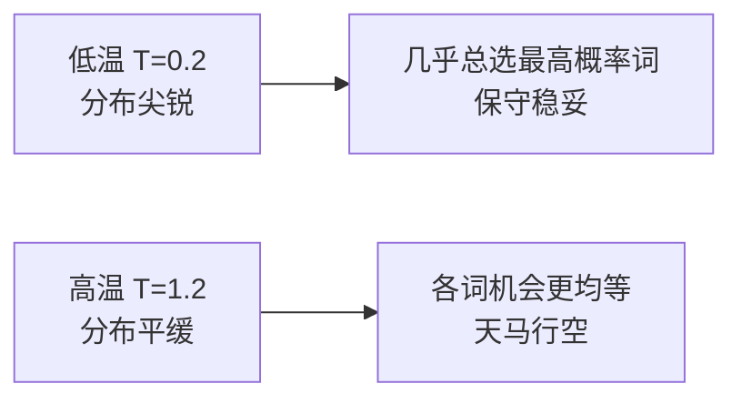

> 💡 **温度的直觉**:你用大模型时的 `temperature` 参数就是这个。想要严谨的代码/翻译,调低;想要有创意的故事/头脑风暴,调高。

### 8.4.5 怎么选?看任务

- **翻译、摘要、代码**(要求准确稳定):偏向 Beam Search 或低温度贪心。
- **聊天、写作、头脑风暴**(要求多样有趣):偏向 Top-p / Top-k + 适中温度(如 0.7~1.0)。

---

## 8.5 训练中的实用小技巧(了解即可)

真实训练一个 Transformer,还有几个几乎必备的"配料",简单认识一下:

| 技巧 | 作用 | 一句话 |
|------|------|--------|
| **学习率预热(Warmup)** | 训练初期先用小学习率,再逐渐升高 | 避免一开始就"步子太大"把模型带崩 |
| **Dropout** | 训练时随机"丢弃"一部分神经元 | 防止过拟合,增强泛化 |
| **标签平滑(Label Smoothing)** | 不让模型对正确答案 100% 自信 | 避免过度自信,提升泛化和校准 |
| **梯度裁剪(Gradient Clipping)** | 限制梯度的最大值 | 防止梯度"爆炸"导致训练不稳 |
| **Adam 优化器** | 自适应调整各参数的学习率 | 比朴素梯度下降收敛更快更稳 |

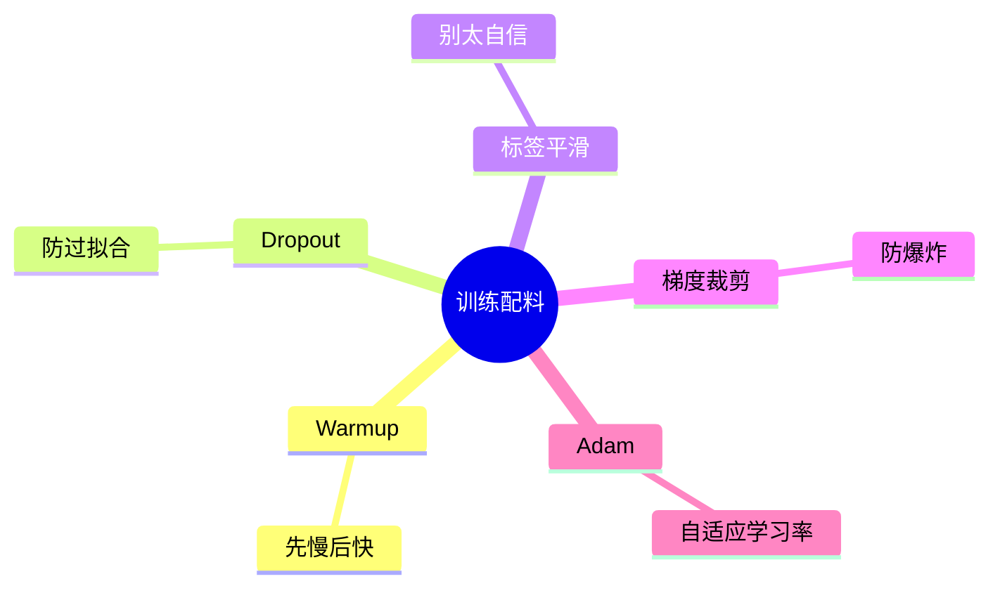

> 💡 **不用死记**:入门阶段知道"有这些东西、大致干嘛的"即可。真正训练时,大多数框架和开源配置都帮你设好了合理的默认值。

---

## 8.6 常见疑问 FAQ

**Q1:训练时用了前瞻掩码,那不就"看不到未来"了吗?怎么还能并行?**
两件事不矛盾。并行指的是"所有位置的预测**同时计算**";前瞻掩码保证每个位置**在计算时只用到它前面的信息**。就像全班同时开考(并行),但每人只能看自己的卷子(掩码),互不影响。

**Q2:曝光偏差有多严重?**
在多数任务里影响可控,现代大模型效果依然很好。它在生成很长的文本时更明显(错误可能累积)。有 Scheduled Sampling 等缓解方法,但不必过度担心。

**Q3:为什么 ChatGPT 每次回答都不太一样?**
因为它用了带随机性的**采样解码**(Top-p + 温度)。如果把温度设为 0(等价贪心),同样输入就会得到几乎相同的输出。

**Q4:Beam Search 一定比贪心好吗?**
在翻译、摘要等"有标准答案"的任务上通常更好。但在开放式生成(聊天、写作)上,Beam Search 反而容易产生重复、乏味的文本,采样策略往往更受欢迎。没有绝对的最优,要看任务。

**Q5:训练和推理用的是同一个模型吗?**
是同一套参数、同一个模型结构。区别只在于"喂什么输入"和"要不要算损失更新参数":训练喂正确答案、算损失、更新参数;推理喂自己的输出、不更新参数。

---

## 8.7 本章小结

- 训练任务本质是**预测下一个词**(无需人工标注),用**交叉熵损失** $-\log(p_{正确})$ 衡量预测与答案的差距,再反向传播调参。
- **Teacher Forcing**:训练时直接喂正确答案作为下一步输入,避免误差累积,还让训练能**并行**(配合前瞻掩码);副作用是**曝光偏差**。
- **推理**时没有答案,只能**自回归**逐词生成,因为每步依赖上一步输出,**无法并行**(这是推理慢的根源;KV Cache 可加速)。
- **解码策略**决定怎么挑词:**贪心**(快但短视)、**Beam Search**(全局但保守)、**Top-k/Top-p + 温度**(引入随机性,更有创意)。
- 真实训练还需 Warmup、Dropout、标签平滑、梯度裁剪、Adam 等"配料",入门了解即可。

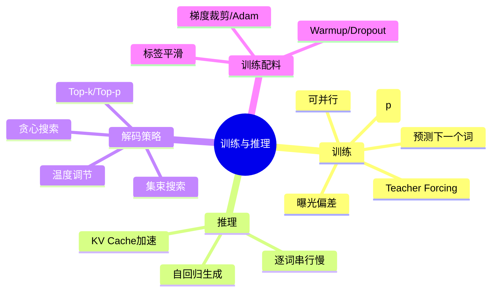

### 承上启下

理论部分到此就完整了!是时候把前 8 章的知识变成**能跑的代码**了。下一章(第 9 章)是本资料最硬核也最有成就感的一章——我们用 PyTorch 从零把整个 Transformer 拼出来,并跑一个小小的翻译任务。

---

📖 **上一章**:第 7 章 Encoder-Decoder 完整结构 ｜ **下一章**:第 9 章 用 PyTorch 从零实现 Transformer
