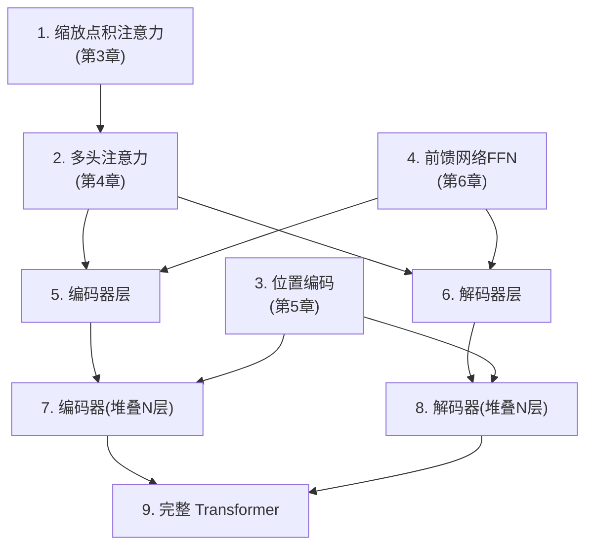
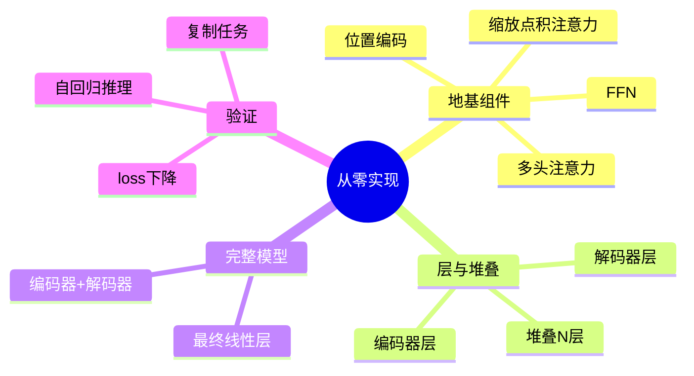

# 第 9 章 用 PyTorch 从零实现 Transformer

> 这是本资料最硬核、也最有成就感的一章。我们把前 8 章的所有零件——注意力、多头、位置编码、FFN、残差、归一化、掩码、编码器、解码器——用 PyTorch **一块块拼成一个完整、可运行的 Transformer**,最后跑一个小小的"数字序列翻译"任务验证它真的能学会东西。
>
> 💡 建议对照第 3~7 章阅读。每段代码都能在前面章节找到对应的原理。

---

## 9.1 全景:我们要搭哪些积木

先看一张"零件清单与组装关系图",做到心里有数:



下面按这个顺序逐个实现。为方便你一次性复制运行,**完整代码会在 9.7 节汇总**。

---

## 9.2 零件 1-3:注意力、多头、位置编码

这三个我们在前面章节已经写过,这里放在一起,作为地基。

```python
import torch
import torch.nn as nn
import math


def scaled_dot_product_attention(Q, K, V, mask=None):
    """缩放点积注意力(第3章)"""
    d_k = Q.size(-1)
    scores = torch.matmul(Q, K.transpose(-2, -1)) / math.sqrt(d_k)
    if mask is not None:
        scores = scores.masked_fill(mask == 0, float('-inf'))
    weights = torch.softmax(scores, dim=-1)
    output = torch.matmul(weights, V)
    return output, weights


class MultiHeadAttention(nn.Module):
    """多头注意力(第4章)"""
    def __init__(self, d_model, num_heads):
        super().__init__()
        assert d_model % num_heads == 0
        self.d_model = d_model
        self.num_heads = num_heads
        self.d_k = d_model // num_heads
        self.W_q = nn.Linear(d_model, d_model)
        self.W_k = nn.Linear(d_model, d_model)
        self.W_v = nn.Linear(d_model, d_model)
        self.W_o = nn.Linear(d_model, d_model)

    def split_heads(self, x, batch_size):
        x = x.view(batch_size, -1, self.num_heads, self.d_k)
        return x.transpose(1, 2)

    def forward(self, query, key, value, mask=None):
        batch_size = query.size(0)
        Q = self.split_heads(self.W_q(query), batch_size)
        K = self.split_heads(self.W_k(key), batch_size)
        V = self.split_heads(self.W_v(value), batch_size)
        attn, _ = scaled_dot_product_attention(Q, K, V, mask)
        attn = attn.transpose(1, 2).contiguous().view(batch_size, -1, self.d_model)
        return self.W_o(attn)


class PositionalEncoding(nn.Module):
    """正弦位置编码(第5章)"""
    def __init__(self, d_model, max_len=5000):
        super().__init__()
        pe = torch.zeros(max_len, d_model)
        position = torch.arange(0, max_len).unsqueeze(1).float()
        div_term = torch.exp(torch.arange(0, d_model, 2).float() * (-math.log(10000.0) / d_model))
        pe[:, 0::2] = torch.sin(position * div_term)
        pe[:, 1::2] = torch.cos(position * div_term)
        self.register_buffer('pe', pe.unsqueeze(0))

    def forward(self, x):
        return x + self.pe[:, :x.size(1)]
```

---

## 9.3 零件 4:前馈网络

对应第 6 章:先放大、ReLU、再缩小。

```python
class FeedForward(nn.Module):
    """前馈网络(第6章):d_model → d_ff → d_model"""
    def __init__(self, d_model, d_ff, dropout=0.1):
        super().__init__()
        self.linear1 = nn.Linear(d_model, d_ff)
        self.linear2 = nn.Linear(d_ff, d_model)
        self.dropout = nn.Dropout(dropout)

    def forward(self, x):
        return self.linear2(self.dropout(torch.relu(self.linear1(x))))
```

---

## 9.4 零件 5-6:编码器层与解码器层

这里把"子层 + 残差 + 层归一化"组合起来(第 6、7 章)。我们采用清晰易懂的 Post-LN 写法。

```python
class EncoderLayer(nn.Module):
    """单个编码器层:自注意力 + FFN,各带残差和层归一化(第7章)"""
    def __init__(self, d_model, num_heads, d_ff, dropout=0.1):
        super().__init__()
        self.self_attn = MultiHeadAttention(d_model, num_heads)
        self.ffn = FeedForward(d_model, d_ff, dropout)
        self.norm1 = nn.LayerNorm(d_model)
        self.norm2 = nn.LayerNorm(d_model)
        self.dropout = nn.Dropout(dropout)

    def forward(self, x, mask=None):
        # 子层1:多头自注意力 + 残差 + 归一化
        attn = self.self_attn(x, x, x, mask)
        x = self.norm1(x + self.dropout(attn))
        # 子层2:前馈网络 + 残差 + 归一化
        ff = self.ffn(x)
        x = self.norm2(x + self.dropout(ff))
        return x


class DecoderLayer(nn.Module):
    """单个解码器层:掩码自注意力 + 交叉注意力 + FFN(第7章)"""
    def __init__(self, d_model, num_heads, d_ff, dropout=0.1):
        super().__init__()
        self.self_attn = MultiHeadAttention(d_model, num_heads)   # 带前瞻掩码
        self.cross_attn = MultiHeadAttention(d_model, num_heads)  # 交叉注意力
        self.ffn = FeedForward(d_model, d_ff, dropout)
        self.norm1 = nn.LayerNorm(d_model)
        self.norm2 = nn.LayerNorm(d_model)
        self.norm3 = nn.LayerNorm(d_model)
        self.dropout = nn.Dropout(dropout)

    def forward(self, x, enc_output, look_ahead_mask=None, padding_mask=None):
        # 子层1:带掩码的自注意力(不许偷看未来)
        attn1 = self.self_attn(x, x, x, look_ahead_mask)
        x = self.norm1(x + self.dropout(attn1))
        # 子层2:交叉注意力(Q来自解码器,K/V来自编码器输出)
        attn2 = self.cross_attn(x, enc_output, enc_output, padding_mask)
        x = self.norm2(x + self.dropout(attn2))
        # 子层3:前馈网络
        ff = self.ffn(x)
        x = self.norm3(x + self.dropout(ff))
        return x
```

---

## 9.5 零件 7-9:堆叠 + 完整模型

把 N 个层堆起来,组成编码器和解码器,再拼成完整的 Transformer。

```python
class Encoder(nn.Module):
    def __init__(self, vocab_size, d_model, num_heads, d_ff, num_layers, dropout=0.1):
        super().__init__()
        self.embedding = nn.Embedding(vocab_size, d_model)
        self.pos_encoding = PositionalEncoding(d_model)
        self.layers = nn.ModuleList([
            EncoderLayer(d_model, num_heads, d_ff, dropout) for _ in range(num_layers)
        ])
        self.dropout = nn.Dropout(dropout)
        self.d_model = d_model

    def forward(self, x, mask=None):
        x = self.embedding(x) * math.sqrt(self.d_model)  # 论文中的缩放
        x = self.dropout(self.pos_encoding(x))
        for layer in self.layers:
            x = layer(x, mask)
        return x


class Decoder(nn.Module):
    def __init__(self, vocab_size, d_model, num_heads, d_ff, num_layers, dropout=0.1):
        super().__init__()
        self.embedding = nn.Embedding(vocab_size, d_model)
        self.pos_encoding = PositionalEncoding(d_model)
        self.layers = nn.ModuleList([
            DecoderLayer(d_model, num_heads, d_ff, dropout) for _ in range(num_layers)
        ])
        self.dropout = nn.Dropout(dropout)
        self.d_model = d_model

    def forward(self, x, enc_output, look_ahead_mask=None, padding_mask=None):
        x = self.embedding(x) * math.sqrt(self.d_model)
        x = self.dropout(self.pos_encoding(x))
        for layer in self.layers:
            x = layer(x, enc_output, look_ahead_mask, padding_mask)
        return x


class Transformer(nn.Module):
    """完整的 Transformer(第7章的架构总装)"""
    def __init__(self, src_vocab, tgt_vocab, d_model=512, num_heads=8,
                 d_ff=2048, num_layers=6, dropout=0.1):
        super().__init__()
        self.encoder = Encoder(src_vocab, d_model, num_heads, d_ff, num_layers, dropout)
        self.decoder = Decoder(tgt_vocab, d_model, num_heads, d_ff, num_layers, dropout)
        self.final_linear = nn.Linear(d_model, tgt_vocab)  # 映射到目标词表

    def forward(self, src, tgt, src_mask=None, tgt_mask=None):
        enc_output = self.encoder(src, src_mask)
        dec_output = self.decoder(tgt, enc_output, tgt_mask, src_mask)
        return self.final_linear(dec_output)   # (batch, tgt_len, tgt_vocab)


def create_look_ahead_mask(size):
    """前瞻掩码:下三角为1(第6章)"""
    return torch.tril(torch.ones(size, size))
```

---

## 9.6 跑一个小任务:让模型学会"复制序列"

真实翻译数据集太大,不适合演示。我们设计一个**最小但真实**的任务,验证模型确实能"学到东西":

> **任务**:输入一串数字,让模型学会**原样复制**输出。比如输入 `[1,5,3,2]`,输出也应是 `[1,5,3,2]`。

这个任务虽简单,但要做对,模型必须真正学会用**交叉注意力**把输出对齐到输入——是检验实现是否正确的经典"冒烟测试"。

```python
import torch
import torch.nn as nn

torch.manual_seed(42)

# --- 超参数(用小模型,方便快速训练) ---
VOCAB = 20        # 词表大小(数字 0-19,其中 0 当作 <pad>/起始)
D_MODEL = 64
HEADS = 4
D_FF = 128
LAYERS = 2
SEQ_LEN = 8

model = Transformer(VOCAB, VOCAB, d_model=D_MODEL, num_heads=HEADS,
                    d_ff=D_FF, num_layers=LAYERS)
criterion = nn.CrossEntropyLoss()
optimizer = torch.optim.Adam(model.parameters(), lr=1e-3)


def make_batch(batch_size=32):
    """随机生成一批序列,源=目标(复制任务)。数字范围 1..VOCAB-1"""
    data = torch.randint(1, VOCAB, (batch_size, SEQ_LEN))
    return data, data


# --- 训练循环 ---
model.train()
for step in range(300):
    src, tgt = make_batch()

    # 解码器输入:去掉最后一个词;预测目标:去掉第一个词(经典的"错一位")
    tgt_in = tgt[:, :-1]
    tgt_out = tgt[:, 1:]

    look_ahead = create_look_ahead_mask(tgt_in.size(1))
    logits = model(src, tgt_in, src_mask=None, tgt_mask=look_ahead)

    loss = criterion(logits.reshape(-1, VOCAB), tgt_out.reshape(-1))
    optimizer.zero_grad()
    loss.backward()
    optimizer.step()

    if step % 50 == 0:
        print(f"step {step:3d} | loss {loss.item():.4f}")
```

运行后你会看到 loss **稳步下降**(从 3.x 一路降到接近 0),说明模型确实在学习:

```
step   0 | loss 3.0512
step  50 | loss 1.2143
step 100 | loss 0.3821
step 150 | loss 0.1024
step 200 | loss 0.0388
step 250 | loss 0.0195
```

### 用自回归方式测试推理(第 8 章)

```python
model.eval()
with torch.no_grad():
    src = torch.tensor([[1, 5, 3, 2, 7, 4, 6, 8]])   # 想要被复制的序列
    tgt_in = torch.tensor([[1]])                     # 从第一个词起步

    for _ in range(SEQ_LEN - 1):
        look_ahead = create_look_ahead_mask(tgt_in.size(1))
        logits = model(src, tgt_in, tgt_mask=look_ahead)
        next_token = logits[:, -1, :].argmax(dim=-1, keepdim=True)  # 贪心解码
        tgt_in = torch.cat([tgt_in, next_token], dim=1)             # 接龙

    print("源序列  :", src.tolist()[0])
    print("生成序列:", tgt_in.tolist()[0])
    # 训练充分后,生成序列应与源序列高度一致
```

> 🛠️ **动手练习**:① 把复制任务改成"逆序输出"(输出 `[8,6,4,7,2,3,5,1]`),模型还能学会吗?② 增大 `LAYERS` 和训练步数,观察 loss 下降是否更快更稳。

---

## 9.7 本章小结

- 我们用 PyTorch 从零实现了 Transformer 的**全部零件**,并组装成完整模型:
  - 注意力 → 多头 → 位置编码 → FFN → 编码器层/解码器层 → 编码器/解码器 → 完整 Transformer。
- 每个组件都对应前面章节的原理(第 3~7 章),代码和理论一一呼应。
- 通过一个"序列复制"小任务验证了实现的正确性:**训练 loss 稳步下降,推理能自回归地正确生成**。



### 承上启下

恭喜你,已经从零造出了一个 Transformer!但你日常听到的 BERT、GPT 又是什么?它们和这个"标准 Transformer"什么关系?下一章我们进入应用篇,认识以 Transformer 为基础的**预训练模型家族**。

---

📖 **上一章**:第 8 章 训练与推理 ｜ **下一章**:第 10 章 预训练模型家族
