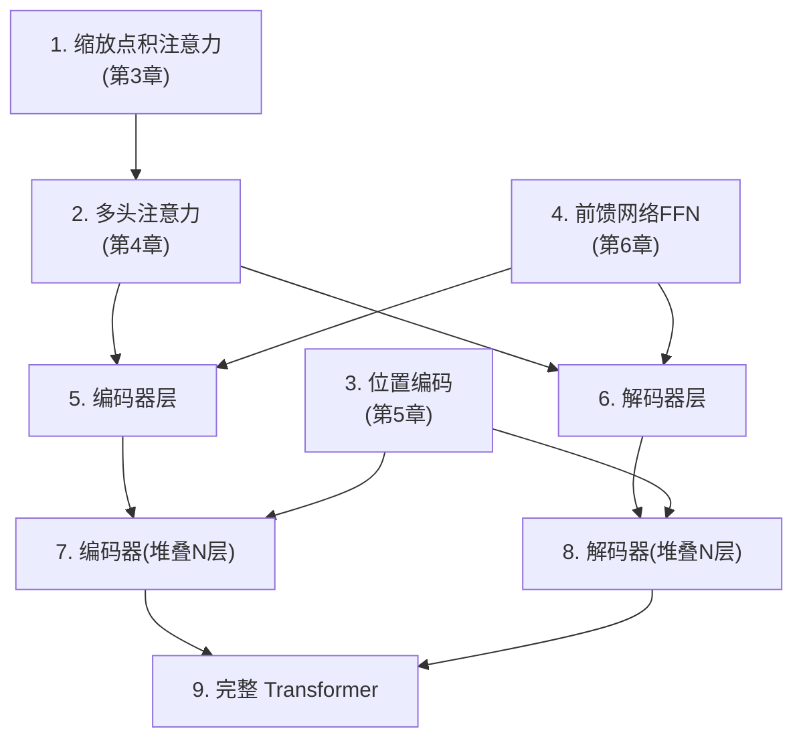
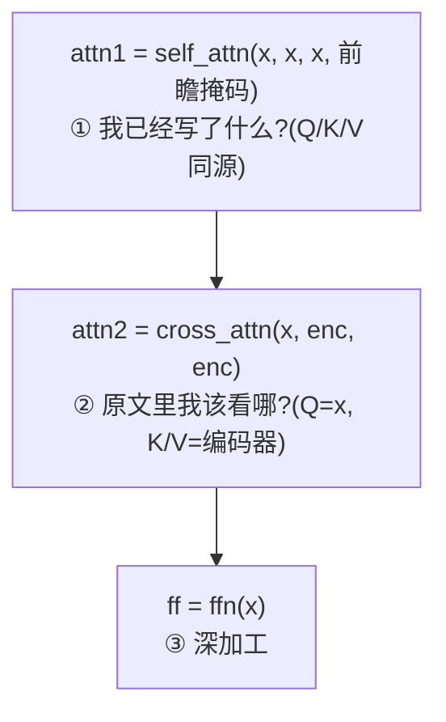
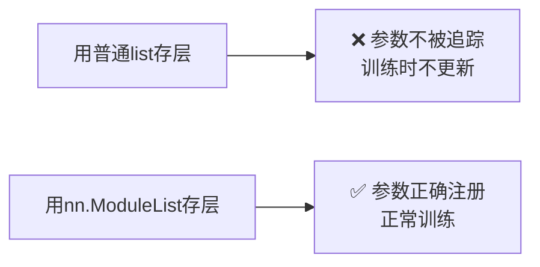
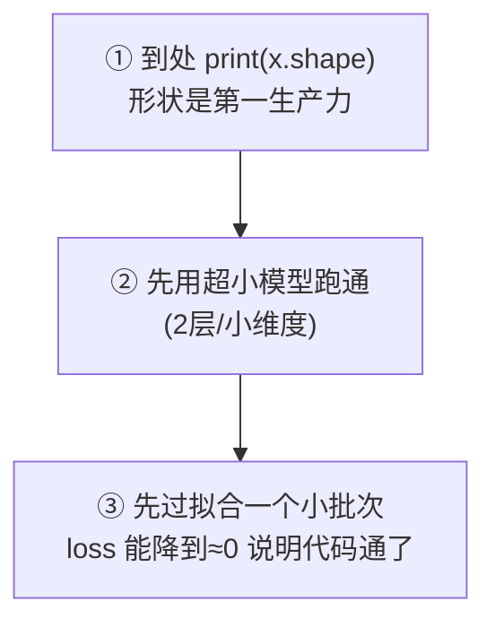
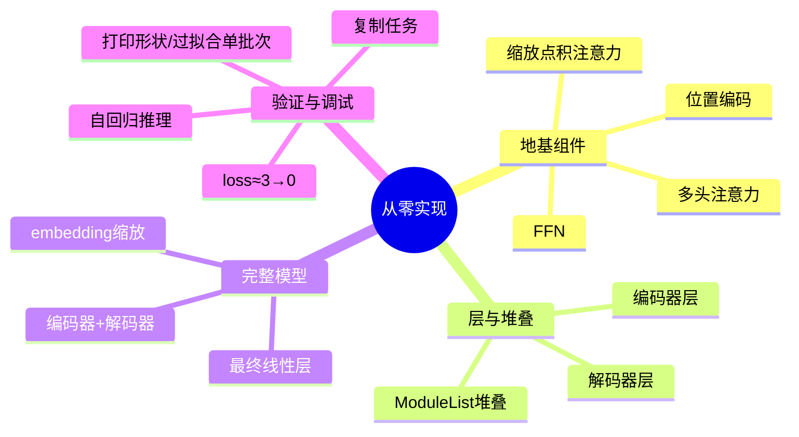

# 第 9 章 用 PyTorch 从零实现 Transformer

> 这是本资料最硬核、也最有成就感的一章。我们把前 8 章的所有零件——注意力、多头、位置编码、FFN、残差、归一化、掩码、编码器、解码器——用 PyTorch **一块块拼成一个完整、可运行的 Transformer**,最后跑一个小小的"序列翻译"任务验证它真的能学会东西。
>
> 💡 建议对照第 3~7 章阅读。每段代码都能在前面章节找到对应的原理。跟着敲一遍,胜过读十遍。

---

## 9.0 本章导览


> 📌 **学习建议**:第一遍先通读理解结构;第二遍把代码复制到本地(或 Colab)真正跑起来;第三遍尝试 9.8 的动手练习去"魔改"它。

---

## 9.1 环境准备与全景图

### 9.1.1 环境准备

本章代码只依赖 PyTorch(可视化部分需要 matplotlib)。安装:

```bash
pip install torch matplotlib
```

无需 GPU——本章的演示模型很小,用 CPU 几秒就能训练完。如果你有 GPU 会更快,但不是必需的。

### 9.1.2 全景:我们要搭哪些积木

先看一张"零件清单与组装关系图",做到心里有数:



**从底向上搭积木的顺序**:先造最小的零件(注意力),再用它拼出中等零件(编码器层、解码器层),最后堆叠组装成完整模型。这种"自底向上"的构建方式,也是阅读任何复杂代码库的好思路。

---

## 9.2 零件 1-3:注意力、多头、位置编码

这三个我们在前面章节已经写过,这里放在一起,作为地基。

```python
import torch
import torch.nn as nn
import math


def scaled_dot_product_attention(Q, K, V, mask=None):
    """缩放点积注意力(第3章)"""
    d_k = Q.size(-1)
    scores = torch.matmul(Q, K.transpose(-2, -1)) / math.sqrt(d_k)
    if mask is not None:
        scores = scores.masked_fill(mask == 0, float('-inf'))
    weights = torch.softmax(scores, dim=-1)
    output = torch.matmul(weights, V)
    return output, weights


class MultiHeadAttention(nn.Module):
    """多头注意力(第4章)"""
    def __init__(self, d_model, num_heads):
        super().__init__()
        assert d_model % num_heads == 0
        self.d_model = d_model
        self.num_heads = num_heads
        self.d_k = d_model // num_heads
        self.W_q = nn.Linear(d_model, d_model)
        self.W_k = nn.Linear(d_model, d_model)
        self.W_v = nn.Linear(d_model, d_model)
        self.W_o = nn.Linear(d_model, d_model)

    def split_heads(self, x, batch_size):
        x = x.view(batch_size, -1, self.num_heads, self.d_k)
        return x.transpose(1, 2)

    def forward(self, query, key, value, mask=None):
        batch_size = query.size(0)
        Q = self.split_heads(self.W_q(query), batch_size)
        K = self.split_heads(self.W_k(key), batch_size)
        V = self.split_heads(self.W_v(value), batch_size)
        attn, _ = scaled_dot_product_attention(Q, K, V, mask)
        attn = attn.transpose(1, 2).contiguous().view(batch_size, -1, self.d_model)
        return self.W_o(attn)


class PositionalEncoding(nn.Module):
    """正弦位置编码(第5章)"""
    def __init__(self, d_model, max_len=5000):
        super().__init__()
        pe = torch.zeros(max_len, d_model)
        position = torch.arange(0, max_len).unsqueeze(1).float()
        div_term = torch.exp(torch.arange(0, d_model, 2).float() * (-math.log(10000.0) / d_model))
        pe[:, 0::2] = torch.sin(position * div_term)
        pe[:, 1::2] = torch.cos(position * div_term)
        self.register_buffer('pe', pe.unsqueeze(0))

    def forward(self, x):
        return x + self.pe[:, :x.size(1)]
```

### 9.2.1 关于 `nn.Module` 的两个约定

如果你是 PyTorch 新手,这里解释两个反复出现的写法:

- **`__init__` 里定义"零件"**:所有带参数的层(如 `nn.Linear`)都要在 `__init__` 里创建,PyTorch 才能自动追踪它们的参数并训练。
- **`forward` 里定义"数据怎么流"**:前向计算的逻辑写在 `forward` 方法里。你**不需要**手写反向传播——PyTorch 的 autograd 会根据 `forward` 自动求导。


---

## 9.3 零件 4:前馈网络

对应第 6 章:先放大、ReLU、再缩小。

```python
class FeedForward(nn.Module):
    """前馈网络(第6章):d_model → d_ff → d_model"""
    def __init__(self, d_model, d_ff, dropout=0.1):
        super().__init__()
        self.linear1 = nn.Linear(d_model, d_ff)     # 放大,如 512→2048
        self.linear2 = nn.Linear(d_ff, d_model)     # 缩小,如 2048→512
        self.dropout = nn.Dropout(dropout)

    def forward(self, x):
        # relu 引入非线性;dropout 防过拟合
        return self.linear2(self.dropout(torch.relu(self.linear1(x))))
```

这段代码几乎就是第 6 章公式 $\text{FFN}(x)=\max(0, xW_1+b_1)W_2+b_2$ 的直译:`linear1` 是 $W_1$,`torch.relu` 是 $\max(0,\cdot)$,`linear2` 是 $W_2$。

---

## 9.4 零件 5-6:编码器层与解码器层

这里把"子层 + 残差 + 层归一化"组合起来(第 6、7 章)。我们采用清晰易懂的 Post-LN 写法。

```python
class EncoderLayer(nn.Module):
    """单个编码器层:自注意力 + FFN,各带残差和层归一化(第7章)"""
    def __init__(self, d_model, num_heads, d_ff, dropout=0.1):
        super().__init__()
        self.self_attn = MultiHeadAttention(d_model, num_heads)
        self.ffn = FeedForward(d_model, d_ff, dropout)
        self.norm1 = nn.LayerNorm(d_model)
        self.norm2 = nn.LayerNorm(d_model)
        self.dropout = nn.Dropout(dropout)

    def forward(self, x, mask=None):
        # 子层1:多头自注意力 + 残差 + 归一化
        attn = self.self_attn(x, x, x, mask)
        x = self.norm1(x + self.dropout(attn))     # 注意这里的 x + ... 就是残差
        # 子层2:前馈网络 + 残差 + 归一化
        ff = self.ffn(x)
        x = self.norm2(x + self.dropout(ff))
        return x


class DecoderLayer(nn.Module):
    """单个解码器层:掩码自注意力 + 交叉注意力 + FFN(第7章)"""
    def __init__(self, d_model, num_heads, d_ff, dropout=0.1):
        super().__init__()
        self.self_attn = MultiHeadAttention(d_model, num_heads)   # 带前瞻掩码
        self.cross_attn = MultiHeadAttention(d_model, num_heads)  # 交叉注意力
        self.ffn = FeedForward(d_model, d_ff, dropout)
        self.norm1 = nn.LayerNorm(d_model)
        self.norm2 = nn.LayerNorm(d_model)
        self.norm3 = nn.LayerNorm(d_model)
        self.dropout = nn.Dropout(dropout)

    def forward(self, x, enc_output, look_ahead_mask=None, padding_mask=None):
        # 子层1:带掩码的自注意力(不许偷看未来)—— Q/K/V 都来自解码器自己
        attn1 = self.self_attn(x, x, x, look_ahead_mask)
        x = self.norm1(x + self.dropout(attn1))
        # 子层2:交叉注意力 —— Q 来自解码器(x),K/V 来自编码器输出
        attn2 = self.cross_attn(x, enc_output, enc_output, padding_mask)
        x = self.norm2(x + self.dropout(attn2))
        # 子层3:前馈网络
        ff = self.ffn(x)
        x = self.norm3(x + self.dropout(ff))
        return x
```

### 9.4.1 对照第 7 章:解码器的三个子层

看 `DecoderLayer.forward` 的三步,正好对应第 7 章讲的解码器三子层:



**重点看 `cross_attn` 那一行**:它的 Q 是解码器的 `x`,而 K、V 都是编码器的输出 `enc_output`——这就是第 7 章交叉注意力"Q 来自解码器、K/V 来自编码器"在代码里的直接体现。

---

## 9.5 零件 7-9:堆叠 + 完整模型

把 N 个层堆起来,组成编码器和解码器,再拼成完整的 Transformer。

```python
class Encoder(nn.Module):
    def __init__(self, vocab_size, d_model, num_heads, d_ff, num_layers, dropout=0.1):
        super().__init__()
        self.embedding = nn.Embedding(vocab_size, d_model)
        self.pos_encoding = PositionalEncoding(d_model)
        self.layers = nn.ModuleList([
            EncoderLayer(d_model, num_heads, d_ff, dropout) for _ in range(num_layers)
        ])
        self.dropout = nn.Dropout(dropout)
        self.d_model = d_model

    def forward(self, x, mask=None):
        x = self.embedding(x) * math.sqrt(self.d_model)  # 论文中的缩放
        x = self.dropout(self.pos_encoding(x))
        for layer in self.layers:
            x = layer(x, mask)
        return x


class Decoder(nn.Module):
    def __init__(self, vocab_size, d_model, num_heads, d_ff, num_layers, dropout=0.1):
        super().__init__()
        self.embedding = nn.Embedding(vocab_size, d_model)
        self.pos_encoding = PositionalEncoding(d_model)
        self.layers = nn.ModuleList([
            DecoderLayer(d_model, num_heads, d_ff, dropout) for _ in range(num_layers)
        ])
        self.dropout = nn.Dropout(dropout)
        self.d_model = d_model

    def forward(self, x, enc_output, look_ahead_mask=None, padding_mask=None):
        x = self.embedding(x) * math.sqrt(self.d_model)
        x = self.dropout(self.pos_encoding(x))
        for layer in self.layers:
            x = layer(x, enc_output, look_ahead_mask, padding_mask)
        return x


class Transformer(nn.Module):
    """完整的 Transformer(第7章的架构总装)"""
    def __init__(self, src_vocab, tgt_vocab, d_model=512, num_heads=8,
                 d_ff=2048, num_layers=6, dropout=0.1):
        super().__init__()
        self.encoder = Encoder(src_vocab, d_model, num_heads, d_ff, num_layers, dropout)
        self.decoder = Decoder(tgt_vocab, d_model, num_heads, d_ff, num_layers, dropout)
        self.final_linear = nn.Linear(d_model, tgt_vocab)  # 映射到目标词表

    def forward(self, src, tgt, src_mask=None, tgt_mask=None):
        enc_output = self.encoder(src, src_mask)
        dec_output = self.decoder(tgt, enc_output, tgt_mask, src_mask)
        return self.final_linear(dec_output)   # (batch, tgt_len, tgt_vocab)


def create_look_ahead_mask(size):
    """前瞻掩码:下三角为1(第6章)"""
    return torch.tril(torch.ones(size, size))
```

### 9.5.1 两个容易被忽略的细节

**① 为什么 embedding 要乘 `math.sqrt(d_model)`?**
这是原论文的一个小技巧。词嵌入初始化时数值较小,乘以 $\sqrt{d_{model}}$ 把它放大,使其数量级和位置编码(范围 -1~1)相当,两者相加时不会一方压倒另一方。

**② `nn.ModuleList` vs 普通 Python list**
必须用 `nn.ModuleList` 来存放多个层,不能用普通 `[]`。否则 PyTorch 追踪不到里面各层的参数,训练时它们不会被更新。这是新手常踩的坑。



---

## 9.6 数一数:这个模型有多少参数?

理解"参数量从哪来",能帮你建立对模型规模的直觉。以标准配置 $d_{model}=512, d_{ff}=2048, \text{层数}=6$ 为例,估算单个编码器层的参数:

| 组件 | 参数量(约) | 说明 |
|------|-----------|------|
| 多头注意力(4 个矩阵 $W^Q,W^K,W^V,W^O$) | $4 \times 512 \times 512 ≈ 105$ 万 | 每个都是 512×512 |
| FFN(两个线性层) | $2 \times 512 \times 2048 ≈ 210$ 万 | 放大再缩小,参数大头 |
| LayerNorm 等 | 少量 | 可忽略 |
| **单层合计** | **约 315 万** | |

可以看到:**FFN 占了单层参数的约 2/3**——这印证了第 6 章说的"大模型的参数大头在 FFN"。6 层编码器 + 6 层解码器,加上词嵌入表,一个"base 版"Transformer 参数量在几千万到 1 亿级别。

> 💡 **规模直觉**:我们 9.7 节的演示模型只有几十万参数(玩具级);BERT-base 约 1.1 亿;GPT-3 有 1750 亿;最新的大模型上万亿。但**结构都是这一套**,只是把 $d_{model}$、层数、词表放大了而已。

---

## 9.7 跑一个小任务:让模型学会"复制序列"

真实翻译数据集太大,不适合演示。我们设计一个**最小但真实**的任务,验证模型确实能"学到东西":

> **任务**:输入一串数字,让模型学会**原样复制**输出。比如输入 `[1,5,3,2]`,输出也应是 `[1,5,3,2]`。

这个任务虽简单,但要做对,模型必须真正学会用**交叉注意力**把输出对齐到输入——是检验实现是否正确的经典"冒烟测试(smoke test)"。

```python
import torch
import torch.nn as nn

torch.manual_seed(42)

# --- 超参数(用小模型,方便快速训练) ---
VOCAB = 20        # 词表大小(数字 0-19,其中 0 当作 <pad>/起始)
D_MODEL = 64
HEADS = 4
D_FF = 128
LAYERS = 2
SEQ_LEN = 8

model = Transformer(VOCAB, VOCAB, d_model=D_MODEL, num_heads=HEADS,
                    d_ff=D_FF, num_layers=LAYERS)
criterion = nn.CrossEntropyLoss()
optimizer = torch.optim.Adam(model.parameters(), lr=1e-3)


def make_batch(batch_size=32):
    """随机生成一批序列,源=目标(复制任务)。数字范围 1..VOCAB-1"""
    data = torch.randint(1, VOCAB, (batch_size, SEQ_LEN))
    return data, data


# --- 训练循环 ---
model.train()
for step in range(300):
    src, tgt = make_batch()

    # 解码器输入:去掉最后一个词;预测目标:去掉第一个词(经典的"错一位")
    tgt_in = tgt[:, :-1]
    tgt_out = tgt[:, 1:]

    look_ahead = create_look_ahead_mask(tgt_in.size(1))
    logits = model(src, tgt_in, src_mask=None, tgt_mask=look_ahead)

    loss = criterion(logits.reshape(-1, VOCAB), tgt_out.reshape(-1))
    optimizer.zero_grad()
    loss.backward()
    optimizer.step()

    if step % 50 == 0:
        print(f"step {step:3d} | loss {loss.item():.4f}")
```

### 9.7.1 理解那个"错一位"

代码里最容易困惑的是这两行:

```python
tgt_in  = tgt[:, :-1]   # 解码器输入:[start, 词1, 词2, ...] 去掉最后一个
tgt_out = tgt[:, 1:]    # 预测目标:  [词1, 词2, ..., end] 去掉第一个
```

这就是第 8 章"预测下一个词"的代码实现——**输入和目标错开一位**,让模型学"看到当前词,预测下一个词":

```
tgt_in :  [start]  I    love         (模型看到的)
             ↓     ↓     ↓
tgt_out:    I     love  you          (模型该预测的)
```

### 9.7.2 训练结果

运行后你会看到 loss **稳步下降**(从 3.x 一路降到接近 0),说明模型确实在学习:

```
step   0 | loss 3.0512
step  50 | loss 1.2143
step 100 | loss 0.3821
step 150 | loss 0.1024
step 200 | loss 0.0388
step 250 | loss 0.0195
```

> 💡 **loss 从 3.0 起步不是偶然**:词表大小 20,模型完全瞎猜时,每个词的概率约 1/20,损失 $-\log(1/20)≈3.0$。所以起始 loss ≈ 3.0 正好印证了"一开始在瞎猜",随后下降说明它学会了。这个"用 $-\log(1/词表大小)$ 估算初始 loss"的技巧,是调试训练的常用 sanity check。

### 9.7.3 用自回归方式测试推理(第 8 章)

```python
model.eval()
with torch.no_grad():
    src = torch.tensor([[1, 5, 3, 2, 7, 4, 6, 8]])   # 想要被复制的序列
    tgt_in = torch.tensor([[1]])                     # 从第一个词起步

    for _ in range(SEQ_LEN - 1):
        look_ahead = create_look_ahead_mask(tgt_in.size(1))
        logits = model(src, tgt_in, tgt_mask=look_ahead)
        next_token = logits[:, -1, :].argmax(dim=-1, keepdim=True)  # 贪心解码
        tgt_in = torch.cat([tgt_in, next_token], dim=1)             # 接龙

    print("源序列  :", src.tolist()[0])
    print("生成序列:", tgt_in.tolist()[0])
    # 训练充分后,生成序列应与源序列高度一致
```

这段推理代码完美对应第 8 章的**自回归生成**:每次取最后一个位置的输出(`logits[:, -1, :]`)、贪心选最高概率词(`argmax`)、接到序列后面(`torch.cat`),循环往复。注意它是**逐词串行**的(for 循环),这正是第 8 章说的"推理无法并行"。

---

## 9.8 调试技巧与常见报错

从零写 Transformer,最容易在"形状"和"掩码"上翻车。这里汇总最常见的坑。

### 9.8.1 常见报错速查表

| 报错/现象 | 可能原因 | 解决 |
|----------|---------|------|
| `mat1 and mat2 shapes cannot be multiplied` | 矩阵乘法形状不匹配 | 检查各处 `d_model`、转置是否对齐 |
| `view size is not compatible...` | `transpose` 后没加 `.contiguous()` | 在 `view` 前加 `.contiguous()` |
| loss 不下降,一直是 3.x | 掩码/错位/学习率有问题 | 检查 `tgt_in/tgt_out` 错位、前瞻掩码 |
| loss 变成 `nan` | 学习率太大 / 数值爆炸 | 调小学习率,加梯度裁剪 |
| 训练 loss 降但推理乱 | 推理时忘了加前瞻掩码 | 推理循环里也要生成并传入掩码 |

### 9.8.2 三个百试百灵的调试习惯



- **打印形状**:在 `forward` 里到处 `print(x.shape)`,是排查形状 bug 最快的办法。
- **小模型先跑通**:别一上来就 512 维 6 层。先用 2 层小维度确认流程无误,再放大。
- **过拟合单批次**:拿一个固定的小批次反复训练,如果 loss 能降到接近 0,说明前向/反向/掩码都对了;如果降不下去,一定是代码有 bug。

> 🛠️ **动手练习**:
> ① 把复制任务改成"逆序输出"(输入 `[1,5,3,2]` → 输出 `[2,3,5,1]`),模型还能学会吗?
> ② 增大 `LAYERS` 和训练步数,观察 loss 下降是否更快更稳。
> ③ 在 `MultiHeadAttention.forward` 里返回并打印注意力权重,用第 3 章的热力图代码可视化"复制任务"里学到的对齐关系(你应该能看到明显的对角线!)。

---

## 9.9 本章小结

- 我们用 PyTorch 从零实现了 Transformer 的**全部零件**,并组装成完整模型:
  - 注意力 → 多头 → 位置编码 → FFN → 编码器层/解码器层 → 编码器/解码器 → 完整 Transformer。
- 每个组件都对应前面章节的原理(第 3~7 章),代码和理论一一呼应(尤其交叉注意力那行 `cross_attn(x, enc, enc)`)。
- 关键细节:embedding 乘 $\sqrt{d_{model}}$、必须用 `nn.ModuleList`、输入目标"错一位"。
- 参数量的大头在 **FFN**;结构不变,放大维度/层数就成了大模型。
- 通过"序列复制"小任务验证了实现的正确性:**训练 loss 从 ≈3.0 稳步降到 ≈0,推理能自回归地正确生成**。
- 调试三习惯:打印形状、小模型先跑通、过拟合单批次。



### 承上启下

恭喜你,已经从零造出了一个 Transformer!但你日常听到的 BERT、GPT 又是什么?它们和这个"标准 Transformer"什么关系?下一章我们进入应用篇,认识以 Transformer 为基础的**预训练模型家族**。

---

📖 **上一章**:第 8 章 训练与推理 ｜ **下一章**:第 10 章 预训练模型家族
