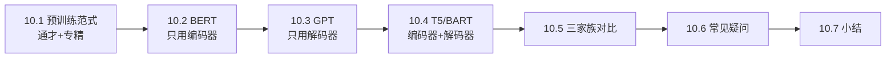
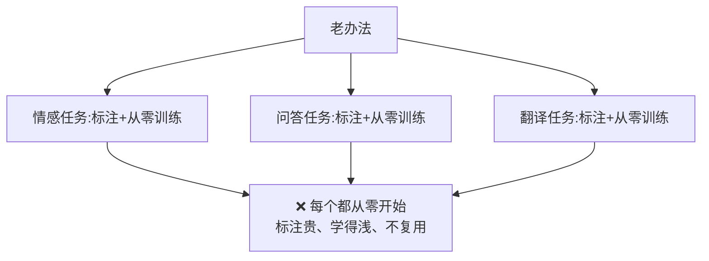
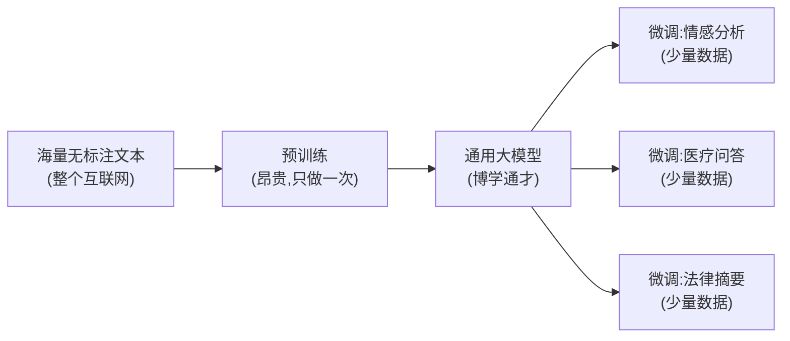
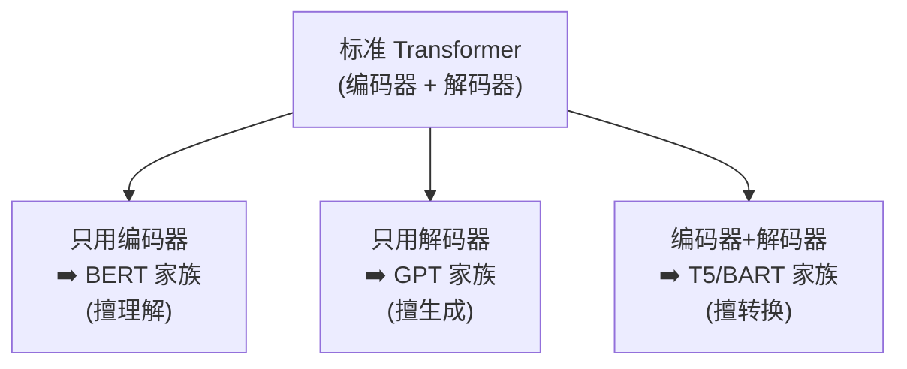
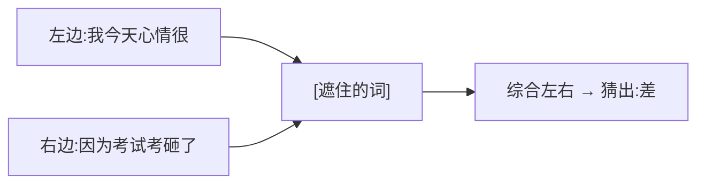
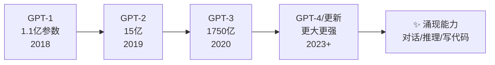
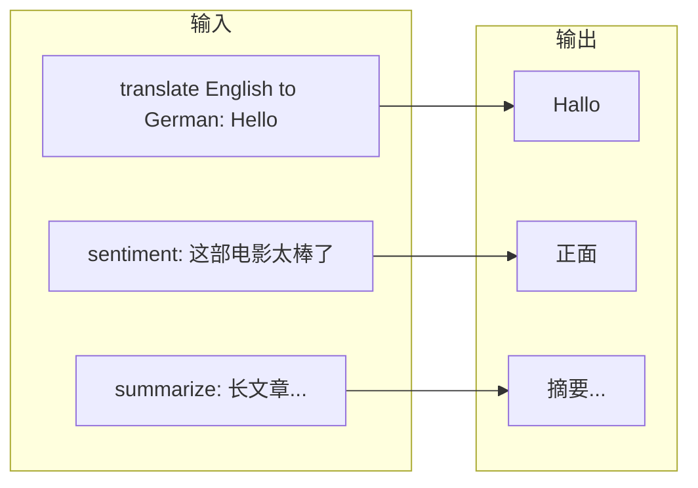
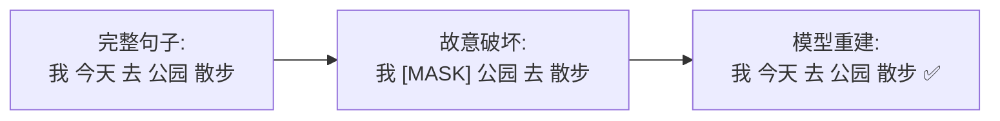
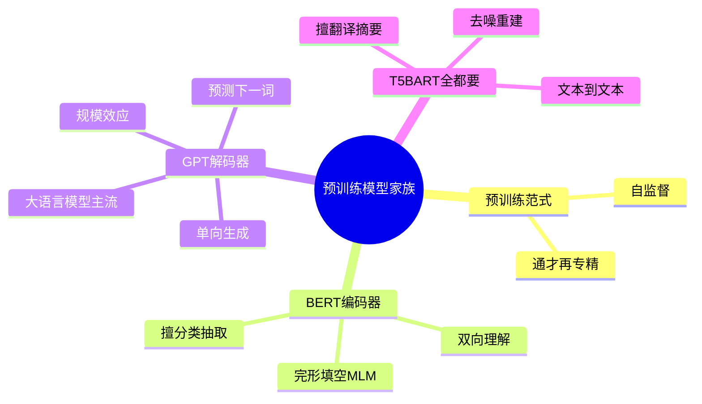
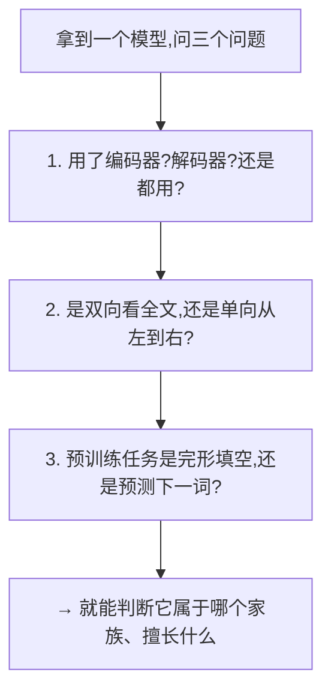

# 第 10 章 预训练模型家族

> 你已经从零造出了一个标准 Transformer。但现实中大放异彩的 BERT、GPT、T5 又是什么?其实它们都是从标准 Transformer"裁剪、改造"出来的三个流派。这一章帮你把它们的关系一次理清。
>
> 📌 记住一句话:**BERT、GPT、T5 都不是全新的东西,而是"标准 Transformer 拆开来用"的三种方式。** 抓住这一点,这一章就通了大半。

---

## 10.0 本章导览



---

## 10.1 先理解一个关键词:预训练

### 10.1.1 老办法的困境:每个任务从零训练

在预训练范式出现之前,做 NLP 任务是这样的:想做情感分析,就标注一批情感数据,从零训练一个情感模型;想做问答,再标注一批问答数据,从零训练一个问答模型……

**问题很明显**:

- 每个任务都要大量**人工标注**数据,昂贵又耗时。
- 每个模型都从"什么都不懂"开始,连"什么是语言"都要重新学。
- 一个任务学到的语言知识,没法用到另一个任务上,极度浪费。



### 10.1.2 什么是"预训练 + 微调"

现在的主流范式是**两步走**:

1. **预训练(Pre-training)**:先用**海量无标注文本**(整个互联网的文章、书籍)训练一个"什么都懂一点"的通用模型。这一步极其昂贵(要大量算力),但**只做一次**。
2. **微调(Fine-tuning)**:拿这个通用模型,用**少量标注数据**针对具体任务(情感分析、问答……)再训练一下,快速适配。

**比喻:通才 + 专精**。预训练像让一个人读完了图书馆所有的书,成为博学的通才(懂语法、常识、逻辑);微调像再送他去参加一个短期职业培训,变成某个领域的专家(比如医疗文本分类)。因为已经有深厚的通用底子,专精训练又快又好。



### 10.1.3 为什么无标注文本能用来学习

一个关键问题:海量文本没有人工标注,模型怎么"学"?

答案是**自监督学习(Self-supervised Learning)**——让文本**自己给自己出题**:

- **完形填空式**(BERT):遮住句子里的词,让模型猜(答案就是被遮的原词)。
- **接龙式**(GPT):给前文,让模型预测下一个词(答案就是文本里真实的下一个词)。

因为答案本来就藏在文本里,不需要人来标注,所以能无限量地利用互联网文本。这是预训练能成立的根本前提。

### 10.1.4 三大流派:取 Transformer 的不同部分

标准 Transformer 有编码器和解码器两部分(第 7 章)。预训练模型根据"用哪部分"分成三大家族:



接下来逐个认识。

---

## 10.2 BERT:只用编码器(擅长"理解")

**BERT**(Bidirectional Encoder Representations from Transformers)只保留了 Transformer 的**编码器**部分。

### 10.2.1 核心特点:双向理解

因为编码器**不用前瞻掩码**(第 6、7 章),BERT 在理解一个词时能**同时看到它左边和右边**的所有词——这就是"双向(Bidirectional)"。

**比喻:完形填空**。给你 "我今天心情很 ___,因为考试考砸了",你会结合**前后文**(既看"心情很",也看"考试考砸了")判断空格是"差"。BERT 就是这样双向理解的。



### 10.2.2 BERT 的两个预训练任务

BERT 预训练时同时做两个"自出题"任务:

**① 掩码语言模型(MLM)**:随机遮住句子里约 15% 的词,让模型根据上下文猜出来。这逼模型深入理解每个词和上下文的关系。

```
原句:  今天 天气 很 好 我们 去 公园
遮住:  今天 天气 很 [MASK] 我们 去 [MASK]
预测:              好                 公园
```

**② 下一句预测(NSP)**:给两个句子,判断第二句是不是第一句的下文。这让模型理解句子之间的关系(后来的研究发现这个任务作用有限,RoBERTa 等把它去掉了)。

### 10.2.3 适合什么任务

BERT 擅长**理解类**任务(不需要"生成"长文本):

- 文本分类、情感分析
- 命名实体识别(找出人名、地名)
- 抽取式问答(从原文里划出答案)
- 句子相似度判断

> 💡 **一句话**:BERT 是"阅读理解高手",双向看全文,理解得很透;但它天生**不擅长写文章**(因为它不是为逐词生成设计的)。

### 10.2.4 BERT 的"后代"

BERT 引发了一大批改进模型:**RoBERTa**(去掉 NSP、训练更充分)、**ALBERT**(参数共享、更轻量)、**DeBERTa**(改进注意力和位置编码)等。它们都属于"编码器"这一路。

---

## 10.3 GPT:只用解码器(擅长"生成")

**GPT**(Generative Pre-trained Transformer)只保留了 Transformer 的**解码器**部分(并去掉了交叉注意力,因为没有编码器可对接)。我们今天用的 ChatGPT 就属于这个家族。

### 10.3.1 核心特点:单向生成

GPT 保留了**前瞻掩码**,所以它只能**从左到右**看,预测下一个词(第 8 章的自回归)。它的预训练任务就是最朴素的**"预测下一个词"**。

**比喻:接龙写作**。给个开头,它一个词一个词地往下写,永远只依据"已经写出来的内容",不能看未来。


### 10.3.2 从 GPT 到大语言模型:规模效应

GPT 家族最惊人的发现是**规模效应(Scaling Law)**:当模型参数、数据、算力都大幅增加时,模型会"涌现"出意想不到的能力——对话、推理、写代码、翻译、甚至一定的数学能力……几乎无所不能。这就催生了今天的**大语言模型(LLM)**。



**关键转变**:从"针对每个任务微调"变成"一个通用模型 + 提示词(Prompt)"就能做各种任务——你不用再训练,只需把需求"说"给它听。这就是第 11 章要讲的 LLM 的核心用法。

### 10.3.3 为什么现在主流是 GPT 这一路

生成式的解码器架构有个巨大优势:**统一**。所有任务(翻译、问答、写作、编程)都能表达成"给一段文字,续写下一段文字",用同一个模型、同一种方式解决。这种通用性和可扩展性,让 GPT 路线成为了当今大模型的绝对主流。

> 💡 **BERT vs GPT 一句话对比**:BERT 双向、擅理解(阅读高手);GPT 单向、擅生成(写作高手)。当今生成式 AI 的主流是 GPT 这一路。

---

## 10.4 T5 / BART:编码器 + 解码器(全能选手)

这一派**完整保留**了编码器和解码器(以及连接它们的交叉注意力),回归了最初的翻译架构,适合"输入一段、输出一段"的转换类任务。

### 10.4.1 T5:一切皆"文本到文本"

**T5**(Text-to-Text Transfer Transformer)提出了一个统一又优雅的思想:**把所有 NLP 任务都统一成"输入文本 → 输出文本"的格式**。



用一个模型、一种格式解决所有任务,只靠输入前缀("translate..."、"sentiment:")来区分任务类型,非常统一优雅。

### 10.4.2 BART:去噪重建

**BART** 的预训练思路是"**先破坏,再修复**":故意把输入文本打乱、遮盖、删词、调换顺序,让模型学会重建出原始的完整文本。



编码器负责理解"被破坏的输入",解码器负责生成"修复后的完整文本"。这种训练方式让它在摘要、翻译等生成任务上表现出色。

### 10.4.3 为什么这一路现在用得相对少

编码器-解码器架构在翻译、摘要这类"有明确输入输出对"的任务上很强。但随着 GPT 路线证明"只用解码器 + 足够大规模"就能统一做所有任务(包括翻译摘要),纯编码器-解码器架构在通用大模型领域用得相对少了。不过在特定的"序列转换"场景,它依然是很好的选择。

---

## 10.5 三大家族对比总表

这是本章最该记牢的一张表:

| 家族 | 用的部分 | 看的方向 | 预训练任务 | 最擅长 | 代表 |
|------|----------|----------|-----------|--------|------|
| **BERT** | 编码器 | 双向 | 完形填空(MLM) | 理解、分类、抽取 | BERT, RoBERTa, DeBERTa |
| **GPT** | 解码器 | 单向(从左到右) | 预测下一个词 | 生成、对话、通用 | GPT-3/4, LLaMA, Qwen |
| **T5/BART** | 编码器+解码器 | 编码双向/解码单向 | 文本重建/文本到文本 | 翻译、摘要、转换 | T5, BART |



### 一个统一的记忆框架



---

## 10.6 常见疑问 FAQ

**Q1:GPT 只有解码器,那它还有第 7 章讲的"交叉注意力"吗?**
没有。交叉注意力是用来连接编码器和解码器的,GPT 没有编码器,所以去掉了交叉注意力,只保留"带掩码的自注意力"和 FFN。

**Q2:BERT 为什么不能像 GPT 那样生成文章?**
因为 BERT 是双向的、为"理解"设计的,它没有"逐词往下生成"的机制(预训练时也没学这个)。硬要它生成,效果很差。生成是 GPT 的主场。

**Q3:ChatGPT 是怎么从 GPT 变得会"聊天"的?**
在 GPT 预训练之后,还经过了**指令微调(Instruction Tuning)** 和 **RLHF(基于人类反馈的强化学习)**,让它学会听懂指令、给出符合人类偏好的回答。这是第 11 章会提到的关键步骤。

**Q4:预训练一个大模型要多少成本?**
非常昂贵——大型 LLM 的预训练可能耗费数百万美元的算力,需要成千上万块 GPU 训练数周甚至数月。这也是为什么预训练"只做一次",而大多数人只做微调或直接调用。

**Q5:我该用哪个家族的模型?**
看任务:纯理解/分类/信息抽取 → BERT 类;生成/对话/通用任务 → GPT 类;明确的翻译/摘要转换 → T5/BART 类。但如今很多场景直接用大型 GPT 类模型 + 合适的提示词就够了。

---

## 10.7 本章小结

- 现代范式是**预训练 + 微调**:先用海量无标注文本(靠**自监督**自己出题)训练"通才",再用少量数据微调成"专家"。
- 根据使用 Transformer 的哪部分,分三大家族:
  - **BERT**(只用编码器):双向,做完形填空,擅长**理解**(分类、抽取)。
  - **GPT**(只用解码器):单向自回归,预测下一个词,擅长**生成**;靠规模效应成为大语言模型的基础,是当今主流。
  - **T5/BART**(编码器+解码器):文本到文本/去噪重建,擅长翻译、摘要等**转换**任务。
- 三者本质都是标准 Transformer 的"裁剪与改造";判断一个模型属于哪家,问它"用哪部分、看哪个方向、什么预训练任务"即可。

### 承上启下

Transformer 不仅统治了 NLP,还"出圈"到了图像、语音、多模态等领域。下一章我们看看它究竟能应用到多广。

---

📖 **上一章**:第 9 章 用 PyTorch 从零实现 Transformer ｜ **下一章**:第 11 章 Transformer 的广泛应用
