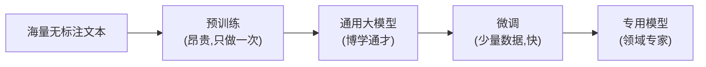
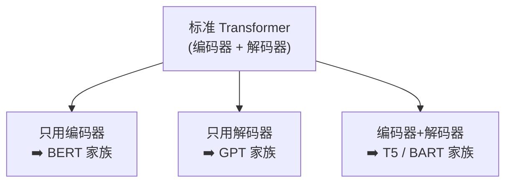
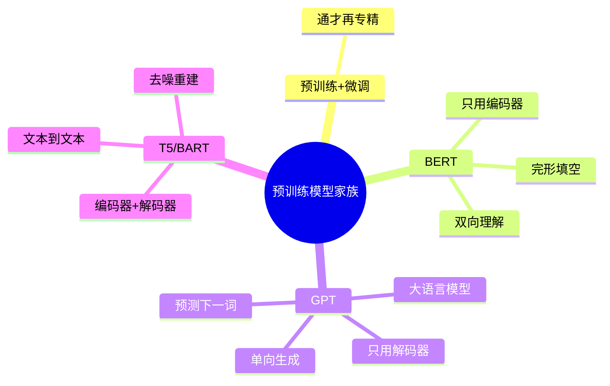

# 第 10 章 预训练模型家族

> 你已经从零造出了一个标准 Transformer。但现实中大放异彩的 BERT、GPT、T5 又是什么?其实它们都是从标准 Transformer"裁剪、改造"出来的三个流派。这一章帮你把它们的关系一次理清。

---

## 10.1 先理解一个关键词:预训练

### 10.1.1 什么是"预训练 + 微调"

在 Transformer 之前,做每个任务都要从零训练一个模型,又慢又费数据。现在的主流范式是**两步走**:

1. **预训练(Pre-training)**:先用**海量无标注文本**(整个互联网的文章、书籍)训练一个"什么都懂一点"的通用模型。这一步极其昂贵,但只做一次。
2. **微调(Fine-tuning)**:拿这个通用模型,用**少量标注数据**针对具体任务(情感分析、问答……)再训练一下,快速适配。

**比喻:通才 + 专精**。预训练像让一个人读完了图书馆所有的书,成为博学的通才;微调像再送他去参加一个短期职业培训,变成某个领域的专家。

### 10.1.2 三大流派:取 Transformer 的不同部分

标准 Transformer 有编码器和解码器两部分。预训练模型根据"用哪部分"分成三大家族:

---

## 10.2 BERT:只用编码器(擅长"理解")

**BERT**(Bidirectional Encoder Representations from Transformers)只保留了 Transformer 的**编码器**部分。

### 10.2.1 核心特点:双向理解

因为编码器**不用前瞻掩码**(第 6、7 章),BERT 在理解一个词时能**同时看到它左边和右边**的所有词——这就是"双向(Bidirectional)"。

**比喻:完形填空**。给你 "我今天心情很 ___,因为考试考砸了",你会结合**前后文**判断空格是"差"。BERT 的预训练任务正是这种完形填空(专业叫**掩码语言模型 MLM**):随机遮住句子里一些词,让模型根据上下文猜出来。

### 10.2.2 适合什么任务

BERT 擅长**理解类**任务(不需要"生成"长文本):

- 文本分类、情感分析
- 命名实体识别(找出人名、地名)
- 抽取式问答(从原文里划出答案)

> 💡 **一句话**:BERT 是"阅读理解高手",双向看全文,但它本身不擅长写文章。

---

## 10.3 GPT:只用解码器(擅长"生成")

**GPT**(Generative Pre-trained Transformer)只保留了 Transformer 的**解码器**部分(去掉了交叉注意力)。我们今天用的 ChatGPT 就属于这个家族。

### 10.3.1 核心特点:单向生成

GPT 保留了**前瞻掩码**,所以它只能**从左到右**看,预测下一个词(第 8 章的自回归)。它的预训练任务就是最朴素的**"预测下一个词"**。

**比喻:接龙写作**。给个开头,它一个词一个词地往下写,永远只依据"已经写出来的内容"。

### 10.3.2 从 GPT 到大语言模型

GPT 家族最惊人的发现是**规模效应(Scaling Law)**:当模型参数、数据、算力都大幅增加时,模型会"涌现"出意想不到的能力——对话、推理、写代码、翻译……几乎无所不能。这就催生了今天的**大语言模型(LLM)**。

- GPT-2 → GPT-3 → GPT-4 → ……,参数从亿级到千亿甚至万亿级。
- 关键转变:从"针对每个任务微调"变成"一个通用模型 + 提示词(Prompt)"就能做各种任务。

> 💡 **BERT vs GPT 一句话对比**:BERT 双向、擅理解(阅读高手);GPT 单向、擅生成(写作高手)。当今生成式 AI 的主流是 GPT 这一路。

---

## 10.4 T5 / BART:编码器 + 解码器(全能选手)

这一派**完整保留**了编码器和解码器,回归了最初的翻译架构,适合"输入一段、输出一段"的任务。

### 10.4.1 T5:一切皆"文本到文本"

**T5**(Text-to-Text Transfer Transformer)提出了一个统一又优雅的思想:**把所有 NLP 任务都统一成"输入文本 → 输出文本"的格式**。

- 翻译:输入"translate English to German: Hello" → 输出"Hallo"
- 情感分析:输入"sentiment: 这部电影太棒了" → 输出"正面"
- 摘要:输入"summarize: <长文章>" → 输出"<摘要>"

用一个模型、一种格式解决所有任务,非常统一。

### 10.4.2 BART:去噪重建

**BART** 的预训练思路是"**先破坏,再修复**":故意把输入文本打乱、遮盖、删词,让模型学会重建出原始的完整文本。这让它在摘要、翻译等生成任务上表现出色。

---

## 10.5 三大家族对比总表

| 家族 | 用的部分 | 看的方向 | 预训练任务 | 最擅长 | 代表 |
|------|----------|----------|-----------|--------|------|
| **BERT** | 编码器 | 双向 | 完形填空(MLM) | 理解、分类、抽取 | BERT, RoBERTa |
| **GPT** | 解码器 | 单向(从左到右) | 预测下一个词 | 生成、对话、通用 | GPT-3/4, LLaMA |
| **T5/BART** | 编码器+解码器 | 编码双向/解码单向 | 文本重建/文本到文本 | 翻译、摘要 | T5, BART |

---

## 10.6 本章小结

- 现代范式是**预训练 + 微调**:先用海量数据训练"通才",再用少量数据微调成"专家"。
- 根据使用 Transformer 的哪部分,分三大家族:
  - **BERT**(只用编码器):双向,擅长**理解**。
  - **GPT**(只用解码器):单向自回归,擅长**生成**,是大语言模型的基础。
  - **T5/BART**(编码器+解码器):擅长翻译、摘要等**序列到序列**任务。
- 三者本质都是标准 Transformer 的"裁剪与改造"。

### 承上启下

Transformer 不仅统治了 NLP,还"出圈"到了图像、语音、多模态等领域。下一章我们看看它究竟能应用到多广。

---

📖 **上一章**:第 9 章 用 PyTorch 从零实现 Transformer ｜ **下一章**:第 11 章 Transformer 的广泛应用
