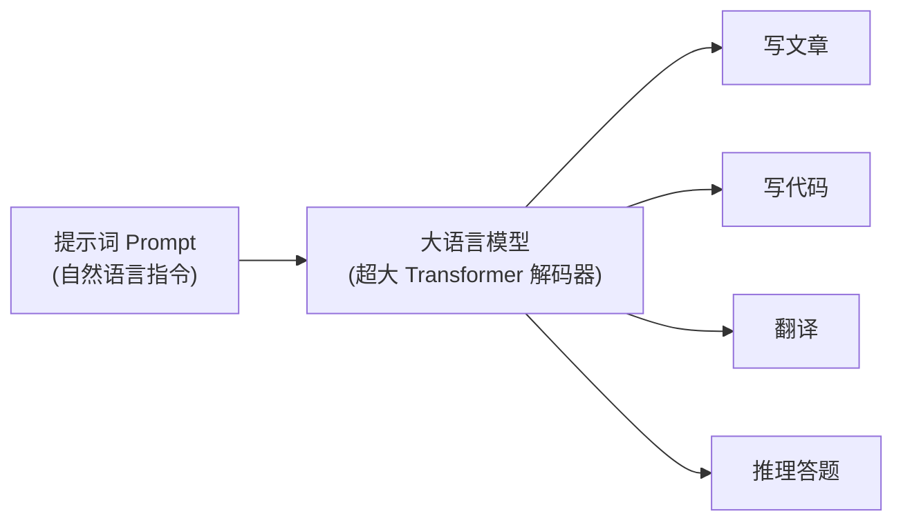
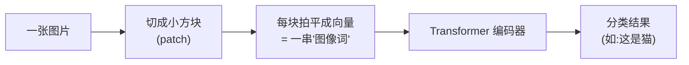
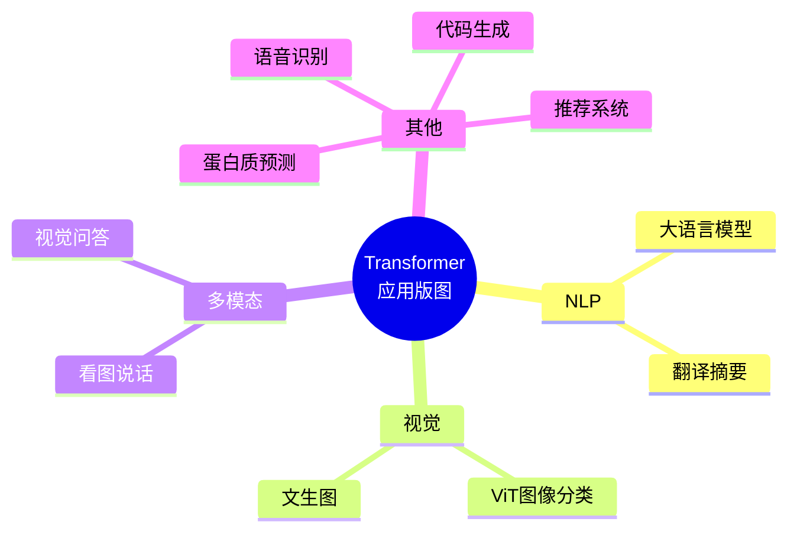

# 第 11 章 Transformer 的广泛应用

> Transformer 最初是为翻译设计的,但它的威力远不止于此。这一章带你看看,它是如何从 NLP "出圈",一路征服图像、语音乃至整个 AI 领域的。

---

## 11.1 大语言模型(LLM):最耀眼的应用

### 11.1.1 什么是大语言模型

**大语言模型(Large Language Model, LLM)** 就是把 GPT 那样的解码器架构(第 10 章)**极度放大**——参数规模达到数百亿甚至上万亿,再用几乎整个互联网的文本训练出来的模型。

代表:GPT-4、Claude、Gemini、LLaMA、Qwen(通义千问)、DeepSeek 等。

### 11.1.2 它能做什么

一个 LLM 几乎能胜任所有文本任务,而且**不需要为每个任务单独训练**,只要给出合适的**提示词(Prompt)**:

- 对话问答、写作润色
- 翻译、摘要
- 写代码、debug
- 逻辑推理、数学解题

**比喻**:LLM 像一个读遍天下书、还能举一反三的"超级实习生"。你用自然语言给它下达指令(Prompt),它就能完成五花八门的任务。

### 11.1.3 关键概念速览

- **提示工程(Prompt Engineering)**:把指令写清楚、给例子,能显著提升输出质量。
- **上下文学习(In-context Learning)**:在 Prompt 里给几个示例,模型当场"学会"任务,无需重新训练。
- **RLHF(基于人类反馈的强化学习)**:让模型的回答更符合人类偏好、更安全有用——这是 ChatGPT 好用的关键一步。

---

## 11.2 视觉领域:Vision Transformer(ViT)

长期以来,图像是 CNN 的天下。但 Transformer 也杀了进来。

### 11.2.1 核心难题:图像不是序列,怎么办

Transformer 吃的是"一串词",而图像是二维像素。**ViT(Vision Transformer)** 的巧妙做法是:**把图像切成一个个小方块(patch),每个小块当成一个"词"**。

**比喻:把一幅画剪成拼图块**。把一张图切成 16×16 的小方块,按顺序排成一串,每块"拍平"成一个向量——图像就变成了一个"由图块组成的句子",接下来就能原封不动地套用 Transformer 编码器了。

### 11.2.2 意义

ViT 证明了 Transformer 的通用性:**同一套架构,不改核心思想,就能同时处理文字和图像**。在大规模数据上,ViT 的表现能追平甚至超越传统 CNN。

---

## 11.3 多模态与其他领域

### 11.3.1 多模态:让 AI 同时看懂文字和图像

**多模态(Multimodal)** 模型能同时处理**多种类型**的数据(文字、图像、声音)。既然文字和图像都能被 Transformer 变成"向量序列",那就能把它们放进**同一个模型**里一起理解。

典型应用:

- **看图说话**:给一张图,生成描述文字。
- **视觉问答**:就一张图片提问,模型回答("图里有几个人?")。
- **文生图**:输入文字,生成图片(如 DALL·E、Stable Diffusion 的部分组件也用到 Transformer)。

代表模型:CLIP、GPT-4V、Gemini 等。

### 11.3.2 其他领域的"遍地开花"

Transformer 的触角还伸向了:

| 领域 | 应用举例 |
|------|---------|
| **语音** | 语音识别(Whisper)、语音合成 |
| **生物** | 蛋白质结构预测(AlphaFold 用到了注意力机制) |
| **代码** | 代码补全、生成(GitHub Copilot) |
| **时序/推荐** | 股价预测、推荐系统 |
| **强化学习** | Decision Transformer 等 |

> 💡 **为什么这么通用?** 因为 Transformer 的核心——注意力机制——本质是一种"**让任意元素之间灵活建立联系**"的通用工具。只要能把数据变成"向量序列",它就能派上用场。这种普适性,正是它被称为 AI 领域"通用架构"的原因。

---

## 11.4 本章小结

- **大语言模型(LLM)**:GPT 架构的极度放大版,一个模型 + 提示词就能完成海量文本任务,是当前最耀眼的应用。
- **ViT**:把图像切成小块当"词",让 Transformer 处理视觉任务,证明了架构的通用性。
- **多模态模型**:把文字、图像、语音都转成向量序列放进同一模型,实现看图说话、视觉问答、文生图等。
- Transformer 已渗透语音、生物、代码、推荐等几乎所有领域,成为 AI 的"通用架构"。

### 承上启下

应用如此广泛,但 Transformer 也有它的短板(比如处理超长文本时开销巨大)。最后一章,我们看看研究者们如何优化它,以及你该如何继续深入学习。

---

📖 **上一章**:第 10 章 预训练模型家族 ｜ **下一章**:第 12 章 进阶话题与展望
