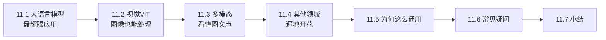
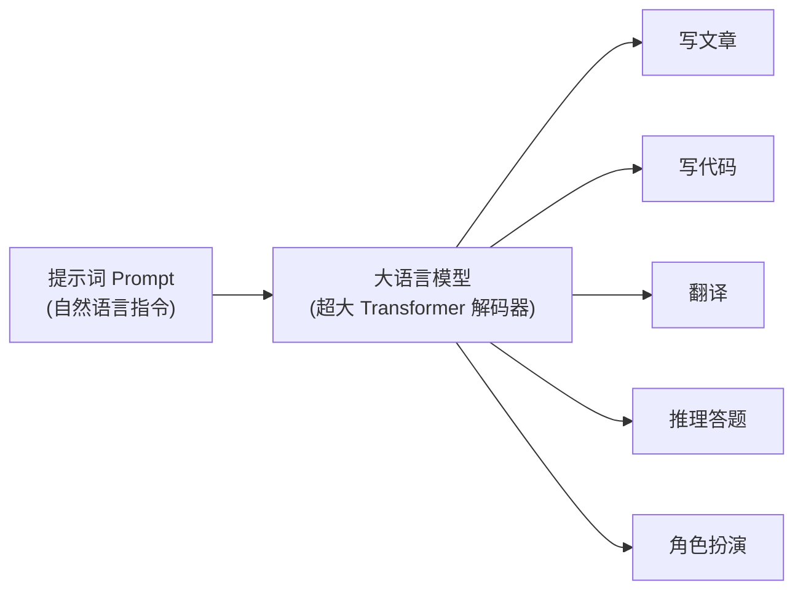
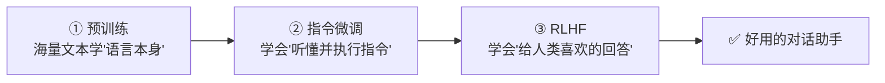
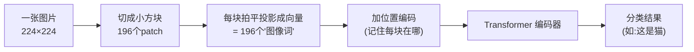
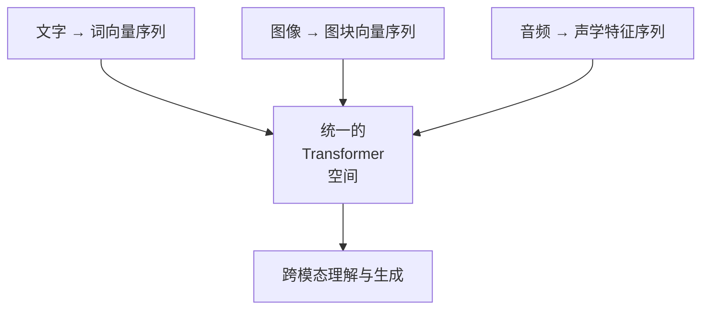
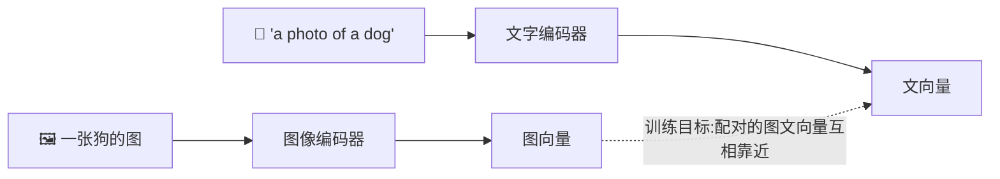
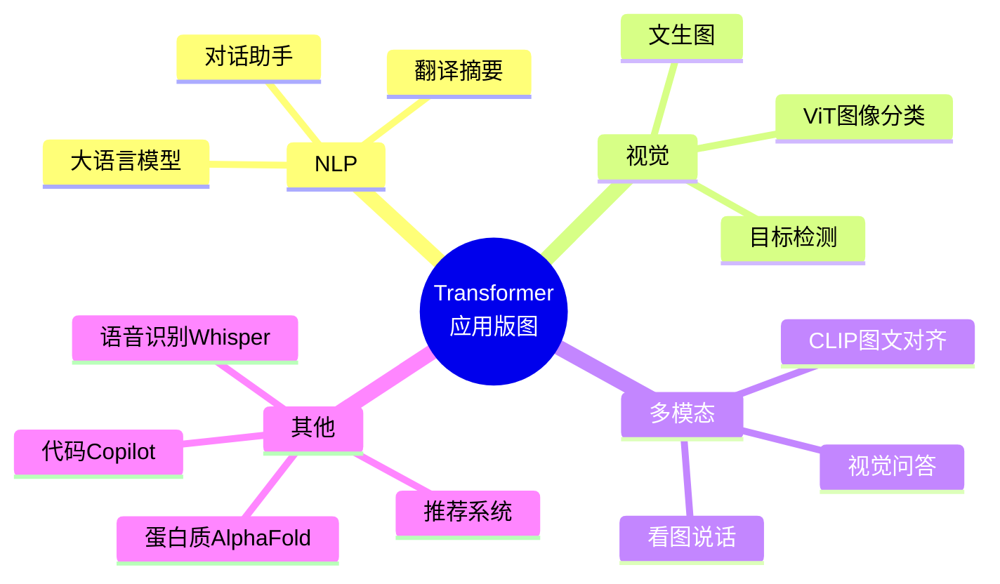
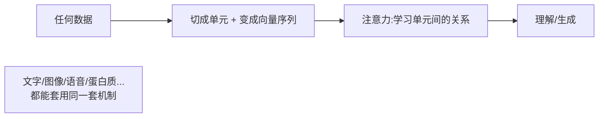

# 第 11 章 Transformer 的广泛应用

> Transformer 最初是为翻译设计的,但它的威力远不止于此。这一章带你看看,它是如何从 NLP "出圈",一路征服图像、语音乃至整个 AI 领域的。
>
> 📌 本章的核心洞察:**只要能把数据变成"向量序列",Transformer 就能处理它。** 这个"万物皆可序列化"的思路,是它统治整个 AI 领域的根本原因。

---

## 11.0 本章导览

---

## 11.1 大语言模型(LLM):最耀眼的应用

### 11.1.1 什么是大语言模型

**大语言模型(Large Language Model, LLM)** 就是把 GPT 那样的解码器架构(第 10 章)**极度放大**——参数规模达到数百亿甚至上万亿,再用几乎整个互联网的文本训练出来的模型。

代表:GPT-4、Claude、Gemini、LLaMA、Qwen(通义千问)、DeepSeek 等。

### 11.1.2 它能做什么

一个 LLM 几乎能胜任所有文本任务,而且**不需要为每个任务单独训练**,只要给出合适的**提示词(Prompt)**:

- 对话问答、写作润色
- 翻译、摘要
- 写代码、debug
- 逻辑推理、数学解题
- 角色扮演、创意写作

**比喻**:LLM 像一个读遍天下书、还能举一反三的"超级实习生"。你用自然语言给它下达指令(Prompt),它就能完成五花八门的任务。

### 11.1.3 从预训练到"会聊天":LLM 的三段式养成

一个能对话的 LLM(比如 ChatGPT)不是一步到位的,它要经过三个阶段的"调教":

- **① 预训练**:用互联网海量文本做"预测下一个词",让模型掌握语言、常识、逻辑(第 10 章)。此时它只会"续写",还不会"对话"。
- **② 指令微调(Instruction Tuning)**:用大量"指令-回答"样本训练,让它学会**听懂人类的指令并照做**(而不是傻傻地续写)。
- **③ RLHF(基于人类反馈的强化学习)**:让人给模型的多个回答打分排序,用这些偏好训练模型,使它的回答更**有用、诚实、无害**。

> 💡 **关键认知**:让 LLM"聪明"的是①(规模+数据),让 LLM"好用、听话"的是②③。ChatGPT 之所以惊艳,很大程度上归功于②③把一个"续写机器"调教成了"贴心助手"。

### 11.1.4 关键概念速览

| 概念 | 一句话解释 |
|------|-----------|
| **提示工程(Prompt Engineering)** | 把指令写清楚、给例子,能显著提升输出质量 |
| **上下文学习(In-context Learning)** | 在 Prompt 里给几个示例,模型当场"学会"任务,无需重新训练 |
| **思维链(Chain-of-Thought)** | 让模型"一步步想",在推理任务上大幅提升准确率 |
| **RAG(检索增强生成)** | 先检索相关资料再让模型回答,减少"胡编乱造" |
| **幻觉(Hallucination)** | 模型一本正经地生成看似合理实则错误的内容——LLM 的已知短板 |

> ⚠️ **注意幻觉问题**:LLM 本质是"预测下一个最可能的词",它并不"知道"事实真伪,可能自信地给出错误信息。使用时对关键事实要核查,这是当前 LLM 的固有局限。

---

## 11.2 视觉领域:Vision Transformer(ViT)

长期以来,图像是 CNN(卷积神经网络)的天下。但 Transformer 也杀了进来,而且表现惊艳。

### 11.2.1 核心难题:图像不是序列,怎么办

Transformer 吃的是"一串词(向量序列)",而图像是二维的像素网格。怎么把图像喂给它?

**ViT(Vision Transformer)** 的巧妙做法是:**把图像切成一个个小方块(patch),每个小块当成一个"词"**。

**比喻:把一幅画剪成拼图块**。把一张 224×224 的图切成 16×16 的小方块(共 14×14=196 块),按顺序排成一串,每块"拍平"再投影成一个向量——图像就变成了一个"由 196 个图块词组成的句子",接下来就能几乎原封不动地套用 Transformer 编码器了。

### 11.2.2 ViT 里也有"位置编码"

注意上图多了一步"加位置编码"。因为图块被拍平成序列后,Transformer 又"忘了"每块原本在图像的哪个位置(第 5 章的老问题)。所以 ViT 同样要给每个图块加位置编码,告诉模型"这块在左上角、那块在右下角"。你看,前面学的原理在这里完全复用。

### 11.2.3 ViT vs CNN

| 对比 | CNN | ViT |
|------|-----|-----|
| 看图方式 | 小卷积核局部滑动 | 图块之间全局注意力 |
| 全局视野 | 需要堆很多层才能获得 | 第一层就能"纵览全图" |
| 数据需求 | 较少也能训好 | 需要**大量**数据才能超越 CNN |
| 归纳偏置 | 内置"局部性"假设 | 几乎不预设,全靠数据学 |

> 💡 **意义**:ViT 证明了 Transformer 的通用性——**同一套架构,不改核心思想,就能同时处理文字和图像**。在大规模数据上,ViT 的表现能追平甚至超越传统 CNN。这打破了"图像必须用 CNN"的固有认知。

---

## 11.3 多模态:让 AI 同时看懂图文声

### 11.3.1 什么是多模态

**多模态(Multimodal)** 模型能同时处理**多种类型**的数据(文字、图像、声音)。既然文字能变成向量序列、图像也能(ViT 的图块),那就能把它们放进**同一个模型**里一起理解和关联。

### 11.3.2 典型应用

- **看图说话(Image Captioning)**:给一张图,生成描述文字("一只猫坐在窗台上")。
- **视觉问答(VQA)**:就一张图片提问,模型回答("图里有几个人?" → "3 个")。
- **文生图(Text-to-Image)**:输入文字,生成图片(如 DALL·E、Stable Diffusion,其文本理解部分用到 Transformer)。
- **视频理解**:分析视频内容、生成字幕。

### 11.3.3 CLIP:一个巧妙的多模态例子

**CLIP** 是理解多模态的一个绝佳范例。它同时训练一个"文字编码器"和一个"图像编码器",目标是:**让配对的图和文,在向量空间里靠得很近**。

训练好后,给一张图,就能找到最匹配的文字描述(反之亦然)。这种"图文对齐"能力,是很多文生图、图文检索系统的基础。代表模型还有 GPT-4V、Gemini 等。

---

## 11.4 其他领域的"遍地开花"

Transformer 的触角几乎伸向了所有领域:

| 领域 | 应用举例 | 怎么"序列化" |
|------|---------|-------------|
| **语音** | 语音识别(Whisper)、语音合成 | 声波切成时间片段序列 |
| **生物** | 蛋白质结构预测(AlphaFold) | 氨基酸序列 |
| **代码** | 代码补全、生成(GitHub Copilot) | 代码本就是 token 序列 |
| **时序/推荐** | 股价预测、推荐系统 | 时间/行为序列 |
| **强化学习** | Decision Transformer | 状态-动作-奖励序列 |
| **音乐** | 作曲、伴奏生成 | 音符序列 |

---

## 11.5 为什么 Transformer 这么通用?

我们停下来想一个更深的问题:为什么一个为翻译设计的模型,能横扫如此多不相干的领域?

### 11.5.1 根本原因:注意力是"通用的关系建模器"

Transformer 的核心——注意力机制——本质是一种"**让任意元素之间灵活建立联系**"的通用工具。它不关心元素是"词""图块"还是"氨基酸",只要:

1. 能把数据切成一个个单元;
2. 把每个单元变成一个向量。

它就能自动学习"哪些单元之间该建立联系、联系有多强"。这种不挑数据类型的普适性,是它成为 AI 领域"通用架构"的原因。

### 11.5.2 附带优势:可扩展 + 可迁移

- **可扩展**:结构规整、高度并行,能靠堆参数、堆数据持续变强(规模效应)。
- **可迁移**:一个领域的成功经验(如预训练+微调)能快速搬到另一个领域。

> 💡 **一句话总结**:Transformer 提供了一种"**万物皆可序列、序列皆可注意力**"的统一范式。它把原本分散在各领域的专用模型(CNN 管图像、RNN 管语言……),统一到了一套架构之下。这正是它被称为"AI 通用架构"、甚至有人称之为"通用学习机器"的原因。

---

## 11.6 常见疑问 FAQ

**Q1:LLM 真的"理解"语言吗,还是只是统计?**
这是个有争议的哲学问题。技术上,它是在做"预测下一个最可能的词"的统计学习;但当规模足够大时,它表现出的能力(推理、类比)已经很难简单归为"背诵"。实用角度:把它当作强大的工具即可,不必纠结它是否"真懂"。

**Q2:ViT 会完全取代 CNN 吗?**
不会一边倒。ViT 在超大数据上更强,但 CNN 在中小数据、对局部特征敏感的任务上仍高效实用。实践中也有很多"CNN + Transformer"的混合架构。

**Q3:文生图(如 Stable Diffusion)是纯 Transformer 吗?**
不完全是。它的核心生成过程用的是"扩散模型",但其中理解文字提示的部分、以及一些新版架构(如 DiT)大量使用了 Transformer。Transformer 常作为"理解"和"骨干"组件出现。

**Q4:为什么大模型会"胡说八道"(幻觉)?**
因为它的训练目标是"生成通顺、可能的文本",而不是"保证事实正确"。当它不确定时,仍会生成看起来最"顺"的答案,而非承认不知道。RAG、事实核查等技术在努力缓解这个问题。

**Q5:多模态模型是怎么把图和文"对齐"的?**
核心思路是把不同模态都映射到**同一个向量空间**,并训练"配对的图文在空间里靠近"(如 CLIP)。这样模型就能跨模态地关联信息。

---

## 11.7 本章小结

- **大语言模型(LLM)**:GPT 架构的极度放大版,一个模型 + 提示词就能完成海量文本任务;经过"预训练→指令微调→RLHF"三段式养成才变得好用;注意其**幻觉**局限。
- **ViT**:把图像切成小块当"词"(同样要加位置编码),让 Transformer 处理视觉任务,大数据下可超越 CNN。
- **多模态模型**:把文字、图像、语音都转成向量序列放进同一模型(如 CLIP 做图文对齐),实现看图说话、视觉问答、文生图。
- Transformer 已渗透语音、生物、代码、推荐等几乎所有领域。
- **通用性的根源**:注意力是"通用的关系建模器",只要数据能变成向量序列就能用——"万物皆可序列、序列皆可注意力"。

### 承上启下

应用如此广泛,但 Transformer 也有它的短板(比如处理超长文本时开销巨大)。最后一章,我们看看研究者们如何优化它,以及你该如何继续深入学习。

---

📖 **上一章**:第 10 章 预训练模型家族 ｜ **下一章**:第 12 章 进阶话题与展望
