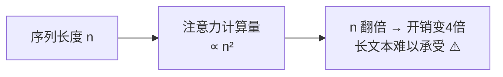
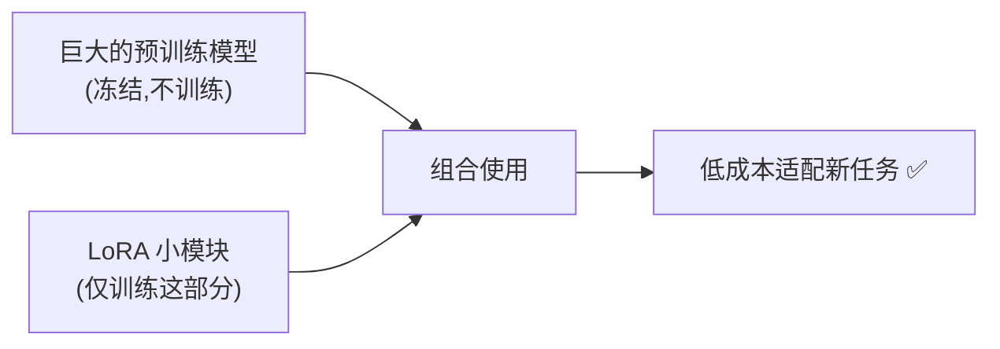
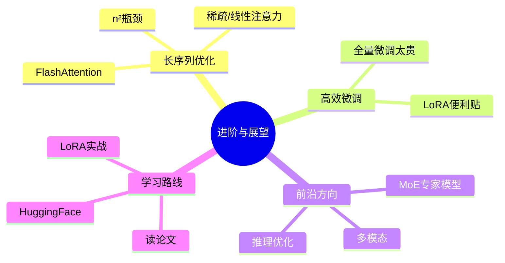

# 第 12 章 进阶话题与展望

> 恭喜你走到了最后一章!前面我们把标准 Transformer 里里外外拆了个遍。这一章带你看看它的"痛点"与前沿优化方向,并给出继续深入的学习路线,为你的进阶之路铺好第一块砖。

---

## 12.1 长序列优化:注意力的"平方"烦恼

### 12.1.1 痛点:计算量随长度平方增长

回顾第 3 章:注意力要让**每个词和每个其他词**都算一次匹配度。如果句子有 $n$ 个词,就要算 $n \times n$ 次。

这意味着计算量和显存都随长度呈 **$O(n^2)$ 平方级**增长:

- 句子长度翻倍(n → 2n),计算量变成 **4 倍**。
- 处理一本书(几万词)时,这个开销会大到无法承受。

**比喻**:10 个人开会,两两握手要 45 次;100 个人握手就要近 5000 次。人一多,握手次数爆炸式增长。这就是 Transformer 处理长文本的最大瓶颈。

### 12.1.2 优化方向

研究者提出了很多办法给注意力"减负",简单了解方向即可:

| 方向 | 思路(一句话) | 代表 |
|------|--------------|------|
| **稀疏注意力** | 不让每个词关注所有词,只关注一部分(如相邻的、重要的) | Longformer, BigBird |
| **线性注意力** | 用数学近似把 $O(n^2)$ 降到 $O(n)$ | Linformer, Performer |
| **FlashAttention** | 不改数学,而是优化 GPU 读写显存的方式,大幅提速省显存 | FlashAttention |

> 💡 **FlashAttention 特别值得一提**:它不改变注意力的计算结果,纯靠工程上聪明地利用 GPU 高速缓存,就让训练和推理又快又省显存,已成为当今大模型的标配。

---

## 12.2 高效微调:小成本"驯服"大模型

### 12.2.1 痛点:全量微调太贵

第 10 章讲过"预训练 + 微调"。但大模型动辄几百亿参数,如果微调时**更新全部参数**,需要海量显存和算力,普通人玩不起。

### 12.2.2 参数高效微调(PEFT)与 LoRA

**思路**:冻结原模型的绝大部分参数不动,只训练**极少量**新增的参数,就能让大模型适配新任务。

其中最流行的是 **LoRA(Low-Rank Adaptation,低秩适配)**:

**比喻:给大模型贴"便利贴"**。不去改动那本厚厚的原著(冻结原参数),而是在旁边贴一些小小的便利贴写上批注(少量可训练的低秩矩阵)。原著不动,靠便利贴就实现了定制。

- **好处**:训练参数量可降到原来的千分之一,单张消费级显卡就能微调大模型;还能为不同任务准备不同的"便利贴",随时切换。
- LoRA 是当今开源社区微调大模型(如给 LLaMA 做专属定制)的主流方法。

---

## 12.3 其他前沿方向(了解即可)

- **混合专家模型(MoE)**:模型里有很多"专家子网络",每次只激活其中几个,从而在参数量巨大的同时保持计算量可控(如 Mixtral、部分 GPT 变体)。
- **多模态融合**:让一个模型统一处理文字、图像、音频、视频(第 11 章)。
- **推理优化**:KV Cache(缓存已算过的键值,加速自回归生成)、量化(用更低精度存参数以省显存)等。
- **更长上下文**:结合 RoPE/ALiBi(第 5 章)等技术,把模型能"读"的上下文从几千词扩展到几十万词。

---

## 12.4 学习资源与继续深入的路线

学完这份资料,你已经有了扎实的基础。想继续深入,推荐这样的路线:

### 12.4.1 必读经典

- **原始论文**:《Attention Is All You Need》(2017)——一切的起点,现在回头读会轻松很多。
- **图解博客**:Jay Alammar 的《The Illustrated Transformer》——图解经典,和本资料互补。
- **代码精读**:哈佛 NLP 的《The Annotated Transformer》——逐行注释的论文复现。

### 12.4.2 动手实践

- **Hugging Face `transformers` 库**:业界标准工具库,几行代码就能加载 BERT/GPT 等模型,强烈建议上手。
- **微调练习**:找一个小数据集,用 LoRA 微调一个开源模型,完整体验一遍流程。
- **重读本资料第 9 章**:把从零实现的代码扩展成真正的翻译任务。

### 12.4.3 建议的进阶顺序

> 💡 **学习心法**:不要试图一次搞懂所有细节。先建立整体直觉(本资料的目标),再在动手实践中反复回看、逐步加深。理解 Transformer 是一个螺旋上升的过程。

---

## 12.5 本章小结

- **长序列瓶颈**:注意力的计算量随长度呈 $O(n^2)$ 增长;优化方向有稀疏注意力、线性注意力、FlashAttention。
- **高效微调**:LoRA 等方法冻结原模型、只训练少量参数(像"贴便利贴"),让普通人也能定制大模型。
- **前沿方向**:MoE、多模态、推理优化(KV Cache/量化)、超长上下文等。
- **学习路线**:本资料打基础 → 读经典论文与图解 → 玩 Hugging Face → LoRA 实战 → 钻研前沿。

### 结语

到这里,《Transformer 从入门到精通》的正文就全部结束了!你已经完成了一段从"为什么需要它",到"拆解每个零件",再到"亲手实现",最后"了解前沿"的完整旅程。

Transformer 是理解当今整个 AI 世界的一把总钥匙。愿这份资料成为你 AI 之路上一块坚实的垫脚石。接下来的附录里,还有术语对照表、常见问题和延伸阅读,供你随时查阅。

**祝学习愉快,继续前进!🚀**

---

📖 **上一章**:第 11 章 Transformer 的广泛应用 ｜ **下一章**:附录 A 术语中英文对照表
