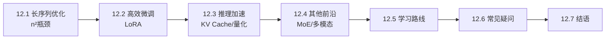
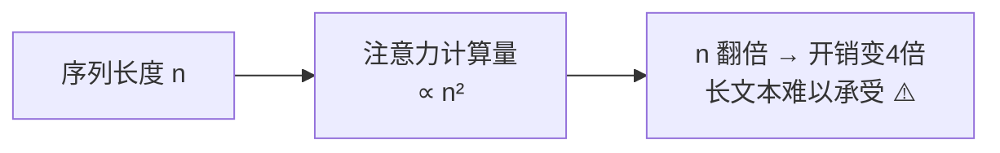
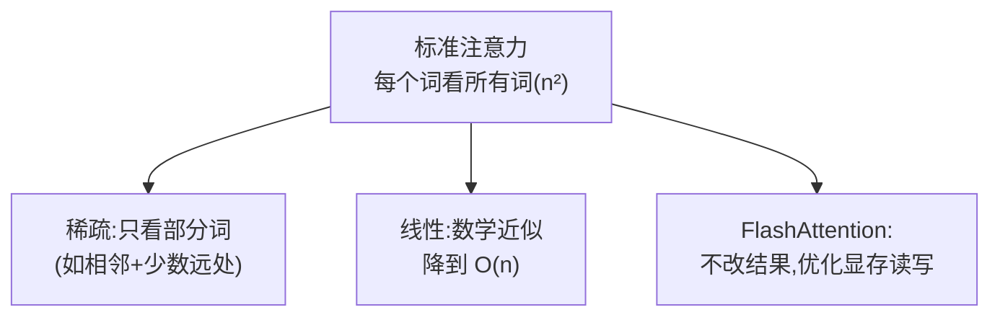
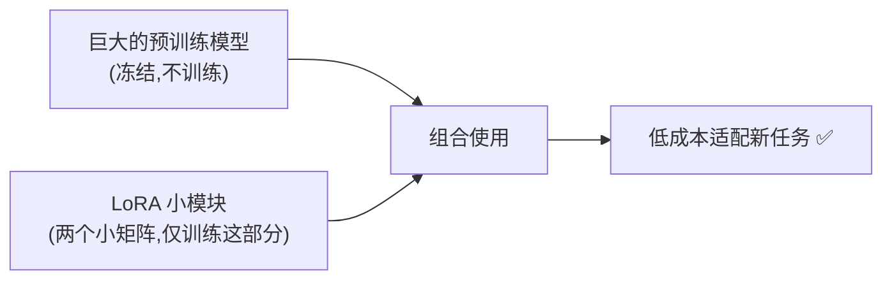
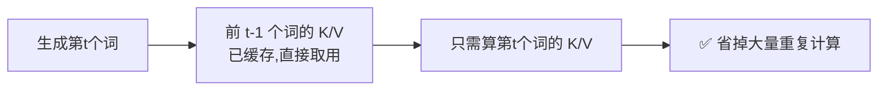
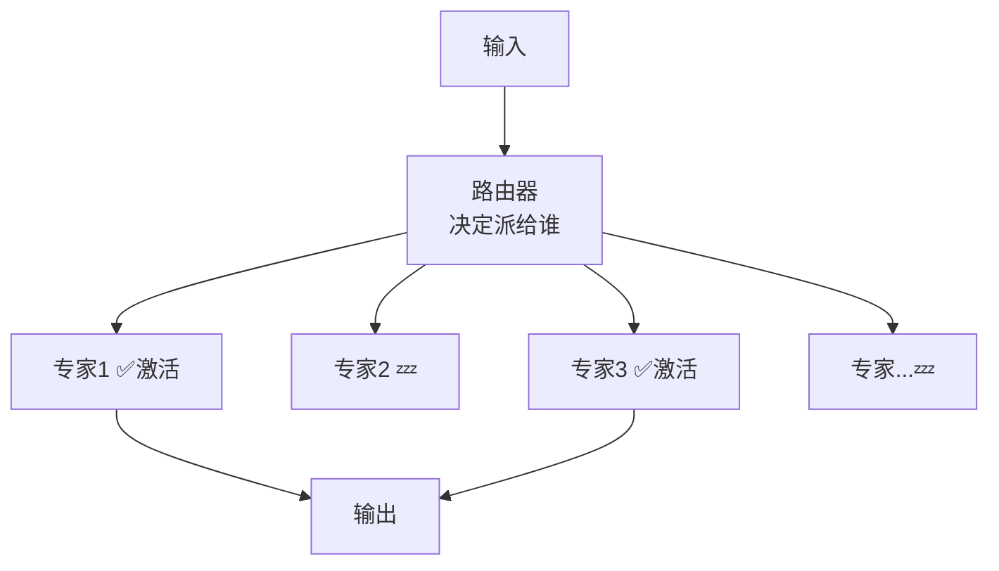
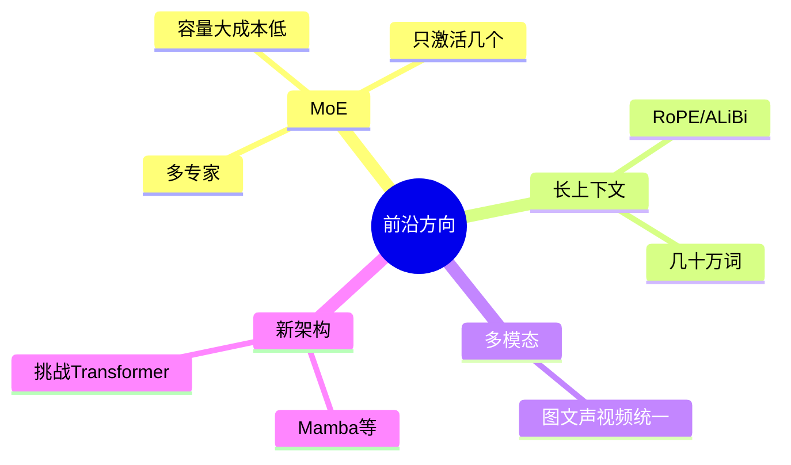
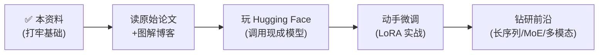
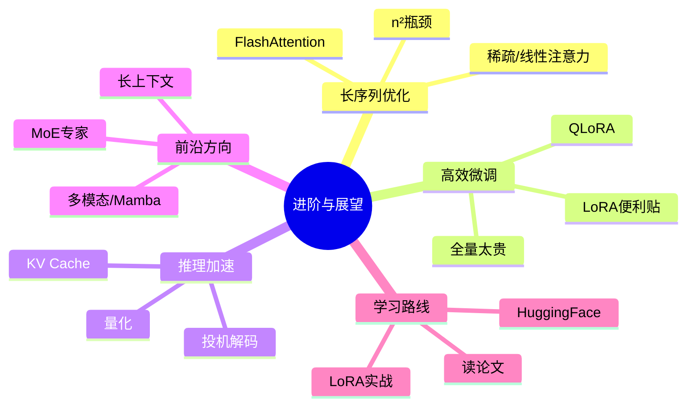

# 第 12 章 进阶话题与展望

> 恭喜你走到了最后一章!前面我们把标准 Transformer 里里外外拆了个遍。这一章带你看看它的"痛点"与前沿优化方向,并给出继续深入的学习路线,为你的进阶之路铺好第一块砖。
>
> 📌 本章的内容偏"开阔眼界",不要求全部掌握。目标是让你知道"还有哪些坑、业界怎么填坑、你接下来往哪走"。

---

## 12.0 本章导览

---

## 12.1 长序列优化:注意力的"平方"烦恼

### 12.1.1 痛点:计算量随长度平方增长

回顾第 3 章:注意力要让**每个词和每个其他词**都算一次匹配度。如果句子有 $n$ 个词,那个注意力分数矩阵就是 $n \times n$ 的,要算 $n^2$ 个匹配度。

这意味着计算量和显存都随长度呈 **$O(n^2)$ 平方级**增长:

| 序列长度 n | 注意力计算量 ∝ n² | 相对开销 |
|:---:|:---:|:---:|
| 512 | 26 万 | 1× |
| 1,024 | 105 万 | 4× |
| 4,096 | 1,678 万 | 64× |
| 32,768 | 10.7 亿 | 4096× |

**比喻**:10 个人开会,两两握手要 45 次;100 个人握手就要近 5000 次。人数翻 10 倍,握手次数翻了 100 倍。这就是 Transformer 处理长文本(整本书、长文档)的最大瓶颈。

### 12.1.2 优化方向

研究者提出了很多办法给注意力"减负",简单了解方向即可:

| 方向 | 思路(一句话) | 代表 |
|------|--------------|------|
| **稀疏注意力** | 不让每个词关注所有词,只关注一部分(相邻的、重要的、隔几个取一个) | Longformer, BigBird |
| **线性注意力** | 用数学近似把 $O(n^2)$ 降到 $O(n)$ | Linformer, Performer |
| **FlashAttention** | 不改数学,而是优化 GPU 读写显存的方式,大幅提速省显存 | FlashAttention |

> 💡 **FlashAttention 特别值得一提**:它不改变注意力的计算结果(数学完全等价),纯靠工程上聪明地利用 GPU 的高速缓存、减少显存反复读写,就让训练和推理又快又省显存。它已成为当今几乎所有大模型的标配——一个"纯工程优化撬动巨大收益"的经典案例。

---

## 12.2 高效微调:小成本"驯服"大模型

### 12.2.1 痛点:全量微调太贵

第 10 章讲过"预训练 + 微调"。但大模型动辄几百亿参数,如果微调时**更新全部参数**:

- 需要存储所有参数的梯度和优化器状态,显存需求是参数量的好几倍。
- 每微调一个任务,就要存一整份几百 GB 的模型副本。

普通人和中小团队根本玩不起。

### 12.2.2 参数高效微调(PEFT)与 LoRA

**思路**:冻结原模型的绝大部分参数不动,只训练**极少量**新增的参数,就能让大模型适配新任务。这类方法统称 **PEFT(Parameter-Efficient Fine-Tuning)**。

其中最流行的是 **LoRA(Low-Rank Adaptation,低秩适配)**:

**比喻:给大模型贴"便利贴"**。不去改动那本厚厚的原著(冻结原参数),而是在旁边贴一些小小的便利贴写上批注(少量可训练的低秩矩阵)。原著一个字不改,靠便利贴就实现了定制。

**它的巧妙之处**:LoRA 假设"微调时参数的改变量"其实是"低秩的"(可以用两个很小的矩阵相乘来近似),于是只训练这两个小矩阵,而不动原来的大矩阵。

- **好处**:训练参数量可降到原来的**千分之一甚至更少**,单张消费级显卡就能微调百亿级大模型;还能为不同任务准备不同的"便利贴"(几 MB 一个),随时切换、随意组合。
- LoRA 是当今开源社区微调大模型(如给 LLaMA、Qwen 做专属定制)的绝对主流方法。其变体 **QLoRA** 还结合量化,进一步降低门槛。

> 🛠️ **动手建议**:如果你想真正体验大模型微调,LoRA 是最好的起点。用 Hugging Face 的 `peft` 库,几十行代码 + 一张普通显卡,就能给开源模型注入你自己的数据风格。

---

## 12.3 推理加速:让大模型跑得更快更省

训练贵,推理(实际使用)也不便宜——尤其大模型逐词生成很慢(第 8 章)。几个关键的推理优化:

### 12.3.1 KV Cache:别重复算已经算过的

回顾第 8 章的自回归生成:每生成一个新词,都要把整个已生成序列重新跑一遍。但其实,**前面那些词的 Key 和 Value 每一步都是一样的**,重复计算太浪费。

**KV Cache** 就是把已经算过的 K、V **缓存**起来,每步只需计算新词的 K、V,大幅减少重复计算。

代价是要占用显存来存缓存(长序列时 KV Cache 本身也很占显存,这又成了新的优化点)。它是所有大模型推理引擎(如 vLLM)的核心技术。

### 12.3.2 量化:用更低精度省显存

**量化(Quantization)** 是把模型参数从高精度(如 32 位浮点)压缩成低精度(如 8 位甚至 4 位整数)存储和计算。

**比喻**:把一张高清大图压缩成小图——文件小多了,但看起来还够清楚。量化后模型显存占用大幅下降,推理更快,而精度损失通常可接受。这让大模型能塞进手机、消费级显卡里运行。

### 12.3.3 其他推理优化

- **投机解码(Speculative Decoding)**:用一个小模型快速"猜"几个词,大模型一次性验证,加速生成。
- **批处理(Batching)**:把多个请求打包一起算,提升 GPU 利用率。

---

## 12.4 其他前沿方向(了解即可)

### 12.4.1 混合专家模型(MoE)

**MoE(Mixture of Experts)**:模型里有很多"专家子网络",每次只**激活其中几个**(由一个"路由器"决定派给哪些专家),从而在参数量巨大的同时保持**每次计算量可控**。

**比喻**:一家大医院有几十个科室专家,但你来看病,只需挂 1-2 个相关科室,不用惊动所有专家。这样"总容量很大,但单次成本低"。代表:Mixtral、DeepSeek-MoE 等。

### 12.4.2 更长的上下文

结合 RoPE / ALiBi(第 5 章)等位置编码技术,加上稀疏注意力等优化,现代大模型能"读"的上下文已经从几千词扩展到**几十万甚至上百万词**(能一次读完整本书、整个代码库)。

### 12.4.3 多模态融合与新架构探索

- **多模态融合**:让一个模型统一处理文字、图像、音频、视频(第 11 章),向"通用智能体"演进。
- **新架构探索**:如 **Mamba**(状态空间模型)等试图在超长序列上做得比 Transformer 更高效——Transformer 未必是终点,但目前仍是绝对主流。

---

## 12.5 学习资源与继续深入的路线

学完这份资料,你已经有了扎实的基础。想继续深入,推荐这样的路线:

### 12.5.1 必读经典

- **原始论文**:《Attention Is All You Need》(2017)——一切的起点,学完本资料再回头读会轻松很多。
- **图解博客**:Jay Alammar 的《The Illustrated Transformer》——图解经典,和本资料互补。
- **代码精读**:哈佛 NLP 的《The Annotated Transformer》——逐行注释的论文复现。
- **进阶课程**:斯坦福 CS224n(NLP)、CS25(Transformers 专题)等公开课。

### 12.5.2 动手实践(最重要)

- **Hugging Face `transformers` 库**:业界标准工具库,几行代码就能加载 BERT/GPT 等模型,强烈建议上手。
- **微调练习**:找一个小数据集,用 `peft` 库的 **LoRA** 微调一个开源模型,完整体验一遍流程。
- **重读本资料第 9 章**:把从零实现的代码扩展成真正的翻译任务,或加上 KV Cache 加速推理。

### 12.5.3 建议的进阶顺序

> 💡 **学习心法**:不要试图一次搞懂所有细节。先建立整体直觉(本资料的目标),再在动手实践中反复回看、逐步加深。理解 Transformer 是一个**螺旋上升**的过程——每次带着新问题重读,都会有新收获。

---

## 12.6 常见疑问 FAQ

**Q1:Transformer 会被取代吗?**
短期内不会。它仍是绝对主流,生态、工具、经验都极其成熟。但学术界一直在探索更高效的替代品(如 Mamba)。健康的心态是:掌握 Transformer 这个"当前标准",同时对新架构保持关注。

**Q2:我需要自己实现 FlashAttention、LoRA 这些吗?**
不需要。它们都已封装进成熟的库(PyTorch、Hugging Face `transformers`/`peft` 等),你直接调用即可。理解原理是为了会用、会调、会排错。

**Q3:显存不够,能跑大模型吗?**
可以。靠**量化**(如 4-bit)把模型压小,靠 **LoRA/QLoRA** 降低微调开销,很多百亿级模型已经能在单张消费级显卡上运行或微调。

**Q4:长上下文是不是越长越好?**
不完全是。上下文越长,开销越大,而且模型未必能有效利用中间部分的信息(存在"迷失在中间"的现象)。够用即可,不必盲目追求超长。

**Q5:学到这里,我算入门了吗?**
如果你读懂了本资料并跑通了第 9 章代码,你已经具备了扎实的 Transformer 基础,超过了很多"只会调 API"的使用者。接下来靠实践继续精进即可。

---

## 12.7 本章小结

- **长序列瓶颈**:注意力计算量随长度呈 $O(n^2)$ 增长(长度翻倍开销 4 倍);优化方向有稀疏注意力、线性注意力、FlashAttention(纯工程优化,标配)。
- **高效微调**:LoRA 等 PEFT 方法冻结原模型、只训练少量低秩参数(像"贴便利贴"),让普通人也能定制大模型;QLoRA 门槛更低。
- **推理加速**:KV Cache(不重算旧 K/V)、量化(低精度省显存)、投机解码等。
- **前沿方向**:MoE(多专家只激活几个)、超长上下文、多模态融合、Mamba 等新架构。
- **学习路线**:本资料打基础 → 读经典论文与图解 → 玩 Hugging Face → LoRA 实战 → 钻研前沿。核心心法是"先建直觉,再螺旋上升"。

### 结语

到这里,《Transformer 从入门到精通》的正文就全部结束了!你已经完成了一段完整的旅程:

- 从**为什么需要它**(第 1 章)出发,
- 准备好**数学工具**(第 2 章),
- 拆解了**每一个核心零件**(第 3-6 章:注意力、多头、位置编码、FFN/残差/归一化/掩码),
- 看清了**整体架构**(第 7 章)和**训练推理**(第 8 章),
- 亲手**从零实现**了一个能跑的 Transformer(第 9 章),
- 认识了**预训练家族**(第 10 章)、**广泛应用**(第 11 章),
- 最后眺望了**前沿与未来**(第 12 章)。

Transformer 是理解当今整个 AI 世界的一把总钥匙。愿这份资料成为你 AI 之路上一块坚实的垫脚石。接下来的附录里,还有术语对照表、常见问题和延伸阅读,供你随时查阅。

**祝学习愉快,继续前进!🚀**

---

📖 **上一章**:第 11 章 Transformer 的广泛应用 ｜ **下一章**:附录 A 术语中英文对照表
