# 第 1 章：开发准备与创建自建应用

## 本章目标

本章不写业务功能。目标有两个：

1. **理解原理**：企业微信的凭证和权限是怎么运作的。这决定了后面每一章的代码结构。
2. **拿到凭证**：把后面十一章都要用的配置项取到手并验证可用。

学完本章你会得到一张填好的配置清单：

| 配置项 | 用途 | 从哪里取 |
|---|---|---|
| 企业 ID（CorpID） | 所有接口都要用 | 我的企业 → 企业信息 |
| AgentId | 发消息、OAuth、JS-SDK | 自建应用详情页 |
| 应用 Secret | 换应用的 access_token | 自建应用详情页 |
| 通讯录 Secret | 读部门和成员 | 管理工具 → 通讯录同步 |
| 企业可信 IP | 允许你的服务器调接口 | 应用详情页、通讯录同步页 |
| 自己的 UserId | 测试收消息 | 通讯录 → 成员详情 |

**建议现在就新建一个文本文件，边做边填。**后面十一章反复要用。

---

# 第一部分：原理

这部分不用动手操作，但它是整个教程里最省时间的部分。理解了这四个原理，后面 90% 的报错你自己就能判断原因。

## 一、五个概念的层次关系

企业微信开发里的名词容易混，先理清它们的隶属关系。

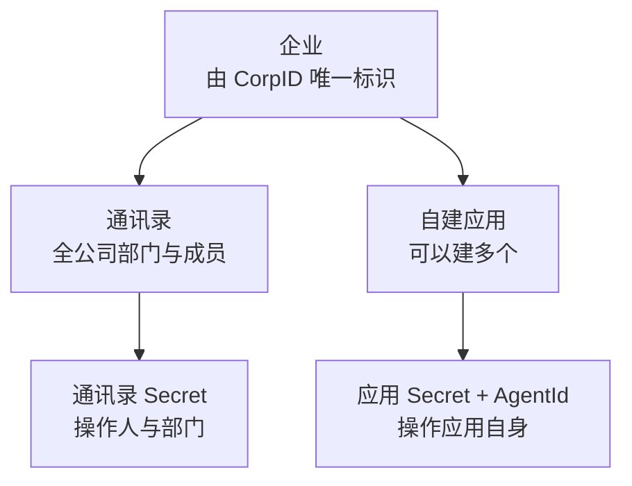

五个概念的准确含义：

| 概念 | 是什么 | 特点 |
|---|---|---|
| 企业 ID（CorpID） | 你们公司在企业微信里的编号 | 全公司唯一，所有应用共用 |
| 通讯录 | 全公司的部门和成员名单 | 企业级资源，独立于应用 |
| 应用（自建应用） | 你自己开发的功能模块 | 可建多个，互相独立 |
| AgentId | 某个应用的编号 | 数字，每个应用不同 |
| Secret | 某个凭证的密码 | 不止一个，见第三节 |

注意图里的一个要点：**通讯录和应用是并列的两条线，各自有自己的 Secret。**这不是设计冗余，原因见第三节。

## 二、原理一：为什么要有 access_token

### 一个直觉上的疑问

既然有了 CorpID 和 Secret，为什么不每次调接口直接把它们传过去，非要先换一个 access_token？

### 完整流程

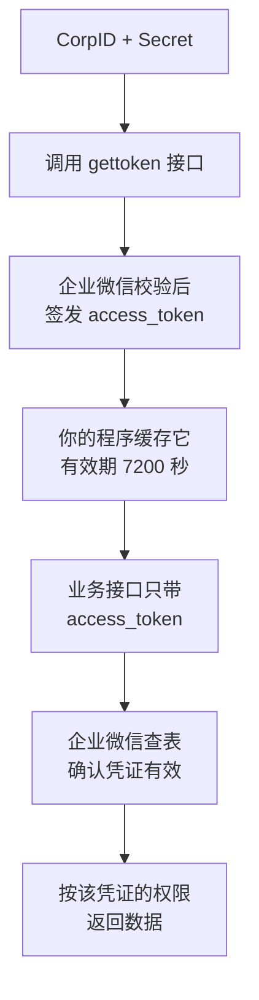

### 原因：长期凭证换短期凭证

这是一个通用的安全设计模式，核心是**把长期有效的机密和高频使用的凭证分开**。

| | Secret | access_token |
|---|---|---|
| 有效期 | 长期，你不改它就一直有效 | 7200 秒后自动失效 |
| 使用频率 | 很低，只在换 token 时用 | 很高，每次业务调用都用 |
| 泄露后果 | 严重，且不会自动解除 | 有限，最多两小时 |
| 能否撤销 | 需要人工去后台重置 | 自动过期 |

关键差别在**暴露面**。如果每次调接口都传 Secret，那么这个长期机密会在你的日志、抓包记录、异常堆栈里反复出现，泄露概率随调用次数上升。而换成 token 后，Secret 一天可能只用一次，其余成千上万次调用带的都是两小时后就作废的东西。

### access_token 的本质：它是一把「查表的钥匙」

这一点很多人误解。access_token **不是**一段加密后的数据，你无法从它里面解出企业信息。

它的真实工作方式是：企业微信服务端保存了一张映射表。

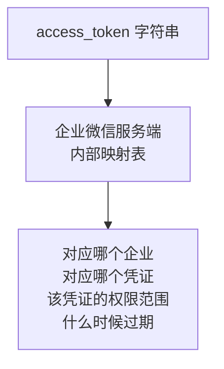

由此可以推出三个结论：

1. **你无法自己伪造 token**，因为服务端表里没有这条记录。
2. **你无法从 token 反推 Secret**，两者没有数学关系，只有映射关系。
3. **token 只是索引，权限记录在服务端**。所以同一个企业用不同 Secret 换的 token，权限完全不同。

### 一个关键行为：重复获取不会顶掉旧的

企业微信的规则是：**在有效期内重复获取，返回的是同一个 token**；过期后获取才会返回新的（参见[腾讯云开发者社区：企业微信 AccessToken 管理](https://cloud.tencent.com/developer/article/1994156)、[企业微信 JSAPI 接入实践](https://juejin.cn/post/6977565552084516901)。内容已改写以符合授权要求）。

用上面的映射表模型就很好理解：调用 `gettoken` 时，服务端**先查表**，发现这个企业和这个 Secret 已经有一条未过期的记录，就把原来那个 token 返回给你，而不是新签发一个。

### 这个行为为什么对本教程很重要

如果你以前做过微信公众号（订阅号）开发，可能记得完全相反的规则：重复获取会导致上次的 token 失效。两种模型的后果差别巨大。

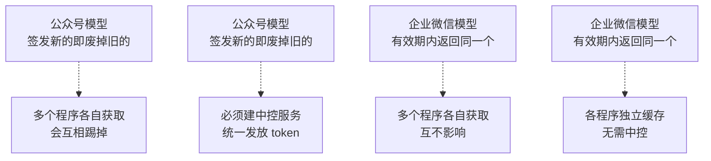

这正是本教程能把 Python 和 C# 完全分开、互不调用的技术前提：**两边各自缓存自己的 token 是安全的，不需要谁去调用谁。**

如果企业微信用的是公众号那种模型，本教程就必须设计一个统一的 token 中控服务，架构会复杂很多。

## 三、原理二：权限绑定在凭证上，不在人上

### 这是理解「两种 Secret」的钥匙

很多人以为 Secret 只是一个密码，验证通过就获得全部权限。**企业微信不是这样。**

企业微信的模型是：**权限跟着凭证走。你用哪个 Secret 换的 token，就只拥有那个 Secret 对应的能力，不多也不少。**

所以不存在一个「万能 Secret」。这是一种能力绑定的设计：凭证本身就限定了能做什么。

### 两种 Secret 对应的能力

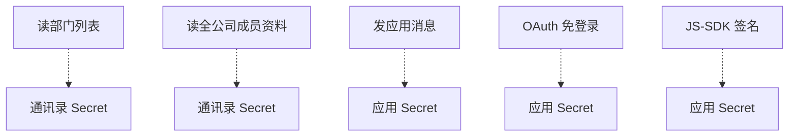

### 两种 Secret 对照表

| | 应用 Secret | 通讯录 Secret |
|---|---|---|
| 属于谁 | 某一个自建应用 | 整个企业的通讯录 |
| 位置 | 应用管理 → 你的应用 | 安全与管理 → 管理工具 → 通讯录同步 |
| 数量 | 每个应用一个 | 全企业一个 |
| 能做什么 | 发消息、OAuth、JS-SDK | 读部门、读成员、改通讯录 |
| 本教程哪章用 | 第 2、4、5、8、9、10、11 章 | 第 6 章 |

### 记忆方法

```text
要对「人和部门」做事      → 通讯录 Secret
要对「应用自己」做事      → 应用 Secret
```

发消息虽然也涉及人，但**发送这个动作是应用做的**，所以用应用 Secret。

### 为什么要分成两个而不是一个

因为这两类操作的**风险等级完全不同**。

读写全公司通讯录是企业级的高危操作，写错一行代码可能删掉真实员工数据。而一个应用发消息的影响面小得多。把它们绑在同一个 Secret 上，意味着任何一个应用的 Secret 泄露，全公司通讯录都暴露。

分开之后，即使你的消息应用 Secret 泄露，攻击者也读不到全公司名单。这是**最小权限原则**的体现。

## 四、原理三：一个请求要过三层检查

理解这一层，你就能从错误码直接定位问题。

企业微信收到你的请求后，是分三层依次检查的：

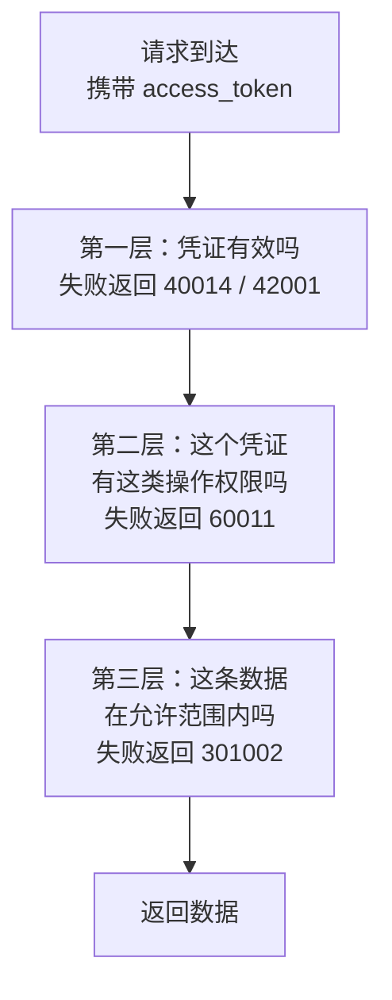

三层的职责各不相同：

| 层 | 检查什么 | 由什么决定 | 典型错误码 |
|---|---|---|---|
| 第一层 | token 是不是真的、过期没 | token 本身 | 40014、42001 |
| 第二层 | 这个凭证能不能做这类事 | 用哪个 Secret 换的 | 60011 |
| 第三层 | 这条具体数据能不能给你 | 应用可见范围 | 301002 |

### 第三层最容易被忽略

第三层的存在，解释了一个让新手困惑的现象：**接口调用成功了，但查不到某个人，或者消息发不到某个人。**

原因是应用可见范围。可见范围不只是控制工作台上显示不显示图标，它是**应用能触达的数据边界**。

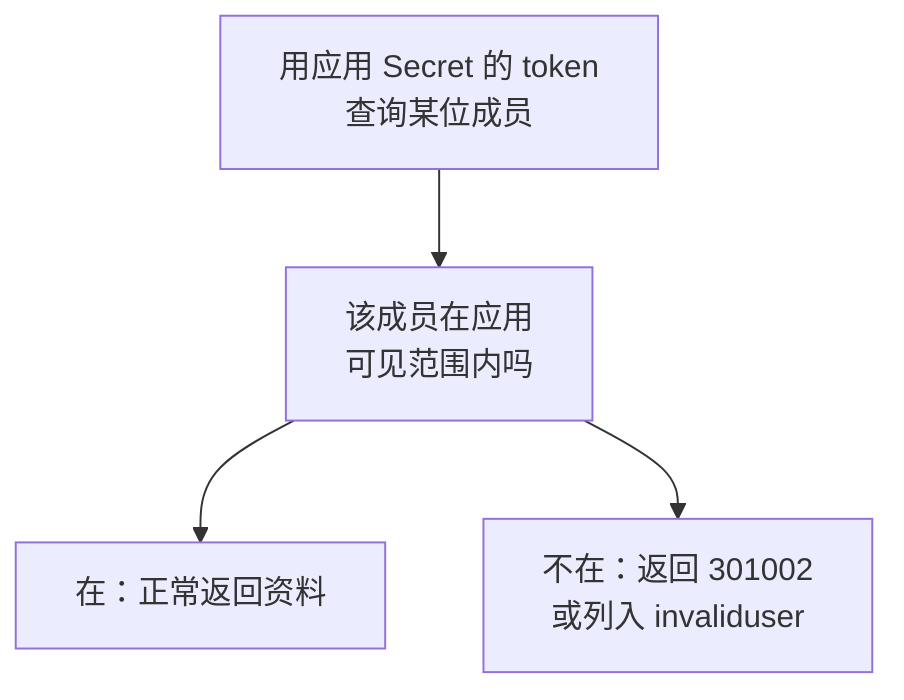

而通讯录 Secret **不受某个应用可见范围的限制**，因为它属于企业级通讯录能力，不隶属于任何应用。

### 由此得出第 6 章的设计依据

第 6 章要做的是「查询企业员工」，需要看到全公司。

- 用应用 Secret：只能查到可见范围内的人，如果范围是 3 个人就只能查到 3 个
- 用通讯录 Secret：可以查到全公司

**所以第 6 章必须用通讯录 Secret。**这不是随便选的，而是由权限模型决定的。

## 五、原理四：两层结果判断

### 现象

企业微信业务失败时，HTTP 状态码通常仍然是 200。也就是说 Python 的 `requests` 不抛异常，C# 也不报错，但业务其实失败了。

### 原理：HTTP 只是管道

企业微信的接口是 RPC 风格，也就是**把「远程调用一个函数」这件事套在 HTTP 上传输**。这就产生了两个独立的结果层：

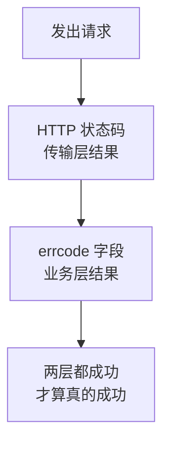

两层的含义完全不同：

| 层 | 回答的问题 | 例子 |
|---|---|---|
| HTTP 状态码 | 请求有没有送达并得到响应 | 200 送达、超时、503 |
| errcode | 业务有没有办成 | 0 成功、40001 密码错 |

「密码错了」在传输层是完全成功的：请求送到了，服务器也正常回答了，只不过答案是「不行」。所以 HTTP 状态码是 200，而 `errcode` 是 40001。

### 正确的判断顺序

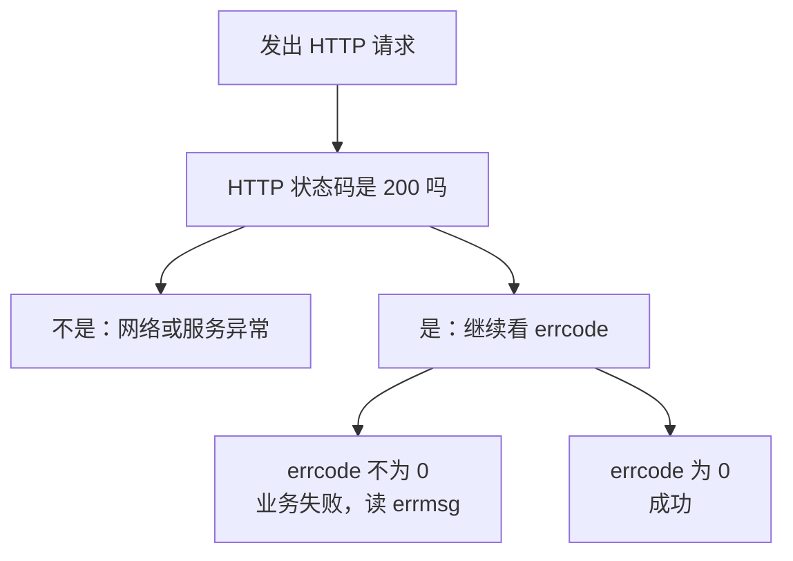

**每次调用都必须做这两层判断。**这是贯穿全教程的铁律，本章的自检脚本也是这么写的。

### 还有第三种情况：部分成功

发消息时会遇到更复杂的情形：`errcode` 是 0，但某些收件人其实没收到。这时返回里会有一个 `invaliduser` 字段列出失败的人。

所以发消息的判断是三步：HTTP 状态码 → `errcode` → `invaliduser`。第 2 章会实际演示。

## 六、原理五：IP 白名单是第二道门

### 为什么需要它

Secret 是长期机密，但现实中泄露途径很多：提交进 Git、打印到日志、截图求助、离职员工带走。

企业微信的应对是**再加一道与密码无关的门**：来源 IP 检查。

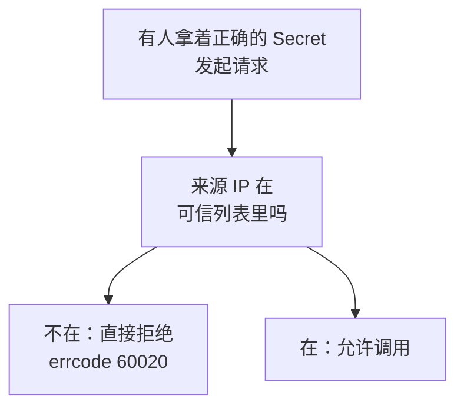

这样即使 Secret 泄露，攻击者从自己的机器上也调不通，因为他的 IP 不在你的列表里。这是**纵深防御**：不指望单一措施万无一失，而是让攻击者必须同时突破多道。

### 代价

安全总有代价。这里的代价是**你的服务器出口 IP 一变，就得去后台改配置**。用家庭宽带或公司宽带做开发时，IP 可能每天都变。

### 为什么错误信息里直接告诉你 IP

60020 的错误信息长这样：

```json
{
  "errcode": 60020,
  "errmsg": "not allow to access from your ip, hint: [...], from ip: 123.45.67.89, more info at https://open.work.weixin.qq.com/devtool/query?e=60020"
}
```

**`from ip:` 后面那个就是你要加进白名单的 IP。**

企业微信愿意直接告诉你，是因为「你自己的出口 IP」对你不是秘密，对攻击者也没有额外价值，但对配置的人来说能省掉查询出口 IP 的麻烦（错误信息格式参见[企业微信可信 IP 配置](https://www.cnblogs.com/Maker-Liu/p/18889308)、[通讯录同步 API 报错 60020 的处理](https://www.cnblogs.com/ChaFan/p/17980208)。内容已改写以符合授权要求）。

**所以遇到 60020 不要去猜，直接抄错误信息里的 IP。**

---

# 第二部分：动手操作

## 七、创建自建应用

### 第 1 步：进入管理后台

浏览器打开并登录：

```text
https://work.weixin.qq.com/
```

必须用**管理员账号**。普通成员登录后看不到应用管理菜单。

### 第 2 步：创建应用

```text
应用管理  →  应用  →  自建  →  创建应用
```

需要填三项：

| 项目 | 填什么 | 注意 |
|---|---|---|
| 应用 logo | 上传一张图 | 必填 |
| 应用名称 | 例如「员工查询」 | 员工在工作台看到的名字 |
| 可见范围 | **先只选你自己** | 见下面说明 |

### 第 3 步：可见范围先只选自己

结合第四节讲的第三层检查，可见范围是应用的数据边界。开发阶段只选自己有两个好处：

1. 调试的测试消息不会骚扰同事
2. 自己在范围内，才能自测收消息和登录

下面这些现象**全都是**可见范围没设对造成的，本质都是第三层检查不通过：

| 现象 | 原因 |
|---|---|
| 发消息返回 `invaliduser` | 收件人不在可见范围 |
| 工作台看不到应用图标 | 自己不在可见范围 |
| OAuth 拿到的 userid 为空 | 访问者不在可见范围 |
| 查询成员返回 301002 | 该成员不在可见范围 |

## 八、取企业 ID

```text
我的企业  →  企业信息  →  页面往下拉
```

页面底部的「企业 ID」，一串字母数字混合的字符串。

### 企业 ID 要保密吗：标识与凭证的区别

**不需要保密。**它会出现在前端页面里（第 9 章 JS-SDK 就要传给浏览器）。

判断一个值要不要保密，看它属于哪一类：

| 类型 | 回答的问题 | 例子 | 泄露后果 |
|---|---|---|---|
| 标识 | 你是谁 | CorpID、AgentId、UserId | 别人知道你是谁，但无法冒充 |
| 凭证 | 你能否证明你是你 | Secret | 别人可以冒充你 |

标识可以公开，凭证必须保密。判断标准是：**光有这个值，别人能不能冒充你调接口。**CorpID 不行，Secret 可以。

## 九、取 AgentId 和应用 Secret

```text
应用管理  →  自建  →  点击你的应用
```

- **AgentId**：直接显示，一串数字，例如 `1000002`
- **应用 Secret**：需要点击「查看」

点「查看」后，企业微信会把 Secret 推送到你的企业微信客户端（在「企业微信团队」的消息里），部分版本直接在页面显示。**所以取 Secret 时手边要有已登录企业微信的手机或客户端。**

拿到后立刻填进配置清单，再次查看要重新走一遍流程。

### Secret 的安全要求

| 要求 | 原因 |
|---|---|
| 不写进前端页面 | 浏览器里的东西等于公开 |
| 不提交到 Git | 历史记录删不干净 |
| 不写进日志 | 排错时容易顺手打印 |
| 不发到微信群 | 截图求助时记得遮挡 |

泄露后果：拿到它的人可以给可见范围内所有员工发消息。如果泄露的是通讯录 Secret，后果是全公司名单外泄。

**发现泄露就立刻去后台重置 Secret。**重置后旧的立即失效，这也是长期凭证唯一的撤销手段。

## 十、开启通讯录同步，取通讯录 Secret

这和上一节是**两个完全不同的位置**，别找错。

```text
安全与管理  →  管理工具  →  通讯录同步
```

进去后要先**开启「API 接口同步」**，开启后才会显示通讯录 Secret，同时可以设置权限是只读还是可编辑（参见[企业微信开发授权准备](https://www.cnblogs.com/leoxjy/p/16140038.html)、[Java 企业微信开发：通讯录同步](https://developer.aliyun.com/article/621534)。内容已改写以符合授权要求）。

### 权限务必选「只读」

本教程第 6 章只做查询。选只读的理由很实际：

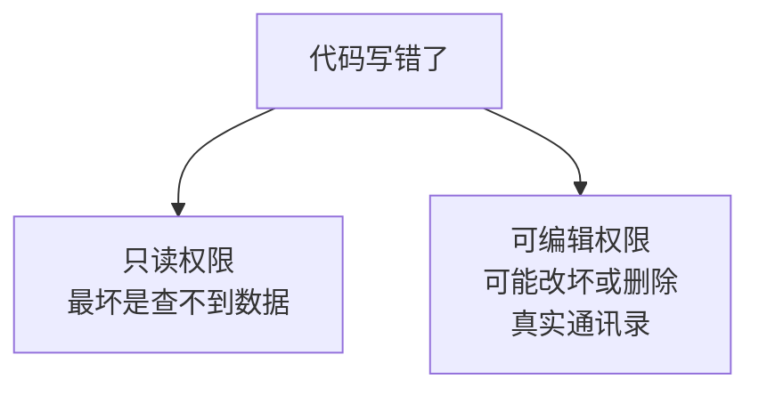

只读权限下，最坏结果是功能不可用；可编辑权限下，最坏结果是生产数据损坏。等以后确实要做人员同步时再开编辑权限。

## 十一、配置企业可信 IP

原理见第六节。这里只讲操作。

### 两处都要配

| 用哪个 Secret | 在哪里配可信 IP |
|---|---|
| 应用 Secret | 应用详情页 → 开发者接口 → 企业可信 IP |
| 通讯录 Secret | 安全与管理 → 管理工具 → 通讯录同步 → 可信 IP |

**只配一处，另一处照样报 60020。**因为这是两个独立的凭证，各有各的白名单。

### 填什么 IP

填**公网出口 IP**，不是内网 IP（不是 192.168 开头那种）。

| 情况 | 处理办法 |
|---|---|
| 家里或公司宽带开发 | 出口 IP 会变，变了就更新 |
| 云服务器 | 用固定公网 IP，一次配好 |
| 多台服务器 | 每台的出口 IP 都要加 |
| Python 和 IIS 不在同一台 | 两台的 IP 都要加 |

遇到 60020 就从错误信息里抄 `from ip` 的值。

## 十二、access_token 缓存的实现要点

原理见第二节，这里讲具体怎么写。

### 缓存判断流程

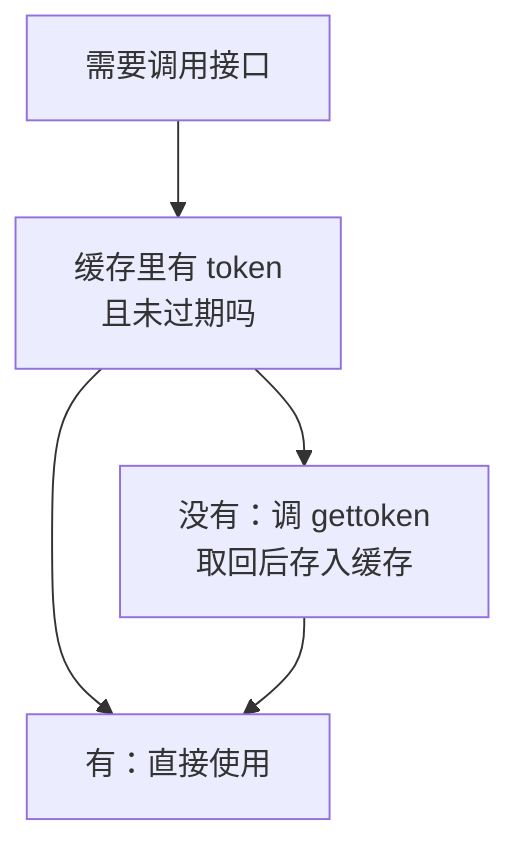

### 要点一：必须提前过期

不要按 7200 秒算到期，要**提前 5 分钟就认为它失效**。

原因是从「你判断 token 还有效」到「请求真正抵达企业微信」之间存在三段时间差：

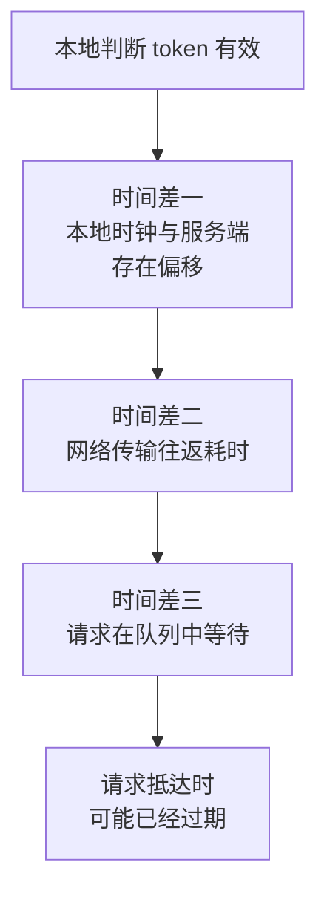

如果卡在 7200 秒的边界发请求，很可能你判断「还有 2 秒有效」，但请求抵达时已经失效，返回 42001。

提前 5 分钟是经验值：远小于 7200 秒（不浪费），又足够覆盖时钟偏移和网络抖动。

### 要点二：按 Secret 分别缓存

应用 token 和通讯录 token 是**两个不同的值**。用同一个变量存会互相覆盖，导致本该用通讯录 token 的调用拿到了应用 token，然后报权限错误。

正确做法是用 Secret 作为键来存：

```text
缓存["应用Secret"]     → token A, 过期时间
缓存["通讯录Secret"]   → token B, 过期时间
```

第 4 章（Python）和第 6 章（C#）会各自给出完整代码。

## 十三、错误码速查

### 官方查询工具

企业微信提供在线查询页，把错误码填进末尾即可：

```text
https://open.work.weixin.qq.com/devtool/query?e=60020
```

遇到不认识的错误码，先用它查，比搜索引擎准确。

### 本章相关错误码

按第四节的三层模型归类，更容易记：

| 错误码 | 属于哪层 | 含义 | 通常原因 |
|---|---|---|---|
| 40001 | 换 token 阶段 | Secret 不正确 | 抄错，或拿错了另一个 Secret |
| 40013 | 换 token 阶段 | 企业 ID 不正确 | CorpID 抄错 |
| 60020 | 换 token 阶段 | IP 不在白名单 | 见第六节 |
| 40014 | 第一层 | access_token 不合法 | 用了别的应用的 token |
| 41001 | 第一层 | 缺少 access_token | 参数名拼错 |
| 42001 | 第一层 | access_token 已过期 | 没做提前过期判断 |
| 60011 | 第二层 | 没有该操作权限 | AgentId 和 Secret 不属于同一应用 |
| 301002 | 第三层 | 无权查看该成员 | 用应用 Secret 查可见范围外的人 |

## 十四、准备 Python 环境

### 安装 Python

到 python.org 下载 Python 3 的 Windows 安装包。安装时有一个关键选项：

**必须勾选「Add Python to PATH」。**不勾选的话，命令行敲 `python` 会提示找不到命令。这是最常见的安装问题。

验证：

```bash
python --version
pip --version
```

两条都输出版本号才算装好。

### 创建虚拟环境

不要把包装到系统 Python 里。为本项目建独立环境：

```bash
mkdir C:\WeComTutorial
cd C:\WeComTutorial
python -m venv venv
venv\Scripts\activate
```

激活成功后提示符前面会出现 `(venv)`。

### 安装依赖

```bash
pip install requests
```

## 十五、准备 IIS 和 C# 环境

### 启用 IIS

打开「启用或关闭 Windows 功能」，勾选：

```text
Internet Information Services
  ├── Web 管理工具
  │     └── IIS 管理控制台
  └── 万维网服务
        ├── 应用程序开发功能
        │     ├── .NET 扩展性
        │     └── ASP.NET            ← 必须勾选
        └── 常见 HTTP 功能
              ├── 静态内容
              └── 默认文档
```

**ASP.NET 一定要勾。**只装 IIS 没装 ASP.NET，`.aspx` 会被当成文本文件下载而不是执行。

验证：浏览器打开 `http://localhost/`，能看到 IIS 欢迎页。

### 安装 Visual Studio

工作负载选「ASP.NET 和 Web 开发」。WebForms 属于 .NET Framework，注意不要只装 .NET Core 组件。

### 准备 SQL Server

SQL Server Express 免费版够用，同时装 SQL Server Management Studio。第 3 章会给出建表脚本，本章只需确认能连上。

## 十六、配置文件与安全

### Python 端

单独建 `config.py`，不要把凭证写在业务代码里：

```python
# -*- coding: utf-8 -*-
"""企业微信配置。此文件含机密信息，不要提交到代码仓库。"""

# 企业 ID：属于标识，不是凭证
CORP_ID = "你的企业ID"

# 自建应用
AGENT_ID = 1000002
APP_SECRET = "你的应用Secret"          # 发消息、OAuth 用

# 通讯录
# 注意：本教程里读通讯录由第 6 章的 C# 完成，Python 端不做这件事。
# 这里配置它只为本章的 check_env.py 自检使用。
CONTACTS_SECRET = "你的通讯录Secret"

# 接口基础地址
BASE_URL = "https://qyapi.weixin.qq.com/cgi-bin"

# 测试用：你自己的 UserId
TEST_USER_ID = "你的UserId"
```

### C# 端

`Web.config` 的 `appSettings` 节：

```xml
<configuration>
  <appSettings>
    <add key="WeCom.CorpId" value="你的企业ID" />
    <add key="WeCom.AgentId" value="1000002" />
    <!-- 应用 Secret：发消息、OAuth、JS-SDK -->
    <add key="WeCom.AppSecret" value="你的应用Secret" />
    <!-- 通讯录 Secret：读部门和成员 -->
    <add key="WeCom.ContactsSecret" value="你的通讯录Secret" />
    <add key="WeCom.BaseUrl" value="https://qyapi.weixin.qq.com/cgi-bin" />
  </appSettings>
</configuration>
```

### 防止 Secret 进入代码仓库

项目根目录建 `.gitignore`：

```text
# 含机密的配置文件
config.py
Web.config

# Python
venv/
__pycache__/
*.pyc

# Visual Studio
bin/
obj/
.vs/
```

同时提交一份不含真实值的模板 `config.example.py`，让别人知道要配哪些项：

```python
CORP_ID = ""
AGENT_ID = 0
APP_SECRET = ""
CONTACTS_SECRET = ""
BASE_URL = "https://qyapi.weixin.qq.com/cgi-bin"
TEST_USER_ID = ""
```

**注意**：Secret 一旦提交过 Git，即使后来删掉，历史记录里依然存在。这种情况唯一可靠的补救是去后台重置 Secret。

### 开发和生产分开

建议**开发阶段单独建一个自建应用**，可见范围只有你自己；上线时另建一个，可见范围是真实部门。两者 AgentId 和 Secret 不同，切换只改配置文件。

## 十七、本章验收脚本

存成 `check_env.py`，一次性检查本章所有配置。

```python
# -*- coding: utf-8 -*-
"""第 1 章配置自检：验证两种 Secret 是否都能正常换取 access_token。"""

import requests
import config


def try_get_token(secret_name, secret_value):
    """尝试用指定 Secret 换 token 并打印结果，返回是否成功。"""
    print(f"\n--- 检查 {secret_name} ---")

    if not secret_value:
        print("未配置，跳过")
        return False

    url = f"{config.BASE_URL}/gettoken"
    params = {"corpid": config.CORP_ID, "corpsecret": secret_value}

    # 第一层判断：传输层是否成功
    try:
        response = requests.get(url, params=params, timeout=10)
        result = response.json()
    except Exception as ex:
        print(f"网络请求失败：{ex}")
        print("提示：检查网络连通性，或是否需要走代理")
        return False

    # 第二层判断：业务层是否成功
    errcode = result.get("errcode")

    if errcode == 0:
        # token 很长，只显示首尾，避免整串出现在屏幕或日志里
        token = result["access_token"]
        print(f"成功。有效期 {result['expires_in']} 秒")
        print(f"token 形如：{token[:8]}...{token[-6:]}")
        return True

    print(f"失败：errcode={errcode}, errmsg={result.get('errmsg')}")

    # 按错误码给出针对性提示
    hints = {
        40001: "Secret 不正确。检查是否抄漏字符，或是否拿错了另一个 Secret",
        40013: "企业 ID 不正确。重新从「我的企业 → 企业信息」页面底部复制",
        60020: "IP 不在白名单。错误信息里 from ip 后面的就是要添加的 IP",
    }
    if errcode in hints:
        print(f"提示：{hints[errcode]}")

    print(f"查询该错误码：https://open.work.weixin.qq.com/devtool/query?e={errcode}")
    return False


def main():
    print("=" * 52)
    print("企业微信配置自检")
    print("=" * 52)
    print(f"企业 ID：{config.CORP_ID}")
    print(f"AgentId：{config.AGENT_ID}")

    ok_app = try_get_token("应用 Secret", config.APP_SECRET)
    ok_contacts = try_get_token("通讯录 Secret", config.CONTACTS_SECRET)

    print("\n" + "=" * 52)
    if ok_app and ok_contacts:
        print("两个 Secret 都正常，可以进入第 2 章。")
    elif ok_app:
        print("应用 Secret 正常，通讯录 Secret 有问题。")
        print("第 2 章可以做，但第 6 章员工查询会失败。")
        print("请检查：管理工具 → 通讯录同步 → 是否已开启 API 接口同步。")
    else:
        print("应用 Secret 有问题，请按上面提示排查后再继续。")
    print("=" * 52)


if __name__ == "__main__":
    main()
```

运行：

```bash
python check_env.py
```

期望输出：

```text
====================================================
企业微信配置自检
====================================================
企业 ID：ww1234567890abcdef
AgentId：1000002

--- 检查 应用 Secret ---
成功。有效期 7200 秒
token 形如：abcdefgh...xyz123

--- 检查 通讯录 Secret ---
成功。有效期 7200 秒
token 形如：ijklmnop...uvw456

====================================================
两个 Secret 都正常，可以进入第 2 章。
====================================================
```

这段代码同时演示了第五节讲的两层判断：先 `try/except` 处理传输层，再检查 `errcode` 处理业务层。后面每一章的代码都是这个结构。

## 十八、配置清单

填完这张表，后面每章直接查：

| 配置项 | 你的值 | 已验证 |
|---|---|---|
| 企业 ID | | |
| AgentId | | |
| 应用 Secret | | |
| 通讯录 Secret | | |
| 通讯录权限 | 只读 / 可编辑 | |
| 应用可见范围 | | |
| 应用可信 IP | | |
| 通讯录可信 IP | | |
| 我的 UserId | | |

UserId 的取法：通讯录 → 找到自己 → 成员详情 → 「账号」一栏。

**UserId 不是姓名。**它可能是拼音、工号或邮箱前缀。第 2 章填错这个值一定失败。

## 十九、故障排查

| 现象 | 原因 | 解决 |
|---|---|---|
| 后台没有「应用管理」 | 当前账号不是管理员 | 换管理员账号 |
| 点「查看 Secret」没反应 | 已推送到客户端 | 打开手机企业微信查看消息 |
| 找不到通讯录 Secret | 未开启 API 接口同步 | 管理工具 → 通讯录同步 → 开启 |
| `errcode 40001` | Secret 错 | 重新复制，注意首尾空格 |
| `errcode 40013` | 企业 ID 错 | 重新从企业信息页复制 |
| `errcode 60020` | IP 未加白名单 | 抄错误信息里的 `from ip` |
| `python` 命令不存在 | 安装未勾 PATH | 重装并勾选，或手动加 PATH |
| `.aspx` 被浏览器下载 | IIS 未启用 ASP.NET | Windows 功能中补勾 ASP.NET |
| `No module named requests` | 虚拟环境未激活 | 先执行 `venv\Scripts\activate` |
| `No module named config` | 没建 `config.py` | 在同目录建该文件 |

## 完成标准

### 理解部分

能用自己的话回答这五个问题：

- [ ] 为什么要先换 access_token，而不是每次直接用 Secret
- [ ] 为什么 Python 和 C# 各自缓存 token 是安全的
- [ ] 为什么有两种 Secret，各自能做什么
- [ ] 为什么 HTTP 状态码 200 不代表调用成功
- [ ] 为什么可见范围会影响接口返回结果

### 操作部分

- [ ] 已创建自建应用，可见范围包含自己
- [ ] 拿到企业 ID、AgentId、应用 Secret
- [ ] 已开启 API 接口同步，拿到通讯录 Secret，权限为只读
- [ ] 两处可信 IP 都已配置
- [ ] 已知道自己的 UserId
- [ ] Python 可用，虚拟环境已建，`requests` 已装
- [ ] IIS 已启用且含 ASP.NET，`http://localhost/` 能打开
- [ ] SQL Server 能连上
- [ ] `config.py` 已建，且已加入 `.gitignore`
- [ ] **`check_env.py` 运行结果为两个 Secret 都正常**

最后一项是硬指标。它不通过就往下走，后面每一章都会失败，而且很难判断问题出在哪。

## 下一章

第 2 章用你刚配好的这些值写一个最小的 Python 程序，给自己发一条企业微信消息。不需要 IIS，不需要数据库。
