# 第 2 章：第一个示例 —— 用 Python 发一条消息

## 本章目标

从 8 行代码开始，逐步加到约 160 行。**每一版只加一两个功能，讲清楚再往下走。**

本章只用 Python，不装 IIS，不建数据库，不写网页。

## 前置条件

- 已完成第 1 章，`check_env.py` 显示两个 Secret 都正常
- 手边有已登录企业微信的手机
- 你自己在应用可见范围内

## 版本地图

| 版本 | 主题 | 解决上一版什么问题 | 行数 |
|---|---|---|---|
| V1 | 裸调用 | —— | 8 |
| V2 | 知道成功还是失败 | 失败了却看不出来 | 12 |
| V3 | 发现有人没收到 | 显示成功但对方收不到 | 18 |
| V4 | 不再无限等待 | 网络卡住时程序挂死 | 26 |
| V5 | 凭证不写在代码里 | Secret 会被提交到仓库 | 34 |
| V6 | 不再每次都换票 | 每次运行都重新取 token | 50 |
| V7 | 发给多人和部门 | 只能发给一个人 | 60 |
| V8 | 发 Markdown | 只能发纯文本 | 72 |
| V9 | 发图文卡片 | 消息无法点击跳转 | 85 |
| V10 | 长文本不乱码 | 超长消息被拒或乱码 | 100 |
| V11 | 保密消息与去重 | 敏感内容可转发、重复发送 | 112 |
| V12 | 错误码翻译与日志脱敏 | 报错看不懂、token 进日志 | 135 |
| V13 | 集成版 | 代码零散不可复用 | 160 |

**建议按顺序做，每一版都实际运行一次。**跳着看会失去这一章的意义。

---

# V1：裸调用

## 目标

先看到消息，不做任何错误处理。

## 代码

新建 `v1.py`，把三处引号里的值换成你自己的：

```python
import requests

CORP_ID = "你的企业ID"
SECRET = "你的应用Secret"
AGENT_ID = 1000002
USER_ID = "你的UserId"

token = requests.get("https://qyapi.weixin.qq.com/cgi-bin/gettoken",
                     params={"corpid": CORP_ID, "corpsecret": SECRET}).json()["access_token"]

requests.post("https://qyapi.weixin.qq.com/cgi-bin/message/send",
              params={"access_token": token},
              json={"touser": USER_ID, "msgtype": "text", "agentid": AGENT_ID,
                    "text": {"content": "第一条消息"}})
```

运行：

```bash
python v1.py
```

手机应该收到「第一条消息」。

## 原理一：这条消息是怎么走的

先建立整体印象。你的程序**没有**直接连到员工手机：

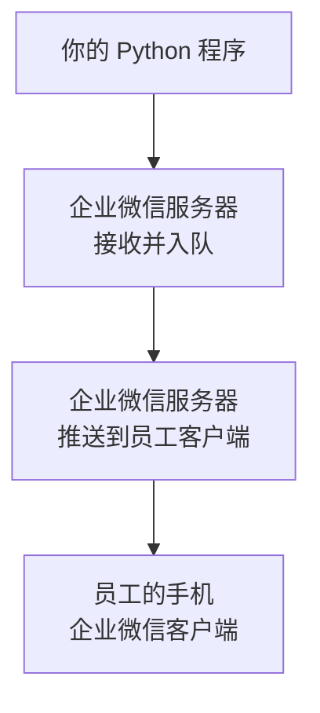

你只做了第一步：把消息交给企业微信服务器。剩下的投递由它负责。

这个模型有四个后果，现在记住第一条就行：

| 后果 | 说明 |
|---|---|
| **接口成功 ≠ 员工已收到** | 只代表企业微信收下了任务 |
| 员工离线也能发 | 消息存在服务器，上线后收到 |
| 不需要知道手机号或设备 | 只要 UserId |
| 无法得知是否已读 | 应用消息接口不返回已读状态 |

## 原理二：为什么要调两次接口

V1 里有两次网络请求，作用完全不同：

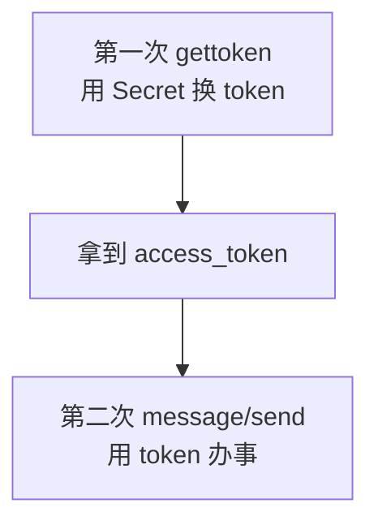

为什么不能一步到位、每次都直接传 Secret？

因为 Secret 是**长期凭证**，你不去后台重置它就一直有效。如果每次调接口都带着它，它会在你的日志、抓包、异常堆栈里反复出现，泄露概率随调用次数上升。

换成 token 后，Secret 一天可能只用一次，其余成千上万次调用带的都是**两小时后自动作废**的东西。

| | Secret | access_token |
|---|---|---|
| 有效期 | 长期 | 7200 秒 |
| 使用频率 | 极低 | 极高 |
| 泄露后果 | 严重且不自动解除 | 最多影响两小时 |

## 逐行解释

### 第 8 到 9 行：换 token

```python
token = requests.get("https://qyapi.weixin.qq.com/cgi-bin/gettoken",
                     params={"corpid": CORP_ID, "corpsecret": SECRET}).json()["access_token"]
```

- `requests.get(...)` 发一个 GET 请求
- `params={...}` 会被拼成 `?corpid=xxx&corpsecret=yyy`
- `.json()` 把返回的 JSON 文本转成 Python 字典
- `["access_token"]` 取出字典里的 token 字段

### 第 11 到 14 行：发消息

```python
requests.post("https://qyapi.weixin.qq.com/cgi-bin/message/send",
              params={"access_token": token},
              json={"touser": USER_ID, "msgtype": "text", "agentid": AGENT_ID,
                    "text": {"content": "第一条消息"}})
```

这里有三个关键点，值得单独讲。

### 关键点 1：token 放 URL，正文放 Body

注意 `params` 和 `json` 是两个不同的参数：

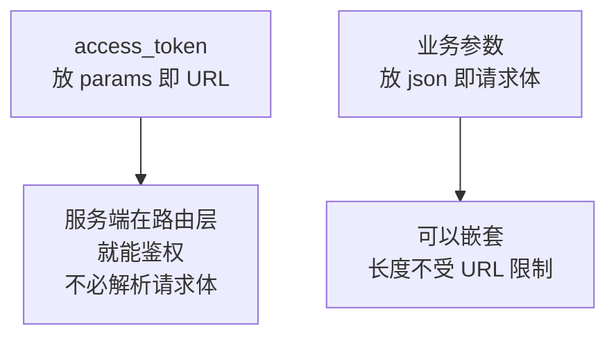

发出去的实际形态是：

```text
POST /cgi-bin/message/send?access_token=xxxxx

{"touser":"...","msgtype":"text","agentid":1000002,"text":{"content":"第一条消息"}}
```

**一个安全提醒**：token 在 URL 里，意味着它会出现在服务器访问日志中。所以排错时不要把完整 URL 贴到公开地方。V12 会处理日志脱敏。

### 关键点 2：`json=` 不能写成 `data=`

用 `json=` 时，`requests` 自动做两件事：

1. 把字典序列化成 JSON 字符串
2. 把请求头 `Content-Type` 设成 `application/json`

如果写成 `data=`，发出去的是表单格式，企业微信解析不了，会返回参数错误。

### 关键点 3：正文为什么要嵌套在 `text` 里

看这两行的对应关系：

```python
"msgtype": "text",        # 声明消息类型
"text": {"content": ...}  # 对象名必须和上面一致
```

规则是：**`msgtype` 的值决定服务端去读哪个同名对象。**

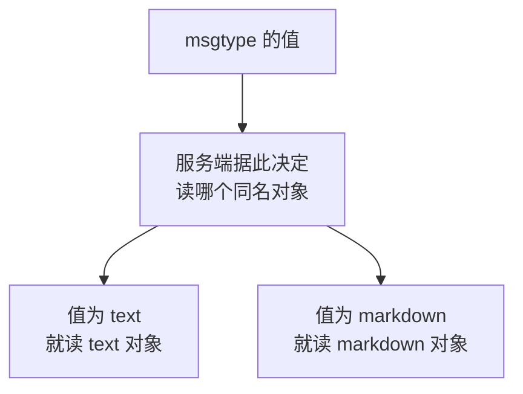

之所以这样设计，是因为不同消息类型需要的字段完全不同：文本要 `content`，图片要 `media_id`，图文卡片要标题和链接。

**如果 `msgtype` 写 `text` 但正文放进了 `markdown` 对象，服务端找不到 `text` 就报参数错误。**这是很常见的一类错误，V8 会实际演示。

### 关键点 4：`agentid` 的作用

员工收到消息时，看到的不是系统通知，而是**某个应用发来的消息**，会话上方显示的就是你在第 1 章填的应用名称。

所以一条消息要确定三件事：

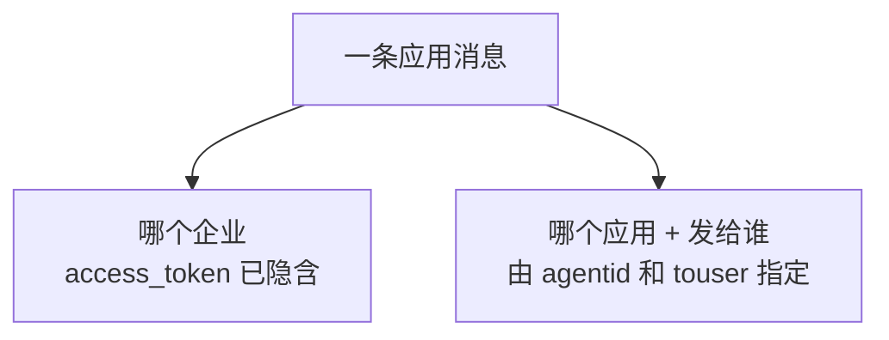

**`agentid` 必须和换 token 用的 Secret 属于同一个应用。**不一致会返回 60011。

## V1 的问题

它能跑，但有个致命缺陷：**失败了你看不出来。**

把 `USER_ID` 改成一个不存在的值，再运行一次——程序照样不报错，安静地结束，你以为发成功了。

---

# V2：知道成功还是失败

## 新增功能点 1：检查 errcode

## 原理：HTTP 200 不代表业务成功

企业微信的接口是 RPC 风格，也就是**把「远程调用一个函数」套在 HTTP 上传输**。于是有两个独立的结果层：

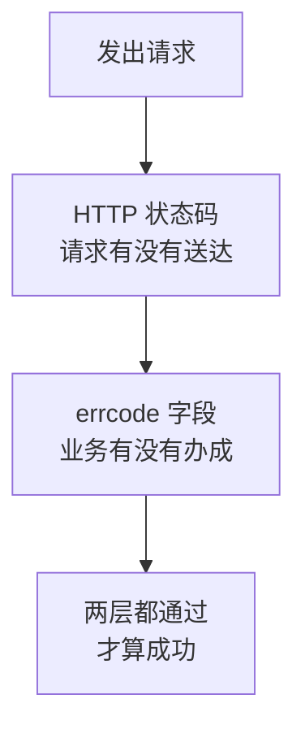

「Secret 错了」这件事，在传输层是**完全成功**的：请求送到了，服务器也正常回答了，只不过答案是「不行」。所以 HTTP 状态码是 200，而 `errcode` 是 40001。

这就是 V1 不报错的原因：`requests` 只关心传输层，它看到 200 就认为没问题。

## 代码

```python
import requests

CORP_ID = "你的企业ID"
SECRET = "你的应用Secret"
AGENT_ID = 1000002
USER_ID = "你的UserId"
BASE = "https://qyapi.weixin.qq.com/cgi-bin"

r = requests.get(f"{BASE}/gettoken",
                 params={"corpid": CORP_ID, "corpsecret": SECRET}).json()
if r["errcode"] != 0:                              # 新增
    raise RuntimeError(f"取 token 失败：{r}")        # 新增
token = r["access_token"]

r = requests.post(f"{BASE}/message/send", params={"access_token": token},
                  json={"touser": USER_ID, "msgtype": "text", "agentid": AGENT_ID,
                        "text": {"content": "V2 消息"}}).json()
if r["errcode"] != 0:                              # 新增
    raise RuntimeError(f"发送失败：{r}")             # 新增
print("发送成功")
```

## 新增行解释

```python
if r["errcode"] != 0:
    raise RuntimeError(f"发送失败：{r}")
```

`errcode` 为 0 才是成功，其他值都是失败。把整个返回 `r` 打进异常里，方便看到 `errmsg`。

**这两行以后每次调用都要有。**这是贯穿全教程的铁律。

## 验证

故意把 `SECRET` 改错一个字符，运行：

```text
RuntimeError: 取 token 失败：{'errcode': 40001, 'errmsg': 'invalid credential...'}
```

现在错误暴露出来了。改回正确值继续。

## V2 的问题

再做一个实验：把 `USER_ID` 改成一个不存在的用户，运行看看。

结果是：**打印「发送成功」，但手机什么也没收到。**

`errcode` 明明是 0，为什么没收到？

---

# V3：发现有人没收到

## 新增功能点 2：检查 invaliduser

## 原理：逐个过滤，部分成功

企业微信收到请求后，会**对每个收件人单独检查是否在应用可见范围内**：

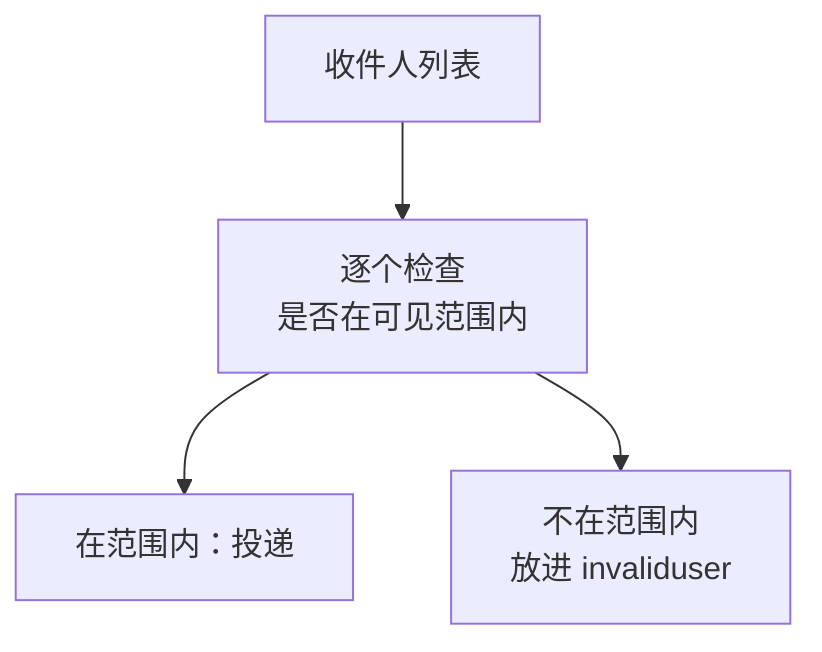

**只要有一个人通过，整体就算成功**，`errcode` 返回 0。没通过的人被列进 `invaliduser` 字段。

这就是 V2 现象的解释：请求本身没问题，只是这个收件人被过滤掉了。

三个相关字段：

| 字段 | 含义 |
|---|---|
| `invaliduser` | 无效或不在可见范围的成员 |
| `invalidparty` | 无效的部门 |
| `invalidtag` | 无效的标签 |

## 于是判断成功要三层

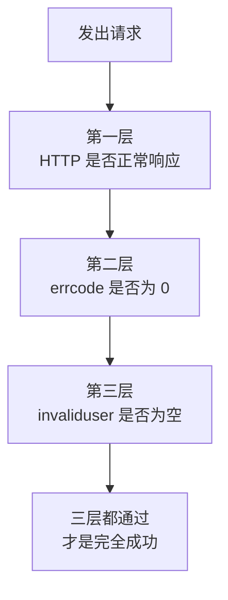

很多人写完程序说「返回成功但收不到」，原因就是漏了第三层。

## 代码

只改发送后的判断部分：

```python
r = requests.post(f"{BASE}/message/send", params={"access_token": token},
                  json={"touser": USER_ID, "msgtype": "text", "agentid": AGENT_ID,
                        "text": {"content": "V3 消息"}}).json()

if r["errcode"] != 0:
    raise RuntimeError(f"发送失败：{r}")

# 新增：第三层判断
invalid = r.get("invaliduser", "")
if invalid:
    print(f"警告：以下成员未收到：{invalid}")
    print("原因通常是该成员不在应用可见范围内，或 UserId 拼写错误")
else:
    print("发送成功，所有收件人均已投递")
```

## 新增行解释

```python
invalid = r.get("invaliduser", "")
```

用 `.get()` 而不是 `["invaliduser"]`。因为**全部成功时返回里可能没有这个字段**，直接用方括号会抛 `KeyError`。第二个参数 `""` 是取不到时的默认值。

## 验证

```python
USER_ID = "你的UserId|完全不存在的用户xyz"
```

期望输出：

```text
警告：以下成员未收到：完全不存在的用户xyz
```

同时你自己**仍然会收到消息**。这正好演示了「部分成功」：一个人成功、一个人失败，整体 `errcode` 仍是 0。

## V3 的问题

拔掉网线或断开网络再运行，程序会**一直挂着不动**，既不报错也不结束。

---

# V4：不再无限等待

## 新增功能点 3：超时保护

## 原理：超时不代表消息没发出去

这是本章最需要想清楚的一点。

请求超时只说明「你没等到回答」。真实情况可能是两种，而**你的程序无法区分**：

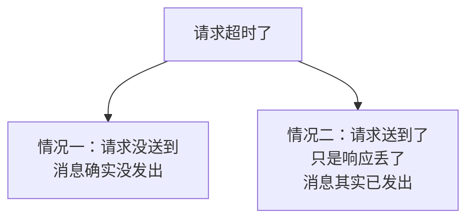

于是重试变成两难：

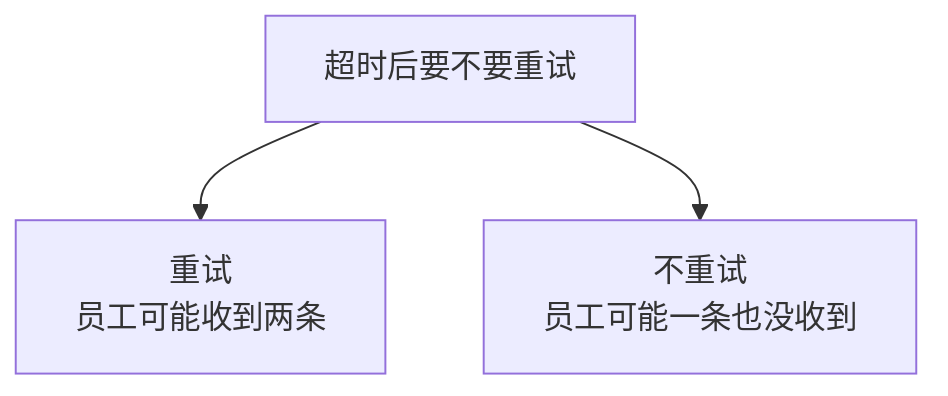

**企业微信默认不去重，你调两次就发两条。**

所以本章的策略是：**超时就明确报错，不自动重试**，并在错误信息里说清风险。真正的解决办法是数据库任务状态，第 4 章做。

## 代码

```python
import requests

# ... 配置部分不变 ...

def post_json(url, params, payload):
    """带超时和异常处理的 POST。"""
    try:
        r = requests.post(url, params=params, json=payload, timeout=10)
        r.raise_for_status()          # HTTP 状态码非 2xx 时抛异常
        return r.json()
    except requests.exceptions.Timeout:
        raise RuntimeError(
            "请求超时。注意：消息可能已经发出，直接重试会导致重复发送。")
    except requests.exceptions.RequestException as ex:
        raise RuntimeError(f"网络请求失败：{ex}")


r = post_json(f"{BASE}/message/send", {"access_token": token},
              {"touser": USER_ID, "msgtype": "text", "agentid": AGENT_ID,
               "text": {"content": "V4 消息"}})

if r["errcode"] != 0:
    raise RuntimeError(f"发送失败：{r}")

invalid = r.get("invaliduser", "")
print(f"未收到：{invalid}" if invalid else "全部发送成功")
```

## 新增行解释

### `timeout=10`

最多等 10 秒。不设这个参数，`requests` 默认会无限等待，这就是 V3 挂死的原因。

### `r.raise_for_status()`

HTTP 状态码是 4xx 或 5xx 时主动抛异常。这一行补上了「第一层」判断，之前只判断了第二层。

### 两个 except 的顺序

```python
except requests.exceptions.Timeout:      # 先捕获具体的
except requests.exceptions.RequestException as ex:   # 再捕获宽泛的
```

`Timeout` 是 `RequestException` 的子类。**必须把具体的写在前面**，否则超时会被后面那个宽泛的先接住，你就无法针对超时给出「可能已发出」的特别提示。

## 验证

把 `timeout=10` 临时改成 `timeout=0.001`，运行：

```text
RuntimeError: 请求超时。注意：消息可能已经发出，直接重试会导致重复发送。
```

## V4 的问题

Secret 还硬编码在代码里。这个文件一旦提交到 Git，凭证就泄露了。

---

# V5：凭证不写在代码里

## 新增功能点 4：配置分离

## 原理：为什么必须分离

Secret 是长期凭证，泄露后不会自动失效，只能人工去后台重置。而代码是要提交、分享、备份的。

更麻烦的是：**Secret 一旦提交过 Git，即使后来删掉，历史记录里依然存在。**唯一可靠的补救是去后台重置 Secret。

## 代码

### `config.py`

```python
# -*- coding: utf-8 -*-
"""企业微信配置。含机密信息，不要提交到代码仓库。"""

CORP_ID = "你的企业ID"          # 标识，不是凭证，可以公开
AGENT_ID = 1000002
APP_SECRET = "你的应用Secret"    # 凭证，必须保密
CONTACTS_SECRET = "你的通讯录Secret"
BASE_URL = "https://qyapi.weixin.qq.com/cgi-bin"
TEST_USER_ID = "你的UserId"
```

### `.gitignore`

```text
config.py
venv/
__pycache__/
*.pyc
```

### `config.example.py`

提交这个不含真实值的模板，让别人知道要配哪些项：

```python
CORP_ID = ""
AGENT_ID = 0
APP_SECRET = ""
CONTACTS_SECRET = ""
BASE_URL = "https://qyapi.weixin.qq.com/cgi-bin"
TEST_USER_ID = ""
```

### `v5.py`

```python
import requests
import config          # 新增：从配置文件读取


def post_json(url, params, payload):
    try:
        r = requests.post(url, params=params, json=payload, timeout=10)
        r.raise_for_status()
        return r.json()
    except requests.exceptions.Timeout:
        raise RuntimeError("请求超时。消息可能已发出，重试会重复发送。")
    except requests.exceptions.RequestException as ex:
        raise RuntimeError(f"网络请求失败：{ex}")


def get_token():
    r = requests.get(f"{config.BASE_URL}/gettoken",
                     params={"corpid": config.CORP_ID,
                             "corpsecret": config.APP_SECRET},
                     timeout=10).json()
    if r["errcode"] != 0:
        raise RuntimeError(f"取 token 失败：{r}")
    return r["access_token"]


token = get_token()
r = post_json(f"{config.BASE_URL}/message/send", {"access_token": token},
              {"touser": config.TEST_USER_ID, "msgtype": "text",
               "agentid": config.AGENT_ID, "text": {"content": "V5 消息"}})

if r["errcode"] != 0:
    raise RuntimeError(f"发送失败：{r}")
print("发送成功")
```

## 新增行解释

```python
import config
```

Python 的 `import` 会执行同目录下的 `config.py`，之后用 `config.CORP_ID` 访问里面的变量。

**注意区分标识和凭证**：`CORP_ID` 是标识（说明你是谁），泄露无害，第 9 章还要传给浏览器；`APP_SECRET` 是凭证（证明你是你），泄露等于交出权限。判断标准是：光有这个值，别人能不能冒充你调接口。

## V5 的问题

每次运行都重新取一次 token。而 token 有效期是 7200 秒，这是浪费，而且获取接口有频率限制。

---

# V6：不再每次都换票

## 新增功能点 5：token 缓存
## 新增功能点 6：提前过期

## 原理一：token 是「查表的钥匙」

access_token **不是**加密数据，你无法从里面解出企业信息。它的真实工作方式是：企业微信服务端存了一张映射表。

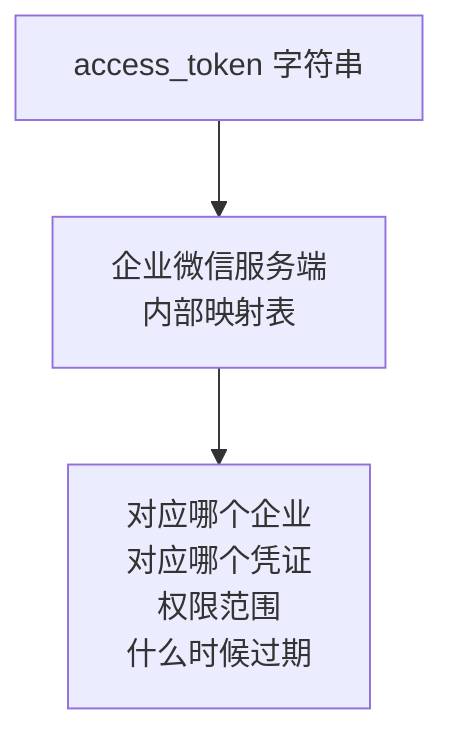

由此可以推出：**在有效期内重复调用 `gettoken`，服务端会先查表，发现已有未过期记录，就把原来那个 token 返回给你**，而不是新签发一个。

企业微信的规则正是如此：有效期内重复获取返回相同结果，过期后才返回新的（参见[腾讯云开发者社区：企业微信 AccessToken 管理](https://cloud.tencent.com/developer/article/1994156)。内容已改写以符合授权要求）。

### 这一点为什么重要

如果你做过微信公众号（订阅号）开发，规则是**相反**的：重复获取会让上次的失效。两种模型后果差别很大：

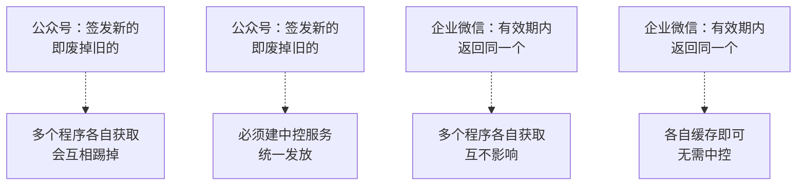

这正是本教程能让 Python 和 C# 完全分开、互不调用的技术前提。

## 原理二：为什么要提前 5 分钟过期

不要按 7200 秒算到期。从「你判断 token 还有效」到「请求真正抵达企业微信」之间有三段时间差：

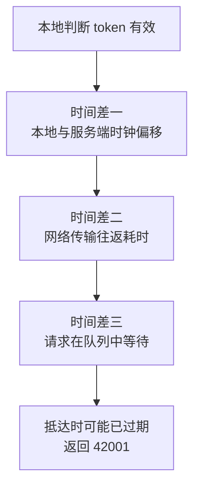

提前 5 分钟是经验值：远小于 7200 秒（不浪费），又足够覆盖时钟偏移和网络抖动。

## 原理三：为什么按 Secret 作键

第 1 章讲过，不同 Secret 换出的 token 不同、权限不同。如果用同一个变量存，通讯录 token 会覆盖应用 token，导致该用通讯录权限的调用拿到了应用 token，然后报权限错误。

## 代码

```python
import time
import requests
import config

_token_cache = {}     # 新增：键是 Secret，值是 token 和过期时间


def get_token(secret=None):
    """取 access_token，优先使用缓存。"""
    secret = secret or config.APP_SECRET

    cached = _token_cache.get(secret)
    if cached and cached["expire_at"] > time.time():
        return cached["token"]                    # 命中缓存，直接返回

    r = requests.get(f"{config.BASE_URL}/gettoken",
                     params={"corpid": config.CORP_ID, "corpsecret": secret},
                     timeout=10).json()
    if r["errcode"] != 0:
        raise RuntimeError(f"取 token 失败：{r}")

    _token_cache[secret] = {
        "token": r["access_token"],
        "expire_at": time.time() + r["expires_in"] - 300,   # 提前 5 分钟
    }
    return r["access_token"]
```

## 新增行解释

### 缓存的数据结构

```python
_token_cache = {}
```

设计成字典，键是 Secret：

```text
_token_cache["应用Secret"]   → {token: "abc...", expire_at: 1735689600}
_token_cache["通讯录Secret"] → {token: "xyz...", expire_at: 1735689600}
```

变量名前的下划线是 Python 约定，表示「模块内部使用，外部不要直接访问」。

### 缓存判断

```python
if cached and cached["expire_at"] > time.time():
```

两个条件都要满足：缓存里有、并且还没过期。`time.time()` 返回当前时间戳（秒）。

### 提前过期

```python
"expire_at": time.time() + r["expires_in"] - 300,
```

`expires_in` 是企业微信告知的有效秒数（通常 7200），减 300 就是提前 5 分钟。

### 参数默认值的写法

```python
def get_token(secret=None):
    secret = secret or config.APP_SECRET
```

不传参数时用应用 Secret；第 6 章要读通讯录时可以传通讯录 Secret 进来。

这里不直接写 `def get_token(secret=config.APP_SECRET)`，因为 Python 的默认参数在函数定义时就固定了，后续改配置不会生效。

## 验证

```python
t1 = get_token()
t2 = get_token()
print(f"两次是否相同：{t1 == t2}")     # 应为 True
```

输出 `True` 说明第二次走了缓存。

## V6 的问题

只能发给一个人。

---

# V7：发给多人和部门

## 新增功能点 7：多收件人
## 新增功能点 8：按部门发送

## 原理：三种收件人参数是并集

| 参数 | 含义 | 值的形式 |
|---|---|---|
| `touser` | 指定成员 | UserId，多个用竖线分隔 |
| `toparty` | 指定部门 | 部门 ID，多个用竖线分隔 |
| `totag` | 指定标签 | 标签 ID，多个用竖线分隔 |

三个同时用时是**并集**：

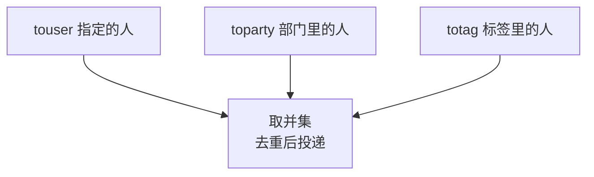

一个人既在 `touser` 里、又在指定部门里，**只会收到一条**，不会重复。

`touser` 最多支持约 1000 个成员（参见[Python 发送企业微信消息](https://cloud.tencent.com/developer/article/1564040)。内容已改写以符合授权要求）。超过要分批，第 4 章处理。

## 代码

```python
def send_text(to_user="", to_party="", to_tag="", content=""):
    """发送文本消息。三种收件人可任意组合，结果取并集。"""
    token = get_token()

    payload = {
        "msgtype": "text",
        "agentid": config.AGENT_ID,
        "text": {"content": content},
    }
    # 只把非空的收件人字段放进请求，避免传空字符串
    if to_user:
        payload["touser"] = to_user
    if to_party:
        payload["toparty"] = to_party
    if to_tag:
        payload["totag"] = to_tag

    if not (to_user or to_party or to_tag):
        raise ValueError("必须指定至少一种收件人")

    r = post_json(f"{config.BASE_URL}/message/send",
                  {"access_token": token}, payload)

    if r["errcode"] != 0:
        raise RuntimeError(f"发送失败：{r}")

    # 三个无效字段都要检查
    problems = []
    for field, label in [("invaliduser", "成员"),
                         ("invalidparty", "部门"),
                         ("invalidtag", "标签")]:
        if r.get(field):
            problems.append(f"无效{label}：{r[field]}")

    return problems
```

## 新增行解释

### 为什么用竖线分隔

```python
send_text(to_user="zhangsan|lisi|wangwu", content="多人测试")
```

**是竖线，不是逗号。**写成逗号会被当成一个完整的 UserId，然后整个进 `invaliduser`。

### 为什么要条件判断再放进 payload

```python
if to_user:
    payload["touser"] = to_user
```

不用的字段干脆不传，比传空字符串更稳妥。

### 关于 `@all`

```python
send_text(to_user="@all", content="全员通知")
```

`@all` 表示发给应用可见范围内所有人。

**这是危险操作。**开发阶段可见范围只有你自己，`@all` 就是发给自己，很安全。上线后可见范围是真实部门，`@all` 会打扰所有人。第 4 章会加确认机制。

## 验证

```python
problems = send_text(to_user=f"{config.TEST_USER_ID}|不存在xyz",
                     content="V7 测试")
print(problems)     # ['无效成员：不存在xyz']
```

## V7 的问题

只能发纯文本，没有格式。

---

# V8：发 Markdown 消息

## 新增功能点 9：切换消息类型

## 原理：现在能真正体会 msgtype 的作用

V1 讲过规则：`msgtype` 决定服务端读哪个同名对象。现在实际换一次就明白了。

文本消息：

```python
{"msgtype": "text",     "text":     {"content": "..."}}
```

Markdown 消息：

```python
{"msgtype": "markdown", "markdown": {"content": "..."}}
```

**两处必须同时改。**只改一处必然报错：

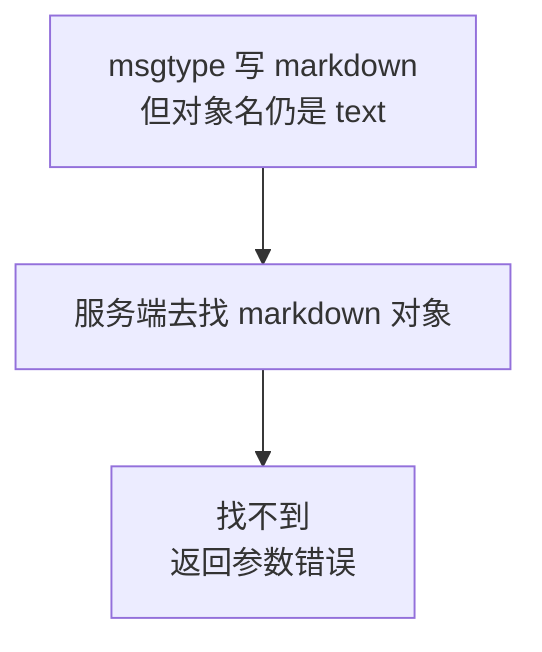

## 代码

把发送逻辑抽出来，两种类型共用：

```python
def send_message(msgtype, body, to_user="", to_party="", to_tag=""):
    """通用发送。msgtype 和 body 的对象名由本函数保证一致。"""
    if not (to_user or to_party or to_tag):
        raise ValueError("必须指定至少一种收件人")

    token = get_token()
    payload = {
        "msgtype": msgtype,
        "agentid": config.AGENT_ID,
        msgtype: body,          # 关键：用 msgtype 的值作为对象名
    }
    if to_user:
        payload["touser"] = to_user
    if to_party:
        payload["toparty"] = to_party
    if to_tag:
        payload["totag"] = to_tag

    r = post_json(f"{config.BASE_URL}/message/send",
                  {"access_token": token}, payload)
    if r["errcode"] != 0:
        raise RuntimeError(f"发送失败：{r}")

    problems = []
    for field, label in [("invaliduser", "成员"),
                         ("invalidparty", "部门"),
                         ("invalidtag", "标签")]:
        if r.get(field):
            problems.append(f"无效{label}：{r[field]}")
    return problems


def send_text(content, **kwargs):
    return send_message("text", {"content": content}, **kwargs)


def send_markdown(content, **kwargs):
    return send_message("markdown", {"content": content}, **kwargs)
```

## 新增行解释

### 最关键的一行

```python
msgtype: body,
```

字典的键这里用的是**变量** `msgtype`，不是字符串 `"msgtype"`。所以传 `"markdown"` 时，这一行等价于 `"markdown": body`。

这样从代码结构上就保证了两者永远一致，杜绝了不匹配的错误。

### `**kwargs` 的作用

```python
def send_text(content, **kwargs):
    return send_message("text", {"content": content}, **kwargs)
```

`**kwargs` 把多余的关键字参数打包传给下一层。调用 `send_text("内容", to_user="zhang")` 时，`to_user` 会经由 `kwargs` 传到 `send_message`。

## Markdown 支持的语法

```python
md = """**加粗标题**
> 这是引用

<font color="warning">橙色警告文字</font>
<font color="comment">灰色说明文字</font>

普通文字，[点这里](https://example.com)"""

send_markdown(md, to_user=config.TEST_USER_ID)
```

企业微信的 Markdown 是**受限子集**，不支持全部标准语法。常用的有加粗、引用、字体颜色、链接。

## 验证

试试故意写错，体会一下报错：

```python
# 错误示范：msgtype 和对象名不一致
payload = {"msgtype": "markdown", "text": {"content": "test"}, ...}
```

会返回参数错误。这就是 V1 强调过的坑。

## V8 的问题

消息只能看，不能点击跳转到系统页面。

---

# V9：发图文卡片

## 新增功能点 10：图文卡片

## 原理：为什么需要卡片消息

纯文本和 Markdown 都无法**整条点击跳转**。而实际业务中最常见的需求是：「你有一条待审批，点击处理」。

图文卡片（`textcard`）整条可点，跳转到你指定的网址。它需要的字段和文本完全不同：

| 字段 | 作用 | 是否必填 |
|---|---|---|
| `title` | 标题 | 是 |
| `description` | 描述，支持简单换行 | 是 |
| `url` | 点击后跳转的地址 | 是 |
| `btntxt` | 按钮文字，默认「详情」 | 否 |

这正好印证了 V1 讲的设计原因：**不同消息类型需要的字段完全不同，所以要嵌套在各自的对象里。**

## 代码

因为 V8 已经把 `send_message` 做成通用的，这里只需加一个薄封装：

```python
def send_textcard(title, description, url, btntxt="详情", **kwargs):
    """发送图文卡片消息，整条可点击跳转。"""
    return send_message("textcard", {
        "title": title,
        "description": description,
        "url": url,
        "btntxt": btntxt,
    }, **kwargs)
```

## 使用

```python
send_textcard(
    title="待办提醒",
    description="你有 1 条报销单待审批\n提交人：张三\n金额：1200 元",
    url="https://your-domain.com/Approval.aspx?id=123",
    btntxt="去处理",
    to_user=config.TEST_USER_ID,
)
```

## 三个注意点

### 1. `url` 现在可以随便填

点击后会在企业微信内置浏览器里打开。现阶段填任意网址都行，用来验证跳转。

等到第 7 章配好应用主页和可信域名后，这里就可以填你自己的 WebForms 页面，实现「点消息直接进业务页面」。

### 2. `description` 的换行

用 `\n` 换行。它支持的格式比 Markdown 少，主要就是换行和字体颜色。

### 3. 卡片消息没有 `content` 字段

如果你套用文本消息的写法传 `content`，服务端会因为缺少必填的 `title` 而报错。

## V9 的问题

试试发一条很长的中文消息，比如两千个汉字，会失败或显示异常。

---

# V10：长文本不乱码

## 新增功能点 11：按字节安全截断

## 原理一：限制是字节，不是字符

文本消息 `content` 上限约 2048 **字节**（参见[企业微信消息长度限制](https://www.cnblogs.com/xbotter/category/2244793.html)。内容已改写以符合授权要求）。

字节和字符不是一回事：

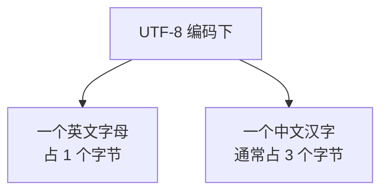

| 内容 | 字符数 | 字节数 |
|---|---|---|
| `Hello` | 5 | 5 |
| `你好` | 2 | 6 |
| 2048 个字母 | 2048 | 2048 |
| 2048 个汉字 | 2048 | **约 6144，超限** |

**纯中文大约 680 字就到上限。**

## 原理二：为什么不能直接切字节

一个汉字占 3 个字节。如果直接对字节序列切片，很可能切在某个汉字的中间，切出半个字符：

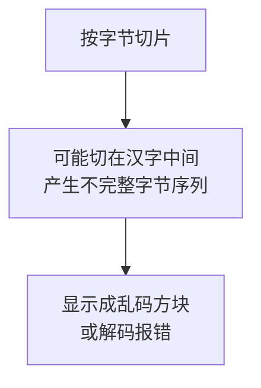

正确做法是**逐个字符累加字节数**，超限前停下。这样切口一定落在字符边界上。

## 代码

```python
def truncate_by_bytes(text, max_bytes=2000):
    """按字节上限截断，但保证不切断字符。

    企业微信文本上限约 2048 字节，这里留余量给后缀。
    关键：逐字符累加，而不是对字节序列切片。
    """
    if len(text.encode("utf-8")) <= max_bytes:
        return text                      # 没超限，原样返回

    kept = []
    used = 0
    for ch in text:
        size = len(ch.encode("utf-8"))   # 这个字符占几个字节
        if used + size > max_bytes:
            break                        # 再加就超了，停下
        kept.append(ch)
        used += size

    return "".join(kept) + "...(已截断)"
```

然后在文本和 Markdown 里调用它：

```python
def send_text(content, **kwargs):
    return send_message("text", {"content": truncate_by_bytes(content)}, **kwargs)


def send_markdown(content, **kwargs):
    return send_message("markdown", {"content": truncate_by_bytes(content)}, **kwargs)
```

## 新增行解释

### 计算字节数

```python
len(text.encode("utf-8"))
```

`encode("utf-8")` 把字符串转成字节序列，`len()` 得到字节数。

直接写 `len(text)` 得到的是**字符数**，这正是很多人算错的地方。

### 逐字符累加

```python
for ch in text:
    size = len(ch.encode("utf-8"))
    if used + size > max_bytes:
        break
```

每次只加一个完整字符。判断「加上它会不会超」，会超就停——所以永远不会切出半个字符。

### 为什么留 48 字节余量

默认值是 2000 而不是 2048，因为末尾要拼 `...(已截断)` 这个后缀，它本身也占字节。

## 验证

```python
send_text("测试" * 2000, to_user=config.TEST_USER_ID)
```

期望：手机收到的消息末尾是「...(已截断)」，**且没有乱码方块**。

如果看到方块或问号，说明截断逻辑按字节切了。

## V10 的问题

两个实际业务问题还没解决：敏感内容能被随意转发；程序意外重跑会重复发送。

---

# V11：保密消息与重复检查

## 新增功能点 12：保密消息
## 新增功能点 13：重复消息检查

## 原理一：保密消息

`safe` 参数控制消息能否被转发：

| 值 | 效果 |
|---|---|
| 0 | 普通消息，可以转发、复制 |
| 1 | 保密消息，不能转发，会有水印 |

适合发工资、合同、客户资料这类内容。

## 原理二：接口自带的去重开关

V4 讲过：超时后重试可能重复发送，企业微信默认不去重。

官方提供了两个可选参数（参见[企业微信消息推送参数示例](https://gist.github.com/luoboQAQ/1215d5cdbc3380fcad17a04f1959178d)。内容已改写以符合授权要求）：

| 参数 | 作用 |
|---|---|
| `enable_duplicate_check` | 是否开启重复消息检查，0 或 1 |
| `duplicate_check_interval` | 去重时间区间，单位秒 |

开启后，在指定区间内**内容相同**的消息会被视为重复，不重复投递。

## 但它不能替代你自己的幂等设计

关键在于它按**内容**判重：

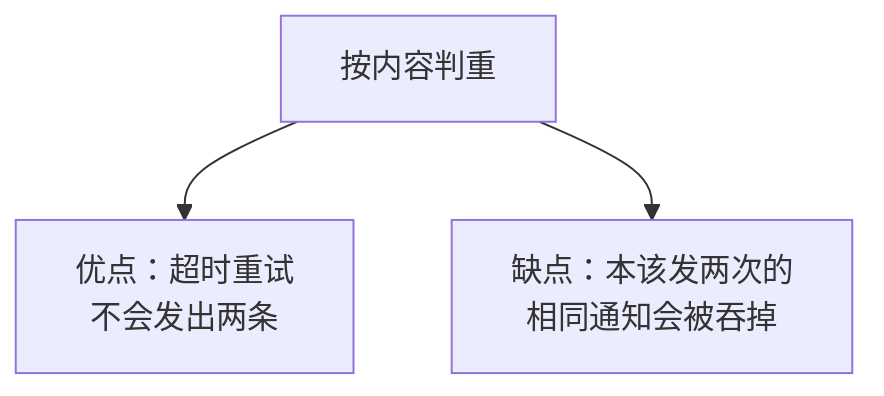

举个真实场景：早上和下午都要发「请提交本月报表」，内容一字不差。如果去重区间设成一天，下午那次就发不出去了。

所以两者分工是：

| 手段 | 解决什么 | 用在哪 |
|---|---|---|
| 接口去重开关 | 短时间内的意外重复调用 | 本章、简单场景 |
| 数据库任务状态 | 业务层面的幂等 | 第 4 章、生产环境 |

## 代码

```python
def send_message(msgtype, body, to_user="", to_party="", to_tag="",
                 safe=0, dup_check=False, dup_interval=600):
    """通用发送。

    safe          1 表示保密消息，不可转发
    dup_check     是否开启接口层重复检查
    dup_interval  去重区间秒数，默认 600 即 10 分钟
    """
    if not (to_user or to_party or to_tag):
        raise ValueError("必须指定至少一种收件人")

    token = get_token()
    payload = {
        "msgtype": msgtype,
        "agentid": config.AGENT_ID,
        msgtype: body,
        "safe": safe,
    }
    if dup_check:
        payload["enable_duplicate_check"] = 1
        payload["duplicate_check_interval"] = dup_interval

    if to_user:
        payload["touser"] = to_user
    if to_party:
        payload["toparty"] = to_party
    if to_tag:
        payload["totag"] = to_tag

    r = post_json(f"{config.BASE_URL}/message/send",
                  {"access_token": token}, payload)
    if r["errcode"] != 0:
        raise RuntimeError(f"发送失败：{r}")

    problems = []
    for field, label in [("invaliduser", "成员"),
                         ("invalidparty", "部门"),
                         ("invalidtag", "标签")]:
        if r.get(field):
            problems.append(f"无效{label}：{r[field]}")
    return problems
```

## 验证

### 保密消息

```python
send_text("这是保密内容", to_user=config.TEST_USER_ID, safe=1)
```

在手机上试试长按这条消息，转发选项应该不可用。

### 去重

连续运行两次同样的调用：

```python
send_text("去重测试", to_user=config.TEST_USER_ID,
          dup_check=True, dup_interval=600)
```

期望：只收到一条。关掉 `dup_check` 再试，会收到两条。

## V11 的问题

出错时抛出的是原始错误码，比如 `{'errcode': 60011}`，看不出该怎么办。而且如果开始写日志，token 会被记进去。

---

# V12：错误码翻译与日志脱敏

## 新增功能点 14：错误码翻译
## 新增功能点 15：日志脱敏

## 原理一：把错误码变成可操作的提示

`errcode 60011` 对新手没有意义。有意义的是「检查 AGENT_ID 和 APP_SECRET 是否属于同一个应用」。

按第 1 章的三层模型给错误码归类，就能给出准确建议：

| 错误码 | 属于哪层 | 该查什么 |
|---|---|---|
| 40001、40013 | 换 token 阶段 | 配置抄错了 |
| 60020 | 换 token 阶段 | IP 白名单 |
| 40014、42001 | 第一层：凭证 | token 来源和缓存 |
| 60011 | 第二层：能力域 | Secret 与 AgentId 是否配套 |
| 81013、`invaliduser` | 第三层：数据范围 | UserId 和可见范围 |

## 原理二：token 为什么必须脱敏

V1 讲过 token 在 URL 里。一旦你开始写日志，它就会进日志文件。

而 token 在两小时内是**完全可用的凭证**：拿到它的人可以直接给你的员工发消息，不需要知道 Secret。

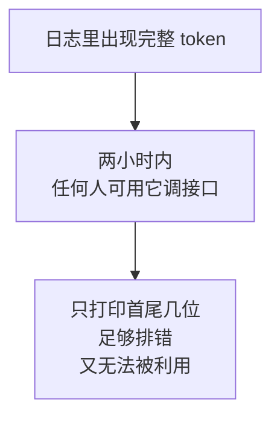

## 代码

```python
def describe_error(result):
    """把企业微信返回翻译成可操作的中文提示。"""
    code = result.get("errcode")
    msg = result.get("errmsg", "")

    hints = {
        40001: "Secret 不正确，或拿错了另一个 Secret",
        40013: "企业 ID 不正确",
        40014: "access_token 不合法，可能用了别的应用或通讯录的 token",
        41001: "缺少 access_token 参数，检查参数名拼写",
        42001: "access_token 已过期，检查缓存的提前过期逻辑",
        44004: "消息内容为空",
        60011: "无操作权限，检查 AGENT_ID 与 APP_SECRET 是否属于同一应用",
        60020: "IP 不在白名单。错误信息里 from ip 后面的就是要加的 IP",
        81013: "UserId 不存在，注意填的应该是账号而不是姓名",
    }

    text = f"errcode={code}, errmsg={msg}"
    if code in hints:
        text += f"\n  提示：{hints[code]}"
    text += f"\n  查询：https://open.work.weixin.qq.com/devtool/query?e={code}"
    return text


def mask_token(token):
    """遮掉 token 中间部分，只留首尾用于排错。"""
    if not token or len(token) < 16:
        return "***"
    return f"{token[:8]}...{token[-6:]}"
```

然后把抛异常的地方都换成它：

```python
if r["errcode"] != 0:
    raise RuntimeError(f"发送失败：{describe_error(r)}")
```

## 新增行解释

### 用字典代替一长串 if

```python
hints = {40001: "...", 40013: "...", ...}
if code in hints:
    text += f"\n  提示：{hints[code]}"
```

比写十个 `elif` 清楚，加新错误码只需加一行。

### 总是附上官方查询链接

```python
text += f"\n  查询：https://open.work.weixin.qq.com/devtool/query?e={code}"
```

企业微信有在线错误码查询页，把码填进末尾即可。遇到字典里没有的错误码，这个链接就是兜底。

### 脱敏的长度判断

```python
if not token or len(token) < 16:
    return "***"
```

太短就整个遮掉。否则 `token[:8]` 和 `token[-6:]` 可能重叠，反而暴露大部分内容。

## 验证

故意把 `AGENT_ID` 改成一个不属于你的应用的值：

```text
RuntimeError: 发送失败：errcode=60011, errmsg=no privilege...
  提示：无操作权限，检查 AGENT_ID 与 APP_SECRET 是否属于同一应用
  查询：https://open.work.weixin.qq.com/devtool/query?e=60011
```

## V12 的问题

代码散在十几个文件里，无法复用。而且出了问题只能看屏幕输出，没有留档。

---

# V13：集成版

## 新增功能点 16：日志记录到文件

## 目标

把前 12 版整合成一个可复用模块 `wecom.py`，并加上日志。

## 原理：为什么要写日志文件

屏幕输出关掉窗口就没了。而发消息这件事经常需要事后追查：「昨天下午那条通知到底发出去了没有？」

日志要记三样东西：**什么时候、发给谁、结果如何**。不能记的是完整 token 和消息全文（可能含敏感信息）。

## 完整代码

```python
# -*- coding: utf-8 -*-
"""企业微信消息发送模块。

用法：
    import wecom
    wecom.send_text("内容", to_user="zhangsan")
    wecom.send_markdown("**标题**", to_user="zhangsan")
    wecom.send_textcard("标题", "描述", "https://...", to_user="zhangsan")

设计要点：
    1. 每次调用都做三层判断：HTTP、errcode、invaliduser
    2. token 按 Secret 缓存并提前 5 分钟过期
    3. 超时不自动重试，因为消息可能已经发出
    4. 日志中 token 脱敏，不记录消息全文
"""

import time
import logging
import requests
import config

# ===== 日志配置 =====
logging.basicConfig(
    level=logging.INFO,
    format="%(asctime)s [%(levelname)s] %(message)s",
    handlers=[
        logging.FileHandler("wecom.log", encoding="utf-8"),   # 写文件
        logging.StreamHandler(),                              # 同时输出到屏幕
    ],
)
logger = logging.getLogger(__name__)

# ===== token 缓存：键是 Secret =====
_token_cache = {}


# ---------- 工具函数 ----------

def mask_token(token):
    """遮掉 token 中间部分，只留首尾用于排错。"""
    if not token or len(token) < 16:
        return "***"
    return f"{token[:8]}...{token[-6:]}"


def describe_error(result):
    """把企业微信返回翻译成可操作的中文提示。"""
    code = result.get("errcode")
    msg = result.get("errmsg", "")

    hints = {
        40001: "Secret 不正确，或拿错了另一个 Secret",
        40013: "企业 ID 不正确",
        40014: "access_token 不合法，可能用了别的应用或通讯录的 token",
        41001: "缺少 access_token 参数，检查参数名拼写",
        42001: "access_token 已过期，检查缓存的提前过期逻辑",
        44004: "消息内容为空",
        60011: "无操作权限，检查 AGENT_ID 与 APP_SECRET 是否属于同一应用",
        60020: "IP 不在白名单。错误信息里 from ip 后面的就是要加的 IP",
        81013: "UserId 不存在，注意填的应该是账号而不是姓名",
    }

    text = f"errcode={code}, errmsg={msg}"
    if code in hints:
        text += f"\n  提示：{hints[code]}"
    text += f"\n  查询：https://open.work.weixin.qq.com/devtool/query?e={code}"
    return text


def truncate_by_bytes(text, max_bytes=2000):
    """按字节上限截断，逐字符累加以避免切断中文。"""
    if len(text.encode("utf-8")) <= max_bytes:
        return text

    kept, used = [], 0
    for ch in text:
        size = len(ch.encode("utf-8"))
        if used + size > max_bytes:
            break
        kept.append(ch)
        used += size
    return "".join(kept) + "...(已截断)"


# ---------- 网络层 ----------

def _post_json(url, params, payload):
    """带超时和异常分类的 POST。"""
    try:
        r = requests.post(url, params=params, json=payload, timeout=10)
        r.raise_for_status()
        return r.json()
    except requests.exceptions.Timeout:
        # 超时不代表没发出去，所以这里绝不自动重试
        logger.error("请求超时，消息可能已发出")
        raise RuntimeError(
            "请求超时。消息可能已经发出，直接重试会导致重复发送。"
            "生产环境请用第 4 章的数据库任务状态保证幂等。")
    except requests.exceptions.RequestException as ex:
        logger.error(f"网络请求失败：{ex}")
        raise RuntimeError(f"网络请求失败：{ex}")


# ---------- 凭证 ----------

def get_token(secret=None):
    """取 access_token，优先使用缓存。

    按 Secret 分别缓存：不同 Secret 换出的 token 不同、权限也不同。
    """
    secret = secret or config.APP_SECRET

    cached = _token_cache.get(secret)
    if cached and cached["expire_at"] > time.time():
        return cached["token"]

    try:
        r = requests.get(f"{config.BASE_URL}/gettoken",
                         params={"corpid": config.CORP_ID,
                                 "corpsecret": secret},
                         timeout=10)
        r.raise_for_status()
        result = r.json()
    except requests.exceptions.RequestException as ex:
        raise RuntimeError(f"取 token 网络失败：{ex}")

    if result.get("errcode") != 0:
        raise RuntimeError(f"取 token 失败：{describe_error(result)}")

    token = result["access_token"]
    # 提前 5 分钟过期，避开时钟偏移和网络延迟造成的临界失效
    _token_cache[secret] = {
        "token": token,
        "expire_at": time.time() + result["expires_in"] - 300,
    }
    logger.info(f"取得新 token：{mask_token(token)}")   # 脱敏后才记日志
    return token


# ---------- 发送 ----------

def send_message(msgtype, body, to_user="", to_party="", to_tag="",
                 safe=0, dup_check=False, dup_interval=600):
    """通用消息发送。

    返回未成功投递的对象列表，空列表表示全部成功。
    """
    if not (to_user or to_party or to_tag):
        raise ValueError("必须指定至少一种收件人")

    token = get_token()

    payload = {
        "msgtype": msgtype,
        "agentid": config.AGENT_ID,
        msgtype: body,       # 用 msgtype 的值作对象名，保证两者永远一致
        "safe": safe,
    }
    if dup_check:
        payload["enable_duplicate_check"] = 1
        payload["duplicate_check_interval"] = dup_interval
    if to_user:
        payload["touser"] = to_user
    if to_party:
        payload["toparty"] = to_party
    if to_tag:
        payload["totag"] = to_tag

    result = _post_json(f"{config.BASE_URL}/message/send",
                        {"access_token": token}, payload)

    # 第二层判断
    if result.get("errcode") != 0:
        logger.error(f"发送失败 type={msgtype} to={to_user or to_party}")
        raise RuntimeError(f"发送失败：{describe_error(result)}")

    # 第三层判断：部分成功
    problems = []
    for field, label in [("invaliduser", "成员"),
                         ("invalidparty", "部门"),
                         ("invalidtag", "标签")]:
        if result.get(field):
            problems.append(f"无效{label}：{result[field]}")

    # 日志只记收件人和结果，不记消息全文
    if problems:
        logger.warning(f"部分失败 type={msgtype} to={to_user or to_party} "
                       f"问题={problems}")
    else:
        logger.info(f"发送成功 type={msgtype} to={to_user or to_party}")

    return problems


def send_text(content, **kwargs):
    """文本消息。自动按字节截断。"""
    return send_message("text", {"content": truncate_by_bytes(content)}, **kwargs)


def send_markdown(content, **kwargs):
    """Markdown 消息。支持加粗、引用、字体颜色、链接。"""
    return send_message("markdown", {"content": truncate_by_bytes(content)}, **kwargs)


def send_textcard(title, description, url, btntxt="详情", **kwargs):
    """图文卡片，整条可点击跳转。"""
    return send_message("textcard", {
        "title": title,
        "description": description,
        "url": url,
        "btntxt": btntxt,
    }, **kwargs)
```

## 使用示例

新建 `demo.py`：

```python
# -*- coding: utf-8 -*-
"""wecom 模块使用示例。"""

import config
import wecom

me = config.TEST_USER_ID

# 1 文本
wecom.send_text("集成版测试消息", to_user=me)

# 2 Markdown
wecom.send_markdown(
    "**服务器告警**\n> 磁盘使用率 92%\n\n"
    "<font color=\"warning\">请及时处理</font>", to_user=me)

# 3 图文卡片
wecom.send_textcard(
    title="待办提醒",
    description="你有 1 条报销单待审批\n提交人：张三\n金额：1200 元",
    url="https://work.weixin.qq.com",
    btntxt="去处理",
    to_user=me)

# 4 保密消息
wecom.send_text("本月工资明细已生成", to_user=me, safe=1)

# 5 开启接口层去重
wecom.send_text("去重测试", to_user=me, dup_check=True, dup_interval=600)

# 6 部分成功的处理
problems = wecom.send_text("多人测试", to_user=f"{me}|不存在xyz")
if problems:
    print(f"注意：{problems}")

# 7 验证 token 缓存
print("token 缓存是否生效：", wecom.get_token() == wecom.get_token())
```

运行后查看生成的 `wecom.log`：

```text
2026-08-28 10:15:02 [INFO] 取得新 token：abcdefgh...xyz123
2026-08-28 10:15:03 [INFO] 发送成功 type=text to=zhangsan
2026-08-28 10:15:04 [INFO] 发送成功 type=markdown to=zhangsan
2026-08-28 10:15:05 [WARNING] 部分失败 type=text to=zhangsan|不存在xyz 问题=['无效成员：不存在xyz']
```

注意日志里 token 是脱敏的，也没有消息正文。

---

# 本章自测

按顺序验证，每一项对应一个功能点：

| 测试 | 做法 | 期望结果 |
|---|---|---|
| 1 基本发送 | 运行 V1 | 手机收到消息 |
| 2 错误暴露 | 改错 Secret | 抛出 40001，不再静默 |
| 3 部分成功 | 收件人加一个不存在的 | 提示无效成员，自己仍收到 |
| 4 超时保护 | `timeout` 改成 0.001 | 抛出「可能已发出」警告 |
| 5 配置分离 | 检查 `.gitignore` | 含 `config.py` |
| 6 token 缓存 | 连续取两次 | 输出 `True` |
| 7 多人发送 | 竖线分隔两个 UserId | 两人都收到 |
| 8 Markdown | 发带加粗和颜色的内容 | 格式正常显示 |
| 9 图文卡片 | 发 textcard | 整条可点击跳转 |
| 10 长文本 | 发 2000 个「测试」 | 末尾显示已截断，**无乱码** |
| 11 保密消息 | `safe=1` | 长按无法转发 |
| 12 去重 | 连续发两次相同内容 | 只收到一条 |
| 13 错误翻译 | 改错 `AGENT_ID` | 输出中文提示和查询链接 |
| 14 日志 | 查看 `wecom.log` | token 脱敏，无消息正文 |

第 10 项要特别注意：**出现乱码方块就说明截断按字节切了**，要检查 `truncate_by_bytes`。

# 错误排查

| 现象 | 原因 | 解决 |
|---|---|---|
| 提示成功但收不到 | 没检查 `invaliduser` | 用 V3 及以后的版本 |
| `invaliduser` 里有自己 | 自己不在可见范围 | 后台把自己加进可见范围 |
| `errcode 60011` | AgentId 与 Secret 不同应用 | 核对来自同一应用 |
| `errcode 81013` | UserId 不存在 | 填的是姓名而非账号 |
| `errcode 40014` | token 不合法 | 检查是否误用通讯录 Secret |
| `errcode 44004` | 内容为空 | `content` 是空字符串 |
| 参数错误 | `msgtype` 与对象名不一致 | 用 V8 的写法自动保证一致 |
| 中文乱码 | 源文件编码不是 UTF-8 | 另存为 UTF-8 |
| 程序卡住不返回 | 没设 `timeout` | 加上 `timeout=10` |
| 收到两条相同消息 | 超时后重试了 | 开 `dup_check`，或用第 4 章方案 |

# 完成标准

## 理解部分

能回答这六个问题：

- [ ] 接口返回成功，是否意味着员工已经收到
- [ ] 为什么要先换 token，而不是每次直接传 Secret
- [ ] `errcode` 为 0 但员工没收到，该查哪个字段
- [ ] `msgtype` 和嵌套对象名是什么关系，不一致会怎样
- [ ] 请求超时后能不能直接重试，为什么
- [ ] 为什么日志里不能出现完整的 token

## 操作部分

- [ ] V1 到 V13 每一版都实际运行过
- [ ] 14 项自测全部通过
- [ ] `wecom.py` 可以被其他脚本 `import` 使用
- [ ] `config.py` 已加入 `.gitignore`
- [ ] `wecom.log` 中 token 已脱敏

# 本章遗留的问题

`wecom.py` 已经可用，但还有三件事做不到：

| 做不到什么 | 为什么 | 在哪解决 |
|---|---|---|
| 真正的幂等 | 需要持久化状态 | 第 4 章 |
| 超过 1000 人分批 | 单人测试用不到 | 第 4 章 |
| 发图片和文件 | 需要先上传素材换 `media_id` | 第 5 章 |

# 下一章

第 3 章设计 SQL Server 数据表。第 4 章的群发程序需要任务表来保证不重复发送，第 6 章的员工查询需要缓存表。
