# 第 3 章：SQL Server 数据设计

## 本章目标

从一张两列的表开始，逐步演进到完整的数据结构。

**本章不解释 SQL 语法**，重点讲三件事：

1. 每个字段是为了解决什么问题而加的
2. 企业微信特有的约束如何影响表结构
3. 幂等和并发这两件事，为什么必须落到数据库层

## 前置条件

- 已完成第 2 章，`wecom.py` 可以发消息
- SQL Server 能连上

## 本章要解决的核心矛盾

第 2 章结尾留下一个未解决的问题：

> 请求超时时，你无法知道消息是否已经发出。重试可能发两条，不重试可能一条都没发。

这个问题**在程序内部无解**，因为程序可能在任意时刻崩溃。唯一的出路是把「这条消息处理到哪一步了」记录到进程之外的地方，也就是数据库。

本章就是在解决这件事。

## 版本地图

| 版本 | 主题 | 解决上一版什么问题 |
|---|---|---|
| V1 | 最简任务表 | —— |
| V2 | 加状态字段 | 重跑会重复发送 |
| V3 | 加时间戳与卡死回收 | 崩溃后任务永久卡住 |
| V4 | 加错误信息与重试计数 | 失败了不知道原因，无限重试 |
| V5 | 收件人拆成独立表 | 无法记录每个人的投递结果 |
| V6 | 业务幂等键与唯一索引 | 业务系统重复提交同一任务 |
| V7 | 多进程安全领取 | 两个进程抢同一条任务 |
| V8 | 通讯录缓存表 | 每次查员工都要调接口 |
| V9 | 回调事件表 | 企业微信重复推送导致重复处理 |
| V10 | 签到表与 API 日志表 | 定位数据无处存，问题无法追溯 |
| V11 | 集成版完整脚本 | 表结构零散 |

---

# V0：建库

```sql
CREATE DATABASE WeComTutorial;
GO

USE WeComTutorial;
GO
```

后面所有脚本都在这个库里执行。

---

# V1：最简任务表

## 目标

让「要发什么消息」从代码里搬到数据库里。

## 脚本

```sql
CREATE TABLE MessageTask (
    Id       INT IDENTITY(1,1) PRIMARY KEY,
    ToUser   NVARCHAR(200) NOT NULL,
    Content  NVARCHAR(1000) NOT NULL
);
```

插两条测试数据：

```sql
INSERT INTO MessageTask (ToUser, Content) VALUES
    (N'你的UserId', N'来自数据库的第一条消息'),
    (N'你的UserId', N'第二条消息');
```

## 配套的 Python 代码

先装驱动：

```bash
pip install pyodbc
```

```python
# -*- coding: utf-8 -*-
"""V1：从数据库读任务并发送。"""

import pyodbc
import wecom          # 第 2 章的模块

CONN_STR = (
    "DRIVER={ODBC Driver 17 for SQL Server};"
    "SERVER=localhost;DATABASE=WeComTutorial;"
    "Trusted_Connection=yes;"
)

conn = pyodbc.connect(CONN_STR)
cursor = conn.cursor()

cursor.execute("SELECT Id, ToUser, Content FROM MessageTask")
for row in cursor.fetchall():
    wecom.send_text(row.Content, to_user=row.ToUser)
    print(f"已发送任务 {row.Id}")

conn.close()
```

## 两个字段长度的依据

### `ToUser` 为什么是 200

企业微信的 `touser` 支持用竖线分隔多个成员。但这里**不建议存很长的列表**，原因在 V5 会讲。200 是个临时值。

### `Content` 为什么是 1000

第 2 章算过：文本消息上限约 2048 **字节**，纯中文大约 680 字。`NVARCHAR(1000)` 按字符计，1000 个中文字符已经超过字节上限了，所以 1000 是宽松够用的。

用 `NVARCHAR` 而不是 `VARCHAR`，因为消息内容一定有中文。

## V1 的问题

运行两次，你会收到**四条**消息。

因为表里没有任何地方记录「这条任务已经发过了」，程序每次都把全部数据当成待发送。

这正是第 2 章那个矛盾的具体形态。

---

# V2：加状态字段

## 目标

让任务能表达「处理到哪一步了」。

## 原理：幂等的本质

幂等的意思是「同一个操作执行多次，结果和执行一次相同」。

要做到这一点，前提是**能够判断某个操作是否已经执行过**。这个判断依据必须存在进程之外，因为进程随时可能死掉。

于是引入状态字段：

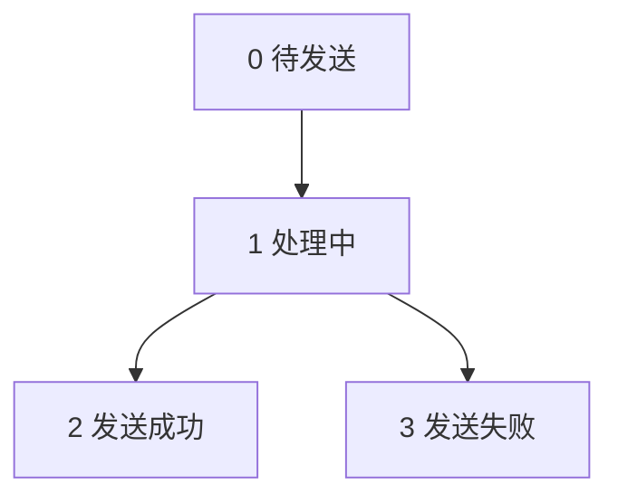

## 为什么必须有「处理中」这个中间态

这是最容易被省略、也最关键的一个状态。

如果只有「待发送」和「已完成」两个状态，流程会是：

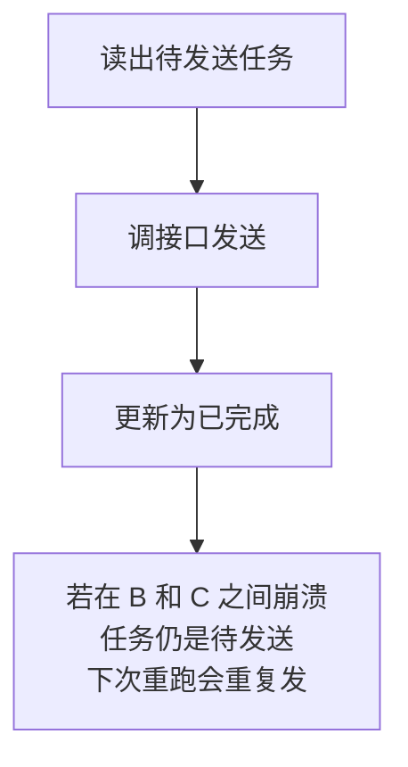

加上「处理中」后，顺序变成**先标记再发送**：

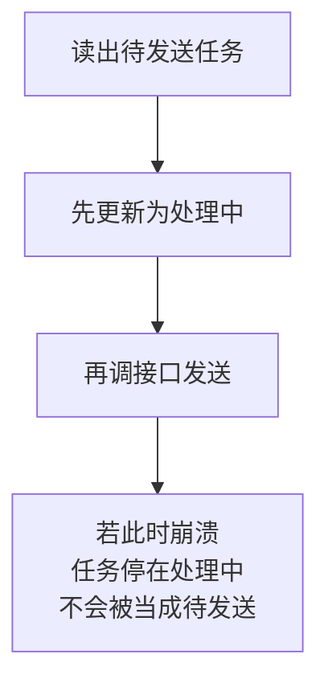

代价是：崩溃的任务会永久停在「处理中」。V3 解决这个问题。

**这是一个有意的取舍：宁可让消息漏发（可人工补），也不要重复发（无法撤回）。**

## 脚本

```sql
ALTER TABLE MessageTask ADD
    Status TINYINT NOT NULL DEFAULT 0;   -- 0待发送 1处理中 2成功 3失败
```

## 配套代码

```python
cursor.execute("SELECT Id, ToUser, Content FROM MessageTask WHERE Status = 0")
tasks = cursor.fetchall()          # 先取完，避免边遍历边更新

for task in tasks:
    # 关键顺序：先标记处理中，再发送
    cursor.execute("UPDATE MessageTask SET Status = 1 WHERE Id = ?", task.Id)
    conn.commit()                  # 必须立即提交，否则崩溃时这个标记会丢

    try:
        problems = wecom.send_text(task.Content, to_user=task.ToUser)
        new_status = 2 if not problems else 3
    except Exception as ex:
        print(f"任务 {task.Id} 发送失败：{ex}")
        new_status = 3

    cursor.execute("UPDATE MessageTask SET Status = ? WHERE Id = ?",
                   new_status, task.Id)
    conn.commit()
```

## 代码里的两个要点

### `fetchall()` 先取完

```python
tasks = cursor.fetchall()
```

不要边遍历游标边执行更新，同一个 cursor 上会冲突。

### `commit()` 的位置

标记为「处理中」后**必须立即提交**。如果放在事务里等最后一起提交，程序崩溃时这个标记会随事务回滚消失，「先标记」就白做了。

## 验证

```sql
-- 重置状态
UPDATE MessageTask SET Status = 0;
```

连续运行两次程序。第二次应该**一条也不发**，因为所有任务的 `Status` 都已经是 2 了。

## V2 的问题

在发送过程中按 `Ctrl+C` 强行中断，那条任务会永远停在 `Status = 1`，再也不会被处理。

而且现在完全看不出任务是什么时候创建、什么时候发出的。

---

# V3：加时间戳与卡死回收

## 目标

能识别并回收卡死的任务。

## 原理：如何区分「正在处理」和「已经卡死」

两者在数据库里看起来完全一样，都是 `Status = 1`。唯一的区别是**在这个状态停留了多久**。

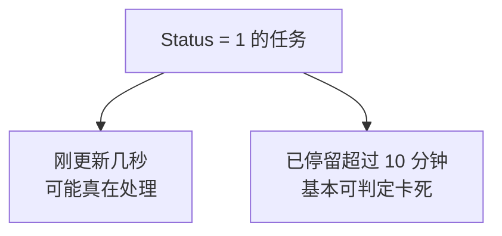

所以需要记录「什么时候进入处理中状态」，也就是 `UpdatedAt`。

## 脚本

```sql
ALTER TABLE MessageTask ADD
    CreatedAt DATETIME2(0) NOT NULL DEFAULT SYSDATETIME(),
    UpdatedAt DATETIME2(0) NULL,
    SentAt    DATETIME2(0) NULL;
```

## 三个时间字段的分工

| 字段 | 记录什么 | 谁写入 |
|---|---|---|
| `CreatedAt` | 任务被创建的时间 | 默认值自动写 |
| `UpdatedAt` | 状态最后一次变化的时间 | 每次改状态都写 |
| `SentAt` | 实际调接口成功的时间 | 只在成功时写 |

### 为什么 `SentAt` 要和 `UpdatedAt` 分开

因为它们回答不同的问题。`UpdatedAt` 用于判断卡死，`SentAt` 用于业务查询「这条通知是几点发出去的」。

如果只用一个字段，任务失败重试后，「发送时间」就被覆盖成了最后一次尝试的时间，业务上会误解。

## 为什么用 `DATETIME2(0)` 而不是 `DATETIME`

`DATETIME2` 是更新的类型，取值范围更大，且可以指定精度。这里的 `(0)` 表示精确到秒。

消息发送的时间精度到秒完全够用，不需要毫秒。存储上也更省。

配套用 `SYSDATETIME()` 取当前时间，它返回 `DATETIME2`，和字段类型匹配。

## 回收卡死任务的脚本

```sql
-- 把卡在处理中超过 10 分钟的任务退回待发送
UPDATE MessageTask
SET Status = 0,
    UpdatedAt = SYSDATETIME()
WHERE Status = 1
  AND UpdatedAt < DATEADD(MINUTE, -10, SYSDATETIME());
```

## 一个必须承认的风险

这个回收动作**有可能导致重复发送**。

设想：程序调接口时超时了，但消息其实已经发出去，然后程序崩溃。10 分钟后回收机制把任务退回待发送，下一轮又发了一次。员工收到两条。

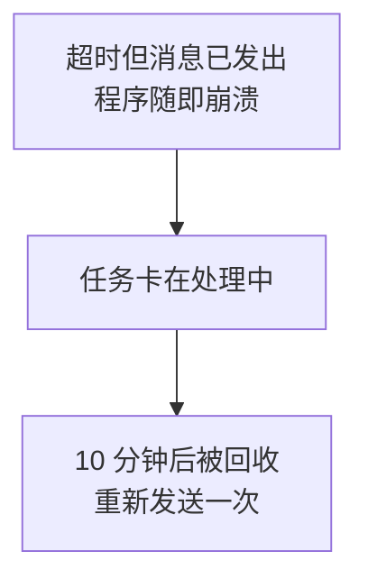

这是**无法完全避免**的，因为第 2 章讲过：超时后你根本无法知道消息发没发出去。

能做的是控制概率和影响：

| 措施 | 作用 |
|---|---|
| 回收阈值设长一些（10 分钟以上） | 减少误判正在处理的任务 |
| 配合接口层去重（第 2 章 V11） | 短时间内相同内容不重复投递 |
| 重要通知不自动回收，改人工确认 | 把决定权交给人 |

## 配套代码

```python
# 每轮开始前先回收卡死任务
cursor.execute("""
    UPDATE MessageTask
    SET Status = 0, UpdatedAt = SYSDATETIME()
    WHERE Status = 1
      AND UpdatedAt < DATEADD(MINUTE, -10, SYSDATETIME())
""")
recovered = cursor.rowcount
conn.commit()
if recovered:
    print(f"回收了 {recovered} 条卡死任务")
```

## V3 的问题

任务失败了，但不知道为什么失败。而且失败后会被无限重试。

---

# V4：加错误信息与重试计数

## 目标

记录失败原因，并限制重试次数。

## 原理：区分可重试和不可重试的错误

不是所有失败都值得重试：

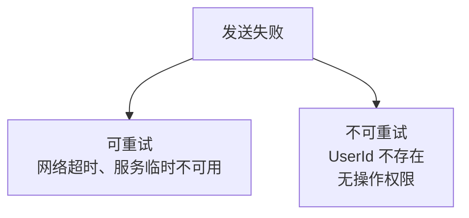

对不可重试的错误，重试一百次也是一百次失败，只是浪费配额。

用第 1 章的三层模型判断：

| 错误类型 | 典型错误码 | 重试有意义吗 |
|---|---|---|
| 网络层异常 | 超时、连接失败 | 有 |
| 凭证问题 | 42001 token 过期 | 有，换新 token |
| 配置问题 | 40001、60011、60020 | **无**，改配置才行 |
| 数据问题 | 81013 UserId 不存在 | **无**，改数据才行 |

## 脚本

```sql
ALTER TABLE MessageTask ADD
    RetryCount TINYINT NOT NULL DEFAULT 0,
    MaxRetry   TINYINT NOT NULL DEFAULT 3,
    ErrCode    INT NULL,
    ErrMsg     NVARCHAR(500) NULL;
```

## 字段设计说明

### 为什么 `MaxRetry` 存在表里而不是写在代码里

因为不同任务的重要程度不同。普通通知失败 3 次就算了，工资单这类关键通知可以设成 10 次。放在表里可以按任务配置。

### 为什么 `ErrCode` 用 `INT` 而不是字符串

企业微信的错误码都是整数，存整数便于统计：

```sql
-- 快速看出主要失败原因
SELECT ErrCode, COUNT(*) AS 次数
FROM MessageTask
WHERE Status = 3
GROUP BY ErrCode
ORDER BY 次数 DESC;
```

### `ErrMsg` 为什么给 500

企业微信的 `errmsg` 常常很长，60020 那种还会带上 IP 和文档链接。500 字符足够，又不至于浪费。

## 配套代码

```python
# 不可重试的错误码：改配置或改数据才能解决，重试无意义
NO_RETRY_CODES = {40001, 40013, 60011, 60020, 81013, 44004}


def mark_failed(cursor, conn, task, errcode, errmsg):
    """记录失败。可重试的退回待发送，否则置为最终失败。"""
    retry = task.RetryCount + 1

    can_retry = (errcode not in NO_RETRY_CODES) and (retry < task.MaxRetry)
    new_status = 0 if can_retry else 3      # 0 会被下一轮重新捞出来

    cursor.execute("""
        UPDATE MessageTask
        SET Status = ?, RetryCount = ?, ErrCode = ?, ErrMsg = ?,
            UpdatedAt = SYSDATETIME()
        WHERE Id = ?
    """, new_status, retry, errcode, errmsg[:500], task.Id)
    conn.commit()

    print(f"任务 {task.Id} 失败（第 {retry} 次）"
          f"{'，将重试' if can_retry else '，不再重试'}")
```

注意 `errmsg[:500]`：先截断再入库，否则超长会直接报错。

## 查询语句要相应调整

```sql
-- 待发送：状态为 0 且还没到重试上限
SELECT Id, ToUser, Content, RetryCount, MaxRetry
FROM MessageTask
WHERE Status = 0
  AND RetryCount < MaxRetry
ORDER BY CreatedAt;
```

## V4 的问题

现在一条任务只能记录一个整体结果。但第 2 章讲过，企业微信会返回 `invaliduser`——**同一条任务里有人成功、有人失败**。

现在这种情况只能笼统记成「失败」，无法知道具体是谁没收到。

---

# V5：收件人拆成独立表

## 目标

能记录每一个收件人的投递结果。

## 原理：三个必须拆表的理由

### 理由一：部分成功需要落到具体人

第 2 章的 V3 讲过部分成功机制。如果收件人挤在一个字段里，就只能记「这批人里有人失败」，无法回答「到底谁没收到」。

而业务上一定会问后者。

### 理由二：企业微信的 1000 人上限

`touser` 最多约 1000 个成员。超过就必须分批调用。

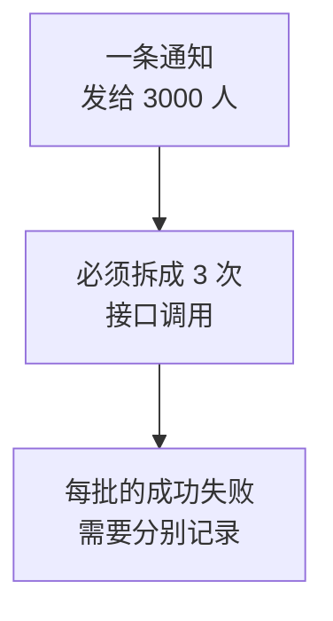

如果收件人存在一个字段里，分批和记录都很难处理。

### 理由三：重试要精确到人

假设 1000 人里有 5 个失败。重试时应该只重发这 5 个，而不是把 1000 人再发一遍。

拆表后，重试的目标就是「这条任务下状态为失败的收件人」。

## 脚本

```sql
CREATE TABLE MessageRecipient (
    Id       BIGINT IDENTITY(1,1) PRIMARY KEY,
    TaskId   INT NOT NULL,
    UserId   NVARCHAR(64) NOT NULL,
    Status   TINYINT NOT NULL DEFAULT 0,   -- 0待发送 1处理中 2成功 3失败
    ErrCode  INT NULL,
    ErrMsg   NVARCHAR(500) NULL,
    SentAt   DATETIME2(0) NULL,

    CONSTRAINT FK_Recipient_Task FOREIGN KEY (TaskId)
        REFERENCES MessageTask(Id),
    CONSTRAINT UQ_Recipient_Task_User UNIQUE (TaskId, UserId)
);

CREATE INDEX IX_Recipient_Task_Status ON MessageRecipient (TaskId, Status);
```

同时任务表里的 `ToUser` 就不需要了：

```sql
ALTER TABLE MessageTask DROP COLUMN ToUser;
```

## 四个设计点

### `Id` 为什么用 `BIGINT`

收件人表的行数是任务表的很多倍。一条通知发给 3000 人就是 3000 行。`INT` 上限约 21 亿，长期运行有风险，`BIGINT` 一劳永逸。

任务表本身用 `INT` 够了。

### `UserId` 为什么是 `NVARCHAR(64)`

企业微信的 UserId 通常是字母数字，但也可能包含其他字符。64 是宽松的安全值。

用 `NVARCHAR` 而非 `VARCHAR`，是为了避免特殊字符带来的意外。

### `UQ_Recipient_Task_User` 这个唯一约束很重要

它保证**同一条任务里同一个人只出现一次**。

作用是防止业务系统在构造收件人时不小心重复插入，导致同一个人收到两条相同消息。这属于「用数据库约束兜住应用层疏漏」，V6 会详细讲这个思路。

### 索引为什么是 `(TaskId, Status)`

因为最频繁的查询是「取这条任务下待发送的收件人」：

```sql
SELECT UserId FROM MessageRecipient
WHERE TaskId = ? AND Status = 0;
```

复合索引的列顺序要和查询条件一致，`TaskId` 选择性更高所以放前面。

## 配套代码：批量发送与结果回写

```python
BATCH_SIZE = 900     # 企业微信上限约 1000，留余量


def send_task(cursor, conn, task):
    """发送一条任务，按批处理收件人并逐人回写结果。"""
    cursor.execute("""
        SELECT UserId FROM MessageRecipient
        WHERE TaskId = ? AND Status = 0
    """, task.Id)
    users = [r.UserId for r in cursor.fetchall()]

    if not users:
        print(f"任务 {task.Id} 没有待发送收件人")
        return

    # 按 900 人一批切分
    for i in range(0, len(users), BATCH_SIZE):
        batch = users[i:i + BATCH_SIZE]

        # 先把这批标记为处理中
        placeholders = ",".join("?" * len(batch))
        cursor.execute(f"""
            UPDATE MessageRecipient SET Status = 1
            WHERE TaskId = ? AND UserId IN ({placeholders})
        """, task.Id, *batch)
        conn.commit()

        try:
            problems = wecom.send_text(task.Content, to_user="|".join(batch))
        except Exception as ex:
            _mark_batch(cursor, conn, task.Id, batch, 3, str(ex))
            continue

        # 从 problems 里解析出失败的成员
        failed = _parse_invalid_users(problems)
        succeeded = [u for u in batch if u not in failed]

        _mark_batch(cursor, conn, task.Id, succeeded, 2, None)
        _mark_batch(cursor, conn, task.Id, failed, 3, "不在可见范围或UserId无效")


def _parse_invalid_users(problems):
    """从 send_text 返回的问题描述里提取无效成员列表。"""
    failed = set()
    for p in problems:
        if p.startswith("无效成员："):
            failed.update(u for u in p.split("：", 1)[1].split("|") if u)
    return failed


def _mark_batch(cursor, conn, task_id, users, status, errmsg):
    """批量回写一组收件人的状态。"""
    if not users:
        return
    placeholders = ",".join("?" * len(users))
    cursor.execute(f"""
        UPDATE MessageRecipient
        SET Status = ?, ErrMsg = ?,
            SentAt = CASE WHEN ? = 2 THEN SYSDATETIME() ELSE SentAt END
        WHERE TaskId = ? AND UserId IN ({placeholders})
    """, status, errmsg, status, task_id, *users)
    conn.commit()
```

## 任务整体状态怎么算

拆表后，任务的状态由它的收件人推导：

```sql
UPDATE t
SET Status = CASE
        WHEN NOT EXISTS (SELECT 1 FROM MessageRecipient r
                         WHERE r.TaskId = t.Id AND r.Status IN (0, 1))
             THEN CASE WHEN EXISTS (SELECT 1 FROM MessageRecipient r
                                    WHERE r.TaskId = t.Id AND r.Status = 3)
                       THEN 4      -- 部分或全部失败
                       ELSE 2      -- 全部成功
                  END
        ELSE 1                     -- 还有人没处理完
    END,
    UpdatedAt = SYSDATETIME()
FROM MessageTask t
WHERE t.Id = ?;
```

这里新增了状态 4「部分失败」，因为拆表后这种情况才能被准确表达。

## V5 的问题

业务系统如果因为网络重试，把同一批通知提交了两次，数据库里就会出现两条内容一样的任务，员工收到两条消息。

现有的约束管不了这个：`UQ_Recipient_Task_User` 只保证同一任务内不重复，两条不同的任务它不管。

---

# V6：业务幂等键与唯一索引

## 目标

从数据库层面阻止业务重复提交。

## 原理：为什么应用层判断不够

直觉做法是插入前先查一下：

```python
# 有竞态的写法
cursor.execute("SELECT COUNT(*) FROM MessageTask WHERE ...")
if cursor.fetchone()[0] == 0:
    cursor.execute("INSERT INTO MessageTask ...")
```

问题是两个进程可能同时走到这里：

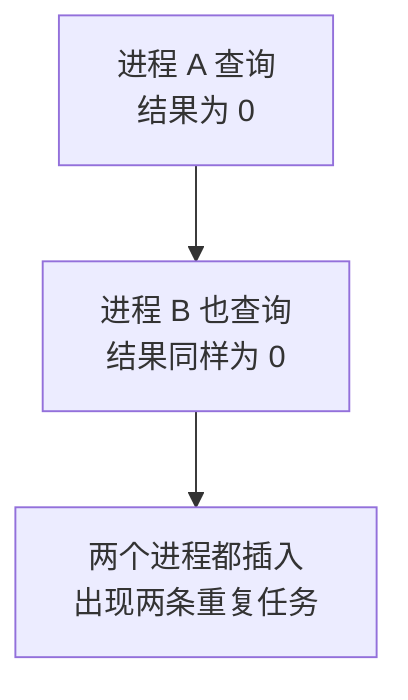

「先查再插」这两步之间存在时间窗口，并发下必然出问题。

**唯一索引是唯一可靠的方案**，因为它的判断和插入是数据库内部的原子操作，不存在窗口。

## 什么是业务幂等键

它是一个由业务含义构成的字符串，代表「这件事」的唯一身份。比如：

| 业务场景 | 幂等键设计 |
|---|---|
| 每天的报表提醒 | `daily_report_20260828` |
| 某张审批单的通知 | `approval_notify_12345` |
| 某次告警 | `alert_disk_srv01_20260828_1015` |

关键是：**同一件事算出来的键必须相同，不同的事必须不同。**

## 脚本

```sql
ALTER TABLE MessageTask ADD
    BizKey NVARCHAR(100) NULL;

-- 筛选索引：只对非空值做唯一约束
CREATE UNIQUE INDEX UQ_Task_BizKey
    ON MessageTask (BizKey)
    WHERE BizKey IS NOT NULL;
```

## 为什么用筛选索引

因为不是所有任务都需要幂等。手工发的临时通知没有业务键，`BizKey` 是 `NULL`。

SQL Server 的普通唯一索引会把多个 `NULL` 当成重复而拒绝插入。加上 `WHERE BizKey IS NOT NULL` 后，`NULL` 行完全不进索引，可以有任意多条。

## 配套代码：让重复插入变成无害操作

```python
def create_task(cursor, conn, content, user_ids, biz_key=None):
    """创建任务。若 biz_key 重复则跳过，返回 None。"""
    try:
        cursor.execute("""
            INSERT INTO MessageTask (Content, BizKey)
            VALUES (?, ?);
            SELECT SCOPE_IDENTITY();
        """, content, biz_key)
        task_id = int(cursor.fetchone()[0])
    except pyodbc.IntegrityError as ex:
        # 违反唯一约束说明这件事已经提交过了
        if "UQ_Task_BizKey" in str(ex):
            print(f"任务已存在，跳过：{biz_key}")
            conn.rollback()
            return None
        raise

    # 插入收件人，去重后再插
    for uid in set(user_ids):
        cursor.execute("""
            INSERT INTO MessageRecipient (TaskId, UserId) VALUES (?, ?)
        """, task_id, uid)

    conn.commit()
    return task_id
```

## 这段代码的思路

不去事先检查，而是**直接插入，让数据库拒绝，然后捕获这个拒绝**。

这个思路叫「乐观插入」。它比先查再插更可靠，因为判断由数据库原子完成。

注意要精确判断是哪个约束被违反了（检查约束名），否则会把其他完整性错误也当成重复提交。

## 验证

```python
# 连续调用两次，第二次应被跳过
create_task(cursor, conn, "日报提醒", ["zhangsan"], biz_key="daily_20260828")
create_task(cursor, conn, "日报提醒", ["zhangsan"], biz_key="daily_20260828")
```

期望输出：

```text
任务已存在，跳过：daily_20260828
```

## V6 的问题

如果你同时开两个发送程序（比如定时任务重叠执行），它们会同时把同一条待发送任务捞出来，各自发一遍。

---

# V7：多进程安全领取任务

## 目标

保证一条任务只被一个进程处理。

## 原理：读和写之间的窗口

V2 的写法是分两步：

```python
cursor.execute("SELECT ... WHERE Status = 0")     # 第一步：读
cursor.execute("UPDATE ... SET Status = 1 ...")   # 第二步：写
```

两步之间有窗口，两个进程都能读到同一条：

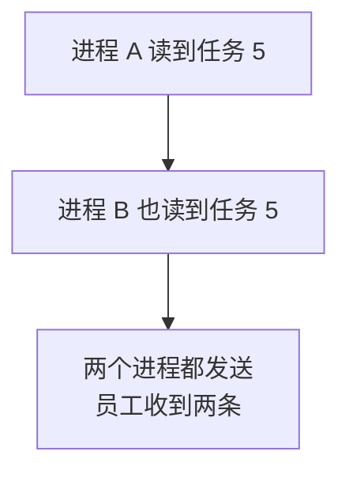

## 解决办法：把读和标记合并成一条语句

SQL Server 的 `UPDATE` 配合 `OUTPUT` 可以在一个原子操作里完成「标记 + 返回被标记的行」：

```sql
UPDATE TOP (10) MessageTask
SET Status = 1,
    UpdatedAt = SYSDATETIME()
OUTPUT inserted.Id, inserted.Content, inserted.RetryCount, inserted.MaxRetry
WHERE Status = 0
  AND RetryCount < MaxRetry;
```

因为是同一条语句，数据库保证不会有两个进程改到同一行。**被 A 抢到的行，B 根本看不到 `Status = 0`。**

## `OUTPUT inserted` 是什么

在 `UPDATE` 语境下，`inserted` 表示**更新后**的行值，`deleted` 表示更新前的值。

这里用 `inserted` 拿到的是已经被标记为处理中的那些行，正好就是本进程领到的任务。

## 配套代码

```python
def claim_tasks(cursor, conn, limit=10):
    """原子地领取一批任务。返回领到的任务列表。"""
    cursor.execute(f"""
        UPDATE TOP ({limit}) MessageTask
        SET Status = 1, UpdatedAt = SYSDATETIME()
        OUTPUT inserted.Id, inserted.Content,
               inserted.RetryCount, inserted.MaxRetry
        WHERE Status = 0 AND RetryCount < MaxRetry
    """)
    tasks = cursor.fetchall()
    conn.commit()
    return tasks
```

## 一个可选的优化

高并发下多个进程可能互相阻塞在锁上。可以加提示让它们跳过已被锁住的行：

```sql
UPDATE TOP (10) MessageTask WITH (ROWLOCK, READPAST)
SET Status = 1, UpdatedAt = SYSDATETIME()
OUTPUT inserted.Id, inserted.Content
WHERE Status = 0 AND RetryCount < MaxRetry;
```

| 提示 | 作用 |
|---|---|
| `ROWLOCK` | 尽量用行级锁，减小锁粒度 |
| `READPAST` | 跳过被别的事务锁住的行，不等待 |

本教程的场景（一台机器上跑一个定时任务）用不到这个优化。**但如果你以后把发送程序部署到多台服务器，就需要它。**

## 验证

开两个命令行窗口同时运行发送程序，检查是否有任务被处理两次：

```sql
-- 每条任务的收件人应该都只有一条记录，且状态唯一
SELECT TaskId, UserId, COUNT(*) AS 次数
FROM MessageRecipient
GROUP BY TaskId, UserId
HAVING COUNT(*) > 1;
```

应该返回空结果。

## 消息发送部分到此完成

至此第 4 章需要的表结构已经齐备。剩下的版本是为其他章节准备的。

---

# V8：通讯录缓存表

## 目标

为第 6 章的员工查询准备缓存表。

## 原理：为什么要缓存通讯录

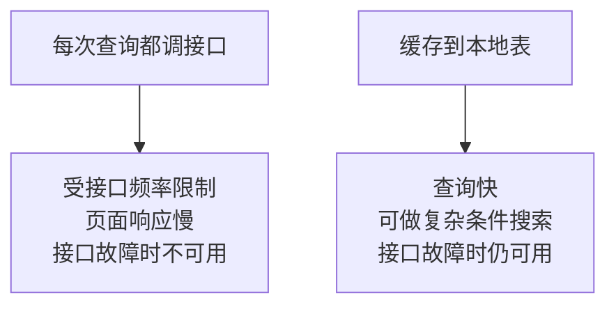

还有一个实际原因：**企业微信接口不支持按姓名模糊搜索**。要做「输入两个字找人」这种功能，必须把数据同步到本地再用 `LIKE`。

## 脚本

```sql
CREATE TABLE WeComDepartment (
    DeptId    INT PRIMARY KEY,              -- 用企业微信的部门 ID 作主键
    Name      NVARCHAR(100) NOT NULL,
    ParentId  INT NULL,
    OrderNo   BIGINT NULL,                  -- 企业微信返回的排序值
    IsDeleted BIT NOT NULL DEFAULT 0,
    SyncedAt  DATETIME2(0) NOT NULL DEFAULT SYSDATETIME()
);

CREATE TABLE WeComEmployee (
    UserId     NVARCHAR(64) PRIMARY KEY,    -- 用企业微信的 UserId 作主键
    Name       NVARCHAR(100) NULL,
    Mobile     NVARCHAR(32) NULL,
    Email      NVARCHAR(100) NULL,
    Position   NVARCHAR(100) NULL,
    MainDeptId INT NULL,
    DeptIds    NVARCHAR(200) NULL,          -- 一人可属多部门，存逗号分隔
    Enabled    BIT NULL,
    IsDeleted  BIT NOT NULL DEFAULT 0,
    SyncedAt   DATETIME2(0) NOT NULL DEFAULT SYSDATETIME()
);

CREATE INDEX IX_Employee_Name ON WeComEmployee (Name);
CREATE INDEX IX_Employee_MainDept ON WeComEmployee (MainDeptId, IsDeleted);
```

## 五个设计决策

### 为什么用企业微信的 ID 作主键，不另建自增列

因为这些 ID 由企业微信保证唯一且稳定。用它做主键，同步时可以直接 `MERGE`，不需要先查本地 ID 再更新。

### `ParentId` 为什么允许 `NULL`

根部门没有父部门。企业微信的顶层部门 ID 通常是 1。

不加外键自引用约束，是因为同步时的插入顺序不一定是父在子前，加了约束会失败。

### 为什么要 `IsDeleted` 而不是直接删行

这叫软删除。原因是**历史消息记录里还引用着这个人**。

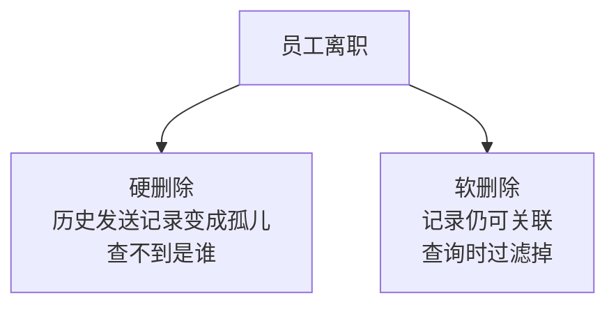

同步时的做法是：企业微信返回的人标记为未删除，本地存在但这次没返回的标记为已删除。

### `DeptIds` 为什么用逗号分隔而不是再拆一张表

企业微信里一个人可以属于多个部门，严格来说应该建一张关联表。

这里故意简化，因为本教程第 6 章只做查询和展示，用 `MainDeptId` 就够了。**如果你以后要做「按部门统计人数」这类需求，应该拆成关联表。**

这是一个有意识的取舍，写在这里是为了让你知道它的局限。

### `SyncedAt` 的作用

用来判断缓存新鲜度。页面上可以显示「数据同步于 10 分钟前」，也可以作为「超过一天未同步就提示刷新」的依据。

## 同步语句

用 `MERGE` 一次完成插入和更新：

```sql
MERGE WeComEmployee AS target
USING (SELECT ? AS UserId, ? AS Name, ? AS MainDeptId) AS source
    ON target.UserId = source.UserId
WHEN MATCHED THEN
    UPDATE SET Name = source.Name,
               MainDeptId = source.MainDeptId,
               IsDeleted = 0,
               SyncedAt = SYSDATETIME()
WHEN NOT MATCHED THEN
    INSERT (UserId, Name, MainDeptId)
    VALUES (source.UserId, source.Name, source.MainDeptId);
```

第 6 章会给出完整的 C# 同步代码。

---

# V9：回调事件表

## 目标

为第 11 章的回调处理准备表，并防止重复处理。

## 原理：企业微信会重复推送

这是**必须提前设计**的一点，不是可选优化。

企业微信推送回调后，如果没有在规定时间内收到你的响应，它会**重试推送同一个事件**：

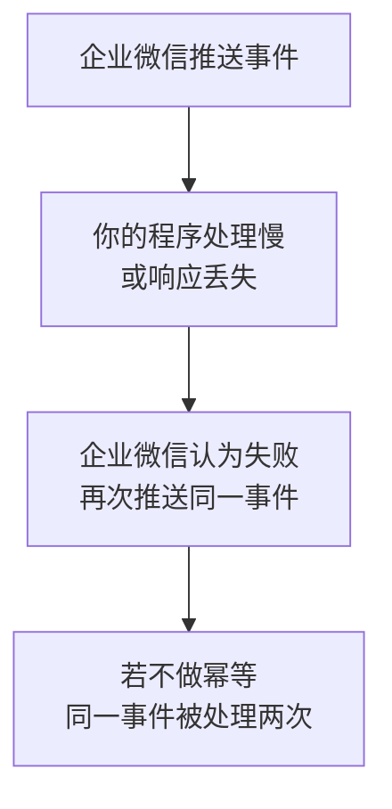

如果这个事件触发的是「自动回复一条消息」，员工就会收到两条。如果触发的是「扣减库存」，问题更严重。

## 脚本

```sql
CREATE TABLE CallbackEvent (
    Id          BIGINT IDENTITY(1,1) PRIMARY KEY,
    EventKey    NVARCHAR(200) NOT NULL,     -- 幂等键，见下方说明
    FromUser    NVARCHAR(64) NULL,
    MsgType     NVARCHAR(32) NULL,
    EventType   NVARCHAR(64) NULL,
    RawXml      NVARCHAR(MAX) NULL,         -- 解密后的原始内容
    Status      TINYINT NOT NULL DEFAULT 0, -- 0待处理 1处理中 2已处理 3失败
    ErrMsg      NVARCHAR(500) NULL,
    ReceivedAt  DATETIME2(0) NOT NULL DEFAULT SYSDATETIME(),
    ProcessedAt DATETIME2(0) NULL,

    CONSTRAINT UQ_Callback_EventKey UNIQUE (EventKey)
);

CREATE INDEX IX_Callback_Status ON CallbackEvent (Status, ReceivedAt);
```

## `EventKey` 怎么构造

企业微信的回调里没有一个现成的全局唯一 ID，需要自己拼。可用的组合是：

```text
发送方 UserId + 事件类型 + 消息时间戳
```

例如 `zhangsan_click_1756345678`。

对于文本消息类回调，通常有 `MsgId` 字段，直接用它更可靠。

## 关键：先落库再处理

正确的顺序是：

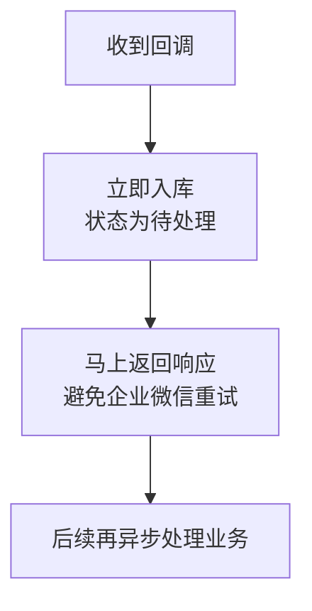

**不要在回调请求里做耗时的业务处理。**企业微信有响应时间要求，超时它就重推。

重复推送时，第二次入库会撞上 `UQ_Callback_EventKey` 唯一约束，直接被拒绝，业务不会被执行第二次。这和 V6 是同一个思路。

## 为什么 `RawXml` 要存

三个用途：

| 用途 | 说明 |
|---|---|
| 排错 | 解析逻辑写错时，能回看原始内容 |
| 补处理 | 加了新的业务逻辑后，可以重放历史事件 |
| 取证 | 证明某个事件确实收到过 |

企业微信的回调是加密的，这里存的应该是**解密后**的内容。

---

# V10：签到表与 API 日志表

## 签到表

为第 10 章的 JS-SDK 定位准备。

```sql
CREATE TABLE CheckinRecord (
    Id         BIGINT IDENTITY(1,1) PRIMARY KEY,
    UserId     NVARCHAR(64) NOT NULL,
    Latitude   DECIMAL(9,6) NOT NULL,       -- 纬度
    Longitude  DECIMAL(9,6) NOT NULL,       -- 经度
    Accuracy   DECIMAL(9,2) NULL,           -- 定位精度，单位米
    CoordType  NVARCHAR(10) NULL,           -- 坐标系：wgs84 或 gcj02
    Address    NVARCHAR(300) NULL,          -- 逆地址解析结果
    RawGeoJson NVARCHAR(MAX) NULL,          -- 地图服务原始返回
    CheckinAt  DATETIME2(0) NOT NULL DEFAULT SYSDATETIME()
);

CREATE INDEX IX_Checkin_User_Time ON CheckinRecord (UserId, CheckinAt DESC);
```

### 为什么经纬度用 `DECIMAL(9,6)`

小数位 6 位的精度约为 0.1 米，对签到场景远远够用。

整数位 3 位可以容纳经度最大值 180。纬度只到 90，共用同一类型便于处理。

**不要用 `FLOAT`。**浮点数存储有误差，同一个坐标存进去再取出来可能不完全相等，会给后续比对带来麻烦。

### 为什么要记 `CoordType`

这是第 10 章的核心坑：手机返回的坐标系和地图服务用的坐标系可能不同，**混用会导致定位偏移几百米**。

把当时用的坐标系记下来，日后发现数据偏移才有办法追溯和修正。

### 为什么要留 `Accuracy`

定位精度受室内环境影响很大，误差可能几十米甚至上百米。存下这个值，才能判断某条签到记录是否可信。

## API 日志表

```sql
CREATE TABLE ApiLog (
    Id         BIGINT IDENTITY(1,1) PRIMARY KEY,
    Source     NVARCHAR(20) NOT NULL,       -- python 或 webforms
    ApiName    NVARCHAR(100) NOT NULL,
    ErrCode    INT NULL,
    ErrMsg     NVARCHAR(500) NULL,
    ElapsedMs  INT NULL,
    CreatedAt  DATETIME2(0) NOT NULL DEFAULT SYSDATETIME()
);

CREATE INDEX IX_ApiLog_Time ON ApiLog (CreatedAt DESC);
CREATE INDEX IX_ApiLog_ErrCode ON ApiLog (ErrCode) WHERE ErrCode <> 0;
```

### `Source` 字段的意义

本教程 Python 和 C# 是两个独立程序，但共用这张表。出问题时需要知道是哪边发起的调用。

这是「共享数据但不互相调用」这个原则的体现：两个程序在数据层相遇，靠这个字段区分身份。

### 为什么不记录请求和响应全文

两个原因：

1. **安全**：请求 URL 里含 `access_token`，它在两小时内是完全可用的凭证
2. **体积**：全文日志增长极快，很快会占满磁盘

只记接口名、错误码和耗时，足够定位问题。需要看细节时用第 2 章 V12 的脱敏方式单独输出到文件。

### `IX_ApiLog_ErrCode` 为什么是筛选索引

因为绝大多数记录是成功的（`ErrCode = 0`），而查询几乎只关心失败的。筛选索引只包含失败行，体积小得多。

### 清理策略

日志表必须有保留期限，否则迟早占满磁盘：

```sql
-- 建议每天执行一次，只保留 90 天
DELETE TOP (10000) FROM ApiLog
WHERE CreatedAt < DATEADD(DAY, -90, SYSDATETIME());
```

用 `TOP (10000)` 分批删除，避免一次删太多导致长事务和日志膨胀。反复执行到删完为止。

---

# V11：集成版完整脚本

把前面所有内容整理成一个可以一次执行的脚本 `init_database.sql`：

```sql
/* ============================================================
   企业微信教程数据库初始化脚本
   包含：消息任务、收件人、通讯录缓存、回调事件、签到、API 日志
   ============================================================ */

IF DB_ID('WeComTutorial') IS NULL
    CREATE DATABASE WeComTutorial;
GO

USE WeComTutorial;
GO

/* ---------- 消息任务 ---------- */
IF OBJECT_ID('MessageRecipient') IS NOT NULL DROP TABLE MessageRecipient;
IF OBJECT_ID('MessageTask') IS NOT NULL DROP TABLE MessageTask;
GO

CREATE TABLE MessageTask (
    Id         INT IDENTITY(1,1) PRIMARY KEY,
    BizKey     NVARCHAR(100) NULL,          -- 业务幂等键
    MsgType    NVARCHAR(20) NOT NULL DEFAULT 'text',
    Content    NVARCHAR(1000) NOT NULL,
    Safe       BIT NOT NULL DEFAULT 0,      -- 是否保密消息
    Status     TINYINT NOT NULL DEFAULT 0,  -- 0待发 1处理中 2成功 3失败 4部分失败
    RetryCount TINYINT NOT NULL DEFAULT 0,
    MaxRetry   TINYINT NOT NULL DEFAULT 3,
    ErrCode    INT NULL,
    ErrMsg     NVARCHAR(500) NULL,
    CreatedAt  DATETIME2(0) NOT NULL DEFAULT SYSDATETIME(),
    UpdatedAt  DATETIME2(0) NULL,
    SentAt     DATETIME2(0) NULL
);

-- 幂等：同一业务键只允许一条；NULL 不受限
CREATE UNIQUE INDEX UQ_Task_BizKey ON MessageTask (BizKey)
    WHERE BizKey IS NOT NULL;

-- 领取待发送任务用
CREATE INDEX IX_Task_Status ON MessageTask (Status, CreatedAt);
GO

CREATE TABLE MessageRecipient (
    Id      BIGINT IDENTITY(1,1) PRIMARY KEY,
    TaskId  INT NOT NULL,
    UserId  NVARCHAR(64) NOT NULL,
    Status  TINYINT NOT NULL DEFAULT 0,
    ErrCode INT NULL,
    ErrMsg  NVARCHAR(500) NULL,
    SentAt  DATETIME2(0) NULL,

    CONSTRAINT FK_Recipient_Task FOREIGN KEY (TaskId)
        REFERENCES MessageTask(Id),
    CONSTRAINT UQ_Recipient_Task_User UNIQUE (TaskId, UserId)
);

CREATE INDEX IX_Recipient_Task_Status ON MessageRecipient (TaskId, Status);
GO

/* ---------- 通讯录缓存 ---------- */
IF OBJECT_ID('WeComEmployee') IS NOT NULL DROP TABLE WeComEmployee;
IF OBJECT_ID('WeComDepartment') IS NOT NULL DROP TABLE WeComDepartment;
GO

CREATE TABLE WeComDepartment (
    DeptId    INT PRIMARY KEY,
    Name      NVARCHAR(100) NOT NULL,
    ParentId  INT NULL,
    OrderNo   BIGINT NULL,
    IsDeleted BIT NOT NULL DEFAULT 0,
    SyncedAt  DATETIME2(0) NOT NULL DEFAULT SYSDATETIME()
);
GO

CREATE TABLE WeComEmployee (
    UserId     NVARCHAR(64) PRIMARY KEY,
    Name       NVARCHAR(100) NULL,
    Mobile     NVARCHAR(32) NULL,
    Email      NVARCHAR(100) NULL,
    Position   NVARCHAR(100) NULL,
    MainDeptId INT NULL,
    DeptIds    NVARCHAR(200) NULL,
    Enabled    BIT NULL,
    IsDeleted  BIT NOT NULL DEFAULT 0,
    SyncedAt   DATETIME2(0) NOT NULL DEFAULT SYSDATETIME()
);

CREATE INDEX IX_Employee_Name ON WeComEmployee (Name);
CREATE INDEX IX_Employee_MainDept ON WeComEmployee (MainDeptId, IsDeleted);
GO

/* ---------- 回调事件 ---------- */
IF OBJECT_ID('CallbackEvent') IS NOT NULL DROP TABLE CallbackEvent;
GO

CREATE TABLE CallbackEvent (
    Id          BIGINT IDENTITY(1,1) PRIMARY KEY,
    EventKey    NVARCHAR(200) NOT NULL,
    FromUser    NVARCHAR(64) NULL,
    MsgType     NVARCHAR(32) NULL,
    EventType   NVARCHAR(64) NULL,
    RawXml      NVARCHAR(MAX) NULL,
    Status      TINYINT NOT NULL DEFAULT 0,
    ErrMsg      NVARCHAR(500) NULL,
    ReceivedAt  DATETIME2(0) NOT NULL DEFAULT SYSDATETIME(),
    ProcessedAt DATETIME2(0) NULL,

    CONSTRAINT UQ_Callback_EventKey UNIQUE (EventKey)
);

CREATE INDEX IX_Callback_Status ON CallbackEvent (Status, ReceivedAt);
GO

/* ---------- 签到记录 ---------- */
IF OBJECT_ID('CheckinRecord') IS NOT NULL DROP TABLE CheckinRecord;
GO

CREATE TABLE CheckinRecord (
    Id         BIGINT IDENTITY(1,1) PRIMARY KEY,
    UserId     NVARCHAR(64) NOT NULL,
    Latitude   DECIMAL(9,6) NOT NULL,
    Longitude  DECIMAL(9,6) NOT NULL,
    Accuracy   DECIMAL(9,2) NULL,
    CoordType  NVARCHAR(10) NULL,
    Address    NVARCHAR(300) NULL,
    RawGeoJson NVARCHAR(MAX) NULL,
    CheckinAt  DATETIME2(0) NOT NULL DEFAULT SYSDATETIME()
);

CREATE INDEX IX_Checkin_User_Time ON CheckinRecord (UserId, CheckinAt DESC);
GO

/* ---------- API 日志 ---------- */
IF OBJECT_ID('ApiLog') IS NOT NULL DROP TABLE ApiLog;
GO

CREATE TABLE ApiLog (
    Id        BIGINT IDENTITY(1,1) PRIMARY KEY,
    Source    NVARCHAR(20) NOT NULL,
    ApiName   NVARCHAR(100) NOT NULL,
    ErrCode   INT NULL,
    ErrMsg    NVARCHAR(500) NULL,
    ElapsedMs INT NULL,
    CreatedAt DATETIME2(0) NOT NULL DEFAULT SYSDATETIME()
);

CREATE INDEX IX_ApiLog_Time ON ApiLog (CreatedAt DESC);
CREATE INDEX IX_ApiLog_ErrCode ON ApiLog (ErrCode) WHERE ErrCode <> 0;
GO

PRINT '数据库初始化完成';
```

## 表与章节的对应关系

| 表 | 谁写入 | 谁读取 | 用在哪章 |
|---|---|---|---|
| `MessageTask` | 业务系统、人工 | Python | 04 |
| `MessageRecipient` | Python | Python | 04 |
| `WeComDepartment` | C# WebForms | C# WebForms | 06 |
| `WeComEmployee` | C# WebForms | C# WebForms | 06 |
| `CallbackEvent` | C# WebForms | C# WebForms | 11 |
| `CheckinRecord` | C# WebForms | C# WebForms | 10 |
| `ApiLog` | 两者都写 | 人工排查 | 全部 |

注意最后一行：`ApiLog` 是 Python 和 C# 唯一共用的表，靠 `Source` 字段区分。**两个程序在数据层相遇，但不互相调用**，这正是本教程的架构原则。

## 后续章节还会追加 5 张表

本章建的 7 张表满足第 4 章和第 6 章的需要。随着功能推进，后面会按需追加：

| 表 | 在哪章追加 | 用途 |
|---|---|---|
| `MediaCache` | 第 5 章 | 素材 `media_id` 缓存 |
| `UserLoginLog` | 第 8 章 | 登录审计 |
| `GeocodeCache` | 第 10 章 | 逆地址解析结果缓存 |
| `CallbackRaw` | 第 11 章 | 回调原始报文留痕 |
| `SyncFlag` | 第 11 章 | 通讯录待同步标记 |

全部完成后共 12 张表。**这里先说明，是为了让你知道本章的 7 张不是全部**，不必担心后面找不到某张表的来源。

追加的方式都是独立的 `CREATE TABLE` 脚本，不需要重建已有的表。

---

# 本章自测

| 测试 | 做法 | 期望结果 |
|---|---|---|
| 1 幂等 | 同一 `BizKey` 插两次 | 第二次被唯一约束拒绝 |
| 2 状态流转 | 跑完发送后查任务 | 状态是 2 或 4，不是 1 |
| 3 卡死回收 | 手工把某任务改成 `Status=1` 且 `UpdatedAt` 设成一小时前，运行回收语句 | 该任务变回 0 |
| 4 部分失败 | 收件人里放一个不存在的 UserId | 该收件人状态为 3，其他为 2 |
| 5 并发领取 | 同时开两个程序 | 无收件人被处理两次 |
| 6 软删除 | 把某员工 `IsDeleted` 设为 1 | 查询列表里不出现，但历史记录仍能关联 |

验证第 5 项的查询：

```sql
SELECT TaskId, UserId, COUNT(*) FROM MessageRecipient
GROUP BY TaskId, UserId HAVING COUNT(*) > 1;
```

应返回空结果。

# 常用运维查询

```sql
-- 今天的发送概况
SELECT Status, COUNT(*) AS 任务数
FROM MessageTask
WHERE CreatedAt >= CAST(SYSDATETIME() AS DATE)
GROUP BY Status;

-- 失败原因排行
SELECT ErrCode, ErrMsg, COUNT(*) AS 次数
FROM MessageRecipient
WHERE Status = 3
GROUP BY ErrCode, ErrMsg
ORDER BY 次数 DESC;

-- 卡死的任务
SELECT Id, Content, UpdatedAt
FROM MessageTask
WHERE Status = 1
  AND UpdatedAt < DATEADD(MINUTE, -10, SYSDATETIME());

-- 通讯录缓存新鲜度
SELECT MIN(SyncedAt) AS 最早同步, MAX(SyncedAt) AS 最近同步,
       COUNT(*) AS 人数
FROM WeComEmployee
WHERE IsDeleted = 0;
```

# 完成标准

## 理解部分

- [ ] 为什么必须有「处理中」这个中间状态
- [ ] 为什么「先标记再发送」而不是「先发送再标记」
- [ ] 为什么卡死回收有可能导致重复发送，为什么这无法完全避免
- [ ] 为什么收件人要拆成独立表（三个理由）
- [ ] 为什么唯一索引比「先查再插」可靠
- [ ] `UPDATE ... OUTPUT` 为什么能防止两个进程抢同一条任务

## 操作部分

- [ ] `init_database.sql` 执行成功，七张表都已创建
- [ ] 能从 Python 连上数据库并读出任务
- [ ] 6 项自测全部通过

# 下一章

第 4 章把第 2 章的 `wecom.py` 和本章的表结合起来，做成完整的群发程序：定时扫描任务、按 900 人分批、逐人回写结果、失败重试、卡死回收。
