# 第 4 章：Python 群发通知

## 本章目标

把第 2 章的 `wecom.py` 和第 3 章的表结合起来，做成一个可以定时运行的群发程序。

本章结束时你会得到一个能长期无人值守运行的程序：从数据库读任务、分批发送、逐人记录结果、失败重试、卡死回收。

## 前置条件

- 第 2 章完成，`wecom.py` 可以发消息
- 第 3 章完成，`init_database.sql` 已执行，七张表都在
- 已装 `pyodbc`：`pip install pyodbc`

## 本章的核心转变

第 2 章是「**我要发一条消息**」，本章是「**有一个持续运行的程序在替我发消息**」。

这个转变带来三个新问题：

| 新问题 | 第 2 章不存在的原因 |
|---|---|
| 谁来决定发什么 | 第 2 章是你手工写在代码里 |
| 程序崩了怎么办 | 第 2 章你人在现场，看到报错就知道 |
| 怎么保证不重复发 | 第 2 章你只运行一次 |

## 版本地图

| 版本 | 主题 | 解决上一版什么问题 |
|---|---|---|
| V1 | 读表发送 | —— |
| V2 | 原子领取任务 | 两个进程抢同一条任务 |
| V3 | 按批切分收件人 | 超过 1000 人直接失败 |
| V4 | 逐人回写结果 | 不知道具体谁没收到 |
| V5 | 错误分类与重试 | 无意义的重试浪费配额 |
| V6 | 卡死回收 | 崩溃的任务永久卡住 |
| V7 | 按部门和标签发送 | 只能按人发，名单难维护 |
| V8 | 全员发送防护 | `@all` 可能误发全公司 |
| V9 | Excel 导入 | 人工建任务太麻烦 |
| V10 | 主循环与优雅退出 | 每次都要手工启动 |
| V11 | 定时执行 | 需要人守着 |
| V12 | 集成版 | 代码零散 |

---

# V1：读表发送

## 目标

跑通「数据库到企业微信」这条链路。

## 准备数据

```sql
USE WeComTutorial;

INSERT INTO MessageTask (Content) VALUES (N'来自群发程序的第一条通知');
DECLARE @id INT = SCOPE_IDENTITY();

INSERT INTO MessageRecipient (TaskId, UserId) VALUES (@id, N'你的UserId');
```

## 代码

新建 `sender.py`：

```python
# -*- coding: utf-8 -*-
"""V1：从数据库读任务并发送。"""

import pyodbc
import wecom

CONN_STR = (
    "DRIVER={ODBC Driver 17 for SQL Server};"
    "SERVER=localhost;DATABASE=WeComTutorial;"
    "Trusted_Connection=yes;"
)

conn = pyodbc.connect(CONN_STR)
cursor = conn.cursor()

# 取待发送任务
cursor.execute("SELECT Id, Content FROM MessageTask WHERE Status = 0")
tasks = cursor.fetchall()

for task in tasks:
    # 取这条任务的收件人
    cursor.execute("SELECT UserId FROM MessageRecipient WHERE TaskId = ?", task.Id)
    users = [r.UserId for r in cursor.fetchall()]

    wecom.send_text(task.Content, to_user="|".join(users))

    cursor.execute("UPDATE MessageTask SET Status = 2 WHERE Id = ?", task.Id)
    conn.commit()
    print(f"任务 {task.Id} 已发送给 {len(users)} 人")

conn.close()
```

## 原理：为什么用「拉」而不是「推」

这里有一个架构选择。业务系统要发通知时，有两种做法：

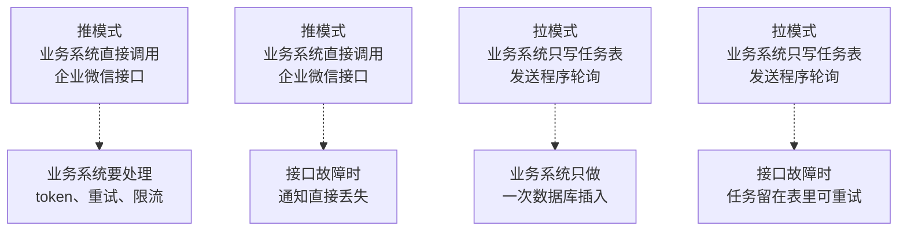

本教程用拉模式，三个理由：

| 理由 | 说明 |
|---|---|
| 业务系统解耦 | 它只需要 `INSERT`，不需要懂企业微信 |
| 故障可恢复 | 企业微信挂了，任务留在表里，恢复后自动发出 |
| 天然限流 | 发送速度由发送程序控制，不会因业务高峰打爆接口 |

代价是**有延迟**：任务写入后要等下一轮轮询才发出。这个延迟由轮询间隔决定，通常几秒到一分钟，对通知类场景完全可接受。

## `"|".join(users)` 这一行

第 2 章讲过 `touser` 用竖线分隔。这里把列表拼成字符串。

## V1 的问题

三个：

1. 如果定时任务重叠执行，两个进程会同时捞到同一条任务，各发一遍
2. 收件人超过 1000 人时接口会失败
3. 发送结果没有落到收件人表，`invaliduser` 的信息完全丢了

---

# V2：原子领取任务

## 目标

保证一条任务只被一个进程处理。

## 原理：读和写之间的窗口

V1 是两步操作：

```python
cursor.execute("SELECT ... WHERE Status = 0")     # 读
# ← 窗口就在这里
cursor.execute("UPDATE ... SET Status = 2 ...")   # 写
```

两个进程都能在窗口期读到同一条：

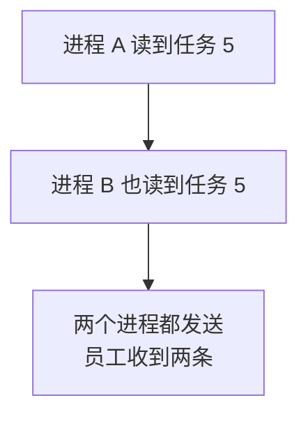

## 解决办法

用第 3 章 V7 的 `UPDATE ... OUTPUT`，把读和标记合并成一条语句：

```python
def claim_tasks(cursor, conn, limit=10):
    """原子地领取一批任务。

    UPDATE 和 OUTPUT 在同一条语句里完成，数据库保证
    不会有两个进程改到同一行。被别人抢到的行，
    本进程根本看不到 Status = 0。
    """
    cursor.execute(f"""
        UPDATE TOP ({limit}) MessageTask
        SET Status = 1, UpdatedAt = SYSDATETIME()
        OUTPUT inserted.Id, inserted.Content, inserted.MsgType,
               inserted.Safe, inserted.RetryCount, inserted.MaxRetry
        WHERE Status = 0 AND RetryCount < MaxRetry
    """)
    tasks = cursor.fetchall()
    conn.commit()
    return tasks
```

## 为什么 `limit` 默认是 10

一次领太多有风险：如果程序在处理第 3 条时崩溃，剩下 7 条都卡在「处理中」，要等回收机制处理。

一次领太少则效率低，每条都要一次数据库往返。

10 是个平衡值。如果你的任务量很大，可以调到 50。

## 主流程改写

```python
tasks = claim_tasks(cursor, conn)
if not tasks:
    print("没有待发送任务")

for task in tasks:
    cursor.execute("SELECT UserId FROM MessageRecipient WHERE TaskId = ?", task.Id)
    users = [r.UserId for r in cursor.fetchall()]

    wecom.send_text(task.Content, to_user="|".join(users))

    cursor.execute("""
        UPDATE MessageTask SET Status = 2, SentAt = SYSDATETIME(),
               UpdatedAt = SYSDATETIME()
        WHERE Id = ?
    """, task.Id)
    conn.commit()
```

## 验证

开两个命令行窗口，同时运行程序。检查有没有任务被处理两次：

```sql
SELECT TaskId, UserId, COUNT(*) FROM MessageRecipient
GROUP BY TaskId, UserId HAVING COUNT(*) > 1;
```

应返回空。

## V2 的问题

收件人超过 1000 人时，接口调用会直接失败。

---

# V3：按批切分收件人

## 目标

支持任意数量的收件人。

## 原理：为什么用 900 而不是 1000

企业微信 `touser` 上限约 1000 个成员。这里取 900，留出余量。

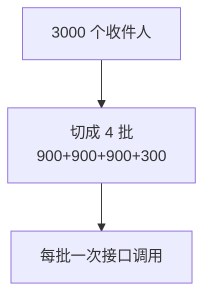

留余量的理由是**边界值不可靠**：文档写的是「约 1000」，具体实现可能有细微差异。卡着上限用，遇到边界情况会失败，而失败的是一整批 1000 人。

用 900 换来的确定性，比省下的那几次调用值得。

## 关键设计：批与批之间独立

每批必须独立记录成功失败：

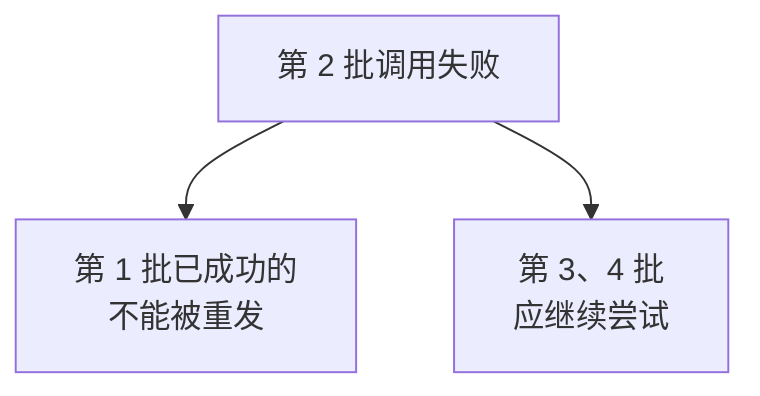

如果把整个任务当成一个整体，第 2 批失败就导致整条任务标记失败，重试时前面 900 人会重复收到。

**这就是第 3 章要把收件人拆成独立表的第一个理由的具体体现。**

## 代码

```python
BATCH_SIZE = 900


def send_task(cursor, conn, task):
    """发送一条任务，按批处理收件人。"""
    cursor.execute("""
        SELECT UserId FROM MessageRecipient
        WHERE TaskId = ? AND Status = 0
    """, task.Id)
    users = [r.UserId for r in cursor.fetchall()]

    if not users:
        print(f"任务 {task.Id} 无待发送收件人")
        return

    total_batches = (len(users) + BATCH_SIZE - 1) // BATCH_SIZE
    print(f"任务 {task.Id}：{len(users)} 人，分 {total_batches} 批")

    for i in range(0, len(users), BATCH_SIZE):
        batch = users[i:i + BATCH_SIZE]
        batch_no = i // BATCH_SIZE + 1

        try:
            wecom.send_text(task.Content, to_user="|".join(batch),
                            safe=1 if task.Safe else 0)
            print(f"  第 {batch_no}/{total_batches} 批完成")
        except Exception as ex:
            print(f"  第 {batch_no}/{total_batches} 批失败：{ex}")
            # 这一批失败不影响其他批，继续
            continue
```

## `(len(users) + BATCH_SIZE - 1) // BATCH_SIZE` 这个写法

这是整数向上取整的常用技巧。2100 人时：`(2100 + 899) // 900 = 3` 批。

直接写 `len(users) // BATCH_SIZE` 会少算最后不满一批的那些人。

## V3 的问题

现在知道哪一批失败了，但**不知道具体是哪个人没收到**。`invaliduser` 的信息被丢掉了。

---

# V4：逐人回写结果

## 目标

把每个收件人的投递结果准确记录到数据库。

## 原理：成功者要靠「差集」推导

这是本章最容易写错的地方。

企业微信的返回**只告诉你失败的人**，不告诉你成功的人：

```json
{"errcode": 0, "errmsg": "ok", "invaliduser": "zhaoliu|sunqi"}
```

所以成功的人只能自己算：

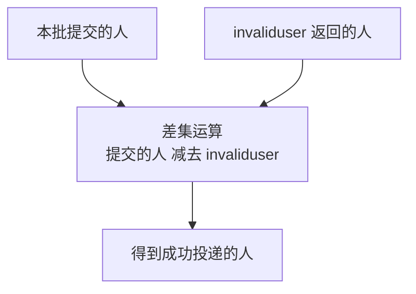

如果偷懒把整批都标记成成功，那些实际没收到的人就永远查不出来了。

## 顺序：先标记处理中，再发送

沿用第 3 章 V2 的原则：

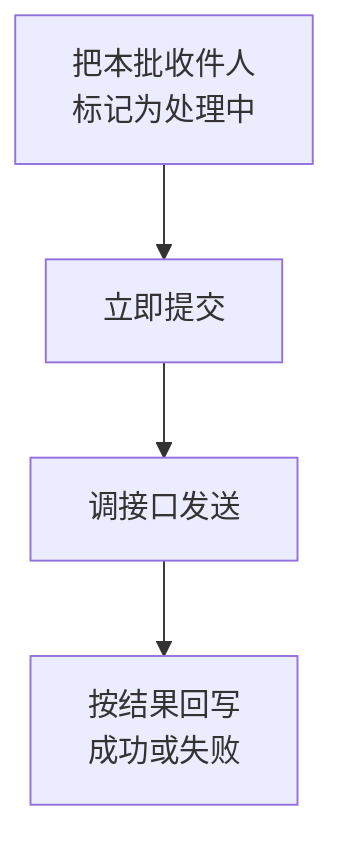

「立即提交」很重要。如果等最后统一提交，程序崩溃时这个标记会随事务回滚消失。

## 代码

```python
def _mark_recipients(cursor, conn, task_id, users, status,
                     errcode=None, errmsg=None):
    """批量更新一组收件人的状态。"""
    if not users:
        return

    placeholders = ",".join("?" * len(users))
    cursor.execute(f"""
        UPDATE MessageRecipient
        SET Status = ?, ErrCode = ?, ErrMsg = ?,
            SentAt = CASE WHEN ? = 2 THEN SYSDATETIME() ELSE SentAt END
        WHERE TaskId = ? AND UserId IN ({placeholders})
    """, status, errcode, errmsg[:500] if errmsg else None,
        status, task_id, *users)
    conn.commit()


def _parse_invalid(problems):
    """从 wecom.send_text 返回的问题列表里提取无效成员。

    第 2 章的 send_text 返回形如 ['无效成员：zhaoliu|sunqi']
    """
    failed = set()
    for p in problems:
        if p.startswith("无效成员："):
            names = p.split("：", 1)[1]
            failed.update(u for u in names.split("|") if u)
    return failed


def send_task(cursor, conn, task):
    """发送一条任务，逐人回写结果。"""
    cursor.execute("""
        SELECT UserId FROM MessageRecipient
        WHERE TaskId = ? AND Status = 0
    """, task.Id)
    users = [r.UserId for r in cursor.fetchall()]

    if not users:
        return

    for i in range(0, len(users), BATCH_SIZE):
        batch = users[i:i + BATCH_SIZE]

        # 先标记处理中并立即提交
        _mark_recipients(cursor, conn, task.Id, batch, 1)

        try:
            problems = wecom.send_text(task.Content, to_user="|".join(batch),
                                       safe=1 if task.Safe else 0)
        except Exception as ex:
            # 整批网络级失败，全部标记失败
            _mark_recipients(cursor, conn, task.Id, batch, 3,
                             errmsg=str(ex))
            continue

        # 关键：用差集算出成功的人
        failed = _parse_invalid(problems)
        succeeded = [u for u in batch if u not in failed]

        _mark_recipients(cursor, conn, task.Id, succeeded, 2)
        _mark_recipients(cursor, conn, task.Id, list(failed), 3,
                         errmsg="不在可见范围或UserId无效")
```

## 任务整体状态由收件人推导

```python
def update_task_status(cursor, conn, task_id):
    """根据收件人状态汇总任务状态。"""
    cursor.execute("""
        SELECT
            SUM(CASE WHEN Status IN (0,1) THEN 1 ELSE 0 END) AS Pending,
            SUM(CASE WHEN Status = 2 THEN 1 ELSE 0 END) AS Ok,
            SUM(CASE WHEN Status = 3 THEN 1 ELSE 0 END) AS Failed
        FROM MessageRecipient WHERE TaskId = ?
    """, task_id)
    row = cursor.fetchone()

    if row.Pending > 0:
        status = 1              # 还有人没处理完
    elif row.Failed == 0:
        status = 2              # 全部成功
    elif row.Ok == 0:
        status = 3              # 全部失败
    else:
        status = 4              # 部分失败

    cursor.execute("""
        UPDATE MessageTask
        SET Status = ?, UpdatedAt = SYSDATETIME(),
            SentAt = CASE WHEN ? IN (2,4) AND SentAt IS NULL
                          THEN SYSDATETIME() ELSE SentAt END
        WHERE Id = ?
    """, status, status, task_id)
    conn.commit()
    return status
```

## 为什么 `SentAt` 要判断 `IS NULL`

```sql
SentAt = CASE WHEN ? IN (2,4) AND SentAt IS NULL THEN SYSDATETIME() ELSE SentAt END
```

第 3 章讲过：`SentAt` 记录**首次发出**的时间。重试时不应该覆盖它，否则业务上会误解「这条通知是几点发的」。

## 验证

收件人里放一个不存在的 UserId：

```sql
INSERT INTO MessageTask (Content) VALUES (N'差集测试');
DECLARE @id INT = SCOPE_IDENTITY();
INSERT INTO MessageRecipient (TaskId, UserId) VALUES
    (@id, N'你的UserId'), (@id, N'完全不存在xyz');
```

运行后检查：

```sql
SELECT UserId, Status, ErrMsg FROM MessageRecipient WHERE TaskId = @id;
```

期望：你自己是 2，不存在的那个是 3。任务整体状态是 4（部分失败）。

## V4 的问题

失败的任务会一直重试，包括那些重试一万次也不会成功的。

---

# V5：错误分类与重试

## 目标

只重试有可能成功的失败。

## 原理：按第 1 章的三层模型分类

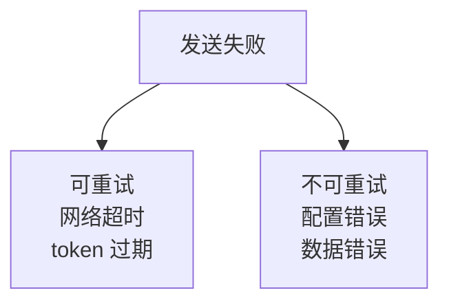

具体归类：

| 错误 | 错误码 | 重试有意义吗 | 为什么 |
|---|---|---|---|
| 网络超时 | 无 | **有** | 下次网络可能正常 |
| token 过期 | 42001 | **有** | 会自动取新 token |
| Secret 错 | 40001 | 无 | 要改配置文件 |
| 无操作权限 | 60011 | 无 | 要改 AgentId 配置 |
| IP 不在白名单 | 60020 | 无 | 要去后台加 IP |
| UserId 不存在 | 81013 | 无 | 要改任务数据 |
| 不在可见范围 | `invaliduser` | 无 | 要改后台可见范围 |

关键判断：**如果失败原因需要人去改配置或改数据，那么重试一万次也是失败。**

## 原理：退避的必要性

对可重试的错误，也不该立刻重试。

假设企业微信服务临时不可用，你的程序立刻重试，只会在几秒内耗完 3 次重试机会，然后放弃。而故障可能持续 5 分钟。

正确做法是**逐次拉长间隔**：

| 重试次数 | 等待时间 |
|---|---|
| 第 1 次 | 1 分钟 |
| 第 2 次 | 5 分钟 |
| 第 3 次 | 15 分钟 |

这样 3 次重试覆盖的时间窗口是 21 分钟，足以跨过大多数临时故障。

## 实现退避需要一个新字段

```sql
ALTER TABLE MessageTask ADD NextRetryAt DATETIME2(0) NULL;
```

领取任务时加上这个条件：

```sql
WHERE Status = 0
  AND RetryCount < MaxRetry
  AND (NextRetryAt IS NULL OR NextRetryAt <= SYSDATETIME())
```

## 代码

```python
# 不可重试的错误码：需要人工改配置或改数据
NO_RETRY_CODES = {40001, 40013, 40014, 60011, 60020, 81013, 44004}

# 退避间隔，单位分钟
RETRY_DELAYS = [1, 5, 15]


def extract_errcode(exception):
    """从异常信息里提取企业微信错误码。

    第 2 章的 describe_error 输出形如 'errcode=60011, errmsg=...'
    """
    import re
    m = re.search(r"errcode=(\d+)", str(exception))
    return int(m.group(1)) if m else None


def handle_task_failure(cursor, conn, task, exception):
    """处理任务失败：判断是否重试，并安排下次重试时间。"""
    errcode = extract_errcode(exception)
    retry = task.RetryCount + 1

    can_retry = (errcode not in NO_RETRY_CODES) and (retry < task.MaxRetry)

    if can_retry:
        # 退避：按重试次数拉长间隔
        delay = RETRY_DELAYS[min(retry - 1, len(RETRY_DELAYS) - 1)]
        cursor.execute("""
            UPDATE MessageTask
            SET Status = 0, RetryCount = ?, ErrCode = ?, ErrMsg = ?,
                NextRetryAt = DATEADD(MINUTE, ?, SYSDATETIME()),
                UpdatedAt = SYSDATETIME()
            WHERE Id = ?
        """, retry, errcode, str(exception)[:500], delay, task.Id)
        print(f"任务 {task.Id} 第 {retry} 次失败，{delay} 分钟后重试")
    else:
        cursor.execute("""
            UPDATE MessageTask
            SET Status = 3, RetryCount = ?, ErrCode = ?, ErrMsg = ?,
                UpdatedAt = SYSDATETIME()
            WHERE Id = ?
        """, retry, errcode, str(exception)[:500], task.Id)
        reason = "错误码不可重试" if errcode in NO_RETRY_CODES else "已达重试上限"
        print(f"任务 {task.Id} 终止：{reason}（errcode={errcode}）")

    conn.commit()
```

## 一个重要细节：重试只发失败的人

重试时收件人查询用的是 `Status = 0`：

```sql
SELECT UserId FROM MessageRecipient WHERE TaskId = ? AND Status = 0
```

已经成功的人状态是 2，不会被再次捞出来。**所以重试天然只针对没成功的人**，不会重复打扰已收到的人。

这是第 3 章拆表带来的直接好处。

## V5 的问题

如果程序在发送过程中被强行终止，任务卡在 `Status = 1`，永远不会被领取。

---

# V6：卡死回收

## 目标

让崩溃的任务能自动恢复。

## 原理：如何区分「正在处理」和「已卡死」

两者在数据库里都是 `Status = 1`，唯一区别是**在这个状态停留了多久**。

## 阈值怎么定

这是关键决策。阈值必须**大于一条任务正常处理的最长耗时**：

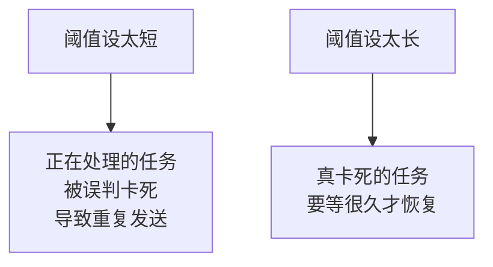

怎么估算最长耗时：

| 因素 | 估算 |
|---|---|
| 一批 900 人 | 一次接口调用，约 1 到 3 秒 |
| 一条任务 3000 人 | 4 批，约 12 秒 |
| 加上超时重试 | 每批最多 10 秒超时 |
| 最坏情况 | 4 × 10 = 40 秒 |

所以 **10 分钟是很安全的阈值**，远大于 40 秒。

如果你的任务有几万人，要相应调大。

## 必须承认的风险

第 3 章讲过，这里再强调一次：**回收有可能导致重复发送。**

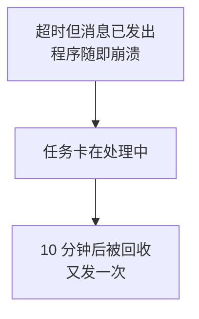

这无法完全避免，因为超时后你根本无法知道消息发没发出去。

不过 V4 之后风险已经小很多了：因为回收后重试只发 `Status = 0` 的收件人。如果崩溃前已经回写了成功状态，那些人不会被重发。**真正有风险的只是「调用成功但还没来得及回写状态」这个极短的窗口。**

## 代码

```python
STUCK_MINUTES = 10


def recover_stuck(cursor, conn):
    """回收卡死的任务和收件人。"""
    # 任务级
    cursor.execute("""
        UPDATE MessageTask
        SET Status = 0, UpdatedAt = SYSDATETIME()
        WHERE Status = 1
          AND UpdatedAt < DATEADD(MINUTE, ?, SYSDATETIME())
    """, -STUCK_MINUTES)
    tasks = cursor.rowcount

    # 收件人级：把卡在处理中的退回待发送
    cursor.execute("""
        UPDATE r
        SET Status = 0
        FROM MessageRecipient r
        JOIN MessageTask t ON t.Id = r.TaskId
        WHERE r.Status = 1
          AND t.UpdatedAt < DATEADD(MINUTE, ?, SYSDATETIME())
    """, -STUCK_MINUTES)
    recipients = cursor.rowcount

    conn.commit()

    if tasks or recipients:
        print(f"回收：{tasks} 条任务，{recipients} 个收件人")
    return tasks
```

## 为什么收件人也要回收

因为 V4 的流程是「先把收件人标记处理中，再发送」。如果崩在中间，这些收件人也卡在 1，即使任务被退回 0，查询 `Status = 0` 的收件人时也捞不到他们。

## 验证

手工制造一个卡死任务：

```sql
UPDATE MessageTask
SET Status = 1, UpdatedAt = DATEADD(HOUR, -1, SYSDATETIME())
WHERE Id = 1;
```

运行回收，该任务应变回 `Status = 0`。

## V6 的问题

只能按人发送。要给整个部门发通知，得先查出部门里所有人的 UserId，很麻烦。

---

# V7：按部门和标签发送

## 目标

支持直接指定部门或标签，不用逐个列出成员。

## 原理：收件人的两种表达方式

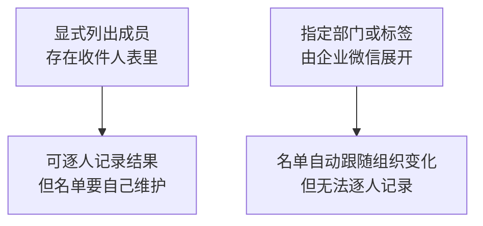

两种方式各有取舍：

| | 列出成员 | 指定部门 |
|---|---|---|
| 名单维护 | 要自己同步 | 企业微信自动 |
| 人员调动后 | 名单会过期 | 自动跟随 |
| 逐人记录结果 | 可以 | 做不到 |
| 分批控制 | 可以 | 由企业微信处理 |

**关键限制：按部门发送时，你拿不到具体的投递名单，也就无法逐人记录结果。**企业微信只会返回 `invalidparty`（无效的部门），不会告诉你部门里哪个人没收到。

## 表结构调整

任务表加两个字段：

```sql
ALTER TABLE MessageTask ADD
    ToParty NVARCHAR(200) NULL,     -- 部门 ID，竖线分隔
    ToTag   NVARCHAR(200) NULL;     -- 标签 ID，竖线分隔
```

## 代码

```python
def send_task(cursor, conn, task):
    """发送一条任务。支持成员、部门、标签三种收件人。"""
    # 情况一：指定了部门或标签，直接整体发送
    if task.ToParty or task.ToTag:
        return _send_by_group(cursor, conn, task)

    # 情况二：按收件人表逐人发送
    return _send_by_users(cursor, conn, task)


def _send_by_group(cursor, conn, task):
    """按部门或标签发送。无法逐人记录，只记整体结果。"""
    try:
        problems = wecom.send_text(
            task.Content,
            to_party=task.ToParty or "",
            to_tag=task.ToTag or "",
            safe=1 if task.Safe else 0)
    except Exception as ex:
        handle_task_failure(cursor, conn, task, ex)
        return

    # 部门或标签无效时会返回 invalidparty / invalidtag
    status = 4 if problems else 2
    errmsg = "；".join(problems) if problems else None

    cursor.execute("""
        UPDATE MessageTask
        SET Status = ?, ErrMsg = ?, SentAt = SYSDATETIME(),
            UpdatedAt = SYSDATETIME()
        WHERE Id = ?
    """, status, errmsg, task.Id)
    conn.commit()

    print(f"任务 {task.Id} 按部门/标签发送完成"
          f"{'，但有无效项：' + errmsg if problems else ''}")
```

## 使用示例

```sql
-- 给部门 2 和 3 发通知
INSERT INTO MessageTask (Content, ToParty)
VALUES (N'请各部门于周五前提交月报', N'2|3');
```

部门 ID 怎么查？第 6 章的员工查询页面会展示部门树。也可以先用第 2 章的方法调接口看。

## 一个实用建议

**重要通知建议展开成具体成员，而不是按部门发。**

理由是可追溯：领导问「张三到底收到没有」时，按部门发的方式无法回答。而展开成收件人表后，可以精确查到每个人的状态。

日常通知按部门发，省事且名单自动更新。

## V7 的问题

`@all` 可以发给所有可见成员，但这非常危险。

---

# V8：全员发送防护

## 目标

防止误发全公司。

## 原理：危险来自可见范围会变化

开发阶段应用可见范围只有你自己，`@all` 就是发给自己，很安全。

上线后可见范围改成真实部门，同一段代码的行为就完全变了：

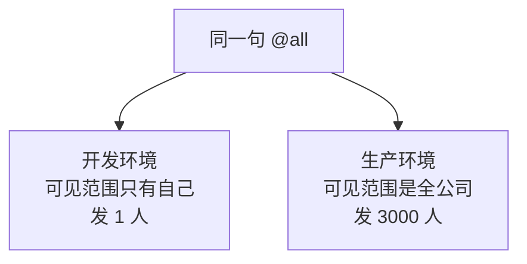

更麻烦的是：**这个变化发生在企业微信后台，不在你的代码里。**代码审查看不出问题，测试也测不出来。

而群发消息**无法撤回**。

## 三道防护

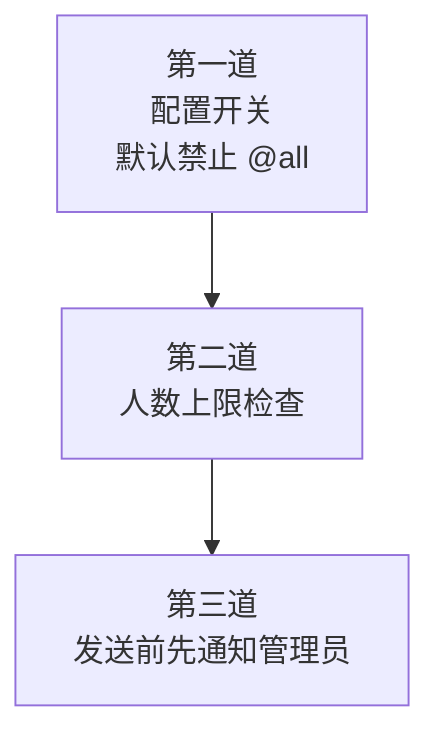

## 代码

`config.py` 增加：

```python
# 是否允许 @all 全员发送。生产环境务必谨慎开启
ALLOW_SEND_ALL = False

# 单条任务收件人上限，超过则拒绝，需人工确认
MAX_RECIPIENTS = 500

# 管理员 UserId，全员发送前会先通知他
ADMIN_USER_ID = "你的UserId"
```

```python
def check_send_safety(cursor, task, users=None):
    """发送前的安全检查。返回 (是否允许, 拒绝原因)。"""

    # 第一道：@all 开关
    if users and "@all" in users:
        if not config.ALLOW_SEND_ALL:
            return (False, "任务包含 @all，但配置中未允许全员发送")

    # 第二道：人数上限
    if users and len(users) > config.MAX_RECIPIENTS:
        return (False, f"收件人 {len(users)} 人，超过上限 "
                       f"{config.MAX_RECIPIENTS}，需人工确认")

    # 按部门发送时无法预知人数，单独提醒
    if task.ToParty and "1" in task.ToParty.split("|"):
        # 部门 1 通常是企业根部门，等同于全员
        if not config.ALLOW_SEND_ALL:
            return (False, "指定了根部门（等同全员），但未允许全员发送")

    return (True, None)


def notify_admin_before_mass_send(task, count):
    """全员或大批量发送前，先给管理员发一条提醒。"""
    try:
        wecom.send_markdown(
            f"**即将执行大批量发送**\n"
            f"> 任务 ID：{task.Id}\n"
            f"> 收件人数：{count}\n"
            f"> 内容摘要：{task.Content[:50]}\n\n"
            f'<font color="warning">如非预期请立即停止程序</font>',
            to_user=config.ADMIN_USER_ID)
    except Exception as ex:
        print(f"管理员提醒发送失败（不阻断主流程）：{ex}")
```

主流程接入：

```python
allowed, reason = check_send_safety(cursor, task, users)
if not allowed:
    cursor.execute("""
        UPDATE MessageTask
        SET Status = 3, ErrMsg = ?, UpdatedAt = SYSDATETIME()
        WHERE Id = ?
    """, reason, task.Id)
    conn.commit()
    print(f"任务 {task.Id} 被安全检查拒绝：{reason}")
    continue

if users and len(users) > 100:
    notify_admin_before_mass_send(task, len(users))
```

## 关于「根部门等同全员」

企业微信的部门 ID 1 通常是企业根部门，包含所有人。所以 `ToParty = '1'` 的效果和 `@all` 差不多，也要拦。

## 管理员提醒为什么不阻断主流程

```python
except Exception as ex:
    print(f"管理员提醒发送失败（不阻断主流程）：{ex}")
```

提醒是辅助功能。如果因为提醒发不出去就停掉整个群发，反而影响正常业务。

## V9 的问题

到现在为止，任务都是手工写 SQL 插入的。实际使用时不方便。

---

# V9：Excel 导入收件人

## 目标

从 Excel 批量创建任务。

## 原理：为什么用 Excel 而不是让用户写 SQL

实际工作中提需求的是行政、人事这些非技术岗。他们能熟练用 Excel，但不会写 SQL。

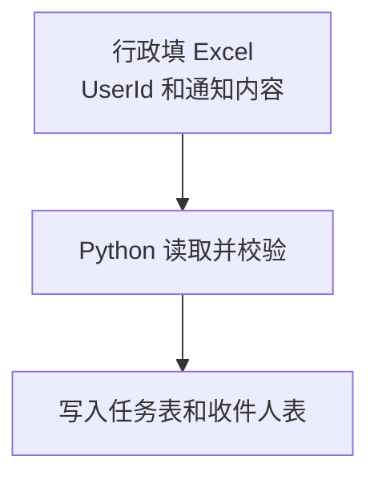

## 安装依赖

```bash
pip install openpyxl
```

## Excel 格式约定

第一行是表头，从第二行开始是数据：

| UserId | 内容 | 业务键 |
|---|---|---|
| zhangsan | 请提交月报 | monthly_202608_zhangsan |
| lisi | 请提交月报 | monthly_202608_lisi |

## 代码

```python
# -*- coding: utf-8 -*-
"""从 Excel 导入群发任务。"""

import openpyxl
import pyodbc
import config


def import_from_excel(cursor, conn, path, sheet_name=None):
    """读取 Excel 并创建任务。返回 (成功数, 跳过数, 错误列表)。"""
    wb = openpyxl.load_workbook(path, data_only=True)
    ws = wb[sheet_name] if sheet_name else wb.active

    ok, skipped, errors = 0, 0, []

    # min_row=2 跳过表头
    for row_no, row in enumerate(ws.iter_rows(min_row=2, values_only=True),
                                 start=2):
        # 跳过完全空行
        if not row or all(c is None or str(c).strip() == "" for c in row):
            continue

        user_id = str(row[0]).strip() if row[0] else ""
        content = str(row[1]).strip() if len(row) > 1 and row[1] else ""
        biz_key = str(row[2]).strip() if len(row) > 2 and row[2] else None

        # 逐项校验，错误定位到行号
        if not user_id:
            errors.append(f"第 {row_no} 行：UserId 为空")
            continue
        if not content:
            errors.append(f"第 {row_no} 行：内容为空")
            continue
        if len(content.encode("utf-8")) > 2000:
            errors.append(f"第 {row_no} 行：内容超过 2000 字节")
            continue

        try:
            cursor.execute("""
                INSERT INTO MessageTask (Content, BizKey) VALUES (?, ?);
                SELECT SCOPE_IDENTITY();
            """, content, biz_key)
            task_id = int(cursor.fetchone()[0])

            cursor.execute("""
                INSERT INTO MessageRecipient (TaskId, UserId) VALUES (?, ?)
            """, task_id, user_id)
            conn.commit()
            ok += 1

        except pyodbc.IntegrityError as ex:
            conn.rollback()
            if "UQ_Task_BizKey" in str(ex):
                skipped += 1        # 幂等键重复，说明已导入过
            else:
                errors.append(f"第 {row_no} 行：{ex}")

    return ok, skipped, errors


if __name__ == "__main__":
    conn = pyodbc.connect(config.CONN_STR)
    cursor = conn.cursor()

    ok, skipped, errors = import_from_excel(cursor, conn, "通知名单.xlsx")

    print(f"导入成功 {ok} 条，跳过重复 {skipped} 条")
    if errors:
        print(f"有 {len(errors)} 行有问题：")
        for e in errors[:20]:      # 只显示前 20 条，避免刷屏
            print(f"  {e}")

    conn.close()
```

## 三个实现细节

### `data_only=True`

Excel 里可能有公式。加这个参数读到的是**公式的计算结果**，而不是公式本身。

不加的话，一个 `=CONCAT(A1,B1)` 单元格读出来会是字符串 `"=CONCAT(A1,B1)"`。

### 错误要带行号

```python
errors.append(f"第 {row_no} 行：UserId 为空")
```

给非技术用户看的错误信息，**必须能定位到具体哪一行**。只说「有数据为空」，他们无法处理。

`start=2` 让行号和 Excel 里看到的行号一致。

### 幂等键让重复导入变安全

同一个文件导入两次，第二次全部撞上 `UQ_Task_BizKey`，被计入 `skipped`，不会重复发送。

这是第 3 章 V6 设计的直接价值：**用户可以放心地重复点导入。**

## 建议的业务键设计

```text
业务含义_时间周期_接收人
monthly_202608_zhangsan
```

这样同一个人同一个月只会收到一次月报提醒，无论文件被导入几次。

## V9 的问题

程序运行一次就退出，每次都要手工启动。

---

# V10：主循环与优雅退出

## 目标

让程序持续运行，并且能安全停止。

## 原理一：轮询间隔怎么定

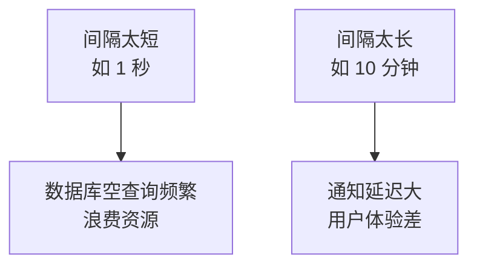

通知类场景建议 **10 到 30 秒**。有任务时立即处理下一批，没任务时才休眠。

## 原理二：为什么需要优雅退出

直接用 `Ctrl+C` 或任务管理器杀进程，会在任意时刻中断，可能正好卡在「已标记处理中但还没发送」的位置。

结果是任务卡死，要等 10 分钟才被回收。

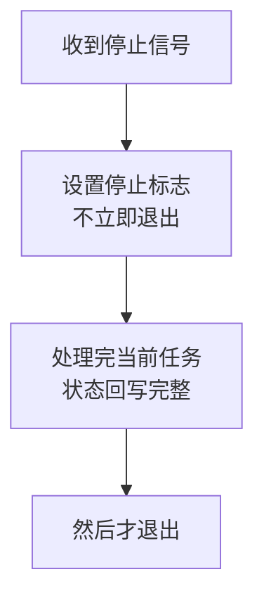

## 代码

```python
# -*- coding: utf-8 -*-
"""V10：主循环 + 优雅退出。"""

import signal
import time

# 全局停止标志
_should_stop = False


def _on_signal(signum, frame):
    """收到停止信号时只设标志，不立即退出。"""
    global _should_stop
    _should_stop = True
    print("\n收到停止信号，将在当前任务完成后退出...")


# 注册两种信号
signal.signal(signal.SIGINT, _on_signal)    # Ctrl+C
signal.signal(signal.SIGTERM, _on_signal)   # 系统终止请求


POLL_INTERVAL = 15      # 无任务时休眠秒数


def main_loop():
    conn = pyodbc.connect(config.CONN_STR)
    cursor = conn.cursor()

    print("群发程序已启动，按 Ctrl+C 安全停止")
    round_no = 0

    try:
        while not _should_stop:
            round_no += 1

            # 每 20 轮做一次卡死回收，不必每轮都做
            if round_no % 20 == 1:
                recover_stuck(cursor, conn)

            tasks = claim_tasks(cursor, conn)

            if not tasks:
                # 没任务才休眠。分段睡，便于及时响应停止信号
                for _ in range(POLL_INTERVAL):
                    if _should_stop:
                        break
                    time.sleep(1)
                continue

            for task in tasks:
                if _should_stop:
                    # 已领取但来不及处理的，退回待发送
                    cursor.execute("""
                        UPDATE MessageTask SET Status = 0
                        WHERE Id = ? AND Status = 1
                    """, task.Id)
                    conn.commit()
                    continue

                try:
                    send_task(cursor, conn, task)
                    update_task_status(cursor, conn, task.Id)
                except Exception as ex:
                    handle_task_failure(cursor, conn, task, ex)

    finally:
        conn.close()
        print("已安全退出")


if __name__ == "__main__":
    main_loop()
```

## 三个关键写法

### 分段休眠

```python
for _ in range(POLL_INTERVAL):
    if _should_stop:
        break
    time.sleep(1)
```

不写 `time.sleep(15)`。因为那样按下 `Ctrl+C` 后要等最多 15 秒才响应，感觉像卡住了。

分成 15 次 1 秒，最多 1 秒就能响应。

### 未处理的任务要退回

```python
if _should_stop:
    cursor.execute("UPDATE MessageTask SET Status = 0 WHERE Id = ? AND Status = 1", task.Id)
```

`claim_tasks` 一次领 10 条。如果处理到第 3 条时收到停止信号，剩下 7 条已经被标记为「处理中」。

**必须把它们退回 0**，否则要等 10 分钟回收。

条件里的 `AND Status = 1` 是保险：万一它已经被处理成其他状态，就不要动它。

### 回收不必每轮都做

```python
if round_no % 20 == 1:
    recover_stuck(cursor, conn)
```

回收是全表扫描，每 15 秒做一次浪费。每 20 轮（约 5 分钟）一次足够。

## V10 的问题

程序需要一直开着命令行窗口。关掉窗口程序就停了，服务器重启后也不会自动运行。

---

# V11：用任务计划程序定时执行

## 目标

无人值守运行。

## 原理：两种运行模式的选择

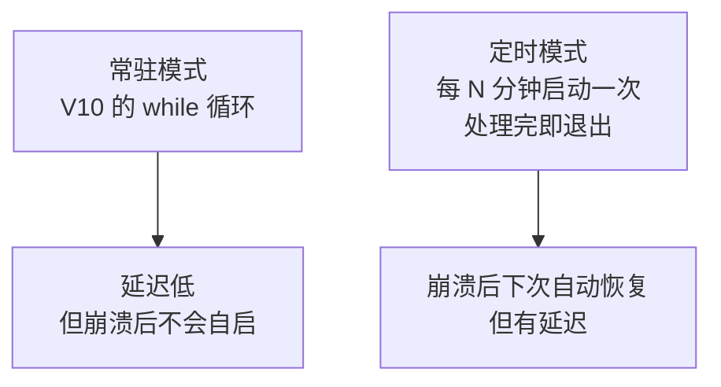

**本教程推荐定时模式**，理由是它自带故障恢复：程序崩了，下一次定时触发照样运行。常驻模式崩了就彻底停了，除非再配一个监控程序。

## 改造成单次执行

```python
def run_once():
    """执行一轮：回收 + 领取 + 发送，然后退出。"""
    conn = pyodbc.connect(config.CONN_STR)
    cursor = conn.cursor()

    try:
        recover_stuck(cursor, conn)

        total = 0
        # 一次运行里持续领取，直到没有任务
        while not _should_stop:
            tasks = claim_tasks(cursor, conn)
            if not tasks:
                break

            for task in tasks:
                try:
                    send_task(cursor, conn, task)
                    update_task_status(cursor, conn, task.Id)
                    total += 1
                except Exception as ex:
                    handle_task_failure(cursor, conn, task, ex)

        print(f"本轮处理 {total} 条任务")
    finally:
        conn.close()


if __name__ == "__main__":
    run_once()
```

## 配置任务计划程序

打开「任务计划程序」，创建基本任务：

| 项目 | 填什么 |
|---|---|
| 名称 | 企业微信群发 |
| 触发器 | 每 5 分钟重复一次，持续无限期 |
| 操作 | 启动程序 |
| 程序或脚本 | `C:\WeComTutorial\venv\Scripts\python.exe` |
| 添加参数 | `sender.py` |
| **起始于** | `C:\WeComTutorial` |

## 五个必踩的坑

这一节是本章最实用的部分，这些问题几乎人人会遇到。

### 坑 1：必须填「起始于」

**这是最常见的失败原因。**

「起始于」就是工作目录。不填的话，程序的工作目录是系统目录（通常 `C:\Windows\System32`），于是：

```text
ModuleNotFoundError: No module named 'config'
```

因为 `import config` 找的是**当前工作目录**下的 `config.py`，而那个目录里没有。

手工在命令行运行正常，任务计划里失败，十有八九是这个原因。

### 坑 2：要用虚拟环境里的 python.exe

```text
错误：python.exe
正确：C:\WeComTutorial\venv\Scripts\python.exe
```

用系统的 `python.exe` 会找不到 `requests`、`pyodbc` 这些装在虚拟环境里的包。

**不需要先激活虚拟环境**，直接指向虚拟环境里的解释器就等于激活了。

### 坑 3：中文输出可能报编码错误

任务计划程序运行时没有正常的控制台，`print` 中文可能触发：

```text
UnicodeEncodeError: 'gbk' codec can't encode character
```

两个解决办法：

在任务的环境里设置 `PYTHONIOENCODING=utf-8`，或者更稳妥的做法是**把输出写进日志文件而不是 print**：

```python
import logging

logging.basicConfig(
    filename="sender.log",
    encoding="utf-8",          # 明确指定编码
    level=logging.INFO,
    format="%(asctime)s [%(levelname)s] %(message)s",
)
```

写文件时明确指定 `encoding="utf-8"`，就绕开了控制台编码问题。

### 坑 4：必须禁止重叠运行

任务计划程序默认可能在上一次还没结束时又启动一个实例。

在任务属性的「设置」里选择：**「如果任务已经运行，则不启动新实例」**。

虽然第 3 章的原子领取已经能防止两个进程抢同一条任务，但同时跑多个实例仍然浪费资源，而且日志会交错难读。

### 坑 5：勾选「不管用户是否登录都要运行」的副作用

不勾选的话，你注销后任务就不运行了，服务器重启后也不会自动跑。

勾选后要注意两点：

| 影响 | 说明 |
|---|---|
| 需要保存密码 | 账号密码改了要回来更新任务 |
| 访问不到映射网络驱动器 | Excel 文件不要放在映射盘上，用 UNC 路径 |

如果用 `Trusted_Connection=yes` 连数据库，还要确认这个账号在 SQL Server 里有权限。

## 验证任务计划配置正确

不要靠猜。手工触发一次，然后检查：

1. 任务计划程序里的「上次运行结果」应该是 `0x0`
2. `sender.log` 里应该有新记录
3. 数据库里任务状态应该有变化

如果「上次运行结果」是 `0x1`，说明程序抛异常了，去看日志。

## V11 的问题

代码分散在多个文件的片段里，需要整理成完整可运行的程序。

---

# V12：集成版

## 完整代码

新建 `sender.py`，这是本章的最终成果：

```python
# -*- coding: utf-8 -*-
"""企业微信群发程序。

运行方式：
    python sender.py           单次执行，适合任务计划程序
    python sender.py --loop    常驻循环，适合调试

设计要点：
    1. 拉模式：业务系统只写任务表，本程序轮询发送
    2. 原子领取：UPDATE ... OUTPUT 防止多进程抢同一任务
    3. 先标记再发送：崩溃时宁可漏发也不重复发
    4. 差集推导：企业微信只返回失败者，成功者靠差集算出
    5. 错误分类：只重试有可能成功的失败，并逐次退避
    6. 卡死回收：阈值必须大于单任务最长耗时
"""

import re
import sys
import time
import signal
import logging

import pyodbc

import config
import wecom

# ===== 常量 =====
BATCH_SIZE = 900            # 企业微信 touser 上限约 1000，留余量
STUCK_MINUTES = 10          # 卡死判定阈值，必须大于单任务最长耗时
POLL_INTERVAL = 15          # 常驻模式下无任务时的休眠秒数
CLAIM_LIMIT = 10            # 每次领取的任务数

# 不可重试的错误码：需要人工改配置或改数据
NO_RETRY_CODES = {40001, 40013, 40014, 60011, 60020, 81013, 44004}

# 退避间隔，单位分钟
RETRY_DELAYS = [1, 5, 15]

# ===== 日志 =====
logging.basicConfig(
    level=logging.INFO,
    format="%(asctime)s [%(levelname)s] %(message)s",
    handlers=[
        logging.FileHandler("sender.log", encoding="utf-8"),
        logging.StreamHandler(),
    ],
)
log = logging.getLogger("sender")

# ===== 停止标志 =====
_should_stop = False


def _on_signal(signum, frame):
    global _should_stop
    _should_stop = True
    log.info("收到停止信号，将在当前任务完成后退出")


signal.signal(signal.SIGINT, _on_signal)
signal.signal(signal.SIGTERM, _on_signal)


# ---------- 任务领取与回收 ----------

def recover_stuck(cursor, conn):
    """回收卡死的任务和收件人。"""
    cursor.execute("""
        UPDATE MessageTask SET Status = 0, UpdatedAt = SYSDATETIME()
        WHERE Status = 1
          AND UpdatedAt < DATEADD(MINUTE, ?, SYSDATETIME())
    """, -STUCK_MINUTES)
    tasks = cursor.rowcount

    cursor.execute("""
        UPDATE r SET Status = 0
        FROM MessageRecipient r
        JOIN MessageTask t ON t.Id = r.TaskId
        WHERE r.Status = 1
          AND t.UpdatedAt < DATEADD(MINUTE, ?, SYSDATETIME())
    """, -STUCK_MINUTES)
    recipients = cursor.rowcount

    conn.commit()
    if tasks or recipients:
        log.warning(f"回收卡死：{tasks} 条任务，{recipients} 个收件人")


def claim_tasks(cursor, conn, limit=CLAIM_LIMIT):
    """原子领取任务。UPDATE 与 OUTPUT 同语句，杜绝并发抢占。"""
    cursor.execute(f"""
        UPDATE TOP ({limit}) MessageTask
        SET Status = 1, UpdatedAt = SYSDATETIME()
        OUTPUT inserted.Id, inserted.Content, inserted.MsgType,
               inserted.Safe, inserted.RetryCount, inserted.MaxRetry,
               inserted.ToParty, inserted.ToTag
        WHERE Status = 0
          AND RetryCount < MaxRetry
          AND (NextRetryAt IS NULL OR NextRetryAt <= SYSDATETIME())
    """)
    tasks = cursor.fetchall()
    conn.commit()
    return tasks


# ---------- 安全检查 ----------

def check_send_safety(task, users=None):
    """发送前安全检查，返回 (是否允许, 拒绝原因)。"""
    if users and "@all" in users:
        if not getattr(config, "ALLOW_SEND_ALL", False):
            return (False, "包含 @all 但配置未允许全员发送")

    if users and len(users) > getattr(config, "MAX_RECIPIENTS", 500):
        return (False, f"收件人 {len(users)} 人超过上限，需人工确认")

    if task.ToParty and "1" in str(task.ToParty).split("|"):
        if not getattr(config, "ALLOW_SEND_ALL", False):
            return (False, "指定根部门等同全员，但未允许全员发送")

    return (True, None)


def notify_admin(task, count):
    """大批量发送前提醒管理员。失败不阻断主流程。"""
    try:
        wecom.send_markdown(
            f"**即将执行大批量发送**\n"
            f"> 任务 ID：{task.Id}\n"
            f"> 收件人数：{count}\n"
            f"> 内容摘要：{task.Content[:50]}\n\n"
            f'<font color="warning">如非预期请立即停止程序</font>',
            to_user=config.ADMIN_USER_ID)
    except Exception as ex:
        log.warning(f"管理员提醒失败（不阻断）：{ex}")


# ---------- 结果回写 ----------

def _mark_recipients(cursor, conn, task_id, users, status,
                     errcode=None, errmsg=None):
    """批量回写一组收件人状态。"""
    if not users:
        return
    placeholders = ",".join("?" * len(users))
    cursor.execute(f"""
        UPDATE MessageRecipient
        SET Status = ?, ErrCode = ?, ErrMsg = ?,
            SentAt = CASE WHEN ? = 2 THEN SYSDATETIME() ELSE SentAt END
        WHERE TaskId = ? AND UserId IN ({placeholders})
    """, status, errcode, (errmsg or None) and errmsg[:500],
        status, task_id, *users)
    conn.commit()


def _parse_invalid(problems):
    """从 wecom 返回的问题列表中提取无效成员集合。"""
    failed = set()
    for p in problems:
        if p.startswith("无效成员："):
            failed.update(u for u in p.split("：", 1)[1].split("|") if u)
    return failed


def update_task_status(cursor, conn, task_id):
    """由收件人状态汇总任务状态。"""
    cursor.execute("""
        SELECT SUM(CASE WHEN Status IN (0,1) THEN 1 ELSE 0 END) AS Pending,
               SUM(CASE WHEN Status = 2 THEN 1 ELSE 0 END) AS Ok,
               SUM(CASE WHEN Status = 3 THEN 1 ELSE 0 END) AS Failed
        FROM MessageRecipient WHERE TaskId = ?
    """, task_id)
    row = cursor.fetchone()

    if row.Pending and row.Pending > 0:
        status = 1
    elif not row.Failed:
        status = 2
    elif not row.Ok:
        status = 3
    else:
        status = 4

    cursor.execute("""
        UPDATE MessageTask
        SET Status = ?, UpdatedAt = SYSDATETIME(),
            SentAt = CASE WHEN ? IN (2,4) AND SentAt IS NULL
                          THEN SYSDATETIME() ELSE SentAt END
        WHERE Id = ?
    """, status, status, task_id)
    conn.commit()
    return status


# ---------- 失败处理 ----------

def extract_errcode(exception):
    """从异常文本中提取企业微信错误码。"""
    m = re.search(r"errcode=(\d+)", str(exception))
    return int(m.group(1)) if m else None


def handle_task_failure(cursor, conn, task, exception):
    """判断是否重试，并安排退避时间。"""
    errcode = extract_errcode(exception)
    retry = task.RetryCount + 1
    can_retry = (errcode not in NO_RETRY_CODES) and (retry < task.MaxRetry)

    if can_retry:
        delay = RETRY_DELAYS[min(retry - 1, len(RETRY_DELAYS) - 1)]
        cursor.execute("""
            UPDATE MessageTask
            SET Status = 0, RetryCount = ?, ErrCode = ?, ErrMsg = ?,
                NextRetryAt = DATEADD(MINUTE, ?, SYSDATETIME()),
                UpdatedAt = SYSDATETIME()
            WHERE Id = ?
        """, retry, errcode, str(exception)[:500], delay, task.Id)
        log.warning(f"任务 {task.Id} 第 {retry} 次失败，{delay} 分钟后重试")
    else:
        cursor.execute("""
            UPDATE MessageTask
            SET Status = 3, RetryCount = ?, ErrCode = ?, ErrMsg = ?,
                UpdatedAt = SYSDATETIME()
            WHERE Id = ?
        """, retry, errcode, str(exception)[:500], task.Id)
        reason = "错误码不可重试" if errcode in NO_RETRY_CODES else "已达重试上限"
        log.error(f"任务 {task.Id} 终止：{reason}（errcode={errcode}）")

    conn.commit()


# ---------- 发送 ----------

def _send_by_group(cursor, conn, task):
    """按部门或标签发送。无法逐人记录结果。"""
    problems = wecom.send_text(
        task.Content,
        to_party=task.ToParty or "",
        to_tag=task.ToTag or "",
        safe=1 if task.Safe else 0)

    status = 4 if problems else 2
    cursor.execute("""
        UPDATE MessageTask
        SET Status = ?, ErrMsg = ?, UpdatedAt = SYSDATETIME(),
            SentAt = CASE WHEN SentAt IS NULL THEN SYSDATETIME() ELSE SentAt END
        WHERE Id = ?
    """, status, "；".join(problems) if problems else None, task.Id)
    conn.commit()
    log.info(f"任务 {task.Id} 按部门/标签发送完成")


def _send_by_users(cursor, conn, task):
    """按收件人表发送，逐人回写结果。"""
    cursor.execute("""
        SELECT UserId FROM MessageRecipient
        WHERE TaskId = ? AND Status = 0
    """, task.Id)
    users = [r.UserId for r in cursor.fetchall()]

    if not users:
        log.info(f"任务 {task.Id} 无待发送收件人")
        update_task_status(cursor, conn, task.Id)
        return

    allowed, reason = check_send_safety(task, users)
    if not allowed:
        cursor.execute("""
            UPDATE MessageTask SET Status = 3, ErrMsg = ?,
                   UpdatedAt = SYSDATETIME() WHERE Id = ?
        """, reason, task.Id)
        conn.commit()
        log.error(f"任务 {task.Id} 被安全检查拒绝：{reason}")
        return

    if len(users) > 100:
        notify_admin(task, len(users))

    total_batches = (len(users) + BATCH_SIZE - 1) // BATCH_SIZE
    log.info(f"任务 {task.Id}：{len(users)} 人，分 {total_batches} 批")

    for i in range(0, len(users), BATCH_SIZE):
        batch = users[i:i + BATCH_SIZE]
        batch_no = i // BATCH_SIZE + 1

        # 先标记再发送，并立即提交
        _mark_recipients(cursor, conn, task.Id, batch, 1)

        try:
            problems = wecom.send_text(task.Content, to_user="|".join(batch),
                                       safe=1 if task.Safe else 0)
        except Exception as ex:
            _mark_recipients(cursor, conn, task.Id, batch, 3,
                             extract_errcode(ex), str(ex))
            log.error(f"任务 {task.Id} 第 {batch_no}/{total_batches} 批失败：{ex}")
            continue

        # 差集：企业微信只返回失败者
        failed = _parse_invalid(problems)
        succeeded = [u for u in batch if u not in failed]

        _mark_recipients(cursor, conn, task.Id, succeeded, 2)
        _mark_recipients(cursor, conn, task.Id, list(failed), 3,
                         errmsg="不在可见范围或UserId无效")

        log.info(f"任务 {task.Id} 第 {batch_no}/{total_batches} 批："
                 f"成功 {len(succeeded)}，失败 {len(failed)}")

    update_task_status(cursor, conn, task.Id)


def send_task(cursor, conn, task):
    """发送一条任务。"""
    if task.ToParty or task.ToTag:
        _send_by_group(cursor, conn, task)
    else:
        _send_by_users(cursor, conn, task)


# ---------- 主流程 ----------

def process_batch(cursor, conn):
    """领取并处理一批任务。返回处理条数。"""
    tasks = claim_tasks(cursor, conn)
    if not tasks:
        return 0

    count = 0
    for task in tasks:
        if _should_stop:
            # 已领取但来不及处理的退回待发送，避免卡死等待回收
            cursor.execute("""
                UPDATE MessageTask SET Status = 0
                WHERE Id = ? AND Status = 1
            """, task.Id)
            conn.commit()
            continue

        try:
            send_task(cursor, conn, task)
            count += 1
        except Exception as ex:
            handle_task_failure(cursor, conn, task, ex)

    return count


def run_once():
    """单次执行：适合任务计划程序调用。"""
    conn = pyodbc.connect(config.CONN_STR)
    cursor = conn.cursor()
    try:
        recover_stuck(cursor, conn)
        total = 0
        while not _should_stop:
            n = process_batch(cursor, conn)
            if n == 0:
                break
            total += n
        log.info(f"本轮处理 {total} 条任务")
    finally:
        conn.close()


def run_loop():
    """常驻循环：适合调试观察。"""
    conn = pyodbc.connect(config.CONN_STR)
    cursor = conn.cursor()
    log.info("常驻模式启动，按 Ctrl+C 安全停止")
    round_no = 0
    try:
        while not _should_stop:
            round_no += 1
            if round_no % 20 == 1:
                recover_stuck(cursor, conn)

            if process_batch(cursor, conn) == 0:
                # 分段休眠，便于及时响应停止信号
                for _ in range(POLL_INTERVAL):
                    if _should_stop:
                        break
                    time.sleep(1)
    finally:
        conn.close()
        log.info("已安全退出")


if __name__ == "__main__":
    if "--loop" in sys.argv:
        run_loop()
    else:
        run_once()
```

## `config.py` 需要补充的项

```python
# 数据库连接
CONN_STR = (
    "DRIVER={ODBC Driver 17 for SQL Server};"
    "SERVER=localhost;DATABASE=WeComTutorial;"
    "Trusted_Connection=yes;"
)

# 群发安全
ALLOW_SEND_ALL = False       # 是否允许 @all
MAX_RECIPIENTS = 500         # 单任务收件人上限
ADMIN_USER_ID = "你的UserId"  # 大批量发送前提醒谁
```

---

# 本章自测

| 测试 | 做法 | 期望结果 |
|---|---|---|
| 1 基本发送 | 插一条任务，运行 | 收到消息，任务状态变 2 |
| 2 差集推导 | 收件人含一个不存在的 UserId | 该人状态 3，自己状态 2，任务状态 4 |
| 3 并发安全 | 同时开两个程序 | 无收件人被处理两次 |
| 4 分批 | 造 1000 个收件人 | 日志显示分 2 批 |
| 5 不可重试 | 把 `AGENT_ID` 改错 | 任务直接置 3，不反复重试 |
| 6 退避 | 断网后运行 | `NextRetryAt` 被设为几分钟后 |
| 7 重试只发失败者 | 部分失败后重跑 | 已成功的人不再收到 |
| 8 卡死回收 | 手工设 `Status=1` 且时间为一小时前 | 被退回 0 |
| 9 优雅退出 | 处理中按 Ctrl+C | 提示等待，退出后无任务卡在 1 |
| 10 `@all` 防护 | 收件人写 `@all` | 被拒绝，原因写入 `ErrMsg` |
| 11 Excel 重复导入 | 同一文件导两次 | 第二次全部跳过 |
| 12 任务计划 | 手工触发一次 | 上次运行结果 `0x0`，日志有记录 |

第 7 项最能体现设计价值：**重试时已成功的人不会被重复打扰**，因为查询条件是 `Status = 0`。

# 错误排查

| 现象 | 原因 | 解决 |
|---|---|---|
| 任务一直是 0 | `NextRetryAt` 还没到 | 查该字段值 |
| 任务一直是 0 | `RetryCount >= MaxRetry` | 已放弃，查 `ErrMsg` |
| 任务卡在 1 | 程序崩溃 | 等回收，或手工改回 0 |
| 收件人全是 3 | 可见范围不含这些人 | 后台调整可见范围 |
| 任务计划报 `0x1` | 程序抛异常 | 看 `sender.log` |
| `No module named config` | 未填「起始于」 | 设为项目目录 |
| `No module named requests` | 用了系统 python | 指向虚拟环境的 python.exe |
| `UnicodeEncodeError` | 控制台编码 | 写日志文件并指定 utf-8 |
| 员工收到两条 | 回收后重发 | 见第 3 章的风险说明 |

# 完成标准

## 理解部分

- [ ] 为什么用拉模式而不是让业务系统直接调接口
- [ ] 为什么分批用 900 而不是 1000
- [ ] 成功的收件人为什么要用差集算出来
- [ ] 哪些错误重试有意义，判断标准是什么
- [ ] 卡死回收的阈值为什么必须大于单任务最长耗时
- [ ] 为什么重试不会打扰已经收到消息的人
- [ ] 为什么 `@all` 在开发环境安全、生产环境危险

## 操作部分

- [ ] 12 项自测全部通过
- [ ] 任务计划程序配置完成，能无人值守运行
- [ ] `sender.log` 有正常记录且中文不乱码
- [ ] Excel 导入可用

# 下一章

第 5 章讲素材上传：发送图片和文件需要先把文件上传到企业微信换取 `media_id`，这是一个独立机制，有自己的有效期规则和坑。
