# 第 5 章：素材上传与发送图片文件

## 本章目标

学会发送图片和文件。这件事比发文本复杂，因为**不能把文件直接塞进消息里**，必须先上传换取一个凭据。

本章还要处理一个中文环境特有的坑：中文文件名会导致乱码。

## 前置条件

- 第 2 章完成，`wecom.py` 可用
- 第 4 章完成（V10 集成时需要）
- 准备一张测试图片和一个测试文件

## 版本地图

| 版本 | 主题 | 解决上一版什么问题 |
|---|---|---|
| V1 | 上传一张图片 | —— |
| V2 | 检查上传结果 | 失败了看不出来 |
| V3 | 把图片发出去 | 上传了但没用上 |
| V4 | 中文文件名乱码 | 员工收到的文件名是乱码 |
| V5 | 上传前自查 | 超限文件浪费一次往返 |
| V6 | 发送文件 | 只能发图片 |
| V7 | 有效期与缓存表 | 每次都重新上传 |
| V8 | 过期检测与自动重传 | 用了过期的凭据 |
| V9 | 大文件超时与重试 | 大文件必然超时 |
| V10 | 接入群发程序 | 群发只能发文本 |
| V11 | 集成版 | 代码零散 |

---

# V1：上传一张图片

## 目标

把本地图片上传到企业微信，拿到一个叫 `media_id` 的东西。

## 代码

```python
# -*- coding: utf-8 -*-
"""V1：上传一张图片。"""

import requests
import config
import wecom

token = wecom.get_token()

url = f"{config.BASE_URL}/media/upload"

with open("test.jpg", "rb") as f:
    # files 参数会让 requests 使用 multipart/form-data 格式
    files = {"media": ("test.jpg", f, "image/jpeg")}
    r = requests.post(url, params={"access_token": token, "type": "image"},
                      files=files, timeout=30)

print(r.json())
```

成功时返回：

```json
{
  "errcode": 0,
  "errmsg": "ok",
  "type": "image",
  "media_id": "3d4Vk8x...很长一串...",
  "created_at": "1756345678"
}
```

## 原理一：为什么必须分两步

直觉上应该可以「一步发送图片」，但企业微信要求先上传、再发送。原因有三个。

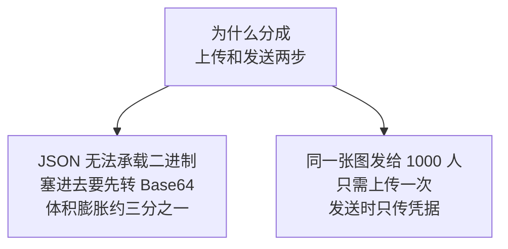

第三个原因是**分批发送时的一致性**。第 4 章讲过 3000 人要分 4 批发。如果每批都带着图片数据，等于同一张图传 4 遍。而先上传后，4 批共用同一个 `media_id`。

## 原理二：`media_id` 是什么

它不是文件内容，也不是下载地址。它是**企业微信服务器上那个文件的一个引用**。

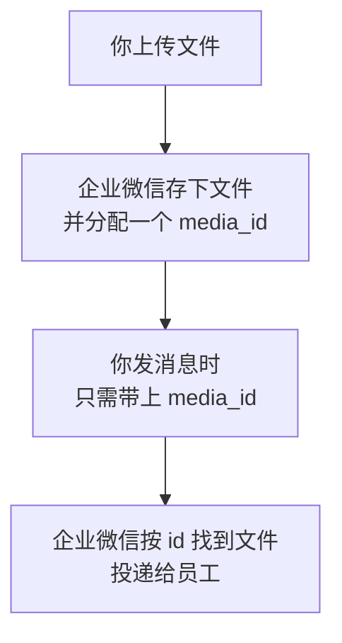

这和第 1 章讲的 `access_token` 是同一种设计：**一个短字符串代表服务端的某个资源**。你无法从 `media_id` 反推出文件内容，它只是一把「查表的钥匙」。

## 原理三：为什么这里用 `files` 而不是 `json`

第 2 章发文本用的是 `json=payload`。这里必须换成 `files=`。

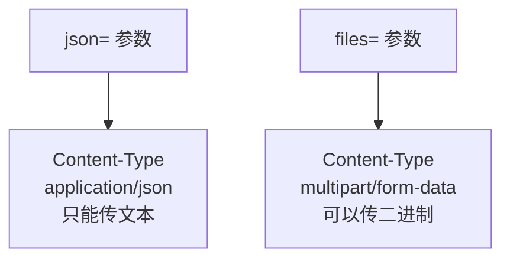

`multipart/form-data` 是专为文件上传设计的格式：它把请求体分成若干段，每段有自己的头部和内容，二进制数据原样放在段里不需要转换。

## `files` 那一行的三个元素

```python
files = {"media": ("test.jpg", f, "image/jpeg")}
```

| 位置 | 值 | 作用 |
|---|---|---|
| 字典的键 | `"media"` | **必须是 `media`**，企业微信规定的字段名 |
| 元组第 1 项 | `"test.jpg"` | 文件名，会带扩展名一起提交 |
| 元组第 2 项 | `f` | 打开的文件对象 |
| 元组第 3 项 | `"image/jpeg"` | 内容类型 |

企业微信要求表单里包含文件名、长度和内容类型（参见[微信素材上传接口说明](https://developers.weixin.qq.com/doc/service/en/api/material/temporary/api_uploadtempmedia)。内容已改写以符合授权要求）。用 `requests` 的这种写法，长度会被自动算出来。

## `type` 参数的四种值

| type | 用途 |
|---|---|
| `image` | 图片 |
| `voice` | 语音 |
| `video` | 视频 |
| `file` | 普通文件 |

**同一个文件用不同 `type` 上传，会得到不同的 `media_id`。**这一点在 V7 设计缓存时很关键。

## V1 的问题

如果上传失败，`print` 出来的是一段 JSON，程序不会报错，你可能没注意就往下走了。

---

# V2：检查上传结果

## 目标

上传失败时明确报错。

## 代码

```python
def upload_media(file_path, media_type="image"):
    """上传素材，返回 media_id。"""
    import os

    token = wecom.get_token()
    url = f"{config.BASE_URL}/media/upload"
    filename = os.path.basename(file_path)

    with open(file_path, "rb") as f:
        files = {"media": (filename, f, "application/octet-stream")}
        try:
            r = requests.post(url,
                              params={"access_token": token, "type": media_type},
                              files=files, timeout=30)
            r.raise_for_status()
            result = r.json()
        except requests.exceptions.Timeout:
            raise RuntimeError("上传超时。大文件请调大 timeout")
        except requests.exceptions.RequestException as ex:
            raise RuntimeError(f"上传请求失败：{ex}")

    if result.get("errcode") != 0:
        raise RuntimeError(f"上传失败：{wecom.describe_error(result)}")

    return result["media_id"]
```

## 上传特有的错误码

第 2 章的 `describe_error` 里没有这些，需要补进去：

| 错误码 | 含义 | 常见原因 |
|---|---|---|
| 41005 | 缺少媒体文件数据 | 表单字段名不是 `media`，或文件是空的 |
| 40005 | 文件类型不合法 | 扩展名与 `type` 不匹配 |
| 40006 | 文件大小超限 | 见 V5 |
| 40007 | `media_id` 不合法 | 过期了，见 V8 |
| 301019 | 文件类型不支持 | 例如上传 exe 之类 |

把它们加进 `wecom.py` 的 `hints` 字典：

```python
hints = {
    # ... 原有的 ...
    40005: "文件类型不合法，检查扩展名与 type 参数是否匹配",
    40006: "文件大小超过限制",
    40007: "media_id 不合法或已过期（临时素材仅 3 天有效）",
    41005: "缺少媒体文件数据，检查表单字段名是否为 media、文件是否为空",
    301019: "文件类型不受支持",
}
```

## `41005` 是最常见的一个

三个原因，按可能性排序：

1. **表单字段名写错了**，比如写成 `file` 而不是 `media`
2. **文件是空的**。企业微信要求文件不能为空
3. **文件对象已经被读完了**。比如在 `with` 块外面用 `f`，或者上一次读取后没有重置指针

## V2 的问题

拿到 `media_id` 了，但还没用它发过消息。

---

# V3：把图片发出去

## 目标

打通「上传到发送」的完整链路。

## 原理：图片消息的结构

第 2 章讲过规则：`msgtype` 决定服务端读哪个同名对象。图片消息也遵循这个规则，只是里面放的不是 `content` 而是 `media_id`：

```python
{
    "touser": "zhangsan",
    "msgtype": "image",
    "agentid": 1000002,
    "image": {"media_id": "3d4Vk8x..."}    # 没有 content 字段
}
```

对比一下三种消息类型：

| msgtype | 嵌套对象里放什么 |
|---|---|
| `text` | `content`：文字内容 |
| `image` | `media_id`：图片凭据 |
| `file` | `media_id`：文件凭据 |

这印证了第 2 章讲的设计原因：**不同类型需要的字段完全不同，所以要各自嵌套。**

## 代码

在 `wecom.py` 里加两个函数：

```python
def send_image(media_id, **kwargs):
    """发送图片消息。media_id 由 upload_media 取得。"""
    return send_message("image", {"media_id": media_id}, **kwargs)


def send_file(media_id, **kwargs):
    """发送文件消息。"""
    return send_message("file", {"media_id": media_id}, **kwargs)
```

因为第 2 章的 `send_message` 已经用 `msgtype` 作对象名，这里只要传对参数就行。

## 完整流程

```python
media_id = upload_media("test.jpg", "image")
print(f"上传成功：{media_id}")

wecom.send_image(media_id, to_user=config.TEST_USER_ID)
print("已发送")
```

## 验证

手机应该收到一张图片。

## V3 的问题

试试用中文文件名，比如把文件改名成「月度报表.jpg」再上传发送。

---

# V4：中文文件名乱码

## 现象

用中文文件名上传后，员工在企业微信里看到的文件名是乱码，形如：

```text
%E6%9C%88%E5%BA%A6%E6%8A%A5%E8%A1%A8.jpg
```

或者更糟，出现 `%BC%` 这样看起来被编码了两次的内容。

## 原理：`requests` 的编码方式与企业微信不匹配

问题出在 `multipart/form-data` 里文件名的表示方式上。

当文件名含非 ASCII 字符时，`requests` 底层会按 RFC 2231 标准把它编码成 `filename*=utf-8''...` 这种形式：

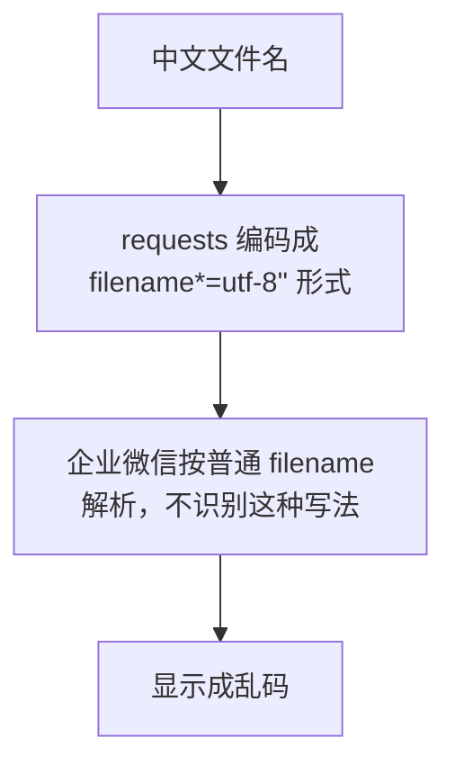

这不是你的代码写错了，而是**两边对同一个标准的支持程度不同**。有开发者验证过，改用能生成更规范表单的库可以解决（参见[企业微信上传素材中文名乱码的处理](https://developers.weixin.qq.com/community/personal/oCJUswyIQ4Fcqfp4t-06yssAxEqE/answer)、[requests 上传中文附件名的问题](https://www.cnblogs.com/yangyangchunchun/p/9351966.html)。内容已改写以符合授权要求）。

## 两种解决方案，按场景选

关键判断是：**员工会不会看到这个文件名。**

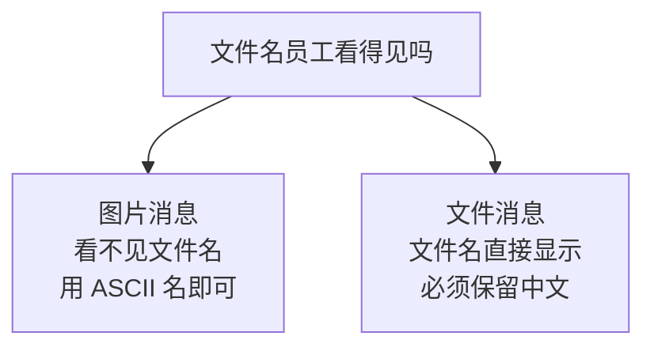

### 方案一：图片用安全文件名

图片消息在手机上直接显示图像，文件名根本不出现。所以简单换掉就行：

```python
import os
import uuid


def safe_filename(file_path):
    """生成纯 ASCII 的安全文件名，保留原扩展名。"""
    ext = os.path.splitext(file_path)[1].lower()
    return f"{uuid.uuid4().hex[:16]}{ext}"
```

上传时用它：

```python
files = {"media": (safe_filename(file_path), f, "application/octet-stream")}
```

### 方案二：文件用 `requests_toolbelt` 保留中文名

文件消息会把文件名显示给员工，「月度报表.xlsx」不能变成一串乱码。

```bash
pip install requests_toolbelt
```

```python
from requests_toolbelt.multipart.encoder import MultipartEncoder


def upload_media_cn(file_path, media_type="file"):
    """上传素材，正确处理中文文件名。"""
    import os

    token = wecom.get_token()
    filename = os.path.basename(file_path)

    with open(file_path, "rb") as f:
        # MultipartEncoder 生成的表单更规范，中文文件名不会被二次编码
        encoder = MultipartEncoder(
            fields={"media": (filename, f, "application/octet-stream")}
        )
        r = requests.post(
            f"{config.BASE_URL}/media/upload",
            params={"access_token": token, "type": media_type},
            data=encoder,                                  # 注意用 data 不是 files
            headers={"Content-Type": encoder.content_type},  # 必须手工带上
            timeout=60,
        )

    result = r.json()
    if result.get("errcode") != 0:
        raise RuntimeError(f"上传失败：{wecom.describe_error(result)}")
    return result["media_id"]
```

## 方案二的两个易错点

### `data=` 而不是 `files=`

`MultipartEncoder` 已经把整个表单编码好了，是一个流对象。这时它属于请求体数据，要用 `data=` 传。

如果还写 `files=`，`requests` 会再包一层，格式就错了。

### 必须手工设置 `Content-Type`

```python
headers={"Content-Type": encoder.content_type}
```

用 `files=` 时 `requests` 会自动设置这个头，包括其中的分隔符。改用 `data=` 后就得自己设，而分隔符只有 `encoder` 知道，所以必须从它那里取。

漏掉这一行会得到 41005。

## 一个更稳妥的做法

如果你不想引入额外的库，还有第三条路：**上传时用 ASCII 文件名，把中文名存到数据库**，需要展示时从数据库取。

代价是员工在企业微信里看到的文件名不是中文。适合内部对接场景，不适合直接发给员工的正式文件。

## V4 的问题

上传一个 50MB 的文件，会白等很久然后失败。

---

# V5：上传前自查

## 目标

超限的文件在本地就拦下来，不浪费一次网络往返。

## 各类型的限制

| type | 支持格式 | 大小上限 | 其他限制 |
|---|---|---|---|
| `image` | JPG、PNG | 10 MB | —— |
| `voice` | AMR | 2 MB | 播放时长不超过 60 秒 |
| `video` | MP4 | 10 MB | —— |
| `file` | 不限 | 20 MB | 部分类型不被支持 |

所有类型都要求**文件不能为空**。

## 一个必须注意的混淆

搜索资料时你会看到「图片 2MB」这个数字。**那是微信公众号的限制，不是企业微信的。**

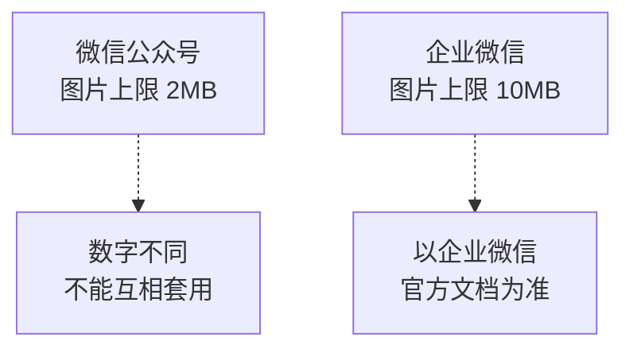

两个平台的接口长得很像，但限制、错误码、`access_token` 行为都有差异。**遇到不确定的数字，去企业微信官方文档确认，不要拿公众号的资料套。**

第 1 章讲过一个类似的例子：公众号重复获取 token 会让旧的失效，企业微信不会。

## 代码

```python
import os

# 各类型限制：(允许的扩展名, 大小上限字节)
MEDIA_LIMITS = {
    "image": ({".jpg", ".jpeg", ".png"}, 10 * 1024 * 1024),
    "voice": ({".amr"}, 2 * 1024 * 1024),
    "video": ({".mp4"}, 10 * 1024 * 1024),
    "file":  (None, 20 * 1024 * 1024),      # None 表示不限扩展名
}


def check_media(file_path, media_type):
    """上传前自查。不通过则抛异常。"""
    if not os.path.isfile(file_path):
        raise ValueError(f"文件不存在：{file_path}")

    if media_type not in MEDIA_LIMITS:
        raise ValueError(f"不支持的 type：{media_type}")

    allowed_ext, max_size = MEDIA_LIMITS[media_type]

    size = os.path.getsize(file_path)
    if size == 0:
        raise ValueError("文件为空，企业微信不接受空文件")
    if size > max_size:
        raise ValueError(
            f"文件 {size / 1024 / 1024:.1f} MB，"
            f"超过 {media_type} 类型上限 {max_size / 1024 / 1024:.0f} MB")

    if allowed_ext:
        ext = os.path.splitext(file_path)[1].lower()
        if ext not in allowed_ext:
            raise ValueError(
                f"扩展名 {ext} 不在 {media_type} 允许范围 {allowed_ext} 内")
```

## 顺便解决 Content-Type

前面几版一直用 `application/octet-stream`，这是「不确定类型」的通用值。可以按扩展名给出更准确的值：

```python
CONTENT_TYPES = {
    ".jpg": "image/jpeg", ".jpeg": "image/jpeg",
    ".png": "image/png",
    ".amr": "audio/amr",
    ".mp4": "video/mp4",
    ".pdf": "application/pdf",
    ".xlsx": "application/vnd.openxmlformats-officedocument.spreadsheetml.sheet",
    ".docx": "application/vnd.openxmlformats-officedocument.wordprocessingml.document",
}


def guess_content_type(file_path):
    ext = os.path.splitext(file_path)[1].lower()
    return CONTENT_TYPES.get(ext, "application/octet-stream")
```

## 为什么本地自查值得做

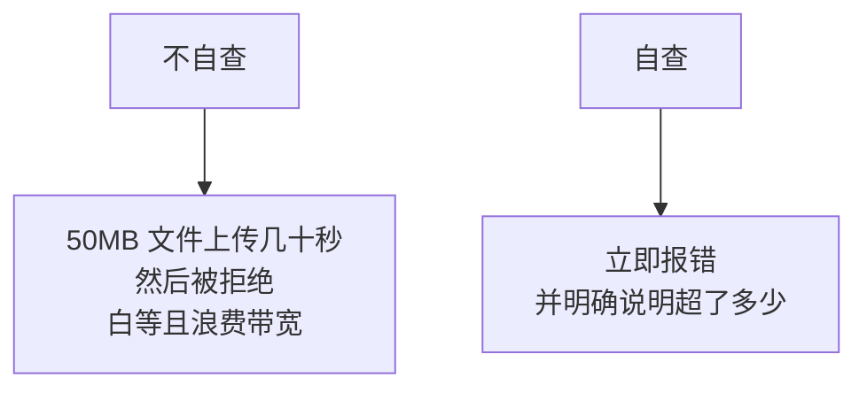

尤其在 V10 接入群发程序后，这个检查能在建任务时就发现问题，而不是等到定时任务运行时才失败。

## V5 的问题

只测过图片，文件类型还没试。

---

# V6：发送文件

## 目标

发送 Excel、PDF 这类普通文件。

## 与图片的三个差异

| | 图片 | 文件 |
|---|---|---|
| `type` 参数 | `image` | `file` |
| `msgtype` | `image` | `file` |
| 员工看到什么 | 直接显示图像 | 文件名 + 下载按钮 |
| 文件名重要吗 | 不重要 | **很重要** |

第三行决定了 V4 的方案选择：**文件类型必须保留中文文件名。**

## 代码

```python
def upload_and_send_file(file_path, to_user):
    """上传并发送文件，保留中文文件名。"""
    check_media(file_path, "file")
    media_id = upload_media_cn(file_path, "file")     # 用保留中文名的版本
    return wecom.send_file(media_id, to_user=to_user)
```

## 验证

准备一个中文名的 Excel，比如「8月报表.xlsx」：

```python
upload_and_send_file("8月报表.xlsx", config.TEST_USER_ID)
```

期望：手机上显示的文件名是「8月报表.xlsx」，不是乱码。

如果还是乱码，检查 V4 方案二的两个易错点：是否用了 `data=`、是否手工设置了 `Content-Type`。

## 一个实际建议

发文件时**同时发一条文本说明**，效果更好：

```python
media_id = upload_media_cn("8月报表.xlsx", "file")
wecom.send_text("8 月经营报表已生成，请查收附件。", to_user=uid)
wecom.send_file(media_id, to_user=uid)
```

因为文件消息本身只显示文件名，没有上下文。员工收到一个孤零零的文件，不知道是什么、要做什么。

## V6 的问题

每次发送都重新上传一次。同一张图发给三个部门，上传了三次。

---

# V7：有效期与缓存表

## 目标

同一个文件只上传一次，重复使用它的 `media_id`。

## 原理一：`media_id` 只有 3 天有效期

这是**临时素材**的核心特性：媒体文件在企业微信服务器上保存 3 天，之后 `media_id` 失效（参见[企业微信素材管理实践](https://cloud.tencent.com/developer/article/1182314)、[临时素材有效期说明](https://www.cnblogs.com/zc1234/p/7553303.html)。内容已改写以符合授权要求）。

在 3 天内，同一个 `media_id` 可以反复使用，发送任意多次。

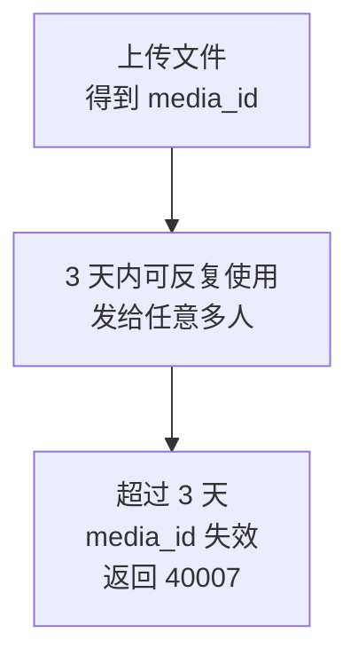

## 原理二：为什么要缓存

不缓存会有两个浪费：

| 浪费 | 说明 |
|---|---|
| 带宽和时间 | 同一个 20MB 文件传三次 |
| 接口配额 | 上传接口也计入调用次数 |

## 原理三：缓存键该用什么

用文件路径做键是不可靠的：同名文件内容可能变了。

正确做法是**用文件内容的哈希值**：

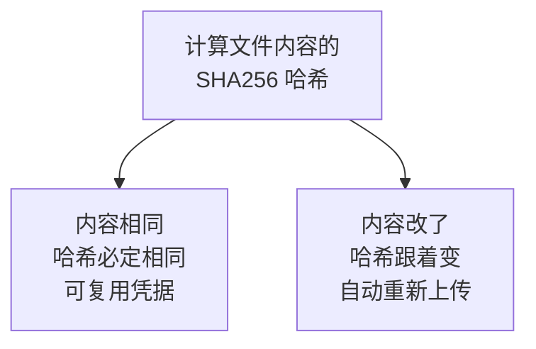

还有一个容易漏的点：**缓存键必须包含 `type`**。因为 V1 讲过，同一个文件用 `image` 和 `file` 两种类型上传，得到的是两个不同的 `media_id`。

## 表结构

```sql
CREATE TABLE MediaCache (
    Id         BIGINT IDENTITY(1,1) PRIMARY KEY,
    FileHash   CHAR(64) NOT NULL,           -- SHA256 十六进制，固定 64 字符
    MediaType  NVARCHAR(10) NOT NULL,       -- image / voice / video / file
    MediaId    NVARCHAR(500) NOT NULL,
    FileName   NVARCHAR(255) NULL,          -- 原始文件名，含中文
    FileSize   BIGINT NULL,
    UploadedAt DATETIME2(0) NOT NULL DEFAULT SYSDATETIME(),
    ExpireAt   DATETIME2(0) NOT NULL,       -- 上传时间 + 保守有效期

    -- 同一文件同一类型只缓存一条
    CONSTRAINT UQ_Media_Hash_Type UNIQUE (FileHash, MediaType)
);

CREATE INDEX IX_Media_Expire ON MediaCache (ExpireAt);
```

## 三个字段设计说明

### `FileHash` 用 `CHAR(64)` 而不是 `NVARCHAR`

SHA256 的十六进制表示固定 64 个字符，且全是 ASCII。用定长 `CHAR` 比变长类型更省空间、比较更快。

### `MediaId` 为什么给 500

`media_id` 是一串很长的字符串，实际长度可能变化。给宽松的长度，避免将来截断。

### `ExpireAt` 为什么要单独存

可以由 `UploadedAt + 3 天` 算出来，但存成字段有两个好处：

1. 查询时直接比较，不用每次做日期运算
2. 可以按类型设不同的保守期限

## 计算文件哈希

```python
import hashlib


def file_hash(file_path, chunk_size=1024 * 1024):
    """计算文件 SHA256。分块读取，避免大文件占满内存。"""
    h = hashlib.sha256()
    with open(file_path, "rb") as f:
        while True:
            chunk = f.read(chunk_size)
            if not chunk:
                break
            h.update(chunk)
    return h.hexdigest()
```

**分块读取很重要。**如果写成 `h.update(f.read())`，20MB 文件会一次性全进内存。文件更大时会有问题。

## V7 的问题

如果缓存里的 `media_id` 已经过期，程序还会拿去用，结果发送失败。

---

# V8：过期检测与自动重传

## 目标

自动识别过期的凭据并重新上传。

## 原理：两种检测策略

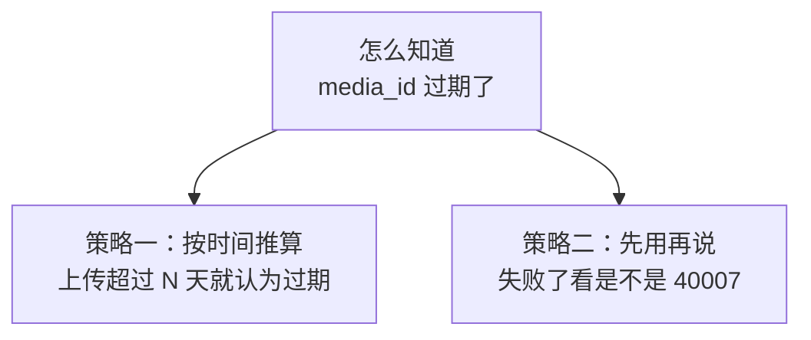

两种策略的对比：

| | 按时间推算 | 捕获错误 |
|---|---|---|
| 优点 | 不浪费失败的调用 | 精确 |
| 缺点 | 保守，可能提前废弃仍可用的 | 每次过期都白费一次调用 |
| 风险 | 时钟不准会误判 | 群发中途失败影响大 |

## 本教程的选择：两者结合

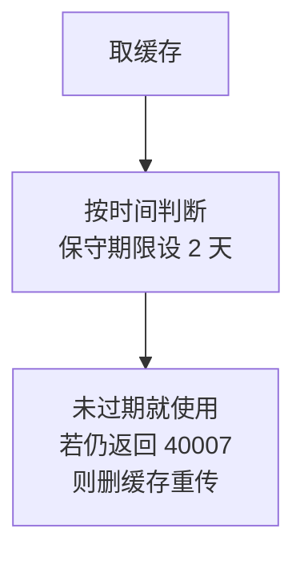

主策略是按时间推算，**保守期限设 2 天而不是 3 天**。

为什么留一天余量：

| 原因 | 说明 |
|---|---|
| 边界不精确 | 「3 天」的起算点和精度都不确定 |
| 群发耗时长 | 大批量发送可能持续很久，开始时没过期，结束时过期了 |
| 时钟偏差 | 本地时间和企业微信服务器时间可能不同 |

这和第 1 章 token 提前 5 分钟过期是同一个思路：**宁可早一点重新获取，不要卡在边界上。**

## 代码

```python
import pyodbc

# 保守有效期：官方 3 天，这里只用 2 天
MEDIA_VALID_DAYS = 2


def get_cached_media_id(cursor, hash_value, media_type):
    """查缓存。返回未过期的 media_id，否则返回 None。"""
    cursor.execute("""
        SELECT MediaId FROM MediaCache
        WHERE FileHash = ? AND MediaType = ? AND ExpireAt > SYSDATETIME()
    """, hash_value, media_type)
    row = cursor.fetchone()
    return row.MediaId if row else None


def save_media_cache(cursor, conn, hash_value, media_type, media_id,
                     filename, size):
    """写入或更新缓存。"""
    cursor.execute("""
        MERGE MediaCache AS target
        USING (SELECT ? AS FileHash, ? AS MediaType) AS src
            ON target.FileHash = src.FileHash
           AND target.MediaType = src.MediaType
        WHEN MATCHED THEN
            UPDATE SET MediaId = ?, FileName = ?, FileSize = ?,
                       UploadedAt = SYSDATETIME(),
                       ExpireAt = DATEADD(DAY, ?, SYSDATETIME())
        WHEN NOT MATCHED THEN
            INSERT (FileHash, MediaType, MediaId, FileName, FileSize, ExpireAt)
            VALUES (src.FileHash, src.MediaType, ?, ?, ?,
                    DATEADD(DAY, ?, SYSDATETIME()));
    """, hash_value, media_type,
        media_id, filename, size, MEDIA_VALID_DAYS,
        media_id, filename, size, MEDIA_VALID_DAYS)
    conn.commit()


def invalidate_media_cache(cursor, conn, media_id):
    """把某个 media_id 标记为已过期。用于捕获 40007 后兜底。"""
    cursor.execute("""
        UPDATE MediaCache SET ExpireAt = SYSDATETIME() WHERE MediaId = ?
    """, media_id)
    conn.commit()
```

## 带缓存的上传入口

```python
def get_media_id(cursor, conn, file_path, media_type="file"):
    """取 media_id：优先用缓存，没有则上传。"""
    check_media(file_path, media_type)

    hash_value = file_hash(file_path)

    cached = get_cached_media_id(cursor, hash_value, media_type)
    if cached:
        print(f"命中缓存，跳过上传：{os.path.basename(file_path)}")
        return cached

    media_id = upload_media_cn(file_path, media_type)
    save_media_cache(cursor, conn, hash_value, media_type, media_id,
                     os.path.basename(file_path), os.path.getsize(file_path))
    return media_id
```

## 兜底：捕获 40007 后重传一次

```python
def send_media_with_retry(cursor, conn, file_path, media_type, to_user):
    """发送素材。若遇到 media_id 过期，重新上传后再试一次。"""
    media_id = get_media_id(cursor, conn, file_path, media_type)

    send_func = wecom.send_image if media_type == "image" else wecom.send_file

    try:
        return send_func(media_id, to_user=to_user)
    except RuntimeError as ex:
        if "40007" not in str(ex):
            raise                    # 不是过期问题，直接抛出

        # 缓存里的凭据已失效，清掉重来
        print("media_id 已过期，重新上传")
        invalidate_media_cache(cursor, conn, media_id)
        media_id = get_media_id(cursor, conn, file_path, media_type)
        return send_func(media_id, to_user=to_user)
```

## 为什么只重试一次

```python
if "40007" not in str(ex):
    raise
```

重新上传后拿到的一定是新凭据。如果新凭据还报 40007，说明问题不在过期，而是别的原因（比如上传时 `type` 和发送时的 `msgtype` 不匹配）。这时无限重试只会掩盖真正的问题。

## 缓存表的清理

过期记录没用了，定期清掉：

```sql
DELETE FROM MediaCache WHERE ExpireAt < DATEADD(DAY, -7, SYSDATETIME());
```

多留 7 天是为了排查问题时还能看到历史记录。

## V8 的问题

上传 20MB 文件时，`timeout=30` 不够用。

---

# V9：大文件超时与重试

## 目标

按文件大小设置合理的超时，并处理上传失败。

## 原理：超时应该随文件大小变化

固定超时值有两个问题：

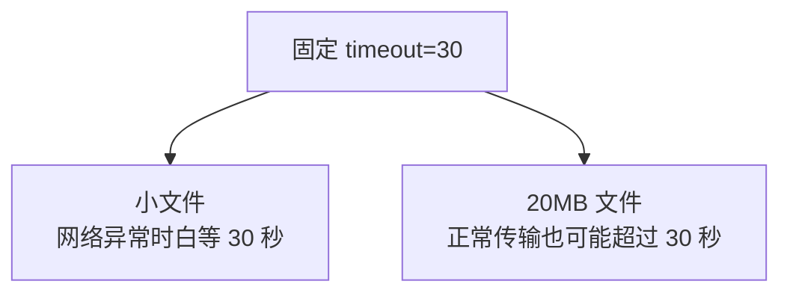

合理做法是按大小估算：**基础时间 + 每 MB 的传输时间**。

## 原理：上传超时和发送超时的区别

第 2 章讲过：发送消息超时后不能重试，因为消息可能已经发出去了。

**上传超时可以重试。**原因是上传是幂等的：

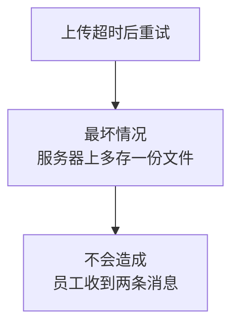

多一份未被引用的文件，3 天后自动清理，没有实际危害。**所以上传可以放心重试，这是它和发送的关键区别。**

## 代码

```python
import time


def calc_timeout(file_size):
    """按文件大小估算超时秒数。

    基础 20 秒 + 每 MB 给 5 秒。20MB 文件约 120 秒。
    """
    mb = file_size / 1024 / 1024
    return int(20 + mb * 5)


def upload_media_cn(file_path, media_type="file", max_retry=3):
    """上传素材。支持中文文件名、动态超时、失败重试。"""
    check_media(file_path, media_type)

    filename = os.path.basename(file_path)
    size = os.path.getsize(file_path)
    timeout = calc_timeout(size)

    last_error = None

    for attempt in range(1, max_retry + 1):
        token = wecom.get_token()

        try:
            # 每次重试都要重新打开文件：上一次可能已读到文件末尾
            with open(file_path, "rb") as f:
                encoder = MultipartEncoder(
                    fields={"media": (filename, f, guess_content_type(file_path))}
                )
                r = requests.post(
                    f"{config.BASE_URL}/media/upload",
                    params={"access_token": token, "type": media_type},
                    data=encoder,
                    headers={"Content-Type": encoder.content_type},
                    timeout=timeout,
                )
            r.raise_for_status()
            result = r.json()

        except requests.exceptions.RequestException as ex:
            last_error = f"网络失败：{ex}"
            if attempt < max_retry:
                wait = attempt * 5          # 5、10 秒递增
                print(f"上传失败（第 {attempt} 次），{wait} 秒后重试")
                time.sleep(wait)
                continue
            raise RuntimeError(f"上传失败，已重试 {max_retry} 次：{last_error}")

        if result.get("errcode") == 0:
            return result["media_id"]

        # 业务错误：判断是否值得重试
        errcode = result.get("errcode")
        if errcode in {40005, 40006, 41005, 301019}:
            # 文件本身有问题，重试无意义
            raise RuntimeError(f"上传失败：{wecom.describe_error(result)}")

        last_error = wecom.describe_error(result)
        if attempt < max_retry:
            print(f"上传失败（第 {attempt} 次），准备重试")
            time.sleep(attempt * 5)

    raise RuntimeError(f"上传失败，已重试 {max_retry} 次：{last_error}")
```

## 两个关键细节

### 每次重试都要重新打开文件

```python
with open(file_path, "rb") as f:
```

这行在循环**里面**。如果放在外面，第一次上传读完后文件指针在末尾，第二次上传会读到 0 字节，然后返回 41005。

这也是 V2 提到的 41005 第三个原因。

### 文件类错误不重试

```python
if errcode in {40005, 40006, 41005, 301019}:
    raise
```

文件太大、格式不对，重试一百次也是一样的结果。这和第 4 章的错误分类是同一个思路：**需要人改文件或改代码才能解决的问题，不要重试。**

## V9 的问题

素材功能还没接进第 4 章的群发程序，只能单独调用。

---

# V10：接入群发程序

## 目标

让群发任务支持图片和文件。

## 表结构调整

第 3 章的 `MessageTask` 只有 `Content` 字段。图片和文件任务需要记录文件路径：

```sql
ALTER TABLE MessageTask ADD
    FilePath NVARCHAR(500) NULL;    -- 图片或文件的本地路径
```

`MsgType` 字段第 3 章已经有了，取值扩展为 `text`、`markdown`、`image`、`file`。

## 原理：上传要放在分批循环之外

这是接入时最容易写错的地方。

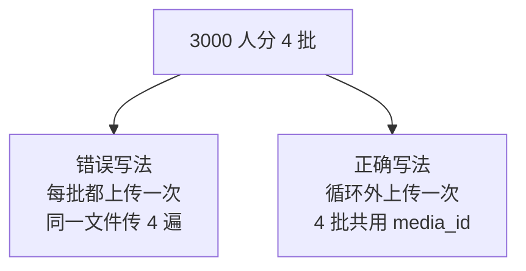

这正是 V1 讲的「分两步」的第三个理由的实际体现。

## 代码

改造第 4 章的 `_send_by_users`：

```python
def _send_by_users(cursor, conn, task):
    """按收件人表发送。支持文本、图片、文件。"""
    cursor.execute("""
        SELECT UserId FROM MessageRecipient
        WHERE TaskId = ? AND Status = 0
    """, task.Id)
    users = [r.UserId for r in cursor.fetchall()]

    if not users:
        update_task_status(cursor, conn, task.Id)
        return

    msg_type = (task.MsgType or "text").lower()

    # 关键：素材在分批循环之外上传一次
    media_id = None
    if msg_type in ("image", "file"):
        if not task.FilePath:
            raise RuntimeError(f"任务 {task.Id} 类型为 {msg_type} 但未指定 FilePath")
        media_id = get_media_id(cursor, conn, task.FilePath, msg_type)
        log.info(f"任务 {task.Id} 素材就绪：{media_id[:12]}...")

    for i in range(0, len(users), BATCH_SIZE):
        batch = users[i:i + BATCH_SIZE]
        _mark_recipients(cursor, conn, task.Id, batch, 1)

        try:
            problems = _dispatch(task, msg_type, media_id, batch)
        except RuntimeError as ex:
            # media_id 过期时重新上传一次再试
            if media_id and "40007" in str(ex):
                log.warning(f"任务 {task.Id} 素材过期，重新上传")
                invalidate_media_cache(cursor, conn, media_id)
                media_id = get_media_id(cursor, conn, task.FilePath, msg_type)
                try:
                    problems = _dispatch(task, msg_type, media_id, batch)
                except Exception as ex2:
                    _mark_recipients(cursor, conn, task.Id, batch, 3,
                                     extract_errcode(ex2), str(ex2))
                    continue
            else:
                _mark_recipients(cursor, conn, task.Id, batch, 3,
                                 extract_errcode(ex), str(ex))
                continue

        failed = _parse_invalid(problems)
        succeeded = [u for u in batch if u not in failed]
        _mark_recipients(cursor, conn, task.Id, succeeded, 2)
        _mark_recipients(cursor, conn, task.Id, list(failed), 3,
                         errmsg="不在可见范围或UserId无效")

    update_task_status(cursor, conn, task.Id)


def _dispatch(task, msg_type, media_id, batch):
    """按消息类型调用对应的发送函数。"""
    to = "|".join(batch)
    safe = 1 if task.Safe else 0

    if msg_type == "text":
        return wecom.send_text(task.Content, to_user=to, safe=safe)
    if msg_type == "markdown":
        return wecom.send_markdown(task.Content, to_user=to)
    if msg_type == "image":
        return wecom.send_image(media_id, to_user=to, safe=safe)
    if msg_type == "file":
        return wecom.send_file(media_id, to_user=to, safe=safe)

    raise ValueError(f"不支持的消息类型：{msg_type}")
```

## 建任务的示例

```sql
-- 发送图片
INSERT INTO MessageTask (MsgType, Content, FilePath)
VALUES (N'image', N'月度图表', N'D:\报表\202608图表.png');
DECLARE @id INT = SCOPE_IDENTITY();
INSERT INTO MessageRecipient (TaskId, UserId) VALUES (@id, N'你的UserId');

-- 发送文件
INSERT INTO MessageTask (MsgType, Content, FilePath)
VALUES (N'file', N'8月报表', N'D:\报表\8月经营报表.xlsx');
```

图片和文件任务的 `Content` 不会被发送，但建议填写摘要，方便在数据库里辨认这条任务是干什么的。

## 建任务时就该校验文件

上面的 SQL 直接插入，如果路径写错了，要等定时任务运行时才发现。

更好的做法是提供一个建任务的 Python 函数，在插入前先检查：

```python
def create_media_task(cursor, conn, msg_type, file_path, user_ids,
                      summary="", biz_key=None):
    """创建图片或文件任务。插入前先校验文件。"""
    check_media(file_path, msg_type)          # 提前发现路径错、超限、格式错

    cursor.execute("""
        INSERT INTO MessageTask (MsgType, Content, FilePath, BizKey)
        VALUES (?, ?, ?, ?);
        SELECT SCOPE_IDENTITY();
    """, msg_type, summary or os.path.basename(file_path), file_path, biz_key)
    task_id = int(cursor.fetchone()[0])

    for uid in set(user_ids):
        cursor.execute(
            "INSERT INTO MessageRecipient (TaskId, UserId) VALUES (?, ?)",
            task_id, uid)

    conn.commit()
    return task_id
```

## 一个部署注意点

第 4 章 V11 讲过任务计划程序的坑。这里再加一条：

**`FilePath` 不要用映射网络驱动器路径。**

因为勾选「不管用户是否登录都要运行」后，任务运行在非交互会话中，映射盘不可用。要用 UNC 路径：

```text
错误：Z:\报表\8月报表.xlsx
正确：\\fileserver\报表\8月报表.xlsx
```

并且要确认任务运行账号对这个共享有读取权限。

---

# V11：集成版

## 完整模块

新建 `media.py`：

```python
# -*- coding: utf-8 -*-
"""企业微信素材上传模块。

用法：
    import media
    mid = media.get_media_id(cursor, conn, "报表.xlsx", "file")
    wecom.send_file(mid, to_user="zhangsan")

设计要点：
    1. 上传与发送分离：同一文件上传一次，可发给任意多人
    2. 缓存键是「文件内容哈希 + type」，内容变了自动重传
    3. 保守有效期 2 天（官方 3 天），避免卡在边界
    4. 上传是幂等的，所以可以安全重试（发送不行）
    5. 中文文件名用 MultipartEncoder 避免二次编码
"""

import os
import time
import uuid
import hashlib
import logging

import requests
from requests_toolbelt.multipart.encoder import MultipartEncoder

import config
import wecom

log = logging.getLogger("media")

# ===== 限制：(允许扩展名, 大小上限字节) =====
# 注意：这些是企业微信的限制，与微信公众号不同，不要混用
MEDIA_LIMITS = {
    "image": ({".jpg", ".jpeg", ".png"}, 10 * 1024 * 1024),
    "voice": ({".amr"}, 2 * 1024 * 1024),
    "video": ({".mp4"}, 10 * 1024 * 1024),
    "file":  (None, 20 * 1024 * 1024),
}

CONTENT_TYPES = {
    ".jpg": "image/jpeg", ".jpeg": "image/jpeg", ".png": "image/png",
    ".amr": "audio/amr", ".mp4": "video/mp4", ".pdf": "application/pdf",
    ".xlsx": "application/vnd.openxmlformats-officedocument"
             ".spreadsheetml.sheet",
    ".docx": "application/vnd.openxmlformats-officedocument"
             ".wordprocessingml.document",
}

# 官方 3 天，留 1 天余量应对边界、长时间群发和时钟偏差
MEDIA_VALID_DAYS = 2

# 文件本身有问题，重试无意义
NO_RETRY_UPLOAD_CODES = {40005, 40006, 41005, 301019}


# ---------- 工具 ----------

def guess_content_type(file_path):
    ext = os.path.splitext(file_path)[1].lower()
    return CONTENT_TYPES.get(ext, "application/octet-stream")


def safe_filename(file_path):
    """生成纯 ASCII 文件名。用于文件名不需要展示的场景。"""
    ext = os.path.splitext(file_path)[1].lower()
    return f"{uuid.uuid4().hex[:16]}{ext}"


def file_hash(file_path, chunk_size=1024 * 1024):
    """SHA256。分块读取，避免大文件占满内存。"""
    h = hashlib.sha256()
    with open(file_path, "rb") as f:
        while True:
            chunk = f.read(chunk_size)
            if not chunk:
                break
            h.update(chunk)
    return h.hexdigest()


def calc_timeout(file_size):
    """基础 20 秒 + 每 MB 给 5 秒。"""
    return int(20 + file_size / 1024 / 1024 * 5)


def check_media(file_path, media_type):
    """上传前自查。不通过抛异常。"""
    if not os.path.isfile(file_path):
        raise ValueError(f"文件不存在：{file_path}")
    if media_type not in MEDIA_LIMITS:
        raise ValueError(f"不支持的 type：{media_type}")

    allowed_ext, max_size = MEDIA_LIMITS[media_type]
    size = os.path.getsize(file_path)

    if size == 0:
        raise ValueError("文件为空，企业微信不接受空文件")
    if size > max_size:
        raise ValueError(f"文件 {size / 1048576:.1f} MB，超过 {media_type} "
                         f"上限 {max_size / 1048576:.0f} MB")

    if allowed_ext:
        ext = os.path.splitext(file_path)[1].lower()
        if ext not in allowed_ext:
            raise ValueError(f"扩展名 {ext} 不在 {media_type} 允许范围内")


# ---------- 上传 ----------

def upload_media(file_path, media_type="file", max_retry=3,
                 keep_chinese_name=True):
    """上传素材，返回 media_id。

    keep_chinese_name  文件消息需要 True（员工能看到文件名）
                       图片消息可用 False（文件名不展示）
    """
    check_media(file_path, media_type)

    filename = (os.path.basename(file_path) if keep_chinese_name
                else safe_filename(file_path))
    size = os.path.getsize(file_path)
    timeout = calc_timeout(size)
    last_error = None

    for attempt in range(1, max_retry + 1):
        token = wecom.get_token()

        try:
            # 必须在循环内打开：上一次尝试已把指针读到末尾
            with open(file_path, "rb") as f:
                encoder = MultipartEncoder(
                    fields={"media": (filename, f,
                                      guess_content_type(file_path))})
                r = requests.post(
                    f"{config.BASE_URL}/media/upload",
                    params={"access_token": token, "type": media_type},
                    data=encoder,                                    # 不是 files=
                    headers={"Content-Type": encoder.content_type},  # 必须手工设
                    timeout=timeout)
            r.raise_for_status()
            result = r.json()

        except requests.exceptions.RequestException as ex:
            # 上传是幂等的，重试最坏只是服务器多存一份，可安全重试
            last_error = f"网络失败：{ex}"
            if attempt < max_retry:
                wait = attempt * 5
                log.warning(f"上传失败（第 {attempt} 次），{wait} 秒后重试")
                time.sleep(wait)
                continue
            raise RuntimeError(f"上传失败，已重试 {max_retry} 次：{last_error}")

        if result.get("errcode") == 0:
            log.info(f"上传成功：{filename}（{size / 1024:.0f} KB）")
            return result["media_id"]

        if result.get("errcode") in NO_RETRY_UPLOAD_CODES:
            raise RuntimeError(f"上传失败：{wecom.describe_error(result)}")

        last_error = wecom.describe_error(result)
        if attempt < max_retry:
            time.sleep(attempt * 5)

    raise RuntimeError(f"上传失败，已重试 {max_retry} 次：{last_error}")


# ---------- 缓存 ----------

def get_cached_media_id(cursor, hash_value, media_type):
    cursor.execute("""
        SELECT MediaId FROM MediaCache
        WHERE FileHash = ? AND MediaType = ? AND ExpireAt > SYSDATETIME()
    """, hash_value, media_type)
    row = cursor.fetchone()
    return row.MediaId if row else None


def save_media_cache(cursor, conn, hash_value, media_type, media_id,
                     filename, size):
    cursor.execute("""
        MERGE MediaCache AS target
        USING (SELECT ? AS FileHash, ? AS MediaType) AS src
            ON target.FileHash = src.FileHash
           AND target.MediaType = src.MediaType
        WHEN MATCHED THEN
            UPDATE SET MediaId = ?, FileName = ?, FileSize = ?,
                       UploadedAt = SYSDATETIME(),
                       ExpireAt = DATEADD(DAY, ?, SYSDATETIME())
        WHEN NOT MATCHED THEN
            INSERT (FileHash, MediaType, MediaId, FileName, FileSize, ExpireAt)
            VALUES (src.FileHash, src.MediaType, ?, ?, ?,
                    DATEADD(DAY, ?, SYSDATETIME()));
    """, hash_value, media_type,
        media_id, filename, size, MEDIA_VALID_DAYS,
        media_id, filename, size, MEDIA_VALID_DAYS)
    conn.commit()


def invalidate_media_cache(cursor, conn, media_id):
    """把凭据标记为立即过期。捕获 40007 后调用。"""
    cursor.execute(
        "UPDATE MediaCache SET ExpireAt = SYSDATETIME() WHERE MediaId = ?",
        media_id)
    conn.commit()


def get_media_id(cursor, conn, file_path, media_type="file"):
    """取 media_id：优先缓存，无则上传。"""
    check_media(file_path, media_type)
    hash_value = file_hash(file_path)

    cached = get_cached_media_id(cursor, hash_value, media_type)
    if cached:
        log.info(f"命中缓存，跳过上传：{os.path.basename(file_path)}")
        return cached

    keep_cn = (media_type == "file")     # 只有文件类型需要保留中文名
    media_id = upload_media(file_path, media_type, keep_chinese_name=keep_cn)

    save_media_cache(cursor, conn, hash_value, media_type, media_id,
                     os.path.basename(file_path), os.path.getsize(file_path))
    return media_id


def cleanup_cache(cursor, conn, keep_days=7):
    """清理过期已久的缓存记录。"""
    cursor.execute("""
        DELETE FROM MediaCache
        WHERE ExpireAt < DATEADD(DAY, ?, SYSDATETIME())
    """, -keep_days)
    n = cursor.rowcount
    conn.commit()
    if n:
        log.info(f"清理素材缓存 {n} 条")
    return n
```

## 建表脚本

追加到第 3 章的 `init_database.sql`：

```sql
IF OBJECT_ID('MediaCache') IS NOT NULL DROP TABLE MediaCache;
GO

CREATE TABLE MediaCache (
    Id         BIGINT IDENTITY(1,1) PRIMARY KEY,
    FileHash   CHAR(64) NOT NULL,
    MediaType  NVARCHAR(10) NOT NULL,
    MediaId    NVARCHAR(500) NOT NULL,
    FileName   NVARCHAR(255) NULL,
    FileSize   BIGINT NULL,
    UploadedAt DATETIME2(0) NOT NULL DEFAULT SYSDATETIME(),
    ExpireAt   DATETIME2(0) NOT NULL,

    CONSTRAINT UQ_Media_Hash_Type UNIQUE (FileHash, MediaType)
);

CREATE INDEX IX_Media_Expire ON MediaCache (ExpireAt);
GO

ALTER TABLE MessageTask ADD FilePath NVARCHAR(500) NULL;
GO
```

## 使用示例

```python
import pyodbc
import config
import wecom
import media

conn = pyodbc.connect(config.CONN_STR)
cursor = conn.cursor()
me = config.TEST_USER_ID

# 1 发图片（文件名不展示，用 ASCII 名）
mid = media.get_media_id(cursor, conn, "图表.png", "image")
wecom.send_image(mid, to_user=me)

# 2 发文件（保留中文名）
mid = media.get_media_id(cursor, conn, "8月经营报表.xlsx", "file")
wecom.send_text("8 月经营报表已生成，请查收附件。", to_user=me)
wecom.send_file(mid, to_user=me)

# 3 验证缓存：第二次应命中，不再上传
mid2 = media.get_media_id(cursor, conn, "8月经营报表.xlsx", "file")
print(f"两次是否相同：{mid == mid2}")      # True

conn.close()
```

---

# 本章自测

| 测试 | 做法 | 期望结果 |
|---|---|---|
| 1 上传 | 上传一张 JPG | 返回 `media_id` |
| 2 发图片 | 用 `media_id` 发送 | 手机显示图片 |
| 3 中文文件名 | 上传「8月报表.xlsx」并发送 | 手机显示中文名，**不是乱码** |
| 4 空文件 | 上传 0 字节文件 | 本地报错，不发请求 |
| 5 超限 | 上传 30MB 文件 | 本地报错并说明超了多少 |
| 6 格式不符 | 用 `type=image` 上传 PDF | 本地报错提示扩展名不符 |
| 7 缓存命中 | 同一文件取两次 | 第二次提示命中缓存 |
| 8 内容变化 | 改动文件内容后再取 | 重新上传，`media_id` 不同 |
| 9 不同 type | 同一文件分别用 image 和 file | 得到两个不同 `media_id` |
| 10 过期兜底 | 手工把 `ExpireAt` 改成过去 | 自动重新上传 |
| 11 群发图片 | 建 image 类型任务 | 收到图片，日志显示只上传一次 |

第 9 项容易被忽略：**同一文件不同 `type` 的 `media_id` 不同**，这就是缓存键必须包含 `type` 的原因。

# 错误排查

| 现象 | 原因 | 解决 |
|---|---|---|
| `41005` | 表单字段名不是 `media` | 改成 `media` |
| `41005` | 文件为空 | 检查文件 |
| `41005` | 重试时文件已读完 | 在循环内重新 `open` |
| `41005` | 用 `data=` 但没设 Content-Type | 手工设 `encoder.content_type` |
| `40005` | 扩展名与 `type` 不匹配 | 核对对应关系 |
| `40006` | 文件超限 | 压缩或改用文件类型 |
| `40007` | `media_id` 过期 | 重新上传 |
| 文件名乱码 | `requests` 对中文名二次编码 | 用 `MultipartEncoder` |
| 上传总超时 | 固定超时太短 | 按大小动态计算 |
| 群发时上传多次 | 上传写在分批循环内 | 移到循环外 |
| 任务计划里找不到文件 | 用了映射盘路径 | 改用 UNC 路径 |

# 完成标准

## 理解部分

- [ ] 为什么不能把图片直接放进消息体，要分两步
- [ ] `media_id` 是文件本身、下载地址，还是一个引用
- [ ] 为什么这里用 `files=`／`data=` 而不是 `json=`
- [ ] 为什么中文文件名会乱码，两种解决方案各适合什么场景
- [ ] 为什么保守有效期取 2 天而不是 3 天
- [ ] 为什么上传可以重试、而发送消息不能重试
- [ ] 为什么缓存键必须包含 `type`
- [ ] 为什么上传要放在分批循环之外

## 操作部分

- [ ] 11 项自测全部通过
- [ ] 中文文件名的文件发送后显示正常
- [ ] 群发程序能发图片和文件
- [ ] `MediaCache` 表里有正确的缓存记录

# 一个容易踩的知识陷阱

本章提到过两次「企业微信和微信公众号不一样」：

| 项目 | 微信公众号 | 企业微信 |
|---|---|---|
| 图片上传上限 | 2 MB | 10 MB |
| 重复获取 token | 旧的失效 | 返回同一个 |

搜索资料时很容易搜到公众号的文章，因为它们数量更多、时间更早。**接口地址长得像，但限制和行为有差异。**遇到数字和行为描述，务必确认资料讲的是哪个平台。

# 下一章

第 6 章开始转向 C#。用 ASP.NET WebForms 做员工查询页面，会用到第 1 章讲的**通讯录 Secret**，以及第 3 章建好的通讯录缓存表。
