# 第 6 章：C# WebForms 员工查询

## 语言边界

本章功能完全由 C# ASP.NET WebForms 实现。**C# 直接调用企业微信接口，不调用 Python。**

第 3 章的通讯录缓存表由本章读写，Python 不碰它。两种语言在数据库相遇，但互不调用。

## 本章目标

做一个部署在 IIS 上的员工查询网站：部门树、成员列表、员工详情、模糊搜索、导出 Excel。

## 前置条件

- 第 1 章完成，拿到**通讯录 Secret**且权限为只读
- 第 3 章完成，`WeComEmployee` 和 `WeComDepartment` 表已建
- IIS 已启用 ASP.NET，Visual Studio 可用

## 本章第一个关键点

第 1 章讲过两种 Secret。本章是**通讯录 Secret 唯一登场的地方**。

用错的后果很直接：

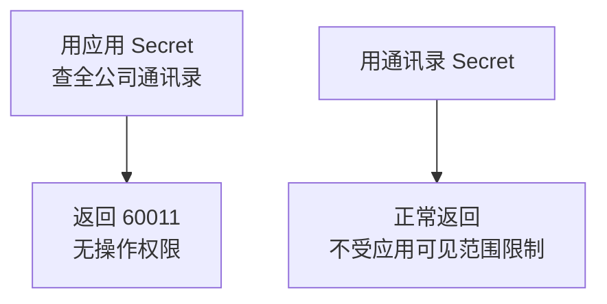

60011 是通讯录接口上最常见的错误，绝大多数情况就是 Secret 拿错了（这一现象在开发者社区反复出现，参见[企业微信通讯录接口 60011 讨论](https://developers.weixin.qq.com/community/personal/oCJUsw3t3u3qO316NGnHndIVbjXA/answer)。内容已改写以符合授权要求）。

## 版本地图

| 版本 | 主题 | 解决上一版什么问题 |
|---|---|---|
| V1 | 查一个员工 | —— |
| V2 | Token 缓存类 | 每次请求都换 token |
| V3 | 查部门列表 | 只能按 UserId 查单人 |
| V4 | 部门树展示 | 部门是平铺的看不出层级 |
| V5 | 成员列表页 | 看不到部门里有谁 |
| V6 | 员工详情页 | 列表信息太少 |
| V7 | 同步到 SQL Server | 每次查询都调接口 |
| V8 | 模糊搜索与分页 | 无法按姓名搜索 |
| V9 | 软删除与差异比较 | 离职员工残留在本地 |
| V10 | 导出 Excel | 数据无法交给他人 |
| V11 | 错误处理与日志 | 出错只有黄页 |
| V12 | 集成版 | 代码零散 |

---

# V1：查一个员工

## 目标

建一个页面，输入 UserId 显示姓名。

## 项目准备

Visual Studio 新建「ASP.NET Web 应用程序（.NET Framework）」，选「Web Forms」模板。

用 NuGet 装 JSON 库：

```text
Install-Package Newtonsoft.Json
```

## `Web.config`

```xml
<configuration>
  <appSettings>
    <add key="WeCom.CorpId" value="你的企业ID" />
    <add key="WeCom.AgentId" value="1000002" />
    <!-- 应用 Secret：第 8 章 OAuth、第 9 章 JS-SDK 用 -->
    <add key="WeCom.AppSecret" value="你的应用Secret" />
    <!-- 通讯录 Secret：本章用 -->
    <add key="WeCom.ContactsSecret" value="你的通讯录Secret" />
    <add key="WeCom.BaseUrl" value="https://qyapi.weixin.qq.com/cgi-bin" />
  </appSettings>
  <connectionStrings>
    <add name="WeComDb"
         connectionString="Server=localhost;Database=WeComTutorial;Integrated Security=true"
         providerName="System.Data.SqlClient" />
  </connectionStrings>
</configuration>
```

## 先解决一个必踩的坑：TLS 1.2

**这一步必须在写业务代码之前做**，否则后面所有请求都会失败。

`Global.asax.cs`：

```csharp
using System;
using System.Net;

public class Global : System.Web.HttpApplication
{
    protected void Application_Start(object sender, EventArgs e)
    {
        // 企业微信接口要求 TLS 1.2。
        // .NET Framework 4.6 以下默认不启用它，会导致请求失败。
        // 3072 就是 SecurityProtocolType.Tls12 的数值，
        // 直接写数字可以兼容不认识该枚举成员的旧版本框架。
        ServicePointManager.SecurityProtocol |= (SecurityProtocolType)3072;

        // 适当放宽并发连接数，默认值对服务端程序偏小
        ServicePointManager.DefaultConnectionLimit = 32;
    }
}
```

### 为什么会有这个问题

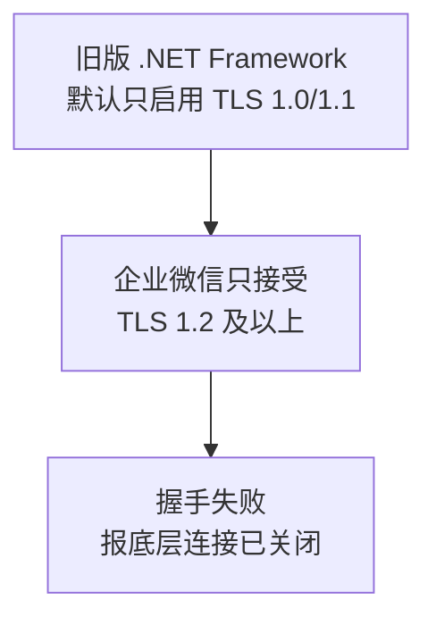

典型报错是「基础连接已经关闭: 发送时发生错误」，看起来像网络问题，实际是协议协商失败。老项目升级时经常遇到（处理方式参见[在 .NET Framework 中启用 TLS 1.2](https://stackoverflow.com/questions/78500502/httpclient-net-4)。内容已改写以符合授权要求）。

用 `|=` 而不是 `=`，是为了保留框架已有的设置，只补上 TLS 1.2。

## 页面代码

`EmployeeQuery.aspx`：

```aspx
<%@ Page Language="C#" Async="true" AutoEventWireup="true"
    CodeBehind="EmployeeQuery.aspx.cs" Inherits="WeComWeb.EmployeeQuery" %>
<!DOCTYPE html>
<html>
<head runat="server">
    <meta name="viewport" content="width=device-width, initial-scale=1" />
    <title>员工查询</title>
</head>
<body>
    <form id="form1" runat="server">
        <asp:TextBox ID="txtUserId" runat="server" placeholder="输入 UserId" />
        <asp:Button ID="btnQuery" runat="server" Text="查询"
                    OnClick="btnQuery_Click" />
        <hr />
        <asp:Literal ID="litResult" runat="server" />
    </form>
</body>
</html>
```

**注意 `Async="true"`。**缺了它，后面的异步代码不会执行。

## 后台代码

`EmployeeQuery.aspx.cs`：

```csharp
using System;
using System.Configuration;
using System.Net.Http;
using System.Threading.Tasks;
using System.Web.UI;
using Newtonsoft.Json.Linq;

namespace WeComWeb
{
    public partial class EmployeeQuery : Page
    {
        // HttpClient 必须是 static：见下方原理说明
        private static readonly HttpClient Client = new HttpClient
        {
            Timeout = TimeSpan.FromSeconds(15)
        };

        private static string Cfg(string key)
        {
            return ConfigurationManager.AppSettings[key];
        }

        protected void btnQuery_Click(object sender, EventArgs e)
        {
            // WebForms 里调用异步方法的正确姿势
            RegisterAsyncTask(new PageAsyncTask(QueryAsync));
        }

        private async Task QueryAsync()
        {
            string userId = txtUserId.Text.Trim();
            if (string.IsNullOrEmpty(userId))
            {
                litResult.Text = "请输入 UserId";
                return;
            }

            try
            {
                // 第一步：换 token。本章一律用通讯录 Secret
                string tokenUrl = string.Format(
                    "{0}/gettoken?corpid={1}&corpsecret={2}",
                    Cfg("WeCom.BaseUrl"), Cfg("WeCom.CorpId"),
                    Cfg("WeCom.ContactsSecret"));

                string tokenJson = await Client.GetStringAsync(tokenUrl);
                JObject tokenObj = JObject.Parse(tokenJson);

                if (tokenObj.Value<int>("errcode") != 0)
                {
                    litResult.Text = "取 token 失败：" + tokenJson;
                    return;
                }
                string token = tokenObj.Value<string>("access_token");

                // 第二步：查成员
                string userUrl = string.Format("{0}/user/get?access_token={1}&userid={2}",
                    Cfg("WeCom.BaseUrl"), token, Uri.EscapeDataString(userId));

                string userJson = await Client.GetStringAsync(userUrl);
                JObject userObj = JObject.Parse(userJson);

                if (userObj.Value<int>("errcode") != 0)
                {
                    litResult.Text = "查询失败：" + Server.HtmlEncode(userJson);
                    return;
                }

                // Server.HtmlEncode 防止姓名里的特殊字符破坏页面
                litResult.Text = string.Format(
                    "姓名：{0}<br/>部门：{1}<br/>职务：{2}",
                    Server.HtmlEncode(userObj.Value<string>("name")),
                    userObj["department"],
                    Server.HtmlEncode(userObj.Value<string>("position")));
            }
            catch (Exception ex)
            {
                litResult.Text = "异常：" + Server.HtmlEncode(ex.Message);
            }
        }
    }
}
```

## 原理一：`HttpClient` 为什么必须是 `static`

这是 .NET 上最常见的性能陷阱。

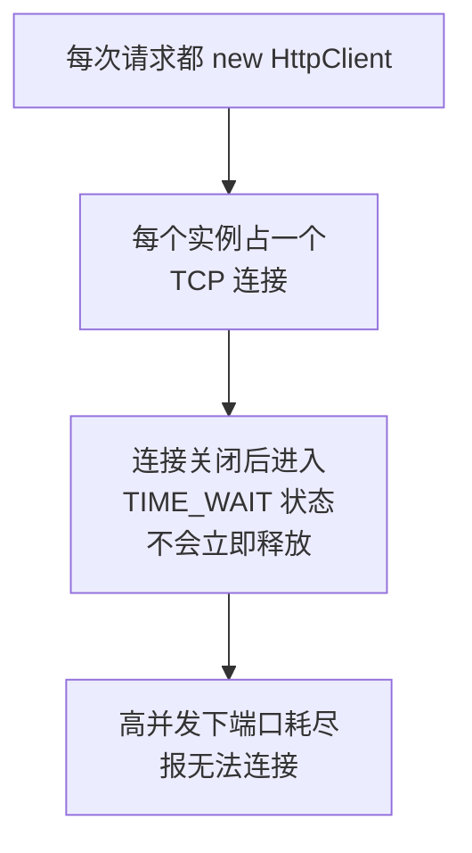

`HttpClient` 内部有连接池，本身就是为复用设计的。它是线程安全的，可以被多个请求同时使用。

**正确做法是整个应用共享一个实例**，用 `static readonly` 声明。

## 原理二：WebForms 里为什么不能直接 `.Result`

很多人会这样写：

```csharp
// 危险写法，可能死锁
string json = Client.GetStringAsync(url).Result;
```

在 ASP.NET WebForms 里这有死锁风险：

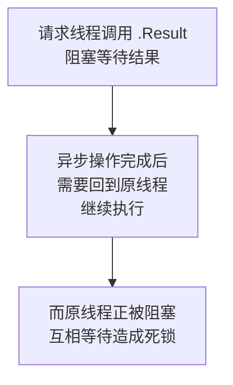

原因是 ASP.NET 的同步上下文要求延续代码回到原来那个请求线程执行，而那个线程正在等结果，形成环。

正确做法就是 V1 用的：

```csharp
protected void btnQuery_Click(object sender, EventArgs e)
{
    RegisterAsyncTask(new PageAsyncTask(QueryAsync));
}
```

配合页面指令的 `Async="true"`，让页面生命周期本身支持异步，避免阻塞。

## 原理三：为什么本章用通讯录 Secret

第 1 章讲过权限跟着凭证走。这里是它最直接的体现：

| 用哪个 Secret | 能查到谁 |
|---|---|
| 应用 Secret | 只有应用可见范围内的成员 |
| 通讯录 Secret | 全公司 |

开发阶段可见范围只有你自己。如果用应用 Secret，这个查询页面就只能查到你一个人，查同事会返回 301002。

## V1 的问题

每次点查询都要重新换一次 token。而 token 有效期 7200 秒，这是明显的浪费，还会撞上获取频率限制。

---

# V2：Token 缓存类

## 目标

把 token 缓存起来，并抽出可复用的调用类。

## 原理：缓存放在哪里

WebForms 有几种选择：

| 位置 | 生命周期 | 适合吗 |
|---|---|---|
| `Session` | 每个用户一份 | 不适合，token 是全应用共享的 |
| `Application` | 全应用 | 可以，但访问要加锁 |
| `static` 字段 | 全应用 | **推荐**，简单直接 |
| `MemoryCache` | 全应用，带过期 | 也可以，稍复杂 |

用 `static` 字段最简单。但要注意两个前提。

### 前提一：必须加锁

多个请求可能同时发现 token 过期，同时去获取。加锁避免重复请求。

### 前提二：应用程序池回收会丢缓存

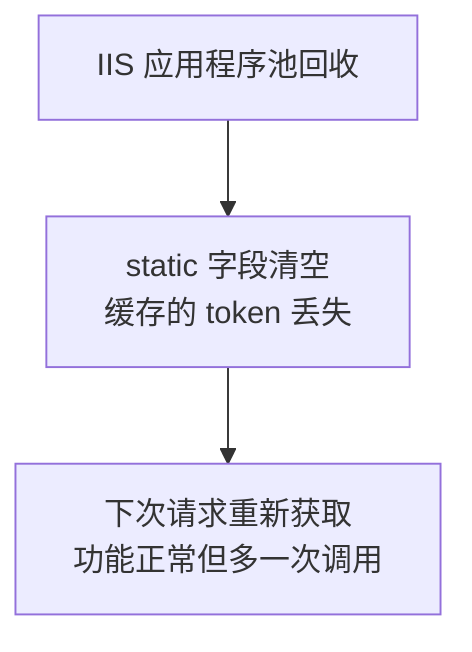

这只是小损失，不影响正确性。**关键在于：这件事之所以无害，是因为第 1 章讲的企业微信 token 行为。**

回顾一下：企业微信在有效期内重复获取会返回**同一个** token。所以即使缓存丢了、或者 IIS 开了多个工作进程各自缓存，它们拿到的也是同一个 token，不会互相顶掉。

如果换成公众号那种「新的一发旧的失效」模型，这里就必须做集中式缓存了。

## 代码

`App_Code/WeComApi.cs`：

```csharp
using System;
using System.Collections.Generic;
using System.Configuration;
using System.Net.Http;
using System.Threading.Tasks;
using Newtonsoft.Json.Linq;

namespace WeComWeb
{
    /// <summary>企业微信接口调用封装。</summary>
    public static class WeComApi
    {
        private static readonly HttpClient Client = new HttpClient
        {
            Timeout = TimeSpan.FromSeconds(20)
        };

        private static readonly string BaseUrl =
            ConfigurationManager.AppSettings["WeCom.BaseUrl"];
        private static readonly string CorpId =
            ConfigurationManager.AppSettings["WeCom.CorpId"];

        // 按 Secret 分别缓存：不同 Secret 换出的 token 不同、权限也不同
        private static readonly Dictionary<string, TokenItem> Cache =
            new Dictionary<string, TokenItem>();
        private static readonly object CacheLock = new object();

        private class TokenItem
        {
            public string Token;
            public DateTime ExpireAt;
        }

        /// <summary>通讯录 Secret 换来的 token，用于读部门和成员。</summary>
        public static Task<string> GetContactsTokenAsync()
        {
            return GetTokenAsync(
                ConfigurationManager.AppSettings["WeCom.ContactsSecret"]);
        }

        /// <summary>应用 Secret 换来的 token，用于 OAuth、JS-SDK、发消息。</summary>
        public static Task<string> GetAppTokenAsync()
        {
            return GetTokenAsync(
                ConfigurationManager.AppSettings["WeCom.AppSecret"]);
        }

        private static async Task<string> GetTokenAsync(string secret)
        {
            // 先在锁内查缓存
            lock (CacheLock)
            {
                TokenItem item;
                if (Cache.TryGetValue(secret, out item)
                    && item.ExpireAt > DateTime.Now)
                {
                    return item.Token;
                }
            }

            string url = string.Format("{0}/gettoken?corpid={1}&corpsecret={2}",
                BaseUrl, CorpId, secret);

            JObject obj = await GetJsonAsync(url);
            string token = obj.Value<string>("access_token");
            int expiresIn = obj.Value<int>("expires_in");

            lock (CacheLock)
            {
                Cache[secret] = new TokenItem
                {
                    Token = token,
                    // 提前 5 分钟过期，避开时钟偏移与网络延迟造成的临界失效
                    ExpireAt = DateTime.Now.AddSeconds(expiresIn - 300)
                };
            }
            return token;
        }

        /// <summary>发起 GET 并做两层判断：HTTP 层与业务层。</summary>
        public static async Task<JObject> GetJsonAsync(string url)
        {
            HttpResponseMessage response;
            try
            {
                response = await Client.GetAsync(url);
            }
            catch (TaskCanceledException)
            {
                throw new WeComException(-1, "请求超时");
            }
            catch (HttpRequestException ex)
            {
                throw new WeComException(-1, "网络请求失败：" + ex.Message);
            }

            // 第一层：HTTP 状态码
            response.EnsureSuccessStatusCode();

            string json = await response.Content.ReadAsStringAsync();
            JObject obj = JObject.Parse(json);

            // 第二层：业务错误码。HTTP 200 也可能是业务失败
            int errcode = obj.Value<int>("errcode");
            if (errcode != 0)
            {
                throw new WeComException(errcode, obj.Value<string>("errmsg"));
            }
            return obj;
        }

        /// <summary>让缓存立即失效。收到 40014 或 42001 时调用。</summary>
        public static void InvalidateToken(string secret)
        {
            lock (CacheLock)
            {
                Cache.Remove(secret);
            }
        }
    }
}
```

## 自定义异常类

`App_Code/WeComException.cs`：

```csharp
using System;
using System.Collections.Generic;

namespace WeComWeb
{
    /// <summary>企业微信业务异常，携带错误码和可操作提示。</summary>
    public class WeComException : Exception
    {
        public int ErrCode { get; private set; }

        // 把错误码翻译成能指导操作的中文
        private static readonly Dictionary<int, string> Hints =
            new Dictionary<int, string>
        {
            { 40001, "Secret 不正确，或拿错了另一个 Secret" },
            { 40013, "企业 ID 不正确" },
            { 40014, "access_token 不合法" },
            { 42001, "access_token 已过期" },
            { 60011, "无操作权限。查通讯录必须用通讯录 Secret，不能用应用 Secret" },
            { 60020, "IP 不在白名单。错误信息里 from ip 后面的就是要添加的 IP" },
            { 301002, "无权查看该成员，通常是用了应用 Secret 查可见范围外的人" },
        };

        public WeComException(int errcode, string errmsg)
            : base(BuildMessage(errcode, errmsg))
        {
            ErrCode = errcode;
        }

        private static string BuildMessage(int errcode, string errmsg)
        {
            string text = string.Format("errcode={0}, errmsg={1}", errcode, errmsg);
            string hint;
            if (Hints.TryGetValue(errcode, out hint))
            {
                text += "。提示：" + hint;
            }
            return text;
        }
    }
}
```

## 为什么要专门做这个异常类

因为页面上直接显示 `errcode=60011` 对使用者毫无意义。而显示「查通讯录必须用通讯录 Secret」就能直接指导操作。

这和第 2 章 Python 版的 `describe_error` 是同一个思路。

## V2 的问题

只能按 UserId 查单个人。而实际使用时，用户往往不知道 UserId，只知道「财务部有哪些人」。

---

# V3：查部门列表

## 目标

取出全公司的部门。

## 接口

```text
GET {BaseUrl}/department/list?access_token=TOKEN
```

可选参数 `id` 指定某个部门，不传则返回全部。

返回结构：

```json
{
  "errcode": 0,
  "department": [
    { "id": 1, "name": "公司总部", "parentid": 0, "order": 100000 },
    { "id": 2, "name": "技术部", "parentid": 1, "order": 90000 }
  ]
}
```

## 原理：返回的是平铺列表，不是树

这是本节的关键。企业微信**不会**返回嵌套结构，而是一个平铺数组，层级关系藏在 `parentid` 字段里。

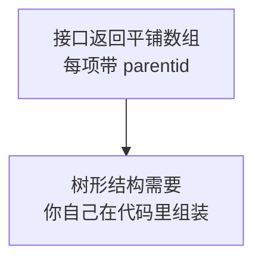

这个设计有它的好处：数据传输简单、没有深度限制。代价是客户端要自己建树，V4 就做这件事。

## 数据模型

`App_Code/Models.cs`：

```csharp
using System.Collections.Generic;

namespace WeComWeb
{
    public class WeComDept
    {
        public int Id { get; set; }
        public string Name { get; set; }
        public int ParentId { get; set; }
        public long Order { get; set; }

        // 建树时用，不来自接口
        public List<WeComDept> Children = new List<WeComDept>();
    }

    public class WeComUser
    {
        public string UserId { get; set; }
        public string Name { get; set; }
        public string Mobile { get; set; }
        public string Email { get; set; }
        public string Position { get; set; }
        public int MainDeptId { get; set; }
        public int[] Department { get; set; }
        public int Status { get; set; }     // 1已激活 2已禁用 4未激活
    }
}
```

## 接口方法

加到 `WeComApi` 里：

```csharp
/// <summary>取部门列表。返回的是平铺结构，层级在 ParentId 里。</summary>
public static async Task<List<WeComDept>> GetDepartmentsAsync()
{
    string token = await GetContactsTokenAsync();
    string url = string.Format("{0}/department/list?access_token={1}",
        BaseUrl, token);

    JObject obj = await GetJsonAsync(url);

    var list = new List<WeComDept>();
    foreach (JToken item in obj["department"])
    {
        list.Add(new WeComDept
        {
            Id = item.Value<int>("id"),
            Name = item.Value<string>("name"),
            ParentId = item.Value<int>("parentid"),
            Order = item.Value<long>("order")
        });
    }
    return list;
}
```

## 如果这里报 60011

**几乎一定是 Secret 拿错了。**

检查顺序：

1. `Web.config` 里 `WeCom.ContactsSecret` 是否填的是通讯录 Secret
2. 代码里调的是 `GetContactsTokenAsync` 还是 `GetAppTokenAsync`
3. 后台「管理工具 → 通讯录同步」是否已开启 API 接口同步
4. 通讯录同步页面的可信 IP 是否包含本机出口 IP

第 4 项容易漏：第 1 章讲过可信 IP 要在**两个地方**分别配置，应用和通讯录各一份。

## V3 的问题

拿到的是平铺列表，页面上看不出「技术部在公司总部下面」。

---

# V4：部门树展示

## 目标

把平铺列表变成可展开的树。

## 原理：两遍扫描建树

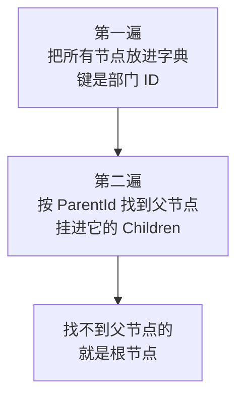

为什么要两遍：因为接口返回的顺序不保证父在子前面。如果只扫一遍，处理子部门时父部门可能还没进字典。

## 建树代码

```csharp
/// <summary>把平铺部门列表组装成树，返回根节点集合。</summary>
public static List<WeComDept> BuildTree(List<WeComDept> flat)
{
    // 第一遍：全部入字典
    var map = new Dictionary<int, WeComDept>();
    foreach (WeComDept d in flat)
    {
        d.Children.Clear();
        map[d.Id] = d;
    }

    // 第二遍：挂到父节点下
    var roots = new List<WeComDept>();
    foreach (WeComDept d in flat)
    {
        WeComDept parent;
        if (d.ParentId != 0 && map.TryGetValue(d.ParentId, out parent))
        {
            parent.Children.Add(d);
        }
        else
        {
            // parentid 为 0，或父部门不在返回里，都当根节点
            roots.Add(d);
        }
    }

    // 按 order 排序，与企业微信后台显示顺序一致
    SortRecursive(roots);
    return roots;
}

private static void SortRecursive(List<WeComDept> nodes)
{
    nodes.Sort((a, b) => b.Order.CompareTo(a.Order));   // order 大的在前
    foreach (WeComDept n in nodes)
    {
        SortRecursive(n.Children);
    }
}
```

## 为什么「父部门不在返回里」也要当根节点

这是一个防御性处理。如果用应用 Secret 调用，只能看到可见范围内的部门，可能出现「子部门可见但父部门不可见」的情况。

不做这个处理，那些孤儿节点会凭空消失，用户看到的部门树是不完整的，还很难发现原因。

## 页面

`DepartmentTree.aspx`：

```aspx
<%@ Page Language="C#" Async="true" AutoEventWireup="true"
    CodeBehind="DepartmentTree.aspx.cs" Inherits="WeComWeb.DepartmentTree" %>
<!DOCTYPE html>
<html>
<head runat="server">
    <meta name="viewport" content="width=device-width, initial-scale=1" />
    <title>部门结构</title>
</head>
<body>
    <form id="form1" runat="server">
        <asp:Label ID="lblInfo" runat="server" />
        <asp:TreeView ID="tvDept" runat="server" ShowLines="true"
                      ExpandDepth="2" />
        <asp:Literal ID="litError" runat="server" />
    </form>
</body>
</html>
```

## 后台

```csharp
using System;
using System.Collections.Generic;
using System.Threading.Tasks;
using System.Web.UI;
using System.Web.UI.WebControls;

namespace WeComWeb
{
    public partial class DepartmentTree : Page
    {
        protected void Page_Load(object sender, EventArgs e)
        {
            if (!IsPostBack)
            {
                RegisterAsyncTask(new PageAsyncTask(LoadTreeAsync));
            }
        }

        private async Task LoadTreeAsync()
        {
            try
            {
                List<WeComDept> flat = await WeComApi.GetDepartmentsAsync();
                List<WeComDept> roots = WeComApi.BuildTree(flat);

                tvDept.Nodes.Clear();
                foreach (WeComDept root in roots)
                {
                    tvDept.Nodes.Add(CreateNode(root));
                }

                lblInfo.Text = string.Format("共 {0} 个部门<br/>", flat.Count);
            }
            catch (WeComException ex)
            {
                litError.Text = "接口错误：" + Server.HtmlEncode(ex.Message);
            }
        }

        /// <summary>递归创建树节点。</summary>
        private TreeNode CreateNode(WeComDept dept)
        {
            var node = new TreeNode(
                string.Format("{0} ({1})", dept.Name, dept.Id),
                dept.Id.ToString());

            // 点击部门跳到成员列表
            node.NavigateUrl = "EmployeeList.aspx?deptId=" + dept.Id;

            foreach (WeComDept child in dept.Children)
            {
                node.ChildNodes.Add(CreateNode(child));
            }
            return node;
        }
    }
}
```

## 一个细节：为什么只在 `!IsPostBack` 时加载

`TreeView` 的节点会保存在 ViewState 里。每次回发都重新调接口既慢又浪费配额。

## V4 的问题

点击部门跳转到了成员列表页，但那个页面还不存在。

---

# V5：成员列表页

## 目标

显示某个部门下的成员。

## 两个可选接口

| 接口 | 返回字段 | 适用 |
|---|---|---|
| `user/simplelist` | 只有 UserId、姓名、部门 | 列表展示，数据量小 |
| `user/list` | 完整资料，含手机、邮箱、职务 | 需要详细信息时 |

```text
GET {BaseUrl}/user/list?access_token=TOKEN&department_id=1&fetch_child=1
```

`fetch_child=1` 表示递归取子部门成员，`0` 表示只取本部门（参数说明参见[企业微信获取部门成员接口讨论](https://github.com/Wechat-Group/WxJava/issues/246)。内容已改写以符合授权要求）。

## 一个已知的注意点

有开发者反馈，用 `fetch_child=1` 递归查询时，**深层子部门的成员有时不完整**（参见[递归获取部门成员的讨论](https://developers.weixin.qq.com/community/personal/oCJUsw3QRrMBnzlC7hABiPlxQkzw/question)。内容已改写以符合授权要求）。

如果你遇到人数对不上，改用更可靠的做法：**先取完整部门列表，再逐个部门用 `fetch_child=0` 查询，最后按 UserId 去重。**

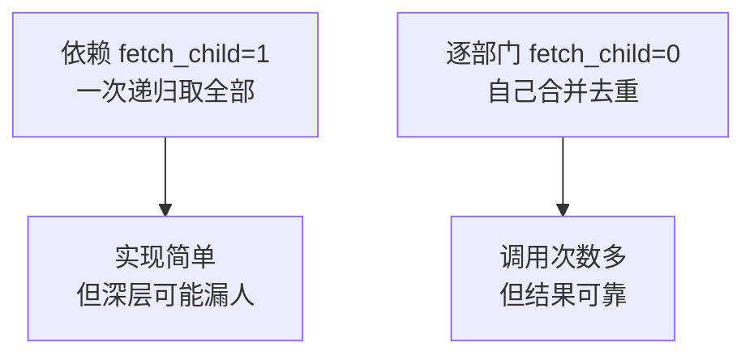

V7 做全量同步时会用后一种方式，因为同步的准确性比调用次数更重要。

## 接口方法

```csharp
/// <summary>取部门成员详情。fetchChild 为 true 时递归子部门。</summary>
public static async Task<List<WeComUser>> GetDeptUsersAsync(
    int deptId, bool fetchChild)
{
    string token = await GetContactsTokenAsync();
    string url = string.Format(
        "{0}/user/list?access_token={1}&department_id={2}&fetch_child={3}",
        BaseUrl, token, deptId, fetchChild ? 1 : 0);

    JObject obj = await GetJsonAsync(url);

    var list = new List<WeComUser>();
    JToken arr = obj["userlist"];
    if (arr == null)
    {
        return list;
    }

    foreach (JToken item in arr)
    {
        list.Add(ParseUser(item));
    }
    return list;
}

private static WeComUser ParseUser(JToken item)
{
    var user = new WeComUser
    {
        UserId = item.Value<string>("userid"),
        Name = item.Value<string>("name"),
        Mobile = item.Value<string>("mobile"),
        Email = item.Value<string>("email"),
        Position = item.Value<string>("position"),
        Status = item.Value<int?>("status") ?? 0
    };

    // department 是数组，可能不存在
    JToken depts = item["department"];
    if (depts != null)
    {
        var ids = new List<int>();
        foreach (JToken d in depts)
        {
            ids.Add((int)d);
        }
        user.Department = ids.ToArray();
        user.MainDeptId = item.Value<int?>("main_department")
                          ?? (ids.Count > 0 ? ids[0] : 0);
    }
    return user;
}
```

## 为什么到处用 `Value<int?>() ?? 默认值`

```csharp
Status = item.Value<int?>("status") ?? 0
```

因为**企业微信返回的字段不保证都存在**。字段缺失时用可空类型取会得到 `null`，再用 `??` 给默认值，程序不会崩。

如果直接写 `item.Value<int>("status")`，遇到字段缺失会抛异常。这类问题在测试环境不出现、生产环境偶发，很难查。

## 页面

`EmployeeList.aspx`：

```aspx
<%@ Page Language="C#" Async="true" AutoEventWireup="true"
    CodeBehind="EmployeeList.aspx.cs" Inherits="WeComWeb.EmployeeList" %>
<!DOCTYPE html>
<html>
<head runat="server">
    <meta name="viewport" content="width=device-width, initial-scale=1" />
    <title>部门成员</title>
    <style>
        table { border-collapse: collapse; width: 100%; }
        th, td { border: 1px solid #ddd; padding: 6px; font-size: 14px; }
        th { background: #f5f5f5; }
    </style>
</head>
<body>
    <form id="form1" runat="server">
        <asp:Label ID="lblTitle" runat="server" />
        <asp:CheckBox ID="chkChild" runat="server" Text="包含子部门"
                      AutoPostBack="true"
                      OnCheckedChanged="chkChild_CheckedChanged" />
        <asp:GridView ID="gvUsers" runat="server" AutoGenerateColumns="false">
            <Columns>
                <asp:BoundField DataField="UserId" HeaderText="账号" />
                <asp:BoundField DataField="Name" HeaderText="姓名" />
                <asp:BoundField DataField="Position" HeaderText="职务" />
                <asp:BoundField DataField="Mobile" HeaderText="手机" />
                <asp:HyperLinkField HeaderText="操作" Text="详情"
                    DataNavigateUrlFields="UserId"
                    DataNavigateUrlFormatString="EmployeeDetail.aspx?userId={0}" />
            </Columns>
        </asp:GridView>
        <asp:Literal ID="litError" runat="server" />
    </form>
</body>
</html>
```

## 后台

```csharp
using System;
using System.Collections.Generic;
using System.Threading.Tasks;
using System.Web.UI;

namespace WeComWeb
{
    public partial class EmployeeList : Page
    {
        private int DeptId
        {
            get
            {
                int id;
                // 一定要用 TryParse：QueryString 是用户可控的
                return int.TryParse(Request.QueryString["deptId"], out id) ? id : 1;
            }
        }

        protected void Page_Load(object sender, EventArgs e)
        {
            RegisterAsyncTask(new PageAsyncTask(LoadUsersAsync));
        }

        protected void chkChild_CheckedChanged(object sender, EventArgs e)
        {
            // 勾选状态变化后重新加载，Page_Load 已注册任务，这里无需重复
        }

        private async Task LoadUsersAsync()
        {
            try
            {
                List<WeComUser> users =
                    await WeComApi.GetDeptUsersAsync(DeptId, chkChild.Checked);

                gvUsers.DataSource = users;
                gvUsers.DataBind();

                lblTitle.Text = string.Format("部门 {0} 共 {1} 人　",
                    DeptId, users.Count);
            }
            catch (WeComException ex)
            {
                litError.Text = "接口错误：" + Server.HtmlEncode(ex.Message);
            }
        }
    }
}
```

## 关于 `int.TryParse`

```csharp
return int.TryParse(Request.QueryString["deptId"], out id) ? id : 1;
```

`QueryString` 的内容完全由用户控制，可能是 `abc`，也可能是恶意构造的字符串。

**用 `TryParse` 而不是 `Convert.ToInt32`**：后者遇到非数字会抛异常，页面显示黄页。前者失败时给个默认值，页面照常工作。

这也顺带阻断了通过这个参数做注入的可能——它已经被强制转成整数了。

## V5 的问题

列表里的信息有限，看不到邮箱、所属多部门这些细节。

---

# V6：员工详情页

## 目标

显示单个员工的完整资料。

## 接口

```text
GET {BaseUrl}/user/get?access_token=TOKEN&userid=USERID
```

## 接口方法

```csharp
/// <summary>取单个成员详情。</summary>
public static async Task<WeComUser> GetUserAsync(string userId)
{
    string token = await GetContactsTokenAsync();
    string url = string.Format("{0}/user/get?access_token={1}&userid={2}",
        BaseUrl, token, Uri.EscapeDataString(userId));

    JObject obj = await GetJsonAsync(url);
    return ParseUser(obj);
}
```

## 为什么要 `Uri.EscapeDataString`

UserId 可能含特殊字符。不编码的话，一个含 `&` 的 UserId 会把 URL 参数结构破坏掉：

```text
未编码：...&userid=zhang&san     ← san 被当成新参数
已编码：...&userid=zhang%26san   ← 正确
```

**所有拼进 URL 的动态值都要做这个处理。**

## 页面

`EmployeeDetail.aspx`：

```aspx
<%@ Page Language="C#" Async="true" AutoEventWireup="true"
    CodeBehind="EmployeeDetail.aspx.cs" Inherits="WeComWeb.EmployeeDetail" %>
<!DOCTYPE html>
<html>
<head runat="server">
    <meta name="viewport" content="width=device-width, initial-scale=1" />
    <title>员工详情</title>
</head>
<body>
    <form id="form1" runat="server">
        <asp:Literal ID="litDetail" runat="server" />
        <br />
        <asp:HyperLink ID="lnkBack" runat="server" Text="返回" />
    </form>
</body>
</html>
```

## 后台

```csharp
using System;
using System.Text;
using System.Threading.Tasks;
using System.Web.UI;

namespace WeComWeb
{
    public partial class EmployeeDetail : Page
    {
        protected void Page_Load(object sender, EventArgs e)
        {
            RegisterAsyncTask(new PageAsyncTask(LoadDetailAsync));
        }

        private async Task LoadDetailAsync()
        {
            string userId = Request.QueryString["userId"];
            if (string.IsNullOrWhiteSpace(userId))
            {
                litDetail.Text = "缺少 userId 参数";
                return;
            }

            try
            {
                WeComUser u = await WeComApi.GetUserAsync(userId);

                var sb = new StringBuilder();
                sb.Append("<table border='1' cellpadding='6' style='border-collapse:collapse'>");
                AppendRow(sb, "账号", u.UserId);
                AppendRow(sb, "姓名", u.Name);
                AppendRow(sb, "职务", u.Position);
                AppendRow(sb, "手机", u.Mobile);
                AppendRow(sb, "邮箱", u.Email);
                AppendRow(sb, "主部门", u.MainDeptId.ToString());
                AppendRow(sb, "所属部门",
                    u.Department == null ? "" : string.Join("、", u.Department));
                AppendRow(sb, "状态", DescribeStatus(u.Status));
                sb.Append("</table>");

                litDetail.Text = sb.ToString();
                lnkBack.NavigateUrl = "EmployeeList.aspx?deptId=" + u.MainDeptId;
            }
            catch (WeComException ex)
            {
                litDetail.Text = "查询失败：" + Server.HtmlEncode(ex.Message);
            }
        }

        /// <summary>输出一行。所有值都做 HTML 编码。</summary>
        private void AppendRow(StringBuilder sb, string label, string value)
        {
            sb.AppendFormat("<tr><th align='left'>{0}</th><td>{1}</td></tr>",
                Server.HtmlEncode(label),
                Server.HtmlEncode(value ?? ""));
        }

        private string DescribeStatus(int status)
        {
            switch (status)
            {
                case 1: return "已激活";
                case 2: return "已禁用";
                case 4: return "未激活";
                case 5: return "退出企业";
                default: return "未知(" + status + ")";
            }
        }
    }
}
```

## 为什么每个值都要 `Server.HtmlEncode`

因为通讯录里的姓名、职务是**人填的**，可能包含 `<`、`>`、`&` 这类字符。

直接拼进 HTML 会破坏页面结构，如果内容里有脚本标签，还会造成跨站脚本问题。虽然通讯录数据来自内部，但**只要是拼进 HTML 的动态内容，就一律编码**，这是一个不需要判断场景的习惯。

## 手机和邮箱可能是空的

企业微信对敏感字段有权限控制。用通讯录 Secret 通常能拿到完整资料，但如果字段在后台被隐藏，或者用了应用 Secret，`mobile` 和 `email` 可能返回空。

代码里用 `?? ""` 处理了这种情况，页面显示空白而不是报错。

## V6 的问题

到目前为止每次查询都要调接口。页面慢，而且**无法按姓名搜索**——企业微信没有提供这样的接口。


---

# V7：同步到 SQL Server

## 目标

把通讯录同步到本地表，为搜索和分页做准备。

## 原理：为什么必须同步到本地

三个理由，第一个是决定性的：

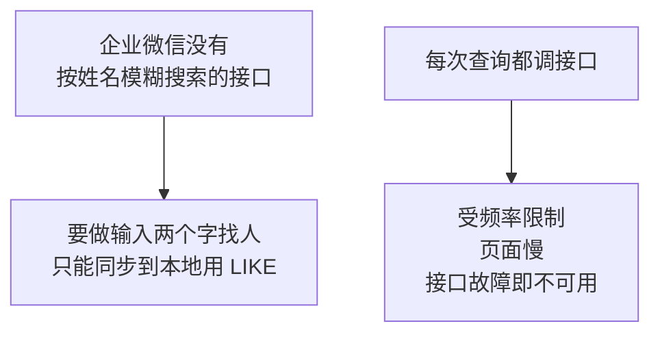

| 理由 | 说明 |
|---|---|
| 接口不支持模糊搜索 | 只能按 UserId 精确查，或按部门列举 |
| 性能 | 本地查询毫秒级，接口调用几百毫秒 |
| 可用性 | 企业微信故障时，本地数据仍可查 |

## 原理：用哪种同步方式

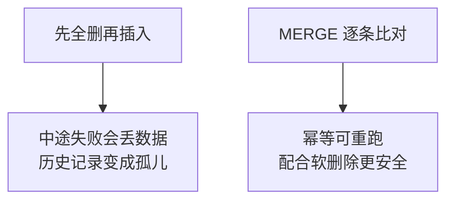

**不要用「先 DELETE 再 INSERT」。**第 3 章讲过软删除的理由：历史消息记录还引用着这些人。硬删除会让那些记录查不到是谁。

## 原理：怎么识别离职员工

用一个时间戳技巧，不需要先查再比对：

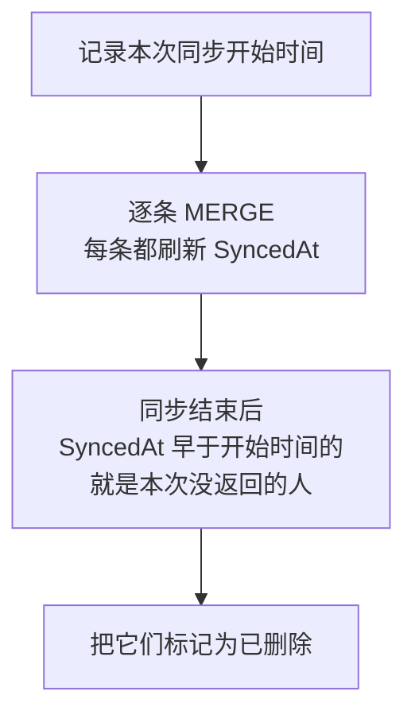

这个方法的好处是**不需要在内存里保存全公司名单做差集**，几万人也不占内存。

## 同步代码

`App_Code/ContactSync.cs`：

```csharp
using System;
using System.Collections.Generic;
using System.Configuration;
using System.Data;
using System.Data.SqlClient;
using System.Threading.Tasks;

namespace WeComWeb
{
    /// <summary>通讯录同步。</summary>
    public static class ContactSync
    {
        private static string ConnStr
        {
            get
            {
                return ConfigurationManager
                    .ConnectionStrings["WeComDb"].ConnectionString;
            }
        }

        public class SyncResult
        {
            public int DeptTotal;
            public int UserTotal;
            public int DeptDeleted;
            public int UserDeleted;
            public TimeSpan Elapsed;
            public List<string> Warnings = new List<string>();
        }

        /// <summary>全量同步部门和成员。</summary>
        public static async Task<SyncResult> SyncAllAsync()
        {
            var result = new SyncResult();
            DateTime startAt = DateTime.Now;

            // ---------- 第一步：部门 ----------
            List<WeComDept> depts = await WeComApi.GetDepartmentsAsync();
            result.DeptTotal = depts.Count;

            // ---------- 第二步：成员 ----------
            // 逐部门用 fetch_child=0 查询后合并去重。
            // 不用 fetch_child=1，因为深层子部门可能漏人（见 V5 说明）。
            var userMap = new Dictionary<string, WeComUser>(
                StringComparer.OrdinalIgnoreCase);

            foreach (WeComDept d in depts)
            {
                try
                {
                    List<WeComUser> users =
                        await WeComApi.GetDeptUsersAsync(d.Id, false);
                    foreach (WeComUser u in users)
                    {
                        // 一人可属多部门，字典自动去重
                        userMap[u.UserId] = u;
                    }
                }
                catch (WeComException ex)
                {
                    // 单个部门失败不中断整体同步，记下来继续
                    result.Warnings.Add(string.Format(
                        "部门 {0}（{1}）查询失败：{2}", d.Id, d.Name, ex.Message));
                }
            }
            result.UserTotal = userMap.Count;

            // ---------- 第三步：写库 ----------
            using (var conn = new SqlConnection(ConnStr))
            {
                await conn.OpenAsync();

                foreach (WeComDept d in depts)
                {
                    UpsertDept(conn, d);
                }
                foreach (WeComUser u in userMap.Values)
                {
                    UpsertUser(conn, u);
                }

                // ---------- 第四步：标记本次未返回的为已删除 ----------
                // 只有成员全部成功时才做，避免部分失败导致误删
                if (result.Warnings.Count == 0)
                {
                    result.DeptDeleted = MarkDeleted(conn,
                        "WeComDepartment", startAt);
                    result.UserDeleted = MarkDeleted(conn,
                        "WeComEmployee", startAt);
                }
                else
                {
                    result.Warnings.Add(
                        "存在部门查询失败，已跳过离职标记以避免误删");
                }
            }

            result.Elapsed = DateTime.Now - startAt;
            return result;
        }

        private static void UpsertDept(SqlConnection conn, WeComDept d)
        {
            const string sql = @"
MERGE WeComDepartment AS t
USING (SELECT @Id AS DeptId) AS s ON t.DeptId = s.DeptId
WHEN MATCHED THEN
    UPDATE SET Name = @Name, ParentId = @ParentId, OrderNo = @OrderNo,
               IsDeleted = 0, SyncedAt = SYSDATETIME()
WHEN NOT MATCHED THEN
    INSERT (DeptId, Name, ParentId, OrderNo)
    VALUES (@Id, @Name, @ParentId, @OrderNo);";

            using (var cmd = new SqlCommand(sql, conn))
            {
                cmd.Parameters.Add(new SqlParameter("@Id", SqlDbType.Int)
                    { Value = d.Id });
                cmd.Parameters.Add(new SqlParameter("@Name", SqlDbType.NVarChar, 100)
                    { Value = (object)d.Name ?? DBNull.Value });
                cmd.Parameters.Add(new SqlParameter("@ParentId", SqlDbType.Int)
                    { Value = d.ParentId });
                cmd.Parameters.Add(new SqlParameter("@OrderNo", SqlDbType.BigInt)
                    { Value = d.Order });
                cmd.ExecuteNonQuery();
            }
        }

        private static void UpsertUser(SqlConnection conn, WeComUser u)
        {
            const string sql = @"
MERGE WeComEmployee AS t
USING (SELECT @UserId AS UserId) AS s ON t.UserId = s.UserId
WHEN MATCHED THEN
    UPDATE SET Name = @Name, Mobile = @Mobile, Email = @Email,
               Position = @Position, MainDeptId = @MainDeptId,
               DeptIds = @DeptIds, Enabled = @Enabled,
               IsDeleted = 0, SyncedAt = SYSDATETIME()
WHEN NOT MATCHED THEN
    INSERT (UserId, Name, Mobile, Email, Position,
            MainDeptId, DeptIds, Enabled)
    VALUES (@UserId, @Name, @Mobile, @Email, @Position,
            @MainDeptId, @DeptIds, @Enabled);";

            using (var cmd = new SqlCommand(sql, conn))
            {
                cmd.Parameters.Add(new SqlParameter("@UserId", SqlDbType.NVarChar, 64)
                    { Value = u.UserId });
                cmd.Parameters.Add(new SqlParameter("@Name", SqlDbType.NVarChar, 100)
                    { Value = (object)u.Name ?? DBNull.Value });
                cmd.Parameters.Add(new SqlParameter("@Mobile", SqlDbType.NVarChar, 32)
                    { Value = (object)u.Mobile ?? DBNull.Value });
                cmd.Parameters.Add(new SqlParameter("@Email", SqlDbType.NVarChar, 100)
                    { Value = (object)u.Email ?? DBNull.Value });
                cmd.Parameters.Add(new SqlParameter("@Position", SqlDbType.NVarChar, 100)
                    { Value = (object)u.Position ?? DBNull.Value });
                cmd.Parameters.Add(new SqlParameter("@MainDeptId", SqlDbType.Int)
                    { Value = u.MainDeptId });
                cmd.Parameters.Add(new SqlParameter("@DeptIds", SqlDbType.NVarChar, 200)
                    { Value = u.Department == null
                        ? (object)DBNull.Value
                        : string.Join(",", u.Department) });
                cmd.Parameters.Add(new SqlParameter("@Enabled", SqlDbType.Bit)
                    { Value = u.Status == 1 });
                cmd.ExecuteNonQuery();
            }
        }

        /// <summary>把 SyncedAt 早于本次开始时间的记录标记为已删除。</summary>
        private static int MarkDeleted(SqlConnection conn, string table,
            DateTime startAt)
        {
            string sql = string.Format(@"
UPDATE {0} SET IsDeleted = 1
WHERE IsDeleted = 0 AND SyncedAt < @StartAt;", table);

            using (var cmd = new SqlCommand(sql, conn))
            {
                cmd.Parameters.Add(new SqlParameter("@StartAt", SqlDbType.DateTime2)
                    { Value = startAt });
                return cmd.ExecuteNonQuery();
            }
        }
    }
}
```

## 三个关键设计

### 单个部门失败不中断整体

```csharp
catch (WeComException ex)
{
    result.Warnings.Add(...);
}
```

如果一个部门因为权限问题查不了，整个同步不该失败。记下警告继续处理其他部门。

### 有警告时跳过离职标记

```csharp
if (result.Warnings.Count == 0) { MarkDeleted(...); }
```

**这是最重要的一处保护。**

假设某次同步有 3 个部门查询失败，那些部门的成员本次没被刷新 `SyncedAt`。如果照常执行离职标记，**这些在职员工会被误标为离职**。

所以规则是：**只有数据完整时才敢标记删除。**

### 参数化查询

所有 SQL 都用 `SqlParameter`，没有一处字符串拼接。姓名里的单引号不会破坏语句，也杜绝了注入。

## 同步页面

`SyncContacts.aspx`：

```aspx
<%@ Page Language="C#" Async="true" AutoEventWireup="true"
    CodeBehind="SyncContacts.aspx.cs" Inherits="WeComWeb.SyncContacts" %>
<!DOCTYPE html>
<html>
<head runat="server"><title>同步通讯录</title></head>
<body>
    <form id="form1" runat="server">
        <asp:Button ID="btnSync" runat="server" Text="开始全量同步"
                    OnClick="btnSync_Click" />
        <hr />
        <asp:Literal ID="litLog" runat="server" />
    </form>
</body>
</html>
```

```csharp
protected void btnSync_Click(object sender, EventArgs e)
{
    btnSync.Enabled = false;      // 防止重复点击
    RegisterAsyncTask(new PageAsyncTask(DoSyncAsync));
}

private async Task DoSyncAsync()
{
    try
    {
        ContactSync.SyncResult r = await ContactSync.SyncAllAsync();

        var sb = new StringBuilder();
        sb.AppendFormat("同步完成，耗时 {0:F1} 秒<br/>", r.Elapsed.TotalSeconds);
        sb.AppendFormat("部门 {0} 个，成员 {1} 人<br/>", r.DeptTotal, r.UserTotal);
        sb.AppendFormat("标记离职：部门 {0} 个，成员 {1} 人<br/>",
            r.DeptDeleted, r.UserDeleted);

        if (r.Warnings.Count > 0)
        {
            sb.Append("<br/><b>警告：</b><br/>");
            foreach (string w in r.Warnings)
            {
                sb.Append(Server.HtmlEncode(w) + "<br/>");
            }
        }
        litLog.Text = sb.ToString();
    }
    catch (Exception ex)
    {
        litLog.Text = "同步失败：" + Server.HtmlEncode(ex.Message);
    }
    finally
    {
        btnSync.Enabled = true;
    }
}
```

## 一个部署提醒

全量同步会调用「部门数 + 1」次接口。几百个部门就是几百次调用，可能需要几十秒。

页面默认的执行超时是 110 秒。部门很多时要调大：

```xml
<system.web>
  <httpRuntime executionTimeout="600" targetFramework="4.6.1" />
</system.web>
```

更好的做法是**把全量同步做成定时任务**而不是页面按钮。但这超出本章范围，第 12 章会提到。

## V7 的问题

数据同步到本地了，但页面还在直接调接口，没用上本地数据。

---

# V8：模糊搜索与分页

## 目标

从本地表按姓名模糊搜索，并支持分页。

## 原理：分页要在数据库里做

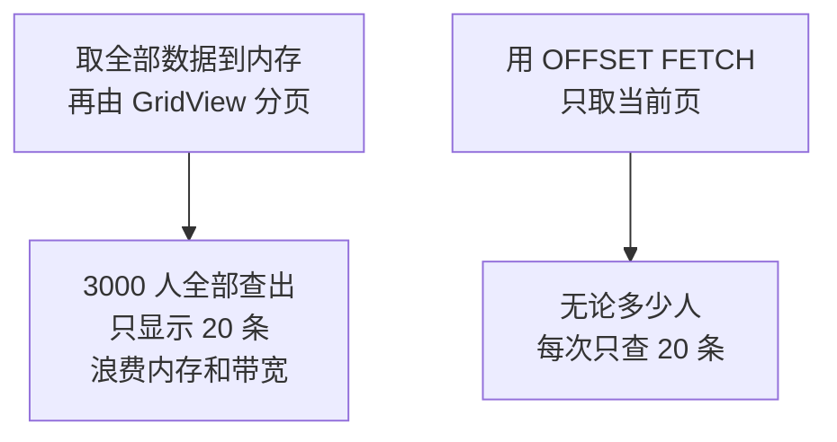

`GridView` 自带的分页属于前一种，数据量大时不可取。

## 查询代码

`App_Code/EmployeeRepository.cs`：

```csharp
using System;
using System.Collections.Generic;
using System.Configuration;
using System.Data;
using System.Data.SqlClient;

namespace WeComWeb
{
    public class EmployeeRow
    {
        public string UserId { get; set; }
        public string Name { get; set; }
        public string Position { get; set; }
        public string Mobile { get; set; }
        public string DeptName { get; set; }
        public bool Enabled { get; set; }
        public DateTime SyncedAt { get; set; }
    }

    public static class EmployeeRepository
    {
        private static string ConnStr
        {
            get
            {
                return ConfigurationManager
                    .ConnectionStrings["WeComDb"].ConnectionString;
            }
        }

        /// <summary>分页搜索。keyword 匹配姓名或账号，deptId 为 0 表示全部。</summary>
        public static List<EmployeeRow> Search(string keyword, int deptId,
            bool includeDisabled, int pageIndex, int pageSize, out int total)
        {
            const string where = @"
FROM WeComEmployee e
LEFT JOIN WeComDepartment d ON d.DeptId = e.MainDeptId
WHERE e.IsDeleted = 0
  AND (@Keyword = '' OR e.Name LIKE @Like OR e.UserId LIKE @Like)
  AND (@DeptId = 0 OR e.MainDeptId = @DeptId)
  AND (@IncludeDisabled = 1 OR e.Enabled = 1)";

            string countSql = "SELECT COUNT(*) " + where;

            string pageSql = @"
SELECT e.UserId, e.Name, e.Position, e.Mobile,
       d.Name AS DeptName, e.Enabled, e.SyncedAt
" + where + @"
ORDER BY e.Name
OFFSET @Skip ROWS FETCH NEXT @Take ROWS ONLY;";

            var list = new List<EmployeeRow>();

            using (var conn = new SqlConnection(ConnStr))
            {
                conn.Open();

                using (var cmd = new SqlCommand(countSql, conn))
                {
                    AddSearchParams(cmd, keyword, deptId, includeDisabled);
                    total = (int)cmd.ExecuteScalar();
                }

                using (var cmd = new SqlCommand(pageSql, conn))
                {
                    AddSearchParams(cmd, keyword, deptId, includeDisabled);
                    cmd.Parameters.Add(new SqlParameter("@Skip", SqlDbType.Int)
                        { Value = pageIndex * pageSize });
                    cmd.Parameters.Add(new SqlParameter("@Take", SqlDbType.Int)
                        { Value = pageSize });

                    using (SqlDataReader r = cmd.ExecuteReader())
                    {
                        while (r.Read())
                        {
                            list.Add(new EmployeeRow
                            {
                                UserId = r["UserId"] as string,
                                Name = r["Name"] as string,
                                Position = r["Position"] as string,
                                Mobile = r["Mobile"] as string,
                                DeptName = r["DeptName"] as string,
                                Enabled = r["Enabled"] != DBNull.Value
                                          && (bool)r["Enabled"],
                                SyncedAt = (DateTime)r["SyncedAt"]
                            });
                        }
                    }
                }
            }
            return list;
        }

        private static void AddSearchParams(SqlCommand cmd, string keyword,
            int deptId, bool includeDisabled)
        {
            keyword = (keyword ?? "").Trim();

            cmd.Parameters.Add(new SqlParameter("@Keyword", SqlDbType.NVarChar, 100)
                { Value = keyword });

            // 转义 LIKE 的通配符，否则用户输入 % 会匹配全部
            string escaped = keyword
                .Replace("[", "[[]")
                .Replace("%", "[%]")
                .Replace("_", "[_]");
            cmd.Parameters.Add(new SqlParameter("@Like", SqlDbType.NVarChar, 110)
                { Value = "%" + escaped + "%" });

            cmd.Parameters.Add(new SqlParameter("@DeptId", SqlDbType.Int)
                { Value = deptId });
            cmd.Parameters.Add(new SqlParameter("@IncludeDisabled", SqlDbType.Bit)
                { Value = includeDisabled });
        }

        /// <summary>取缓存新鲜度，用于页面提示。</summary>
        public static DateTime? GetLastSyncTime()
        {
            using (var conn = new SqlConnection(ConnStr))
            {
                conn.Open();
                using (var cmd = new SqlCommand(
                    "SELECT MAX(SyncedAt) FROM WeComEmployee", conn))
                {
                    object v = cmd.ExecuteScalar();
                    return v == null || v == DBNull.Value
                        ? (DateTime?)null : (DateTime)v;
                }
            }
        }
    }
}
```

## 三个必须讲清的细节

### LIKE 的通配符要转义

```csharp
string escaped = keyword.Replace("[", "[[]").Replace("%", "[%]").Replace("_", "[_]");
```

如果用户在搜索框输入一个 `%`，未转义时会变成 `LIKE '%%%'`，匹配所有人。输入 `_` 则匹配任意单字符。

这不是安全问题（参数化已经防了注入），而是**功能正确性问题**：用户搜 `%` 应该是找名字里带百分号的人。

注意 `[` 要先替换，否则会把后面替换产生的中括号又替换一遍。

### 前导 `%` 会让索引失效

```sql
e.Name LIKE '%张%'
```

第 3 章给 `Name` 建了索引，但**前导通配符的 LIKE 用不上索引**，会全表扫描。

几千人的表全表扫描只有几毫秒，完全可以接受。**几十万行时才需要考虑全文索引。**这里明确取舍：不为了理论上的性能引入复杂度。

### 用 `as string` 而不是强制转换

```csharp
UserId = r["UserId"] as string,
```

数据库里可能是 `NULL`。用 `as` 转换失败时得到 `null`，而 `(string)` 遇到 `DBNull` 会抛异常。

## 页面

`EmployeeSearch.aspx`：

```aspx
<%@ Page Language="C#" AutoEventWireup="true"
    CodeBehind="EmployeeSearch.aspx.cs" Inherits="WeComWeb.EmployeeSearch" %>
<!DOCTYPE html>
<html>
<head runat="server">
    <meta name="viewport" content="width=device-width, initial-scale=1" />
    <title>员工搜索</title>
    <style>
        table.grid { border-collapse: collapse; width: 100%; }
        table.grid th, table.grid td {
            border: 1px solid #ddd; padding: 6px; font-size: 14px; }
        table.grid th { background: #f5f5f5; }
        .tip { color: #888; font-size: 12px; }
    </style>
</head>
<body>
    <form id="form1" runat="server">
        <asp:TextBox ID="txtKeyword" runat="server" placeholder="姓名或账号" />
        <asp:DropDownList ID="ddlDept" runat="server" />
        <asp:CheckBox ID="chkDisabled" runat="server" Text="含已禁用" />
        <asp:Button ID="btnSearch" runat="server" Text="搜索"
                    OnClick="btnSearch_Click" />
        <asp:Button ID="btnExport" runat="server" Text="导出 Excel"
                    OnClick="btnExport_Click" />
        <div class="tip"><asp:Literal ID="litSync" runat="server" /></div>
        <hr />
        <asp:GridView ID="gvList" runat="server" AutoGenerateColumns="false"
                      CssClass="grid">
            <Columns>
                <asp:BoundField DataField="UserId" HeaderText="账号" />
                <asp:BoundField DataField="Name" HeaderText="姓名" />
                <asp:BoundField DataField="DeptName" HeaderText="主部门" />
                <asp:BoundField DataField="Position" HeaderText="职务" />
                <asp:BoundField DataField="Mobile" HeaderText="手机" />
                <asp:HyperLinkField HeaderText="操作" Text="详情"
                    DataNavigateUrlFields="UserId"
                    DataNavigateUrlFormatString="EmployeeDetail.aspx?userId={0}" />
            </Columns>
        </asp:GridView>
        <asp:Label ID="lblPager" runat="server" />
        <asp:Button ID="btnPrev" runat="server" Text="上一页"
                    OnClick="btnPrev_Click" />
        <asp:Button ID="btnNext" runat="server" Text="下一页"
                    OnClick="btnNext_Click" />
    </form>
</body>
</html>
```

## 后台

```csharp
using System;
using System.Collections.Generic;
using System.Web.UI;

namespace WeComWeb
{
    public partial class EmployeeSearch : Page
    {
        private const int PageSize = 20;

        // 当前页码存进 ViewState，回发后仍然保持
        private int PageIndex
        {
            get { return (int)(ViewState["pi"] ?? 0); }
            set { ViewState["pi"] = value; }
        }

        protected void Page_Load(object sender, EventArgs e)
        {
            if (!IsPostBack)
            {
                BindDeptList();
                BindData();
            }
        }

        private void BindDeptList()
        {
            ddlDept.Items.Clear();
            ddlDept.Items.Add(new System.Web.UI.WebControls.ListItem("全部部门", "0"));
            foreach (var d in EmployeeRepository.GetDepartments())
            {
                ddlDept.Items.Add(new System.Web.UI.WebControls.ListItem(
                    d.Name, d.DeptId.ToString()));
            }
        }

        private void BindData()
        {
            int deptId;
            int.TryParse(ddlDept.SelectedValue, out deptId);

            int total;
            List<EmployeeRow> rows = EmployeeRepository.Search(
                txtKeyword.Text, deptId, chkDisabled.Checked,
                PageIndex, PageSize, out total);

            gvList.DataSource = rows;
            gvList.DataBind();

            int totalPages = total == 0 ? 1 : (total + PageSize - 1) / PageSize;
            lblPager.Text = string.Format("共 {0} 人，第 {1}/{2} 页　",
                total, PageIndex + 1, totalPages);

            btnPrev.Enabled = PageIndex > 0;
            btnNext.Enabled = PageIndex < totalPages - 1;

            DateTime? last = EmployeeRepository.GetLastSyncTime();
            litSync.Text = last.HasValue
                ? string.Format("数据同步于 {0:yyyy-MM-dd HH:mm}（{1:F0} 分钟前）",
                    last.Value, (DateTime.Now - last.Value).TotalMinutes)
                : "本地暂无数据，请先执行同步";
        }

        protected void btnSearch_Click(object sender, EventArgs e)
        {
            PageIndex = 0;        // 新搜索回到第一页
            BindData();
        }

        protected void btnPrev_Click(object sender, EventArgs e)
        {
            if (PageIndex > 0) { PageIndex--; }
            BindData();
        }

        protected void btnNext_Click(object sender, EventArgs e)
        {
            PageIndex++;
            BindData();
        }
    }
}
```

## 为什么显示「数据同步于几分钟前」

因为本地数据是缓存，必然有滞后。**用户有权知道他看到的数据有多旧。**

不显示的话，人事刚改了通讯录，用户在页面上查不到，会以为系统坏了。

## 补充仓储方法

```csharp
public class DeptRow
{
    public int DeptId { get; set; }
    public string Name { get; set; }
}

public static List<DeptRow> GetDepartments()
{
    var list = new List<DeptRow>();
    using (var conn = new SqlConnection(ConnStr))
    {
        conn.Open();
        using (var cmd = new SqlCommand(@"
            SELECT DeptId, Name FROM WeComDepartment
            WHERE IsDeleted = 0 ORDER BY OrderNo DESC", conn))
        using (SqlDataReader r = cmd.ExecuteReader())
        {
            while (r.Read())
            {
                list.Add(new DeptRow
                {
                    DeptId = (int)r["DeptId"],
                    Name = r["Name"] as string
                });
            }
        }
    }
    return list;
}
```

## V8 的问题

离职员工被标记了 `IsDeleted`，但没有页面能看到「这次同步谁离职了」。

---

# V9：软删除与差异比较

## 目标

看到本地和企业微信之间的差异。

## 原理：差异分三类

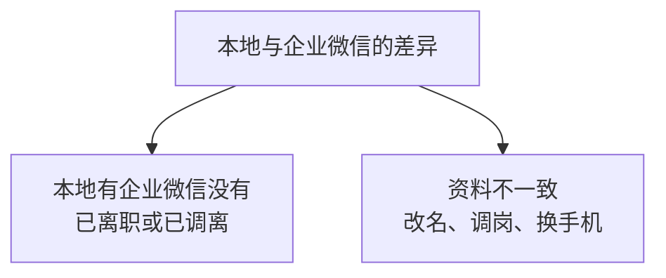

第三类是「企业微信有本地没有」，这类在同步后自动消失，不需要单独看。

## 查询语句

```csharp
/// <summary>取被标记为离职的成员。</summary>
public static List<EmployeeRow> GetDeletedEmployees()
{
    var list = new List<EmployeeRow>();
    using (var conn = new SqlConnection(ConnStr))
    {
        conn.Open();
        using (var cmd = new SqlCommand(@"
            SELECT e.UserId, e.Name, e.Position, e.Mobile,
                   d.Name AS DeptName, e.Enabled, e.SyncedAt
            FROM WeComEmployee e
            LEFT JOIN WeComDepartment d ON d.DeptId = e.MainDeptId
            WHERE e.IsDeleted = 1
            ORDER BY e.SyncedAt DESC", conn))
        using (SqlDataReader r = cmd.ExecuteReader())
        {
            while (r.Read())
            {
                list.Add(new EmployeeRow
                {
                    UserId = r["UserId"] as string,
                    Name = r["Name"] as string,
                    Position = r["Position"] as string,
                    Mobile = r["Mobile"] as string,
                    DeptName = r["DeptName"] as string,
                    SyncedAt = (DateTime)r["SyncedAt"]
                });
            }
        }
    }
    return list;
}
```

## 为什么保留而不删除

一个具体场景：

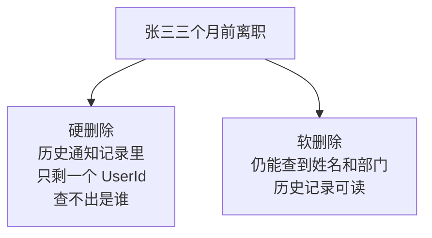

第 4 章的 `MessageRecipient` 表里存的是 `UserId`。要显示「这条通知发给了谁」，必须能从 `WeComEmployee` 查到姓名。人一删，历史记录就变成一串无意义的账号。

## 一个实用的核对查询

同步后如果人数和预期不符，用这个定位：

```sql
-- 本地各部门人数，与企业微信后台对比
SELECT d.Name AS 部门, COUNT(*) AS 人数
FROM WeComEmployee e
JOIN WeComDepartment d ON d.DeptId = e.MainDeptId
WHERE e.IsDeleted = 0
GROUP BY d.Name
ORDER BY 人数 DESC;

-- 没有主部门的人：通常是同步时部门数据不全
SELECT UserId, Name, DeptIds FROM WeComEmployee
WHERE IsDeleted = 0
  AND (MainDeptId IS NULL OR MainDeptId NOT IN
       (SELECT DeptId FROM WeComDepartment));
```

第二个查询很有用。如果它返回了数据，说明**部门同步不完整**，通常是 V7 里出现了警告。

## V9 的问题

数据只能在页面上看，人事想要一份 Excel。

---

# V10：导出 Excel

## 目标

把搜索结果导出成 Excel 能打开的文件。

## 原理：为什么选 CSV

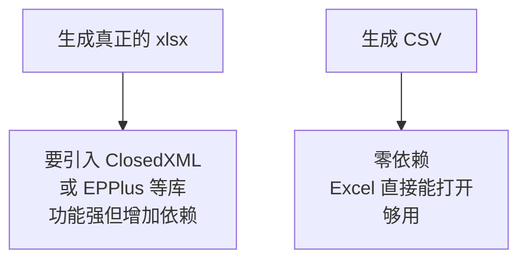

员工名单是简单的二维表，没有合并单元格、公式、多工作表的需求。CSV 完全够用。

## 原理：CSV 中文乱码的真正原因

这是本节的重点。直接写 UTF-8 编码的 CSV，用 Excel 打开会看到乱码。

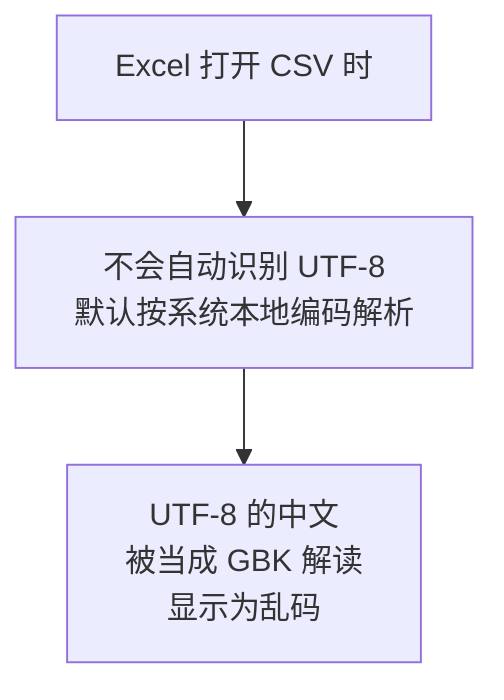

解决办法是在文件开头写入 **UTF-8 BOM**（三个字节 `EF BB BF`）。Excel 看到 BOM 就知道该按 UTF-8 解析。

**注意这只影响 Excel。**用记事本或程序读取时，UTF-8 不带 BOM 也完全正常。所以 BOM 是专门为了迁就 Excel 加的。

## 原理：`Response.End()` 的陷阱

传统 WebForms 导出代码常这样结尾：

```csharp
Response.End();      // 会抛 ThreadAbortException
```

`Response.End()` 内部通过抛出 `ThreadAbortException` 来中止请求。这会造成两个问题：

| 问题 | 说明 |
|---|---|
| 日志里出现异常 | 每次导出都记一条异常，干扰排错 |
| 打断 `finally` 逻辑 | 资源清理可能不按预期执行 |

正确做法是：

```csharp
Response.Flush();
Context.ApplicationInstance.CompleteRequest();
```

`CompleteRequest` 只是跳过后续管道事件，不抛异常。

## 导出代码

```csharp
using System;
using System.Collections.Generic;
using System.Text;
using System.Web;

namespace WeComWeb
{
    public static class CsvExporter
    {
        /// <summary>把员工列表导出为 CSV 并触发下载。</summary>
        public static void ExportEmployees(HttpContext context,
            List<EmployeeRow> rows, string fileName)
        {
            var sb = new StringBuilder();

            // 表头
            sb.AppendLine("账号,姓名,主部门,职务,手机,状态,同步时间");

            foreach (EmployeeRow r in rows)
            {
                sb.AppendLine(string.Join(",",
                    Esc(r.UserId), Esc(r.Name), Esc(r.DeptName),
                    Esc(r.Position), Esc(r.Mobile),
                    Esc(r.Enabled ? "正常" : "已禁用"),
                    Esc(r.SyncedAt.ToString("yyyy-MM-dd HH:mm"))));
            }

            HttpResponse resp = context.Response;
            resp.Clear();
            resp.ContentType = "text/csv";
            resp.Charset = "utf-8";

            // 中文文件名要编码，否则部分浏览器会乱码或截断
            string encoded = HttpUtility.UrlEncode(fileName, Encoding.UTF8);
            resp.AddHeader("Content-Disposition",
                "attachment; filename=" + encoded);

            // 关键：先写 UTF-8 BOM，Excel 才会按 UTF-8 解析
            resp.BinaryWrite(Encoding.UTF8.GetPreamble());
            resp.Write(sb.ToString());

            resp.Flush();
            // 用 CompleteRequest 而不是 Response.End()，避免 ThreadAbortException
            context.ApplicationInstance.CompleteRequest();
        }

        /// <summary>CSV 字段转义。</summary>
        private static string Esc(string value)
        {
            if (string.IsNullOrEmpty(value))
            {
                return "";
            }

            // 手机号这类纯数字前面加制表符，防止 Excel 当成数字丢掉前导零
            bool needQuote = value.Contains(",") || value.Contains("\"")
                             || value.Contains("\n") || value.Contains("\r");

            // 字段内的双引号要变成两个双引号
            string v = value.Replace("\"", "\"\"");

            return needQuote ? "\"" + v + "\"" : v;
        }
    }
}
```

## 页面调用

```csharp
protected void btnExport_Click(object sender, EventArgs e)
{
    int deptId;
    int.TryParse(ddlDept.SelectedValue, out deptId);

    int total;
    // 导出全部匹配结果，不受当前页码限制
    List<EmployeeRow> rows = EmployeeRepository.Search(
        txtKeyword.Text, deptId, chkDisabled.Checked, 0, 100000, out total);

    string fileName = string.Format("员工名单_{0:yyyyMMddHHmm}.csv",
        DateTime.Now);
    CsvExporter.ExportEmployees(Context, rows, fileName);
}
```

## 三个容易忽略的细节

### 导出的是全部结果，不是当前页

```csharp
EmployeeRepository.Search(..., 0, 100000, out total);
```

用户点导出，期望拿到的是所有符合条件的人，而不是屏幕上这 20 条。

### CSV 字段转义规则

姓名或职务里如果有逗号，不转义会把一列拆成两列，整个文件错位。规则是：

| 情况 | 处理 |
|---|---|
| 含逗号、引号、换行 | 整个字段用双引号包起来 |
| 字段内有双引号 | 变成两个双引号 |

### 手机号前导零的问题

Excel 打开 CSV 时会把纯数字当数字处理，`013812345678` 会变成 `13812345678`。

如果这对你有影响，可以把手机号字段写成 `="013812345678"` 这种公式形式。本教程没做这个处理，因为企业微信的手机号通常不带前导零。**但你要知道这个现象存在。**

## V10 的问题

出错时只能看到一行文字，没有留档。管理员事后无法追查发生过什么。

---

# V11：错误处理与日志

## 目标

把接口调用记录写进第 3 章的 `ApiLog` 表。

## 原理：与 Python 共用一张表

第 3 章设计 `ApiLog` 时留了 `Source` 字段。现在它的作用显现出来：

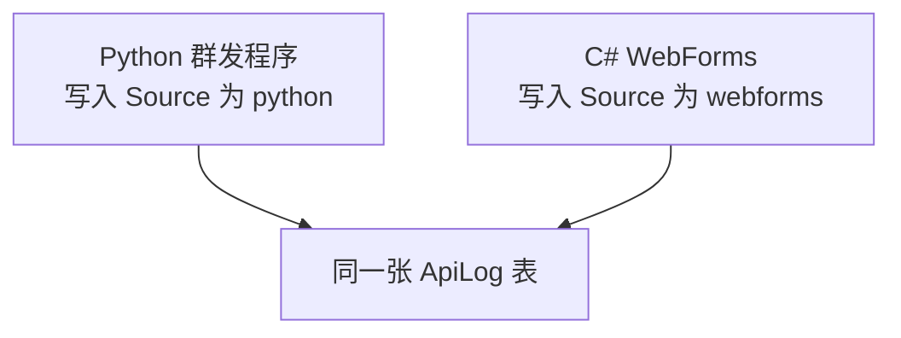

**这是两个程序唯一的交汇点。**它们共享数据，但依然互不调用——Python 不知道 WebForms 存在，反之也一样。

## 原理：不能记什么

| 不能记 | 原因 |
|---|---|
| 完整 URL | 里面含 `access_token`，两小时内可直接用于调接口 |
| 完整 token | 同上 |
| 手机号、邮箱 | 属于个人信息，日志不该长期留存 |

只记接口名、错误码、耗时，足够定位问题。

## 日志类

`App_Code/ApiLogger.cs`：

```csharp
using System;
using System.Configuration;
using System.Data;
using System.Data.SqlClient;

namespace WeComWeb
{
    public static class ApiLogger
    {
        private static string ConnStr
        {
            get
            {
                return ConfigurationManager
                    .ConnectionStrings["WeComDb"].ConnectionString;
            }
        }

        /// <summary>记录一次接口调用。日志失败绝不影响主流程。</summary>
        public static void Log(string apiName, int errCode, string errMsg,
            long elapsedMs)
        {
            try
            {
                using (var conn = new SqlConnection(ConnStr))
                {
                    conn.Open();
                    using (var cmd = new SqlCommand(@"
                        INSERT INTO ApiLog
                            (Source, ApiName, ErrCode, ErrMsg, ElapsedMs)
                        VALUES (@Source, @ApiName, @ErrCode, @ErrMsg, @Elapsed)",
                        conn))
                    {
                        cmd.Parameters.Add(new SqlParameter(
                            "@Source", SqlDbType.NVarChar, 20)
                            { Value = "webforms" });
                        cmd.Parameters.Add(new SqlParameter(
                            "@ApiName", SqlDbType.NVarChar, 100)
                            { Value = apiName });
                        cmd.Parameters.Add(new SqlParameter(
                            "@ErrCode", SqlDbType.Int)
                            { Value = errCode });
                        cmd.Parameters.Add(new SqlParameter(
                            "@ErrMsg", SqlDbType.NVarChar, 500)
                            { Value = string.IsNullOrEmpty(errMsg)
                                ? (object)DBNull.Value
                                : errMsg.Substring(0, Math.Min(500, errMsg.Length)) });
                        cmd.Parameters.Add(new SqlParameter(
                            "@Elapsed", SqlDbType.Int)
                            { Value = (int)elapsedMs });
                        cmd.ExecuteNonQuery();
                    }
                }
            }
            catch
            {
                // 日志写不进去也不能让业务失败，这里必须吞掉异常
            }
        }

        /// <summary>token 脱敏，只留首尾便于比对。</summary>
        public static string MaskToken(string token)
        {
            if (string.IsNullOrEmpty(token) || token.Length < 16)
            {
                return "***";
            }
            return token.Substring(0, 8) + "..."
                   + token.Substring(token.Length - 6);
        }
    }
}
```

## 为什么日志异常要吞掉

```csharp
catch
{
    // 空 catch
}
```

平时应该避免空 `catch`，但这里是有意为之：**日志是辅助功能。**

如果数据库临时不可用导致写日志失败，进而让员工查询页面报错，那就是本末倒置了。

## 接入调用层

改造 `WeComApi.GetJsonAsync`，自动计时和记日志：

```csharp
public static async Task<JObject> GetJsonAsync(string url, string apiName = null)
{
    // 从 URL 里提取接口名，避免把带 token 的完整 URL 记进日志
    if (apiName == null)
    {
        int q = url.IndexOf('?');
        string path = q > 0 ? url.Substring(0, q) : url;
        int slash = path.LastIndexOf('/');
        apiName = slash >= 0 ? path.Substring(slash + 1) : path;
    }

    var watch = System.Diagnostics.Stopwatch.StartNew();
    try
    {
        HttpResponseMessage response = await Client.GetAsync(url);
        response.EnsureSuccessStatusCode();

        string json = await response.Content.ReadAsStringAsync();
        JObject obj = JObject.Parse(json);

        int errcode = obj.Value<int>("errcode");
        watch.Stop();

        ApiLogger.Log(apiName, errcode,
            errcode == 0 ? null : obj.Value<string>("errmsg"),
            watch.ElapsedMilliseconds);

        if (errcode != 0)
        {
            throw new WeComException(errcode, obj.Value<string>("errmsg"));
        }
        return obj;
    }
    catch (WeComException)
    {
        throw;                 // 已经记过日志，直接向上抛
    }
    catch (Exception ex)
    {
        watch.Stop();
        ApiLogger.Log(apiName, -1, ex.Message, watch.ElapsedMilliseconds);
        throw new WeComException(-1, "请求失败：" + ex.Message);
    }
}
```

## 从 URL 提取接口名的意义

```csharp
int q = url.IndexOf('?');
string path = q > 0 ? url.Substring(0, q) : url;
```

**问号后面的部分包含 token，必须切掉。**留下的 `user/list`、`department/list` 这样的路径正好就是接口名。

## 全局异常兜底

`Global.asax.cs`：

```csharp
protected void Application_Error(object sender, EventArgs e)
{
    Exception ex = Server.GetLastError();
    if (ex != null)
    {
        ApiLogger.Log("unhandled", -999,
            ex.GetBaseException().Message, 0);
    }
    // 生产环境应配合 customErrors 跳转到友好页面
}
```

配套在 `Web.config` 里关掉详细错误页：

```xml
<system.web>
  <customErrors mode="RemoteOnly" defaultRedirect="~/Error.aspx" />
</system.web>
```

`RemoteOnly` 的含义是：本机访问显示详细堆栈便于调试，远程访问显示友好页面。**堆栈信息可能暴露文件路径和代码结构，不该给外部看到。**

## 常用运维查询

```sql
-- 最近的失败调用
SELECT TOP 50 Source, ApiName, ErrCode, ErrMsg, ElapsedMs, CreatedAt
FROM ApiLog WHERE ErrCode <> 0 ORDER BY CreatedAt DESC;

-- 各接口平均耗时，找出慢接口
SELECT ApiName, COUNT(*) AS 次数,
       AVG(ElapsedMs) AS 平均毫秒, MAX(ElapsedMs) AS 最慢
FROM ApiLog
WHERE Source = 'webforms' AND CreatedAt >= DATEADD(DAY, -1, SYSDATETIME())
GROUP BY ApiName ORDER BY 平均毫秒 DESC;

-- 两个程序的调用量对比
SELECT Source, COUNT(*) AS 调用次数,
       SUM(CASE WHEN ErrCode <> 0 THEN 1 ELSE 0 END) AS 失败次数
FROM ApiLog
WHERE CreatedAt >= DATEADD(DAY, -1, SYSDATETIME())
GROUP BY Source;
```

最后一个查询能直观看到 Python 和 C# 各自的运行情况，这正是共用 `ApiLog` 表的价值。

---

# V12：集成版

## 文件清单

```text
WeComWeb/
├── Global.asax.cs                  TLS 1.2 设置、全局异常
├── Web.config                      配置与连接串
├── App_Code/
│   ├── WeComApi.cs                 接口封装、token 缓存
│   ├── WeComException.cs           错误码翻译
│   ├── Models.cs                   数据模型
│   ├── ContactSync.cs              通讯录同步
│   ├── EmployeeRepository.cs       本地查询
│   ├── CsvExporter.cs              导出
│   └── ApiLogger.cs                日志
├── DepartmentTree.aspx             部门树
├── EmployeeSearch.aspx             搜索（主入口）
├── EmployeeList.aspx               部门成员
├── EmployeeDetail.aspx             员工详情
├── SyncContacts.aspx               同步操作
└── Error.aspx                      友好错误页
```

## 数据流向

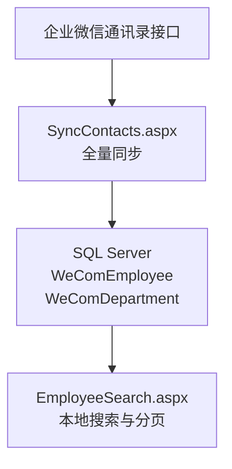

注意查询页面**只读本地表**，不再直连接口。只有同步页面碰接口。这样做的好处：

| 好处 | 说明 |
|---|---|
| 页面快 | 本地查询毫秒级 |
| 接口调用可控 | 只在同步时发生，次数可预估 |
| 故障隔离 | 企业微信故障不影响查询 |

## 两个页面的职责划分

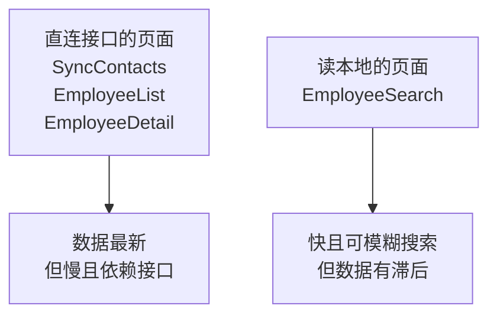

保留 `EmployeeList` 和 `EmployeeDetail` 直连接口是有意的：**当有人怀疑本地数据不准时，可以用它们查到实时数据做对照。**

---

# 本章自测

| 测试 | 做法 | 期望结果 |
|---|---|---|
| 1 TLS | 未设 TLS 1.2 时运行 | 请求失败；设置后正常 |
| 2 Secret 用错 | 临时把通讯录 Secret 换成应用 Secret | 报 60011 并给出中文提示 |
| 3 部门树 | 打开部门树页 | 层级正确，与后台一致 |
| 4 孤儿部门 | 用应用 Secret 查部门 | 可见部门仍显示，不凭空消失 |
| 5 成员列表 | 点部门进入 | 显示成员，勾选子部门后人数增加 |
| 6 特殊字符 | 在通讯录里给某人职务加上 `<b>` | 页面原样显示，不加粗 |
| 7 同步 | 执行全量同步 | 报告部门数、人数、耗时 |
| 8 同步保护 | 造一个部门查询失败 | 提示已跳过离职标记 |
| 9 模糊搜索 | 输入姓名中的一个字 | 能搜到，速度很快 |
| 10 通配符 | 搜索框输入 `%` | 不返回全部人 |
| 11 分页 | 翻到第二页 | 数据不重复，页码正确 |
| 12 新鲜度 | 查看提示 | 显示同步于几分钟前 |
| 13 软删除 | 在后台删掉一个测试成员后同步 | 标记为离职，历史记录仍能查到姓名 |
| 14 导出 | 导出并用 Excel 打开 | **中文不乱码** |
| 15 导出转义 | 给某人职务加逗号后导出 | 列不错位 |
| 16 日志 | 查 `ApiLog` | 有 `webforms` 记录，且不含 token |

第 8 项和第 14 项最能体现本章的设计考虑：**同步的安全保护**和**BOM 解决乱码**。

# 错误排查

| 现象 | 原因 | 解决 |
|---|---|---|
| 基础连接已关闭 | 未启用 TLS 1.2 | `Global.asax` 里设置 |
| `60011` | 用了应用 Secret 查通讯录 | 改用通讯录 Secret |
| `60011` | 未开启 API 接口同步 | 后台管理工具里开启 |
| `60011` | 通讯录页的可信 IP 未配 | 两处 IP 都要配 |
| `301002` | 用应用 Secret 查范围外的人 | 改用通讯录 Secret |
| 页面无反应 | 页面缺 `Async="true"` | 补上该属性 |
| 页面卡死 | 用了 `.Result` 导致死锁 | 改用 `RegisterAsyncTask` |
| 高并发报无法连接 | `HttpClient` 未复用 | 改成 `static readonly` |
| 姓名字段为空 | 返回里没有该字段 | 用 `Value<T?>() ?? 默认值` |
| 导出中文乱码 | 缺 UTF-8 BOM | 写入 `GetPreamble()` |
| 日志里全是异常 | 用了 `Response.End()` | 改用 `CompleteRequest()` |
| 同步很慢或超时 | 部门多，调用次数多 | 调大 `executionTimeout`，或改为定时任务 |
| 在职员工被标离职 | 同步部分失败仍执行了标记 | 检查是否有警告时跳过标记 |
| 搜索 `%` 返回全部 | LIKE 通配符未转义 | 转义 `%` `_` `[` |

# 完成标准

## 理解部分

- [ ] 为什么本章必须用通讯录 Secret，用应用 Secret 会怎样
- [ ] `HttpClient` 为什么必须是 `static`
- [ ] WebForms 里为什么不能用 `.Result`
- [ ] 部门接口返回平铺列表，为什么要两遍扫描建树
- [ ] 为什么不用 `fetch_child=1` 做全量同步
- [ ] 为什么用软删除而不是硬删除
- [ ] 同步部分失败时，为什么必须跳过离职标记
- [ ] 为什么必须同步到本地才能做模糊搜索
- [ ] CSV 中文乱码的原因，以及 BOM 为什么能解决
- [ ] `Response.End()` 有什么问题

## 操作部分

- [ ] 16 项自测全部通过
- [ ] 部门树、搜索、详情、同步、导出五个页面都可用
- [ ] `ApiLog` 里能看到 `webforms` 来源的记录
- [ ] 导出的 CSV 用 Excel 打开中文正常

# 与前五章的呼应

本章有三处直接用到了前面讲的原理：

| 本章做法 | 依据 |
|---|---|
| 用 `static` 字段缓存 token 就够了 | 第 1 章：企业微信重复获取返回同一个 token |
| 60011 的中文提示写「必须用通讯录 Secret」 | 第 1 章：权限跟着凭证走 |
| `ApiLog` 加 `Source` 字段区分来源 | 第 3 章：两个程序共享数据但不互相调用 |

第一条值得再强调：**正因为企业微信不会因为重复获取而让旧 token 失效，IIS 多工作进程各自缓存才是安全的。**如果是公众号那种模型，这里就必须引入集中式缓存了。

# 下一章

第 7 章开始进入需要 HTTPS 域名的阶段。要配置应用主页和可信域名，让员工能从企业微信工作台点开你的页面。**没有外网域名和证书的话，第 7 到 10 章都无法进行。**
