# 第 7 章：应用主页与可信域名

## 语言边界

本章以**企业微信管理后台配置**和 **IIS 部署**为主，只写少量 C# 代码。不涉及 Python。

## 本章目标

让员工在手机企业微信的「工作台」点击应用图标，直接打开你部署在 IIS 上的 WebForms 页面。

## 这是一个硬门槛

前六章都能在本机完成。**从本章开始，必须具备三个条件**：

| 条件 | 为什么不能省 |
|---|---|
| 一个域名 | 企业微信不接受 IP 地址 |
| 有效的 HTTPS 证书 | 企业微信不接受 `http` |
| 外网可访问 | 请求来自员工手机所在的网络 |

如果暂时没有这些，可以先跳到第 12 章（部署与故障排查），等条件具备再回来。**没有域名的话，第 7 到 11 章都无法实际验证。**

## 为什么第 8 到 11 章都依赖本章

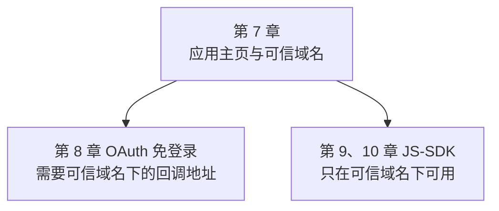

第 11 章的回调接收也需要一个外网可达的 HTTPS 地址。所以本章是整个第二阶段的地基。

## 版本地图

| 版本 | 主题 | 解决上一版什么问题 |
|---|---|---|
| V1 | 本机跑通一个页面 | —— |
| V2 | 让外网能访问 | 只有本机能打开 |
| V3 | 证书链完整性 | 电脑能开手机打不开 |
| V4 | 域名归属校验 | 后台提示校验不通过 |
| V5 | 配置可信域名与主页 | 工作台看不到入口 |
| V6 | 判断是否在企业微信内打开 | 用外部浏览器打开会出错 |
| V7 | 移动端适配 | 手机上显示成缩小的电脑版 |
| V8 | 反向代理下的协议识别 | 代理后面拿到的是 http |
| V9 | 缓存与版本号 | 改了页面手机上不生效 |
| V10 | 集成版入口页 | 缺一个统一入口 |

---

# V1：本机跑通一个页面

## 目标

先确认 IIS 能正常执行 `.aspx`，把问题范围缩到最小。

## 测试页面

`Default.aspx`：

```aspx
<%@ Page Language="C#" %>
<!DOCTYPE html>
<html>
<head>
    <title>企业微信应用</title>
</head>
<body>
    <h3>页面运行正常</h3>
    <p>服务器时间：<%= DateTime.Now.ToString("yyyy-MM-dd HH:mm:ss") %></p>
    <p>访问协议：<%= Request.Url.Scheme %></p>
    <p>访问主机：<%= Request.Url.Host %></p>
</body>
</html>
```

这三行输出不是装饰，后面每一版排查都要看它们。

## IIS 部署要点

```text
IIS 管理器 → 网站 → 添加网站
  网站名称：WeComWeb
  物理路径：C:\inetpub\WeComWeb
  绑定：http，端口 80，主机名先留空
```

然后检查应用程序池：

| 设置 | 值 | 说明 |
|---|---|---|
| .NET CLR 版本 | v4.0 | WebForms 用 .NET Framework |
| 托管管道模式 | 集成 | 默认即可 |
| 标识 | ApplicationPoolIdentity | 后面要给它文件权限 |

## 验证

浏览器打开 `http://localhost/`，应该看到「页面运行正常」和时间。

## 三种常见失败

| 现象 | 原因 | 解决 |
|---|---|---|
| 浏览器下载了 `.aspx` 文件 | IIS 未注册 ASP.NET | 见下方 |
| 500 错误 | 应用程序池 CLR 版本不对 | 改成 v4.0 |
| 403 错误 | 目录无读取权限 | 给应用程序池标识加读取权限 |

第一种最常见。如果 Windows 功能里勾了 ASP.NET 仍然不行，用命令行注册：

```text
%windir%\Microsoft.NET\Framework64\v4.0.30319\aspnet_regiis.exe -i
```

**先解决这一步再往下走。**本机都打不开的页面，配到企业微信里只会更难查。

## V1 的问题

只有本机能访问。企业微信在员工手机上打开这个页面时，请求来自外部网络，`localhost` 对它没有意义。

---

# V2：让外网能访问

## 目标

让互联网上的设备能访问到你的页面。

## 原理：请求是从哪里来的

这是很多人一开始想错的地方。

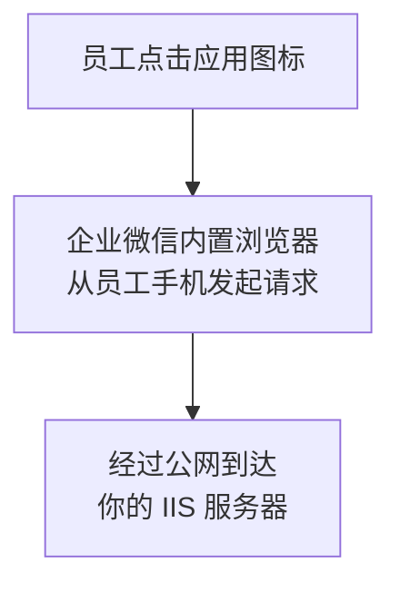

关键点：**发起请求的是员工的手机，不是腾讯的服务器。**所以你的服务器必须能被员工的手机访问到。

由此推出几个结论：

| 结论 | 原因 |
|---|---|
| `localhost` 不行 | 那是手机自己 |
| 内网 IP 不行 | 手机用移动网络时访问不到 |
| 必须是公网可达 | 员工可能在任何地方 |

## 需要做的四件事

### 1. 域名解析

把域名的 A 记录指向你服务器的公网 IP。验证：

```text
ping your-domain.com
```

返回的 IP 应该是你服务器的公网 IP。

### 2. 端口开放

| 端口 | 用途 |
|---|---|
| 80 | HTTP，用于跳转到 HTTPS 和证书校验 |
| 443 | HTTPS，实际业务访问 |

要同时检查三处：

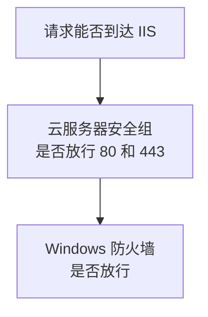

第三处是 IIS 的站点绑定本身。这三处任何一处没放行，外部都访问不到。

### 3. 申请 HTTPS 证书

企业微信只接受 `https`。证书可以从云服务商申请（很多提供免费的），或用 Let's Encrypt。

在 IIS 里绑定：

```text
网站 → 绑定 → 添加
  类型：https
  端口：443
  主机名：your-domain.com
  SSL 证书：选择你导入的证书
```

### 4. HTTP 强制跳转 HTTPS

员工可能通过旧链接访问 `http`。加一个跳转，`Global.asax.cs`：

```csharp
protected void Application_BeginRequest(object sender, EventArgs e)
{
    HttpRequest req = HttpContext.Current.Request;

    // 已经是 https 就不处理
    if (req.IsSecureConnection)
    {
        return;
    }

    // 校验文件必须允许 http 访问，见 V4
    if (req.Url.AbsolutePath.StartsWith("/WW_verify_",
        StringComparison.OrdinalIgnoreCase))
    {
        return;
    }

    // 本机调试时不跳转，否则 localhost 无证书会打不开
    if (req.IsLocal)
    {
        return;
    }

    string httpsUrl = "https://" + req.Url.Host + req.RawUrl;
    HttpContext.Current.Response.Redirect(httpsUrl, true);
}
```

## 为什么校验文件要放行 http

因为 V4 的域名校验可能通过 `http` 访问那个文件。如果被强制跳转，校验可能失败。这一行是为下一步铺路。

## 关于内网穿透工具

没有公网服务器的人常想用内网穿透。这里说清它的定位：

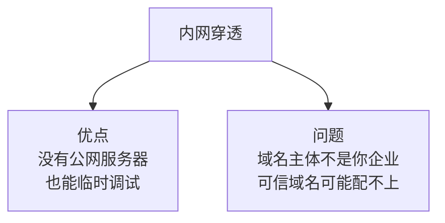

企业微信配置可信域名时通常要求**域名主体是你们企业自己**。第三方穿透工具提供的域名主体属于服务商，会被拒绝。

所以内网穿透**可以用于临时看效果，但走不完本章的完整流程**。

## 验证

用手机的移动网络（关掉 Wi-Fi）打开 `https://your-domain.com/`。

必须用移动网络，因为连着公司 Wi-Fi 时可能走的是内网路径，测不出真实情况。

## V2 的问题

电脑浏览器能打开，但手机上可能提示证书错误或直接白屏。

---

# V3：证书链完整性

## 现象

这是一个特别容易误判的问题：

```text
电脑浏览器：正常，显示小锁
手机浏览器：提示证书不受信任，或直接打不开
企业微信内：白屏
```

很多人以为是企业微信的问题，实际是证书装得不完整。

## 原理：证书链是什么

你的证书不是凭空可信的，它由一个中间机构签发，中间机构又由根机构签发：

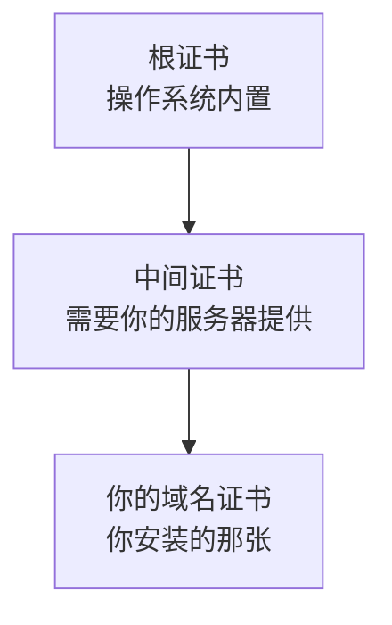

验证时，客户端要沿着这条链一路verify到它信任的根证书。

## 为什么电脑正常手机不正常

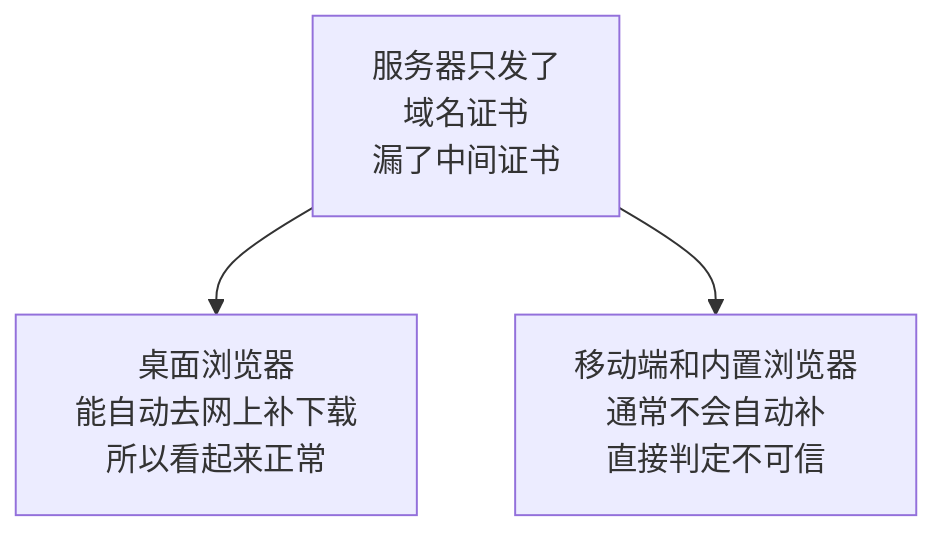

**桌面浏览器的这个「贴心行为」恰恰掩盖了问题。**所以验证证书绝不能只用电脑浏览器。

## 怎么检查

用在线 SSL 检测工具（搜索「SSL 证书检测」能找到多个）输入你的域名，重点看两项：

| 检查项 | 期望 |
|---|---|
| 证书链是否完整 | 完整，无 missing intermediate |
| 支持的协议 | 包含 TLS 1.2 |

## 怎么修

从证书颁发机构下载**完整证书链**（通常是包含多张证书的 `.pfx` 或 `fullchain` 文件），重新导入 IIS。

导入时注意勾选「包括所有可扩展的属性」和私钥。

## 顺便确认 TLS 版本

第 6 章讲过 .NET 调用企业微信需要 TLS 1.2。这里是反方向：**企业微信客户端访问你的服务器，也需要你的服务器支持 TLS 1.2。**

老版本 Windows Server 可能默认没启用。检查注册表 `SCHANNEL` 下的 TLS 1.2 设置，或用检测工具确认。

## 验证

三个都要过：

1. 电脑浏览器打开，显示安全锁
2. 手机移动网络打开，无证书警告
3. 在线检测工具报告证书链完整

## V3 的问题

网站能访问了，但在企业微信后台配置可信域名时，提示「域名所有权校验不通过」。

---

# V4：域名归属校验

## 目标

向企业微信证明这个域名是你的。

## 原理：为什么需要校验

假设没有这一步，任何人都可以把**别人的域名**填进自己的应用配置里。

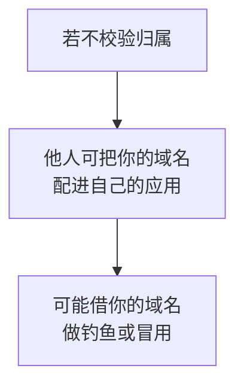

校验方式的逻辑很直接：**只有真正控制这个域名的人，才能在它的根目录放文件。**

## 操作步骤

在企业微信后台，应用的「网页授权及 JS-SDK」设置里填域名时，会提供一个校验文件下载。

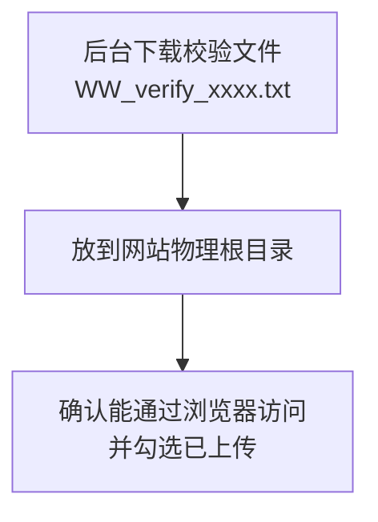

放好之后，必须能通过这个地址访问到：

```text
https://your-domain.com/WW_verify_xxxxxxxx.txt
```

**先自己用浏览器打开确认，再回后台勾选「已上传域名归属校验文件」。**顺序反了容易白折腾（操作流程参见[企业微信域名归属校验说明](https://www.cnblogs.com/shirui/p/7806888.html)。内容已改写以符合授权要求）。

## 校验文件 404 的六种原因

「域名所有权校验不通过」是社区里的高频问题（例如[可信域名校验不通过的讨论](https://developers.weixin.qq.com/community/personal/oCJUsw12tQggdNTYofeODwxkRB1M/answer)。内容已改写以符合授权要求）。按可能性排序：

### 1. 没放在物理根目录

必须是站点根目录，不是某个子文件夹，也不是虚拟目录里。

```text
错误：C:\inetpub\WeComWeb\files\WW_verify_xxx.txt
正确：C:\inetpub\WeComWeb\WW_verify_xxx.txt
```

### 2. Visual Studio 发布时没带上

在 VS 里把该文件的属性设为：

| 属性 | 值 |
|---|---|
| 生成操作 | 内容 |
| 复制到输出目录 | 始终复制 |

否则发布包里根本没有它。

### 3. 全局登录跳转把它拦了

如果站点配了强制登录或 URL 重写，访问这个 txt 会被重定向，返回 302 而不是文件内容。

放行它：

```xml
<configuration>
  <location path="WW_verify_xxxxxxxx.txt">
    <system.web>
      <authorization>
        <allow users="*" />
      </authorization>
    </system.web>
  </location>
</configuration>
```

如果用了 URL 重写模块，也要在重写规则里排除这个路径。

### 4. HTTP 跳转 HTTPS 影响了校验

这就是 V2 里那段放行代码的作用。如果你没加，把它加上。

### 5. 文件被改名或内容被改动

有些编辑器保存时会加 BOM 或改换行符。**下载后不要打开编辑，直接原样上传。**

如果不确定，重新下载一份。

### 6. MIME 类型未配置

IIS 默认支持 `.txt`，但如果有人删过 MIME 映射，会返回 404。检查：

```text
IIS 管理器 → 站点 → MIME 类型 → 确认有 .txt → text/plain
```

## 一个排查技巧

用命令行看真实返回，比浏览器直观（浏览器可能有缓存）：

```text
curl -i https://your-domain.com/WW_verify_xxxxxxxx.txt
```

关注第一行状态码：

| 返回 | 含义 |
|---|---|
| `200` | 正常，可以去后台勾选了 |
| `404` | 文件不在，检查原因 1、2、6 |
| `302` | 被重定向，检查原因 3、4 |
| `403` | 权限问题，给目录加读取权限 |

## V4 的问题

域名校验过了，但工作台里还是看不到应用入口。

---

# V5：配置可信域名与应用主页

## 目标

让应用图标出现在工作台，并能点开你的页面。

## 原理：三处配置各管什么

这是本章最容易混淆的地方。后台有几个看起来相似的设置项，作用完全不同：

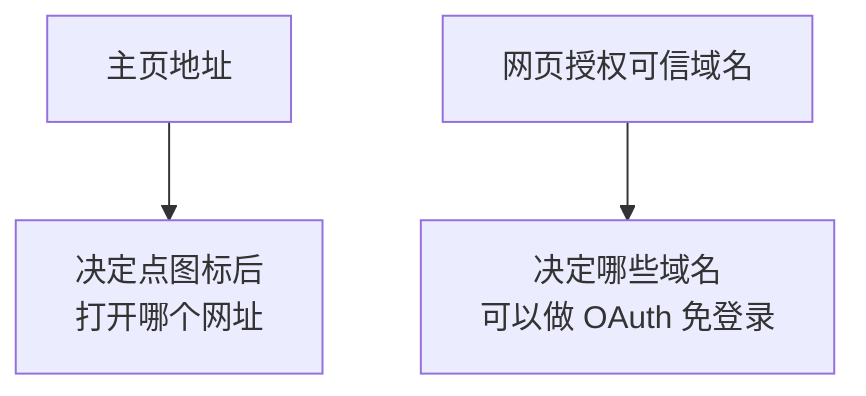

还有第三项：

| 配置项 | 作用 | 哪一章用 |
|---|---|---|
| 主页地址 | 工作台点击后跳转的地址 | 本章 |
| 网页授权可信域名 | 允许做 OAuth 的域名 | 第 8 章 |
| JS-SDK 可信域名 | 允许调用客户端能力的域名 | 第 9、10 章 |
| 桌面端独立主页 | PC 端企业微信单独的入口 | 本章，可选 |

**三个域名配置通常填同一个域名**，但它们是独立开关，漏配哪个就会在对应章节出问题。建议现在就把三处都配上，避免后面来回找。

## 配置步骤

### 1. 设置主页地址

```text
应用管理 → 你的应用 → 工作台应用主页（或应用主页）
填入：https://your-domain.com/Default.aspx
```

### 2. 建议指向一个入口页

不要直接指向 `EmployeeSearch.aspx` 这样的功能页。理由：

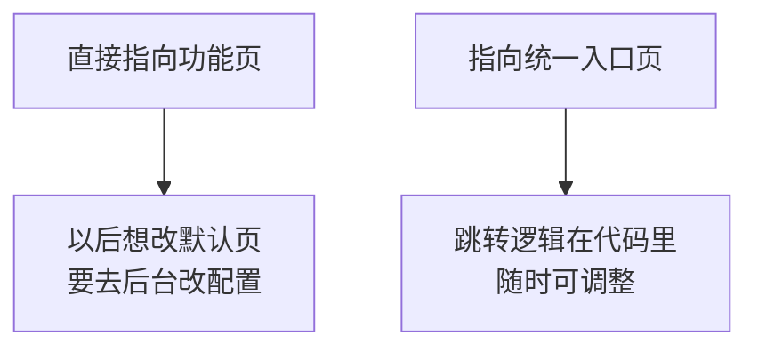

入口页还能承担身份识别（第 8 章）和按角色分流的职责。V10 会做这个页面。

### 3. 检查可见范围

第 1 章讲过：**不在可见范围内的成员，工作台里看不到图标。**

开发阶段可见范围只有你自己，所以只有你能看到。这是正常的。

## 验证

按顺序确认，每一步都不要跳：

| 步骤 | 操作 | 期望 |
|---|---|---|
| 1 | 电脑浏览器打开主页地址 | 正常显示 |
| 2 | 手机移动网络打开同一地址 | 正常显示，无证书警告 |
| 3 | 手机企业微信 → 工作台 | 看到应用图标 |
| 4 | 点击图标 | 打开你的页面 |

## 第 3 步看不到图标怎么办

| 原因 | 检查 |
|---|---|
| 自己不在可见范围 | 后台应用设置里加上自己 |
| 客户端缓存 | 下拉刷新工作台，或退出重进 |
| 主页地址没填 | 没填地址时图标可能不显示或点了无反应 |

## 第 4 步点了白屏怎么办

白屏几乎都是这三种：

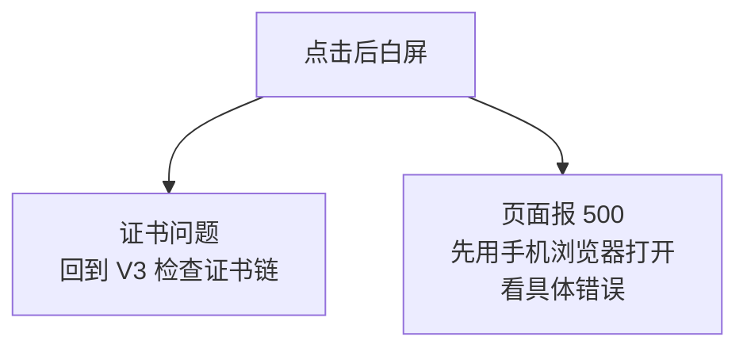

第三种是页面里引用了外网加载不到的资源，导致渲染卡住。

**排查次序：先用手机浏览器打开同一地址。**如果手机浏览器正常而企业微信内白屏，才是企业微信相关的问题；如果两者都白屏，问题在你的页面或证书上。

这个次序能省掉大量无效排查。

## V5 的问题

现在页面能打开了，但如果有人把链接复制到微信或外部浏览器打开，页面会出问题——因为第 8、9 章的功能只在企业微信内可用。


---

# V6：判断是否在企业微信内打开

## 目标

在外部浏览器打开时给出明确提示，而不是让功能莫名失效。

## 原理：两种浏览器的能力差异

同一个页面，在企业微信内打开和在外部浏览器打开，可用的能力完全不同：

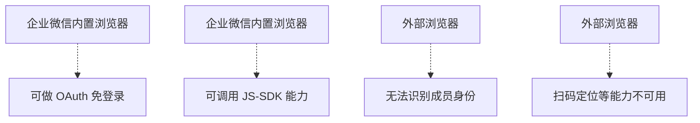

如果不做判断，员工把链接分享到微信或用手机浏览器打开，会看到「授权失败」这种看不懂的错误。

## 原理：UserAgent 里的特征字符串

浏览器会在请求头 `User-Agent` 里标明自己的身份。企业微信的内置浏览器带有特征字符串：

| 环境 | UA 中的特征 |
|---|---|
| 手机企业微信 | `wxwork` 和 `micromessenger` |
| PC 端企业微信 | `wxwork` 和 `WindowsWechat` |
| 普通微信 | 只有 `micromessenger`，没有 `wxwork` |
| 外部浏览器 | 两者都没有 |

关键区别：**`wxwork` 是企业微信独有的**（判断方式参见[微信内置浏览器 UA 判断](https://gist.github.com/GiaoGiaoCat/fff34c063cf0cf227d65)、[PC 端企业微信 UA 特征](https://developers.weixin.qq.com/community/personal/oCJUsw_qeNY0fuIoNAFDBrvkmwEI/answer)。内容已改写以符合授权要求）。

只判断 `micromessenger` 是不够的，因为普通微信也有这个标识，但它无法完成企业微信的 OAuth。

## 代码

`App_Code/ClientDetector.cs`：

```csharp
using System;
using System.Web;

namespace WeComWeb
{
    /// <summary>客户端环境判断。</summary>
    public static class ClientDetector
    {
        /// <summary>是否在企业微信客户端内打开。</summary>
        public static bool IsWeCom(HttpRequest request)
        {
            string ua = GetUserAgent(request);
            // wxwork 是企业微信独有标识，普通微信没有
            return ua.Contains("wxwork");
        }

        /// <summary>是否在普通微信内打开（不是企业微信）。</summary>
        public static bool IsWeChatOnly(HttpRequest request)
        {
            string ua = GetUserAgent(request);
            return ua.Contains("micromessenger") && !ua.Contains("wxwork");
        }

        /// <summary>是否 PC 端企业微信。</summary>
        public static bool IsDesktopWeCom(HttpRequest request)
        {
            string ua = GetUserAgent(request);
            return ua.Contains("wxwork") && ua.Contains("windowswechat");
        }

        /// <summary>是否移动端。</summary>
        public static bool IsMobile(HttpRequest request)
        {
            string ua = GetUserAgent(request);
            return ua.Contains("android") || ua.Contains("iphone")
                   || ua.Contains("ipad");
        }

        private static string GetUserAgent(HttpRequest request)
        {
            // UA 可能为空，用户也可能伪造，所以只用于提示不用于安全判断
            string ua = request.UserAgent;
            return string.IsNullOrEmpty(ua) ? "" : ua.ToLowerInvariant();
        }

        /// <summary>给非企业微信环境的友好提示文本。</summary>
        public static string GetEnvironmentHint(HttpRequest request)
        {
            if (IsWeCom(request))
            {
                return null;      // 环境正确，无需提示
            }
            if (IsWeChatOnly(request))
            {
                return "当前在微信中打开。本应用需要在【企业微信】中使用，"
                     + "请打开企业微信，在工作台中找到本应用。";
            }
            return "请在企业微信客户端中打开本页面：打开企业微信 → 工作台 → "
                 + "找到本应用图标。直接用浏览器访问无法识别您的身份。";
        }
    }
}
```

## 一个重要限制：UA 不能用于安全判断

```csharp
// UA 可能为空，用户也可能伪造，所以只用于提示不用于安全判断
```

UserAgent 是**客户端自己声明的**，可以随意伪造。所以：

| 用途 | 是否合适 |
|---|---|
| 给用户友好提示 | 合适 |
| 决定页面样式 | 合适 |
| 判断是否放行敏感数据 | **不合适** |

真正的身份验证靠第 8 章的 OAuth，那个过程有企业微信服务端参与，无法伪造。

## 页面里的用法

```csharp
protected void Page_Load(object sender, EventArgs e)
{
    string hint = ClientDetector.GetEnvironmentHint(Request);
    if (hint != null)
    {
        pnlWarning.Visible = true;
        litWarning.Text = Server.HtmlEncode(hint);
        pnlContent.Visible = false;     // 隐藏正常内容
        return;
    }

    pnlWarning.Visible = false;
    pnlContent.Visible = true;
}
```

## 为什么值得花这一版

这个判断本身很简单，但它省掉的支持成本很大。

没有它时，员工遇到的现象是「点开是空白」或「提示授权失败」，他会来问你。有了它，页面直接告诉他该怎么做。

## V6 的问题

页面在手机上显示成了缩小的电脑版，字很小要放大才能看。

---

# V7：移动端适配

## 目标

让页面在手机上可读、可点。

## 原理：viewport 决定手机怎么排版

手机浏览器默认假设网页是给电脑设计的，会用一个约 980 像素的虚拟宽度渲染，然后整体缩小塞进屏幕。

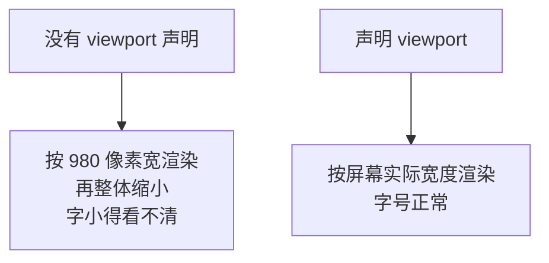

所以这一行是移动端适配的前提：

```html
<meta name="viewport" content="width=device-width, initial-scale=1" />
```

前面几章的示例里都有它，本节说明它为什么必须存在。

## 母版页

WebForms 用母版页统一处理，避免每个页面重复。

`Site.Master`：

```aspx
<%@ Master Language="C#" AutoEventWireup="true"
    CodeBehind="Site.master.cs" Inherits="WeComWeb.SiteMaster" %>
<!DOCTYPE html>
<html>
<head runat="server">
    <meta charset="utf-8" />
    <meta name="viewport" content="width=device-width, initial-scale=1" />
    <title><asp:ContentPlaceHolder ID="TitleContent" runat="server" /></title>
    <link rel="stylesheet"
          href='<%= ResolveUrl("~/Content/site.css") %>?v=<%= AssetVersion %>' />
</head>
<body>
    <form id="form1" runat="server">
        <div class="page">
            <asp:Panel ID="pnlWarning" runat="server" Visible="false"
                       CssClass="warning">
                <asp:Literal ID="litWarning" runat="server" />
            </asp:Panel>

            <asp:ContentPlaceHolder ID="MainContent" runat="server" />
        </div>
    </form>
</body>
</html>
```

`Site.master.cs`：

```csharp
using System;
using System.Web.UI;

namespace WeComWeb
{
    public partial class SiteMaster : MasterPage
    {
        /// <summary>静态资源版本号，用于强制刷新缓存。见 V9。</summary>
        protected string AssetVersion
        {
            get { return AssetHelper.Version; }
        }

        protected void Page_Load(object sender, EventArgs e)
        {
            // 统一做环境判断，所有子页面都受益
            string hint = ClientDetector.GetEnvironmentHint(Request);
            if (hint != null)
            {
                pnlWarning.Visible = true;
                litWarning.Text = Server.HtmlEncode(hint);
            }
        }
    }
}
```

## 样式

`Content/site.css`：

```css
* { box-sizing: border-box; }

body {
    margin: 0;
    /* 优先使用系统字体，中文显示更自然且无需下载字体文件 */
    font-family: -apple-system, "PingFang SC", "Microsoft YaHei", sans-serif;
    font-size: 16px;          /* 手机上小于 16px 会显得吃力 */
    line-height: 1.6;
    color: #333;
    background: #f5f5f5;
}

.page {
    max-width: 900px;         /* PC 上不至于拉得太宽 */
    margin: 0 auto;
    padding: 12px;
}

.warning {
    background: #fff3cd;
    border: 1px solid #ffe08a;
    padding: 12px;
    border-radius: 4px;
    margin-bottom: 12px;
}

/* 表格在窄屏上横向滚动，而不是把页面挤变形 */
.table-wrap {
    overflow-x: auto;
    -webkit-overflow-scrolling: touch;
    background: #fff;
}

table.grid {
    border-collapse: collapse;
    width: 100%;
    min-width: 600px;         /* 低于这个宽度就触发横向滚动 */
}

table.grid th, table.grid td {
    border: 1px solid #e5e5e5;
    padding: 8px 6px;
    white-space: nowrap;      /* 不换行，配合横向滚动 */
}

table.grid th { background: #fafafa; }

/* 输入框和按钮要够大，手指才点得准 */
input[type=text], select, input[type=submit], button {
    font-size: 16px;
    padding: 8px;
    min-height: 40px;
}

/* 窄屏下让搜索控件各占一行 */
@media (max-width: 480px) {
    input[type=text], select { width: 100%; margin-bottom: 8px; }
}
```

## 四个移动端要点

### 字号不要小于 16px

小于这个值时，部分手机浏览器在聚焦输入框时会自动放大页面，体验很差。

### 表格用横向滚动而不是压缩

员工名单有六七列，硬塞进手机屏幕会挤得没法看。

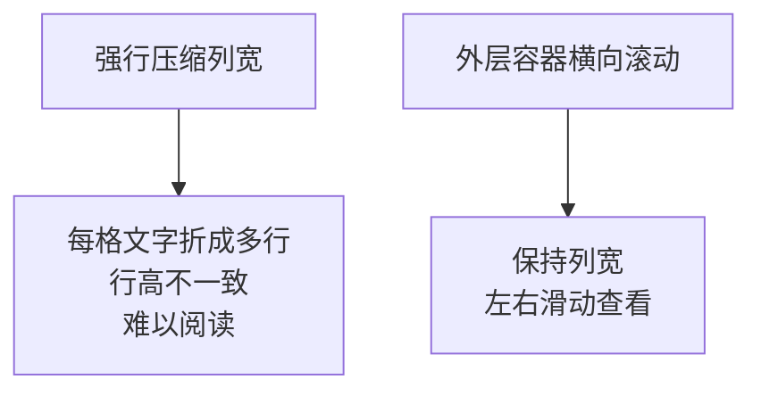

做法是给表格套一层 `overflow-x: auto` 的容器，并配 `min-width`。

### 点击区域至少 40 像素高

手指的精度远低于鼠标。按钮太小会频繁点错。

### 用系统字体，不要下载字体文件

```css
font-family: -apple-system, "PingFang SC", "Microsoft YaHei", sans-serif;
```

中文字体文件动辄几 MB，在移动网络下会明显拖慢首屏。系统字体零成本且显示自然。

## GridView 怎么套上滚动容器

`GridView` 渲染出的是 `<table>`，外面包一层即可：

```aspx
<div class="table-wrap">
    <asp:GridView ID="gvList" runat="server" CssClass="grid"
                  AutoGenerateColumns="false" GridLines="None">
        ...
    </asp:GridView>
</div>
```

## V7 的问题

如果你的 IIS 在反向代理或负载均衡后面，页面里输出的 `Request.Url.Scheme` 会是 `http`，而不是员工实际访问的 `https`。

---

# V8：反向代理下的协议识别

## 为什么现在就要解决

这个问题本身在本章只是显示不对，看起来无害。**但它会在第 9 章造成一个极难排查的故障。**

第 9 章的 JS-SDK 签名要求「服务端用来签名的页面地址」和「浏览器地址栏的地址」完全一致。如果服务端拿到的是 `http` 而浏览器是 `https`，签名必然失败，报错只有一句 `invalid signature`，很难想到根源在这里。

## 原理：协议信息在哪一步丢失

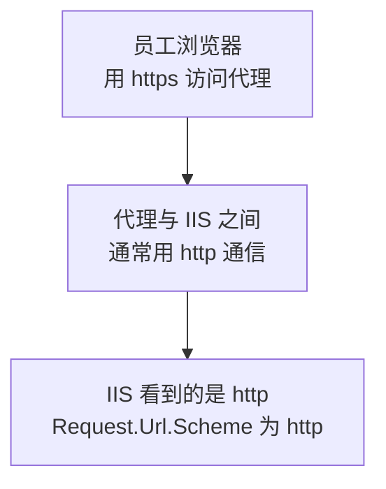

这不是 bug，而是这种架构的正常表现：加密在代理那一层就终止了，后端收到的是明文 HTTP。

常见的代理场景：

| 场景 | 说明 |
|---|---|
| Nginx 反向代理 | 前面挡一层 Nginx |
| IIS ARR | 用 IIS 自己做反向代理 |
| 云负载均衡 | 云服务商的 SLB 或 ALB |
| CDN | 前面套了 CDN |

## 解决办法：读转发头

代理通常会把原始协议放在请求头里：

| 请求头 | 值 |
|---|---|
| `X-Forwarded-Proto` | `https` |
| `X-Forwarded-For` | 客户端真实 IP |

## 代码

`App_Code/UrlHelper.cs`：

```csharp
using System;
using System.Web;

namespace WeComWeb
{
    /// <summary>处理反向代理后面的真实地址。</summary>
    public static class UrlHelper
    {
        /// <summary>取当前请求的真实协议，优先信任代理转发头。</summary>
        public static string GetScheme(HttpRequest request)
        {
            string proto = request.Headers["X-Forwarded-Proto"];
            if (!string.IsNullOrEmpty(proto))
            {
                // 多层代理时可能是 "https, http"，取第一个
                int comma = proto.IndexOf(',');
                if (comma > 0)
                {
                    proto = proto.Substring(0, comma);
                }
                return proto.Trim().ToLowerInvariant();
            }
            return request.IsSecureConnection ? "https" : "http";
        }

        /// <summary>
        /// 取当前页面的完整外部地址。第 9 章 JS-SDK 签名必须用这个，
        /// 不能直接用 Request.Url.AbsoluteUri。
        /// </summary>
        public static string GetPublicUrl(HttpRequest request)
        {
            string scheme = GetScheme(request);

            // 主机名也可能被代理改写，优先用转发头
            string host = request.Headers["X-Forwarded-Host"];
            if (string.IsNullOrEmpty(host))
            {
                host = request.Url.Host;
                // 非默认端口要带上
                if (!request.Url.IsDefaultPort)
                {
                    host += ":" + request.Url.Port;
                }
            }

            // RawUrl 保留原始查询字符串，不做额外编解码
            string url = scheme + "://" + host + request.RawUrl;

            // 签名规则要求去掉 # 及其后面的内容
            int hash = url.IndexOf('#');
            return hash >= 0 ? url.Substring(0, hash) : url;
        }

        /// <summary>取客户端真实 IP。</summary>
        public static string GetClientIp(HttpRequest request)
        {
            string forwarded = request.Headers["X-Forwarded-For"];
            if (!string.IsNullOrEmpty(forwarded))
            {
                // 格式为 "客户端IP, 代理1, 代理2"，第一个是真实客户端
                int comma = forwarded.IndexOf(',');
                return (comma > 0 ? forwarded.Substring(0, comma) : forwarded).Trim();
            }
            return request.UserHostAddress;
        }
    }
}
```

## 一个安全提醒

转发头是**可以伪造的**。任何人都能在请求里塞一个 `X-Forwarded-Proto: https`。

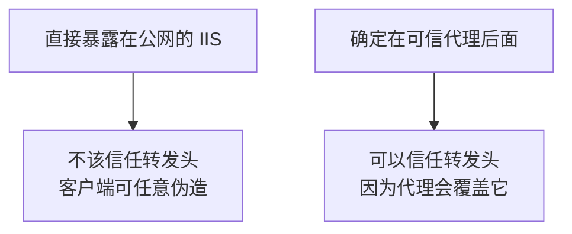

判断标准：**只有当你确定所有流量都经过自己的代理时，才信任这些头。**因为可信代理会用真实值覆盖客户端传来的值。

如果 IIS 直接对外，就不要读这些头，直接用 `Request.IsSecureConnection`。

## 配套：让 Nginx 正确转发

如果你用 Nginx，配置里要有这几行：

```nginx
location / {
    proxy_pass http://127.0.0.1:8080;
    proxy_set_header Host $host;
    proxy_set_header X-Real-IP $remote_addr;
    proxy_set_header X-Forwarded-For $proxy_add_x_forwarded_for;
    proxy_set_header X-Forwarded-Proto $scheme;    # 关键这一行
    proxy_set_header X-Forwarded-Host $host;
}
```

漏掉 `X-Forwarded-Proto` 那一行，C# 侧就永远拿不到 `https`。

## 验证

在测试页面加一行输出：

```aspx
<p>公开地址：<%= UrlHelper.GetPublicUrl(Request) %></p>
```

手机上打开，这一行显示的应该和地址栏完全一致，包括 `https` 和查询参数。

**这一步现在验证好，第 9 章会省掉很多时间。**

## V8 的问题

改了页面内容或样式，手机上刷新还是旧的。

---

# V9：缓存与版本号

## 现象

改完 CSS 发布上去，电脑浏览器按 Ctrl+F5 能看到新样式，但手机企业微信里怎么刷都是旧的。

## 原理：内置浏览器的缓存更激进

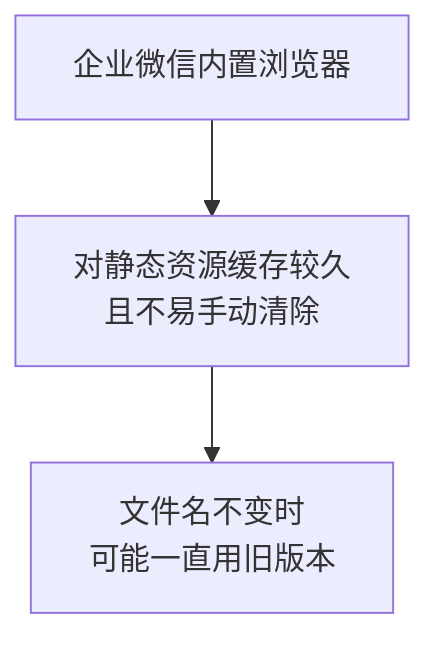

而且移动端没有方便的「强制刷新」操作，也不容易打开开发者工具确认。

## 解决办法：给资源加版本号

缓存是按 URL 来的。URL 变了，就一定会重新下载：

```text
旧：/Content/site.css
新：/Content/site.css?v=20260828143000
```

版本号变化时浏览器认为这是新资源，缓存自动失效。

## 代码

`App_Code/AssetHelper.cs`：

```csharp
using System;
using System.IO;
using System.Web;
using System.Web.Hosting;

namespace WeComWeb
{
    /// <summary>静态资源版本号。</summary>
    public static class AssetHelper
    {
        private static string _version;
        private static readonly object Lock = new object();

        /// <summary>
        /// 版本号取自程序集文件的最后写入时间。
        /// 每次发布都会变，不发布则保持不变，缓存仍然有效。
        /// </summary>
        public static string Version
        {
            get
            {
                if (_version != null)
                {
                    return _version;
                }

                lock (Lock)
                {
                    if (_version == null)
                    {
                        try
                        {
                            string binPath = HostingEnvironment.MapPath("~/bin");
                            var dir = new DirectoryInfo(binPath);
                            DateTime latest = DateTime.MinValue;

                            foreach (FileInfo f in dir.GetFiles("*.dll"))
                            {
                                if (f.LastWriteTime > latest)
                                {
                                    latest = f.LastWriteTime;
                                }
                            }
                            _version = latest.ToString("yyyyMMddHHmmss");
                        }
                        catch
                        {
                            // 取不到就退化成启动时间，至少每次重启会变
                            _version = DateTime.Now.ToString("yyyyMMddHHmmss");
                        }
                    }
                }
                return _version;
            }
        }
    }
}
```

## 为什么用程序集时间而不是当前时间

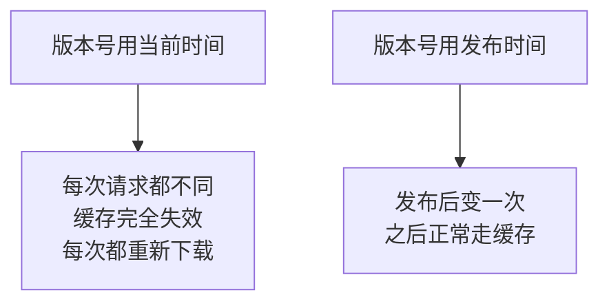

用当前时间等于关掉缓存，页面每次都要重新下载 CSS，移动网络下更慢。

**目标不是「不缓存」，而是「该更新时能更新」。**

## 页面内容本身不要缓存

`.aspx` 页面是动态的，尤其登录状态相关的页面绝不能被缓存：

```csharp
protected void Page_Load(object sender, EventArgs e)
{
    // 动态页面禁止缓存，避免员工看到别人的数据或过期状态
    Response.Cache.SetCacheability(HttpCacheability.NoCache);
    Response.Cache.SetNoStore();
    Response.Cache.SetExpires(DateTime.UtcNow.AddDays(-1));
}
```

放在母版页里统一处理更省事。

## 静态资源可以放心长缓存

有了版本号，静态文件就可以设很长的缓存期：

```xml
<configuration>
  <system.webServer>
    <staticContent>
      <clientCache cacheControlMode="UseMaxAge"
                   cacheControlMaxAge="30.00:00:00" />
    </staticContent>
  </system.webServer>
</configuration>
```

缓存 30 天，配合版本号强制更新。这是移动端的常规做法：**静态资源长缓存 + 版本号，动态页面不缓存。**

## 一个调试期的临时手段

开发阶段想强制看到最新效果，可以在地址后面手工加个随机参数：

```text
https://your-domain.com/Default.aspx?t=123
```

但注意：**第 9 章之后不要这么做**，因为 JS-SDK 签名要求 URL 完全一致，多一个参数就会签名失败。

## V9 的问题

现在缺一个统一的入口页，把前面几版的处理集中起来。

---

# V10：集成版入口页

## 目标

做一个入口页，作为主页地址的落点。

## 职责

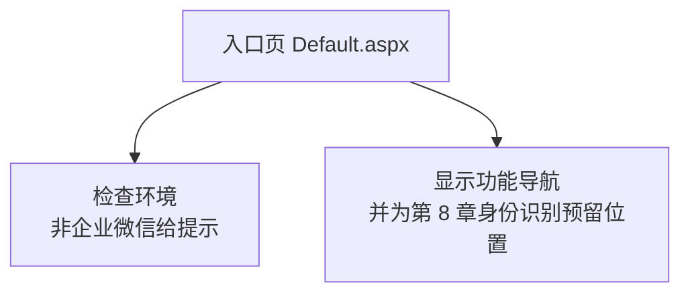

## 页面

`Default.aspx`：

```aspx
<%@ Page Language="C#" MasterPageFile="~/Site.Master" AutoEventWireup="true"
    CodeBehind="Default.aspx.cs" Inherits="WeComWeb.DefaultPage" %>

<asp:Content ID="c1" ContentPlaceHolderID="TitleContent" runat="server">
    企业助手
</asp:Content>

<asp:Content ID="c2" ContentPlaceHolderID="MainContent" runat="server">
    <asp:Panel ID="pnlContent" runat="server">
        <h3>企业助手</h3>

        <ul class="menu">
            <li><a href="EmployeeSearch.aspx">员工查询</a></li>
            <li><a href="DepartmentTree.aspx">部门结构</a></li>
            <li><a href="SyncContacts.aspx">同步通讯录</a></li>
        </ul>

        <div class="diag">
            <b>环境信息</b><br />
            当前时间：<asp:Literal ID="litTime" runat="server" /><br />
            访问地址：<asp:Literal ID="litUrl" runat="server" /><br />
            运行环境：<asp:Literal ID="litEnv" runat="server" /><br />
            资源版本：<asp:Literal ID="litVer" runat="server" />
        </div>
    </asp:Panel>
</asp:Content>
```

## 后台

`Default.aspx.cs`：

```csharp
using System;
using System.Web;
using System.Web.UI;

namespace WeComWeb
{
    public partial class DefaultPage : Page
    {
        protected void Page_Load(object sender, EventArgs e)
        {
            // 动态页面禁止缓存
            Response.Cache.SetCacheability(HttpCacheability.NoCache);
            Response.Cache.SetNoStore();

            // 非企业微信环境时隐藏功能入口，母版页已显示提示
            if (!ClientDetector.IsWeCom(Request))
            {
                pnlContent.Visible = false;
                return;
            }

            litTime.Text = DateTime.Now.ToString("yyyy-MM-dd HH:mm:ss");

            // 用 GetPublicUrl 而不是 Request.Url，代理场景下才正确
            litUrl.Text = Server.HtmlEncode(UrlHelper.GetPublicUrl(Request));

            litEnv.Text = ClientDetector.IsDesktopWeCom(Request)
                ? "企业微信 PC 端"
                : (ClientDetector.IsMobile(Request)
                    ? "企业微信 移动端" : "企业微信 其他");

            litVer.Text = AssetHelper.Version;

            // 第 8 章会在这里加入身份识别，按成员或部门决定显示哪些入口
        }
    }
}
```

## 为什么保留那个「环境信息」区块

它看起来像调试代码，但很有价值：

| 字段 | 排查什么 |
|---|---|
| 访问地址 | 第 9 章签名不一致时第一个要看的 |
| 运行环境 | 确认 UA 判断是否生效 |
| 资源版本 | 确认发布是否真的生效了 |

**员工报告问题时，让他截个图就能看到这些。**上线后可以只对管理员显示。

## 桌面端独立主页

PC 端企业微信可以单独配一个主页地址。适用场景：

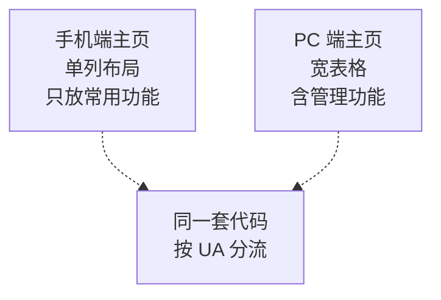

两种做法：

| 做法 | 说明 |
|---|---|
| 配两个地址 | 后台分别填手机端和桌面端主页 |
| 配同一个地址 | 代码里按 UA 决定显示什么 |

本教程用第二种，因为只有一套页面，靠 `ClientDetector.IsDesktopWeCom` 判断就够了。

## 部署检查清单

每次发布后按顺序过一遍：

| 项 | 检查方法 | 期望 |
|---|---|---|
| 1 | 电脑浏览器打开主页 | 正常，有安全锁 |
| 2 | 手机移动网络打开 | 正常，无证书警告 |
| 3 | 在线工具查证书链 | 完整，支持 TLS 1.2 |
| 4 | `curl -i` 校验文件 | 返回 200 |
| 5 | 手机企业微信工作台 | 看到应用图标 |
| 6 | 点击图标 | 打开入口页 |
| 7 | 看「访问地址」 | 与地址栏完全一致，是 https |
| 8 | 看「资源版本」 | 是本次发布的时间 |
| 9 | 外部浏览器打开 | 显示提示，不显示功能入口 |
| 10 | 后台三处域名配置 | 主页、OAuth、JS-SDK 都已填 |

第 7 项和第 10 项是为第 8、9 章做的准备，**现在确认好能省很多排查时间**。

---

# 本章自测

| 测试 | 做法 | 期望结果 |
|---|---|---|
| 1 IIS | 本机打开 `.aspx` | 执行而不是下载 |
| 2 外网 | 手机关 Wi-Fi 用移动网络打开 | 能访问 |
| 3 证书 | 手机浏览器打开 | 无证书警告 |
| 4 证书链 | 在线检测工具 | 链完整 |
| 5 HTTP 跳转 | 访问 `http://` 地址 | 自动跳到 `https` |
| 6 校验文件 | `curl -i` 那个 txt | 返回 200 且内容正确 |
| 7 校验文件不被跳转 | 用 `http` 访问 txt | 不返回 302 |
| 8 工作台 | 手机企业微信工作台 | 看到应用图标 |
| 9 点击进入 | 点击图标 | 打开入口页 |
| 10 UA 判断 | 手机浏览器直接打开 | 显示需在企业微信打开的提示 |
| 11 微信区分 | 把链接发到微信里打开 | 提示需用企业微信 |
| 12 viewport | 手机上看页面 | 字号正常，无需放大 |
| 13 表格滚动 | 手机上看员工列表 | 可左右滑动，不挤变形 |
| 14 真实地址 | 看「访问地址」 | 与地址栏一致，是 https |
| 15 版本号 | 改 CSS 后重新发布 | 手机上样式立即更新 |

第 14 项最容易被跳过，但它是第 9 章能否顺利的关键。

# 错误排查

| 现象 | 原因 | 解决 |
|---|---|---|
| 浏览器下载 `.aspx` | ASP.NET 未注册 | 运行 `aspnet_regiis -i` |
| 外网访问不到 | 安全组、防火墙、绑定三处之一未放行 | 逐一检查 |
| 电脑正常手机报证书错 | 证书链不完整 | 导入完整链 |
| 校验提示不通过 | 文件不在根目录 | 移到物理根目录 |
| 校验文件 404 | 发布时未包含该文件 | 生成操作设为「内容」 |
| 校验文件返回 302 | 被登录跳转或 HTTPS 跳转拦截 | 加白名单放行 |
| 工作台无图标 | 不在可见范围 | 后台加入可见范围 |
| 点图标白屏 | 证书问题或页面 500 | **先用手机浏览器打开定位** |
| 页面字很小 | 缺 viewport | 补 `meta` 标签 |
| 表格挤变形 | 未套滚动容器 | 加 `overflow-x: auto` |
| 地址显示 http | 在代理后面 | 读 `X-Forwarded-Proto` |
| 样式不更新 | 内置浏览器缓存 | 加版本号参数 |

其中「点图标白屏」的排查次序值得再强调：

```mermaid
graph TB
    A["点图标白屏"] --> B["先用手机浏览器<br/>打开同一地址"]
    B --> C["浏览器也白屏<br/>问题在页面或证书"]
    B --> D["浏览器正常<br/>才是企业微信相关问题"]
```

# 完成标准

## 理解部分

- [ ] 页面请求是从员工手机发出的，还是从腾讯服务器发出的
- [ ] 为什么必须 HTTPS 且外网可达
- [ ] 为什么电脑浏览器能打开、手机却报证书错误
- [ ] 域名归属校验为什么必要，原理是什么
- [ ] 主页地址、OAuth 可信域名、JS-SDK 可信域名三者的区别
- [ ] 为什么只判断 `micromessenger` 不够，要看 `wxwork`
- [ ] 为什么 UA 不能用于安全判断
- [ ] 反向代理下协议信息为什么会丢失
- [ ] 什么情况下才可以信任 `X-Forwarded-Proto`
- [ ] 版本号为什么用发布时间而不是当前时间

## 操作部分

- [ ] 15 项自测全部通过
- [ ] 部署检查清单 10 项全部确认
- [ ] 后台三处域名配置都已填写
- [ ] 「访问地址」显示的与手机地址栏完全一致

# 下一章

第 8 章做 OAuth2.0 免登录：员工从工作台点开页面后，**不输入任何账号密码**，页面就能知道他是谁。

本章的两处准备会在第 8 章直接用上：

| 本章成果 | 第 8 章怎么用 |
|---|---|
| 可信域名已配置 | OAuth 回调地址必须在可信域名下 |
| `UrlHelper.GetPublicUrl` | 构造回调地址和第 9 章签名都要用 |
