# 第 8 章：OAuth2.0 网页授权与身份登录

## 语言边界

本章功能完全由 C# ASP.NET WebForms 实现，不调用 Python。

## 本章目标

员工从企业微信工作台点开页面后，**不输入任何账号密码**，页面就知道他是谁。

## 前置条件

- 第 7 章完成：应用主页能从工作台打开
- 后台已配置「网页授权可信域名」
- `UrlHelper.GetPublicUrl` 可用（第 7 章 V8）

## 本章要解决的问题

第 7 章的页面对所有人显示同样的内容。它不知道访问者是张三还是李四，所以做不到：

| 做不到什么 | 需要什么 |
|---|---|
| 显示「你好，张三」 | 知道当前成员是谁 |
| 只让财务部看财务数据 | 知道成员属于哪个部门 |
| 记录谁查询了员工资料 | 有可追溯的身份 |

## 版本地图

| 版本 | 主题 | 解决上一版什么问题 |
|---|---|---|
| V1 | 构造授权链接拿到 code | —— |
| V2 | 用 code 换 UserId | code 本身没有身份信息 |
| V3 | state 防伪造 | 回调地址可被他人构造 |
| V4 | Session 登录状态 | 每次翻页都重新授权 |
| V5 | 页面基类与访问控制 | 每个页面重复写登录检查 |
| V6 | 避免重定向死循环 | 页面无限跳转 |
| V7 | 超时与 Cookie 恢复 | 填表中途被要求重新登录 |
| V8 | 取成员详细资料 | 只有 UserId，没有姓名 |
| V9 | 两种 scope 与敏感信息 | 拿不到手机号 |
| V10 | 登录日志与审计 | 无法追溯谁访问过 |
| V11 | 按部门和角色授权 | 所有人权限一样 |
| V12 | 集成版 | 代码零散 |

---

# V1：构造授权链接拿到 code

## 目标

让企业微信把一个叫 `code` 的东西送到你的页面。

## 原理：免登录的信任链是怎么建立的

关键在于：**企业微信客户端已经知道员工是谁了。**他在客户端里早就登录过。

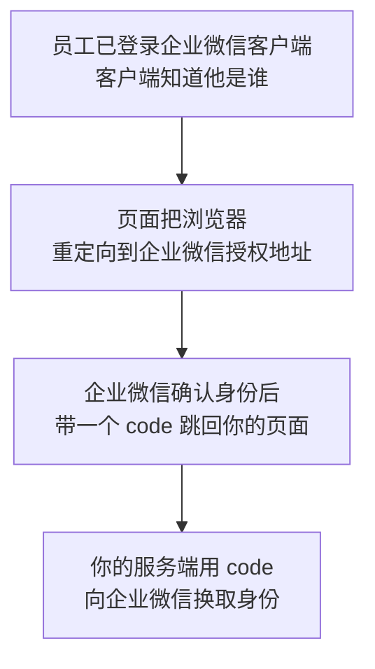

所以这个「免登录」不是绕过验证，而是**把已有的登录状态借用过来**。验证是企业微信做的，你只是接收结果。

## 原理：为什么要用 code 中转

一个自然的疑问：既然企业微信知道员工是谁，为什么不直接把 UserId 放在跳回来的地址里？

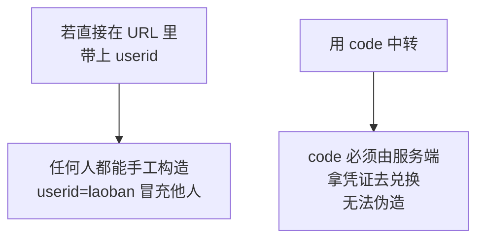

`code` 的三个特性共同保证了安全：

| 特性 | 作用 |
|---|---|
| 一次性 | 用过即废，防止重放 |
| 短期有效 | 只有几分钟，泄露损失有限 |
| 必须服务端兑换 | 兑换需要 `access_token`，浏览器拿不到 |

**这就是第 1 章「凭证换凭证」思路的又一次应用。**

## 授权链接的格式

```text
https://open.weixin.qq.com/connect/oauth2/authorize
  ?appid=企业CorpID
  &redirect_uri=经过URL编码的回调地址
  &response_type=code
  &scope=snsapi_base
  &state=自定义随机串
  #wechat_redirect
```

## 五个参数说明

| 参数 | 填什么 | 易错点 |
|---|---|---|
| `appid` | **企业 CorpID**，不是 AgentId | 填成 AgentId 会失败 |
| `redirect_uri` | 你的回调页面完整地址 | **必须 URL 编码** |
| `response_type` | 固定 `code` | —— |
| `scope` | `snsapi_base` 或 `snsapi_privateinfo` | 见 V9 |
| `state` | 自定义字符串 | 见 V3，不能省 |

还有两个硬要求：

1. **末尾的 `#wechat_redirect` 不能省略**
2. **回调地址的域名必须是已配置的可信域名**

## 代码

`App_Code/OAuthHelper.cs`：

```csharp
using System;
using System.Configuration;
using System.Web;

namespace WeComWeb
{
    /// <summary>企业微信网页授权。</summary>
    public static class OAuthHelper
    {
        private const string AuthorizeUrl =
            "https://open.weixin.qq.com/connect/oauth2/authorize";

        /// <summary>构造授权链接。</summary>
        /// <param name="callbackUrl">回调页面的完整地址</param>
        /// <param name="state">防伪造随机串</param>
        /// <param name="needPrivateInfo">是否需要敏感信息，见 V9</param>
        public static string BuildAuthorizeUrl(string callbackUrl, string state,
            bool needPrivateInfo = false)
        {
            string corpId = ConfigurationManager.AppSettings["WeCom.CorpId"];
            string scope = needPrivateInfo ? "snsapi_privateinfo" : "snsapi_base";

            // redirect_uri 必须编码，否则它自己的查询参数会破坏外层结构
            string encoded = HttpUtility.UrlEncode(callbackUrl);

            string url = string.Format(
                "{0}?appid={1}&redirect_uri={2}&response_type=code&scope={3}&state={4}",
                AuthorizeUrl, corpId, encoded, scope, state);

            // 使用 snsapi_privateinfo 时必须带上 agentid
            if (needPrivateInfo)
            {
                url += "&agentid="
                     + ConfigurationManager.AppSettings["WeCom.AgentId"];
            }

            // 这个片段标识不能省略
            return url + "#wechat_redirect";
        }
    }
}
```

## 为什么 `redirect_uri` 必须编码

回调地址本身可能带查询参数：

```text
https://your-domain.com/OAuthCallback.aspx?from=list
```

不编码时，整个授权链接变成：

```text
...&redirect_uri=https://your-domain.com/OAuthCallback.aspx?from=list&response_type=code...
```

企业微信解析时，`redirect_uri` 的值只到 `.aspx` 就被 `?` 截断了，`from=list` 和 `response_type` 都成了外层参数。结果是回调地址不完整，报参数错误。

编码后 `?` 变成 `%3F`，不会被误解析。

## 临时测试页

`OAuthCallback.aspx`，先只把收到的东西显示出来：

```aspx
<%@ Page Language="C#" AutoEventWireup="true"
    CodeBehind="OAuthCallback.aspx.cs" Inherits="WeComWeb.OAuthCallback" %>
<!DOCTYPE html>
<html>
<head runat="server">
    <meta name="viewport" content="width=device-width, initial-scale=1" />
    <title>授权回调</title>
</head>
<body>
    <h3>收到的参数</h3>
    <p>code：<asp:Literal ID="litCode" runat="server" /></p>
    <p>state：<asp:Literal ID="litState" runat="server" /></p>
</body>
</html>
```

```csharp
protected void Page_Load(object sender, EventArgs e)
{
    litCode.Text = Server.HtmlEncode(Request.QueryString["code"] ?? "(无)");
    litState.Text = Server.HtmlEncode(Request.QueryString["state"] ?? "(无)");
}
```

## 发起授权

在入口页 `Default.aspx.cs` 里加一个测试按钮的处理：

```csharp
protected void btnLogin_Click(object sender, EventArgs e)
{
    // 回调地址要用第 7 章的方法，代理场景下才能拿到正确的 https 地址
    string callback = new Uri(
        new Uri(UrlHelper.GetPublicUrl(Request)),
        "OAuthCallback.aspx").ToString();

    string url = OAuthHelper.BuildAuthorizeUrl(callback, "test123");
    Response.Redirect(url, true);
}
```

## 验证

在手机企业微信里点这个按钮，页面应该跳转回来并显示一串 `code`。

**能看到 code 就说明第 7 章的可信域名配对了。**如果提示 `redirect_uri` 参数错误，回去检查可信域名配置。

## V1 的问题

拿到的 `code` 是一串随机字符，里面没有任何身份信息。

---

# V2：用 code 换 UserId

## 目标

把 `code` 兑换成成员身份。

## 接口

```text
GET {BaseUrl}/auth/getuserinfo?access_token=TOKEN&code=CODE
```

这是当前的接口路径（早期文档里的 `user/getuserinfo` 是旧路径，两者都能查到资料，新项目用前者，参见[企业微信获取访问用户身份接口讨论](https://developers.weixin.qq.com/community/personal/oCJUsw6t99CoDiiZN4FlgcpAQJcM/question)。内容已改写以符合授权要求）。

返回：

```json
{
  "errcode": 0,
  "errmsg": "ok",
  "userid": "zhangsan"
}
```

## 原理：这里该用哪个 token

**必须用应用 Secret 换的 token**，因为 OAuth 是应用维度的行为：授权链接里的 `appid` 是企业 ID，但整个授权动作属于某个具体应用。

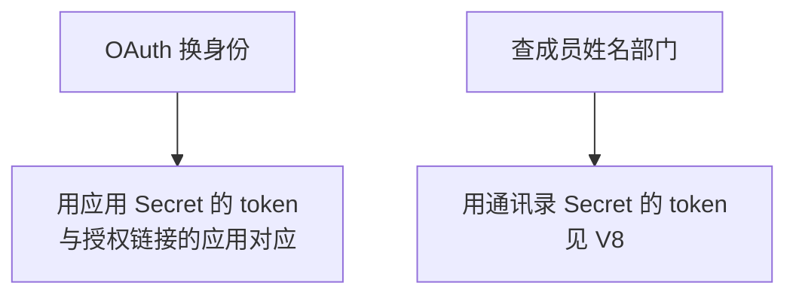

第 6 章的 `WeComApi` 已经把两种 token 分开了，这里调 `GetAppTokenAsync`。

**这是本教程里两种 Secret 在同一个流程中同时出场的地方。**V8 会看到它们如何配合。

## 代码

加到 `OAuthHelper` 里：

```csharp
using System.Threading.Tasks;
using Newtonsoft.Json.Linq;

/// <summary>OAuth 换取的身份结果。</summary>
public class OAuthIdentity
{
    /// <summary>企业成员的 UserId。非企业成员时为空。</summary>
    public string UserId { get; set; }

    /// <summary>非企业成员的标识，例如外部联系人。</summary>
    public string OpenId { get; set; }

    /// <summary>获取敏感信息用的票据，仅 snsapi_privateinfo 返回。见 V9。</summary>
    public string UserTicket { get; set; }

    /// <summary>是否本企业成员。</summary>
    public bool IsInternal
    {
        get { return !string.IsNullOrEmpty(UserId); }
    }
}

/// <summary>用 code 换取访问者身份。</summary>
public static async Task<OAuthIdentity> GetIdentityAsync(string code)
{
    // OAuth 用应用 Secret 的 token
    string token = await WeComApi.GetAppTokenAsync();
    string baseUrl = ConfigurationManager.AppSettings["WeCom.BaseUrl"];

    string url = string.Format("{0}/auth/getuserinfo?access_token={1}&code={2}",
        baseUrl, token, Uri.EscapeDataString(code));

    JObject obj = await WeComApi.GetJsonAsync(url, "auth/getuserinfo");

    return new OAuthIdentity
    {
        UserId = obj.Value<string>("userid"),
        OpenId = obj.Value<string>("openid"),
        UserTicket = obj.Value<string>("user_ticket")
    };
}
```

## 为什么要区分 `userid` 和 `openid`

企业微信的页面**不只有内部员工可能打开**。外部联系人、客户也可能通过分享的链接进来。

| 返回的字段 | 访问者身份 |
|---|---|
| `userid` | 本企业成员 |
| `openid` | 非企业成员 |

内部应用应该拒绝非企业成员：

```csharp
if (!identity.IsInternal)
{
    // 不是本企业成员，明确拒绝
    ShowError("本应用仅供企业内部成员使用。");
    return;
}
```

不做这个判断的话，`userid` 为空会导致后续代码把空字符串当成身份，行为难以预测。

## 回调页改造

```csharp
using System;
using System.Threading.Tasks;
using System.Web.UI;

namespace WeComWeb
{
    public partial class OAuthCallback : Page
    {
        protected void Page_Load(object sender, EventArgs e)
        {
            RegisterAsyncTask(new PageAsyncTask(HandleAsync));
        }

        private async Task HandleAsync()
        {
            string code = Request.QueryString["code"];

            if (string.IsNullOrEmpty(code))
            {
                litMessage.Text = "未收到授权码，请从企业微信工作台重新进入。";
                return;
            }

            try
            {
                OAuthIdentity id = await OAuthHelper.GetIdentityAsync(code);

                if (!id.IsInternal)
                {
                    litMessage.Text = "本应用仅供企业内部成员使用。";
                    return;
                }

                litMessage.Text = "识别成功，你的 UserId 是："
                                + Server.HtmlEncode(id.UserId);
            }
            catch (WeComException ex)
            {
                litMessage.Text = "身份识别失败：" + Server.HtmlEncode(ex.Message);
            }
        }
    }
}
```

## 验证

从工作台进入并点登录，页面应该显示你的 UserId。

## 关于 40029

这是本章最常见的错误，含义是「code 无效」。它在社区里出现频率很高（例如[网页授权 40029 的讨论](https://developers.weixin.qq.com/community/personal/oCJUsw0YtVj_lnw_TFcijZqLMHaI/answer)。内容已改写以符合授权要求）。

四个原因，按可能性排序：

| 原因 | 具体表现 |
|---|---|
| **code 被用过了** | 刷新回调页面时最容易发生 |
| code 已过期 | 授权后隔了很久才处理 |
| 用错了应用的 token | token 与授权链接的应用不匹配 |
| code 被截断 | 未做 URL 编码或被日志截断 |

第一个原因值得单独讲。

## 为什么刷新回调页会报 40029

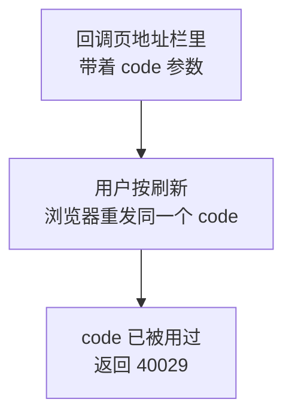

这不是 bug，而是 `code` 一次性设计的正常结果。

**解决办法是处理完立即跳转到干净的地址**，让地址栏里不再有 `code`。V4 会这么做。

## V2 的问题

回调地址是固定的，任何人都能构造一个带 `code` 的请求发到这个地址。虽然伪造的 `code` 换不到身份，但流程上缺少一道校验。

---

# V3：state 防伪造

## 目标

确认这次回调确实是你自己发起的授权。

## 原理：跨站请求伪造

设想这样一个攻击：

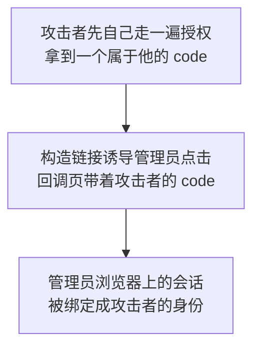

危害是**管理员在自己的浏览器里，以攻击者的身份登录了**。此时管理员的操作会被记在攻击者名下，或者攻击者可以通过某些方式利用这个混淆的会话。

## `state` 如何阻断

原理是「我发出去的凭据，回来时必须能对上」：

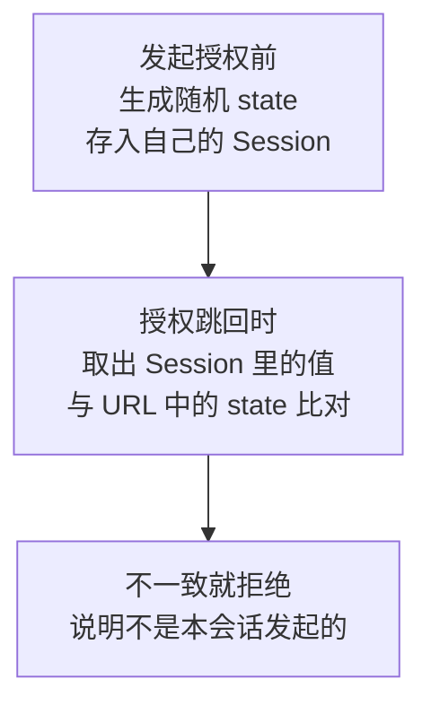

攻击者无法知道受害者 Session 里存的随机值，所以他构造的链接带不上正确的 `state`。

## 三个必须做到的点

| 要求 | 原因 |
|---|---|
| 足够随机 | 可猜测的话防护失效 |
| 存服务端 | 存在 Cookie 里会被一起伪造 |
| 用后即删 | 防止重复使用同一个 state |

## 代码

```csharp
/// <summary>生成并保存 state。</summary>
public static string CreateState(HttpSessionState session)
{
    // GUID 足够随机，不需要额外的随机源
    string state = Guid.NewGuid().ToString("N");
    session["OAuthState"] = state;
    session["OAuthStateTime"] = DateTime.Now;
    return state;
}

/// <summary>校验 state。校验后立即失效，无论成功与否。</summary>
public static bool ValidateState(HttpSessionState session, string state)
{
    string saved = session["OAuthState"] as string;
    DateTime? savedAt = session["OAuthStateTime"] as DateTime?;

    // 一次性：无论结果如何都清掉，防止重复使用
    session.Remove("OAuthState");
    session.Remove("OAuthStateTime");

    if (string.IsNullOrEmpty(saved) || string.IsNullOrEmpty(state))
    {
        return false;
    }

    // 超过 10 分钟未完成授权就作废
    if (savedAt.HasValue && (DateTime.Now - savedAt.Value).TotalMinutes > 10)
    {
        return false;
    }

    // 定长比较，避免因长度差异泄露信息
    return string.Equals(saved, state, StringComparison.Ordinal);
}
```

## 为什么校验失败也要清掉 state

```csharp
// 一次性：无论结果如何都清掉，防止重复使用
session.Remove("OAuthState");
```

如果失败时保留，攻击者可以反复尝试。清掉后每次尝试都必须重新发起授权，成本大幅提高。

## 回调页接入

```csharp
private async Task HandleAsync()
{
    string code = Request.QueryString["code"];
    string state = Request.QueryString["state"];

    if (string.IsNullOrEmpty(code))
    {
        litMessage.Text = "未收到授权码，请从企业微信工作台重新进入。";
        return;
    }

    // 先校验 state，再做任何其他处理
    if (!OAuthHelper.ValidateState(Session, state))
    {
        litMessage.Text = "授权状态校验失败，请重新从工作台进入应用。";
        return;
    }

    // ... 后续换取身份
}
```

## 一个必须注意的顺序

**先校验 `state`，再用 `code` 去换身份。**

反过来的话，即使校验失败，你也已经消耗了一次接口调用，而且 `code` 已被作废。攻击者可以借此消耗你的接口配额。

## V3 的问题

每次翻页、每次点按钮都要重新走一遍授权，慢且体验差。

---

# V4：Session 登录状态

## 目标

授权一次，之后的访问都记得。

## 原理：为什么需要保存状态

HTTP 是无状态的。服务器处理完一个请求就忘了，下一个请求来时不知道是谁。

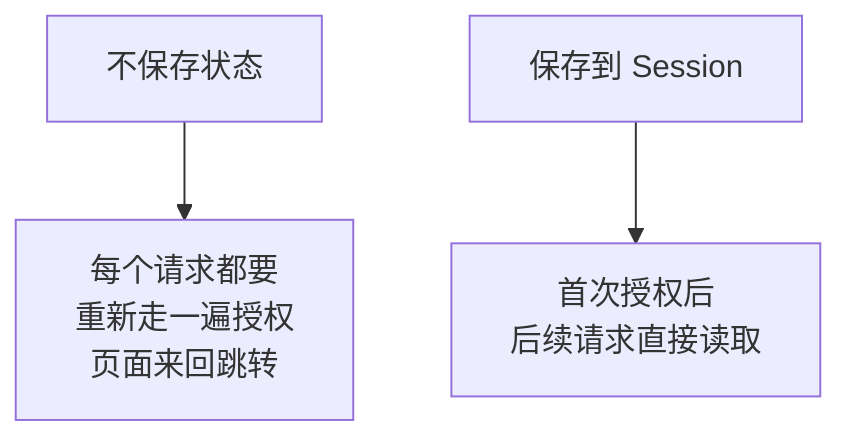

## 原理：Session 是怎么认出同一个人的

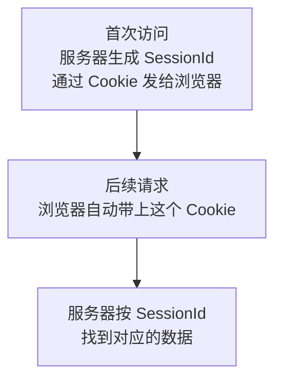

所以 Session 依赖 Cookie。**企业微信内置浏览器支持 Cookie**，所以这套机制可用。

## 代码

登录成功后写入 Session：

```csharp
OAuthIdentity id = await OAuthHelper.GetIdentityAsync(code);

if (!id.IsInternal)
{
    litMessage.Text = "本应用仅供企业内部成员使用。";
    return;
}

// 写入登录状态
Session["WeComUserId"] = id.UserId;
Session["LoginAt"] = DateTime.Now;

// 关键：跳转到不带 code 的干净地址
string returnUrl = Request.QueryString["returnUrl"];
if (string.IsNullOrEmpty(returnUrl) || !IsLocalUrl(returnUrl))
{
    returnUrl = "~/Default.aspx";
}
Response.Redirect(returnUrl, true);
```

## 为什么必须跳转到干净地址

两个理由：

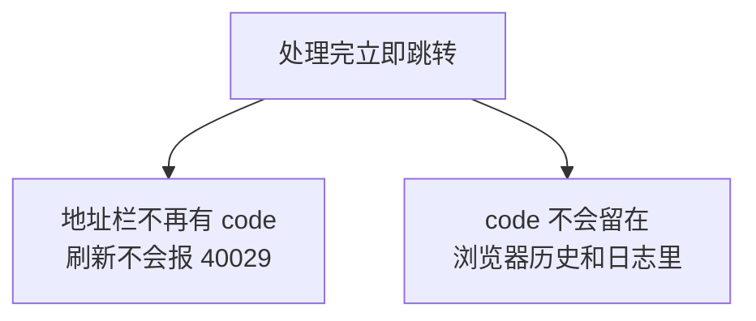

第二点也是安全考虑：虽然 `code` 已经作废，但让它出现在历史记录里没有必要。

## 关于 returnUrl 的安全检查

```csharp
if (string.IsNullOrEmpty(returnUrl) || !IsLocalUrl(returnUrl))
```

`returnUrl` 来自 URL 参数，是用户可控的。如果不校验，攻击者可以构造：

```text
OAuthCallback.aspx?returnUrl=https://恶意站点/
```

员工完成授权后被送到恶意站点，而且是从你的可信页面跳过去的，很容易上当。这叫开放重定向。

校验方法：

```csharp
/// <summary>只允许跳转到本站地址，防止开放重定向。</summary>
private static bool IsLocalUrl(string url)
{
    if (string.IsNullOrEmpty(url))
    {
        return false;
    }

    // 以 / 开头且不是 // 开头（// 会被当成协议相对地址跳到外站）
    if (url.StartsWith("/") && !url.StartsWith("//"))
    {
        return true;
    }

    // 以 ~/ 开头是 ASP.NET 的应用相对路径
    if (url.StartsWith("~/"))
    {
        return true;
    }

    return false;
}
```

注意 `//` 的情况：`//evil.com` 在浏览器里等价于 `https://evil.com`，很容易漏掉。

## 读取登录状态

```csharp
/// <summary>当前登录成员的 UserId，未登录时为 null。</summary>
public static string GetCurrentUserId(HttpSessionState session)
{
    return session == null ? null : session["WeComUserId"] as string;
}
```

## V4 的问题

每个需要登录的页面都要写一遍「检查 Session，没有就跳转授权」，重复且容易漏。

---

# V5：页面基类与访问控制

## 目标

用一个基类统一处理登录检查。

## 原理：为什么用基类而不是每页写

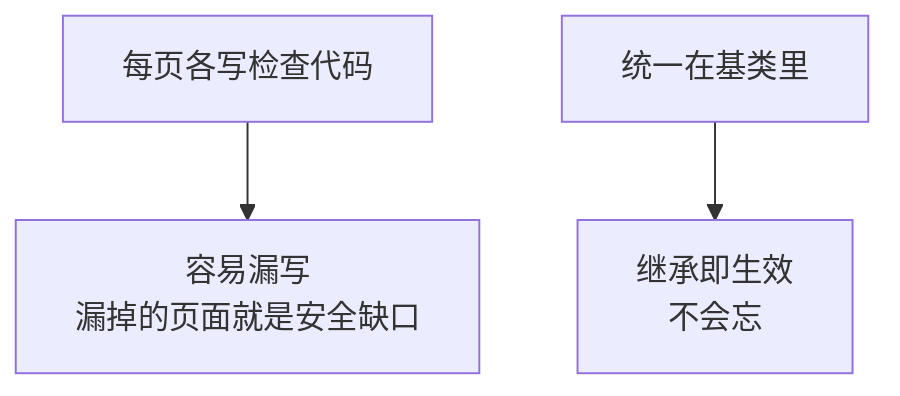

**安全检查最怕的是「漏了一个」。**把它放在必经之路上，比依赖每次都记得写更可靠。

## 代码

`App_Code/WeComBasePage.cs`：

```csharp
using System;
using System.Web;
using System.Web.UI;

namespace WeComWeb
{
    /// <summary>需要企业微信身份的页面基类。</summary>
    public class WeComBasePage : Page
    {
        /// <summary>当前登录成员的 UserId。</summary>
        protected string CurrentUserId
        {
            get { return Session["WeComUserId"] as string; }
        }

        /// <summary>子类可重写，返回 false 表示本页不需要登录。</summary>
        protected virtual bool RequireLogin
        {
            get { return true; }
        }

        protected override void OnPreInit(EventArgs e)
        {
            base.OnPreInit(e);

            // 动态页面禁止缓存，避免登录状态被缓存
            Response.Cache.SetCacheability(HttpCacheability.NoCache);
            Response.Cache.SetNoStore();

            if (!RequireLogin)
            {
                return;
            }

            if (string.IsNullOrEmpty(CurrentUserId))
            {
                RedirectToLogin();
            }
        }

        /// <summary>跳转到授权流程，并记住当前想访问的页面。</summary>
        protected void RedirectToLogin()
        {
            // 记住原本要去的地址，授权完成后送回去
            string returnUrl = Request.RawUrl;

            string callback = new Uri(
                new Uri(UrlHelper.GetPublicUrl(Request)),
                "OAuthCallback.aspx?returnUrl="
                    + HttpUtility.UrlEncode(returnUrl)).ToString();

            string state = OAuthHelper.CreateState(Session);
            string authUrl = OAuthHelper.BuildAuthorizeUrl(callback, state);

            Response.Redirect(authUrl, true);
        }
    }
}
```

## 为什么用 `OnPreInit` 而不是 `Page_Load`

页面生命周期的顺序决定了检查越早越好：

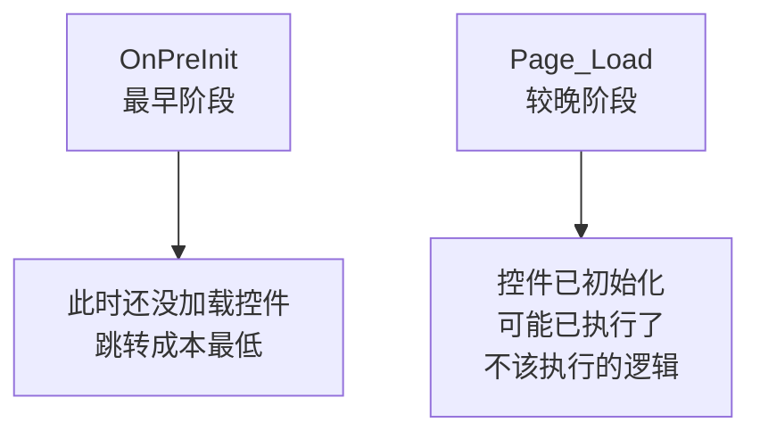

如果在 `Page_Load` 里检查，控件的初始化和某些数据绑定可能已经跑过了。未登录用户虽然最终被跳走，但服务器已经做了不该做的工作。

## 记住原本要去的地址

```csharp
string returnUrl = Request.RawUrl;
```

这一步是体验关键。假设员工收到一条消息，点开的是「员工详情页」的链接：

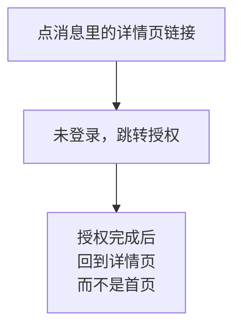

不记住的话，员工授权后到了首页，还得自己再找一遍。

## 页面改造

把需要登录的页面改成继承基类：

```csharp
// 原来
public partial class EmployeeSearch : Page

// 改成
public partial class EmployeeSearch : WeComBasePage
```

并在 `.aspx` 里同步修改 `Inherits`。

## 显示当前登录者

在母版页加一行，让员工确认自己的身份：

```csharp
protected void Page_Load(object sender, EventArgs e)
{
    string userId = Session["WeComUserId"] as string;
    litCurrentUser.Text = string.IsNullOrEmpty(userId)
        ? "" : "当前：" + Server.HtmlEncode(userId);
}
```

V8 会把这里改成显示姓名。

## V5 的问题

如果不小心让回调页也继承了基类，会出现无限跳转。

---

# V6：避免重定向死循环

## 现象

页面在两个地址之间反复跳转，浏览器最终报「重定向次数过多」。手机上表现为白屏或转圈。

## 原理：环是怎么形成的

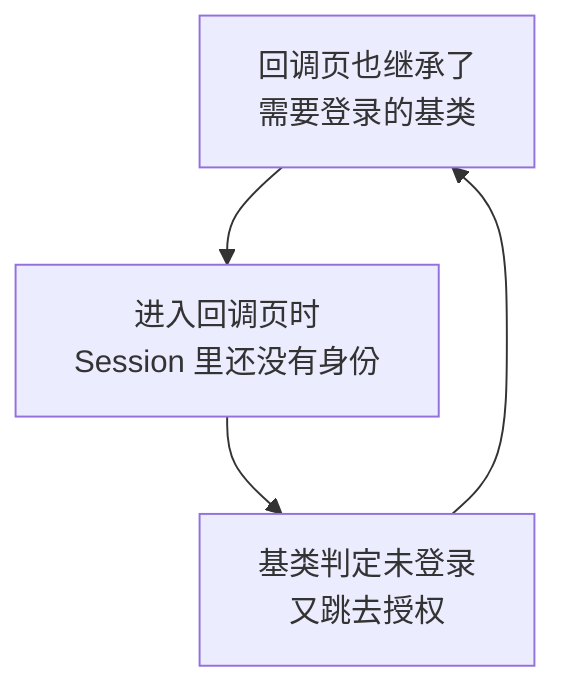

死结在于：**回调页的职责就是建立登录状态，所以它自己不能要求已登录。**

## 三条必须排除在外的路径

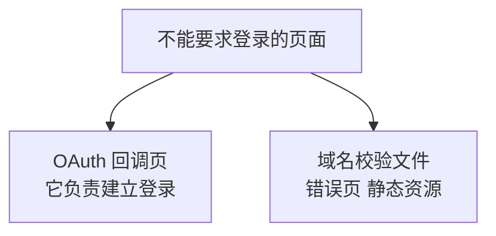

## 代码：让回调页明确声明

```csharp
public partial class OAuthCallback : WeComBasePage
{
    // 回调页负责建立登录状态，自身绝不能要求登录
    protected override bool RequireLogin
    {
        get { return false; }
    }
}
```

基类里的 `RequireLogin` 设成 `virtual` 就是为了这个。

## 加一道保险：跳转次数限制

即使逻辑写对了，也可能因为 Session 写不进去（比如 Cookie 被禁）而形成环。加一个计数器兜底：

```csharp
protected void RedirectToLogin()
{
    // 用 Cookie 记录短时间内的跳转次数，防止意外死循环
    const string counterName = "oauth_redirect_count";
    int count = 0;

    HttpCookie cookie = Request.Cookies[counterName];
    if (cookie != null)
    {
        int.TryParse(cookie.Value, out count);
    }

    if (count >= 3)
    {
        // 连续三次都没能建立登录状态，停下来给出提示
        ClearRedirectCounter();
        Response.Clear();
        Response.Write("<meta name='viewport' content='width=device-width,"
            + " initial-scale=1'/>"
            + "<h3>无法完成身份识别</h3>"
            + "<p>可能原因：浏览器禁用了 Cookie，或应用配置有误。</p>"
            + "<p>请退出应用后重新从企业微信工作台进入。</p>");
        Response.End();
        return;
    }

    var newCookie = new HttpCookie(counterName, (count + 1).ToString());
    newCookie.HttpOnly = true;
    // 只保留 2 分钟，正常授权完成后自然过期
    newCookie.Expires = DateTime.Now.AddMinutes(2);
    Response.Cookies.Add(newCookie);

    string returnUrl = Request.RawUrl;
    string callback = new Uri(
        new Uri(UrlHelper.GetPublicUrl(Request)),
        "OAuthCallback.aspx?returnUrl="
            + HttpUtility.UrlEncode(returnUrl)).ToString();

    string state = OAuthHelper.CreateState(Session);
    Response.Redirect(OAuthHelper.BuildAuthorizeUrl(callback, state), true);
}

/// <summary>登录成功后清掉计数器。</summary>
protected void ClearRedirectCounter()
{
    var cookie = new HttpCookie("oauth_redirect_count", "");
    cookie.Expires = DateTime.Now.AddDays(-1);
    Response.Cookies.Add(cookie);
}
```

登录成功后要清掉它：

```csharp
Session["WeComUserId"] = id.UserId;
ClearRedirectCounter();      // 成功了，计数器归零
Response.Redirect(returnUrl, true);
```

## 为什么这道保险值得加

死循环的排查体验非常差：

| 没有保险 | 有保险 |
|---|---|
| 手机上白屏或转圈 | 显示明确的原因和建议 |
| 看不到任何错误信息 | 直接指向 Cookie 或配置问题 |
| 只能靠猜 | 有方向 |

**它不解决根本问题，但把「无声失败」变成了「明确报错」。**这在移动端尤其重要，因为你没法打开开发者工具看。

## 另一种常见环：returnUrl 指向了回调页

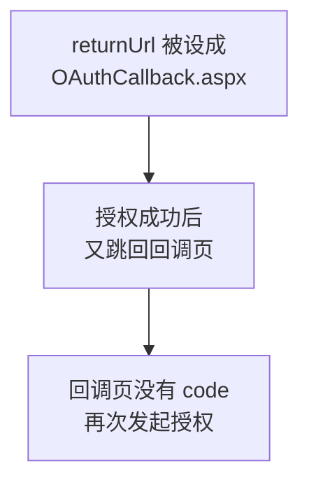

防御方法是在回调页里检查：

```csharp
// returnUrl 不能指向回调页自身
if (returnUrl.IndexOf("OAuthCallback", StringComparison.OrdinalIgnoreCase) >= 0)
{
    returnUrl = "~/Default.aspx";
}
```

## V6 的问题

员工正在填一个较长的表单，中途 Session 超时了，一提交就被要求重新授权，填的内容全丢了。


---

# V7：超时与 Cookie 恢复

## 目标

减少员工被迫重新授权的次数。

## 原理：Session 会在三种情况下消失

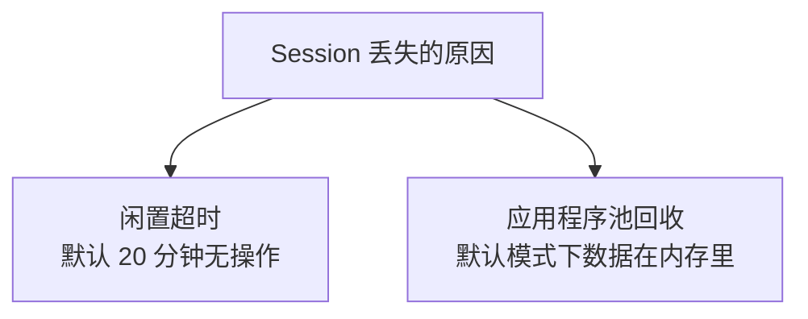

第三种是服务器重启或部署新版本。

其中第二种最容易被忽略：**IIS 默认会定时回收应用程序池**，回收后进程内的 Session 全部清空。员工可能什么都没做，只是隔了一会儿再点，就被要求重新授权。

## 两个层面的改善

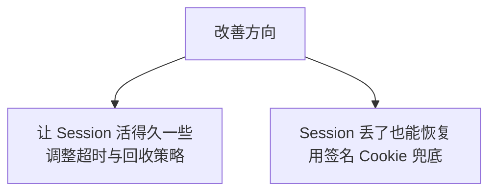

## 第一层：调整配置

```xml
<system.web>
  <!-- 默认 20 分钟，内部应用可以放宽 -->
  <sessionState mode="InProc" timeout="120" />
</system.web>
```

同时调整应用程序池的回收策略：

| 设置 | 默认值 | 建议 |
|---|---|---|
| 空闲超时 | 20 分钟 | 0（不因空闲关闭） |
| 定期回收间隔 | 1740 分钟 | 0，改用固定时间回收 |
| 固定时间回收 | 无 | 设为凌晨，避开工作时间 |

**这只是缓解，不是解决。**部署新版本时 Session 必然丢失。

## 更彻底的做法：Session 存到进程外

```xml
<sessionState mode="StateServer"
              stateConnectionString="tcpip=127.0.0.1:42424"
              timeout="120" />
```

需要启动 Windows 的「ASP.NET 状态服务」。这样应用程序池回收后 Session 仍然存在。

代价是：

| 代价 | 说明 |
|---|---|
| 多一个依赖 | 状态服务挂了整站受影响 |
| 存的对象必须可序列化 | 复杂对象要加标记 |
| 稍慢 | 每次读写要跨进程 |

**本教程的选择是 `InProc` 加签名 Cookie 兜底**，因为它不引入新的运行依赖。

## 第二层：签名 Cookie 恢复身份

思路是登录成功时额外写一个 Cookie。Session 丢失时用它恢复身份，避免重新走授权。

### 原理：为什么不能只用 Base64

一个错误做法是把 UserId 简单编码后放进 Cookie：

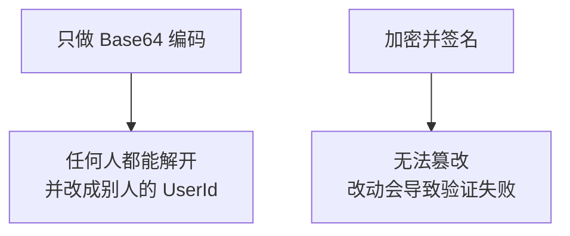

Base64 不是加密，它是编码，随手就能解开。**用它保存身份等于让任何人都能冒充任意成员。**

### 正确做法：用框架自带的保护机制

不要自己写加密代码。.NET 提供了现成的：

```csharp
using System;
using System.Text;
using System.Web;
using System.Web.Security;

namespace WeComWeb
{
    /// <summary>用签名加密的 Cookie 保存登录身份。</summary>
    public static class LoginCookie
    {
        private const string CookieName = "wecom_auth";
        // 用途标识，防止本 Cookie 被拿去当别的用途使用
        private static readonly string[] Purpose = { "WeComWeb.Login.v1" };

        /// <summary>写入登录 Cookie。</summary>
        public static void Write(HttpResponse response, string userId,
            int validHours = 12)
        {
            // 内容里带上过期时间，防止旧 Cookie 被长期重放
            string raw = string.Format("{0}|{1}",
                userId, DateTime.UtcNow.AddHours(validHours).Ticks);

            byte[] data = Encoding.UTF8.GetBytes(raw);

            // MachineKey.Protect 同时做加密和签名，篡改会导致解析失败
            byte[] protectedData = MachineKey.Protect(data, Purpose);
            string value = HttpServerUtility.UrlTokenEncode(protectedData);

            var cookie = new HttpCookie(CookieName, value);
            cookie.HttpOnly = true;      // 禁止 JS 读取，降低被窃取风险
            cookie.Secure = true;        // 只在 HTTPS 下发送
            cookie.Expires = DateTime.Now.AddHours(validHours);
            response.Cookies.Add(cookie);
        }

        /// <summary>尝试从 Cookie 恢复身份，失败返回 null。</summary>
        public static string TryRead(HttpRequest request)
        {
            HttpCookie cookie = request.Cookies[CookieName];
            if (cookie == null || string.IsNullOrEmpty(cookie.Value))
            {
                return null;
            }

            try
            {
                byte[] protectedData =
                    HttpServerUtility.UrlTokenDecode(cookie.Value);
                if (protectedData == null)
                {
                    return null;
                }

                // 被篡改过的话这里会抛异常
                byte[] data = MachineKey.Unprotect(protectedData, Purpose);
                if (data == null)
                {
                    return null;
                }

                string raw = Encoding.UTF8.GetString(data);
                string[] parts = raw.Split('|');
                if (parts.Length != 2)
                {
                    return null;
                }

                // 检查内容里的过期时间，不能只依赖 Cookie 自身的过期
                long ticks;
                if (!long.TryParse(parts[1], out ticks))
                {
                    return null;
                }
                if (new DateTime(ticks, DateTimeKind.Utc) < DateTime.UtcNow)
                {
                    return null;
                }

                return parts[0];
            }
            catch
            {
                // 解析失败一律视为无效，不要试图修补
                return null;
            }
        }

        public static void Clear(HttpResponse response)
        {
            var cookie = new HttpCookie(CookieName, "");
            cookie.Expires = DateTime.Now.AddDays(-1);
            response.Cookies.Add(cookie);
        }
    }
}
```

## 三个关键点

### 为什么内容里还要带过期时间

Cookie 自身的 `Expires` 是**给浏览器看的建议**，客户端可以忽略它，把一个过期 Cookie 继续发过来。

服务端必须自己判断。所以过期时间要写进被签名保护的内容里，这样它既不可篡改，又能被服务端校验。

### `Purpose` 参数的作用

```csharp
private static readonly string[] Purpose = { "WeComWeb.Login.v1" };
```

它把这个 Cookie 的用途绑定死了。如果系统里还有其他地方用 `MachineKey.Protect`（比如保护某个下载链接），用途不同的数据无法互换使用。

带上 `v1` 是为了将来能平滑换版：格式变了就改成 `v2`，旧 Cookie 自然失效。

### 生产环境要固定 machineKey

```xml
<system.web>
  <machineKey validationKey="你生成的验证密钥"
              decryptionKey="你生成的解密密钥"
              validation="HMACSHA256" decryption="AES" />
</system.web>
```

不显式配置时，密钥可能在应用重启或多服务器之间不一致，导致 Cookie 解不开。

**这个配置项属于机密，和 Secret 一样不能提交到代码仓库。**

## 基类接入恢复逻辑

```csharp
protected override void OnPreInit(EventArgs e)
{
    base.OnPreInit(e);

    Response.Cache.SetCacheability(HttpCacheability.NoCache);
    Response.Cache.SetNoStore();

    if (!RequireLogin)
    {
        return;
    }

    // Session 里没有，尝试用 Cookie 恢复
    if (string.IsNullOrEmpty(CurrentUserId))
    {
        string fromCookie = LoginCookie.TryRead(Request);
        if (!string.IsNullOrEmpty(fromCookie))
        {
            Session["WeComUserId"] = fromCookie;
            Session["LoginAt"] = DateTime.Now;
            Session["RestoredFromCookie"] = true;
        }
    }

    if (string.IsNullOrEmpty(CurrentUserId))
    {
        RedirectToLogin();
    }
}
```

## 一个必须明确的安全边界

Cookie 恢复带来便利，但也放宽了安全性：

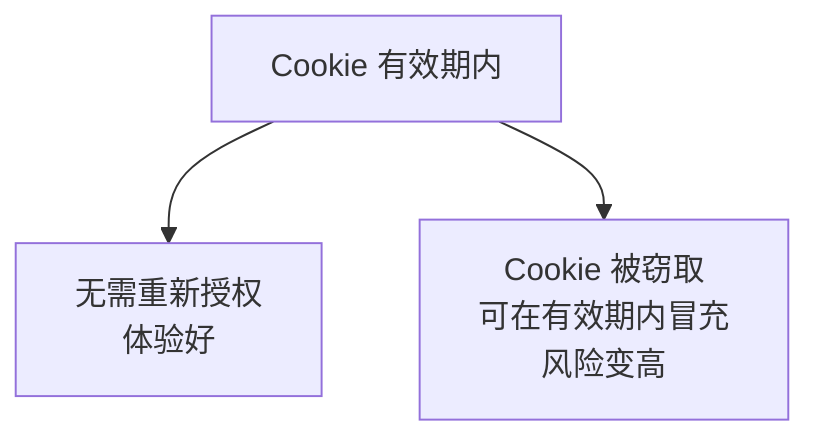

所以：

| 场景 | 建议 |
|---|---|
| 普通查询功能 | 用 Cookie 恢复，12 小时 |
| 涉及资金、审批的操作 | 强制重新授权，不接受 Cookie 恢复 |

实现方式是给敏感页面加一个标记：

```csharp
/// <summary>敏感页面重写此属性，要求必须是本次授权的会话。</summary>
protected virtual bool RequireFreshLogin
{
    get { return false; }
}

// 在 OnPreInit 里
if (RequireFreshLogin && Session["RestoredFromCookie"] != null)
{
    Session.Remove("WeComUserId");
    RedirectToLogin();
    return;
}
```

## V7 的问题

页面上显示的还是 UserId 这种账号，员工看到「zhangsan」不如看到「张三」自然。

---

# V8：取成员详细资料

## 目标

显示姓名和部门。

## 原理：两种 Secret 在同一个流程里配合

这是本教程里两种 Secret 关系最清晰的一幕：

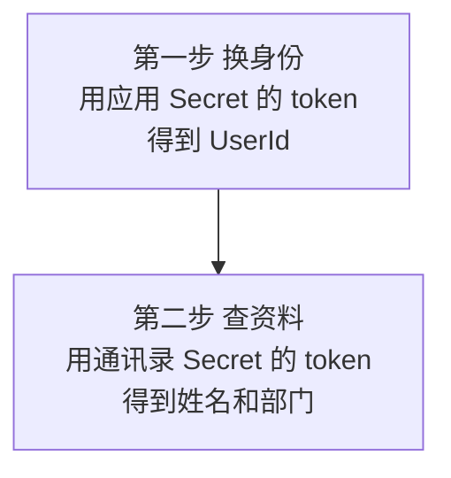

回到第 1 章的原理：**权限跟着凭证走。**

| 动作 | 属于什么 | 用哪个凭证 |
|---|---|---|
| 换取访问者身份 | 应用行为 | 应用 Secret |
| 读取通讯录资料 | 企业通讯录能力 | 通讯录 Secret |

用应用 Secret 去查成员资料，只能查到可见范围内的人，范围外会返回 301002。

## 三种取资料的途径

```mermaid
graph TB
    A["读本地缓存表<br/>第 6 章同步的数据"] --> B["最快<br/>但可能滞后"]
    C["调通讯录接口"] --> D["最新<br/>但每次都有网络开销"]
```

第三种是先读本地、没有再调接口。本教程用这个方案。

## 代码

```csharp
using System.Data;
using System.Data.SqlClient;

namespace WeComWeb
{
    /// <summary>当前登录成员的信息。</summary>
    public class CurrentUser
    {
        public string UserId { get; set; }
        public string Name { get; set; }
        public int MainDeptId { get; set; }
        public string DeptName { get; set; }
        public string Position { get; set; }

        /// <summary>显示名。姓名取不到时退化成账号。</summary>
        public string DisplayName
        {
            get
            {
                return string.IsNullOrEmpty(Name) ? UserId : Name;
            }
        }
    }

    public static class CurrentUserService
    {
        /// <summary>取当前成员信息。优先本地缓存，缺失则调接口。</summary>
        public static async Task<CurrentUser> LoadAsync(string userId)
        {
            CurrentUser user = LoadFromDb(userId);
            if (user != null)
            {
                return user;
            }

            // 本地没有：可能是新入职还没同步，直接调接口
            try
            {
                WeComUser u = await WeComApi.GetUserAsync(userId);
                return new CurrentUser
                {
                    UserId = u.UserId,
                    Name = u.Name,
                    MainDeptId = u.MainDeptId,
                    Position = u.Position,
                    DeptName = null
                };
            }
            catch (WeComException)
            {
                // 接口也失败时，至少返回账号，不要让页面崩掉
                return new CurrentUser { UserId = userId };
            }
        }

        private static CurrentUser LoadFromDb(string userId)
        {
            string connStr = System.Configuration.ConfigurationManager
                .ConnectionStrings["WeComDb"].ConnectionString;

            using (var conn = new SqlConnection(connStr))
            {
                conn.Open();
                using (var cmd = new SqlCommand(@"
                    SELECT e.UserId, e.Name, e.Position, e.MainDeptId,
                           d.Name AS DeptName
                    FROM WeComEmployee e
                    LEFT JOIN WeComDepartment d ON d.DeptId = e.MainDeptId
                    WHERE e.UserId = @UserId AND e.IsDeleted = 0", conn))
                {
                    cmd.Parameters.Add(new SqlParameter(
                        "@UserId", SqlDbType.NVarChar, 64) { Value = userId });

                    using (SqlDataReader r = cmd.ExecuteReader())
                    {
                        if (!r.Read())
                        {
                            return null;
                        }
                        return new CurrentUser
                        {
                            UserId = r["UserId"] as string,
                            Name = r["Name"] as string,
                            Position = r["Position"] as string,
                            MainDeptId = r["MainDeptId"] == DBNull.Value
                                ? 0 : (int)r["MainDeptId"],
                            DeptName = r["DeptName"] as string
                        };
                    }
                }
            }
        }
    }
}
```

## 为什么失败时也要返回一个对象

```csharp
catch (WeComException)
{
    return new CurrentUser { UserId = userId };
}
```

姓名只是显示用的。**取不到姓名不应该让整个页面不可用。**

配合 `DisplayName` 的退化逻辑，最坏情况是页面显示「zhangsan」而不是「张三」，功能照常。这比抛异常导致白屏好得多。

## 缓存到 Session

每次翻页都查一次数据库没必要：

```csharp
protected CurrentUser CurrentUserInfo
{
    get { return Session["CurrentUserInfo"] as CurrentUser; }
    set { Session["CurrentUserInfo"] = value; }
}
```

登录成功时加载一次即可。注意如果后面改用 `StateServer` 模式，`CurrentUser` 类要加 `[Serializable]`。

## 母版页显示

```csharp
CurrentUser u = Session["CurrentUserInfo"] as CurrentUser;
if (u != null)
{
    litCurrentUser.Text = string.Format("{0}（{1}）",
        Server.HtmlEncode(u.DisplayName),
        Server.HtmlEncode(u.DeptName ?? ""));
}
```

## V8 的问题

拿不到手机号和邮箱这类信息。

---

# V9：两种 scope 与敏感信息

## 目标

理解什么时候需要 `snsapi_privateinfo`，以及它的代价。

## 两种 scope 对比

| | `snsapi_base` | `snsapi_privateinfo` |
|---|---|---|
| 返回 | 只有 UserId | UserId 加上 `user_ticket` |
| 额外参数 | 不需要 | **必须带 `agentid`** |
| 能拿到敏感字段 | 不能 | 能，需再调一次接口 |
| 适用 | 绝大多数场景 | 确实需要手机号等信息时 |

## 原理：敏感信息要多一步

`snsapi_privateinfo` 不会直接把手机号给你，而是给一张票据：

```mermaid
graph TB
    A["授权时用 snsapi_privateinfo"] --> B["换身份时额外<br/>返回 user_ticket"]
    B --> C["用 user_ticket 再调一次<br/>getuserdetail 接口"]
```

为什么多一步：**票据的存在让「获取敏感信息」成为一个独立、可审计的动作**，而不是随手就拿到了。

## 代码

```csharp
/// <summary>成员敏感信息。</summary>
public class UserDetail
{
    public string UserId { get; set; }
    public string Mobile { get; set; }
    public string Email { get; set; }
}

/// <summary>用 user_ticket 换取敏感信息。</summary>
public static async Task<UserDetail> GetUserDetailAsync(string userTicket)
{
    if (string.IsNullOrEmpty(userTicket))
    {
        throw new ArgumentException(
            "缺少 user_ticket。请确认授权时用的是 snsapi_privateinfo");
    }

    string token = await WeComApi.GetAppTokenAsync();
    string baseUrl = ConfigurationManager.AppSettings["WeCom.BaseUrl"];
    string url = string.Format("{0}/auth/getuserdetail?access_token={1}",
        baseUrl, token);

    // 这个接口是 POST，票据放在请求体里
    var body = new JObject();
    body["user_ticket"] = userTicket;

    JObject obj = await WeComApi.PostJsonAsync(url, body, "auth/getuserdetail");

    return new UserDetail
    {
        UserId = obj.Value<string>("userid"),
        Mobile = obj.Value<string>("mobile"),
        Email = obj.Value<string>("email")
    };
}
```

需要给 `WeComApi` 补一个 POST 方法：

```csharp
/// <summary>发起 POST 并做两层判断。</summary>
public static async Task<JObject> PostJsonAsync(string url, JObject body,
    string apiName)
{
    var watch = System.Diagnostics.Stopwatch.StartNew();
    try
    {
        var content = new StringContent(body.ToString(),
            Encoding.UTF8, "application/json");

        HttpResponseMessage response = await Client.PostAsync(url, content);
        response.EnsureSuccessStatusCode();

        string json = await response.Content.ReadAsStringAsync();
        JObject obj = JObject.Parse(json);

        int errcode = obj.Value<int>("errcode");
        watch.Stop();
        ApiLogger.Log(apiName, errcode,
            errcode == 0 ? null : obj.Value<string>("errmsg"),
            watch.ElapsedMilliseconds);

        if (errcode != 0)
        {
            throw new WeComException(errcode, obj.Value<string>("errmsg"));
        }
        return obj;
    }
    catch (WeComException)
    {
        throw;
    }
    catch (Exception ex)
    {
        watch.Stop();
        ApiLogger.Log(apiName, -1, ex.Message, watch.ElapsedMilliseconds);
        throw new WeComException(-1, "请求失败：" + ex.Message);
    }
}
```

## 三条使用原则

### 1. 默认用 `snsapi_base`

```mermaid
graph TB
    A["需要手机号吗"] --> B["不需要<br/>用 snsapi_base"]
    A --> C["确实需要<br/>才用 snsapi_privateinfo"]
```

绝大多数内部应用只需要知道「你是谁」，而 UserId 已经足够。姓名和部门可以用通讯录 Secret 查到，不属于敏感信息范畴。

### 2. 不要顺手把敏感信息存下来

拿到手机号后，很容易顺手写进数据库或日志。这样做的问题是：

| 风险 | 说明 |
|---|---|
| 扩大泄露面 | 数据库或日志泄露时一并泄露 |
| 数据陈旧 | 员工换号后你存的是旧号 |
| 超出必要 | 存了用不上的信息 |

**用完即弃是更好的默认做法。**确实需要长期保存时，应该有明确的业务理由。

### 3. 记录访问行为

获取敏感信息属于应该留痕的操作。V10 的日志会覆盖这一点。

## 一个提醒

企业微信对敏感字段有权限控制，即使用了 `snsapi_privateinfo`，能拿到什么也取决于应用的权限配置和企业设置。

**代码里要能容忍字段为空**，不能假设一定拿得到。

## V9 的问题

现在完全不知道谁在什么时候访问过系统。

---

# V10：登录日志与审计

## 目标

记录登录行为，可追溯。

## 建表

追加到第 3 章的初始化脚本：

```sql
IF OBJECT_ID('UserLoginLog') IS NOT NULL DROP TABLE UserLoginLog;
GO

CREATE TABLE UserLoginLog (
    Id        BIGINT IDENTITY(1,1) PRIMARY KEY,
    UserId    NVARCHAR(64) NULL,           -- 失败时可能为空
    Result    TINYINT NOT NULL,            -- 1成功 2身份无效 3校验失败 4异常
    Reason    NVARCHAR(200) NULL,
    ClientIp  NVARCHAR(64) NULL,
    UserAgent NVARCHAR(500) NULL,
    ReturnUrl NVARCHAR(500) NULL,
    LoginAt   DATETIME2(0) NOT NULL DEFAULT SYSDATETIME()
);

CREATE INDEX IX_LoginLog_User ON UserLoginLog (UserId, LoginAt DESC);
CREATE INDEX IX_LoginLog_Time ON UserLoginLog (LoginAt DESC);
CREATE INDEX IX_LoginLog_Fail ON UserLoginLog (Result) WHERE Result <> 1;
GO
```

## 为什么失败也要记

```mermaid
graph TB
    A["只记成功"] --> B["看不出<br/>是否有人在尝试攻击"]
    C["成功失败都记"] --> D["异常模式可被发现<br/>例如大量校验失败"]
```

大量的 `state` 校验失败，可能意味着有人在尝试伪造回调。这是安全信号。

## 记录代码

```csharp
using System;
using System.Data;
using System.Data.SqlClient;
using System.Web;

namespace WeComWeb
{
    public enum LoginResult
    {
        Success = 1,
        InvalidIdentity = 2,
        StateFailed = 3,
        Error = 4
    }

    public static class LoginLogger
    {
        public static void Log(HttpRequest request, string userId,
            LoginResult result, string reason = null, string returnUrl = null)
        {
            try
            {
                string connStr = System.Configuration.ConfigurationManager
                    .ConnectionStrings["WeComDb"].ConnectionString;

                using (var conn = new SqlConnection(connStr))
                {
                    conn.Open();
                    using (var cmd = new SqlCommand(@"
                        INSERT INTO UserLoginLog
                            (UserId, Result, Reason, ClientIp, UserAgent, ReturnUrl)
                        VALUES (@UserId, @Result, @Reason, @Ip, @Ua, @Url)", conn))
                    {
                        AddParam(cmd, "@UserId", SqlDbType.NVarChar, 64, userId);
                        cmd.Parameters.Add(new SqlParameter(
                            "@Result", SqlDbType.TinyInt) { Value = (byte)result });
                        AddParam(cmd, "@Reason", SqlDbType.NVarChar, 200, reason);
                        AddParam(cmd, "@Ip", SqlDbType.NVarChar, 64,
                            UrlHelper.GetClientIp(request));
                        AddParam(cmd, "@Ua", SqlDbType.NVarChar, 500,
                            request.UserAgent);
                        AddParam(cmd, "@Url", SqlDbType.NVarChar, 500, returnUrl);
                        cmd.ExecuteNonQuery();
                    }
                }
            }
            catch
            {
                // 日志失败不能影响登录本身
            }
        }

        private static void AddParam(SqlCommand cmd, string name,
            SqlDbType type, int size, string value)
        {
            cmd.Parameters.Add(new SqlParameter(name, type, size)
            {
                Value = string.IsNullOrEmpty(value)
                    ? (object)DBNull.Value
                    : value.Substring(0, Math.Min(size, value.Length))
            });
        }
    }
}
```

## 为什么要截断字符串

```csharp
value.Substring(0, Math.Min(size, value.Length))
```

`UserAgent` 有时非常长。超过字段长度时数据库会直接报错，而这个错误发生在**日志代码里**，会掩盖真正要记录的事情。

先截断再入库，是所有日志代码都应该做的事。

## 用客户端 IP 而不是直连 IP

```csharp
UrlHelper.GetClientIp(request)
```

用的是第 7 章 V8 写的方法。在反向代理后面，`Request.UserHostAddress` 拿到的是代理的 IP，所有记录都一样，日志就没有意义了。

## 常用审计查询

```sql
-- 某人最近的登录记录
SELECT TOP 20 Result, Reason, ClientIp, LoginAt
FROM UserLoginLog WHERE UserId = @UserId ORDER BY LoginAt DESC;

-- 今天的登录概况
SELECT Result, COUNT(*) AS 次数
FROM UserLoginLog
WHERE LoginAt >= CAST(SYSDATETIME() AS DATE)
GROUP BY Result;

-- 校验失败集中的 IP，可能是攻击尝试
SELECT ClientIp, COUNT(*) AS 失败次数
FROM UserLoginLog
WHERE Result = 3 AND LoginAt >= DATEADD(HOUR, -24, SYSDATETIME())
GROUP BY ClientIp
HAVING COUNT(*) > 10
ORDER BY 失败次数 DESC;

-- 活跃用户排行
SELECT UserId, COUNT(*) AS 登录次数, MAX(LoginAt) AS 最近登录
FROM UserLoginLog
WHERE Result = 1 AND LoginAt >= DATEADD(DAY, -30, SYSDATETIME())
GROUP BY UserId ORDER BY 登录次数 DESC;
```

## 日志保留期限

登录日志含 IP 和 UserAgent，属于个人相关信息，不应无限期保留：

```sql
DELETE TOP (10000) FROM UserLoginLog
WHERE LoginAt < DATEADD(DAY, -180, SYSDATETIME());
```

保留期限要按你们企业的规定来定。

## V10 的问题

所有登录成功的人权限完全一样。财务数据、通讯录同步这类功能不该对所有人开放。

---

# V11：按部门和角色授权

## 目标

不同成员看到不同的功能。

## 原理：身份认证与权限授权是两件事

```mermaid
graph TB
    A["认证 你是谁"] --> B["由 OAuth 完成<br/>企业微信告诉你"]
    C["授权 你能做什么"] --> D["由你的系统决定<br/>企业微信不管"]
```

这个区分很重要：**企业微信只负责证明身份，不知道你的业务里谁该有什么权限。**权限规则必须你自己定义。

## 三种常见的授权依据

| 依据 | 优点 | 缺点 |
|---|---|---|
| 按 UserId 白名单 | 精确 | 人员变动要改配置 |
| 按部门 | 随组织调整自动生效 | 粒度粗 |
| 按角色表 | 灵活 | 需要维护 |

本教程用「部门 + 白名单」组合，够用且不复杂。

## 配置

```xml
<appSettings>
  <!-- 管理员白名单，逗号分隔 -->
  <add key="Auth.Admins" value="zhangsan,lisi" />
  <!-- 可查看全部员工资料的部门 ID -->
  <add key="Auth.HrDepts" value="3,5" />
</appSettings>
```

## 代码

```csharp
using System;
using System.Collections.Generic;
using System.Configuration;
using System.Linq;

namespace WeComWeb
{
    public enum AppRole
    {
        Employee = 0,     // 普通成员
        Hr = 1,           // 可查看全部员工资料
        Admin = 2         // 可执行同步等管理操作
    }

    public static class AuthService
    {
        /// <summary>判断成员的角色。</summary>
        public static AppRole GetRole(CurrentUser user)
        {
            if (user == null || string.IsNullOrEmpty(user.UserId))
            {
                return AppRole.Employee;
            }

            // 管理员白名单优先
            if (GetList("Auth.Admins")
                .Contains(user.UserId, StringComparer.OrdinalIgnoreCase))
            {
                return AppRole.Admin;
            }

            // 再看部门
            string dept = user.MainDeptId.ToString();
            if (GetList("Auth.HrDepts").Contains(dept))
            {
                return AppRole.Hr;
            }

            return AppRole.Employee;
        }

        private static List<string> GetList(string key)
        {
            string raw = ConfigurationManager.AppSettings[key] ?? "";
            return raw.Split(new[] { ',', '，', ';' },
                    StringSplitOptions.RemoveEmptyEntries)
                .Select(s => s.Trim())
                .Where(s => s.Length > 0)
                .ToList();
        }

        /// <summary>是否至少达到某个角色。</summary>
        public static bool AtLeast(CurrentUser user, AppRole required)
        {
            return GetRole(user) >= required;
        }
    }
}
```

## 基类支持角色要求

```csharp
/// <summary>子类重写以声明本页需要的最低角色。</summary>
protected virtual AppRole RequiredRole
{
    get { return AppRole.Employee; }
}

// OnPreInit 里，登录检查通过之后
if (!AuthService.AtLeast(CurrentUserInfo, RequiredRole))
{
    // 权限不足要记日志，这是审计要点
    LoginLogger.Log(Request, CurrentUserId, LoginResult.Error,
        "权限不足，需要 " + RequiredRole);

    Response.Redirect("~/NoPermission.aspx", true);
    return;
}
```

## 页面声明所需角色

```csharp
public partial class SyncContacts : WeComBasePage
{
    // 同步通讯录属于管理操作
    protected override AppRole RequiredRole
    {
        get { return AppRole.Admin; }
    }
}
```

## 入口页按角色显示菜单

```csharp
AppRole role = AuthService.GetRole(CurrentUserInfo);

lnkSearch.Visible = true;                        // 所有人可用
lnkDeptTree.Visible = true;
lnkSync.Visible = (role >= AppRole.Admin);       // 仅管理员
```

## 一个容易犯的错误：只隐藏菜单

```mermaid
graph TB
    A["只在入口页隐藏菜单"] --> B["直接输入网址<br/>仍然能访问功能"]
    C["页面自身也检查权限"] --> D["无论怎么进来<br/>都会被拦住"]
```

**隐藏菜单是体验优化，不是安全措施。**真正的拦截必须在页面自身。

上面的做法两处都做了：菜单按角色显示，页面用 `RequiredRole` 声明。基类保证了后者不会漏。

## 关于按主部门判断的局限

```csharp
string dept = user.MainDeptId.ToString();
```

第 3 章讲过：企业微信里一个人可以属于多个部门，本教程为了简化只用主部门。

如果你们的实际情况是「人事专员挂在两个部门，主部门不是人事部」，这个判断就会失效。这时需要：

| 改进方向 | 做法 |
|---|---|
| 检查所有部门 | 用 `DeptIds` 字段做包含判断 |
| 支持部门层级 | 判断是否在某部门及其子部门下 |
| 改用角色表 | 建一张 UserId 到角色的映射表 |

**知道这个局限比现在就实现它更重要。**

---

# V12：集成版

## 完整的回调页

`OAuthCallback.aspx.cs`：

```csharp
using System;
using System.Threading.Tasks;
using System.Web;
using System.Web.UI;

namespace WeComWeb
{
    public partial class OAuthCallback : WeComBasePage
    {
        // 本页负责建立登录状态，绝不能要求登录，否则死循环
        protected override bool RequireLogin
        {
            get { return false; }
        }

        protected void Page_Load(object sender, EventArgs e)
        {
            RegisterAsyncTask(new PageAsyncTask(HandleAsync));
        }

        private async Task HandleAsync()
        {
            string code = Request.QueryString["code"];
            string state = Request.QueryString["state"];
            string returnUrl = Request.QueryString["returnUrl"];

            if (string.IsNullOrEmpty(code))
            {
                Fail(LoginResult.InvalidIdentity, "未收到授权码",
                    "未收到授权码，请从企业微信工作台重新进入应用。");
                return;
            }

            // 先校验 state，再消耗 code
            if (!OAuthHelper.ValidateState(Session, state))
            {
                Fail(LoginResult.StateFailed, "state 校验失败",
                    "授权状态校验失败，请重新从工作台进入应用。");
                return;
            }

            try
            {
                OAuthIdentity id = await OAuthHelper.GetIdentityAsync(code);

                if (!id.IsInternal)
                {
                    Fail(LoginResult.InvalidIdentity, "非企业成员",
                        "本应用仅供企业内部成员使用。");
                    return;
                }

                // 建立登录状态
                Session["WeComUserId"] = id.UserId;
                Session["LoginAt"] = DateTime.Now;
                Session.Remove("RestoredFromCookie");

                // 加载姓名部门，失败也不阻断
                CurrentUser user = await CurrentUserService.LoadAsync(id.UserId);
                Session["CurrentUserInfo"] = user;

                // 写恢复用的签名 Cookie
                LoginCookie.Write(Response, id.UserId);
                ClearRedirectCounter();

                LoginLogger.Log(Request, id.UserId, LoginResult.Success,
                    null, returnUrl);

                Response.Redirect(SafeReturnUrl(returnUrl), true);
            }
            catch (WeComException ex)
            {
                // 40029 是最常见的：多为刷新页面导致 code 重复使用
                string tip = ex.ErrCode == 40029
                    ? "授权码已失效，请重新从工作台进入应用。"
                    : "身份识别失败：" + ex.Message;

                Fail(LoginResult.Error, ex.Message, tip);
            }
        }

        private string SafeReturnUrl(string returnUrl)
        {
            if (string.IsNullOrEmpty(returnUrl) || !IsLocalUrl(returnUrl))
            {
                return "~/Default.aspx";
            }
            // 不能指回本页，否则再次进入无 code 的分支
            if (returnUrl.IndexOf("OAuthCallback",
                    StringComparison.OrdinalIgnoreCase) >= 0)
            {
                return "~/Default.aspx";
            }
            return returnUrl;
        }

        private static bool IsLocalUrl(string url)
        {
            if (string.IsNullOrEmpty(url))
            {
                return false;
            }
            // 注意排除 // 开头，那等价于跳到外站
            if (url.StartsWith("/") && !url.StartsWith("//"))
            {
                return true;
            }
            return url.StartsWith("~/");
        }

        private void Fail(LoginResult result, string reason, string tip)
        {
            LoginLogger.Log(Request, null, result, reason);
            litMessage.Text = Server.HtmlEncode(tip);
        }
    }
}
```

## 完整流程图

```mermaid
graph TB
    A["员工点开受保护页面"] --> B["基类检查 Session<br/>与恢复 Cookie"]
    B --> C["已有身份<br/>检查角色后放行"]
    B --> D["无身份<br/>生成 state 跳转授权"]
    D --> E["回调页校验 state<br/>用 code 换 UserId"]
    E --> F["写 Session 和 Cookie<br/>记日志后送回原页面"]
```

## 文件清单

```text
App_Code/
├── OAuthHelper.cs          授权链接、state、换身份、敏感信息
├── WeComBasePage.cs        登录检查、角色检查、防死循环
├── LoginCookie.cs          签名 Cookie
├── CurrentUserService.cs   姓名部门加载
├── AuthService.cs          角色判定
└── LoginLogger.cs          登录日志

OAuthCallback.aspx          回调页（不要求登录）
NoPermission.aspx           权限不足提示页
```

---

# 本章自测

| 测试 | 做法 | 期望结果 |
|---|---|---|
| 1 拿到 code | 从工作台点登录 | 回调页显示 code |
| 2 换身份 | 完成授权 | 显示正确的 UserId |
| 3 免登录 | 从工作台进入受保护页 | 无需输入直接进入 |
| 4 state 校验 | 手工改 URL 里的 state | 提示校验失败 |
| 5 刷新回调页 | 在回调页按刷新 | 提示授权码已失效，不是白屏 |
| 6 干净地址 | 登录成功后看地址栏 | 不含 code |
| 7 returnUrl | 直接访问员工详情页 | 授权后回到详情页而非首页 |
| 8 开放重定向 | `returnUrl=https://example.com` | 被忽略，跳回首页 |
| 9 无死循环 | 正常授权流程 | 不出现反复跳转 |
| 10 死循环保护 | 浏览器禁用 Cookie 后进入 | 显示明确提示而非白屏 |
| 11 Session 恢复 | 重启应用程序池后刷新 | 不需重新授权 |
| 12 姓名显示 | 登录后看母版页 | 显示姓名而非账号 |
| 13 姓名兜底 | 断开数据库后登录 | 显示账号，页面不崩 |
| 14 登录日志 | 查 `UserLoginLog` | 有成功记录，IP 正确 |
| 15 失败日志 | 制造 state 失败 | 有失败记录 |
| 16 角色控制 | 用非管理员进入同步页 | 被拒绝并记日志 |
| 17 直接输网址 | 非管理员直接访问同步页地址 | 同样被拒绝 |

第 17 项最关键：**它验证的是「隐藏菜单不等于权限控制」。**

# 错误排查

| 现象 | 原因 | 解决 |
|---|---|---|
| `redirect_uri` 参数错误 | 域名不在可信域名里 | 后台配置可信域名 |
| `redirect_uri` 参数错误 | 未做 URL 编码 | 用 `HttpUtility.UrlEncode` |
| 授权链接打不开 | 漏了 `#wechat_redirect` | 补上 |
| `40029` | 刷新页面导致 code 重用 | 处理完立即跳转到干净地址 |
| `40029` | code 已过期 | 重新发起授权 |
| `40029` | 用了别的应用的 token | 核对 `appid` 与 Secret 是否同一应用 |
| `60011` | 换身份用了通讯录 Secret | 换成应用 Secret |
| `301002` | 查资料用了应用 Secret | 换成通讯录 Secret |
| userid 为空 | 访问者不是企业成员 | 明确拒绝并提示 |
| userid 为空 | 不在应用可见范围 | 后台调整可见范围 |
| 反复跳转 | 回调页要求了登录 | 重写 `RequireLogin` 为 false |
| 反复跳转 | returnUrl 指向回调页 | 加排除判断 |
| Session 频繁丢失 | 应用程序池回收 | 调整回收策略，或用 Cookie 恢复 |
| Cookie 解不开 | machineKey 不固定 | 显式配置 machineKey |
| 拿不到 `user_ticket` | scope 不是 privateinfo | 改 scope 并带 agentid |
| 电脑浏览器测试失败 | 必须在企业微信内 | 用手机企业微信测试 |

# 完成标准

## 理解部分

- [ ] 免登录是绕过了验证，还是借用了企业微信的登录状态
- [ ] 为什么要用 code 中转，而不是直接在 URL 里带 UserId
- [ ] `code` 的三个特性各起什么作用
- [ ] `state` 防的是什么攻击，为什么必须存在服务端
- [ ] 为什么必须先校验 state 再用 code 换身份
- [ ] 刷新回调页为什么会报 40029
- [ ] 换身份用哪个 Secret，查资料用哪个 Secret，为什么不同
- [ ] 重定向死循环是怎么形成的，两种成因分别是什么
- [ ] 为什么登录 Cookie 不能只做 Base64 编码
- [ ] 为什么 Cookie 内容里还要带过期时间
- [ ] 认证和授权的区别是什么
- [ ] 隐藏菜单为什么不算权限控制

## 操作部分

- [ ] 17 项自测全部通过
- [ ] 从工作台进入受保护页面无需任何输入
- [ ] `UserLoginLog` 有成功和失败两类记录
- [ ] 非管理员直接输入网址也访问不了管理页面

# 下一章

第 9 章接入 JS-SDK，让页面能调用手机的扫码、拍照、定位等能力。

本章的成果会直接用上：

| 本章成果 | 第 9 章怎么用 |
|---|---|
| 应用 Secret 的 token | 换取 JS-SDK 签名用的 ticket |
| `UrlHelper.GetPublicUrl` | **签名必须用它**，否则签名不一致 |
| 登录身份 | 定位签到要记录是谁签的 |

第 7 章 V8 那个「访问地址与地址栏完全一致」的验证，到第 9 章就会显出价值。
