# 第 9 章：JS-SDK 接入与签名

## 语言边界

签名由 **C# 服务端**计算，能力调用在**页面 JavaScript** 中完成。不涉及 Python。

## 本章目标

让页面获得调用企业微信客户端能力的资格。**本章只做「接入」**，把签名调通并验证一个能力可用。具体的定位业务在第 10 章。

## 前置条件

- 第 7 章完成，并且已配置「JS-SDK 可信域名」
- 第 7 章 V8 的 `UrlHelper.GetPublicUrl` 可用
- 第 8 章完成，`WeComApi.GetAppTokenAsync` 可用

## 本章的性质

前面几章的难点分散在各处，本章的难点高度集中在**一件事**上：

> 让服务端算签名用的 URL，和浏览器地址栏里的 URL 完全一致。

签名失败时企业微信只返回一句 `invalid signature`，不告诉你哪里不一致。所以本章的重点是**把可能不一致的原因逐个排除**。

## 版本地图

| 版本 | 主题 | 解决上一版什么问题 |
|---|---|---|
| V1 | 引入 JS 文件 | —— |
| V2 | 服务端算企业签名 | 浏览器拿不到 ticket |
| V3 | 调通 wx.config | 有签名但没用上 |
| V4 | 修 invalid signature | 签名不通过 |
| V5 | ticket 缓存 | 每次请求都取 ticket |
| V6 | 应用签名与 agentConfig | 专有能力不可用 |
| V7 | 调用扫一扫验证 | 不知道到底能不能用 |
| V8 | wx.invoke 与 beta 参数 | 部分接口调不通 |
| V9 | 调试手段 | 出错只有一句英文 |
| V10 | 封装初始化模块 | 每页重复一大段 JS |
| V11 | 集成版 | —— |

---

# V1：引入 JS 文件

## 目标

确认 JS 文件能加载，`wx` 对象存在。

## 代码

在母版页的 `<head>` 里加一行：

```html
<script src="https://res.wx.qq.com/open/js/jweixin-1.2.0.js"></script>
```

测试页 `JsSdkTest.aspx`：

```aspx
<%@ Page Language="C#" MasterPageFile="~/Site.Master" AutoEventWireup="true"
    CodeBehind="JsSdkTest.aspx.cs" Inherits="WeComWeb.JsSdkTest" %>

<asp:Content ID="c1" ContentPlaceHolderID="TitleContent" runat="server">
    JS-SDK 测试
</asp:Content>

<asp:Content ID="c2" ContentPlaceHolderID="MainContent" runat="server">
    <h3>JS-SDK 接入测试</h3>
    <div id="status" class="status">初始化中...</div>

    <script type="text/javascript">
        var statusEl = document.getElementById('status');

        // 先确认 JS 文件是否加载成功
        if (typeof wx === 'undefined') {
            statusEl.innerHTML = 'JS 文件加载失败。请检查网络，'
                + '或确认页面能访问外网资源。';
        } else {
            statusEl.innerHTML = 'wx 对象已存在，JS 文件加载成功。';
        }
    </script>
</asp:Content>
```

## 原理：为什么网页默认不能调摄像头

浏览器出于安全考虑，不允许网页随意访问硬件和系统功能。

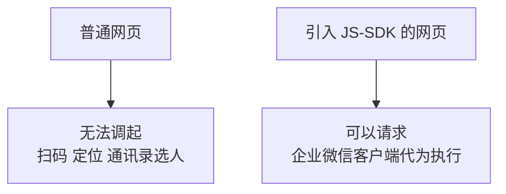

关键理解：**不是浏览器变强了，而是页面获得了「请企业微信客户端帮忙」的通道。**扫码这个动作实际是企业微信客户端做的，做完把结果交给页面。

既然是请客户端帮忙，客户端就要确认「你是谁、凭什么让我帮」。这就是签名的由来。

## 两个注意点

### 文件地址不要改成自己的服务器

有人会想把这个 JS 文件下载下来放自己服务器上。**不要这么做**：文件会更新，自己托管的版本会过期，出问题时很难排查。

### 必须能访问外网

这个文件在腾讯的服务器上。如果你的服务器或网络限制了外网访问，页面会加载失败。

V1 的判断代码就是为了区分这种情况——**如果 `wx` 都不存在，后面所有问题都不用查了。**

## 验证

在手机企业微信里打开，应显示「wx 对象已存在」。

## V1 的问题

`wx` 对象有了，但调用任何能力都会失败，因为还没有出示签名。

---

# V2：服务端算企业签名

## 目标

在 C# 里算出 `wx.config` 需要的签名。

## 原理：为什么签名必须在服务端算

算签名需要一个叫 `jsapi_ticket` 的东西，而它要用 `access_token` 换取：

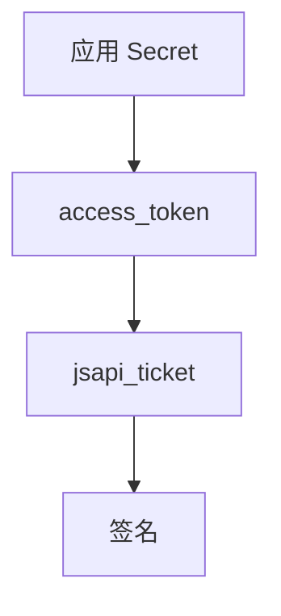

这条链上的前三样都是凭证，**任何一样出现在浏览器里都等于泄露**。所以只能在服务端走完这条链，只把最终的签名交给页面。

签名本身是安全的：它和特定的 URL、时间戳、随机串绑定，别人拿到也用不了。

## 原理：ticket 和 access_token 的区别

| | access_token | jsapi_ticket |
|---|---|---|
| 用途 | 调用服务端接口 | 生成客户端签名 |
| 有效期 | 7200 秒 | 7200 秒 |
| 怎么来 | 用 Secret 换 | 用 access_token 换 |
| 能否给浏览器 | 绝对不能 | 绝对不能 |

两者都要缓存，V5 处理。

## 接口

```text
GET {BaseUrl}/get_jsapi_ticket?access_token=TOKEN
```

返回：

```json
{ "errcode": 0, "errmsg": "ok", "ticket": "bxLdik...", "expires_in": 7200 }
```

## 签名算法

把四个参数按**固定顺序**拼成一个字符串，然后做 SHA1，转小写十六进制：

```text
jsapi_ticket=TICKET&noncestr=NONCESTR&timestamp=TIMESTAMP&url=URL
```

顺序不能调整（算法说明参见[企业微信 JSSDK 权限签名对接](https://cloud.tencent.com/developer/article/1825571)。内容已改写以符合授权要求）。

## 三个参数各自的作用

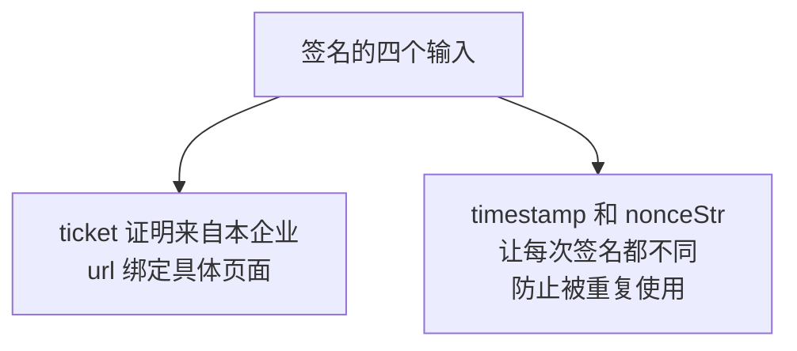

| 参数 | 作用 |
|---|---|
| `jsapi_ticket` | 证明是本企业发起的 |
| `url` | 把签名绑定到具体页面，换个页面就失效 |
| `timestamp` | 时间戳，限制有效期 |
| `noncestr` | 随机串，让同一时刻的签名也不重复 |

`timestamp` 和 `nonceStr` 会明文传给页面，客户端要用它们重算签名做比对，所以必须传。

## 代码

`App_Code/JsSdkHelper.cs`：

```csharp
using System;
using System.Configuration;
using System.Security.Cryptography;
using System.Text;
using System.Threading.Tasks;
using Newtonsoft.Json.Linq;

namespace WeComWeb
{
    /// <summary>传给页面的 JS-SDK 参数。</summary>
    public class JsSdkConfig
    {
        public string CorpId { get; set; }
        public string AgentId { get; set; }
        public string Timestamp { get; set; }
        public string NonceStr { get; set; }
        public string ConfigSignature { get; set; }   // 给 wx.config
        public string AgentSignature { get; set; }    // 给 wx.agentConfig
        public string SignedUrl { get; set; }         // 调试用：实际签名的 URL
    }

    public static class JsSdkHelper
    {
        private static readonly string BaseUrl =
            ConfigurationManager.AppSettings["WeCom.BaseUrl"];

        /// <summary>取企业的 jsapi_ticket，用于 wx.config。</summary>
        private static async Task<string> GetCorpTicketAsync()
        {
            string token = await WeComApi.GetAppTokenAsync();
            string url = string.Format("{0}/get_jsapi_ticket?access_token={1}",
                BaseUrl, token);

            JObject obj = await WeComApi.GetJsonAsync(url, "get_jsapi_ticket");
            return obj.Value<string>("ticket");
        }

        /// <summary>按固定顺序拼串后做 SHA1，输出小写十六进制。</summary>
        private static string Sha1Sign(string ticket, string nonce,
            string timestamp, string url)
        {
            // 顺序固定：ticket、noncestr、timestamp、url
            string raw = string.Format(
                "jsapi_ticket={0}&noncestr={1}&timestamp={2}&url={3}",
                ticket, nonce, timestamp, url);

            using (SHA1 sha1 = SHA1.Create())
            {
                byte[] bytes = sha1.ComputeHash(Encoding.UTF8.GetBytes(raw));
                var sb = new StringBuilder();
                foreach (byte b in bytes)
                {
                    sb.Append(b.ToString("x2"));   // 小写，不能用 X2
                }
                return sb.ToString();
            }
        }

        /// <summary>为指定页面地址生成配置参数。</summary>
        public static async Task<JsSdkConfig> BuildAsync(string pageUrl)
        {
            // 签名规则要求去掉 # 及其后面的内容
            int hash = pageUrl.IndexOf('#');
            if (hash >= 0)
            {
                pageUrl = pageUrl.Substring(0, hash);
            }

            string timestamp = ((long)(DateTime.UtcNow
                - new DateTime(1970, 1, 1)).TotalSeconds).ToString();
            string nonce = Guid.NewGuid().ToString("N");

            string corpTicket = await GetCorpTicketAsync();

            return new JsSdkConfig
            {
                CorpId = ConfigurationManager.AppSettings["WeCom.CorpId"],
                AgentId = ConfigurationManager.AppSettings["WeCom.AgentId"],
                Timestamp = timestamp,
                NonceStr = nonce,
                ConfigSignature = Sha1Sign(corpTicket, nonce, timestamp, pageUrl),
                SignedUrl = pageUrl          // 保留下来便于排查
            };
        }
    }
}
```

## 两个容易写错的地方

### 必须是小写十六进制

```csharp
sb.Append(b.ToString("x2"));   // 小写，不能用 X2
```

用 `X2` 会得到大写，签名校验直接失败。

### `SignedUrl` 为什么要保留

它是排查签名问题的唯一线索。V4 和 V9 都要用它。**现在多存一个字段，后面能省几个小时。**

## V2 的问题

签名算出来了，但页面还没用它。

---

# V3：调通 wx.config

## 目标

让 `wx.config` 返回成功。

## 后台代码

`JsSdkTest.aspx.cs`：

```csharp
using System;
using System.Threading.Tasks;
using System.Web.UI;

namespace WeComWeb
{
    public partial class JsSdkTest : WeComBasePage
    {
        // 页面上用 <%= %> 输出这些值
        protected JsSdkConfig Sdk;

        protected void Page_Load(object sender, EventArgs e)
        {
            RegisterAsyncTask(new PageAsyncTask(LoadSdkAsync));
        }

        private async Task LoadSdkAsync()
        {
            // 关键：用第 7 章的方法取真实外部地址，不要用 Request.Url
            string pageUrl = UrlHelper.GetPublicUrl(Request);
            Sdk = await JsSdkHelper.BuildAsync(pageUrl);
        }
    }
}
```

## 页面代码

```aspx
<%@ Page Language="C#" MasterPageFile="~/Site.Master" Async="true"
    AutoEventWireup="true" CodeBehind="JsSdkTest.aspx.cs"
    Inherits="WeComWeb.JsSdkTest" %>

<asp:Content ID="c1" ContentPlaceHolderID="TitleContent" runat="server">
    JS-SDK 测试
</asp:Content>

<asp:Content ID="c2" ContentPlaceHolderID="MainContent" runat="server">
    <h3>JS-SDK 接入测试</h3>
    <div id="status" class="status">初始化中...</div>

    <div class="diag">
        <b>签名参数</b><br />
        签名 URL：<span id="signedUrl"><%= Sdk.SignedUrl %></span><br />
        实际 URL：<span id="actualUrl"></span><br />
        timestamp：<%= Sdk.Timestamp %><br />
        nonceStr：<%= Sdk.NonceStr %>
    </div>

    <script type="text/javascript">
        var statusEl = document.getElementById('status');

        // 把浏览器实际地址显示出来，便于与签名 URL 对比
        document.getElementById('actualUrl').innerText =
            location.href.split('#')[0];

        wx.config({
            beta: true,          // 必须为 true，见 V8
            debug: true,         // 调试阶段开启，会弹出每个接口的返回
            appId: '<%= Sdk.CorpId %>',        // 注意这里填企业 CorpID
            timestamp: '<%= Sdk.Timestamp %>',
            nonceStr: '<%= Sdk.NonceStr %>',
            signature: '<%= Sdk.ConfigSignature %>',
            jsApiList: ['scanQRCode', 'getLocation', 'chooseImage']
        });

        wx.ready(function () {
            statusEl.innerHTML = 'wx.config 成功。';
        });

        wx.error(function (res) {
            statusEl.innerHTML = 'wx.config 失败：'
                + JSON.stringify(res);
        });
    </script>
</asp:Content>
```

## 三个关键点

### `appId` 填的是企业 CorpID

不是 AgentId，也不是应用相关的任何东西。这里容易和第 8 章的授权链接混淆——那里的 `appid` 也是 CorpID，是一致的。

### `Async="true"` 不能漏

漏了 `RegisterAsyncTask` 不执行，`Sdk` 是 `null`，页面直接报空引用。

### 调试阶段把 `debug` 设为 `true`

```javascript
debug: true,
```

它会在手机上直接弹出每个接口的返回结果。**移动端没有开发者工具，这是最直接的排查手段。**上线前记得改回 `false`。

## 把实际 URL 显示出来

```javascript
document.getElementById('actualUrl').innerText = location.href.split('#')[0];
```

这一行是本章最有价值的一行调试代码。它让「签名 URL」和「实际 URL」并列显示，不一致时一眼就能看出来。

## 验证

在手机企业微信打开，应显示「wx.config 成功」。

## V3 的问题

大概率你会看到 `invalid signature`。

---

# V4：修 invalid signature

## 这是本章的核心

`invalid signature` 意味着客户端用你给的参数重算签名后，和你算的不一致。

## 原理：不一致只可能来自四个地方

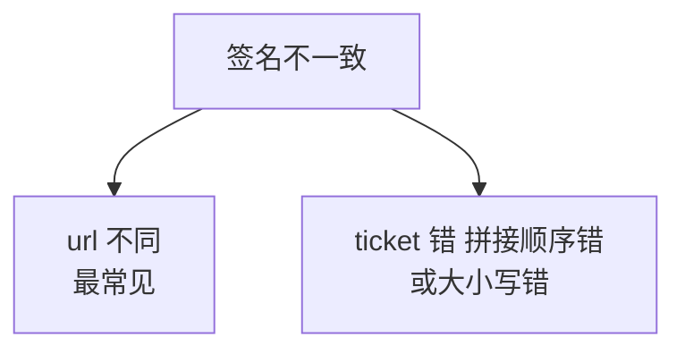

因为 `timestamp` 和 `nonceStr` 是你原样传给页面的，不可能不一致。所以问题几乎总在 `url` 上。

## 对照 V3 页面上的两行

打开页面，比较「签名 URL」和「实际 URL」：

| 情况 | 说明 |
|---|---|
| 完全一致 | 问题不在 URL，查 ticket 和拼接 |
| `http` 对 `https` | 反向代理问题，见下 |
| 少了查询参数 | 用了错误的方法取 URL |
| 多了或少了端口号 | 主机名处理问题 |
| 域名不同 | 代理改写了主机名 |

## 原因一：协议不一致（最常见）

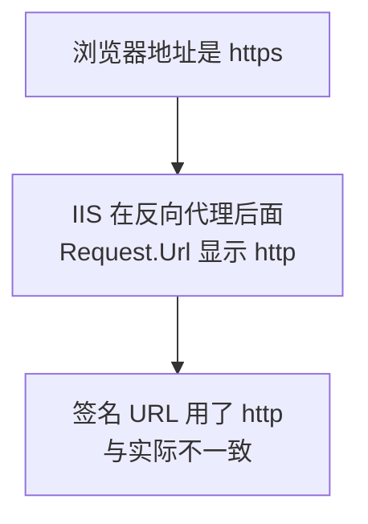

**这就是第 7 章 V8 提前解决的问题。**如果你当时按要求验证过「访问地址与地址栏完全一致」，这里就不会遇到。

检查代码里用的是哪个：

```csharp
// 错误：代理后面拿到的是 http
string pageUrl = Request.Url.AbsoluteUri;

// 正确：读转发头得到真实协议
string pageUrl = UrlHelper.GetPublicUrl(Request);
```

## 原因二：丢了查询参数

签名必须包含完整的查询字符串。

```text
浏览器：https://a.com/List.aspx?deptId=2
签名用：https://a.com/List.aspx          ← 不一致
```

`UrlHelper.GetPublicUrl` 用的是 `Request.RawUrl`，它保留原始查询串，所以不会有这个问题。

**但要注意：如果页面上有 JS 修改了地址栏，签名就会失效。**比如某些分页控件会用 `history.replaceState` 改 URL。

## 原因三：`#` 后面的内容没去掉

签名规则要求 URL 不含 `#` 及其后面的部分。两边都要处理：

```csharp
// 服务端
int hash = pageUrl.IndexOf('#');
if (hash >= 0) { pageUrl = pageUrl.Substring(0, hash); }
```

```javascript
// 页面上对比时也要去掉
location.href.split('#')[0]
```

## 原因四：ticket 用错了

V6 会引入第二种 ticket。**用应用 ticket 去算 `wx.config` 的签名一定失败。**这是加上 `agentConfig` 之后最常见的新错误。

## 一个 iOS 上的特殊情况

在 iOS 上，如果页面加载后地址发生了变化（比如通过 JS 跳转或修改了 hash），`wx.config` 用的 URL 需要是**进入页面时的初始地址**，而不是当前地址。

对 WebForms 来说这个问题不严重，因为回发不改变 URL。但如果你写了改地址的 JS，要注意这一点。

**规避方法：不要在 `wx.config` 之前用 JS 修改地址栏。**

## 排查流程

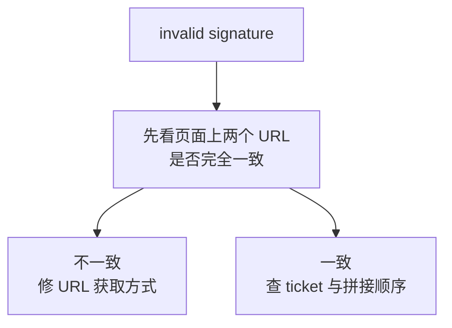

**永远先看 URL。**统计上它占了绝大多数。

## 验证

修正后重新打开页面，应显示「wx.config 成功」。

## V4 的问题

每次刷新页面都要重新取一次 ticket。而 ticket 有效期 7200 秒，而且获取接口有频率限制。

---

# V5：ticket 缓存

## 目标

把 ticket 缓存起来。

## 原理：什么该缓存，什么不该

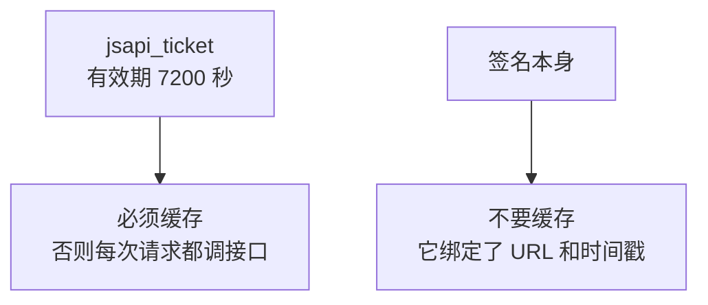

这个区分很重要。签名和具体页面、具体时刻绑定，缓存它只会导致签名失效。而 SHA1 计算极快，每次重算没有任何负担。

## 代码

```csharp
using System.Collections.Generic;

public static class JsSdkHelper
{
    // 两种 ticket 分别缓存，键区分类型
    private static readonly Dictionary<string, TicketItem> TicketCache =
        new Dictionary<string, TicketItem>();
    private static readonly object CacheLock = new object();

    private class TicketItem
    {
        public string Ticket;
        public DateTime ExpireAt;
    }

    /// <summary>取 ticket，带缓存。type 为 null 表示企业 ticket。</summary>
    private static async Task<string> GetTicketAsync(string type)
    {
        string key = type ?? "corp";

        lock (CacheLock)
        {
            TicketItem item;
            if (TicketCache.TryGetValue(key, out item)
                && item.ExpireAt > DateTime.Now)
            {
                return item.Ticket;
            }
        }

        string token = await WeComApi.GetAppTokenAsync();
        string url = type == null
            ? string.Format("{0}/get_jsapi_ticket?access_token={1}",
                BaseUrl, token)
            : string.Format("{0}/ticket/get?access_token={1}&type={2}",
                BaseUrl, token, type);

        JObject obj = await WeComApi.GetJsonAsync(url,
            type == null ? "get_jsapi_ticket" : "ticket/get");

        string ticket = obj.Value<string>("ticket");
        int expiresIn = obj.Value<int?>("expires_in") ?? 7200;

        lock (CacheLock)
        {
            TicketCache[key] = new TicketItem
            {
                Ticket = ticket,
                // 提前 5 分钟过期，与第 1 章 token 缓存同一思路
                ExpireAt = DateTime.Now.AddSeconds(expiresIn - 300)
            };
        }
        return ticket;
    }

    /// <summary>清空 ticket 缓存。排查签名问题时用。</summary>
    public static void ClearCache()
    {
        lock (CacheLock)
        {
            TicketCache.Clear();
        }
    }
}
```

## 为什么留一个 `ClearCache`

排查签名问题时，需要排除「缓存了一个坏 ticket」这种可能。有这个方法就能在管理页面加个按钮，一键重取。

否则只能重启应用程序池，代价大得多。

## V5 的问题

`wx.config` 成功了，但调用扫一扫这类企业微信专有能力仍然会失败。

---

# V6：应用签名与 agentConfig

## 目标

完成第二级配置。

## 原理：为什么有两级

这是本章第二个容易混淆的点。企业微信的配置分两级，各自有独立的 ticket：

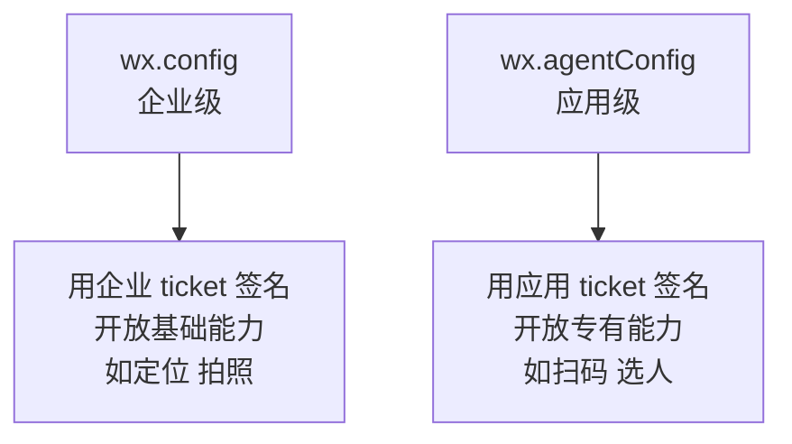

对照表：

| | `wx.config` | `wx.agentConfig` |
|---|---|---|
| ticket 获取地址 | `get_jsapi_ticket` | `ticket/get?type=agent_config` |
| 身份参数 | `appId` 填 CorpID | `corpid` + `agentid` |
| 执行顺序 | 先 | 后，在 `wx.ready` 里 |
| 失败通知方式 | `wx.error` 回调 | 自己的 `fail` 回调 |

## 最重要的一句话

**两个签名必须用各自对应的 ticket 计算，绝不能混用。**

混用是 `agentConfig` 报签名错误的头号原因。而且症状很迷惑：`wx.config` 明明成功了，说明签名逻辑没问题，于是很难想到是 ticket 拿错了。

## 代码

补全 `BuildAsync`：

```csharp
/// <summary>为指定页面地址生成两级配置参数。</summary>
public static async Task<JsSdkConfig> BuildAsync(string pageUrl)
{
    int hash = pageUrl.IndexOf('#');
    if (hash >= 0)
    {
        pageUrl = pageUrl.Substring(0, hash);
    }

    string timestamp = ((long)(DateTime.UtcNow
        - new DateTime(1970, 1, 1)).TotalSeconds).ToString();
    string nonce = Guid.NewGuid().ToString("N");

    // 两种 ticket 分别获取
    string corpTicket = await GetTicketAsync(null);
    string agentTicket = await GetTicketAsync("agent_config");

    return new JsSdkConfig
    {
        CorpId = ConfigurationManager.AppSettings["WeCom.CorpId"],
        AgentId = ConfigurationManager.AppSettings["WeCom.AgentId"],
        Timestamp = timestamp,
        NonceStr = nonce,
        // 除 ticket 外三个参数相同，但 ticket 不同，所以签名不同
        ConfigSignature = Sha1Sign(corpTicket, nonce, timestamp, pageUrl),
        AgentSignature = Sha1Sign(agentTicket, nonce, timestamp, pageUrl),
        SignedUrl = pageUrl
    };
}
```

## 页面代码

```javascript
wx.config({
    beta: true,
    debug: true,
    appId: '<%= Sdk.CorpId %>',
    timestamp: '<%= Sdk.Timestamp %>',
    nonceStr: '<%= Sdk.NonceStr %>',
    signature: '<%= Sdk.ConfigSignature %>',      // 企业 ticket 算的
    jsApiList: ['scanQRCode', 'getLocation', 'chooseImage']
});

wx.ready(function () {
    statusEl.innerHTML = 'config 成功，正在做 agentConfig...';

    // 第二级必须在 wx.ready 之后
    wx.agentConfig({
        corpid: '<%= Sdk.CorpId %>',
        agentid: '<%= Sdk.AgentId %>',
        timestamp: '<%= Sdk.Timestamp %>',
        nonceStr: '<%= Sdk.NonceStr %>',
        signature: '<%= Sdk.AgentSignature %>',   // 应用 ticket 算的
        jsApiList: ['selectEnterpriseContact'],
        success: function () {
            statusEl.innerHTML = '两级配置全部成功，可以使用客户端能力。';
        },
        fail: function (res) {
            statusEl.innerHTML = 'agentConfig 失败：' + JSON.stringify(res);
        }
    });
});

wx.error(function (res) {
    statusEl.innerHTML = 'config 失败：' + JSON.stringify(res);
});
```

## 为什么 `agentConfig` 要放在 `wx.ready` 里

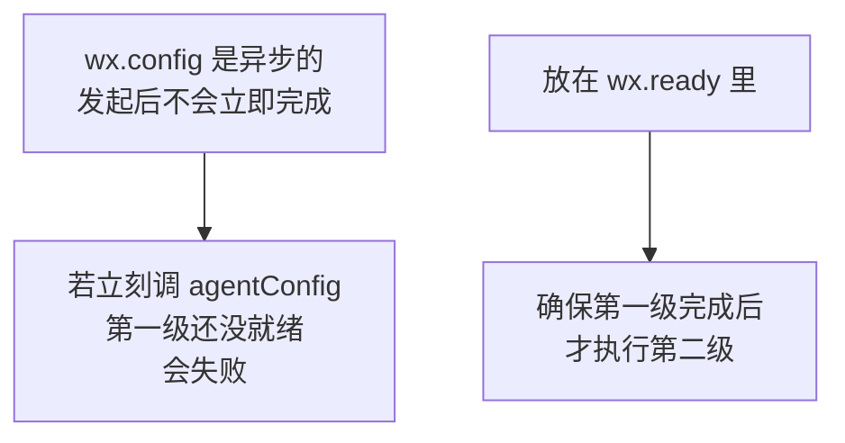

## 参数名的大小写差异

注意两处写法不同：

```javascript
wx.config({ appId: ... })          // 驼峰，且是 appId
wx.agentConfig({ corpid: ... })    // 全小写，且是 corpid
```

这不是笔误，两个接口的参数命名确实不一致。**照抄时容易改错，改错了就是参数缺失。**

## 只用定位需要做 agentConfig 吗

严格说不一定需要。但建议两级都做：

| 理由 | 说明 |
|---|---|
| 结构稳定 | 以后加扫码、选人不用改架构 |
| 排查一致 | 两级都通说明配置完全正确 |

## V6 的问题

配置显示成功，但还没真正调用过任何能力，不确定是否真的可用。


---

# V7：调用扫一扫验证

## 目标

真正调起一个客户端能力，确认配置有效。

## 为什么用扫一扫验证

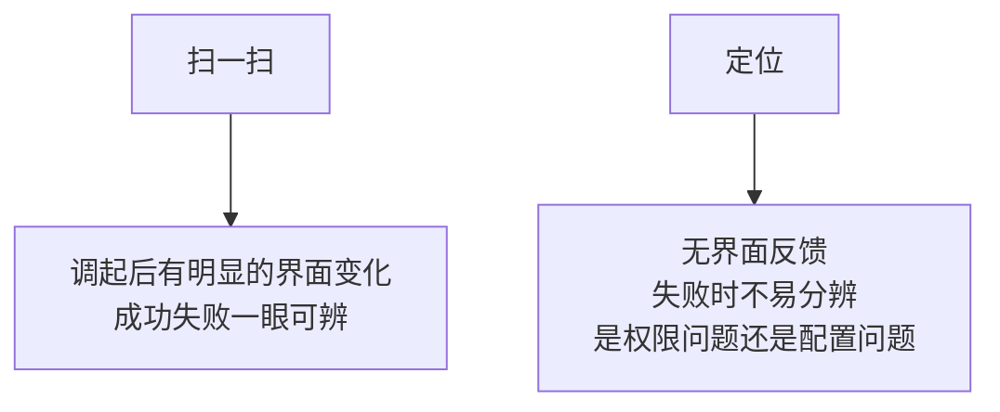

扫一扫会直接打开摄像头界面，**没打开就是没成功**，判断非常直接。定位留到第 10 章专门处理。

## 代码

页面加一个按钮：

```aspx
<button type="button" id="btnScan" class="btn">扫一扫测试</button>
<div id="scanResult" class="result"></div>
```

注意用 `type="button"`。在 WebForms 的 `<form runat="server">` 里，不写这个属性的按钮会触发表单提交，页面刷新后 `wx` 的配置就丢了。

```javascript
var scanResultEl = document.getElementById('scanResult');
var sdkReady = false;      // 记录配置是否完成

document.getElementById('btnScan').onclick = function () {
    if (!sdkReady) {
        scanResultEl.innerText = 'SDK 还未初始化完成，请稍候再试。';
        return;
    }

    wx.scanQRCode({
        needResult: 1,                        // 1 表示把结果返回给页面
        scanType: ['qrCode', 'barCode'],      // 支持二维码和条形码
        success: function (res) {
            scanResultEl.innerText = '扫码结果：' + res.resultStr;
        },
        fail: function (res) {
            scanResultEl.innerText = '扫码失败：' + JSON.stringify(res);
        },
        cancel: function () {
            // 用户主动取消不是错误，要单独处理
            scanResultEl.innerText = '已取消扫码。';
        }
    });
};
```

在 `agentConfig` 成功回调里把标记置为 `true`：

```javascript
success: function () {
    sdkReady = true;
    statusEl.innerHTML = '两级配置全部成功。';
}
```

## 三个必须理解的点

### `needResult` 决定结果给谁

| 值 | 行为 |
|---|---|
| `0` | 企业微信自己处理扫码结果，比如识别出网址就直接打开 |
| `1` | 结果返回给你的页面，由你处理 |

业务场景基本都要用 `1`。

### `cancel` 不是失败

```javascript
cancel: function () {
    scanResultEl.innerText = '已取消扫码。';
}
```

用户点了取消是正常操作。如果不写 `cancel` 回调，某些情况下会走到 `fail`，页面显示「扫码失败」，员工会以为程序有问题。

**把「用户主动放弃」和「系统出错」区分开，是移动端交互的基本要求。**

### 必须先检查配置是否完成

```javascript
if (!sdkReady) { ... }
```

页面加载和 SDK 初始化是并行的。员工可能在初始化完成前就点了按钮，此时调用一定失败，而失败原因和配置错误看起来一样。

加这个判断能省掉一类假问题。

## 常见失败原因

| 现象 | 原因 |
|---|---|
| 提示接口未授权 | 接口名没写进 `jsApiList` |
| 提示 permission denied | 域名不在 JS-SDK 可信域名里 |
| 点了没反应 | 配置未完成，或按钮触发了表单提交 |
| 电脑上不可用 | PC 端不支持扫一扫这类硬件能力 |

最后一条要注意：**PC 端企业微信不支持大部分硬件能力。**测试要用手机。

## 验证

在手机企业微信里点按钮，应该打开摄像头。扫任意二维码后页面显示内容。

## V7 的问题

有些接口用 `wx.xxx()` 这种写法调不通。

---

# V8：wx.invoke 与 beta 参数

## 目标

理解两种调用形式的区别。

## 原理：两套接口体系

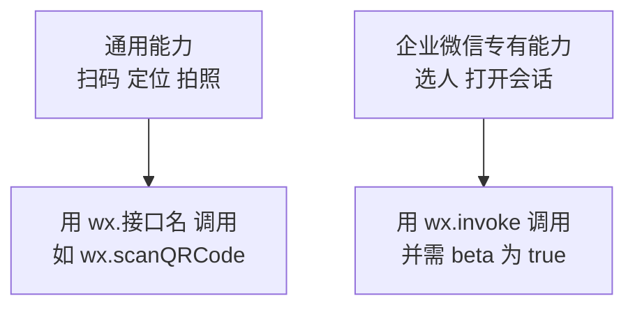

企业微信在通用能力之外扩展了很多自己的功能。这些扩展接口走 `wx.invoke` 这个统一入口。

## `beta: true` 的作用

```javascript
wx.config({
    beta: true,      // 不设为 true，wx.invoke 不可用
    ...
});
```

不加这个参数，`wx.invoke` 会报「不是一个函数」。这一点在开发者社区被反复提到（例如[企业微信 JS-SDK 使用讨论](https://developers.weixin.qq.com/community/personal/oCJUsw5p6jPcEaUj-2KXDN3g-oQ0/answer)。内容已改写以符合授权要求）。

**建议无条件加上它**，没有副作用，漏了就要花时间找。

## `wx.invoke` 的调用形式

```javascript
wx.invoke('selectEnterpriseContact', {
    fromDepartmentId: -1,      // -1 表示从根部门开始，0 表示我的部门
    mode: 'multi',             // single 单选，multi 多选
    type: ['department', 'user'],
    selectedDepartmentIds: [],
    selectedUserIds: []
}, function (res) {
    // 注意：结果判断方式与 wx.xxx 形式不同
    if (res.err_msg === 'selectEnterpriseContact:ok') {
        var result = res.result;
        if (typeof result === 'string') {
            result = JSON.parse(result);     // 某些版本返回字符串
        }
        var names = [];
        if (result.userList) {
            for (var i = 0; i < result.userList.length; i++) {
                names.push(result.userList[i].name);
            }
        }
        document.getElementById('pickResult').innerText =
            '已选择：' + names.join('、');
    } else if (res.err_msg === 'selectEnterpriseContact:cancel') {
        document.getElementById('pickResult').innerText = '已取消选择。';
    } else {
        document.getElementById('pickResult').innerText =
            '选人失败：' + res.err_msg;
    }
});
```

## 两种形式的差异对照

| | `wx.scanQRCode` | `wx.invoke` |
|---|---|---|
| 成功判断 | `success` 回调 | 检查 `res.err_msg` |
| 取消判断 | `cancel` 回调 | `err_msg` 以 `:cancel` 结尾 |
| 失败判断 | `fail` 回调 | 其他 `err_msg` 值 |
| 需要 `beta` | 不需要 | **需要** |

## `err_msg` 的格式规律

```text
接口名:ok        成功
接口名:cancel    用户取消
接口名:fail      失败
```

所以判断成功要用完整字符串比较，不能只看是否包含 `ok`——`fail` 里也可能带别的词。

## `result` 可能是字符串

```javascript
if (typeof result === 'string') {
    result = JSON.parse(result);
}
```

不同版本的客户端返回类型不一致，有的直接给对象，有的给 JSON 字符串。**加这个判断能同时兼容两种情况。**

这类兼容代码看起来啰嗦，但移动端的客户端版本非常分散，不加就会有部分用户用不了。

## 一个实际用途

选人接口配合第 4 章的群发很有价值：

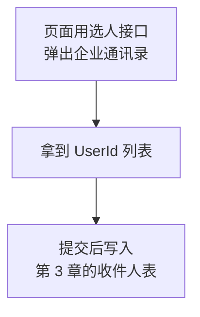

这样发通知就不用手工输 UserId，也不用维护 Excel 名单。

## V8 的问题

出错时只有一句英文，排查全靠猜。

---

# V9：调试手段

## 目标

建立一套可复用的排查方法。

## 手段一：`debug: true`

```javascript
debug: true
```

开启后每个接口调用都会在手机上弹窗显示返回值。**这是移动端最直接的调试方式**，因为你无法打开开发者工具。

上线前必须改回 `false`，否则员工会看到一堆弹窗。

用配置控制更稳妥：

```csharp
<add key="JsSdk.Debug" value="true" />
```

```javascript
debug: <%= JsSdkDebug ? "true" : "false" %>,
```

```csharp
protected bool JsSdkDebug
{
    get
    {
        return string.Equals(
            ConfigurationManager.AppSettings["JsSdk.Debug"],
            "true", StringComparison.OrdinalIgnoreCase);
    }
}
```

这样上线只改配置，不改代码。

## 手段二：URL 并列显示

V3 已经做了，这里强调它的地位：

```javascript
document.getElementById('actualUrl').innerText = location.href.split('#')[0];
```

**签名问题的第一步永远是看这两个 URL。**建议这个区块在所有用 JS-SDK 的页面都保留，上线后只对管理员显示。

## 手段三：诊断页面

做一个专门的诊断页 `SdkDiag.aspx`，把所有相关信息集中显示：

```csharp
public partial class SdkDiag : WeComBasePage
{
    // 诊断页只给管理员
    protected override AppRole RequiredRole
    {
        get { return AppRole.Admin; }
    }

    protected JsSdkConfig Sdk;

    protected void Page_Load(object sender, EventArgs e)
    {
        RegisterAsyncTask(new PageAsyncTask(LoadAsync));
    }

    private async Task LoadAsync()
    {
        Sdk = await JsSdkHelper.BuildAsync(UrlHelper.GetPublicUrl(Request));

        litScheme.Text = UrlHelper.GetScheme(Request);
        litRawScheme.Text = Request.Url.Scheme;
        litForwarded.Text = Request.Headers["X-Forwarded-Proto"] ?? "(无)";
        litHost.Text = Request.Url.Host;
        litRawUrl.Text = Request.RawUrl;
        litUa.Text = Request.UserAgent;
        litIsWeCom.Text = ClientDetector.IsWeCom(Request) ? "是" : "否";
    }

    protected void btnClearTicket_Click(object sender, EventArgs e)
    {
        JsSdkHelper.ClearCache();
        litClearMsg.Text = "ticket 缓存已清空，请刷新页面重新签名。";
    }
}
```

页面上把这些并列显示：

| 显示项 | 排查什么 |
|---|---|
| 签名 URL | 与实际 URL 对比 |
| 实际 URL | 由 JS 填入 |
| `GetScheme` 结果 | 是否为 https |
| `Request.Url.Scheme` | 与上一项对比，看代理是否生效 |
| `X-Forwarded-Proto` | 代理有没有传这个头 |
| 是否企业微信环境 | UA 判断结果 |
| 清缓存按钮 | 排除坏 ticket |

**第三项和第四项并列显示很有用**：如果两者不同，说明代理确实存在且转发头生效了；如果都是 `http`，说明代理没配 `X-Forwarded-Proto`。

## 手段四：分段确认

出问题时按这个顺序缩小范围：

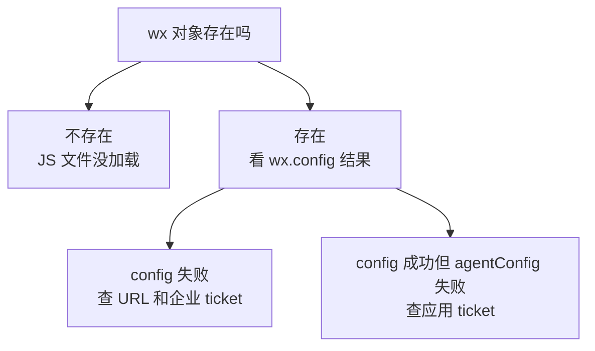

这个顺序把问题分成了三段，每段的原因互不重叠：

| 段 | 失败说明 |
|---|---|
| `wx` 不存在 | 网络或文件引用问题 |
| `config` 失败 | URL 或企业 ticket |
| `agentConfig` 失败 | 应用 ticket，几乎必然是混用了 |

**第三段的结论很确定**：`config` 都成功了说明签名算法和 URL 都对，`agentConfig` 还失败就只剩 ticket 拿错这一种可能。

## 错误信息对照

| 错误 | 原因 | 解决 |
|---|---|---|
| `invalid signature` | 签名 URL 与实际不一致 | 看 URL 对比 |
| `invalid signature` | 拼接顺序或大小写错 | 核对算法 |
| `invalid signature` | ticket 混用 | 各用对应 ticket |
| `permission denied` | 域名不在可信域名 | 后台配置 |
| `invalid url domain` | 同上 | 后台配置 |
| `wx.invoke is not a function` | `beta` 不是 true | 加上该参数 |
| `config:ok` 但接口无反应 | 接口名没写进 `jsApiList` | 补上 |
| `agentConfig:fail` | 用了企业 ticket 算应用签名 | 换成应用 ticket |
| PC 上部分能力不可用 | 桌面端不支持硬件能力 | 用手机测试 |

## V9 的问题

每个用到 JS-SDK 的页面都要重复一大段初始化 JS。

---

# V10：封装初始化模块

## 目标

把初始化逻辑抽成可复用的模块。

## 服务端：页面基类

`App_Code/JsSdkBasePage.cs`：

```csharp
using System;
using System.Configuration;
using System.Threading.Tasks;
using System.Web.UI;

namespace WeComWeb
{
    /// <summary>需要 JS-SDK 的页面基类。自动完成签名。</summary>
    public class JsSdkBasePage : WeComBasePage
    {
        /// <summary>页面上用 &lt;%= %&gt; 输出。</summary>
        protected JsSdkConfig Sdk { get; private set; }

        /// <summary>子类重写，声明本页需要的基础能力。</summary>
        protected virtual string[] JsApiList
        {
            get { return new[] { "getLocation", "scanQRCode", "chooseImage" }; }
        }

        /// <summary>子类重写，声明本页需要的专有能力。</summary>
        protected virtual string[] AgentApiList
        {
            get { return new[] { "selectEnterpriseContact" }; }
        }

        protected bool JsSdkDebug
        {
            get
            {
                return string.Equals(
                    ConfigurationManager.AppSettings["JsSdk.Debug"],
                    "true", StringComparison.OrdinalIgnoreCase);
            }
        }

        protected override void OnLoad(EventArgs e)
        {
            base.OnLoad(e);
            // 每次请求都重新签名：签名与 URL 和时间戳绑定，不能缓存
            RegisterAsyncTask(new PageAsyncTask(LoadSdkAsync));
        }

        private async Task LoadSdkAsync()
        {
            // 必须用 GetPublicUrl，代理场景下 Request.Url 的协议是错的
            Sdk = await JsSdkHelper.BuildAsync(UrlHelper.GetPublicUrl(Request));
        }

        /// <summary>输出成 JS 对象，供页面脚本使用。</summary>
        protected string SdkConfigJson
        {
            get
            {
                if (Sdk == null)
                {
                    return "null";
                }

                var obj = new Newtonsoft.Json.Linq.JObject();
                obj["corpId"] = Sdk.CorpId;
                obj["agentId"] = Sdk.AgentId;
                obj["timestamp"] = Sdk.Timestamp;
                obj["nonceStr"] = Sdk.NonceStr;
                obj["configSignature"] = Sdk.ConfigSignature;
                obj["agentSignature"] = Sdk.AgentSignature;
                obj["signedUrl"] = Sdk.SignedUrl;
                obj["debug"] = JsSdkDebug;
                obj["jsApiList"] = new Newtonsoft.Json.Linq.JArray(JsApiList);
                obj["agentApiList"] = new Newtonsoft.Json.Linq.JArray(AgentApiList);
                return obj.ToString(Newtonsoft.Json.Formatting.None);
            }
        }
    }
}
```

## 为什么用 JSON 输出而不是逐个 `<%= %>`

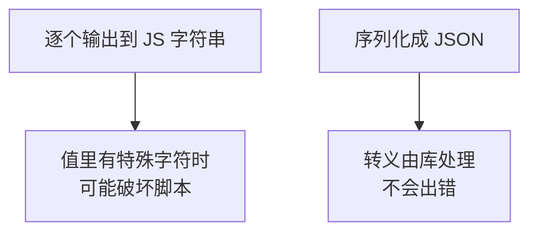

签名是十六进制字符串，本身不会有特殊字符。但这是个好习惯：**凡是把服务端数据输出到 JS 里，都应该走 JSON 序列化**，而不是手工拼字符串。

## 客户端：封装成一个对象

`Scripts/wecom-sdk.js`：

```javascript
/**
 * 企业微信 JS-SDK 初始化封装。
 * 用法：
 *   WeComSdk.init(sdkConfig);
 *   WeComSdk.ready(function () { ...可以调用能力了... });
 */
var WeComSdk = (function () {
    var _ready = false;
    var _failed = null;
    var _queue = [];        // 初始化完成前的调用先排队

    function _flush() {
        while (_queue.length > 0) {
            var fn = _queue.shift();
            try {
                fn();
            } catch (e) {
                if (window.console) {
                    console.error('WeComSdk 回调出错', e);
                }
            }
        }
    }

    return {
        /** 是否已就绪 */
        isReady: function () {
            return _ready;
        },

        /** 失败原因，未失败时为 null */
        getError: function () {
            return _failed;
        },

        /**
         * 初始化。cfg 由服务端输出。
         * onStatus 可选，用于把状态显示到页面上。
         */
        init: function (cfg, onStatus) {
            function status(text) {
                if (typeof onStatus === 'function') {
                    onStatus(text);
                }
            }

            if (typeof wx === 'undefined') {
                _failed = 'JS 文件未加载';
                status('JS-SDK 文件加载失败，请检查网络。');
                return;
            }
            if (!cfg) {
                _failed = '缺少配置';
                status('缺少签名配置。');
                return;
            }

            wx.config({
                beta: true,                    // wx.invoke 必需
                debug: cfg.debug === true,
                appId: cfg.corpId,             // 这里是企业 CorpID
                timestamp: cfg.timestamp,
                nonceStr: cfg.nonceStr,
                signature: cfg.configSignature,   // 企业 ticket 算的
                jsApiList: cfg.jsApiList || []
            });

            wx.ready(function () {
                status('企业级配置成功，正在配置应用级...');

                wx.agentConfig({
                    corpid: cfg.corpId,        // 注意全小写
                    agentid: cfg.agentId,
                    timestamp: cfg.timestamp,
                    nonceStr: cfg.nonceStr,
                    signature: cfg.agentSignature,   // 应用 ticket 算的
                    jsApiList: cfg.agentApiList || [],
                    success: function () {
                        _ready = true;
                        status('SDK 就绪。');
                        _flush();
                    },
                    fail: function (res) {
                        _failed = 'agentConfig 失败：' + JSON.stringify(res);
                        // 提示指向最可能的原因，省去无效排查
                        status(_failed + '（多为两种 ticket 混用所致）');
                    }
                });
            });

            wx.error(function (res) {
                _failed = 'config 失败：' + JSON.stringify(res);
                var tip = _failed;
                if (JSON.stringify(res).indexOf('signature') >= 0) {
                    tip += '。请对比签名 URL 与地址栏是否完全一致，'
                         + '签名 URL 为：' + cfg.signedUrl;
                }
                status(tip);
            });
        },

        /** 就绪后执行。已就绪则立即执行，否则排队。 */
        ready: function (fn) {
            if (typeof fn !== 'function') {
                return;
            }
            if (_ready) {
                fn();
            } else {
                _queue.push(fn);
            }
        }
    };
})();
```

## 为什么要做一个排队机制

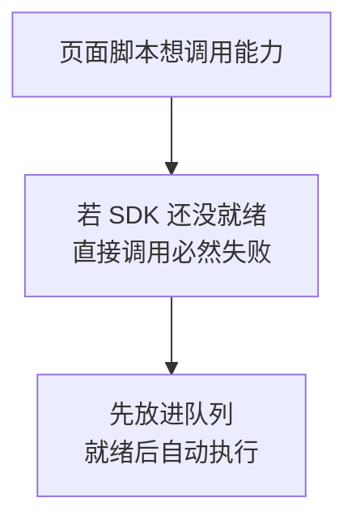

这样业务代码不用关心时序：

```javascript
WeComSdk.ready(function () {
    // 这里的代码一定在配置成功之后执行
});
```

比在每个地方写 `if (!sdkReady) return;` 干净得多。

## 失败提示里带上签名 URL

```javascript
if (JSON.stringify(res).indexOf('signature') >= 0) {
    tip += '。请对比签名 URL 与地址栏是否完全一致，签名 URL 为：' + cfg.signedUrl;
}
```

**这是本章最实用的一处设计。**签名失败时，提示直接告诉你服务端用的是哪个 URL，你只要和地址栏对一眼就知道问题所在。

不这么做的话，你得回去看代码、加日志、重新发布，才能知道服务端签的是什么。

---

# V11：集成版

## 母版页

在 `<head>` 里引入两个脚本：

```aspx
<script src="https://res.wx.qq.com/open/js/jweixin-1.2.0.js"></script>
<script src='<%= ResolveUrl("~/Scripts/wecom-sdk.js") %>?v=<%= AssetVersion %>'></script>
```

注意加了第 7 章 V9 的版本号参数，改了封装文件后手机上能立即生效。

## 使用示例页

`ScanDemo.aspx`：

```aspx
<%@ Page Language="C#" MasterPageFile="~/Site.Master" Async="true"
    AutoEventWireup="true" CodeBehind="ScanDemo.aspx.cs"
    Inherits="WeComWeb.ScanDemo" %>

<asp:Content ID="c1" ContentPlaceHolderID="TitleContent" runat="server">
    扫码查设备
</asp:Content>

<asp:Content ID="c2" ContentPlaceHolderID="MainContent" runat="server">
    <h3>扫码查设备</h3>
    <div id="sdkStatus" class="status">初始化中...</div>

    <button type="button" id="btnScan" class="btn" disabled>扫一扫</button>
    <div id="result" class="result"></div>

    <script type="text/javascript">
        var statusEl = document.getElementById('sdkStatus');
        var resultEl = document.getElementById('result');
        var btnScan = document.getElementById('btnScan');

        // 服务端输出的签名配置
        var sdkConfig = <%= SdkConfigJson %>;

        WeComSdk.init(sdkConfig, function (text) {
            statusEl.innerText = text;
        });

        // 就绪后才启用按钮，避免员工在初始化完成前点击
        WeComSdk.ready(function () {
            btnScan.disabled = false;
        });

        btnScan.onclick = function () {
            wx.scanQRCode({
                needResult: 1,
                scanType: ['qrCode', 'barCode'],
                success: function (res) {
                    resultEl.innerText = '扫到：' + res.resultStr;
                    // 实际业务：把结果提交到服务端查询
                },
                fail: function (res) {
                    resultEl.innerText = '扫码失败：' + JSON.stringify(res);
                },
                cancel: function () {
                    resultEl.innerText = '已取消。';
                }
            });
        };
    </script>
</asp:Content>
```

```csharp
using System;

namespace WeComWeb
{
    public partial class ScanDemo : JsSdkBasePage
    {
        // 本页只需要扫码
        protected override string[] JsApiList
        {
            get { return new[] { "scanQRCode" }; }
        }

        // 不需要专有能力
        protected override string[] AgentApiList
        {
            get { return new string[0]; }
        }
    }
}
```

## 按钮默认禁用的意义

```aspx
<button type="button" id="btnScan" class="btn" disabled>扫一扫</button>
```

初始化完成后才启用。这样员工不会在还不能用的时候点击，也就不会看到莫名的失败提示。

**用界面状态表达系统状态，比用错误提示解释失败更好。**

## 文件清单

```text
App_Code/
├── JsSdkHelper.cs        ticket 获取与缓存、签名计算
└── JsSdkBasePage.cs      页面基类，自动签名

Scripts/
└── wecom-sdk.js          客户端初始化封装

JsSdkTest.aspx            接入测试页
SdkDiag.aspx              诊断页（仅管理员）
ScanDemo.aspx             扫码示例
```

## 完整调用链

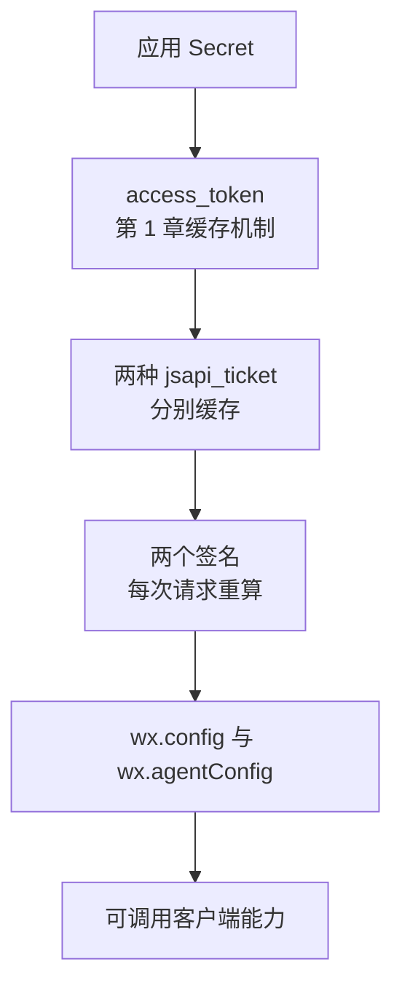

注意这条链上的缓存策略差异：

| 环节 | 缓存吗 | 原因 |
|---|---|---|
| `access_token` | 缓存 | 有效期 7200 秒 |
| `jsapi_ticket` | 缓存 | 有效期 7200 秒 |
| 签名 | **不缓存** | 绑定 URL 和时间戳 |

**这是本章最容易做错的架构决策。**缓存签名会导致换页面就失效，而且失效原因极难定位。

---

# 本章自测

| 测试 | 做法 | 期望结果 |
|---|---|---|
| 1 JS 加载 | 打开测试页 | `wx` 对象存在 |
| 2 URL 一致 | 对比签名 URL 与实际 URL | 完全一致 |
| 3 config 成功 | 打开测试页 | 显示企业级配置成功 |
| 4 agentConfig 成功 | 同上 | 显示两级都成功 |
| 5 扫一扫 | 点按钮 | 打开摄像头 |
| 6 扫码结果 | 扫任意二维码 | 页面显示内容 |
| 7 取消不报错 | 扫码界面点返回 | 提示已取消，不是失败 |
| 8 ticket 缓存 | 连续刷新页面几次 | `ApiLog` 里 ticket 接口只调用一次 |
| 9 签名每次不同 | 刷新页面对比 nonceStr | 每次都不同 |
| 10 带参数的页面 | 访问带查询串的地址 | 签名仍然成功 |
| 11 混用 ticket | 故意把两个签名调换 | `config` 失败或 `agentConfig` 失败 |
| 12 未声明的接口 | 调用没写进 `jsApiList` 的接口 | 提示未授权 |
| 13 排队机制 | 页面刚打开立即点按钮 | 按钮是禁用状态 |
| 14 诊断页 | 用管理员打开 | 显示全部诊断信息 |
| 15 清缓存 | 点清缓存按钮后刷新 | 重新取 ticket，签名仍成功 |
| 16 关闭 debug | 把配置改成 false | 不再弹窗 |

第 8 项和第 11 项值得说明：

- **第 8 项**验证缓存真的生效了。查询语句：

```sql
SELECT ApiName, COUNT(*) FROM ApiLog
WHERE ApiName IN ('get_jsapi_ticket', 'ticket/get')
  AND CreatedAt >= DATEADD(MINUTE, -10, SYSDATETIME())
GROUP BY ApiName;
```

- **第 11 项**是主动制造错误，目的是让你熟悉这个错误的表现。真的遇到时就能立刻认出来。

# 错误排查速查

按出现顺序排查：

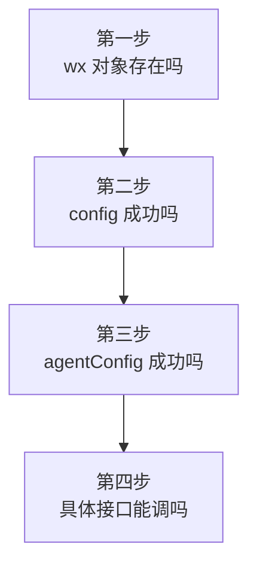

| 卡在哪一步 | 只需查这些 |
|---|---|
| 第一步 | 网络、JS 文件地址 |
| 第二步 | 签名 URL、企业 ticket、可信域名 |
| 第三步 | 应用 ticket（几乎必然是混用） |
| 第四步 | `jsApiList` 声明、`beta` 参数、设备支持 |

**每一步的可能原因互不重叠**，所以先确定卡在哪一步，能把排查范围缩小到很小。

# 完成标准

## 理解部分

- [ ] 为什么普通网页不能调摄像头，JS-SDK 改变了什么
- [ ] 为什么签名必须在服务端算
- [ ] `access_token` 和 `jsapi_ticket` 是什么关系
- [ ] 签名的四个输入各起什么作用
- [ ] `invalid signature` 最常见的原因是什么
- [ ] 为什么有两级配置，两种 ticket 能否混用
- [ ] 为什么 `agentConfig` 必须放在 `wx.ready` 里
- [ ] `beta: true` 不加会怎样
- [ ] ticket 该缓存、签名不该缓存，原因是什么
- [ ] `wx.xxx` 和 `wx.invoke` 两种形式的结果判断有什么不同

## 操作部分

- [ ] 16 项自测全部通过
- [ ] 签名 URL 与地址栏完全一致
- [ ] 手机上能调起扫一扫并拿到结果
- [ ] `ApiLog` 显示 ticket 接口没有被反复调用
- [ ] 上线前 `debug` 已改为 `false`

# 与前面章节的呼应

本章有三处直接依赖前面的成果：

| 本章做法 | 依据 |
|---|---|
| 用 `UrlHelper.GetPublicUrl` 签名 | 第 7 章 V8：代理会丢掉协议信息 |
| ticket 提前 5 分钟过期 | 第 1 章：时钟偏移与网络延迟 |
| 用应用 Secret 的 token 换 ticket | 第 1 章：权限跟着凭证走 |

第一条最关键。**如果第 7 章 V8 没做，本章的 `invalid signature` 会非常难查**——因为你的代码看起来完全正确，签名算法也没错，问题藏在一个你想不到的地方。

# 下一章

第 10 章用 JS-SDK 做定位签到。会遇到一个企业微信之外的问题：

> 企业微信只给经纬度，不给文字地址。转换需要额外的地图服务，而且有一个坐标系陷阱会导致定位偏移几百米。
