# 第 10 章：JS-SDK 定位与经纬度转地址

## 语言边界

页面 JavaScript 取经纬度，C# 服务端负责转换成文字地址并入库。不涉及 Python。

## 前置条件

- 第 9 章完成，`WeComSdk` 初始化可用
- 第 8 章完成，能识别当前登录成员
- 第 3 章的 `CheckinRecord` 表已建

## 一个必须先说清的事实

**企业微信只能给出经纬度，不提供文字地址。**

`wx.getLocation` 返回的是纬度、经度、精度、速度，没有「某市某区某路某号」这样的信息。

要得到文字地址，必须再调用一个**地图服务**做逆地址解析（也叫逆地理编码）。这是独立于企业微信的第三方服务，需要单独申请密钥。

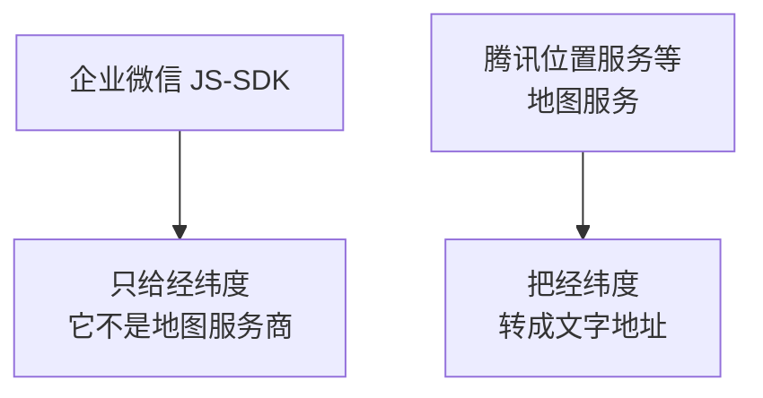

本章一半的内容是在处理这件事，以及它带来的坐标系问题。

## 版本地图

| 版本 | 主题 | 解决上一版什么问题 |
|---|---|---|
| V1 | 取到经纬度 | —— |
| V2 | 处理拒绝与超时 | 用户不授权时页面卡住 |
| V3 | 坐标系陷阱 | 地址差了几百米 |
| V4 | 申请地图密钥 | 无法调用地图服务 |
| V5 | 服务端逆地址解析 | 密钥不能放在页面里 |
| V6 | 解析结果与降级 | 地图服务故障即不可用 |
| V7 | 结果缓存 | 配额消耗过快 |
| V8 | 签到入库 | 数据没有留存 |
| V9 | 精度与可信度 | 把定位当成到岗证明 |
| V10 | 记录查询 | 数据无法查看 |
| V11 | 集成版 | 代码零散 |

---

# V1：取到经纬度

## 目标

在页面上显示当前的经纬度。

## 代码

`Checkin.aspx`：

```aspx
<%@ Page Language="C#" MasterPageFile="~/Site.Master" Async="true"
    AutoEventWireup="true" CodeBehind="Checkin.aspx.cs"
    Inherits="WeComWeb.Checkin" %>

<asp:Content ID="c1" ContentPlaceHolderID="TitleContent" runat="server">
    位置签到
</asp:Content>

<asp:Content ID="c2" ContentPlaceHolderID="MainContent" runat="server">
    <h3>位置签到</h3>
    <div id="sdkStatus" class="status">初始化中...</div>

    <button type="button" id="btnLocate" class="btn" disabled>获取当前位置</button>
    <div id="locResult" class="result"></div>

    <script type="text/javascript">
        var statusEl = document.getElementById('sdkStatus');
        var resultEl = document.getElementById('locResult');
        var btnLocate = document.getElementById('btnLocate');

        var sdkConfig = <%= SdkConfigJson %>;

        WeComSdk.init(sdkConfig, function (t) { statusEl.innerText = t; });

        WeComSdk.ready(function () {
            btnLocate.disabled = false;
        });

        btnLocate.onclick = function () {
            resultEl.innerText = '正在定位...';

            wx.getLocation({
                type: 'gcj02',       // 坐标系，V3 会详细解释为什么是这个值
                success: function (res) {
                    resultEl.innerHTML =
                        '纬度：' + res.latitude + '<br/>' +
                        '经度：' + res.longitude + '<br/>' +
                        '精度：' + res.accuracy + ' 米<br/>' +
                        '速度：' + res.speed;
                },
                fail: function (res) {
                    resultEl.innerText = '定位失败：' + JSON.stringify(res);
                }
            });
        };
    </script>
</asp:Content>
```

## 后台

```csharp
using System;

namespace WeComWeb
{
    public partial class Checkin : JsSdkBasePage
    {
        // 本页只需要定位能力
        protected override string[] JsApiList
        {
            get { return new[] { "getLocation" }; }
        }

        protected override string[] AgentApiList
        {
            get { return new string[0]; }
        }
    }
}
```

## 返回的四个字段

| 字段 | 含义 | 说明 |
|---|---|---|
| `latitude` | 纬度 | 中国境内约 4 到 53 |
| `longitude` | 经度 | 中国境内约 73 到 135 |
| `accuracy` | 精度 | 单位米，数字越小越准 |
| `speed` | 速度 | 静止时通常为 0 或负数 |

## `accuracy` 这个字段很重要

它表示「真实位置可能在这个半径范围内」。V9 会用它判断定位是否可信。

先记住一个量级感：

| 环境 | 典型精度 |
|---|---|
| 室外开阔处 | 10 到 30 米 |
| 城市街道 | 30 到 65 米 |
| 室内 | 100 米以上，有时几百米 |

**室内定位误差很大**，这直接影响签到功能的可靠性。

## 验证

在手机企业微信里点按钮，首次调用时手机会弹出位置权限请求，允许后应显示四个数值。

## V1 的问题

如果员工点了「拒绝」，或者手机没开定位服务，页面会一直显示「正在定位」。

---

# V2：处理拒绝与超时

## 目标

定位失败时给出可操作的提示。

## 原理：定位失败的四种情况

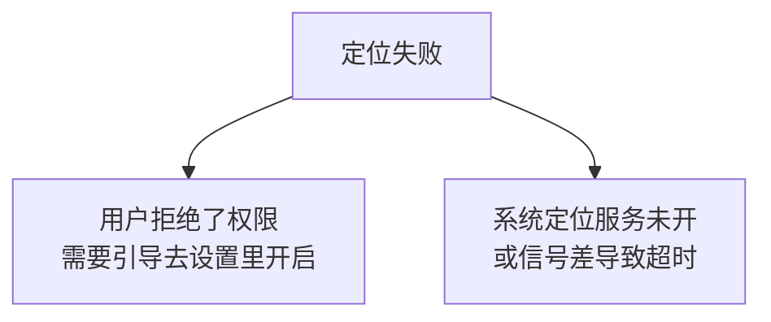

四种情况的处理方式完全不同：

| 情况 | 员工该做什么 |
|---|---|
| 拒绝了企业微信的位置权限 | 到手机设置里给企业微信开权限 |
| 手机定位服务总开关关闭 | 打开手机的定位服务 |
| 室内信号差 | 走到窗边或室外重试 |
| 网络问题 | 检查网络 |

**如果只提示「定位失败」，员工无法判断该做什么。**

## 原理：没有回调的情况

`wx.getLocation` 有个实际问题：**某些情况下它既不回调 `success` 也不回调 `fail`**，页面就一直停在「正在定位」。

常见于用户在权限弹窗上既不同意也不拒绝，直接把弹窗划走。

解决办法是自己加超时：

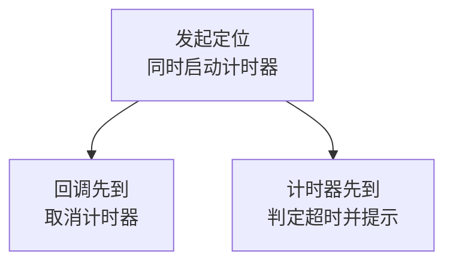

## 代码

```javascript
var locating = false;      // 防止重复点击

function getLocation(callback) {
    if (locating) {
        return;
    }
    locating = true;

    var finished = false;
    var TIMEOUT_MS = 15000;     // 15 秒

    // 自己的超时保护：应对既不 success 也不 fail 的情况
    var timer = setTimeout(function () {
        if (finished) {
            return;
        }
        finished = true;
        locating = false;
        callback(null, '定位超时。可能原因：未允许位置权限，'
            + '或当前信号较弱。请到窗边或室外重试。');
    }, TIMEOUT_MS);

    wx.getLocation({
        type: 'gcj02',                  // 必须显式指定，默认的 wgs84 会导致偏移数百米
        success: function (res) {
            if (finished) {
                return;
            }
            finished = true;
            clearTimeout(timer);
            locating = false;

            // 基本合理性检查：明显不合理的值直接判为无效
            if (!isValidCoord(res.latitude, res.longitude)) {
                callback(null, '取到的坐标不合理，请重试。');
                return;
            }
            callback(res, null);
        },
        fail: function (res) {
            if (finished) {
                return;
            }
            finished = true;
            clearTimeout(timer);
            locating = false;
            callback(null, describeLocationError(res));
        },
        cancel: function () {
            if (finished) {
                return;
            }
            finished = true;
            clearTimeout(timer);
            locating = false;
            callback(null, '已取消定位。');
        }
    });
}

/** 把定位错误翻译成可操作的提示。 */
function describeLocationError(res) {
    var msg = (res && res.errMsg ? res.errMsg : '').toLowerCase();

    if (msg.indexOf('deny') >= 0 || msg.indexOf('denied') >= 0
        || msg.indexOf('auth') >= 0) {
        return '未获得位置权限。请在手机设置中允许企业微信使用位置信息，'
             + '然后重新进入本页面。';
    }
    if (msg.indexOf('timeout') >= 0) {
        return '定位超时。请到信号较好的位置重试。';
    }
    if (msg.indexOf('unsupport') >= 0 || msg.indexOf('not support') >= 0) {
        return '当前环境不支持定位。请使用手机企业微信操作。';
    }
    return '定位失败：' + (res && res.errMsg ? res.errMsg : '未知原因')
         + '。请确认已开启手机定位服务后重试。';
}

/** 坐标合理性检查。 */
function isValidCoord(lat, lng) {
    if (typeof lat !== 'number' || typeof lng !== 'number') {
        return false;
    }
    if (isNaN(lat) || isNaN(lng)) {
        return false;
    }
    // 纬度范围与经度范围
    if (lat < -90 || lat > 90 || lng < -180 || lng > 180) {
        return false;
    }
    // 排除 0,0 这种明显异常值
    if (lat === 0 && lng === 0) {
        return false;
    }
    return true;
}
```

## 三个设计要点

### `finished` 标志防止重复回调

```javascript
if (finished) { return; }
finished = true;
```

超时后回调仍有可能到达。不加这个判断，员工会先看到「定位超时」，几秒后又看到定位成功，界面前后矛盾。

### 错误提示要说明「怎么办」

对比两种写法：

| 写法 | 员工的反应 |
|---|---|
| 「定位失败」 | 不知道该做什么，来找你 |
| 「请在手机设置中允许企业微信使用位置信息」 | 自己就能解决 |

**移动端的错误提示必须包含解决动作。**因为员工没法看控制台，你也不在他身边。

### 坐标合理性检查

```javascript
if (lat === 0 && lng === 0) { return false; }
```

`0,0` 是几内亚湾的海面，正常不会出现。它通常意味着定位失败但返回了默认值。

## V2 的问题

坐标拿到了，但如果直接送给地图服务，得到的地址可能差几百米。

---

# V3：坐标系陷阱

## 这是本章最重要的一节

同一个物理位置，在不同坐标系下的经纬度**不一样**。混用会导致定位偏移。

## 原理：中国境内有三套常用坐标系

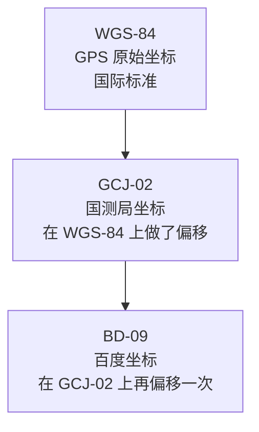

| 坐标系 | 谁在用 |
|---|---|
| WGS-84 | GPS 芯片原始输出、国外地图 |
| GCJ-02 | 腾讯地图、高德地图 |
| BD-09 | 百度地图 |

## 偏移有多大

在中国境内，把 WGS-84 坐标直接当作 GCJ-02 使用，偏移可达**数百米**。这个现象在业界被称为坐标偏移，处理不当会让位置落到隔壁街区（关于三种坐标系的差异与转换，参见[GCJ-02 与 WGS-84 坐标系转换说明](https://cloud.tencent.com/developer/article/2192763)、[地图定位偏移与坐标系转换](https://developer.cloud.tencent.com/article/1334731)。内容已改写以符合授权要求）。

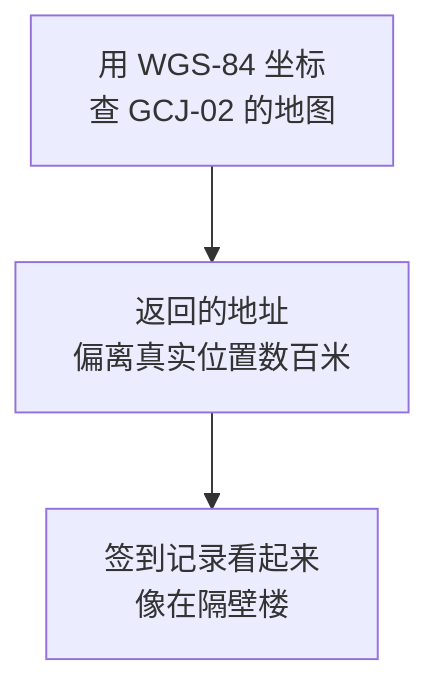

对签到功能来说，几百米的偏差足以让「在公司」变成「在马路对面」。

## 解决办法：源头就取对

有两条路：

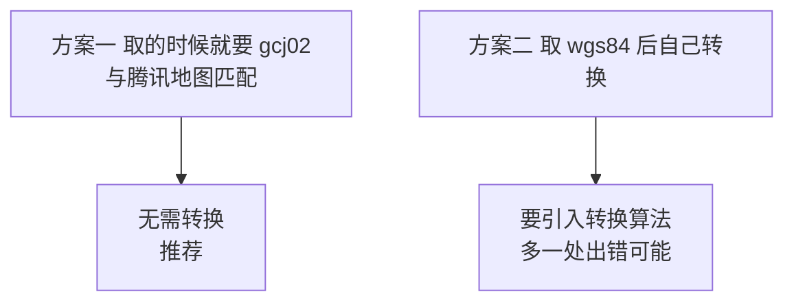

**本教程用方案一**：`wx.getLocation` 支持指定坐标系，直接要 `gcj02`。

```javascript
wx.getLocation({
    type: 'gcj02',      // 与腾讯位置服务匹配，无需转换
    ...
});
```

这就是 V1 代码里那个参数的原因。

## 为什么不用默认值

`type` 的默认值是 `wgs84`。**如果你不写这个参数，拿到的就是 WGS-84 坐标**，送给腾讯地图必然偏移。

这是一个典型的「不写也能跑，但结果是错的」的坑：程序不报错，地址也返回了，只是位置不对。**如果不知道坐标系这件事，可能永远发现不了。**

## 必须记录用的是哪个坐标系

第 3 章的 `CheckinRecord` 表里有个 `CoordType` 字段，作用在这里：

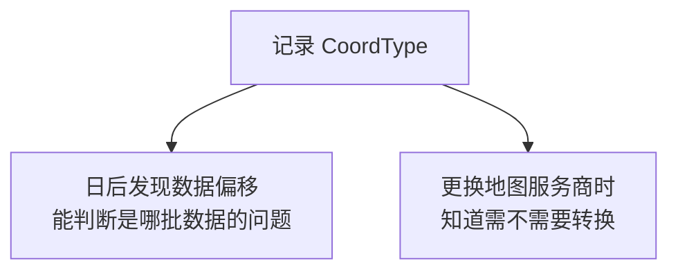

如果不记，将来发现历史数据有偏移，你无法判断哪些数据需要修正。

## 如果必须用百度地图

百度用的是 BD-09，与 GCJ-02 又不同。这时要么让 `getLocation` 返回后做一次 GCJ-02 到 BD-09 的转换，要么使用百度提供的转换接口。

**本教程统一用腾讯位置服务，避免这一层转换。**技术选择上少一次转换就少一处出错的地方。

## 一个自查方法

拿到坐标后，把它输入到腾讯地图的网页版看落点：

| 结果 | 说明 |
|---|---|
| 落点准确 | 坐标系匹配 |
| 偏移几百米 | 坐标系不匹配，检查 `type` 参数 |
| 落在国外或海里 | 经纬度顺序颠倒了，见 V5 |

## V3 的问题

坐标系对了，但还没有地图服务可以调用。

---

# V4：申请地图密钥

## 目标

拿到调用地图服务的密钥。

## 步骤

1. 注册腾讯位置服务的开发者账号
2. 创建应用，获得一个 Key
3. 为这个 Key 配置额度和限制

## 三项必须做的配置

### 1. 启用逆地址解析服务

Key 需要勾选允许调用的服务类型。**逆地址解析属于 WebService API**，要确认已启用。

### 2. 设置来源限制

这是安全关键：

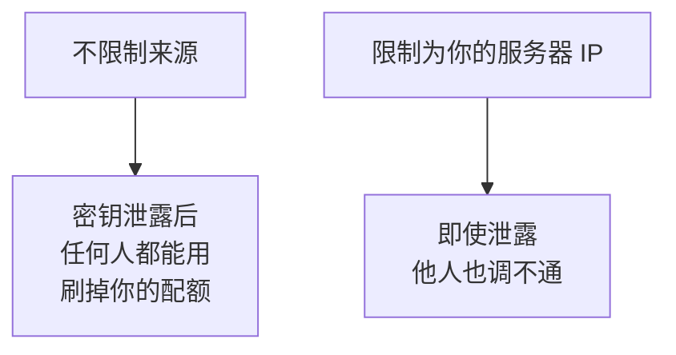

因为我们在服务端调用（见 V5），所以应该限制为**服务器出口 IP**。

这和第 1 章企业微信的可信 IP 是同一个思路：**纵深防御，不指望单一措施万无一失。**

### 3. 了解配额

免费额度有两个维度的限制：

| 限制类型 | 含义 |
|---|---|
| 每日调用量 | 一天最多调多少次 |
| 并发频率 | 每秒最多调多少次 |

**这直接决定了 V7 为什么必须做缓存。**一个几百人的公司，每人每天签到两次就是上千次调用，很容易碰到限制。

## 配置到 Web.config

```xml
<appSettings>
  <!-- 腾讯位置服务密钥。属于机密，不要提交到代码仓库 -->
  <add key="Map.TencentKey" value="你的Key" />
  <!-- 逆地址解析接口地址 -->
  <add key="Map.GeocoderUrl" value="https://apis.map.qq.com/ws/geocoder/v1/" />
</appSettings>
```

密钥的保护要求和企业微信 Secret 一样：

| 要求 | 原因 |
|---|---|
| 不写进前端页面 | 浏览器里的东西等于公开 |
| 不提交到 Git | 历史记录删不掉 |
| 不写进日志 | 排错时容易顺手打印 |

## V4 的问题

有密钥了，但如果在页面 JS 里直接调用地图接口，密钥就暴露了。

---

# V5：服务端逆地址解析

## 目标

在 C# 里把经纬度转成文字地址。

## 原理：为什么必须在服务端调用

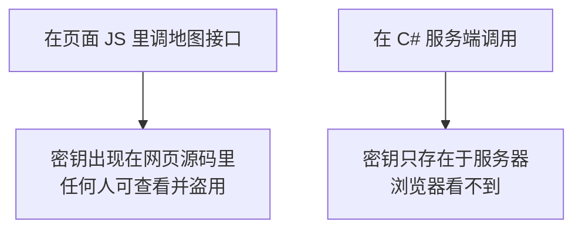

这个判断标准和第 9 章的 `jsapi_ticket` 完全一样：**凡是能代表你身份、能消耗你资源的东西，都不能出现在浏览器里。**

密钥泄露的后果很实际：别人用你的密钥调接口，配额被刷完，你自己的功能就不可用了。

## 接口格式

```text
GET https://apis.map.qq.com/ws/geocoder/v1/?location=纬度,经度&key=KEY
```

**注意参数顺序是「纬度,经度」**，纬度在前（格式参见[腾讯地图逆地址解析用法](https://www.cnblogs.com/sunsing123/p/9719225.html)。内容已改写以符合授权要求）。

这一点极易搞错，因为日常说「经纬度」是经度在前。**顺序颠倒的表现是位置落在国外或海里**，正如 V3 自查方法里提到的。

## 返回结构

```json
{
  "status": 0,
  "message": "query ok",
  "result": {
    "address": "广东省深圳市南山区科技南一路",
    "formatted_addresses": { "recommend": "南山区科技园某大厦" },
    "address_component": {
      "province": "广东省",
      "city": "深圳市",
      "district": "南山区",
      "street": "科技南一路",
      "street_number": "1号"
    }
  }
}
```

## 又是两层判断

和企业微信一样，这个接口也用 `status` 表示业务结果，HTTP 状态码通常是 200：

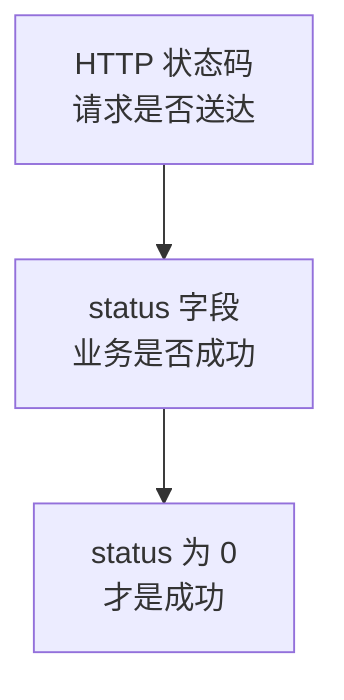

**第 2 章讲的两层判断原则在这里同样适用。**不同的接口用不同的字段名（企业微信是 `errcode`，腾讯地图是 `status`），但原理一致。

## 代码

`App_Code/GeocodeService.cs`：

```csharp
using System;
using System.Configuration;
using System.Globalization;
using System.Net.Http;
using System.Threading.Tasks;
using Newtonsoft.Json.Linq;

namespace WeComWeb
{
    /// <summary>逆地址解析结果。</summary>
    public class GeocodeResult
    {
        public bool Success { get; set; }
        public string Address { get; set; }          // 标准地址
        public string Recommend { get; set; }        // 推荐描述，更口语化
        public string Province { get; set; }
        public string City { get; set; }
        public string District { get; set; }
        public string RawJson { get; set; }          // 原始返回，便于排查
        public string ErrorMessage { get; set; }

        /// <summary>用于显示的地址。优先用推荐描述。</summary>
        public string DisplayAddress
        {
            get
            {
                if (!string.IsNullOrEmpty(Recommend))
                {
                    return Recommend;
                }
                return string.IsNullOrEmpty(Address) ? "" : Address;
            }
        }
    }

    public static class GeocodeService
    {
        private static readonly HttpClient Client = new HttpClient
        {
            Timeout = TimeSpan.FromSeconds(8)     // 地图服务要设短一些，见下方说明
        };

        /// <summary>经纬度转文字地址。</summary>
        public static async Task<GeocodeResult> ReverseAsync(
            decimal latitude, decimal longitude)
        {
            string key = ConfigurationManager.AppSettings["Map.TencentKey"];
            string baseUrl = ConfigurationManager.AppSettings["Map.GeocoderUrl"];

            if (string.IsNullOrEmpty(key))
            {
                return new GeocodeResult
                {
                    Success = false,
                    ErrorMessage = "未配置地图服务密钥"
                };
            }

            // 注意顺序：纬度在前，经度在后
            // 用 InvariantCulture 避免某些区域设置把小数点输出成逗号
            string location = string.Format(CultureInfo.InvariantCulture,
                "{0:F6},{1:F6}", latitude, longitude);

            string url = string.Format("{0}?location={1}&key={2}",
                baseUrl, Uri.EscapeDataString(location), Uri.EscapeDataString(key));

            var watch = System.Diagnostics.Stopwatch.StartNew();

            try
            {
                HttpResponseMessage resp = await Client.GetAsync(url);
                resp.EnsureSuccessStatusCode();
                string json = await resp.Content.ReadAsStringAsync();

                JObject obj = JObject.Parse(json);
                int status = obj.Value<int?>("status") ?? -1;
                watch.Stop();

                // 日志里不能出现密钥，所以只记接口名不记 URL
                ApiLogger.Log("map/geocoder", status,
                    status == 0 ? null : obj.Value<string>("message"),
                    watch.ElapsedMilliseconds);

                if (status != 0)
                {
                    return new GeocodeResult
                    {
                        Success = false,
                        RawJson = json,
                        ErrorMessage = string.Format("地图服务返回 status={0}：{1}",
                            status, obj.Value<string>("message"))
                    };
                }

                JToken result = obj["result"];
                JToken comp = result == null ? null : result["address_component"];
                JToken formatted = result == null
                    ? null : result["formatted_addresses"];

                return new GeocodeResult
                {
                    Success = true,
                    Address = result == null ? null : result.Value<string>("address"),
                    Recommend = formatted == null
                        ? null : formatted.Value<string>("recommend"),
                    Province = comp == null ? null : comp.Value<string>("province"),
                    City = comp == null ? null : comp.Value<string>("city"),
                    District = comp == null ? null : comp.Value<string>("district"),
                    RawJson = json
                };
            }
            catch (Exception ex)
            {
                watch.Stop();
                ApiLogger.Log("map/geocoder", -1, ex.Message,
                    watch.ElapsedMilliseconds);

                return new GeocodeResult
                {
                    Success = false,
                    ErrorMessage = "地图服务调用失败：" + ex.Message
                };
            }
        }
    }
}
```

## 三个细节说明

### 超时设得比企业微信短

```csharp
Timeout = TimeSpan.FromSeconds(8)
```

因为地址解析是**辅助功能**。员工在等签到结果，不该为了一个地址等 30 秒。

超时了就走 V6 的降级方案，只存经纬度。**功能主线不能被辅助功能拖住。**

### `CultureInfo.InvariantCulture` 不能省

```csharp
string.Format(CultureInfo.InvariantCulture, "{0:F6},{1:F6}", ...)
```

某些区域设置下，小数点会被格式化成逗号，`22.5` 变成 `22,5`。拼进 `location` 参数后就变成了四个数字，接口无法解析。

服务器的区域设置可能和你的开发机不同，**这类问题在本地测不出来**。凡是格式化数字用于协议传输，都要指定不变文化。

### 日志不记 URL

```csharp
ApiLogger.Log("map/geocoder", status, ...);
```

因为 URL 里带着密钥。这和第 6 章 V11 的处理一致：**只记接口名、状态和耗时。**

## V5 的问题

如果地图服务不可用，签到功能就整体失败了。

---

# V6：解析结果与降级

## 目标

地图服务不可用时，签到仍然能完成。

## 原理：区分主线与辅助

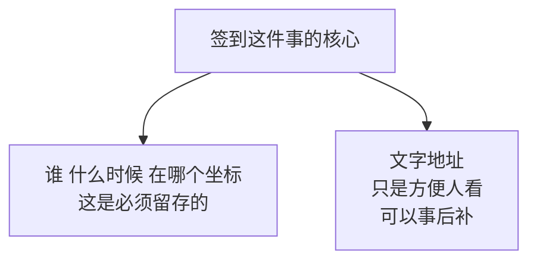

经纬度是原始事实，地址是它的一种解释。**原始事实不能丢，解释可以稍后再做。**

所以降级策略是：

| 地图服务状态 | 行为 |
|---|---|
| 正常 | 存经纬度 + 地址 |
| 失败或超时 | **只存经纬度，签到照样成功** |
| 事后 | 可以批量补齐地址 |

## 代码

```csharp
/// <summary>签到处理结果。</summary>
public class CheckinResult
{
    public bool Success { get; set; }
    public long RecordId { get; set; }
    public string Address { get; set; }
    public bool AddressResolved { get; set; }
    public string Message { get; set; }
}

/// <summary>执行签到。地址解析失败不影响签到成功。</summary>
public static async Task<CheckinResult> DoCheckinAsync(string userId,
    decimal lat, decimal lng, decimal? accuracy, string coordType)
{
    // 先尝试解析地址，失败也继续
    GeocodeResult geo = null;
    try
    {
        geo = await GeocodeService.ReverseAsync(lat, lng);
    }
    catch
    {
        // 已在服务内部记过日志，这里不再处理
    }

    bool resolved = geo != null && geo.Success;

    long id = SaveRecord(userId, lat, lng, accuracy, coordType,
        resolved ? geo.DisplayAddress : null,
        geo == null ? null : geo.RawJson);

    return new CheckinResult
    {
        Success = true,                  // 无论地址是否解析成功，签到都成功
        RecordId = id,
        Address = resolved ? geo.DisplayAddress : null,
        AddressResolved = resolved,
        Message = resolved
            ? "签到成功"
            : "签到成功。地址暂未解析出来，已记录坐标。"
    };
}
```

## 为什么要把「地址没解析出来」告诉员工

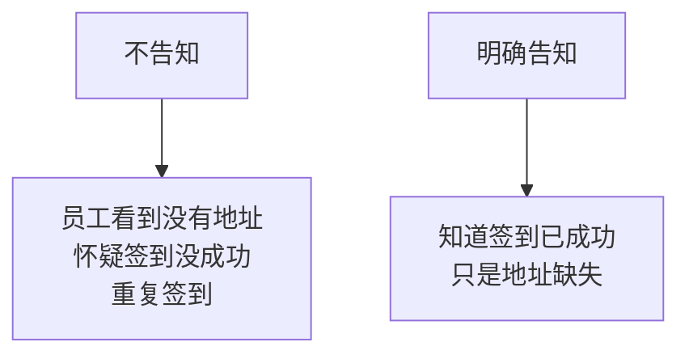

**「部分成功」必须明确表达。**这和第 2 章讲的 `invaliduser` 是同一类问题：不能因为主要动作成功就隐瞒次要动作的失败。

## 事后批量补地址

```sql
-- 找出缺地址的记录
SELECT Id, Latitude, Longitude, CheckinAt
FROM CheckinRecord
WHERE Address IS NULL
ORDER BY CheckinAt DESC;
```

写一个管理页面遍历这些记录调用解析补齐。这也是 V5 里保留 `RawJson` 的价值之一：能看出当时到底返回了什么。

## 关于 `formatted_addresses.recommend`

返回里有两种地址表述：

| 字段 | 特点 |
|---|---|
| `address` | 标准地址，如「广东省深圳市南山区科技南一路」 |
| `recommend` | 口语化描述，如「南山区科技园某大厦」 |

`recommend` 通常更贴近人的表达习惯，会带上附近的地标。所以 `DisplayAddress` 优先用它。

但它可能为空，所以要有 `address` 兜底。**取任何可选字段都要考虑它不存在的情况**，这是第 6 章讲过的原则。

## V6 的问题

每次签到都调一次地图接口，配额消耗很快。


---

# V7：结果缓存

## 目标

减少地图接口的调用次数。

## 原理：为什么坐标可以用来做缓存键

同一栋楼里的员工签到，坐标只差几米，解析出来的地址是同一个。

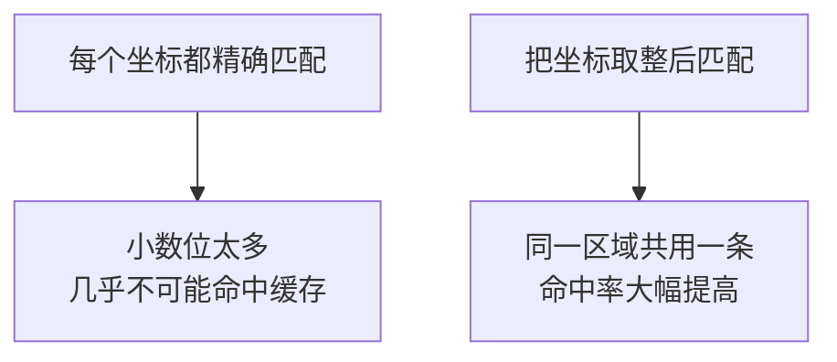

关键是**取整到多少位小数**。这是一个精度与命中率的权衡：

| 保留小数位 | 对应距离 | 效果 |
|---|---|---|
| 6 位 | 约 0.1 米 | 几乎不会命中 |
| 5 位 | 约 1 米 | 命中率很低 |
| **4 位** | **约 11 米** | **推荐** |
| 3 位 | 约 111 米 | 命中率高但地址可能不准 |
| 2 位 | 约 1 公里 | 地址明显不准 |

**本教程用 4 位小数**，约 11 米。理由是：

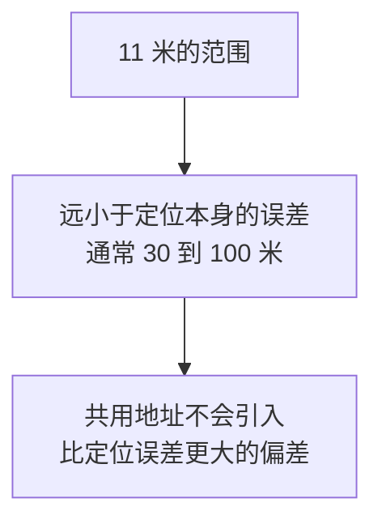

也就是说，缓存带来的误差被定位本身的误差完全覆盖了，不会让结果变得更差。

## 建表

追加到第 3 章的初始化脚本：

```sql
IF OBJECT_ID('GeocodeCache') IS NOT NULL DROP TABLE GeocodeCache;
GO

CREATE TABLE GeocodeCache (
    Id        BIGINT IDENTITY(1,1) PRIMARY KEY,
    -- 取整到 4 位小数后的坐标，作为缓存键
    LatKey    DECIMAL(9,4) NOT NULL,
    LngKey    DECIMAL(9,4) NOT NULL,
    CoordType NVARCHAR(10) NOT NULL,      -- 坐标系不同不能混用缓存
    Address   NVARCHAR(300) NULL,
    Province  NVARCHAR(50) NULL,
    City      NVARCHAR(50) NULL,
    District  NVARCHAR(50) NULL,
    HitCount  INT NOT NULL DEFAULT 0,     -- 命中次数，用于评估缓存效果
    CreatedAt DATETIME2(0) NOT NULL DEFAULT SYSDATETIME(),

    CONSTRAINT UQ_Geocode_Key UNIQUE (LatKey, LngKey, CoordType)
);
GO
```

## 为什么缓存键要包含坐标系

第 V3 节讲过三套坐标系。同一个数值在 WGS-84 和 GCJ-02 下代表不同的位置：

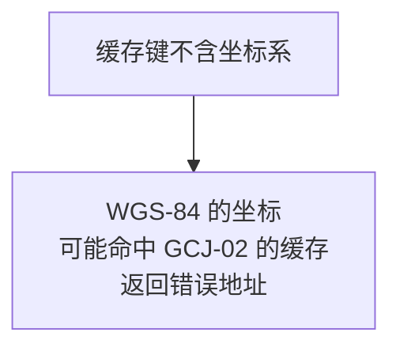

这和第 5 章「缓存键必须包含 `type`」是完全相同的道理：**决定结果的所有输入都要进缓存键。**

## 代码

```csharp
using System;
using System.Data;
using System.Data.SqlClient;
using System.Threading.Tasks;

namespace WeComWeb
{
    public static class GeocodeCacheService
    {
        private static string ConnStr
        {
            get
            {
                return System.Configuration.ConfigurationManager
                    .ConnectionStrings["WeComDb"].ConnectionString;
            }
        }

        /// <summary>取整到 4 位小数，约 11 米精度。</summary>
        private static decimal RoundKey(decimal value)
        {
            return Math.Round(value, 4, MidpointRounding.AwayFromZero);
        }

        /// <summary>带缓存的逆地址解析。</summary>
        public static async Task<GeocodeResult> ReverseWithCacheAsync(
            decimal lat, decimal lng, string coordType)
        {
            decimal latKey = RoundKey(lat);
            decimal lngKey = RoundKey(lng);

            GeocodeResult cached = TryGetCache(latKey, lngKey, coordType);
            if (cached != null)
            {
                return cached;
            }

            GeocodeResult fresh = await GeocodeService.ReverseAsync(lat, lng);

            // 只缓存成功的结果，失败的下次还要重试
            if (fresh.Success)
            {
                SaveCache(latKey, lngKey, coordType, fresh);
            }
            return fresh;
        }

        private static GeocodeResult TryGetCache(decimal latKey,
            decimal lngKey, string coordType)
        {
            using (var conn = new SqlConnection(ConnStr))
            {
                conn.Open();

                // 查询的同时把命中次数加一，一条语句完成
                using (var cmd = new SqlCommand(@"
                    UPDATE GeocodeCache
                    SET HitCount = HitCount + 1
                    OUTPUT inserted.Address, inserted.Province,
                           inserted.City, inserted.District
                    WHERE LatKey = @Lat AND LngKey = @Lng
                      AND CoordType = @Type", conn))
                {
                    cmd.Parameters.Add(new SqlParameter("@Lat", SqlDbType.Decimal)
                        { Precision = 9, Scale = 4, Value = latKey });
                    cmd.Parameters.Add(new SqlParameter("@Lng", SqlDbType.Decimal)
                        { Precision = 9, Scale = 4, Value = lngKey });
                    cmd.Parameters.Add(new SqlParameter(
                        "@Type", SqlDbType.NVarChar, 10) { Value = coordType });

                    using (SqlDataReader r = cmd.ExecuteReader())
                    {
                        if (!r.Read())
                        {
                            return null;
                        }
                        return new GeocodeResult
                        {
                            Success = true,
                            Recommend = r["Address"] as string,
                            Province = r["Province"] as string,
                            City = r["City"] as string,
                            District = r["District"] as string
                        };
                    }
                }
            }
        }

        private static void SaveCache(decimal latKey, decimal lngKey,
            string coordType, GeocodeResult geo)
        {
            using (var conn = new SqlConnection(ConnStr))
            {
                conn.Open();
                // 并发下可能有两个请求同时插入，用 MERGE 避免撞唯一约束
                using (var cmd = new SqlCommand(@"
                    MERGE GeocodeCache AS t
                    USING (SELECT @Lat AS LatKey, @Lng AS LngKey,
                                  @Type AS CoordType) AS s
                        ON t.LatKey = s.LatKey AND t.LngKey = s.LngKey
                       AND t.CoordType = s.CoordType
                    WHEN NOT MATCHED THEN
                        INSERT (LatKey, LngKey, CoordType, Address,
                                Province, City, District)
                        VALUES (s.LatKey, s.LngKey, s.CoordType, @Addr,
                                @Prov, @City, @Dist);", conn))
                {
                    cmd.Parameters.Add(new SqlParameter("@Lat", SqlDbType.Decimal)
                        { Precision = 9, Scale = 4, Value = latKey });
                    cmd.Parameters.Add(new SqlParameter("@Lng", SqlDbType.Decimal)
                        { Precision = 9, Scale = 4, Value = lngKey });
                    cmd.Parameters.Add(new SqlParameter(
                        "@Type", SqlDbType.NVarChar, 10) { Value = coordType });
                    AddNullable(cmd, "@Addr", 300, geo.DisplayAddress);
                    AddNullable(cmd, "@Prov", 50, geo.Province);
                    AddNullable(cmd, "@City", 50, geo.City);
                    AddNullable(cmd, "@Dist", 50, geo.District);
                    cmd.ExecuteNonQuery();
                }
            }
        }

        private static void AddNullable(SqlCommand cmd, string name,
            int size, string value)
        {
            cmd.Parameters.Add(new SqlParameter(name, SqlDbType.NVarChar, size)
            {
                Value = string.IsNullOrEmpty(value)
                    ? (object)DBNull.Value
                    : value.Substring(0, Math.Min(size, value.Length))
            });
        }
    }
}
```

## 两个实现要点

### 查询和计数合并成一条语句

```sql
UPDATE GeocodeCache SET HitCount = HitCount + 1
OUTPUT inserted.Address, ...
WHERE LatKey = @Lat AND ...
```

用的是第 3 章 V7 讲的 `UPDATE ... OUTPUT` 技巧。这里的目的不是防并发，而是**省一次数据库往返**：查缓存和更新计数一次完成。

### 只缓存成功结果

```csharp
if (fresh.Success) { SaveCache(...); }
```

失败的结果不能缓存。否则一次网络抖动导致的失败会被记住，之后这个位置永远解析不出地址。

## 评估缓存效果

```sql
-- 缓存命中情况
SELECT COUNT(*) AS 缓存条数,
       SUM(HitCount) AS 累计命中次数,
       CAST(SUM(HitCount) AS DECIMAL(10,2))
           / NULLIF(SUM(HitCount) + COUNT(*), 0) AS 命中率
FROM GeocodeCache;

-- 最常命中的位置，通常是办公地点
SELECT TOP 10 Address, HitCount FROM GeocodeCache
ORDER BY HitCount DESC;
```

第二个查询很有意思：**命中最多的几个位置基本就是公司的办公地点**，可以用来验证数据是否合理。

## V7 的问题

签到数据还没有存进业务表。

---

# V8：签到入库

## 目标

把签到记录完整存下来。

## 表结构

第 3 章的 `CheckinRecord` 已经建好，回顾一下关键字段：

| 字段 | 作用 |
|---|---|
| `UserId` | 谁签的 |
| `Latitude`、`Longitude` | 坐标，`DECIMAL(9,6)` |
| `Accuracy` | 定位精度，V9 用 |
| `CoordType` | 坐标系，V3 强调过 |
| `Address` | 解析出的地址，可为空 |
| `RawGeoJson` | 地图原始返回，便于排查 |
| `CheckinAt` | 签到时间 |

## 原理：防重复签到

员工可能连续点两次按钮，或网络慢时重复提交。

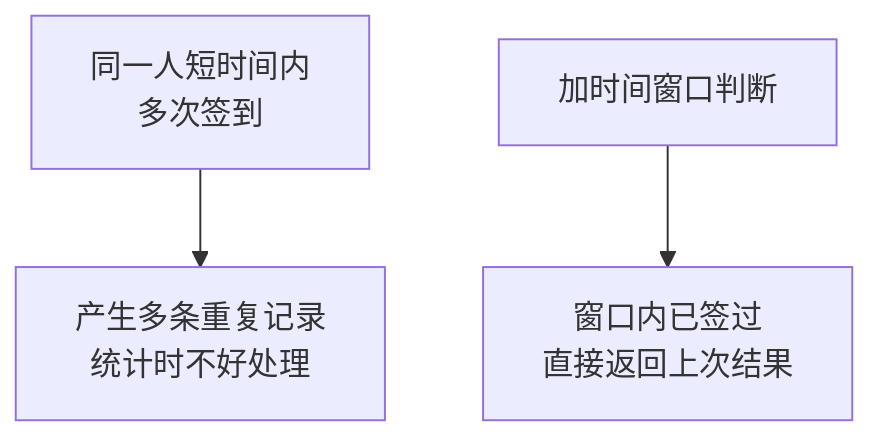

这和第 4 章的幂等思路一致，只是判断依据从「业务键」换成了「人 + 时间窗口」。

## 代码

```csharp
using System;
using System.Data;
using System.Data.SqlClient;
using System.Threading.Tasks;

namespace WeComWeb
{
    public class CheckinResult
    {
        public bool Success { get; set; }
        public long RecordId { get; set; }
        public string Address { get; set; }
        public bool AddressResolved { get; set; }
        public bool IsDuplicate { get; set; }
        public string Message { get; set; }
    }

    public static class CheckinService
    {
        // 同一人 2 分钟内重复签到视为重复提交
        private const int DuplicateWindowMinutes = 2;

        private static string ConnStr
        {
            get
            {
                return System.Configuration.ConfigurationManager
                    .ConnectionStrings["WeComDb"].ConnectionString;
            }
        }

        public static async Task<CheckinResult> CheckinAsync(string userId,
            decimal lat, decimal lng, decimal? accuracy, string coordType)
        {
            if (string.IsNullOrEmpty(userId))
            {
                return new CheckinResult
                {
                    Success = false,
                    Message = "未识别到身份，请重新从工作台进入。"
                };
            }

            // 第一步：查重
            CheckinResult recent = FindRecent(userId);
            if (recent != null)
            {
                recent.IsDuplicate = true;
                recent.Message = "刚刚已经签到过了，无需重复操作。";
                return recent;
            }

            // 第二步：解析地址（带缓存，失败不阻断）
            GeocodeResult geo = null;
            try
            {
                geo = await GeocodeCacheService.ReverseWithCacheAsync(
                    lat, lng, coordType);
            }
            catch
            {
                // 服务内部已记日志
            }

            bool resolved = geo != null && geo.Success;

            // 第三步：入库
            long id = Insert(userId, lat, lng, accuracy, coordType,
                resolved ? geo.DisplayAddress : null,
                geo == null ? null : geo.RawJson);

            return new CheckinResult
            {
                Success = true,
                RecordId = id,
                Address = resolved ? geo.DisplayAddress : null,
                AddressResolved = resolved,
                Message = resolved
                    ? "签到成功"
                    : "签到成功。地址暂未解析出来，已记录坐标位置。"
            };
        }

        /// <summary>查找时间窗口内的已有签到。</summary>
        private static CheckinResult FindRecent(string userId)
        {
            using (var conn = new SqlConnection(ConnStr))
            {
                conn.Open();
                using (var cmd = new SqlCommand(@"
                    SELECT TOP 1 Id, Address FROM CheckinRecord
                    WHERE UserId = @UserId
                      AND CheckinAt > DATEADD(MINUTE, @Window, SYSDATETIME())
                    ORDER BY CheckinAt DESC", conn))
                {
                    cmd.Parameters.Add(new SqlParameter(
                        "@UserId", SqlDbType.NVarChar, 64) { Value = userId });
                    cmd.Parameters.Add(new SqlParameter(
                        "@Window", SqlDbType.Int)
                        { Value = -DuplicateWindowMinutes });

                    using (SqlDataReader r = cmd.ExecuteReader())
                    {
                        if (!r.Read())
                        {
                            return null;
                        }
                        string addr = r["Address"] as string;
                        return new CheckinResult
                        {
                            Success = true,
                            RecordId = Convert.ToInt64(r["Id"]),
                            Address = addr,
                            AddressResolved = !string.IsNullOrEmpty(addr)
                        };
                    }
                }
            }
        }

        private static long Insert(string userId, decimal lat, decimal lng,
            decimal? accuracy, string coordType, string address, string rawJson)
        {
            using (var conn = new SqlConnection(ConnStr))
            {
                conn.Open();
                using (var cmd = new SqlCommand(@"
                    INSERT INTO CheckinRecord
                        (UserId, Latitude, Longitude, Accuracy,
                         CoordType, Address, RawGeoJson)
                    VALUES (@UserId, @Lat, @Lng, @Acc, @Type, @Addr, @Raw);
                    SELECT CAST(SCOPE_IDENTITY() AS BIGINT);", conn))
                {
                    cmd.Parameters.Add(new SqlParameter(
                        "@UserId", SqlDbType.NVarChar, 64) { Value = userId });
                    cmd.Parameters.Add(new SqlParameter("@Lat", SqlDbType.Decimal)
                        { Precision = 9, Scale = 6, Value = lat });
                    cmd.Parameters.Add(new SqlParameter("@Lng", SqlDbType.Decimal)
                        { Precision = 9, Scale = 6, Value = lng });
                    cmd.Parameters.Add(new SqlParameter("@Acc", SqlDbType.Decimal)
                    {
                        Precision = 9, Scale = 2,
                        Value = accuracy.HasValue
                            ? (object)accuracy.Value : DBNull.Value
                    });
                    cmd.Parameters.Add(new SqlParameter(
                        "@Type", SqlDbType.NVarChar, 10)
                        { Value = (object)coordType ?? "gcj02" });
                    cmd.Parameters.Add(new SqlParameter(
                        "@Addr", SqlDbType.NVarChar, 300)
                    {
                        Value = string.IsNullOrEmpty(address)
                            ? (object)DBNull.Value : address
                    });
                    cmd.Parameters.Add(new SqlParameter(
                        "@Raw", SqlDbType.NVarChar, -1)
                    {
                        Value = string.IsNullOrEmpty(rawJson)
                            ? (object)DBNull.Value : rawJson
                    });

                    return Convert.ToInt64(cmd.ExecuteScalar());
                }
            }
        }
    }
}
```

## 接收页面提交

用一个通用处理程序接收坐标。`CheckinHandler.ashx`：

```csharp
using System;
using System.Globalization;
using System.Threading.Tasks;
using System.Web;
using Newtonsoft.Json;

namespace WeComWeb
{
    public class CheckinHandler : HttpTaskAsyncHandler
    {
        public override async Task ProcessRequestAsync(HttpContext context)
        {
            context.Response.ContentType = "application/json";
            context.Response.Cache.SetCacheability(HttpCacheability.NoCache);

            try
            {
                // 身份从服务端 Session 取，绝不从请求参数取
                string userId = context.Session == null
                    ? null : context.Session["WeComUserId"] as string;

                if (string.IsNullOrEmpty(userId))
                {
                    Write(context, new { success = false,
                        message = "登录状态已失效，请重新进入应用。" });
                    return;
                }

                decimal lat, lng;
                if (!TryParse(context.Request.Form["lat"], out lat)
                    || !TryParse(context.Request.Form["lng"], out lng))
                {
                    Write(context, new { success = false,
                        message = "坐标参数不合法。" });
                    return;
                }

                // 服务端也要做范围校验，不能只信前端
                if (lat < -90 || lat > 90 || lng < -180 || lng > 180)
                {
                    Write(context, new { success = false,
                        message = "坐标超出合理范围。" });
                    return;
                }

                decimal acc;
                decimal? accuracy = TryParse(context.Request.Form["acc"], out acc)
                    ? (decimal?)acc : null;

                string coordType = context.Request.Form["coord"] ?? "gcj02";

                CheckinResult result = await CheckinService.CheckinAsync(
                    userId, lat, lng, accuracy, coordType);

                Write(context, new
                {
                    success = result.Success,
                    message = result.Message,
                    address = result.Address,
                    addressResolved = result.AddressResolved,
                    duplicate = result.IsDuplicate
                });
            }
            catch (Exception ex)
            {
                ApiLogger.Log("checkin", -1, ex.Message, 0);
                Write(context, new { success = false,
                    message = "处理失败，请稍后重试。" });
            }
        }

        private static bool TryParse(string s, out decimal value)
        {
            // 用 InvariantCulture，避免区域设置导致小数点解析失败
            return decimal.TryParse(s, NumberStyles.Float,
                CultureInfo.InvariantCulture, out value);
        }

        private static void Write(HttpContext context, object obj)
        {
            context.Response.Write(JsonConvert.SerializeObject(obj));
        }

        public override bool IsReusable
        {
            get { return false; }
        }
    }
}
```

## 一个安全要点

```csharp
// 身份从服务端 Session 取，绝不从请求参数取
string userId = context.Session["WeComUserId"] as string;
```

**绝不能让页面传 `userId` 过来。**否则任何人都能构造请求替别人签到。

这和第 8 章讲的原理一致：**身份必须来自服务端可信的来源。**页面传来的一切都是不可信输入。

## `.ashx` 需要 Session

`HttpTaskAsyncHandler` 默认不启用 Session。要在 `Web.config` 里声明，或让类实现 `IRequiresSessionState`：

```csharp
public class CheckinHandler : HttpTaskAsyncHandler,
    System.Web.SessionState.IRequiresSessionState
```

漏了这个，`context.Session` 会是 `null`，永远提示登录失效。

## V8 的问题

现在把定位当成了「员工确实在那个位置」的证明，但这个假设并不成立。

---

# V9：精度与可信度

## 目标

正确认识定位数据的可靠性边界。

## 原理一：精度决定可信度

`accuracy` 字段表示真实位置可能落在这个半径范围内。

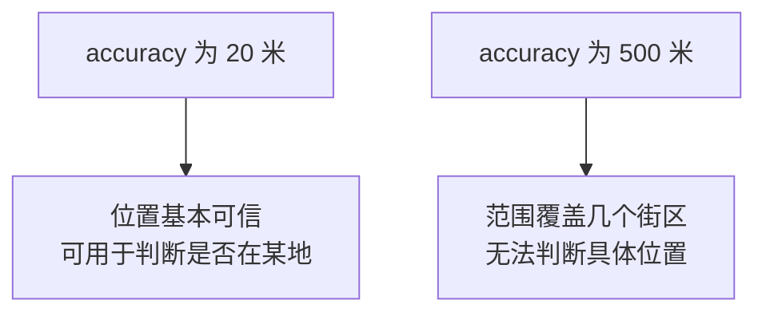

所以要按精度分级处理：

| 精度范围 | 处理建议 |
|---|---|
| 小于 50 米 | 可信 |
| 50 到 200 米 | 记录但标注精度偏低 |
| 大于 200 米 | 提示员工到信号更好的地方重试 |

## 代码

```csharp
/// <summary>按精度评估可信度。</summary>
public static string DescribeAccuracy(decimal? accuracy)
{
    if (!accuracy.HasValue)
    {
        return "精度未知";
    }
    if (accuracy.Value < 50)
    {
        return "定位精确";
    }
    if (accuracy.Value < 200)
    {
        return string.Format("精度偏低（约 {0:F0} 米）", accuracy.Value);
    }
    return string.Format("精度很差（约 {0:F0} 米），建议到室外重试",
        accuracy.Value);
}
```

## 原理二：判断是否在指定范围内

如果业务需要「必须在公司附近才能签到」，需要计算两点距离。

```csharp
/// <summary>计算两个坐标之间的距离，单位米。</summary>
public static double DistanceInMeters(decimal lat1, decimal lng1,
    decimal lat2, decimal lng2)
{
    // 地球平均半径，米
    const double R = 6371000;

    double rad1 = (double)lat1 * Math.PI / 180;
    double rad2 = (double)lat2 * Math.PI / 180;
    double dLat = rad2 - rad1;
    double dLng = ((double)lng2 - (double)lng1) * Math.PI / 180;

    // 球面距离公式
    double a = Math.Sin(dLat / 2) * Math.Sin(dLat / 2)
             + Math.Cos(rad1) * Math.Cos(rad2)
             * Math.Sin(dLng / 2) * Math.Sin(dLng / 2);

    return R * 2 * Math.Atan2(Math.Sqrt(a), Math.Sqrt(1 - a));
}
```

## 判断范围时必须把精度算进去

这是很多实现的疏漏：

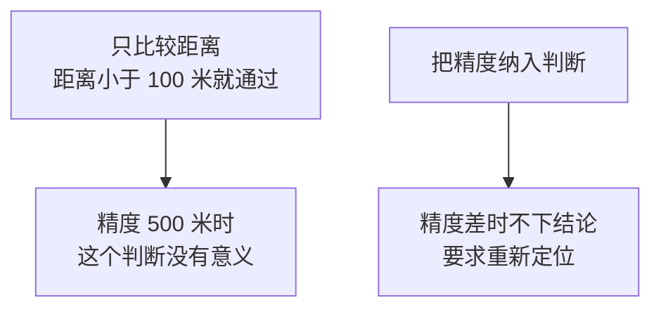

```csharp
public enum RangeCheckResult
{
    Inside,          // 确定在范围内
    Outside,         // 确定在范围外
    Uncertain        // 精度不足，无法判断
}

/// <summary>判断是否在指定范围内，同时考虑定位精度。</summary>
public static RangeCheckResult CheckInRange(
    decimal lat, decimal lng, decimal? accuracy,
    decimal centerLat, decimal centerLng, double allowedMeters)
{
    double distance = DistanceInMeters(lat, lng, centerLat, centerLng);
    double acc = accuracy.HasValue ? (double)accuracy.Value : 0;

    // 精度误差比允许范围还大时，任何结论都不可靠
    if (acc > allowedMeters)
    {
        return RangeCheckResult.Uncertain;
    }

    // 最坏情况下也在范围内
    if (distance + acc <= allowedMeters)
    {
        return RangeCheckResult.Inside;
    }

    // 最好情况下也在范围外
    if (distance - acc > allowedMeters)
    {
        return RangeCheckResult.Outside;
    }

    // 两种可能都存在
    return RangeCheckResult.Uncertain;
}
```

## 三种结果都要有对应的处理

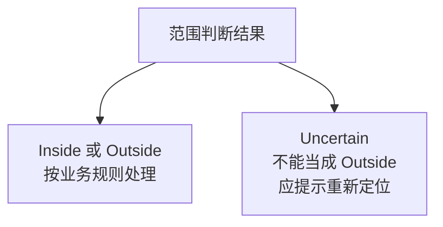

**把 `Uncertain` 当成 `Outside` 是不公平的**：员工可能真的在公司，只是在室内信号差。

## 原理三：定位不能作为唯一的到岗依据

这一点必须讲清楚，它属于系统设计的边界认知。

| 局限 | 说明 |
|---|---|
| 室内误差大 | 在公司大楼里可能定位到隔壁 |
| 坐标可被伪造 | 存在修改设备定位的手段 |
| 只证明设备位置 | 不证明人在那里 |

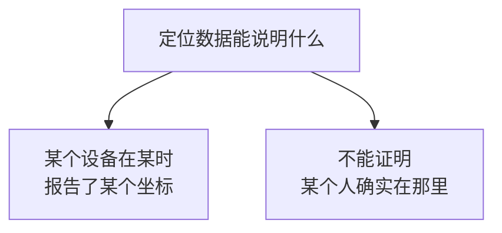

所以建议：

| 用途 | 是否合适 |
|---|---|
| 辅助记录外勤轨迹 | 合适 |
| 提供签到时的位置参考 | 合适 |
| 作为考勤扣款的唯一依据 | **不合适** |
| 判定员工是否在岗的最终证据 | **不合适** |

**技术上有局限的东西，不应该被当成管理上的铁证。**如果业务方要求把定位当成考勤依据，应该主动说明这个局限，并建议配合其他手段。

## 隐私方面的三条基本要求

收集位置信息涉及个人信息，本教程建议遵守：

| 要求 | 做法 |
|---|---|
| 明确告知 | 页面上说明收集位置的用途 |
| 最小必要 | 只在签到那一刻取位置，不做持续追踪 |
| 限定保留期 | 设定保留期限并定期清理 |

页面上的告知文字：

```aspx
<p class="notice">
    点击签到将获取您当前的位置信息，用于记录本次签到地点。
    我们仅在您点击签到时获取一次位置，不会持续追踪。
</p>
```

清理策略：

```sql
-- 按企业规定设定保留期限
DELETE TOP (5000) FROM CheckinRecord
WHERE CheckinAt < DATEADD(DAY, -365, SYSDATETIME());
```

**不做持续定位**是一条重要的自我约束。技术上可以做到，但那会从「签到记录」变成「行踪追踪」，性质完全不同。

## V9 的问题

数据存下来了，但没有页面能查看。

---

# V10：记录查询

## 目标

让员工看到自己的签到记录，让管理员看到全部记录。

## 权限设计

复用第 8 章 V11 的角色机制：

```mermaid
graph TB
    A["普通成员"] --> B["只能看自己的记录"]
    C["管理员"] --> D["可以看全部记录"]
```

## 查询代码

```csharp
using System;
using System.Collections.Generic;
using System.Data;
using System.Data.SqlClient;

namespace WeComWeb
{
    public class CheckinRow
    {
        public long Id { get; set; }
        public string UserId { get; set; }
        public string UserName { get; set; }
        public decimal Latitude { get; set; }
        public decimal Longitude { get; set; }
        public decimal? Accuracy { get; set; }
        public string Address { get; set; }
        public DateTime CheckinAt { get; set; }

        public string DisplayAddress
        {
            get
            {
                return string.IsNullOrEmpty(Address) ? "(未解析)" : Address;
            }
        }

        public string AccuracyText
        {
            get { return CheckinService.DescribeAccuracy(Accuracy); }
        }

        /// <summary>腾讯地图查看链接。</summary>
        public string MapUrl
        {
            get
            {
                return string.Format(
                    "https://apis.map.qq.com/uri/v1/marker?marker=coord:"
                    + "{0},{1};title:签到点",
                    Latitude.ToString(System.Globalization
                        .CultureInfo.InvariantCulture),
                    Longitude.ToString(System.Globalization
                        .CultureInfo.InvariantCulture));
            }
        }
    }

    public static class CheckinRepository
    {
        private static string ConnStr
        {
            get
            {
                return System.Configuration.ConfigurationManager
                    .ConnectionStrings["WeComDb"].ConnectionString;
            }
        }

        /// <summary>分页查询。userId 为空表示查全部，需管理员权限。</summary>
        public static List<CheckinRow> Query(string userId, DateTime? from,
            DateTime? to, int pageIndex, int pageSize, out int total)
        {
            const string where = @"
FROM CheckinRecord c
LEFT JOIN WeComEmployee e ON e.UserId = c.UserId
WHERE (@UserId = '' OR c.UserId = @UserId)
  AND (@From IS NULL OR c.CheckinAt >= @From)
  AND (@To IS NULL OR c.CheckinAt < @To)";

            var list = new List<CheckinRow>();

            using (var conn = new SqlConnection(ConnStr))
            {
                conn.Open();

                using (var cmd = new SqlCommand("SELECT COUNT(*) " + where, conn))
                {
                    AddParams(cmd, userId, from, to);
                    total = (int)cmd.ExecuteScalar();
                }

                string sql = @"
SELECT c.Id, c.UserId, e.Name AS UserName, c.Latitude, c.Longitude,
       c.Accuracy, c.Address, c.CheckinAt
" + where + @"
ORDER BY c.CheckinAt DESC
OFFSET @Skip ROWS FETCH NEXT @Take ROWS ONLY;";

                using (var cmd = new SqlCommand(sql, conn))
                {
                    AddParams(cmd, userId, from, to);
                    cmd.Parameters.Add(new SqlParameter("@Skip", SqlDbType.Int)
                        { Value = pageIndex * pageSize });
                    cmd.Parameters.Add(new SqlParameter("@Take", SqlDbType.Int)
                        { Value = pageSize });

                    using (SqlDataReader r = cmd.ExecuteReader())
                    {
                        while (r.Read())
                        {
                            list.Add(new CheckinRow
                            {
                                Id = Convert.ToInt64(r["Id"]),
                                UserId = r["UserId"] as string,
                                UserName = r["UserName"] as string,
                                Latitude = (decimal)r["Latitude"],
                                Longitude = (decimal)r["Longitude"],
                                Accuracy = r["Accuracy"] == DBNull.Value
                                    ? (decimal?)null : (decimal)r["Accuracy"],
                                Address = r["Address"] as string,
                                CheckinAt = (DateTime)r["CheckinAt"]
                            });
                        }
                    }
                }
            }
            return list;
        }

        private static void AddParams(SqlCommand cmd, string userId,
            DateTime? from, DateTime? to)
        {
            cmd.Parameters.Add(new SqlParameter("@UserId", SqlDbType.NVarChar, 64)
                { Value = userId ?? "" });
            cmd.Parameters.Add(new SqlParameter("@From", SqlDbType.DateTime2)
                { Value = from.HasValue ? (object)from.Value : DBNull.Value });
            cmd.Parameters.Add(new SqlParameter("@To", SqlDbType.DateTime2)
                { Value = to.HasValue ? (object)to.Value : DBNull.Value });
        }
    }
}
```

## 页面的权限处理

```csharp
public partial class CheckinList : WeComBasePage
{
    private void BindData()
    {
        bool isAdmin = AuthService.AtLeast(CurrentUserInfo, AppRole.Admin);

        // 关键：非管理员强制只查自己，不接受页面传来的 userId
        string queryUserId = isAdmin
            ? txtUserId.Text.Trim()
            : CurrentUserId;

        // 管理员才显示查询他人的输入框
        pnlUserFilter.Visible = isAdmin;

        int total;
        List<CheckinRow> rows = CheckinRepository.Query(
            queryUserId, GetFrom(), GetTo(), PageIndex, 20, out total);

        gvList.DataSource = rows;
        gvList.DataBind();
    }
}
```

## 这里的安全要点

```csharp
string queryUserId = isAdmin ? txtUserId.Text.Trim() : CurrentUserId;
```

非管理员时**忽略页面上的任何输入**，强制用当前登录者的 UserId。

如果写成「优先用页面传的值」，普通员工就能通过改参数查看同事的位置记录。这类问题叫越权访问，**位置信息属于敏感数据，这个防护不能少。**

和第 8 章 V11 讲的一致：隐藏输入框是体验，服务端强制才是安全。

## 页面

```aspx
<div class="table-wrap">
    <asp:GridView ID="gvList" runat="server" CssClass="grid"
                  AutoGenerateColumns="false">
        <Columns>
            <asp:BoundField DataField="CheckinAt" HeaderText="时间"
                            DataFormatString="{0:MM-dd HH:mm}" />
            <asp:BoundField DataField="UserName" HeaderText="姓名" />
            <asp:BoundField DataField="DisplayAddress" HeaderText="位置" />
            <asp:BoundField DataField="AccuracyText" HeaderText="精度" />
            <asp:HyperLinkField HeaderText="地图" Text="查看"
                DataNavigateUrlFields="MapUrl"
                DataNavigateUrlFormatString="{0}" Target="_blank" />
        </Columns>
    </asp:GridView>
</div>
```

外层套了第 7 章 V7 的横向滚动容器，手机上不会挤变形。

---

# V11：集成版

## 完整页面

`Checkin.aspx`：

```aspx
<%@ Page Language="C#" MasterPageFile="~/Site.Master" Async="true"
    AutoEventWireup="true" CodeBehind="Checkin.aspx.cs"
    Inherits="WeComWeb.Checkin" %>

<asp:Content ID="c1" ContentPlaceHolderID="TitleContent" runat="server">
    位置签到
</asp:Content>

<asp:Content ID="c2" ContentPlaceHolderID="MainContent" runat="server">
    <h3>位置签到</h3>

    <p class="notice">
        点击签到将获取您当前的位置信息，用于记录本次签到地点。
        我们仅在您点击时获取一次位置，不会持续追踪。
    </p>

    <div id="sdkStatus" class="status">初始化中...</div>

    <button type="button" id="btnCheckin" class="btn btn-primary" disabled>
        签到
    </button>

    <div id="result" class="result"></div>

    <p><a href="CheckinList.aspx">查看我的签到记录</a></p>

    <script type="text/javascript">
        var statusEl = document.getElementById('sdkStatus');
        var resultEl = document.getElementById('result');
        var btn = document.getElementById('btnCheckin');
        var sdkConfig = <%= SdkConfigJson %>;
        var submitting = false;

        WeComSdk.init(sdkConfig, function (t) { statusEl.innerText = t; });
        WeComSdk.ready(function () { btn.disabled = false; });

        btn.onclick = function () {
            if (submitting) { return; }
            submitting = true;
            btn.disabled = true;
            resultEl.innerText = '正在定位...';

            getLocation(function (loc, err) {
                if (err) {
                    resultEl.innerText = err;
                    submitting = false;
                    btn.disabled = false;
                    return;
                }

                resultEl.innerText = '定位成功，正在提交...';
                submitCheckin(loc);
            });
        };

        function submitCheckin(loc) {
            var xhr = new XMLHttpRequest();
            xhr.open('POST', 'CheckinHandler.ashx', true);
            xhr.setRequestHeader('Content-Type',
                'application/x-www-form-urlencoded');

            xhr.onreadystatechange = function () {
                if (xhr.readyState !== 4) { return; }

                submitting = false;
                btn.disabled = false;

                if (xhr.status !== 200) {
                    resultEl.innerText = '提交失败，请检查网络后重试。';
                    return;
                }

                var res;
                try {
                    res = JSON.parse(xhr.responseText);
                } catch (e) {
                    resultEl.innerText = '返回内容无法解析，请重试。';
                    return;
                }

                if (!res.success) {
                    resultEl.innerText = res.message || '签到失败。';
                    return;
                }

                var text = res.message;
                if (res.address) {
                    text += '\n位置：' + res.address;
                }
                text += '\n精度：约 ' + Math.round(loc.accuracy) + ' 米';
                resultEl.innerText = text;

                // 成功后禁用按钮一段时间，避免重复提交
                if (!res.duplicate) {
                    btn.disabled = true;
                    setTimeout(function () { btn.disabled = false; }, 60000);
                }
            };

            // 坐标系一并提交，服务端要记录用的是哪套
            xhr.send('lat=' + encodeURIComponent(loc.latitude)
                + '&lng=' + encodeURIComponent(loc.longitude)
                + '&acc=' + encodeURIComponent(loc.accuracy || '')
                + '&coord=gcj02');
        }

        <%-- V2 的 getLocation、describeLocationError、isValidCoord 放在这里 --%>
    </script>
</asp:Content>
```

## 完整数据流

```mermaid
graph TB
    A["点击签到"] --> B["wx.getLocation<br/>取 gcj02 坐标"]
    B --> C["提交到 CheckinHandler<br/>身份从 Session 取"]
    C --> D["查重 → 查地址缓存<br/>缓存未命中才调地图"]
    D --> E["写入 CheckinRecord<br/>返回结果"]
```

## 文件清单

```text
App_Code/
├── GeocodeService.cs          调用地图服务
├── GeocodeCacheService.cs     地址缓存
├── CheckinService.cs          签到业务、精度评估、距离计算
└── CheckinRepository.cs       记录查询

Checkin.aspx                   签到页
CheckinHandler.ashx            接收坐标
CheckinList.aspx               记录查询
```

## 四层缓存与降级的全景

本章的设计里有多处「失败也要能用」：

| 环节 | 失败时的行为 |
|---|---|
| 定位 | 提示具体原因和解决办法 |
| 地址解析 | 只存坐标，签到仍成功 |
| 地址缓存 | 未命中就实时调用 |
| 精度不足 | 判定为不确定，不轻易下结论 |

**这些降级路径的共同点是：主线功能不被辅助功能拖累。**

---

# 本章自测

| 测试 | 做法 | 期望结果 |
|---|---|---|
| 1 取坐标 | 点获取位置 | 显示四个数值 |
| 2 拒绝权限 | 拒绝位置授权后重试 | 提示去设置里开启权限 |
| 3 超时保护 | 权限弹窗不做选择直接划走 | 15 秒后提示超时 |
| 4 坐标系 | 把坐标输入腾讯地图网页版 | 落点准确，不偏移 |
| 5 坐标系对照 | 临时改成 `wgs84` 再试 | 落点明显偏移，感受差异 |
| 6 地址解析 | 完成一次签到 | 显示文字地址 |
| 7 缓存命中 | 同一位置连续签到两次 | `HitCount` 增加，`ApiLog` 无新增地图调用 |
| 8 降级 | 把地图密钥改错后签到 | 签到成功，提示地址未解析 |
| 9 防重复 | 连续点两次签到 | 第二次提示刚刚已签到 |
| 10 身份安全 | 手工构造请求传别人的 userId | 被忽略，记的还是自己 |
| 11 越权查询 | 普通成员改参数查他人记录 | 只能看到自己的 |
| 12 精度分级 | 室内和室外各签一次 | 精度描述不同 |
| 13 记录查询 | 打开列表页 | 显示记录和地图链接 |
| 14 数字格式 | 检查提交的坐标 | 小数点是点不是逗号 |

第 5 项是有意制造错误：**亲眼看到几百米的偏移，比读文字说明记得牢。**

第 10 项和第 11 项是安全验证，必须通过。

# 错误排查

| 现象 | 原因 | 解决 |
|---|---|---|
| 一直显示正在定位 | 无回调 | 加超时保护 |
| 定位失败无具体原因 | 未翻译错误信息 | 用 `describeLocationError` |
| 地址偏移几百米 | 坐标系不匹配 | `type` 改为 `gcj02` |
| 位置落在国外或海里 | 经纬度顺序颠倒 | 地图接口是「纬度,经度」 |
| 地图返回 status 非 0 | 密钥无效或超配额 | 查密钥配置与额度 |
| 地图调用被拒 | 来源限制不含服务器 IP | 后台添加 IP |
| 坐标解析失败 | 区域设置把小数点变逗号 | 用 `InvariantCulture` |
| Session 为 null | `.ashx` 未启用 Session | 实现 `IRequiresSessionState` |
| 缓存永不命中 | 取整位数太多 | 用 4 位小数 |
| 缓存返回错误地址 | 缓存键不含坐标系 | 键里加 `CoordType` |
| PC 端定位不可用 | 桌面端能力受限 | 用手机测试 |

# 完成标准

## 理解部分

- [ ] 企业微信为什么不提供文字地址
- [ ] 三套坐标系的关系，混用会导致多大偏差
- [ ] 为什么 `type` 要设成 `gcj02` 而不是用默认值
- [ ] 为什么地图密钥必须在服务端使用
- [ ] 地图接口的 `location` 参数顺序是什么
- [ ] 缓存键为什么取 4 位小数，为什么必须包含坐标系
- [ ] 为什么地址解析失败时签到仍应成功
- [ ] `accuracy` 大时为什么不能判断是否在范围内
- [ ] 为什么定位不能作为考勤的唯一依据
- [ ] 为什么 `userId` 绝不能由页面提交

## 操作部分

- [ ] 14 项自测全部通过
- [ ] 坐标在地图上落点准确
- [ ] 地图密钥已设置来源限制
- [ ] 页面上有位置信息使用说明
- [ ] 已设定签到数据的保留期限

# 与前面章节的呼应

| 本章做法 | 依据 |
|---|---|
| 两层判断 HTTP 与 `status` | 第 2 章：传输层与业务层分离 |
| 缓存键包含坐标系 | 第 5 章：决定结果的输入都要进键 |
| `UPDATE ... OUTPUT` 查缓存并计数 | 第 3 章 V7 |
| 服务端强制用登录身份 | 第 8 章：身份必须来自可信来源 |
| 密钥不进日志与前端 | 第 1 章：标识可公开，凭证必须保密 |

# 下一章

第 11 章做回调接收：企业微信主动把事件推送到你的服务器。这一章会遇到验签和解密，以及一个必须提前设计的特性——**企业微信会重复推送同一个事件**。

第 3 章的 `CallbackEvent` 表和它的唯一事件键就是为此准备的。
