# 第 11 章：C# WebForms 回调处理

## 语言边界

本章功能完全由 C# ASP.NET WebForms 实现，不调用 Python。

## 本章目标

让企业微信能主动把事件推送到你的服务器：成员进入应用、点击菜单、通讯录发生变化等。

## 前置条件

- 第 7 章完成，有外网可访问的 HTTPS 地址
- 第 3 章的 `CallbackEvent` 表已建

## 本章的方向反转

前面十章都是**你主动问企业微信**。本章反过来：

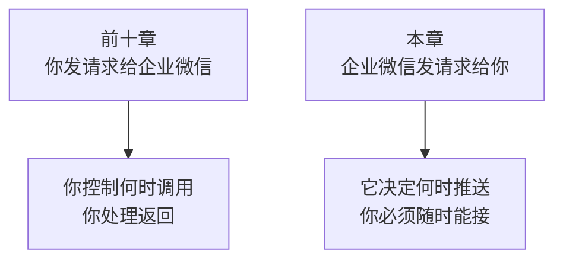

这个反转带来三个全新的问题：

| 新问题 | 原因 |
|---|---|
| 怎么确认请求真的来自企业微信 | 你的地址是公开的，任何人都能发请求 |
| 内容怎么保密 | 数据经过公网传输 |
| 同一事件被推送多次怎么办 | 企业微信在没收到响应时会重试 |

这三个问题分别对应验签、解密、幂等，是本章的主线。

## 版本地图

| 版本 | 主题 | 解决上一版什么问题 |
|---|---|---|
| V1 | 能接收请求并留痕 | —— |
| V2 | URL 验证 | 后台无法保存配置 |
| V3 | 验签 | 任何人都能伪造推送 |
| V4 | 解密 | 内容是密文看不懂 |
| V5 | 解析事件 | 不知道发生了什么事 |
| V6 | 快速响应 | 处理慢导致重复推送 |
| V7 | 幂等 | 同一事件被处理多次 |
| V8 | 业务处理 | 收到事件但没有反应 |
| V9 | 加密回复 | 无法回复消息给成员 |
| V10 | 排查与监控 | 出问题看不出原因 |
| V11 | 集成版 | 代码零散 |

---

# V1：能接收请求并留痕

## 目标

先建一个能接住请求的入口，把收到的原始内容记下来。

## 为什么第一步是「留痕」

回调调试有一个特点：**请求由企业微信发起，你无法重放。**

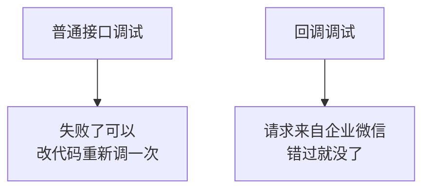

所以第一步不是写业务逻辑，而是**把原始报文完整记下来**。有了原始内容，后面的验签、解密都可以离线反复调试。

## 代码

`CallbackHandler.ashx`：

```csharp
using System;
using System.IO;
using System.Text;
using System.Web;

namespace WeComWeb
{
    /// <summary>企业微信回调入口。</summary>
    public class CallbackHandler : IHttpHandler
    {
        public void ProcessRequest(HttpContext context)
        {
            HttpRequest req = context.Request;

            // 读取原始请求体。注意编码必须指定 UTF-8
            string body = "";
            using (var reader = new StreamReader(
                req.InputStream, Encoding.UTF8))
            {
                body = reader.ReadToEnd();
            }

            // 先无条件落库，任何处理之前
            RawCallbackLogger.Save(
                req.HttpMethod,
                req.Url.Query,
                body,
                UrlHelper.GetClientIp(req));

            // 暂时原样返回，让企业微信认为收到了
            context.Response.ContentType = "text/plain";
            context.Response.Write("success");
        }

        public bool IsReusable
        {
            get { return false; }
        }
    }
}
```

## 原始报文表

```sql
IF OBJECT_ID('CallbackRaw') IS NOT NULL DROP TABLE CallbackRaw;
GO

CREATE TABLE CallbackRaw (
    Id         BIGINT IDENTITY(1,1) PRIMARY KEY,
    Method     NVARCHAR(10) NULL,
    QueryString NVARCHAR(1000) NULL,
    Body       NVARCHAR(MAX) NULL,
    ClientIp   NVARCHAR(64) NULL,
    ReceivedAt DATETIME2(0) NOT NULL DEFAULT SYSDATETIME()
);

CREATE INDEX IX_CallbackRaw_Time ON CallbackRaw (ReceivedAt DESC);
GO
```

```csharp
public static class RawCallbackLogger
{
    public static void Save(string method, string query, string body,
        string ip)
    {
        try
        {
            string connStr = System.Configuration.ConfigurationManager
                .ConnectionStrings["WeComDb"].ConnectionString;

            using (var conn = new System.Data.SqlClient.SqlConnection(connStr))
            {
                conn.Open();
                using (var cmd = new System.Data.SqlClient.SqlCommand(@"
                    INSERT INTO CallbackRaw
                        (Method, QueryString, Body, ClientIp)
                    VALUES (@M, @Q, @B, @I)", conn))
                {
                    cmd.Parameters.AddWithValue("@M", (object)method ?? DBNull.Value);
                    cmd.Parameters.AddWithValue("@Q", (object)query ?? DBNull.Value);
                    cmd.Parameters.AddWithValue("@B", (object)body ?? DBNull.Value);
                    cmd.Parameters.AddWithValue("@I", (object)ip ?? DBNull.Value);
                    cmd.ExecuteNonQuery();
                }
            }
        }
        catch
        {
            // 留痕失败也不能影响响应，否则会触发企业微信重试
        }
    }
}
```

## 两个细节

### 读请求体必须指定 UTF-8

```csharp
using (var reader = new StreamReader(req.InputStream, Encoding.UTF8))
```

企业微信推送的 XML 是 UTF-8。不指定编码时，`StreamReader` 会按当前系统默认编码解析，中文会乱码。

**而且这个乱码会导致验签失败**，因为签名是基于原始内容算的。这类问题很难查，因为你会以为是签名算法写错了。

### 保留期限

原始报文里可能含成员信息，且增长很快。要设清理策略：

```sql
DELETE TOP (5000) FROM CallbackRaw
WHERE ReceivedAt < DATEADD(DAY, -30, SYSDATETIME());
```

调试期可以留久一点，稳定后缩短。

## 验证

暂时还没法验证，因为后台还没配置回调地址。这是下一版的事。

## V1 的问题

在企业微信后台填回调地址时，保存会失败。

---

# V2：URL 验证

## 目标

让后台能保存回调配置。

## 原理：为什么要有这一步

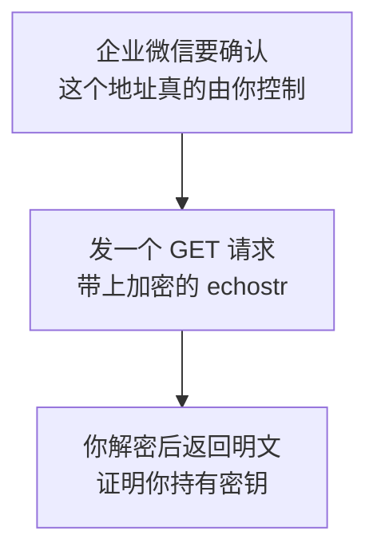

只有知道 Token 和 EncodingAESKey 的人才能正确解密并返回。这就证明了这个地址属于配置者。

**这和第 7 章的域名归属校验是同类思路**：通过「只有你能完成的动作」来证明归属。区别是这里证明的是「你持有密钥」，而不是「你控制域名」。

## 后台需要填三样东西

| 项目 | 说明 |
|---|---|
| 回调 URL | 你的 `CallbackHandler.ashx` 完整地址 |
| Token | 自己定的字符串，用于验签 |
| EncodingAESKey | 点击随机生成，43 个字符，用于加解密 |

`EncodingAESKey` 是 AES 密钥的 Base64 编码，固定 43 个字符（说明参见[事件加解密中的 EncodingAESKey](https://www.cloud.tencent.com/document/product/1095/54658)。内容已改写以符合授权要求）。

## 配置到 Web.config

```xml
<appSettings>
  <!-- 回调 Token，自己定，与后台填的一致 -->
  <add key="Callback.Token" value="你设置的Token" />
  <!-- 43 位的 EncodingAESKey，属于机密 -->
  <add key="Callback.AesKey" value="你的EncodingAESKey" />
</appSettings>
```

这两项和 Secret 一样属于机密，不能提交到代码仓库。

## GET 请求带的四个参数

```text
GET /CallbackHandler.ashx?msg_signature=xxx&timestamp=xxx&nonce=xxx&echostr=xxx
```

| 参数 | 作用 |
|---|---|
| `msg_signature` | 签名，用于验证请求来源 |
| `timestamp` | 时间戳 |
| `nonce` | 随机串 |
| `echostr` | **加密的**回显字符串 |

**注意 `echostr` 是加密的**，不能原样返回。要先解密，返回解密后的明文。

这一点和微信公众号不同——公众号的验证是原样返回 `echostr`。**又是一个不能拿公众号资料直接套的地方。**

## 处理流程

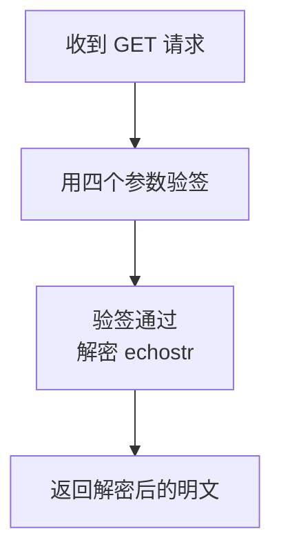

具体的验签和解密代码在 V3、V4，这里先搭好分支：

```csharp
public void ProcessRequest(HttpContext context)
{
    HttpRequest req = context.Request;
    string body = ReadBody(req);
    RawCallbackLogger.Save(req.HttpMethod, req.Url.Query, body,
        UrlHelper.GetClientIp(req));

    context.Response.ContentType = "text/plain";

    string signature = req.QueryString["msg_signature"];
    string timestamp = req.QueryString["timestamp"];
    string nonce = req.QueryString["nonce"];

    if (req.HttpMethod == "GET")
    {
        // URL 验证
        HandleVerify(context, signature, timestamp, nonce,
            req.QueryString["echostr"]);
    }
    else
    {
        // 事件推送
        HandlePush(context, signature, timestamp, nonce, body);
    }
}
```

## V2 的问题

还没有验签和解密的实现，两个分支都是空的。

---

# V3：验签

## 目标

确认请求来自企业微信。

## 原理：为什么必须验签

你的回调地址是公开的。**任何人都能往这个地址发请求。**

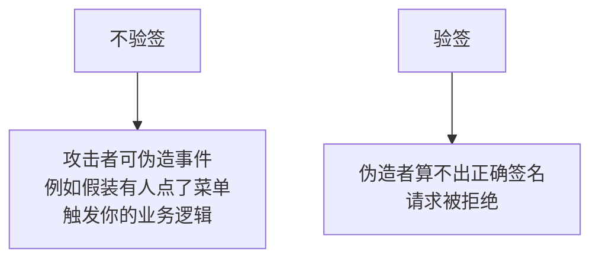

伪造能造成什么危害，取决于你的业务。如果收到某个事件会自动发通知、修改数据，伪造就能触发这些动作。

## 原理：签名算法

签名的计算方式是：

```text
把 token、timestamp、nonce、密文 这四个值
按字典序排序
直接拼接成一个字符串
做 SHA1，取小写十六进制
```

用公式表示：

```text
signature = sha1(sort(token, timestamp, nonce, encrypt))
```

排序后从小到大拼接，再做 SHA1（算法说明参见[签名校验规则](https://cloud.tencent.com/document/product/1095/51612)、[企业微信回调验签实现](https://developer.aliyun.com/article/1330166)。内容已改写以符合授权要求）。

## 为什么要排序

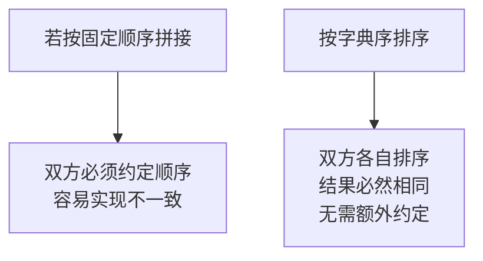

排序消除了「顺序约定」这个可能出错的环节。双方只要都做排序，就一定得到同样的拼接结果。

## 只有 Token 是秘密

四个输入里，`timestamp`、`nonce`、密文都在请求里明文可见。**只有 `token` 是双方共享的秘密。**

所以签名的安全性完全依赖 Token 的保密性。这意味着：

| 要求 | 原因 |
|---|---|
| Token 要足够长和随机 | 短的可以被穷举 |
| Token 不能泄露 | 泄露后任何人都能伪造 |
| 不要用「123456」这类值 | 后台允许你填，但等于没有防护 |

## 代码

`App_Code/WeComCrypt.cs` 第一部分：

```csharp
using System;
using System.Security.Cryptography;
using System.Text;

namespace WeComWeb
{
    /// <summary>企业微信回调的验签与加解密。</summary>
    public static partial class WeComCrypt
    {
        /// <summary>计算签名：四值字典序排序后拼接做 SHA1。</summary>
        public static string ComputeSignature(string token, string timestamp,
            string nonce, string encrypt)
        {
            string[] parts = { token, timestamp, nonce, encrypt };

            // 字典序排序。必须用 Ordinal，不能用受区域影响的默认比较
            Array.Sort(parts, StringComparer.Ordinal);

            var sb = new StringBuilder();
            foreach (string p in parts)
            {
                sb.Append(p);
            }

            using (SHA1 sha1 = SHA1.Create())
            {
                byte[] hash = sha1.ComputeHash(
                    Encoding.UTF8.GetBytes(sb.ToString()));

                var hex = new StringBuilder();
                foreach (byte b in hash)
                {
                    hex.Append(b.ToString("x2"));   // 小写
                }
                return hex.ToString();
            }
        }

        /// <summary>验签。使用定时比较，避免时序差异泄露信息。</summary>
        public static bool VerifySignature(string token, string timestamp,
            string nonce, string encrypt, string signature)
        {
            if (string.IsNullOrEmpty(signature))
            {
                return false;
            }

            string expected = ComputeSignature(token, timestamp, nonce, encrypt);
            return FixedTimeEquals(expected, signature);
        }

        /// <summary>逐字符比较且不提前返回，减少时序信息泄露。</summary>
        private static bool FixedTimeEquals(string a, string b)
        {
            if (a == null || b == null || a.Length != b.Length)
            {
                return false;
            }

            int diff = 0;
            for (int i = 0; i < a.Length; i++)
            {
                diff |= a[i] ^ b[i];
            }
            return diff == 0;
        }
    }
}
```

## 两个容易忽略的点

### 排序必须用 `StringComparer.Ordinal`

```csharp
Array.Sort(parts, StringComparer.Ordinal);
```

`Array.Sort` 的默认比较受当前区域文化影响，不同服务器可能排出不同结果。

`Ordinal` 是按字符编码值比较，结果与区域设置无关。**这类问题在本地测不出来，上线到不同区域设置的服务器才暴露。**

这和第 10 章 `CultureInfo.InvariantCulture` 是同一类问题：**凡是参与协议计算的东西，都要用与区域无关的方式处理。**

### 为什么用定时比较

```csharp
int diff = 0;
for (int i = 0; i < a.Length; i++) { diff |= a[i] ^ b[i]; }
```

直接用 `==` 比较字符串时，实现通常会在遇到第一个不同字符时立即返回。攻击者通过测量响应时间的细微差异，理论上能逐位推测出正确签名。

这种攻击在实践中很难实施，但**写成定时比较的成本几乎为零**，属于顺手就能做的加固。

## 加上时间戳容差

签名正确但时间很旧的请求，可能是被截获后重放的：

```csharp
/// <summary>检查时间戳是否在容差范围内。</summary>
public static bool IsTimestampValid(string timestamp, int toleranceMinutes = 10)
{
    long seconds;
    if (!long.TryParse(timestamp, out seconds))
    {
        return false;
    }

    DateTime t = new DateTime(1970, 1, 1, 0, 0, 0, DateTimeKind.Utc)
        .AddSeconds(seconds);

    // 两个方向都要检查：过旧可能是重放，过新可能是时钟异常
    double diff = Math.Abs((DateTime.UtcNow - t).TotalMinutes);
    return diff <= toleranceMinutes;
}
```

容差不能太小，因为服务器和企业微信的时钟可能有偏差，网络也有延迟。10 分钟是个稳妥的值。

## V3 的问题

验签通过了，但内容是一串 Base64 密文，看不懂。

---

# V4：解密

## 目标

把密文还原成 XML。

## 原理：为什么要加密

回调内容经过公网传输，可能包含成员 UserId、消息内容这类信息。

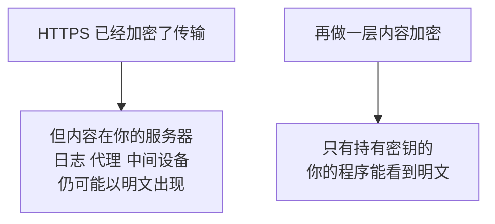

这叫端到端加密：**保护范围不止于传输过程。**

## 密钥的来历

`EncodingAESKey` 是 43 个字符。真正的 AES 密钥是它 Base64 解码后的 32 字节：

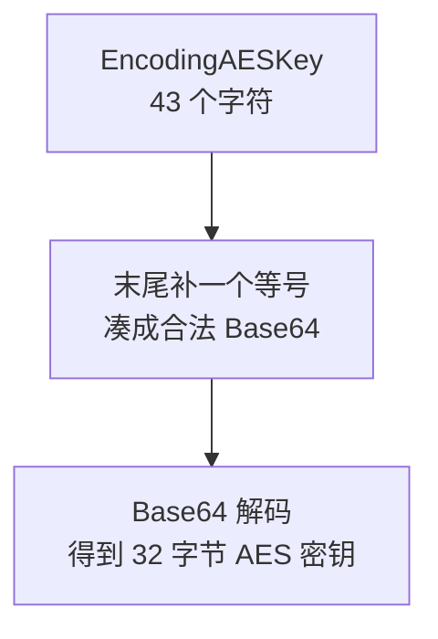

为什么要补等号：Base64 编码的长度必须是 4 的倍数，43 不是，补一个 `=` 变成 44。

## 加密参数

| 项目 | 值 |
|---|---|
| 算法 | AES-256 |
| 模式 | CBC |
| 密钥 | 32 字节，由 EncodingAESKey 解出 |
| 初始向量 IV | **密钥的前 16 字节** |
| 填充 | PKCS7，但按 32 字节对齐 |

**IV 直接取密钥前 16 字节**，这是企业微信的约定，不是通用做法。

## 解密后的结构

这是本节最关键的部分。解密得到的不是直接的 XML，而是一个复合结构：

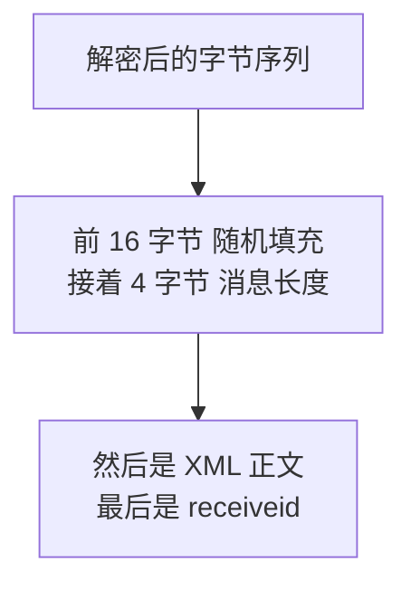

四段的含义：

| 段 | 长度 | 含义 |
|---|---|---|
| 随机数 | 16 字节 | 让相同内容每次加密结果不同 |
| 消息长度 | 4 字节 | **网络字节序**，即大端 |
| XML 正文 | 由上一段决定 | 真正的内容 |
| receiveid | 剩余部分 | 企业 ID，用于校验 |

## 为什么开头要放 16 字节随机数

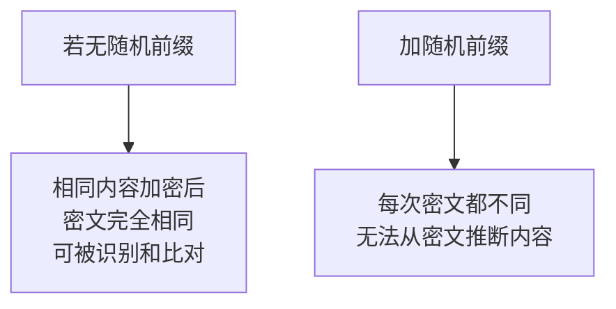

## 消息长度为什么是网络字节序

不同 CPU 存储多字节整数的顺序不同（大端和小端）。网络协议统一用大端，避免跨平台歧义。

**x86 的 CPU 是小端**，所以 C# 里读出来必须转换，不能直接用 `BitConverter.ToInt32`。

## 代码

`App_Code/WeComCrypt.cs` 第二部分：

```csharp
using System;
using System.Configuration;
using System.IO;
using System.Net;
using System.Security.Cryptography;
using System.Text;

namespace WeComWeb
{
    public static partial class WeComCrypt
    {
        /// <summary>从配置取 32 字节 AES 密钥。</summary>
        private static byte[] GetAesKey()
        {
            string encodingAesKey =
                ConfigurationManager.AppSettings["Callback.AesKey"];

            if (string.IsNullOrEmpty(encodingAesKey)
                || encodingAesKey.Length != 43)
            {
                throw new InvalidOperationException(
                    "EncodingAESKey 未配置或长度不是 43 位");
            }

            // 补一个等号凑成合法 Base64，解出 32 字节
            byte[] key = Convert.FromBase64String(encodingAesKey + "=");
            if (key.Length != 32)
            {
                throw new InvalidOperationException("AES 密钥长度不是 32 字节");
            }
            return key;
        }

        /// <summary>解密并校验 receiveid，返回 XML 明文。</summary>
        public static string Decrypt(string base64Cipher, string expectedCorpId)
        {
            byte[] key = GetAesKey();
            byte[] cipher = Convert.FromBase64String(base64Cipher);

            byte[] plain = AesDecrypt(cipher, key);

            // 去掉 PKCS7 填充
            plain = RemovePadding(plain);

            if (plain.Length < 20)
            {
                throw new InvalidOperationException("解密后内容过短");
            }

            // 第 16 到 20 字节是消息长度，网络字节序
            int msgLen = IPAddress.NetworkToHostOrder(
                BitConverter.ToInt32(plain, 16));

            if (msgLen < 0 || 20 + msgLen > plain.Length)
            {
                throw new InvalidOperationException("消息长度字段不合法");
            }

            string xml = Encoding.UTF8.GetString(plain, 20, msgLen);

            // 剩余部分是 receiveid
            string receiveId = Encoding.UTF8.GetString(
                plain, 20 + msgLen, plain.Length - 20 - msgLen);

            // 必须校验：确认这条消息是发给本企业的
            if (!string.IsNullOrEmpty(expectedCorpId)
                && !string.Equals(receiveId, expectedCorpId,
                    StringComparison.Ordinal))
            {
                throw new InvalidOperationException(
                    "receiveid 校验失败，该消息不属于本企业");
            }

            return xml;
        }

        private static byte[] AesDecrypt(byte[] cipher, byte[] key)
        {
            using (var aes = new RijndaelManaged())
            {
                aes.KeySize = 256;
                // AES 的分组长度固定 128 位。写成 256 就变成 Rijndael 而非 AES
                aes.BlockSize = 128;
                aes.Mode = CipherMode.CBC;
                // 填充自己处理，因为企业微信按 32 字节对齐而非标准的 16
                aes.Padding = PaddingMode.None;
                aes.Key = key;

                // IV 取密钥前 16 字节，这是企业微信的约定
                var iv = new byte[16];
                Array.Copy(key, 0, iv, 0, 16);
                aes.IV = iv;

                using (ICryptoTransform decryptor = aes.CreateDecryptor())
                using (var ms = new MemoryStream())
                using (var cs = new CryptoStream(ms, decryptor,
                    CryptoStreamMode.Write))
                {
                    cs.Write(cipher, 0, cipher.Length);
                    cs.FlushFinalBlock();
                    return ms.ToArray();
                }
            }
        }

        /// <summary>去掉 PKCS7 填充。填充值就是填充长度。</summary>
        private static byte[] RemovePadding(byte[] data)
        {
            if (data == null || data.Length == 0)
            {
                return data;
            }

            int pad = data[data.Length - 1];

            // 合法范围是 1 到 32，超出说明不是填充
            if (pad < 1 || pad > 32 || pad > data.Length)
            {
                return data;
            }

            var result = new byte[data.Length - pad];
            Array.Copy(data, 0, result, 0, result.Length);
            return result;
        }
    }
}
```

## 三个必须注意的实现细节

### `BlockSize` 必须是 128

```csharp
aes.BlockSize = 128;
```

AES 标准规定分组长度固定为 128 位，密钥长度可以是 128、192、256 位。

`RijndaelManaged` 支持 256 位分组，但那已经不是 AES 了，是 Rijndael 的其他变体。**写成 256 会解密失败，而错误信息只是「填充无效」之类，很难联想到这里。**

### 填充要自己处理

```csharp
aes.Padding = PaddingMode.None;
```

企业微信的参考实现按 **32 字节**对齐做 PKCS7 填充，而 .NET 的 `PaddingMode.PKCS7` 按分组长度即 16 字节处理。

两者不一致，所以关掉自动填充，自己按 32 的规则去除。

### `receiveid` 校验不能省

```csharp
if (!string.Equals(receiveId, expectedCorpId, StringComparison.Ordinal))
```

它确认这条消息确实是发给你的企业的。

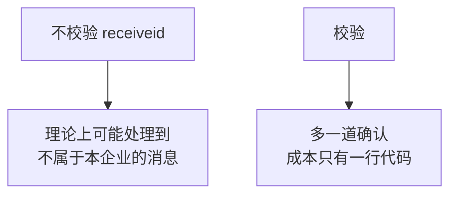

## URL 验证的实现

现在可以补上 V2 的空分支了：

```csharp
private void HandleVerify(HttpContext context, string signature,
    string timestamp, string nonce, string echostr)
{
    string token = ConfigurationManager.AppSettings["Callback.Token"];
    string corpId = ConfigurationManager.AppSettings["WeCom.CorpId"];

    try
    {
        // echostr 本身就是密文，参与签名计算
        if (!WeComCrypt.VerifySignature(token, timestamp, nonce,
                echostr, signature))
        {
            context.Response.StatusCode = 403;
            context.Response.Write("signature error");
            return;
        }

        // 解密后返回明文，不是原样返回
        string plain = WeComCrypt.Decrypt(echostr, corpId);
        context.Response.Write(plain);
    }
    catch (Exception ex)
    {
        ApiLogger.Log("callback/verify", -1, ex.Message, 0);
        context.Response.StatusCode = 500;
        context.Response.Write("verify failed");
    }
}
```

## 验证

回到企业微信后台，填好回调 URL、Token、EncodingAESKey，点保存。

**保存成功就说明验签和解密都正确了。**这是本章第一个里程碑。

如果失败，去 `CallbackRaw` 表里看收到的请求，用 V1 存下的原始内容离线调试。

## V4 的问题

XML 拿到了，但还没解析出「发生了什么事」。

---

# V5：解析事件

## 目标

识别事件类型。

## 原理：两大类回调

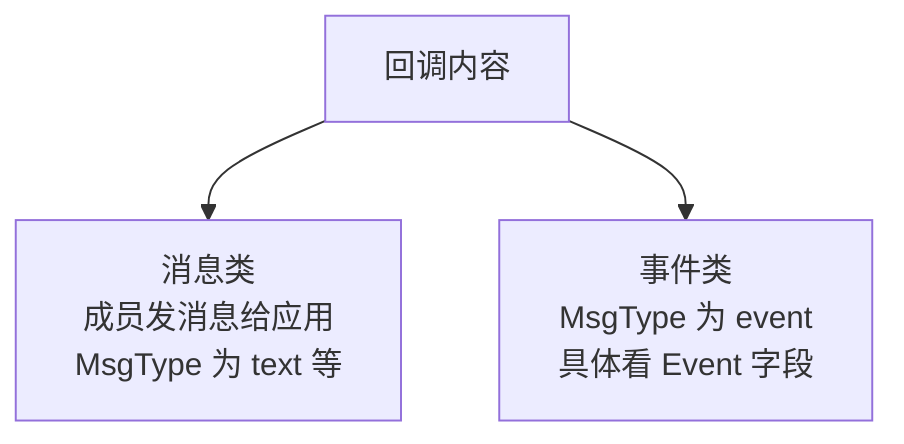

判断逻辑是两级：先看 `MsgType`，如果是 `event` 再看 `Event`。

## 常见的事件类型

| Event 值 | 含义 |
|---|---|
| `subscribe` | 成员关注应用 |
| `unsubscribe` | 取消关注 |
| `enter_agent` | 进入应用 |
| `click` | 点击菜单 |
| `view` | 点击菜单里的链接 |
| `location` | 上报位置 |
| `change_contact` | 通讯录发生变化 |

`change_contact` 还有子类型，通过 `ChangeType` 区分，例如成员新增、成员删除、部门变更。

## XML 结构示例

事件类：

```xml
<xml>
  <ToUserName>企业ID</ToUserName>
  <FromUserName>成员UserId</FromUserName>
  <CreateTime>1756345678</CreateTime>
  <MsgType>event</MsgType>
  <Event>click</Event>
  <EventKey>菜单KEY值</EventKey>
  <AgentID>1000002</AgentID>
</xml>
```

消息类会多一个 `MsgId`：

```xml
<xml>
  <ToUserName>企业ID</ToUserName>
  <FromUserName>成员UserId</FromUserName>
  <CreateTime>1756345678</CreateTime>
  <MsgType>text</MsgType>
  <Content>消息内容</Content>
  <MsgId>1234567890123456</MsgId>
  <AgentID>1000002</AgentID>
</xml>
```

**`MsgId` 的存在与否很重要**，V7 做幂等时要用它。

## 代码

`App_Code/CallbackMessage.cs`：

```csharp
using System;
using System.Xml;

namespace WeComWeb
{
    /// <summary>解析后的回调内容。</summary>
    public class CallbackMessage
    {
        public string ToUserName { get; set; }      // 企业 ID
        public string FromUserName { get; set; }    // 成员 UserId
        public long CreateTime { get; set; }
        public string MsgType { get; set; }
        public string Event { get; set; }
        public string EventKey { get; set; }
        public string ChangeType { get; set; }      // change_contact 的子类型
        public string Content { get; set; }         // 文本消息内容
        public string MsgId { get; set; }
        public string AgentId { get; set; }
        public string RawXml { get; set; }

        public bool IsEvent
        {
            get
            {
                return string.Equals(MsgType, "event",
                    StringComparison.OrdinalIgnoreCase);
            }
        }

        /// <summary>用于日志和调试的简短描述。</summary>
        public string Describe()
        {
            if (!IsEvent)
            {
                return string.Format("消息 {0} 来自 {1}", MsgType, FromUserName);
            }
            if (!string.IsNullOrEmpty(ChangeType))
            {
                return string.Format("事件 {0}/{1}", Event, ChangeType);
            }
            return string.Format("事件 {0} 来自 {1}", Event, FromUserName);
        }

        /// <summary>解析 XML。</summary>
        public static CallbackMessage Parse(string xml)
        {
            var doc = new XmlDocument();

            // 关闭外部实体解析，防止 XML 外部实体攻击
            doc.XmlResolver = null;
            doc.LoadXml(xml);

            XmlNode root = doc.DocumentElement;
            if (root == null)
            {
                throw new InvalidOperationException("XML 根节点缺失");
            }

            return new CallbackMessage
            {
                ToUserName = GetText(root, "ToUserName"),
                FromUserName = GetText(root, "FromUserName"),
                CreateTime = ParseLong(GetText(root, "CreateTime")),
                MsgType = GetText(root, "MsgType"),
                Event = GetText(root, "Event"),
                EventKey = GetText(root, "EventKey"),
                ChangeType = GetText(root, "ChangeType"),
                Content = GetText(root, "Content"),
                MsgId = GetText(root, "MsgId"),
                AgentId = GetText(root, "AgentID"),
                RawXml = xml
            };
        }

        private static string GetText(XmlNode root, string name)
        {
            XmlNode node = root.SelectSingleNode(name);
            return node == null ? null : node.InnerText;
        }

        private static long ParseLong(string s)
        {
            long v;
            return long.TryParse(s, out v) ? v : 0;
        }
    }
}
```

## 为什么要关闭 XML 外部实体

```csharp
doc.XmlResolver = null;
```

XML 规范允许文档声明外部实体，解析器会去加载它。恶意构造的 XML 可以借此读取服务器上的文件，或让服务器去访问内网地址。

这类问题叫 XML 外部实体注入。**虽然本场景的 XML 来自企业微信且已验签，但关闭它的成本只有一行**，属于该做就做的加固。

## 用 `GetText` 而不是直接取值

```csharp
XmlNode node = root.SelectSingleNode(name);
return node == null ? null : node.InnerText;
```

不同事件类型的字段不同：事件类没有 `Content`，消息类没有 `Event`。直接访问不存在的节点会抛异常。

**这和第 6 章处理企业微信 JSON 返回的思路一致：不能假设字段一定存在。**

## V6 的问题

如果在回调请求里做完整的业务处理，处理慢了企业微信会认为失败并重试。

---

# V6：快速响应

## 目标

先落库再处理，尽快返回。

## 原理：企业微信的重试机制

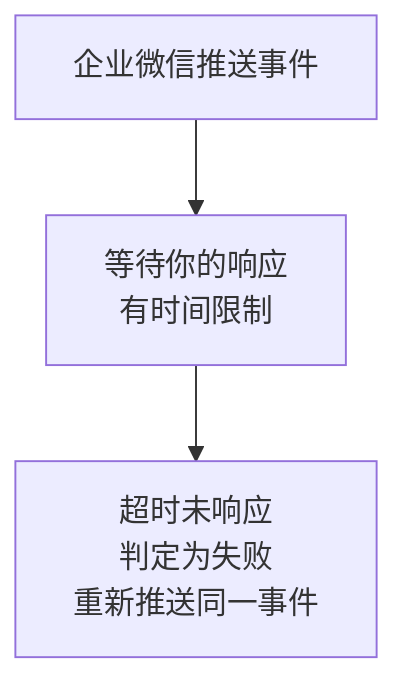

所以在回调请求里做耗时操作会引发连锁问题：

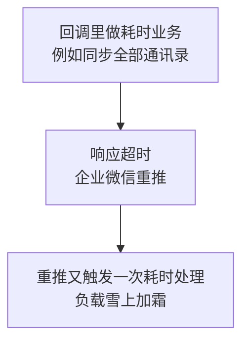

**处理越慢，重推越多，负载越高，处理更慢。**这是一个正反馈的恶性循环。

## 正确的做法：接收与处理分离

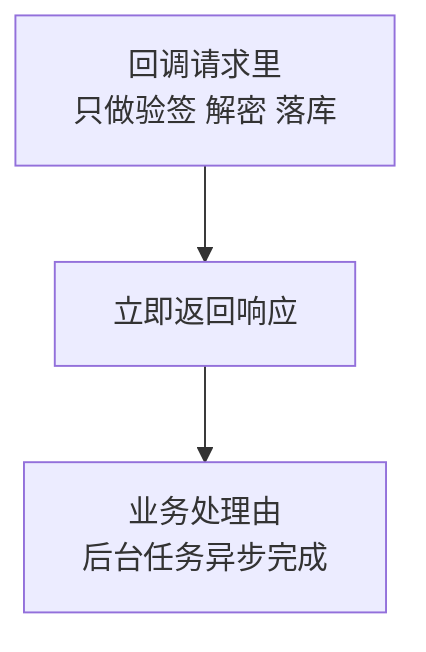

回调请求里只做三件必须做的事：验签、解密、落库。这三件都很快。

## 代码

```csharp
private void HandlePush(HttpContext context, string signature,
    string timestamp, string nonce, string body)
{
    string token = ConfigurationManager.AppSettings["Callback.Token"];
    string corpId = ConfigurationManager.AppSettings["WeCom.CorpId"];

    try
    {
        // 从外层 XML 里取出密文
        string encrypt = ExtractEncrypt(body);
        if (string.IsNullOrEmpty(encrypt))
        {
            context.Response.StatusCode = 400;
            context.Response.Write("bad request");
            return;
        }

        if (!WeComCrypt.VerifySignature(token, timestamp, nonce,
                encrypt, signature))
        {
            ApiLogger.Log("callback/push", -1, "签名校验失败", 0);
            context.Response.StatusCode = 403;
            context.Response.Write("signature error");
            return;
        }

        if (!WeComCrypt.IsTimestampValid(timestamp))
        {
            ApiLogger.Log("callback/push", -1, "时间戳超出容差", 0);
            context.Response.StatusCode = 403;
            context.Response.Write("timestamp error");
            return;
        }

        string xml = WeComCrypt.Decrypt(encrypt, corpId);
        CallbackMessage msg = CallbackMessage.Parse(xml);

        // 只落库，不做业务处理
        CallbackRepository.Enqueue(msg);

        // 立即返回，让企业微信知道已收到
        context.Response.Write("success");
    }
    catch (Exception ex)
    {
        ApiLogger.Log("callback/push", -1, ex.Message, 0);

        // 注意这里返回 200 而不是 500，原因见下方说明
        context.Response.Write("success");
    }
}

/// <summary>从外层 XML 取出 Encrypt 节点。</summary>
private static string ExtractEncrypt(string body)
{
    if (string.IsNullOrEmpty(body))
    {
        return null;
    }
    var doc = new XmlDocument();
    doc.XmlResolver = null;
    doc.LoadXml(body);

    XmlNode node = doc.SelectSingleNode("/xml/Encrypt");
    return node == null ? null : node.InnerText;
}
```

## 一个需要判断的决策：出错时返回什么

这里有个两难：

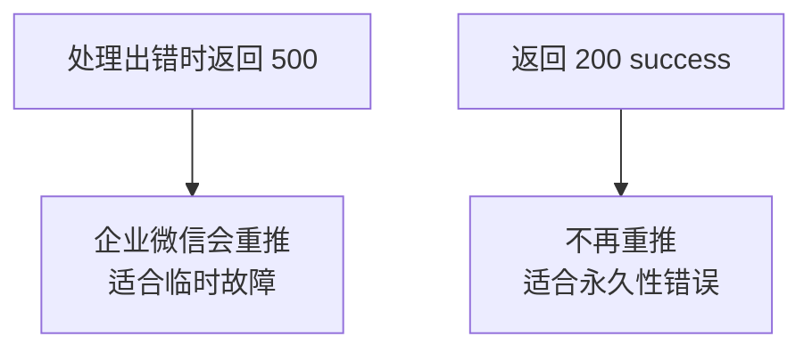

判断依据是**错误能否通过重试解决**：

| 错误类型 | 重推有用吗 | 该返回什么 |
|---|---|---|
| 数据库临时不可用 | 有用 | 500，让它重推 |
| 解密失败、XML 格式错 | 没用 | 200，避免无意义重推 |
| 签名错误 | 没用 | 403 |

上面代码统一返回 `success` 是**保守选择**：宁可漏掉一个事件，也不要因为一个坏消息被反复推送而拖垮服务。

更精细的做法是区分异常类型：

```csharp
catch (SqlException)
{
    // 数据库问题是临时的，让企业微信重推
    context.Response.StatusCode = 500;
    context.Response.Write("db error");
}
catch (Exception ex)
{
    // 其他错误重推也解决不了
    ApiLogger.Log("callback/push", -1, ex.Message, 0);
    context.Response.Write("success");
}
```

**这个决策没有唯一正确答案，取决于你的事件有多重要。**如果事件必须不丢，就要返回 500 并配合幂等；如果事件只是通知性质，返回 200 更稳。

## V6 的问题

落库了，但如果企业微信重推同一个事件，会入库两条。


---

# V7：幂等

## 目标

同一个事件无论被推送几次，业务只执行一次。

## 原理：重复推送是必然会发生的

不是异常情况，而是**设计上就会出现**：

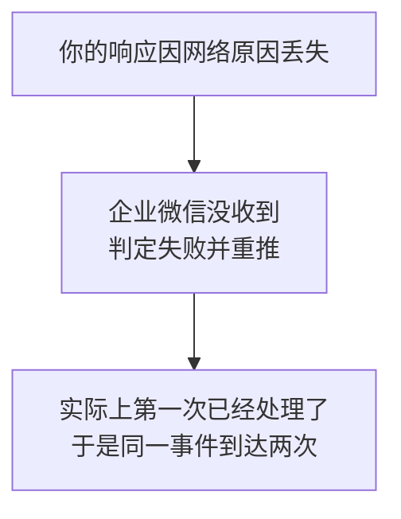

这和第 2 章讲的「超时不代表没发出去」是同一个问题的镜像：**发送方无法确认接收方是否真的收到了。**

## 危害取决于业务

| 事件触发什么 | 重复执行的后果 |
|---|---|
| 记一条日志 | 多一条记录，影响小 |
| 自动回复一条消息 | 员工收到两条 |
| 触发审批流转 | 状态错乱 |
| 扣减库存 | 数据错误 |

## 原理：幂等键怎么构造

回调里没有一个统一的全局唯一 ID，要分情况：

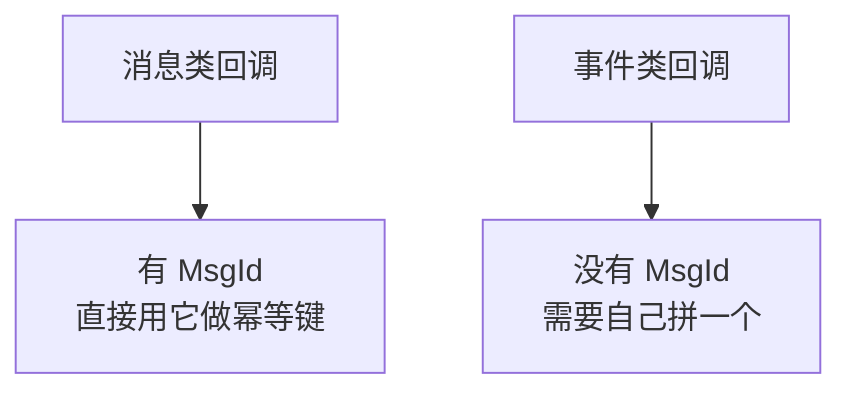

事件类的拼法：

```text
FromUserName + Event + ChangeType + CreateTime
```

例如 `zhangsan_click_1756345678`。

## 这个拼法的局限

同一秒内同一人触发同一事件两次，会被误判为重复。

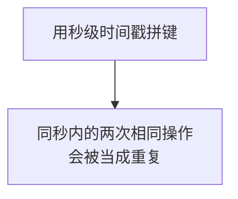

要不要接受这个局限，取决于业务：

| 场景 | 判断 |
|---|---|
| 点击菜单 | 可以接受，同秒点两次本来就是误触 |
| 上报位置 | 可以接受 |
| 需要精确计数的操作 | 不能接受，要另想办法 |

**明确知道局限，比假装没有局限更重要。**

## 代码

`App_Code/CallbackRepository.cs`：

```csharp
using System;
using System.Data;
using System.Data.SqlClient;

namespace WeComWeb
{
    public static class CallbackRepository
    {
        private static string ConnStr
        {
            get
            {
                return System.Configuration.ConfigurationManager
                    .ConnectionStrings["WeComDb"].ConnectionString;
            }
        }

        /// <summary>构造幂等键。</summary>
        public static string BuildEventKey(CallbackMessage msg)
        {
            // 消息类有 MsgId，它本身就是唯一的
            if (!string.IsNullOrEmpty(msg.MsgId))
            {
                return "msg_" + msg.MsgId;
            }

            // 事件类自己拼。注意包含 ChangeType，否则同类事件会撞键
            return string.Join("_",
                msg.FromUserName ?? "",
                msg.Event ?? "",
                msg.ChangeType ?? "",
                msg.CreateTime.ToString());
        }

        /// <summary>入队。已存在则返回 false，不算错误。</summary>
        public static bool Enqueue(CallbackMessage msg)
        {
            string eventKey = BuildEventKey(msg);

            using (var conn = new SqlConnection(ConnStr))
            {
                conn.Open();
                try
                {
                    using (var cmd = new SqlCommand(@"
                        INSERT INTO CallbackEvent
                            (EventKey, FromUser, MsgType, EventType, RawXml)
                        VALUES (@Key, @From, @Type, @Event, @Xml)", conn))
                    {
                        cmd.Parameters.Add(new SqlParameter(
                            "@Key", SqlDbType.NVarChar, 200) { Value = eventKey });
                        AddNullable(cmd, "@From", 64, msg.FromUserName);
                        AddNullable(cmd, "@Type", 32, msg.MsgType);
                        AddNullable(cmd, "@Event", 64,
                            string.IsNullOrEmpty(msg.ChangeType)
                                ? msg.Event
                                : msg.Event + "/" + msg.ChangeType);
                        cmd.Parameters.Add(new SqlParameter(
                            "@Xml", SqlDbType.NVarChar, -1)
                        {
                            Value = (object)msg.RawXml ?? DBNull.Value
                        });

                        cmd.ExecuteNonQuery();
                        return true;
                    }
                }
                catch (SqlException ex)
                {
                    // 2627 违反唯一约束，2601 违反唯一索引
                    if (ex.Number == 2627 || ex.Number == 2601)
                    {
                        // 重复推送，属于正常现象，不记为错误
                        return false;
                    }
                    throw;
                }
            }
        }

        private static void AddNullable(SqlCommand cmd, string name,
            int size, string value)
        {
            cmd.Parameters.Add(new SqlParameter(name, SqlDbType.NVarChar, size)
            {
                Value = string.IsNullOrEmpty(value)
                    ? (object)DBNull.Value
                    : value.Substring(0, Math.Min(size, value.Length))
            });
        }
    }
}
```

## 为什么用「先插入再捕获冲突」

这是第 3 章 V6 讲过的乐观插入思路：

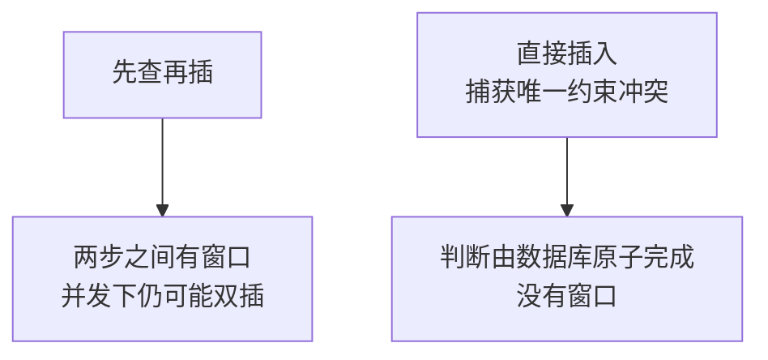

回调场景尤其需要这个，因为**重复推送很可能几乎同时到达**，先查再插的窗口足够两个请求都通过检查。

## 必须精确判断错误号

```csharp
if (ex.Number == 2627 || ex.Number == 2601)
```

不能笼统地把所有 `SqlException` 都当成重复。否则字段超长、外键约束这类真正的错误会被静默吞掉。

## 重复不是错误

```csharp
// 重复推送，属于正常现象，不记为错误
return false;
```

日志里不要把它记成错误级别，否则监控会被大量正常的重复推送淹没，真正的问题反而看不见。

## V7 的问题

事件都存进表里了，但没有任何东西去处理它们。

---

# V8：业务处理

## 目标

让事件真正触发业务动作。

## 原理：处理器的运行方式

```mermaid
graph TB
    A["事件已落库<br/>状态为待处理"] --> B["独立的处理流程<br/>定时扫描并处理"]
    B --> C["与回调请求完全解耦<br/>处理慢也不会引发重推"]
```

三种实现方式：

| 方式 | 优点 | 缺点 |
|---|---|---|
| 管理页面手工点 | 简单，便于调试 | 需要人操作 |
| 任务计划程序调用 | 无人值守 | 需要额外配置 |
| 应用内定时线程 | 不依赖外部 | 应用程序池回收会中断 |

**本教程用前两种组合**：做一个处理方法，既能页面手工触发，也能被任务计划程序调用。

## 原子领取事件

复用第 3 章 V7 的技巧：

```csharp
/// <summary>原子领取一批待处理事件。</summary>
public static List<PendingEvent> Claim(int limit = 20)
{
    var list = new List<PendingEvent>();

    using (var conn = new SqlConnection(ConnStr))
    {
        conn.Open();
        using (var cmd = new SqlCommand(string.Format(@"
            UPDATE TOP ({0}) CallbackEvent
            SET Status = 1
            OUTPUT inserted.Id, inserted.EventKey, inserted.FromUser,
                   inserted.MsgType, inserted.EventType, inserted.RawXml
            WHERE Status = 0", limit), conn))
        using (SqlDataReader r = cmd.ExecuteReader())
        {
            while (r.Read())
            {
                list.Add(new PendingEvent
                {
                    Id = Convert.ToInt64(r["Id"]),
                    EventKey = r["EventKey"] as string,
                    FromUser = r["FromUser"] as string,
                    MsgType = r["MsgType"] as string,
                    EventType = r["EventType"] as string,
                    RawXml = r["RawXml"] as string
                });
            }
        }
    }
    return list;
}
```

## 处理器

`App_Code/CallbackProcessor.cs`：

```csharp
using System;
using System.Collections.Generic;
using System.Threading.Tasks;

namespace WeComWeb
{
    public class PendingEvent
    {
        public long Id { get; set; }
        public string EventKey { get; set; }
        public string FromUser { get; set; }
        public string MsgType { get; set; }
        public string EventType { get; set; }
        public string RawXml { get; set; }
    }

    public static class CallbackProcessor
    {
        /// <summary>处理一批待处理事件，返回处理条数。</summary>
        public static async Task<int> ProcessBatchAsync(int limit = 20)
        {
            List<PendingEvent> events = CallbackRepository.Claim(limit);
            int done = 0;

            foreach (PendingEvent e in events)
            {
                try
                {
                    await HandleOneAsync(e);
                    CallbackRepository.MarkDone(e.Id, null);
                    done++;
                }
                catch (Exception ex)
                {
                    // 单个事件失败不影响其他事件
                    CallbackRepository.MarkFailed(e.Id, ex.Message);
                    ApiLogger.Log("callback/process", -1,
                        string.Format("事件 {0} 处理失败：{1}",
                            e.EventKey, ex.Message), 0);
                }
            }
            return done;
        }

        private static async Task HandleOneAsync(PendingEvent e)
        {
            CallbackMessage msg = CallbackMessage.Parse(e.RawXml);

            if (!msg.IsEvent)
            {
                await HandleMessageAsync(msg);
                return;
            }

            switch ((msg.Event ?? "").ToLowerInvariant())
            {
                case "subscribe":
                    await OnSubscribeAsync(msg);
                    break;

                case "enter_agent":
                    // 进入应用事件频率很高，通常只记录不做重活
                    break;

                case "click":
                    await OnMenuClickAsync(msg);
                    break;

                case "change_contact":
                    OnContactChanged(msg);
                    break;

                default:
                    // 未识别的事件不算失败，记录即可
                    break;
            }
        }

        /// <summary>成员关注应用时发一条欢迎消息。</summary>
        private static async Task OnSubscribeAsync(CallbackMessage msg)
        {
            if (string.IsNullOrEmpty(msg.FromUserName))
            {
                return;
            }

            await WeComApi.SendTextAsync(msg.FromUserName,
                "欢迎使用企业助手。\n"
                + "你可以在这里查询同事信息、进行位置签到。");
        }

        /// <summary>菜单点击，按 EventKey 分发。</summary>
        private static async Task OnMenuClickAsync(CallbackMessage msg)
        {
            switch (msg.EventKey)
            {
                case "MENU_HELP":
                    await WeComApi.SendTextAsync(msg.FromUserName,
                        "使用帮助：从工作台进入应用后可查询员工与签到。");
                    break;

                default:
                    break;
            }
        }

        /// <summary>通讯录变化。注意这里不做全量同步。</summary>
        private static void OnContactChanged(CallbackMessage msg)
        {
            // 只打一个标记，让同步任务稍后统一处理
            SyncFlagStore.MarkContactDirty(msg.ChangeType);
        }

        private static async Task HandleMessageAsync(CallbackMessage msg)
        {
            if (string.Equals(msg.MsgType, "text",
                    StringComparison.OrdinalIgnoreCase))
            {
                // 简单的关键词回复
                string reply = (msg.Content ?? "").Contains("帮助")
                    ? "请从工作台进入应用使用各项功能。"
                    : "已收到你的消息。";

                await WeComApi.SendTextAsync(msg.FromUserName, reply);
            }
        }
    }
}
```

## 需要给 WeComApi 补一个发消息方法

```csharp
/// <summary>发送文本消息。用应用 Secret 的 token。</summary>
public static async Task SendTextAsync(string toUser, string content)
{
    if (string.IsNullOrEmpty(toUser) || string.IsNullOrEmpty(content))
    {
        return;
    }

    string token = await GetAppTokenAsync();
    string url = string.Format("{0}/message/send?access_token={1}",
        BaseUrl, token);

    var body = new JObject();
    body["touser"] = toUser;
    body["msgtype"] = "text";
    body["agentid"] = int.Parse(
        ConfigurationManager.AppSettings["WeCom.AgentId"]);

    var text = new JObject();
    text["content"] = content;
    body["text"] = text;

    JObject result = await PostJsonAsync(url, body, "message/send");

    // 第 2 章讲过的第三层判断：errcode 为 0 也可能有人没收到
    string invalid = result.Value<string>("invaliduser");
    if (!string.IsNullOrEmpty(invalid))
    {
        ApiLogger.Log("message/send", 0,
            "以下成员未收到：" + invalid, 0);
    }
}
```

注意最后那段 `invaliduser` 检查——**第 2 章讲的三层判断在 C# 侧同样适用。**

## 一个关键设计：通讯录变化不做全量同步

```csharp
private static void OnContactChanged(CallbackMessage msg)
{
    SyncFlagStore.MarkContactDirty(msg.ChangeType);
}
```

为什么不直接调第 6 章的 `ContactSync.SyncAllAsync()`：

```mermaid
graph TB
    A["人事批量导入 50 人"] --> B["产生 50 个变更事件"]
    B --> C["若每个都触发全量同步<br/>就是 50 次全量<br/>耗时且浪费配额"]
```

正确做法是**合并**：不管收到多少个变更事件，都只打一个「通讯录已变脏」的标记，由同步任务稍后执行一次同步。

```csharp
public static class SyncFlagStore
{
    /// <summary>标记通讯录需要同步。</summary>
    public static void MarkContactDirty(string changeType)
    {
        using (var conn = new SqlConnection(ConnStr))
        {
            conn.Open();
            // 用 MERGE 保证只有一行标记
            using (var cmd = new SqlCommand(@"
                MERGE SyncFlag AS t
                USING (SELECT 'contact' AS FlagName) AS s
                    ON t.FlagName = s.FlagName
                WHEN MATCHED THEN
                    UPDATE SET IsDirty = 1, LastReason = @Reason,
                               UpdatedAt = SYSDATETIME()
                WHEN NOT MATCHED THEN
                    INSERT (FlagName, IsDirty, LastReason)
                    VALUES ('contact', 1, @Reason);", conn))
            {
                cmd.Parameters.AddWithValue("@Reason",
                    (object)changeType ?? DBNull.Value);
                cmd.ExecuteNonQuery();
            }
        }
    }
}
```

建表：

```sql
CREATE TABLE SyncFlag (
    FlagName   NVARCHAR(50) PRIMARY KEY,
    IsDirty    BIT NOT NULL DEFAULT 0,
    LastReason NVARCHAR(100) NULL,
    UpdatedAt  DATETIME2(0) NOT NULL DEFAULT SYSDATETIME()
);
```

同步任务运行时检查这个标记，为真才同步，同步完置为假。

**这个模式叫「合并触发」**：把大量的触发信号压缩成一次动作。

## V8 的问题

现在回复消息是通过主动调接口发的。企业微信还支持在回调响应里直接返回回复内容。

---

# V9：加密回复

## 目标

理解被动回复的做法及其取舍。

## 两种回复方式

```mermaid
graph TB
    A["被动回复<br/>在回调响应里返回加密 XML"] --> B["无需额外调接口<br/>但有时间和数量限制"]
    C["主动发送<br/>调 message/send"] --> D["灵活 可延迟 可多条<br/>需消耗接口调用"]
```

对比：

| | 被动回复 | 主动发送 |
|---|---|---|
| 时机 | 必须在响应里立即返回 | 任何时候 |
| 数量 | 一次只能回一条 | 不限 |
| 是否占接口配额 | 不占 | 占 |
| 能否延迟 | 不能 | 能 |
| 实现复杂度 | 需要加密 | 简单 |

## 本教程的选择：主要用主动发送

理由和 V6 一致：**回调响应要尽可能快。**

```mermaid
graph TB
    A["被动回复需要在响应前<br/>完成业务判断和加密"] --> B["拖长响应时间<br/>增加超时重推风险"]
    C["先落库快速响应<br/>之后主动发送"] --> D["响应最快<br/>业务处理不受时间压力"]
```

而且第 8 版的异步处理架构与被动回复天然冲突：事件已经落库返回了，再想回复只能主动发。

**但你需要知道被动回复怎么做**，因为某些场景下它更合适（比如要求立即响应的简单问答）。

## 加密的实现

加密是解密的逆过程：

```mermaid
graph TB
    A["16 字节随机数<br/>加 4 字节长度"] --> B["加 XML 正文<br/>加企业 ID"]
    B --> C["按 32 字节补齐<br/>AES 加密后 Base64"]
```

```csharp
using System;
using System.IO;
using System.Net;
using System.Security.Cryptography;
using System.Text;

namespace WeComWeb
{
    public static partial class WeComCrypt
    {
        private static readonly RandomNumberGenerator Rng =
            RandomNumberGenerator.Create();

        /// <summary>加密回复内容，返回 Base64 密文。</summary>
        public static string Encrypt(string xml, string corpId)
        {
            byte[] key = GetAesKey();

            byte[] msgBytes = Encoding.UTF8.GetBytes(xml);
            byte[] corpBytes = Encoding.UTF8.GetBytes(corpId);

            // 16 字节随机前缀，让相同内容每次密文不同
            var random = new byte[16];
            Rng.GetBytes(random);

            // 4 字节长度，网络字节序
            byte[] lenBytes = BitConverter.GetBytes(
                IPAddress.HostToNetworkOrder(msgBytes.Length));

            using (var ms = new MemoryStream())
            {
                ms.Write(random, 0, random.Length);
                ms.Write(lenBytes, 0, lenBytes.Length);
                ms.Write(msgBytes, 0, msgBytes.Length);
                ms.Write(corpBytes, 0, corpBytes.Length);

                byte[] plain = AddPadding(ms.ToArray());
                byte[] cipher = AesEncrypt(plain, key);
                return Convert.ToBase64String(cipher);
            }
        }

        /// <summary>PKCS7 填充，按 32 字节对齐。</summary>
        private static byte[] AddPadding(byte[] data)
        {
            const int blockSize = 32;

            int pad = blockSize - (data.Length % blockSize);
            if (pad == 0)
            {
                pad = blockSize;      // 正好对齐时也要补满一块
            }

            var result = new byte[data.Length + pad];
            Array.Copy(data, 0, result, 0, data.Length);
            for (int i = data.Length; i < result.Length; i++)
            {
                result[i] = (byte)pad;      // 填充值就是填充长度
            }
            return result;
        }

        private static byte[] AesEncrypt(byte[] plain, byte[] key)
        {
            using (var aes = new RijndaelManaged())
            {
                aes.KeySize = 256;
                aes.BlockSize = 128;          // AES 固定 128 位分组
                aes.Mode = CipherMode.CBC;
                aes.Padding = PaddingMode.None;   // 已手工填充
                aes.Key = key;

                var iv = new byte[16];
                Array.Copy(key, 0, iv, 0, 16);
                aes.IV = iv;

                using (ICryptoTransform encryptor = aes.CreateEncryptor())
                using (var ms = new MemoryStream())
                using (var cs = new CryptoStream(ms, encryptor,
                    CryptoStreamMode.Write))
                {
                    cs.Write(plain, 0, plain.Length);
                    cs.FlushFinalBlock();
                    return ms.ToArray();
                }
            }
        }
    }
}
```

## 为什么「正好对齐时也要补满一块」

```csharp
if (pad == 0) { pad = blockSize; }
```

如果数据刚好是 32 的倍数就不填充，解密方会把数据最后一个字节当成填充长度去掉，导致内容损坏。

**PKCS7 的规则是永远填充**，即使正好对齐也补满一整块。这样解密方总能通过最后一个字节判断该去掉多少。

## 组装回复报文

```csharp
/// <summary>构造加密的回复报文。</summary>
public static string BuildEncryptedReply(string replyXml, string token,
    string corpId)
{
    string encrypt = Encrypt(replyXml, corpId);

    string timestamp = ((long)(DateTime.UtcNow
        - new DateTime(1970, 1, 1)).TotalSeconds).ToString();
    string nonce = Guid.NewGuid().ToString("N").Substring(0, 10);

    // 回复的签名用同样的算法
    string signature = ComputeSignature(token, timestamp, nonce, encrypt);

    return string.Format(
        "<xml>"
        + "<Encrypt><![CDATA[{0}]]></Encrypt>"
        + "<MsgSignature><![CDATA[{1}]]></MsgSignature>"
        + "<TimeStamp>{2}</TimeStamp>"
        + "<Nonce><![CDATA[{3}]]></Nonce>"
        + "</xml>",
        encrypt, signature, timestamp, nonce);
}
```

## 内层的回复 XML

```csharp
/// <summary>构造文本回复的内层 XML。</summary>
public static string BuildTextReplyXml(string toUser, string fromCorpId,
    string content)
{
    long now = (long)(DateTime.UtcNow - new DateTime(1970, 1, 1)).TotalSeconds;

    return string.Format(
        "<xml>"
        + "<ToUserName><![CDATA[{0}]]></ToUserName>"
        + "<FromUserName><![CDATA[{1}]]></FromUserName>"
        + "<CreateTime>{2}</CreateTime>"
        + "<MsgType><![CDATA[text]]></MsgType>"
        + "<Content><![CDATA[{3}]]></Content>"
        + "</xml>",
        toUser, fromCorpId, now, content);
}
```

## 注意 `ToUserName` 和 `FromUserName` 要互换

收到的消息里，`FromUserName` 是成员，`ToUserName` 是企业。回复时正好相反：

```mermaid
graph TB
    A["收到时<br/>From 是成员 To 是企业"] --> B["回复时<br/>To 是成员 From 是企业"]
```

搞反了消息发不出去，而且不容易看出问题。

## 用 CDATA 包裹文本

```text
<Content><![CDATA[消息内容]]></Content>
```

因为消息内容可能含 `<`、`>`、`&`，直接放进 XML 会破坏结构。`CDATA` 告诉解析器这段是纯文本。

这和第 6 章 `Server.HtmlEncode` 的动机一样：**动态内容进入结构化格式前必须处理。**

## V9 的问题

出问题时只能看数据库，缺少专门的排查工具。

---

# V10：排查与监控

## 目标

建立可离线复现的排查手段。

## 手段一：离线解密工具

这是回调调试最有价值的工具。原理是利用 V1 存下的原始报文：

```mermaid
graph TB
    A["从 CallbackRaw 表<br/>取出原始密文"] --> B["粘贴到管理页面<br/>手工解密"]
    B --> C["反复调试<br/>无需等企业微信再推一次"]
```

`CallbackDebug.aspx`：

```csharp
public partial class CallbackDebug : WeComBasePage
{
    // 涉及解密，只给管理员
    protected override AppRole RequiredRole
    {
        get { return AppRole.Admin; }
    }

    protected void btnDecrypt_Click(object sender, EventArgs e)
    {
        string corpId = ConfigurationManager.AppSettings["WeCom.CorpId"];

        try
        {
            string encrypt = txtEncrypt.Text.Trim();

            // 支持直接粘贴整个外层 XML
            if (encrypt.StartsWith("<"))
            {
                var doc = new XmlDocument();
                doc.XmlResolver = null;
                doc.LoadXml(encrypt);
                XmlNode node = doc.SelectSingleNode("/xml/Encrypt");
                encrypt = node == null ? "" : node.InnerText;
            }

            string xml = WeComCrypt.Decrypt(encrypt, corpId);
            litXml.Text = Server.HtmlEncode(xml);

            CallbackMessage msg = CallbackMessage.Parse(xml);
            litParsed.Text = Server.HtmlEncode(string.Format(
                "类型：{0}\n幂等键：{1}\n描述：{2}",
                msg.MsgType,
                CallbackRepository.BuildEventKey(msg),
                msg.Describe()));
        }
        catch (Exception ex)
        {
            litXml.Text = "解密失败：" + Server.HtmlEncode(ex.Message);
        }
    }

    /// <summary>单独验签，用于确认 Token 是否正确。</summary>
    protected void btnVerify_Click(object sender, EventArgs e)
    {
        string token = ConfigurationManager.AppSettings["Callback.Token"];

        string expected = WeComCrypt.ComputeSignature(token,
            txtTimestamp.Text.Trim(), txtNonce.Text.Trim(),
            txtEncrypt.Text.Trim());

        litVerify.Text = string.Format(
            "计算得到：{0}\n收到的值：{1}\n结论：{2}",
            expected, txtSignature.Text.Trim(),
            expected == txtSignature.Text.Trim() ? "一致" : "不一致");
    }
}
```

## 为什么这个工具值得单独做

```mermaid
graph TB
    A["没有离线工具"] --> B["改一次代码<br/>要等企业微信下一次推送<br/>才能验证"]
    C["有离线工具"] --> D["同一份报文<br/>可反复调试到通过"]
```

回调的调试周期本来很长，这个工具能把它缩短到普通接口调试的水平。

## 手段二：监控积压

```sql
-- 待处理事件积压情况
SELECT Status, COUNT(*) AS 数量,
       MIN(ReceivedAt) AS 最早, MAX(ReceivedAt) AS 最近
FROM CallbackEvent
GROUP BY Status;
```

`Status` 为 0 且最早时间很久以前，说明**处理器没有在运行**。这是最需要监控的一项。

```sql
-- 卡在处理中的事件，可能是处理器崩溃了
SELECT Id, EventKey, EventType, ReceivedAt
FROM CallbackEvent
WHERE Status = 1
  AND ReceivedAt < DATEADD(MINUTE, -30, SYSDATETIME());
```

回收方式和第 4 章一样：

```sql
UPDATE CallbackEvent SET Status = 0
WHERE Status = 1 AND ReceivedAt < DATEADD(MINUTE, -30, SYSDATETIME());
```

## 手段三：重复推送率

```sql
-- 最近一天收到的原始报文数与实际入库事件数对比
SELECT
    (SELECT COUNT(*) FROM CallbackRaw
     WHERE ReceivedAt >= DATEADD(DAY, -1, SYSDATETIME())
       AND Method = 'POST') AS 收到推送数,
    (SELECT COUNT(*) FROM CallbackEvent
     WHERE ReceivedAt >= DATEADD(DAY, -1, SYSDATETIME())) AS 入库事件数;
```

两个数字的差就是被幂等拦掉的重复推送。

**如果重复率很高，说明你的响应太慢了**，要检查回调处理里是不是做了不该做的事。这个指标能直接反映 V6 的设计是否到位。

## 常见错误对照

官方加解密库定义了一组错误码，理解它们能快速定位：

| 含义 | 通常原因 |
|---|---|
| 签名验证错误 | Token 不一致，或参与签名的值取错了 |
| XML 解析失败 | 请求体不是合法 XML，或编码不对 |
| AESKey 非法 | EncodingAESKey 不是 43 位 |
| receiveid 校验错误 | 企业 ID 配置错误 |
| AES 解密失败 | 密钥错，或 `BlockSize` 设成了 256 |
| 解密后 buffer 非法 | 填充处理有误 |

## 排查顺序

```mermaid
graph TB
    A["第一步<br/>CallbackRaw 里有记录吗"] --> B["没有<br/>请求没到达服务器"]
    A --> C["有<br/>用离线工具验签"]
    C --> D["验签失败<br/>查 Token"]
    C --> E["验签通过<br/>查解密"]
```

第一步的判断很关键：**如果 `CallbackRaw` 里连记录都没有，问题在网络、证书或 IIS，与加解密无关。**这能立刻排除一大类可能。

---

# V11：集成版

## 完整入口

`CallbackHandler.ashx`：

```csharp
using System;
using System.Configuration;
using System.IO;
using System.Text;
using System.Web;
using System.Xml;

namespace WeComWeb
{
    /// <summary>企业微信回调入口。
    ///
    /// 设计要点：
    ///   1. 无条件先留痕，便于离线调试
    ///   2. 只做验签、解密、落库，不做业务处理
    ///   3. 幂等靠数据库唯一约束，重复推送不算错误
    ///   4. 尽快返回，避免超时导致重推
    /// </summary>
    public class CallbackHandler : IHttpHandler
    {
        public void ProcessRequest(HttpContext context)
        {
            HttpRequest req = context.Request;
            HttpResponse resp = context.Response;

            resp.ContentType = "text/plain";
            resp.Cache.SetCacheability(HttpCacheability.NoCache);

            string body = ReadBody(req);

            // 第一件事：留痕。失败也不影响后续
            RawCallbackLogger.Save(req.HttpMethod, req.Url.Query, body,
                UrlHelper.GetClientIp(req));

            string signature = req.QueryString["msg_signature"];
            string timestamp = req.QueryString["timestamp"];
            string nonce = req.QueryString["nonce"];

            if (string.Equals(req.HttpMethod, "GET",
                    StringComparison.OrdinalIgnoreCase))
            {
                HandleVerify(context, signature, timestamp, nonce,
                    req.QueryString["echostr"]);
            }
            else
            {
                HandlePush(context, signature, timestamp, nonce, body);
            }
        }

        private static string ReadBody(HttpRequest req)
        {
            try
            {
                // 必须指定 UTF-8，否则中文乱码并导致验签失败
                using (var reader = new StreamReader(
                    req.InputStream, Encoding.UTF8))
                {
                    return reader.ReadToEnd();
                }
            }
            catch
            {
                return "";
            }
        }

        /// <summary>URL 验证：解密 echostr 并返回明文。</summary>
        private void HandleVerify(HttpContext context, string signature,
            string timestamp, string nonce, string echostr)
        {
            string token = ConfigurationManager.AppSettings["Callback.Token"];
            string corpId = ConfigurationManager.AppSettings["WeCom.CorpId"];

            try
            {
                if (string.IsNullOrEmpty(echostr))
                {
                    context.Response.StatusCode = 400;
                    context.Response.Write("missing echostr");
                    return;
                }

                if (!WeComCrypt.VerifySignature(token, timestamp, nonce,
                        echostr, signature))
                {
                    ApiLogger.Log("callback/verify", -1, "签名校验失败", 0);
                    context.Response.StatusCode = 403;
                    context.Response.Write("signature error");
                    return;
                }

                // 注意：与公众号不同，这里要返回解密后的明文
                context.Response.Write(WeComCrypt.Decrypt(echostr, corpId));
            }
            catch (Exception ex)
            {
                ApiLogger.Log("callback/verify", -1, ex.Message, 0);
                context.Response.StatusCode = 500;
                context.Response.Write("verify failed");
            }
        }

        /// <summary>事件推送：验签、解密、落库，快速返回。</summary>
        private void HandlePush(HttpContext context, string signature,
            string timestamp, string nonce, string body)
        {
            string token = ConfigurationManager.AppSettings["Callback.Token"];
            string corpId = ConfigurationManager.AppSettings["WeCom.CorpId"];

            try
            {
                string encrypt = ExtractEncrypt(body);
                if (string.IsNullOrEmpty(encrypt))
                {
                    context.Response.StatusCode = 400;
                    context.Response.Write("bad request");
                    return;
                }

                if (!WeComCrypt.VerifySignature(token, timestamp, nonce,
                        encrypt, signature))
                {
                    ApiLogger.Log("callback/push", -1, "签名校验失败", 0);
                    context.Response.StatusCode = 403;
                    context.Response.Write("signature error");
                    return;
                }

                if (!WeComCrypt.IsTimestampValid(timestamp))
                {
                    ApiLogger.Log("callback/push", -1, "时间戳超出容差", 0);
                    context.Response.StatusCode = 403;
                    context.Response.Write("timestamp error");
                    return;
                }

                string xml = WeComCrypt.Decrypt(encrypt, corpId);
                CallbackMessage msg = CallbackMessage.Parse(xml);

                bool inserted = CallbackRepository.Enqueue(msg);

                // 重复推送是正常现象，不记为错误
                if (!inserted)
                {
                    ApiLogger.Log("callback/push", 0,
                        "重复推送已忽略：" + msg.Describe(), 0);
                }

                context.Response.Write("success");
            }
            catch (System.Data.SqlClient.SqlException ex)
            {
                // 数据库问题是临时的，返回 500 让企业微信重推
                ApiLogger.Log("callback/push", -1, "数据库错误：" + ex.Message, 0);
                context.Response.StatusCode = 500;
                context.Response.Write("db error");
            }
            catch (Exception ex)
            {
                // 其他错误重推也解决不了，返回 200 避免无意义重试
                ApiLogger.Log("callback/push", -1, ex.Message, 0);
                context.Response.Write("success");
            }
        }

        private static string ExtractEncrypt(string body)
        {
            if (string.IsNullOrEmpty(body))
            {
                return null;
            }
            try
            {
                var doc = new XmlDocument();
                doc.XmlResolver = null;      // 防 XML 外部实体
                doc.LoadXml(body);
                XmlNode node = doc.SelectSingleNode("/xml/Encrypt");
                return node == null ? null : node.InnerText;
            }
            catch
            {
                return null;
            }
        }

        public bool IsReusable
        {
            get { return false; }
        }
    }
}
```

## 处理器的触发

管理页面手工触发：

```csharp
protected void btnProcess_Click(object sender, EventArgs e)
{
    RegisterAsyncTask(new PageAsyncTask(async () =>
    {
        int n = await CallbackProcessor.ProcessBatchAsync(50);
        litResult.Text = string.Format("已处理 {0} 条事件", n);
    }));
}
```

任务计划程序调用一个专门的处理页面，或用第 4 章那种独立程序的思路。

## 完整流程

```mermaid
graph TB
    A["企业微信推送事件"] --> B["留痕 验签 解密"]
    B --> C["幂等入库<br/>立即返回 success"]
    C --> D["处理器异步领取"]
    D --> E["按事件类型执行业务"]
```

## 文件清单

```text
App_Code/
├── WeComCrypt.cs             验签、解密、加密
├── CallbackMessage.cs        XML 解析
├── CallbackRepository.cs     幂等入库、原子领取
├── CallbackProcessor.cs      业务处理
├── RawCallbackLogger.cs      原始报文留痕
└── SyncFlagStore.cs          同步标记

CallbackHandler.ashx          回调入口
CallbackDebug.aspx            离线调试（仅管理员）
CallbackAdmin.aspx            事件列表与手工处理
```

---

# 本章自测

| 测试 | 做法 | 期望结果 |
|---|---|---|
| 1 留痕 | 后台点保存回调配置 | `CallbackRaw` 有 GET 记录 |
| 2 URL 验证 | 保存回调配置 | 保存成功 |
| 3 验签拦截 | 手工用错误签名请求回调地址 | 返回 403 |
| 4 时间戳容差 | 用很旧的时间戳请求 | 被拒绝 |
| 5 收到事件 | 在企业微信里进入应用 | `CallbackEvent` 有记录 |
| 6 解密正确 | 查看 `RawXml` 字段 | 是可读的 XML，中文正常 |
| 7 幂等 | 用同一份报文重复请求两次 | 只入库一条 |
| 8 幂等不报错 | 同上 | 日志里不是错误级别 |
| 9 快速响应 | 观察响应时间 | 明显小于超时阈值 |
| 10 业务处理 | 手工触发处理器 | 事件状态变为已处理 |
| 11 自动回复 | 关注应用 | 收到欢迎消息 |
| 12 合并触发 | 后台连续改几个成员 | 只产生一个同步标记 |
| 13 离线解密 | 从 `CallbackRaw` 复制密文到调试页 | 能解出 XML |
| 14 离线验签 | 用调试页验签 | 结论为一致 |
| 15 卡死回收 | 手工把事件设为处理中且时间很早 | 回收后变回待处理 |
| 16 重复率 | 运行一天后查对比 | 重复数在合理范围 |

第 7 项和第 13 项最能体现本章的两个核心设计：**幂等**和**可离线复现**。

# 错误排查

| 现象 | 原因 | 解决 |
|---|---|---|
| 后台保存失败 | 签名或解密不对 | 用离线工具逐段验证 |
| 后台保存失败 | 原样返回了 echostr | 必须返回解密后的明文 |
| `CallbackRaw` 无记录 | 请求未到达 | 查域名、证书、防火墙 |
| 验签总是失败 | Token 与后台不一致 | 核对配置 |
| 验签总是失败 | 读请求体未指定 UTF-8 | 明确指定编码 |
| 验签总是失败 | 排序用了区域相关比较 | 改用 `StringComparer.Ordinal` |
| 解密失败 | `BlockSize` 设成了 256 | 改为 128 |
| 解密失败 | 用了标准 PKCS7 填充 | 关掉自动填充，按 32 处理 |
| 解密后乱码 | 编码处理有误 | 统一 UTF-8 |
| receiveid 校验失败 | 企业 ID 配置错 | 核对 CorpId |
| 事件重复处理 | 幂等键构造有误 | 检查是否包含 ChangeType |
| 事件一直待处理 | 处理器没运行 | 检查任务计划或手工触发 |
| 重复推送非常多 | 响应太慢 | 确认回调里没做耗时操作 |
| 回复消息发不出 | To 和 From 没互换 | 回复时要对调 |

# 完成标准

## 理解部分

- [ ] 本章与前十章在方向上有什么根本不同
- [ ] URL 验证为什么要解密 echostr，而不是原样返回
- [ ] 签名算法为什么要先排序
- [ ] 四个签名输入里，哪一个是秘密
- [ ] 为什么已经有 HTTPS 还要对内容加密
- [ ] 解密后的四段结构分别是什么
- [ ] 为什么开头要放 16 字节随机数
- [ ] `receiveid` 校验的作用是什么
- [ ] 为什么回调里不能做耗时的业务处理
- [ ] 重复推送为什么是必然会发生的
- [ ] 通讯录变更为什么不直接触发全量同步
- [ ] 出错时返回 200 和 500 的判断依据是什么

## 操作部分

- [ ] 16 项自测全部通过
- [ ] 后台回调配置保存成功
- [ ] 能收到并解密事件
- [ ] 重复推送不会重复处理
- [ ] 离线调试工具可用

# 与前面章节的呼应

| 本章做法 | 依据 |
|---|---|
| 乐观插入捕获唯一约束冲突 | 第 3 章 V6 |
| `UPDATE ... OUTPUT` 原子领取 | 第 3 章 V7 |
| 卡死事件超时回收 | 第 4 章 V6 |
| 发消息后检查 `invaliduser` | 第 2 章 V3 |
| 排序与格式化用区域无关方式 | 第 10 章的 `InvariantCulture` |
| 管理功能限制角色 | 第 8 章 V11 |

**第 3 章设计的 `CallbackEvent` 表和唯一事件键，到本章才真正用上。**当时看起来是超前设计，现在可以看到它解决的是一个必然会遇到的问题。

# 下一章

第 12 章是最后一章：部署与故障排查。会把 Python 程序和 WebForms 应用的上线要点、安全检查、错误码速查表整理成可执行的清单。
